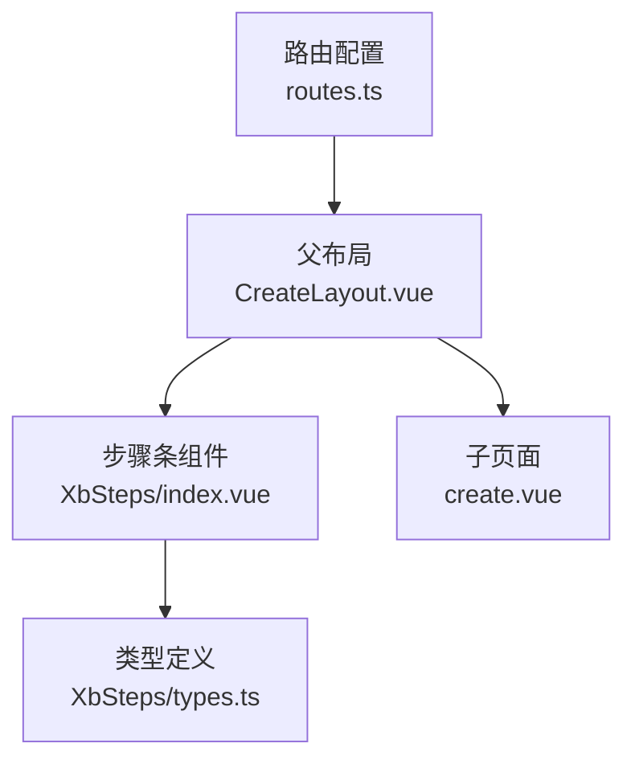
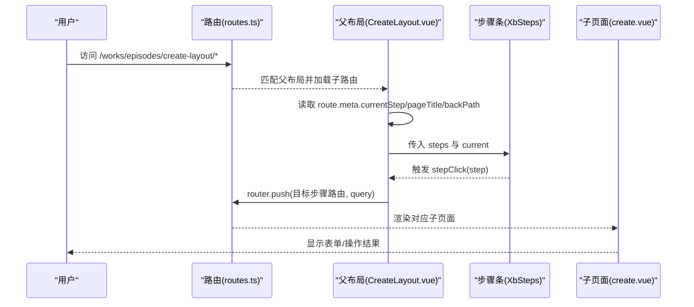
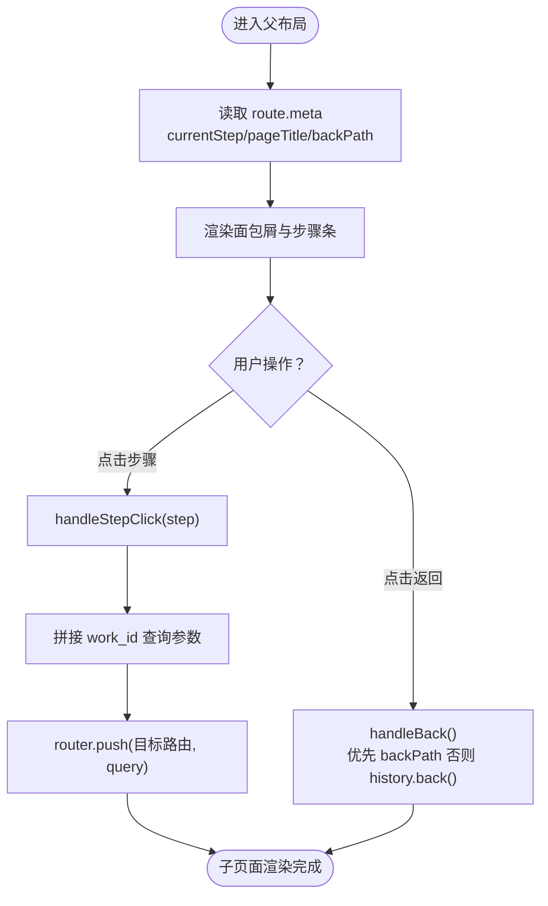
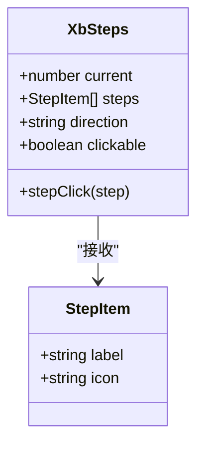
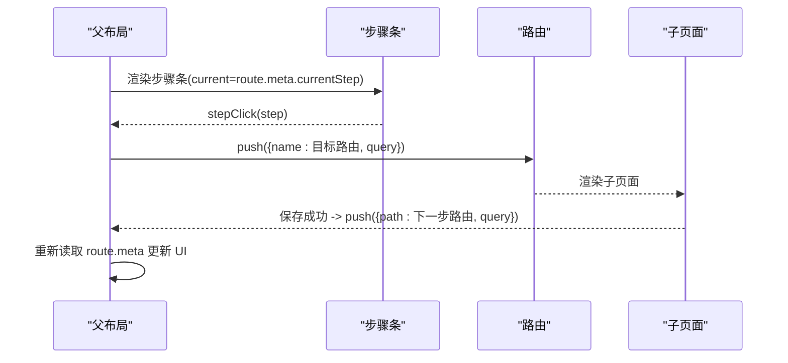
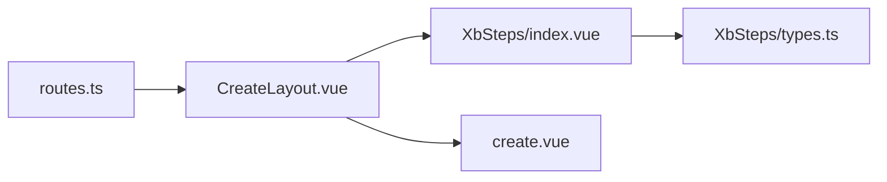

# 布局系统

<cite>
**本文引用的文件**
- [routes.ts](file://frontend/src/router/routes.ts)
- [CreateLayout.vue](file://frontend/src/views/EpisodesPage/CreateLayout.vue)
- [XbSteps/index.vue](file://frontend/src/xbUi/XbSteps/index.vue)
- [XbSteps/types.ts](file://frontend/src/xbUi/XbSteps/types.ts)
- [create.vue](file://frontend/src/views/EpisodesPage/create.vue)
</cite>

## 目录
1. [简介](#简介)
2. [项目结构](#项目结构)
3. [核心组件](#核心组件)
4. [架构总览](#架构总览)
5. [详细组件分析](#详细组件分析)
6. [依赖关系分析](#依赖关系分析)
7. [性能与可维护性建议](#性能与可维护性建议)
8. [故障排查指南](#故障排查指南)
9. [结论](#结论)
10. [附录：开发示例与最佳实践](#附录开发示例与最佳实践)

## 简介
本文件围绕“协作创作布局系统”展开，聚焦多步骤工作流在剧集创作场景中的落地实现。重点解析 CreateLayout 组件的架构设计、步骤导航与面包屑导航、路由元数据驱动的状态同步机制，以及 XbSteps 组件的集成方式。文档同时提供完整的开发示例与最佳实践，帮助读者快速搭建可扩展的多步骤页面体系。

## 项目结构
该功能位于前端工程的路由与视图层，采用“父容器 + 子路由”的模式组织多步骤流程：
- 路由定义集中管理，通过 meta 字段声明当前步骤、页面标题与返回路径等元信息
- 父级布局 CreateLayout 负责渲染步骤条、面包屑与子页面内容
- 子页面（如 create.vue）专注于业务表单与交互逻辑

图表来源
- [routes.ts:71-106](file://frontend/src/router/routes.ts#L71-L106)
- [CreateLayout.vue:1-71](file://frontend/src/views/EpisodesPage/CreateLayout.vue#L1-L71)
- [XbSteps/index.vue:1-90](file://frontend/src/xbUi/XbSteps/index.vue#L1-L90)
- [XbSteps/types.ts:1-6](file://frontend/src/xbUi/XbSteps/types.ts#L1-L6)
- [create.vue:1-215](file://frontend/src/views/EpisodesPage/create.vue#L1-L215)

章节来源
- [routes.ts:71-106](file://frontend/src/router/routes.ts#L71-L106)
- [CreateLayout.vue:1-71](file://frontend/src/views/EpisodesPage/CreateLayout.vue#L1-L71)
- [XbSteps/index.vue:1-90](file://frontend/src/xbUi/XbSteps/index.vue#L1-L90)
- [XbSteps/types.ts:1-6](file://frontend/src/xbUi/XbSteps/types.ts#L1-L6)
- [create.vue:1-215](file://frontend/src/views/EpisodesPage/create.vue#L1-L215)

## 核心组件
- CreateLayout 父布局
  - 职责：读取路由元数据，计算当前步骤与页面标题；渲染面包屑与步骤条；承载子页面内容
  - 关键能力：步骤切换、返回路径处理、动态标题更新
- XbSteps 步骤条
  - 职责：展示步骤状态（未完成/进行中/已完成），支持点击跳转
  - 关键能力：方向控制、可点击策略、事件回调
- 路由元数据
  - 职责：声明每个步骤的 currentStep、pageTitle、backPath 等
  - 关键能力：驱动 UI 状态与行为，解耦业务与展示

章节来源
- [CreateLayout.vue:1-71](file://frontend/src/views/EpisodesPage/CreateLayout.vue#L1-L71)
- [XbSteps/index.vue:1-90](file://frontend/src/xbUi/XbSteps/index.vue#L1-L90)
- [routes.ts:71-106](file://frontend/src/router/routes.ts#L71-L106)

## 架构总览
下图展示了从路由到 UI 的完整调用链与数据流向：

图表来源
- [routes.ts:71-106](file://frontend/src/router/routes.ts#L71-L106)
- [CreateLayout.vue:1-71](file://frontend/src/views/EpisodesPage/CreateLayout.vue#L1-L71)
- [XbSteps/index.vue:1-90](file://frontend/src/xbUi/XbSteps/index.vue#L1-L90)
- [create.vue:1-215](file://frontend/src/views/EpisodesPage/create.vue#L1-L215)

## 详细组件分析

### CreateLayout 父布局
- 步骤导航系统
  - 通过 computed 从 route.meta 提取 currentStep、pageTitle、backPath，保证 UI 与路由状态一致
  - handleStepClick 根据点击的步骤编号，使用 router.push 跳转到对应命名路由，并透传 work_id 查询参数
- 面包屑导航
  - 左侧返回按钮优先使用 backPath 进行跳转，否则回退浏览器历史
  - 面包屑文本由 pageTitle 动态生成，体现当前步骤语义
- 路由状态管理
  - 所有步骤的 currentStep、pageTitle、backPath 均在 routes.ts 中集中声明，避免分散维护
  - 父布局仅做“读取与转发”，不持有额外状态，降低耦合

图表来源
- [CreateLayout.vue:1-71](file://frontend/src/views/EpisodesPage/CreateLayout.vue#L1-L71)
- [routes.ts:71-106](file://frontend/src/router/routes.ts#L71-L106)

章节来源
- [CreateLayout.vue:1-71](file://frontend/src/views/EpisodesPage/CreateLayout.vue#L1-L71)
- [routes.ts:71-106](file://frontend/src/router/routes.ts#L71-L106)

### XbSteps 步骤条组件
- 属性与事件
  - current：当前激活步骤（1 起始）
  - steps：步骤项数组，包含 label 与可选 icon
  - direction：水平或垂直布局
  - clickable：是否允许点击任意步骤
  - stepClick：点击步骤时触发，携带目标步骤编号
- 交互策略
  - 当 clickable 为 true 或目标步骤已完成后，允许点击并触发 stepClick
  - 未完成的非当前步骤默认不可点击，防止越权跳转
- 视觉状态
  - 已完成：显示图标（默认对勾）
  - 进行中：高亮样式
  - 未完成：中性样式

图表来源
- [XbSteps/index.vue:1-90](file://frontend/src/xbUi/XbSteps/index.vue#L1-L90)
- [XbSteps/types.ts:1-6](file://frontend/src/xbUi/XbSteps/types.ts#L1-L6)

章节来源
- [XbSteps/index.vue:1-90](file://frontend/src/xbUi/XbSteps/index.vue#L1-L90)
- [XbSteps/types.ts:1-6](file://frontend/src/xbUi/XbSteps/types.ts#L1-L6)

### 路由元数据与状态同步
- 元数据字段
  - currentStep：用于驱动步骤条高亮
  - pageTitle：用于面包屑与页面标题
  - backPath：用于返回上一级
- 同步机制
  - 父布局通过 computed 实时读取 route.meta，确保 UI 与路由状态强一致
  - 子页面通过 router.push 改变路由，从而反向驱动父布局 UI 更新

章节来源
- [routes.ts:71-106](file://frontend/src/router/routes.ts#L71-L106)
- [CreateLayout.vue:1-71](file://frontend/src/views/EpisodesPage/CreateLayout.vue#L1-L71)

### 多步骤工作流实现机制
- 步骤切换逻辑
  - 父布局根据点击的目标步骤，构造目标路由名称与查询参数，执行跳转
  - 子页面保存成功后，主动跳转到下一步骤路由，形成线性工作流
- 页面标题动态更新
  - 基于 route.meta.pageTitle 自动更新面包屑与标题
- 返回路径处理
  - 若存在 backPath，则直接跳转；否则回退浏览器历史栈

图表来源
- [CreateLayout.vue:1-71](file://frontend/src/views/EpisodesPage/CreateLayout.vue#L1-L71)
- [create.vue:1-215](file://frontend/src/views/EpisodesPage/create.vue#L1-215)
- [routes.ts:71-106](file://frontend/src/router/routes.ts#L71-L106)

章节来源
- [CreateLayout.vue:1-71](file://frontend/src/views/EpisodesPage/CreateLayout.vue#L1-L71)
- [create.vue:1-215](file://frontend/src/views/EpisodesPage/create.vue#L1-215)
- [routes.ts:71-106](file://frontend/src/router/routes.ts#L71-L106)

## 依赖关系分析
- 组件依赖
  - CreateLayout 依赖 vue-router 的 useRoute/useRouter 与 XbSteps
  - XbSteps 依赖自定义类型 StepItem
- 路由依赖
  - 父布局与子页面均通过路由元数据进行状态同步
- 潜在循环依赖
  - 当前实现无循环依赖，父子组件通过 props/events 与路由进行通信

图表来源
- [routes.ts:71-106](file://frontend/src/router/routes.ts#L71-L106)
- [CreateLayout.vue:1-71](file://frontend/src/views/EpisodesPage/CreateLayout.vue#L1-L71)
- [XbSteps/index.vue:1-90](file://frontend/src/xbUi/XbSteps/index.vue#L1-L90)
- [XbSteps/types.ts:1-6](file://frontend/src/xbUi/XbSteps/types.ts#L1-L6)
- [create.vue:1-215](file://frontend/src/views/EpisodesPage/create.vue#L1-215)

章节来源
- [routes.ts:71-106](file://frontend/src/router/routes.ts#L71-L106)
- [CreateLayout.vue:1-71](file://frontend/src/views/EpisodesPage/CreateLayout.vue#L1-L71)
- [XbSteps/index.vue:1-90](file://frontend/src/xbUi/XbSteps/index.vue#L1-L90)
- [XbSteps/types.ts:1-6](file://frontend/src/xbUi/XbSteps/types.ts#L1-L6)
- [create.vue:1-215](file://frontend/src/views/EpisodesPage/create.vue#L1-215)

## 性能与可维护性建议
- 路由懒加载
  - 子路由已采用动态导入，有助于减少首屏体积
- 元数据集中化
  - 将步骤相关元数据集中在 routes.ts，便于统一维护与扩展
- 步骤校验前置
  - 可在父布局拦截跳转前进行必要校验，避免无效跳转
- 可访问性与键盘导航
  - 为步骤条增加键盘可达性与焦点管理，提升无障碍体验

[本节为通用建议，无需代码引用]

## 故障排查指南
- 面包屑标题不更新
  - 检查 route.meta.pageTitle 是否正确设置
  - 确认父布局是否从 route.meta 读取并渲染
- 步骤条高亮异常
  - 核对 route.meta.currentStep 是否与目标路由一致
  - 确认 XbSteps 的 current 值与路由状态同步
- 返回按钮失效
  - 检查 route.meta.backPath 是否存在
  - 若无 backPath，应回退浏览器历史栈
- 步骤跳转失败
  - 确认目标路由 name 与 path 配置正确
  - 检查 query 参数（如 work_id）是否被正确传递

章节来源
- [CreateLayout.vue:1-71](file://frontend/src/views/EpisodesPage/CreateLayout.vue#L1-L71)
- [routes.ts:71-106](file://frontend/src/router/routes.ts#L71-L106)

## 结论
本布局系统以“路由元数据驱动 + 父布局编排”的方式，实现了清晰的多步骤工作流。CreateLayout 作为中枢，负责状态读取与导航分发；XbSteps 提供统一的步骤展示与交互；子页面专注业务逻辑。该模式具备良好的可维护性与扩展性，适合复杂协作创作场景。

[本节为总结，无需代码引用]

## 附录：开发示例与最佳实践

### 新增一个步骤的标准流程
- 在路由文件中添加新步骤的子路由，并设置 currentStep、pageTitle、backPath
- 在父布局的 steps 数组中添加对应步骤项
- 在父布局的 handleStepClick 中补充对应 case 的跳转逻辑
- 在上一步子页面的保存成功后，push 到新步骤路由

章节来源
- [routes.ts:71-106](file://frontend/src/router/routes.ts#L71-L106)
- [CreateLayout.vue:1-71](file://frontend/src/views/EpisodesPage/CreateLayout.vue#L1-L71)
- [create.vue:1-215](file://frontend/src/views/EpisodesPage/create.vue#L1-215)

### 关键实现要点
- 使用 computed 从 route.meta 派生 UI 状态，避免重复状态
- 统一在父布局处理返回逻辑，保持子页面简洁
- 步骤条点击前可进行条件判断（如必填校验），再决定是否跳转
- 使用命名路由与 query 参数传递上下文（如 work_id），增强可追踪性

章节来源
- [CreateLayout.vue:1-71](file://frontend/src/views/EpisodesPage/CreateLayout.vue#L1-L71)
- [XbSteps/index.vue:1-90](file://frontend/src/xbUi/XbSteps/index.vue#L1-L90)
- [routes.ts:71-106](file://frontend/src/router/routes.ts#L71-L106)