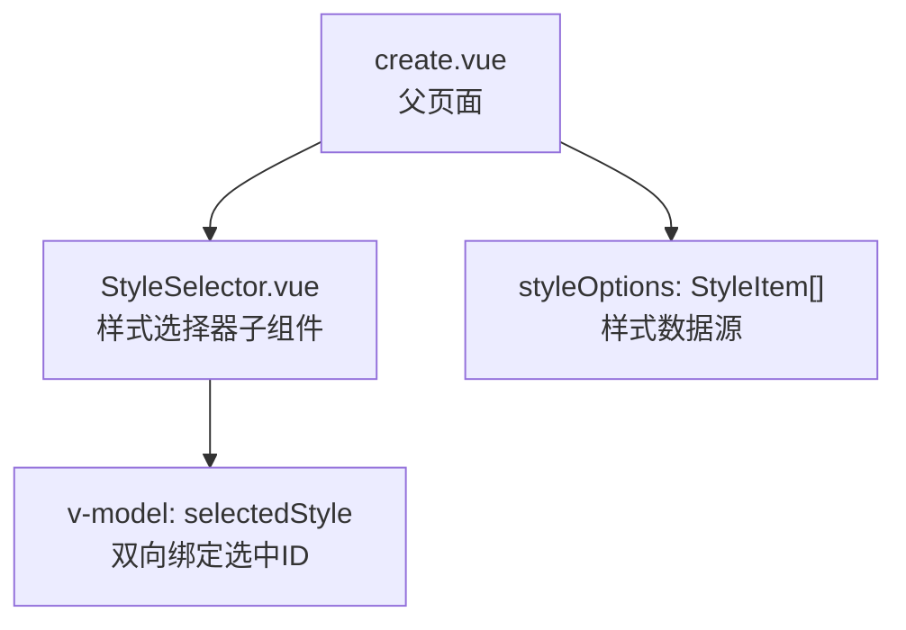
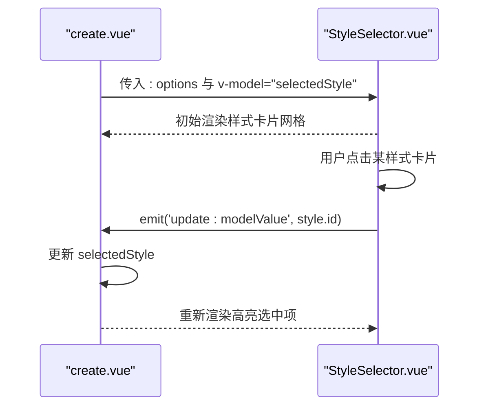
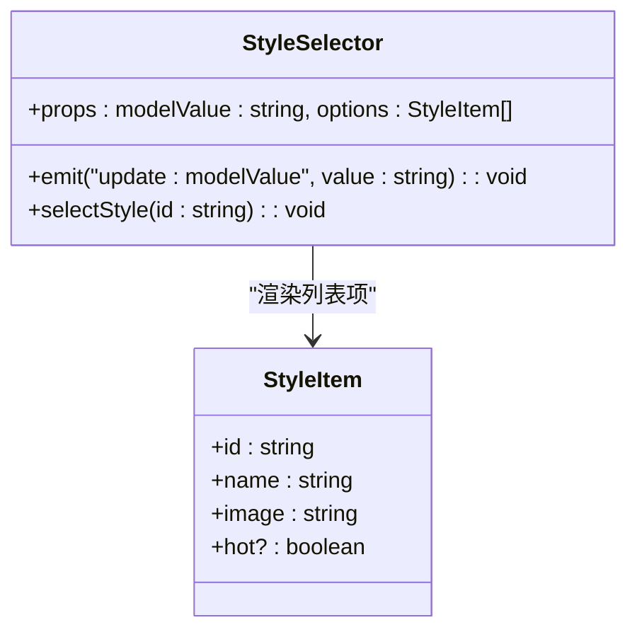
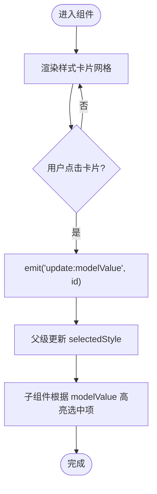
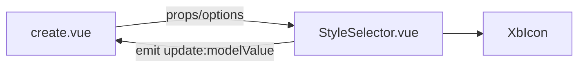

# 样式选择器

<cite>
**本文引用的文件**   
- [StyleSelector.vue](file://frontend/src/views/EpisodesPage/create/StyleSelector.vue)
- [create.vue](file://frontend/src/views/EpisodesPage/create.vue)
</cite>

## 目录
1. [简介](#简介)
2. [项目结构](#项目结构)
3. [核心组件](#核心组件)
4. [架构总览](#架构总览)
5. [详细组件分析](#详细组件分析)
6. [依赖关系分析](#依赖关系分析)
7. [性能与优化建议](#性能与优化建议)
8. [故障排查指南](#故障排查指南)
9. [结论](#结论)
10. [附录：开发示例与扩展指南](#附录开发示例与扩展指南)

## 简介
本文件围绕“样式选择器”进行系统化文档化，聚焦 StyleSelector 组件的实现逻辑、数据模型、交互流程与使用方式。当前仓库中的样式选择器以“静态配置 + 网格预览 + 选中态反馈”为核心形态，父页面负责提供样式选项数据并维护选中状态。本文同时给出可扩展方向（分类组织、搜索过滤、收藏标记）以及数据加载与缓存的落地建议，帮助读者在现有基础上快速演进为更完善的样式系统。

## 项目结构
样式选择器位于剧集创建页面的右侧面板中，由父页面 create.vue 引入并使用。样式数据在父页面中以常量数组形式定义，并通过 props 传递给子组件。

图示来源
- [create.vue:184-186](file://frontend/src/views/EpisodesPage/create.vue#L184-L186)
- [StyleSelector.vue:10-21](file://frontend/src/views/EpisodesPage/create/StyleSelector.vue#L10-L21)

章节来源
- [create.vue:184-186](file://frontend/src/views/EpisodesPage/create.vue#L184-L186)
- [StyleSelector.vue:10-21](file://frontend/src/views/EpisodesPage/create/StyleSelector.vue#L10-L21)

## 核心组件
- 组件职责
  - 接收样式列表与当前选中值
  - 渲染样式卡片网格
  - 处理点击事件，通过 v-model 将选中项 ID 回传给父级
  - 展示“热门”标签与选中对勾图标
- 对外接口
  - 属性
    - modelValue: string — 当前选中的样式 ID
    - options: StyleItem[] — 样式列表
  - 事件
    - update:modelValue: (value: string) => void — 更新选中 ID
- 内部数据结构
  - StyleItem
    - id: string
    - name: string
    - image: string
    - hot?: boolean

章节来源
- [StyleSelector.vue:3-8](file://frontend/src/views/EpisodesPage/create/StyleSelector.vue#L3-L8)
- [StyleSelector.vue:10-21](file://frontend/src/views/EpisodesPage/create/StyleSelector.vue#L10-L21)
- [StyleSelector.vue:19-21](file://frontend/src/views/EpisodesPage/create/StyleSelector.vue#L19-L21)

## 架构总览
从调用方到被调方的数据流如下：父页面持有样式数据与选中状态，子组件仅负责展示与触发更新。

图示来源
- [create.vue:184-186](file://frontend/src/views/EpisodesPage/create.vue#L184-L186)
- [StyleSelector.vue:19-21](file://frontend/src/views/EpisodesPage/create/StyleSelector.vue#L19-L21)

## 详细组件分析

### 组件类图（代码结构）

图示来源
- [StyleSelector.vue:3-8](file://frontend/src/views/EpisodesPage/create/StyleSelector.vue#L3-L8)
- [StyleSelector.vue:10-21](file://frontend/src/views/EpisodesPage/create/StyleSelector.vue#L10-L21)
- [StyleSelector.vue:19-21](file://frontend/src/views/EpisodesPage/create/StyleSelector.vue#L19-L21)

### 交互流程（点击选择）

图示来源
- [StyleSelector.vue:27-71](file://frontend/src/views/EpisodesPage/create/StyleSelector.vue#L27-L71)
- [StyleSelector.vue:19-21](file://frontend/src/views/EpisodesPage/create/StyleSelector.vue#L19-L21)

### 视觉预览机制
- 网格布局：固定列数、等间距、正方形比例，确保预览一致性
- 选中态：边框加粗、环形光晕、右下角对勾图标
- 未选中态：悬停时边框颜色加深，提升可发现性
- 名称与背景渐变：底部半透明渐变叠加文字，保证可读性
- 热门标签：左上角 HOT 徽章，突出推荐样式

章节来源
- [StyleSelector.vue:27-71](file://frontend/src/views/EpisodesPage/create/StyleSelector.vue#L27-L71)

### 样式数据与模板管理
- 数据来源：父页面 define 的 styleOptions 常量数组
- 数据字段：id、name、image、可选 hot
- 模板管理：当前为前端静态配置；如需动态化，可在父页面改为异步获取后注入

章节来源
- [create.vue:33-59](file://frontend/src/views/EpisodesPage/create.vue#L33-L59)

### 用户交互体验
- 点击即选：无额外确认步骤，降低操作成本
- 即时反馈：选中后立即高亮，避免误操作
- 键盘可达性：当前实现为纯点击交互，后续可补充键盘导航与焦点管理

章节来源
- [StyleSelector.vue:27-71](file://frontend/src/views/EpisodesPage/create/StyleSelector.vue#L27-L71)

## 依赖关系分析
- 组件耦合
  - StyleSelector 与父页面 create.vue 通过 props 和 v-model 解耦，职责清晰
- 外部依赖
  - 图标组件 XbIcon 用于选中态对勾显示
- 数据流向
  - 单向数据流：父 -> 子（options、modelValue），子 -> 父（update:modelValue）

图示来源
- [create.vue:184-186](file://frontend/src/views/EpisodesPage/create.vue#L184-L186)
- [StyleSelector.vue:64-69](file://frontend/src/views/EpisodesPage/create/StyleSelector.vue#L64-L69)

章节来源
- [create.vue:184-186](file://frontend/src/views/EpisodesPage/create.vue#L184-L186)
- [StyleSelector.vue:64-69](file://frontend/src/views/EpisodesPage/create/StyleSelector.vue#L64-L69)

## 性能与优化建议
- 图片资源
  - 建议使用 WebP/AVIF 格式与响应式尺寸，减少带宽占用
  - 启用浏览器缓存与 CDN，配合文件名哈希策略
- 渲染性能
  - 当样式数量较大时，采用虚拟滚动或分页加载，避免一次性渲染过多 DOM
  - 对缩略图使用懒加载，首屏优先
- 交互优化
  - 防抖/节流：若后续加入搜索或筛选，建议对输入事件做节流
  - 预取热点样式：在空闲时间预请求热门样式数据，缩短首次交互等待

[本节为通用建议，不直接分析具体文件]

## 故障排查指南
- 样式图片无法显示
  - 检查路径是否正确、资源是否可用、跨域与缓存策略
- 选中态不生效
  - 确认父页面 selectedStyle 是否被正确更新，且子组件 v-model 绑定一致
- 列表过长导致卡顿
  - 考虑分页或虚拟列表方案，减少首屏渲染量

[本节为通用建议，不直接分析具体文件]

## 结论
当前 StyleSelector 组件实现了简洁高效的样式选择能力：清晰的 props/events 契约、直观的网格预览与明确的选中反馈。父页面集中管理样式数据，便于统一维护。在此基础上，可按需扩展分类组织、搜索过滤、收藏标记与异步加载等能力，逐步构建完整的样式系统。

[本节为总结性内容，不直接分析具体文件]

## 附录：开发示例与扩展指南

### 基本用法（集成到现有页面）
- 在父页面引入组件并声明样式数据
- 使用 v-model 绑定选中样式 ID
- 将样式数据通过 options 传入子组件

章节来源
- [create.vue:3-5](file://frontend/src/views/EpisodesPage/create.vue#L3-L5)
- [create.vue:184-186](file://frontend/src/views/EpisodesPage/create.vue#L184-L186)

### 自定义样式扩展指南
- 新增样式项
  - 在父页面的样式数组中添加新对象，包含 id、name、image，必要时添加 hot 标记
- 调整布局与主题
  - 修改子组件的网格列数、间距、圆角、阴影等样式
  - 替换选中态与悬停态的颜色变量，保持与设计系统一致
- 增强交互
  - 增加键盘支持（Tab 导航、Enter 选择）
  - 增加拖拽排序或批量选择（需要额外的状态与事件）

章节来源
- [create.vue:33-59](file://frontend/src/views/EpisodesPage/create.vue#L33-L59)
- [StyleSelector.vue:27-71](file://frontend/src/views/EpisodesPage/create/StyleSelector.vue#L27-L71)

### 样式分类组织（建议）
- 数据结构扩展
  - 在父页面将 styleOptions 按类别分组，如“真人系”“动漫系”“国风系”等
- 界面呈现
  - 在子组件顶部增加分类 Tab 或侧边栏，切换时过滤 options
- 状态管理
  - 使用本地 state 记录当前分类与选中项，必要时持久化到 localStorage

[本节为概念性扩展建议，不直接分析具体文件]

### 搜索过滤功能（建议）
- 输入框与实时过滤
  - 在子组件顶部增加搜索输入，基于 name 字段模糊匹配
- 性能优化
  - 使用计算属性或 useMemo 模式缓存过滤结果
  - 对长列表结合虚拟滚动
- 空状态提示
  - 当无匹配结果时，展示友好提示与引导文案

[本节为概念性扩展建议，不直接分析具体文件]

### 收藏标记机制（建议）
- 数据结构扩展
  - 在 StyleItem 中增加 isFavorite 字段，或在父级维护一个 favorites 集合
- 交互设计
  - 在卡片右上角增加收藏按钮，点击切换收藏状态
- 持久化
  - 将收藏列表写入 localStorage 或后端 API，实现跨会话保留

[本节为概念性扩展建议，不直接分析具体文件]

### 样式数据的加载策略、缓存机制与异步优化（建议）
- 加载策略
  - 首屏加载基础样式，热门样式优先
  - 按需加载更多样式（滚动到底部或点击“加载更多”）
- 缓存机制
  - 浏览器缓存：合理设置 Cache-Control 与 ETag
  - 应用层缓存：在内存 Map 中缓存已加载的样式数据，避免重复请求
- 异步优化
  - 并发控制：限制并行请求数，避免雪崩
  - 错误重试与降级：网络失败时返回默认占位图与提示
  - 预取：在空闲时间预取下一页或下一批样式数据

[本节为概念性扩展建议，不直接分析具体文件]