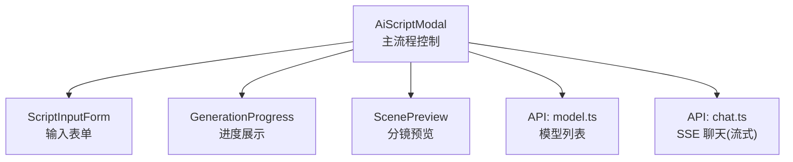
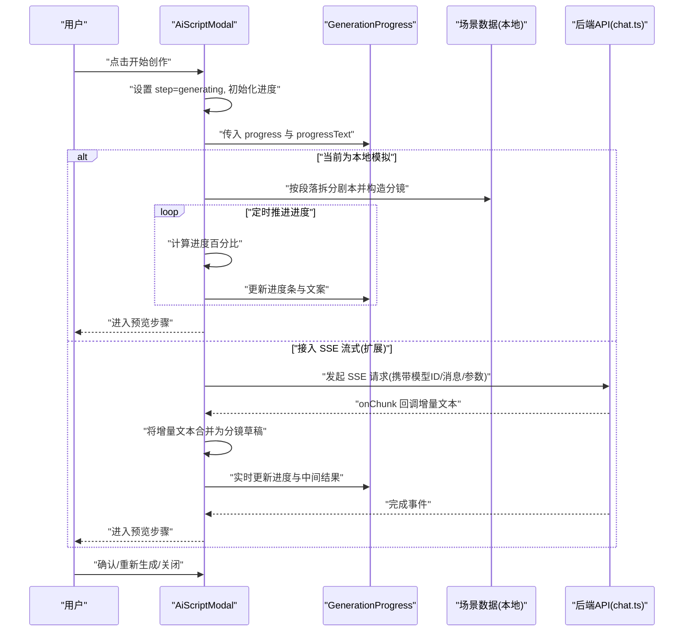
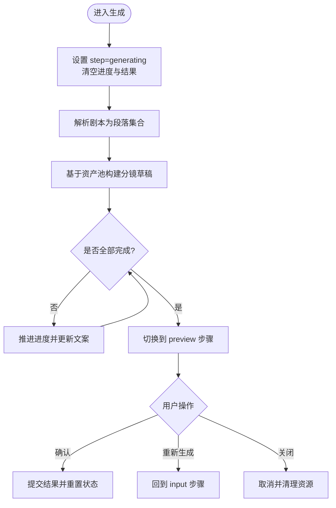
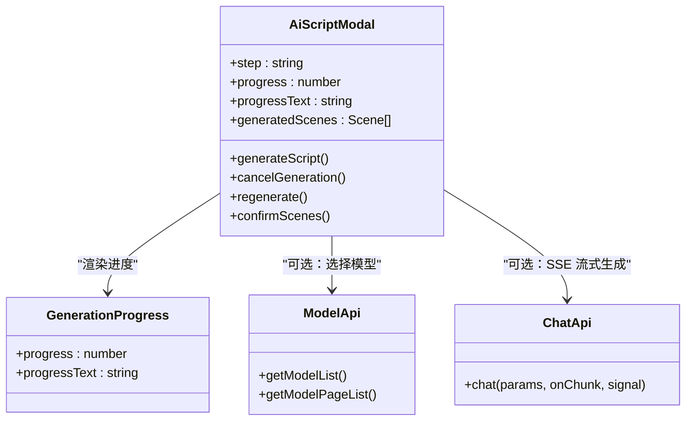

# 生成引擎

<cite>
**本文引用的文件**   
- [index.vue](file://frontend/src/components/AiScriptModal/index.vue)
- [GenerationProgress.vue](file://frontend/src/components/AiScriptModal/components/GenerationProgress.vue)
- [model.ts](file://frontend/src/api/model.ts)
- [chat.ts](file://frontend/src/api/chat.ts)
</cite>

## 目录
1. [简介](#简介)
2. [项目结构](#项目结构)
3. [核心组件](#核心组件)
4. [架构总览](#架构总览)
5. [详细组件分析](#详细组件分析)
6. [依赖关系分析](#依赖关系分析)
7. [性能考虑](#性能考虑)
8. [故障排查指南](#故障排查指南)
9. [结论](#结论)
10. [附录](#附录)

## 简介
本文件面向“AI内容生成引擎”的生成页面（剧本到分镜）实现，聚焦以下目标：
- 深入讲解 generate 页面的核心业务逻辑与状态流转
- 说明 AI 模型调用流程、任务状态管理、进度跟踪机制
- 解释生成参数配置、实时预览更新、错误处理与重试机制
- 阐述与后端 API 的交互模式、SSE 流式响应能力、批量生成优化策略
- 提供开发示例与性能调优建议

## 项目结构
围绕“AI 剧本创作”弹窗，前端采用模块化组织：
- 主入口组件负责三阶段流程控制：输入、生成中、预览
- 子组件负责进度展示与预览渲染
- API 层封装模型列表与聊天（SSE 流式）接口

图表来源
- [index.vue:1-200](file://frontend/src/components/AiScriptModal/index.vue#L1-L200)
- [GenerationProgress.vue:1-28](file://frontend/src/components/AiScriptModal/components/GenerationProgress.vue#L1-L28)
- [model.ts:1-106](file://frontend/src/api/model.ts#L1-L106)
- [chat.ts:1-60](file://frontend/src/api/chat.ts#L1-L60)

章节来源
- [index.vue:1-200](file://frontend/src/components/AiScriptModal/index.vue#L1-L200)
- [GenerationProgress.vue:1-28](file://frontend/src/components/AiScriptModal/components/GenerationProgress.vue#L1-L28)
- [model.ts:1-106](file://frontend/src/api/model.ts#L1-L106)
- [chat.ts:1-60](file://frontend/src/api/chat.ts#L1-L60)

## 核心组件
- AiScriptModal（主流程）
  - 职责：维护三步流程状态（input/generating/preview），驱动进度与结果展示，管理取消与重置
  - 关键状态：step、progress、progressText、generatedScenes
  - 生命周期：监听可见性变化以清理定时器；卸载时清理资源
- GenerationProgress（进度条）
  - 职责：接收 progress 与 progressText，渲染动画进度条与提示文案
- API 层
  - model.ts：获取模型列表（用于后续选择模型、价格等）
  - chat.ts：SSE 流式对话接口（为未来接入真实 AI 解析预留）

章节来源
- [index.vue:1-200](file://frontend/src/components/AiScriptModal/index.vue#L1-L200)
- [GenerationProgress.vue:1-28](file://frontend/src/components/AiScriptModal/components/GenerationProgress.vue#L1-L28)
- [model.ts:1-106](file://frontend/src/api/model.ts#L1-L106)
- [chat.ts:1-60](file://frontend/src/api/chat.ts#L1-L60)

## 架构总览
当前实现采用“前端模拟生成 + 可替换为 SSE 流式”的渐进式架构。下图展示了从用户输入到预览确认的完整时序，并标注了可扩展的 SSE 接入点。

图表来源
- [index.vue:1-200](file://frontend/src/components/AiScriptModal/index.vue#L1-L200)
- [GenerationProgress.vue:1-28](file://frontend/src/components/AiScriptModal/components/GenerationProgress.vue#L1-L28)
- [chat.ts:1-60](file://frontend/src/api/chat.ts#L1-L60)

## 详细组件分析

### AiScriptModal 主流程
- 流程状态机
  - input：收集剧本内容
  - generating：执行生成（当前为本地模拟，可替换为 SSE）
  - preview：展示生成的分镜，支持重新生成或确认添加到剧集
- 进度跟踪
  - 使用定时器周期性推进进度，动态更新进度条与文案
  - 在取消或关闭时清理定时器，避免内存泄漏
- 生成逻辑（当前为本地模拟）
  - 将剧本按段落切分，结合资产库中的角色、表情、道具、动作池随机组合，构造分镜对象数组
  - 每个分镜包含标题、背景、人物、表情、动作、道具、效果、台词、时长等字段
- 与后端的对接点
  - 可通过 chat.ts 的 SSE 接口替换本地模拟，实现真实 AI 解析与增量输出
  - 通过 model.ts 获取模型列表，用于选择模型与定价信息展示

图表来源
- [index.vue:1-200](file://frontend/src/components/AiScriptModal/index.vue#L1-L200)

章节来源
- [index.vue:1-200](file://frontend/src/components/AiScriptModal/index.vue#L1-L200)

### GenerationProgress 进度展示
- 输入属性
  - progress：数值型进度百分比
  - progressText：描述性文案
- 行为
  - 渲染进度条与提示文案，配合 CSS 动画增强体验
- 注意事项
  - 父组件需保证在取消/关闭时停止更新，避免无效渲染

章节来源
- [GenerationProgress.vue:1-28](file://frontend/src/components/AiScriptModal/components/GenerationProgress.vue#L1-L28)

### API 层：模型与聊天
- 模型列表（model.ts）
  - 提供模型分页与全量查询接口，返回模型元信息与价格配置
  - 可用于生成前选择模型、展示成本/售价、限制可用模型范围
- 聊天（SSE 流式）（chat.ts）
  - 定义 ChatParams 参数集（模型ID、消息、温度、Top-P、最大Token、工具等）
  - 暴露 chat(params, onChunk, signal) 方法，支持增量回调与取消信号
  - 适合用于“边生成边预览”的实时体验

章节来源
- [model.ts:1-106](file://frontend/src/api/model.ts#L1-L106)
- [chat.ts:1-60](file://frontend/src/api/chat.ts#L1-L60)

## 依赖关系分析
- 组件内聚与耦合
  - AiScriptModal 聚合输入、进度、预览三个子视图，职责清晰
  - 进度组件仅关注展示，低耦合
  - API 层独立于 UI，便于替换实现（如切换不同 SSE 客户端）
- 外部依赖
  - request.ssePost：用于 SSE 流式通信
  - 资产库（assets store）：用于填充角色、表情、道具、动作池（当前由父级注入）

图表来源
- [index.vue:1-200](file://frontend/src/components/AiScriptModal/index.vue#L1-L200)
- [GenerationProgress.vue:1-28](file://frontend/src/components/AiScriptModal/components/GenerationProgress.vue#L1-L28)
- [model.ts:1-106](file://frontend/src/api/model.ts#L1-L106)
- [chat.ts:1-60](file://frontend/src/api/chat.ts#L1-L60)

## 性能考虑
- 进度更新频率
  - 当前使用固定间隔推进，建议根据总任务数动态调整 tick 间隔，避免频繁 DOM 更新
- 大数据量渲染
  - 预览大量分镜时，建议使用虚拟滚动或分页加载，减少首屏渲染压力
- 网络与并发
  - 接入 SSE 后，合理设置超时与重连策略；对长耗时任务引入心跳保活
- 资源清理
  - 确保在组件销毁或关闭时清理定时器与 SSE 连接，防止内存泄漏

[本节为通用指导，不直接分析具体文件]

## 故障排查指南
- 常见问题
  - 进度不更新：检查定时器是否被提前清除或 step 未正确切换
  - 预览为空：确认 generatedScenes 是否正确赋值且非空
  - SSE 无回调：检查 onChunk 注册、AbortSignal 是否误用、后端是否推送完成事件
- 定位建议
  - 在进度推进与状态切换处增加日志
  - 对 SSE 的 onChunk 与错误回调进行断点调试
  - 校验模型列表接口返回，确保 model_id 有效

章节来源
- [index.vue:1-200](file://frontend/src/components/AiScriptModal/index.vue#L1-L200)
- [chat.ts:1-60](file://frontend/src/api/chat.ts#L1-L60)

## 结论
当前“AI 剧本创作”生成页面已具备完整的三阶段流程与进度反馈能力，并通过 API 层预留了 SSE 流式接入点。建议在下一步优先完成：
- 以 SSE 替换本地模拟，实现真实 AI 解析与增量预览
- 完善错误处理与重试机制，提升稳定性
- 针对大批量分镜的渲染与交互进行性能优化

[本节为总结性内容，不直接分析具体文件]

## 附录

### 开发示例（逐步接入 SSE）
- 步骤一：选择模型
  - 调用模型列表接口，筛选可用模型并记录 model_id
- 步骤二：构造消息
  - 将剧本内容包装为 messages 数组，附加 temperature、top_p、max_tokens 等参数
- 步骤三：发起 SSE 请求
  - 使用 chat(params, onChunk, signal)，在 onChunk 中将增量文本合并为分镜草稿
- 步骤四：更新进度与预览
  - 根据已完成片段数量或时间估算进度，实时更新进度条与预览区
- 步骤五：完成与确认
  - 收到完成事件后，切换到预览步骤，允许用户确认或重新生成

章节来源
- [model.ts:1-106](file://frontend/src/api/model.ts#L1-L106)
- [chat.ts:1-60](file://frontend/src/api/chat.ts#L1-L60)
- [index.vue:1-200](file://frontend/src/components/AiScriptModal/index.vue#L1-L200)