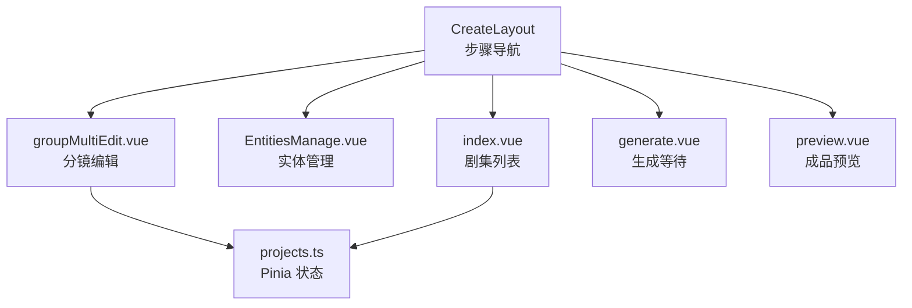
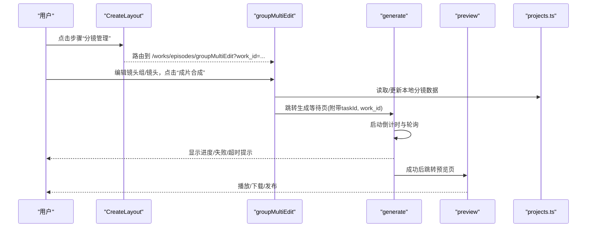
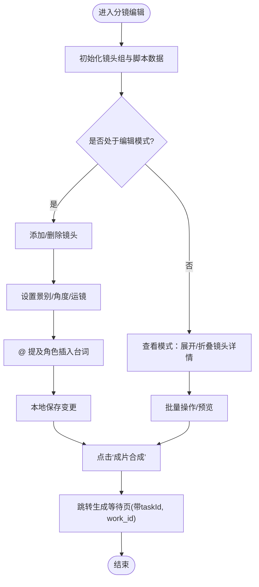
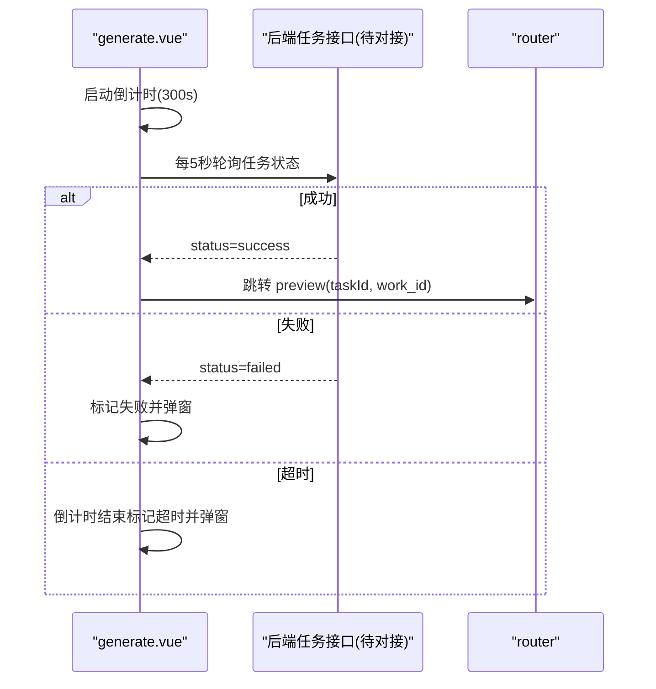
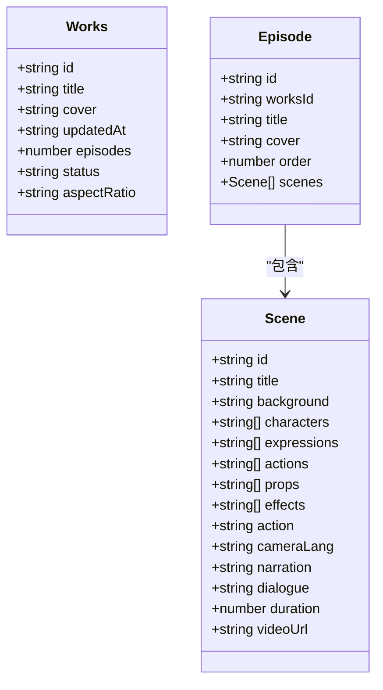
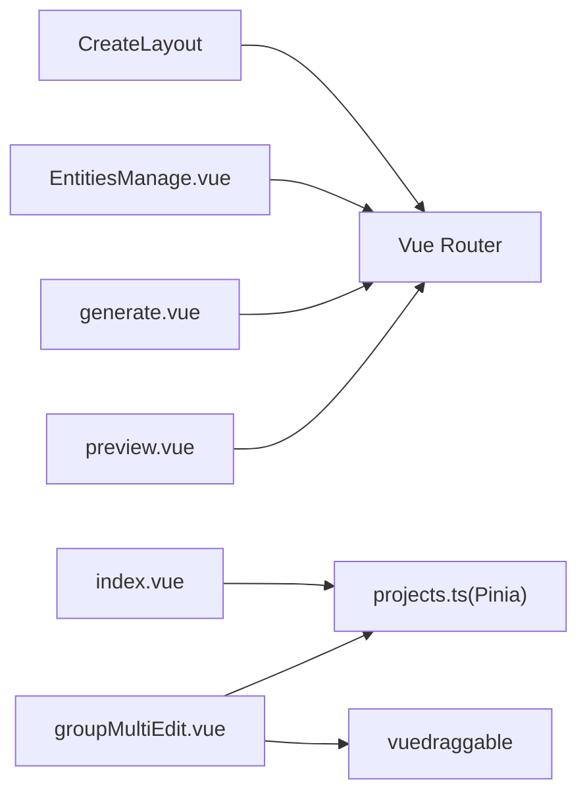

# 协作创作页面

<cite>
**本文引用的文件**   
- [index.vue](file://frontend/src/views/EpisodesPage/index.vue)
- [CreateLayout.vue](file://frontend/src/views/EpisodesPage/CreateLayout.vue)
- [groupMultiEdit.vue](file://frontend/src/views/EpisodesPage/groupMultiEdit.vue)
- [generate.vue](file://frontend/src/views/EpisodesPage/generate.vue)
- [preview.vue](file://frontend/src/views/EpisodesPage/preview.vue)
- [EntitiesManage.vue](file://frontend/src/views/EpisodesPage/EntitiesManage.vue)
- [projects.ts](file://frontend/src/stores/projects.ts)
</cite>

## 目录
1. [简介](#简介)
2. [项目结构](#项目结构)
3. [核心组件](#核心组件)
4. [架构总览](#架构总览)
5. [详细组件分析](#详细组件分析)
6. [依赖关系分析](#依赖关系分析)
7. [性能与优化](#性能与优化)
8. [故障排查指南](#故障排查指南)
9. [结论](#结论)

## 简介
本文件围绕“协作创作页面”的分镜管理系统，系统性梳理整体架构、创建布局、生成流程与预览功能实现逻辑，并深入讲解实体管理、分镜编辑、团队协作、版本控制等核心能力。同时给出实时协作机制、数据同步策略、状态管理与性能优化的落地方案建议，帮助读者快速理解与扩展该模块。

## 项目结构
协作创作相关的前端代码集中在 EpisodesPage 视图目录下，采用“步骤式工作流 + 多页签 + 三栏编辑器”的组合形态：
- 步骤导航：CreateLayout 提供上传剧本、主体管理、分镜管理、视频生成、成品预览五步流程。
- 剧集列表：index.vue 展示作品下的剧集网格、分页、新建与编辑删除操作。
- 实体管理：EntitiesManage.vue 以角色/场景/道具三类实体卡片组织，支持批量生成与跳转分镜编辑。
- 分镜编辑：groupMultiEdit.vue 为三栏布局（左侧镜头组与镜头列表、中间脚本区、右侧缩略图），支持拖拽排序、@提及、批量操作与成片合成。
- 生成等待：generate.vue 负责任务轮询、倒计时与失败/超时提示。
- 成品预览：preview.vue 用于播放已生成的视频并提供下载与发布入口。
- 全局状态：projects.ts 通过 Pinia 维护作品、剧集、分镜场景等数据模型与增删改查方法。

图表来源
- [CreateLayout.vue:1-71](file://frontend/src/views/EpisodesPage/CreateLayout.vue#L1-L71)
- [index.vue:1-115](file://frontend/src/views/EpisodesPage/index.vue#L1-L115)
- [EntitiesManage.vue:1-443](file://frontend/src/views/EpisodesPage/EntitiesManage.vue#L1-L443)
- [groupMultiEdit.vue:1-705](file://frontend/src/views/EpisodesPage/groupMultiEdit.vue#L1-L705)
- [generate.vue:1-202](file://frontend/src/views/EpisodesPage/generate.vue#L1-L202)
- [preview.vue:1-52](file://frontend/src/views/EpisodesPage/preview.vue#L1-L52)
- [projects.ts:1-279](file://frontend/src/stores/projects.ts#L1-L279)

章节来源
- [CreateLayout.vue:1-71](file://frontend/src/views/EpisodesPage/CreateLayout.vue#L1-L71)
- [index.vue:1-115](file://frontend/src/views/EpisodesPage/index.vue#L1-L115)
- [EntitiesManage.vue:1-443](file://frontend/src/views/EpisodesPage/EntitiesManage.vue#L1-L443)
- [groupMultiEdit.vue:1-705](file://frontend/src/views/EpisodesPage/groupMultiEdit.vue#L1-L705)
- [generate.vue:1-202](file://frontend/src/views/EpisodesPage/generate.vue#L1-L202)
- [preview.vue:1-52](file://frontend/src/views/EpisodesPage/preview.vue#L1-L52)
- [projects.ts:1-279](file://frontend/src/stores/projects.ts#L1-L279)

## 核心组件
- 步骤导航 CreateLayout：统一承载五步工作流，路由跳转携带 work_id 上下文。
- 剧集列表 index.vue：基于 Pinia 的 episodes 渲染网格，提供分页、新建、编辑、删除。
- 实体管理 EntitiesManage.vue：角色/场景/道具三类实体卡片，支持批量生成图片、旁白选择、跳转到分镜编辑。
- 分镜编辑 groupMultiEdit.vue：三栏布局，支持镜头组与镜头的增删改、拖拽排序、@提及台词、批量操作与提交合成。
- 生成等待 generate.vue：倒计时+轮询，处理成功/失败/超时分支。
- 成品预览 preview.vue：视频播放器占位与下载/发布按钮。
- 状态管理 projects.ts：定义 Works/Episode/Scene 数据结构与操作方法，作为当前应用的状态中心。

章节来源
- [CreateLayout.vue:1-71](file://frontend/src/views/EpisodesPage/CreateLayout.vue#L1-L71)
- [index.vue:1-115](file://frontend/src/views/EpisodesPage/index.vue#L1-L115)
- [EntitiesManage.vue:1-443](file://frontend/src/views/EpisodesPage/EntitiesManage.vue#L1-L443)
- [groupMultiEdit.vue:1-705](file://frontend/src/views/EpisodesPage/groupMultiEdit.vue#L1-L705)
- [generate.vue:1-202](file://frontend/src/views/EpisodesPage/generate.vue#L1-L202)
- [preview.vue:1-52](file://frontend/src/views/EpisodesPage/preview.vue#L1-L52)
- [projects.ts:1-279](file://frontend/src/stores/projects.ts#L1-L279)

## 架构总览
从用户视角看，协作创作页面遵循“步骤化引导 + 数据驱动渲染 + 异步任务反馈”的整体架构：
- 路由层：CreateLayout 根据当前 step 切换子页面，并在 query 中传递 work_id。
- 状态层：Pinia store 集中管理作品、剧集、分镜场景等数据；各页面通过 store 读写状态。
- 交互层：分镜编辑提供丰富的本地交互（拖拽、展开/折叠、@提及、批量操作）。
- 任务层：合成任务由前端发起，进入 generate 页面进行轮询与倒计时，完成后跳转 preview。

图表来源
- [CreateLayout.vue:1-71](file://frontend/src/views/EpisodesPage/CreateLayout.vue#L1-L71)
- [groupMultiEdit.vue:1-705](file://frontend/src/views/EpisodesPage/groupMultiEdit.vue#L1-L705)
- [generate.vue:1-202](file://frontend/src/views/EpisodesPage/generate.vue#L1-L202)
- [preview.vue:1-52](file://frontend/src/views/EpisodesPage/preview.vue#L1-L52)
- [projects.ts:1-279](file://frontend/src/stores/projects.ts#L1-L279)

## 详细组件分析

### 步骤导航 CreateLayout
- 职责：统一展示步骤条，承载面包屑与返回逻辑，按 step 路由到对应子页面。
- 关键点：
  - 使用 route.meta.currentStep/pageTitle/backPath 动态渲染步骤与标题。
  - handleStepClick 根据 step 值路由到 works-create/entities/group-multi-edit/generate/preview，并透传 work_id。
  - handleBack 优先走 backPath，否则回退浏览器历史。

章节来源
- [CreateLayout.vue:1-71](file://frontend/src/views/EpisodesPage/CreateLayout.vue#L1-L71)

### 剧集列表 index.vue
- 职责：展示当前作品的剧集网格，支持分页、新建、编辑、删除。
- 关键点：
  - onMounted 时调用 store.setCurrentWorks(workId) 加载剧集。
  - 使用 computed 计算分页数据，watch 总页数自动修正当前页。
  - openEditor/openEditEpisode/saveEpisode/confirmDelete/deleteEpisode 等事件驱动 store 更新。
  - 使用 XbPagination/XbConfirmModal/EditEpisodeModal 等 UI 组件完成交互。

章节来源
- [index.vue:1-115](file://frontend/src/views/EpisodesPage/index.vue#L1-L115)
- [projects.ts:1-279](file://frontend/src/stores/projects.ts#L1-L279)

### 实体管理 EntitiesManage.vue
- 职责：管理角色/场景/道具三类实体，提供批量生成与跳转到分镜编辑。
- 关键点：
  - tabs 切换 character/scene/prop 三个面板，每个面板包含“添加新条目”卡片与实体卡片列表。
  - 实体卡片包含头像/图片、名称、描述、小传/说明、音色试听、替换/删除等操作。
  - 底部工具栏提供旁白选择、批量生成图片、重新生成分镜列表等入口。
  - goToShotList 跳转到 groupMultiEdit 页面，保持 work_id 上下文。

章节来源
- [EntitiesManage.vue:1-443](file://frontend/src/views/EpisodesPage/EntitiesManage.vue#L1-L443)

### 分镜编辑 groupMultiEdit.vue
- 职责：三栏布局的分镜编辑工作台，支持镜头组与镜头的增删改、拖拽排序、@提及、批量操作与成片合成。
- 关键结构与交互：
  - 左侧：镜头组头部（名称/时长/调度）、展开/收起控制、镜头列表（查看模式与编辑模式切换）。
  - 中间：脚本文本区，支持创作视频/预览视频快捷操作。
  - 右侧：镜头组缩略图，支持拖拽排序与选中高亮。
  - 编辑模式：可新增/删除镜头，设置景别/角度/运镜，输入画面描述与台词，支持 @ 提及角色。
  - 批量操作：批量生成视频/音频修复/下载/预览，以及“成片合成”提交任务。
- 数据模型：
  - ShotGroup：id/name/shotCount/duration/staging/thumbnail/videoUrl/shots[]
  - Shot：id/name/description/dialogue/shotSize/cameraAngle/cameraMove/image
- 算法与流程要点：
  - 拖拽排序：使用 vuedraggable 对 shotGroups 与 activeGroup.shots 双向绑定，onDragEnd 后刷新选中组。
  - 展开/折叠：expandedShots 集合控制镜头详情可见性，selectGroup 默认展开前三个镜头。
  - @ 提及：监听 input/keydown，正则匹配 @ 触发候选列表，Enter 插入 @角色： 格式。
  - 提交合成：handleComposite 将当前分镜数据发送到后端（当前为占位），获取 taskId 后跳转到 generate 页面。

图表来源
- [groupMultiEdit.vue:1-705](file://frontend/src/views/EpisodesPage/groupMultiEdit.vue#L1-L705)

章节来源
- [groupMultiEdit.vue:1-705](file://frontend/src/views/EpisodesPage/groupMultiEdit.vue#L1-L705)

### 生成等待 generate.vue
- 职责：展示任务进度、倒计时与失败/超时提示，轮询查询任务结果。
- 关键点：
  - 倒计时：TOTAL_SECONDS=300s，每秒递减，到期标记 isExpired 并弹出失败弹窗。
  - 轮询：每 5 秒调用 pollTaskResult，当前为占位逻辑，预留对接后端 API 的注释。
  - 成功分支：isPolling=false，清理定时器，跳转到 preview 并携带 taskId/work_id。
  - 失败分支：isFailed=true，清理定时器，弹出失败弹窗。
  - 生命周期：onMounted 启动倒计时与轮询，onUnmounted 清理定时器避免泄漏。

图表来源
- [generate.vue:1-202](file://frontend/src/views/EpisodesPage/generate.vue#L1-L202)

章节来源
- [generate.vue:1-202](file://frontend/src/views/EpisodesPage/generate.vue#L1-L202)

### 成品预览 preview.vue
- 职责：展示已成功生成的视频，提供下载与发布入口。
- 关键点：
  - 从路由 query 获取 taskId/work_id，预留根据 taskId 拉取视频数据的注释。
  - 使用 XbVideoPlayer 占位播放，提供返回剧集列表、下载、发布按钮。

章节来源
- [preview.vue:1-52](file://frontend/src/views/EpisodesPage/preview.vue#L1-L52)

### 状态管理 projects.ts
- 职责：集中管理作品、剧集、分镜场景的数据与操作。
- 数据结构：
  - Works：id/title/cover/updatedAt/episodes/status/aspectRatio
  - Episode：id/worksId/title/cover/order/scenes[]
  - Scene：id/title/background/characters/expressions/actions/props/effects/action/cameraLang/narration/dialogue/duration/videoUrl
- 主要方法：
  - setCurrentWorks/loadEpisodes：设置当前作品并加载剧集（Mock 数据）
  - addEpisode/updateEpisode：新增/更新剧集
  - addScene/addScenesBatch/reorderScene/deleteScene：分镜场景的增删改排
- 使用方式：
  - index.vue 在 onMounted 调用 setCurrentWorks，并通过 store.episodes 渲染网格。
  - 其他页面可通过 store 访问/修改剧集与分镜数据。

图表来源
- [projects.ts:1-279](file://frontend/src/stores/projects.ts#L1-L279)

章节来源
- [projects.ts:1-279](file://frontend/src/stores/projects.ts#L1-L279)

## 依赖关系分析
- 组件间依赖：
  - CreateLayout 依赖 router 与 xbUi 的步骤组件，负责页面导航。
  - index.vue 依赖 projects.ts 的 store，渲染剧集网格与分页。
  - EntitiesManage.vue 依赖 siteConfigStore 获取货币名，跳转至 groupMultiEdit。
  - groupMultiEdit.vue 依赖 vuedraggable 实现拖拽，依赖 store 读写分镜数据。
  - generate.vue 与 preview.vue 依赖 router 与 xbUi 的图标/按钮/确认弹窗组件。
- 外部依赖：
  - Vue Router：页面跳转与参数传递。
  - Pinia：全局状态管理。
  - vuedraggable：拖拽排序。
  - 自定义 xbUi 组件库：XbButton/XbIcon/XbSteps/XbTabs/XbPagination/XbConfirmModal/XbVideoPlayer 等。

图表来源
- [CreateLayout.vue:1-71](file://frontend/src/views/EpisodesPage/CreateLayout.vue#L1-L71)
- [index.vue:1-115](file://frontend/src/views/EpisodesPage/index.vue#L1-L115)
- [EntitiesManage.vue:1-443](file://frontend/src/views/EpisodesPage/EntitiesManage.vue#L1-L443)
- [groupMultiEdit.vue:1-705](file://frontend/src/views/EpisodesPage/groupMultiEdit.vue#L1-L705)
- [generate.vue:1-202](file://frontend/src/views/EpisodesPage/generate.vue#L1-L202)
- [preview.vue:1-52](file://frontend/src/views/EpisodesPage/preview.vue#L1-L52)
- [projects.ts:1-279](file://frontend/src/stores/projects.ts#L1-L279)

章节来源
- [CreateLayout.vue:1-71](file://frontend/src/views/EpisodesPage/CreateLayout.vue#L1-L71)
- [index.vue:1-115](file://frontend/src/views/EpisodesPage/index.vue#L1-L115)
- [EntitiesManage.vue:1-443](file://frontend/src/views/EpisodesPage/EntitiesManage.vue#L1-L443)
- [groupMultiEdit.vue:1-705](file://frontend/src/views/EpisodesPage/groupMultiEdit.vue#L1-L705)
- [generate.vue:1-202](file://frontend/src/views/EpisodesPage/generate.vue#L1-L202)
- [preview.vue:1-52](file://frontend/src/views/EpisodesPage/preview.vue#L1-L52)
- [projects.ts:1-279](file://frontend/src/stores/projects.ts#L1-L279)

## 性能与优化
- 渲染优化：
  - 列表分页：index.vue 使用 pageSize 切片减少 DOM 节点数量，提升滚动性能。
  - 懒加载与虚拟滚动：当镜头列表或实体卡片较多时，建议引入虚拟滚动（如 vue-virtual-scroller）以降低重绘压力。
- 交互优化：
  - 拖拽排序：vuedraggable 已启用动画与 ghost 类，建议在大数据量下节流 onDragEnd 回调，避免频繁 reflow。
  - 展开/折叠：expandedShots 使用 Set 存储索引，O(1) 判断，适合大量镜头的快速切换。
- 网络与任务：
  - 轮询间隔：generate.vue 当前 5 秒轮询，建议根据后端负载动态调整，或在任务完成后立即停止轮询。
  - 错误重试：网络异常时增加指数退避重试，避免雪崩。
- 内存管理：
  - 定时器清理：generate.vue 在 onUnmounted 清理倒计时与轮询定时器，防止内存泄漏。
  - 大对象深拷贝：groupMultiEdit.vue 复制镜头组时使用 JSON.parse(JSON.stringify(...))，建议改用结构化克隆或轻量级拷贝工具以减少开销。

[本节为通用性能建议，不直接分析具体文件]

## 故障排查指南
- 生成任务无响应：
  - 检查 generate.vue 的轮询逻辑与后端接口是否已对接，确认 taskId 是否正确传递。
  - 观察控制台是否有网络错误，必要时增加日志输出与错误弹窗提示。
- 拖拽失效：
  - 确认 vuedraggable 的 item-key 与 v-model 绑定正确，确保数组引用未被意外覆盖。
  - 检查 CSS 样式是否阻止了 pointer-events 或 z-index 层级问题。
- 状态不同步：
  - 确认 index.vue 与 groupMultiEdit.vue 使用的 store 实例一致，避免重复初始化导致状态隔离。
  - 对于跨页面共享数据，建议使用路由 query 或持久化存储（localStorage/IndexedDB）做兜底。
- 表单输入卡顿：
  - 对于长文本输入（脚本区、描述框），考虑防抖保存与增量渲染，避免每次输入都触发全量重算。

章节来源
- [generate.vue:1-202](file://frontend/src/views/EpisodesPage/generate.vue#L1-L202)
- [groupMultiEdit.vue:1-705](file://frontend/src/views/EpisodesPage/groupMultiEdit.vue#L1-L705)
- [index.vue:1-115](file://frontend/src/views/EpisodesPage/index.vue#L1-L115)
- [projects.ts:1-279](file://frontend/src/stores/projects.ts#L1-L279)

## 结论
协作创作页面以步骤化工作流为核心，结合三栏分镜编辑器与实体管理，构建了完整的分镜创作闭环。当前实现已完成前端交互与状态管理的骨架，生成与预览环节预留了后端对接点。后续可在以下方面持续增强：
- 实时协作：引入 WebSocket 或 CRDT 方案，实现多人协同编辑与冲突合并。
- 数据同步：建立乐观更新与回滚机制，保障编辑体验与一致性。
- 版本控制：对分镜与实体变更打快照，支持回溯与对比。
- 性能优化：针对大数据量列表与复杂交互引入虚拟化与增量渲染。

[本节为总结性内容，不直接分析具体文件]