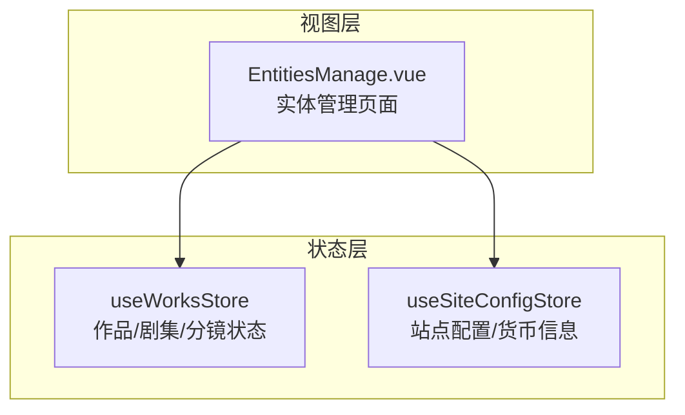
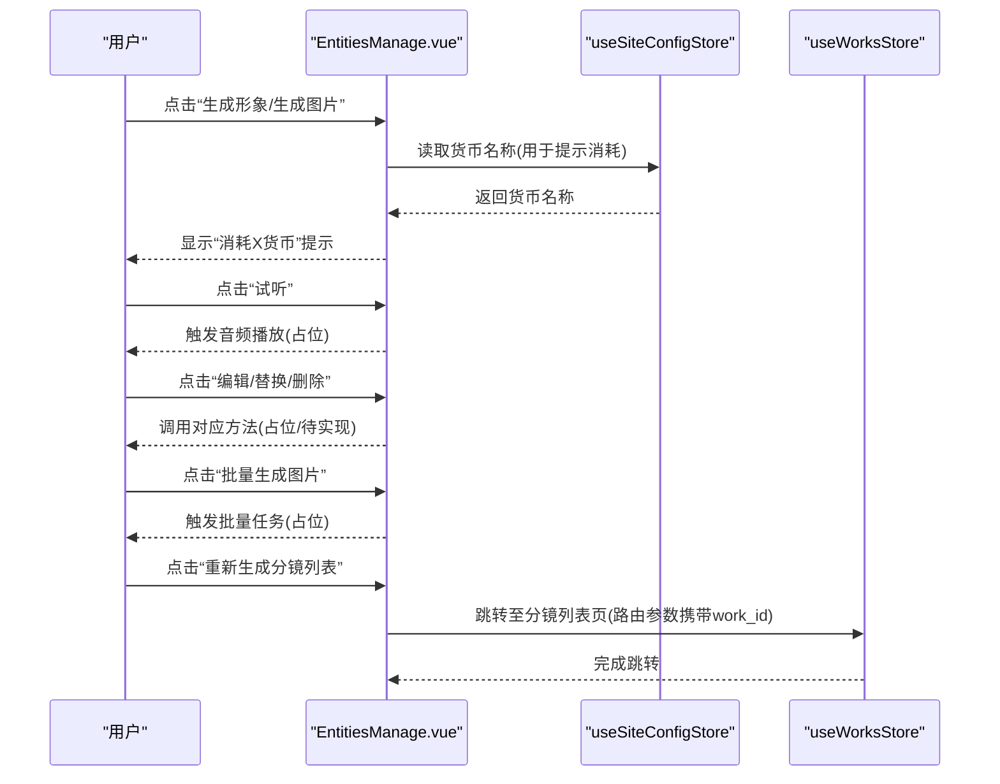
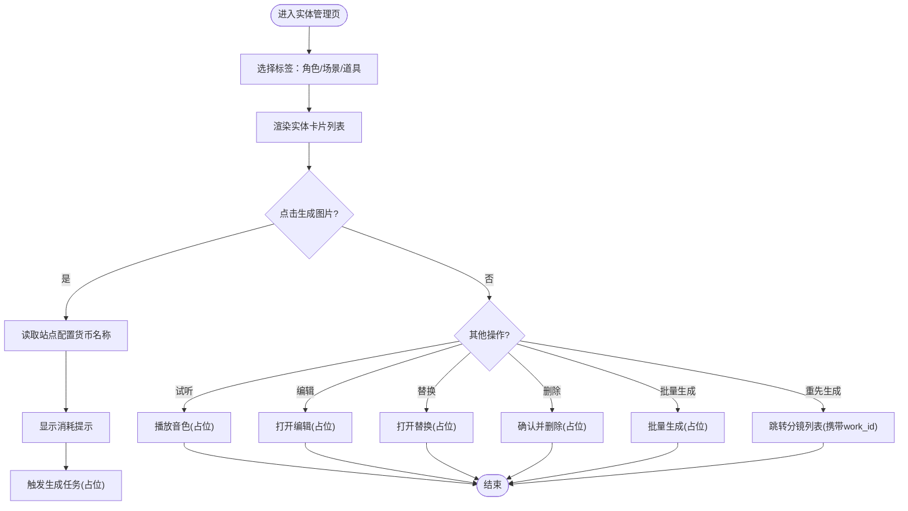
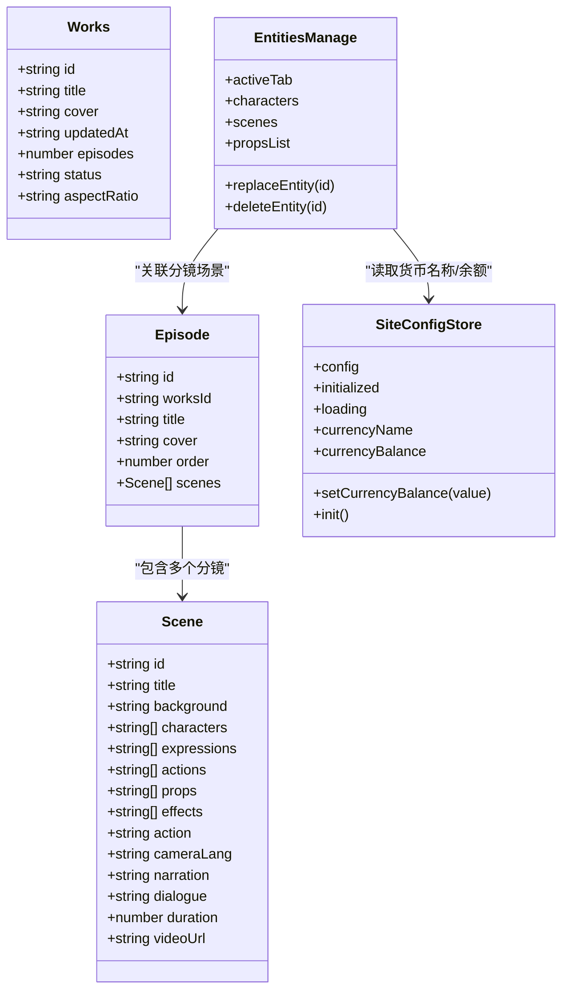
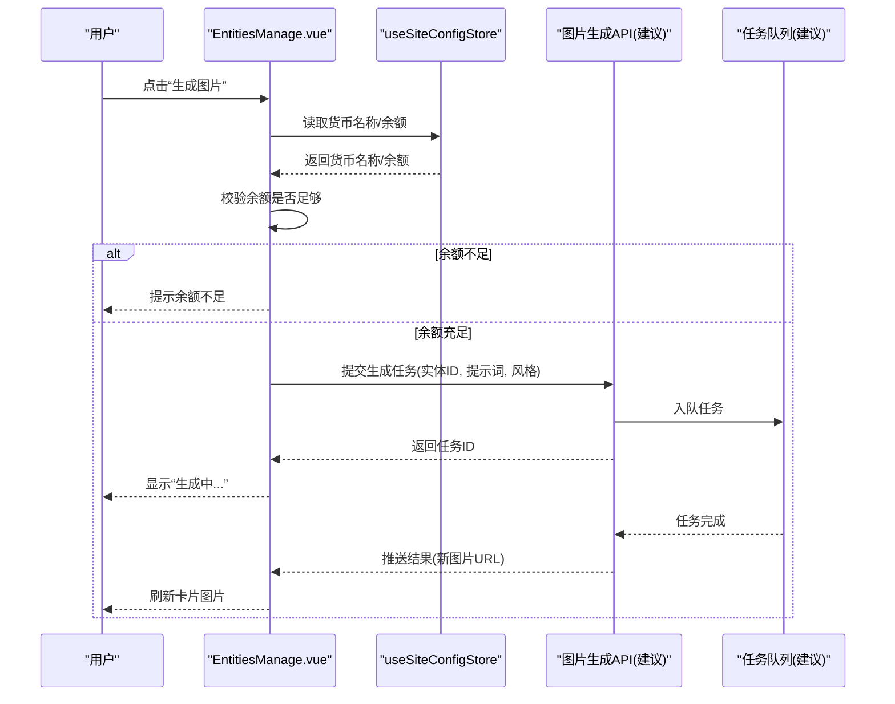
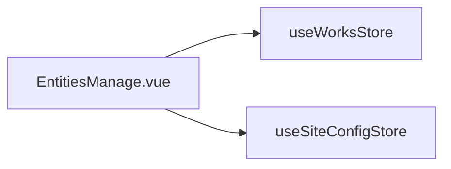

# 实体操作管理

<cite>
**本文引用的文件**
- [EntitiesManage.vue](file://frontend/src/views/EbisodesPage/EntitiesManage.vue)
- [projects.ts](file://frontend/src/stores/projects.ts)
- [siteConfig.ts](file://frontend/src/stores/siteConfig.ts)
</cite>

## 目录
1. [简介](#简介)
2. [项目结构](#项目结构)
3. [核心组件与数据模型](#核心组件与数据模型)
4. [架构总览](#架构总览)
5. [详细组件分析](#详细组件分析)
6. [依赖关系分析](#依赖关系分析)
7. [性能与体验优化](#性能与体验优化)
8. [权限控制与数据同步策略](#权限控制与数据同步策略)
9. [异常处理与错误恢复](#异常处理与错误恢复)
10. [结论](#结论)

## 简介
本文件围绕“实体操作管理”展开，聚焦角色、场景、道具三类实体的增删改查、批量处理与状态管理；并详细说明实体卡片组件的交互逻辑、图片生成集成、音色试听与编辑替换流程。同时给出权限控制、数据同步策略、用户反馈机制以及异常处理与错误恢复的最佳实践建议。

## 项目结构
当前与实体管理直接相关的前端代码位于视图层与状态管理层：
- 视图层：实体管理页面（角色/场景/道具三标签页）
- 状态层：作品与分镜的状态管理、站点配置（含货币名称/余额）

图表来源
- [EntitiesManage.vue:1-443](file://frontend/src/views/EbisodesPage/EntitiesManage.vue#L1-L443)
- [projects.ts:1-279](file://frontend/src/stores/projects.ts#L1-L279)
- [siteConfig.ts:1-100](file://frontend/src/stores/siteConfig.ts#L1-L100)

章节来源
- [EntitiesManage.vue:1-443](file://frontend/src/views/EbisodesPage/EntitiesManage.vue#L1-L443)
- [projects.ts:1-279](file://frontend/src/stores/projects.ts#L1-L279)
- [siteConfig.ts:1-100](file://frontend/src/stores/siteConfig.ts#L1-L100)

## 核心组件与数据模型
- 实体类型
  - 角色：包含头像、音色、描述、小传等字段
  - 场景：包含背景图、描述等字段
  - 道具：包含图片、描述等字段
- 页面能力
  - 三标签切换：角色列表、场景列表、道具列表
  - 每个实体卡片支持：编辑、替换、删除、生成图片（带消耗提示）、试听（角色）
  - 底部工具栏：批量生成图片、重新生成分镜列表、旁白音色选择展示
- 状态与配置
  - 使用 Pinia 管理作品/剧集/分镜数据
  - 站点配置提供货币名称与余额计算，用于显示生成图片的消耗提示

章节来源
- [EntitiesManage.vue:29-121](file://frontend/src/views/EbisodesPage/EntitiesManage.vue#L29-L121)
- [EntitiesManage.vue:139-413](file://frontend/src/views/EbisodesPage/EntitiesManage.vue#L139-L413)
- [projects.ts:7-70](file://frontend/src/stores/projects.ts#L7-L70)
- [siteConfig.ts:53-72](file://frontend/src/stores/siteConfig.ts#L53-L72)

## 架构总览
实体管理页面的交互由视图层驱动，通过状态层维护数据与配置。图片生成与音色试听为扩展点，当前以占位实现为主，后续可接入后端服务或第三方能力。

图表来源
- [EntitiesManage.vue:130-136](file://frontend/src/views/EbisodesPage/EntitiesManage.vue#L130-L136)
- [EntitiesManage.vue:170-175](file://frontend/src/views/EbisodesPage/EntitiesManage.vue#L170-L175)
- [EntitiesManage.vue:212-217](file://frontend/src/views/EbisodesPage/EntitiesManage.vue#L212-L217)
- [EntitiesManage.vue:403-408](file://frontend/src/views/EbisodesPage/EntitiesManage.vue#L403-L408)
- [siteConfig.ts:53-59](file://frontend/src/stores/siteConfig.ts#L53-L59)
- [projects.ts:165-171](file://frontend/src/stores/projects.ts#L165-L171)

## 详细组件分析

### 实体卡片组件与交互逻辑
- 布局结构
  - 顶部区域：头像/图片 + 基础信息（名称、音色、描述、小传）
  - 操作区：编辑、替换、删除按钮
  - 生成区：在头像/图片上叠加“生成形象/生成图片”按钮，并显示消耗提示
  - 试听区：角色卡片内提供“试听”按钮
- 交互要点
  - 生成图片：通过站点配置的货币名称动态显示消耗文案
  - 试听：仅角色卡片具备，点击后触发试听（当前为占位）
  - 编辑/替换/删除：绑定到对应方法，当前为占位实现
  - 批量生成：底部工具栏根据当前标签动态显示“批量生成X图片”
  - 重新生成分镜列表：跳转到分镜列表页，并携带 work_id 查询参数

图表来源
- [EntitiesManage.vue:139-413](file://frontend/src/views/EbisodesPage/EntitiesManage.vue#L139-L413)
- [siteConfig.ts:53-59](file://frontend/src/stores/siteConfig.ts#L53-L59)

章节来源
- [EntitiesManage.vue:139-413](file://frontend/src/views/EbisodesPage/EntitiesManage.vue#L139-L413)

### 数据模型与状态管理
- 角色/场景/道具数据结构
  - 角色：id、name、type、avatar、voiceType、description、biography
  - 场景：id、name、image、description
  - 道具：id、name、image、description
- 作品/剧集/分镜状态
  - 使用 Pinia 管理 works、episodes、scenes 等数据
  - 提供新增、更新、删除、排序等方法，便于后续与实体关联

图表来源
- [projects.ts:7-70](file://frontend/src/stores/projects.ts#L7-L70)
- [projects.ts:72-279](file://frontend/src/stores/projects.ts#L72-L279)
- [siteConfig.ts:1-100](file://frontend/src/stores/siteConfig.ts#L1-L100)
- [EntitiesManage.vue:29-121](file://frontend/src/views/EbisodesPage/EntitiesManage.vue#L29-L121)

章节来源
- [projects.ts:7-70](file://frontend/src/stores/projects.ts#L7-L70)
- [projects.ts:72-279](file://frontend/src/stores/projects.ts#L72-L279)
- [siteConfig.ts:1-100](file://frontend/src/stores/siteConfig.ts#L1-L100)
- [EntitiesManage.vue:29-121](file://frontend/src/views/EbisodesPage/EntitiesManage.vue#L29-L121)

### 图片生成集成方案
- 前端侧
  - 从站点配置获取货币名称，用于提示“消耗X货币”
  - 点击生成按钮时，先校验余额/积分是否足够（基于站点配置与用户余额）
  - 将生成请求入队，支持批量提交
- 后端侧（建议）
  - 提供统一的图片生成接口，接收实体ID、提示词、风格参数等
  - 异步队列处理生成任务，完成后回调通知前端刷新
- 前端-后端交互流程

[此图为概念性流程图，未直接映射具体源码文件]

### 音色试听功能
- 触发入口：角色卡片中的“试听”按钮
- 行为说明：当前为占位实现，后续可接入TTS或预置音频资源
- 用户体验：播放前提示可能产生费用（结合站点配置），播放结束后释放资源

章节来源
- [EntitiesManage.vue:212-217](file://frontend/src/views/EbisodesPage/EntitiesManage.vue#L212-L217)

### 编辑与替换流程
- 编辑：打开实体编辑表单，保存后更新本地状态并同步后端（建议）
- 替换：从库中选择替代项，确认后替换当前实体资源（如图片、音色等）
- 删除：二次确认后删除实体，并清理关联资源（建议）

章节来源
- [EntitiesManage.vue:130-136](file://frontend/src/views/EbisodesPage/EntitiesManage.vue#L130-L136)

## 依赖关系分析
- 组件依赖
  - EntitiesManage.vue 依赖 useWorksStore（跳转分镜列表）与 useSiteConfigStore（货币名称/余额）
- 状态依赖
  - useWorksStore 提供作品/剧集/分镜的数据与方法
  - useSiteConfigStore 提供站点配置与货币计算

图表来源
- [EntitiesManage.vue:1-11](file://frontend/src/views/EbisodesPage/EntitiesManage.vue#L1-L11)
- [projects.ts:72-279](file://frontend/src/stores/projects.ts#L72-L279)
- [siteConfig.ts:1-100](file://frontend/src/stores/siteConfig.ts#L1-L100)

章节来源
- [EntitiesManage.vue:1-11](file://frontend/src/views/EbisodesPage/EntitiesManage.vue#L1-L11)
- [projects.ts:72-279](file://frontend/src/stores/projects.ts#L72-L279)
- [siteConfig.ts:1-100](file://frontend/src/stores/siteConfig.ts#L1-L100)

## 性能与体验优化
- 虚拟滚动：当实体数量较大时，建议使用虚拟列表减少DOM节点数量
- 懒加载图片：对卡片图片启用懒加载，提升首屏渲染速度
- 防抖/节流：批量生成与重试操作应做防抖/节流，避免重复提交
- 缓存策略：对已生成的图片进行本地缓存，减少重复请求
- 进度反馈：批量任务采用进度条与失败重试提示，提升可感知性

[本节为通用指导，不直接分析具体文件]

## 权限控制与数据同步策略
- 权限控制（建议）
  - 基于角色的访问控制：区分普通用户与管理员，控制创建/编辑/删除/批量操作的可见性与可用性
  - 资源级权限：按作品/剧集维度校验操作权限
  - 操作审计：记录关键操作日志（创建、删除、替换、批量生成）
- 数据同步策略（建议）
  - 乐观更新：对非关键操作（如本地预览）先更新UI，再异步同步后端
  - 冲突解决：当多人协作时，采用版本号或时间戳解决冲突
  - 离线支持：对编辑内容做本地暂存，网络恢复后自动同步
  - 一致性保障：对删除/替换等强一致操作，采用事务或幂等接口

[本节为通用指导，不直接分析具体文件]

## 异常处理与错误恢复
- 前端异常
  - 网络异常：统一拦截器捕获并提示用户，支持重试
  - 业务异常：根据错误码分类提示（如余额不足、资源不存在）
  - 用户误操作：删除/替换前弹出确认框，并提供撤销选项
- 后端异常（建议）
  - 幂等设计：确保重复提交不会导致副作用
  - 任务失败重试：对生成类任务设置最大重试次数与退避策略
  - 降级策略：当外部服务不可用时，返回友好提示与兜底资源
- 恢复机制（建议）
  - 断点续传：大文件上传/下载支持断点续传
  - 状态回滚：关键操作失败时回滚到上一稳定状态
  - 补偿任务：对失败任务建立补偿队列，定时重试

[本节为通用指导，不直接分析具体文件]

## 结论
实体操作管理模块在当前版本提供了清晰的三标签结构与卡片交互框架，具备图片生成提示、试听入口与批量操作入口。下一步建议完善后端接口与状态同步、增强权限控制与异常处理，并通过性能优化与用户体验改进提升整体质量。