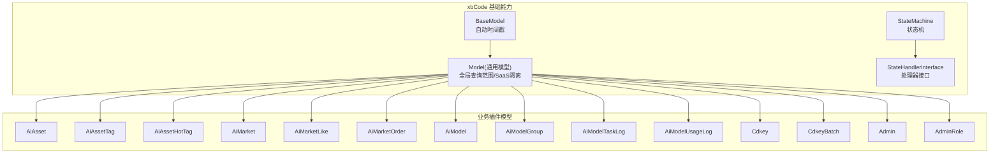
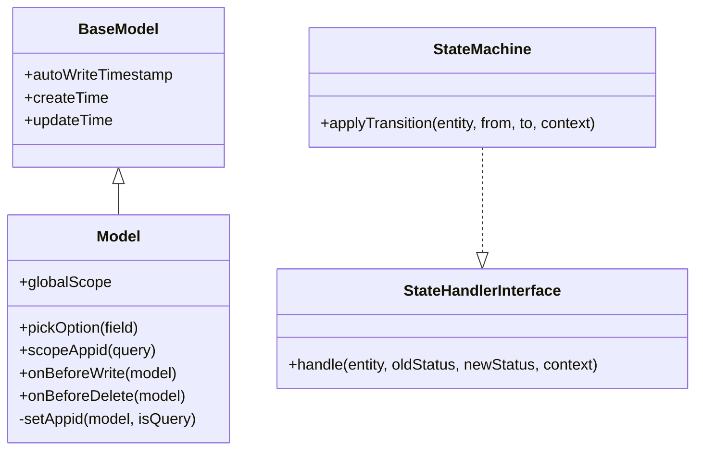
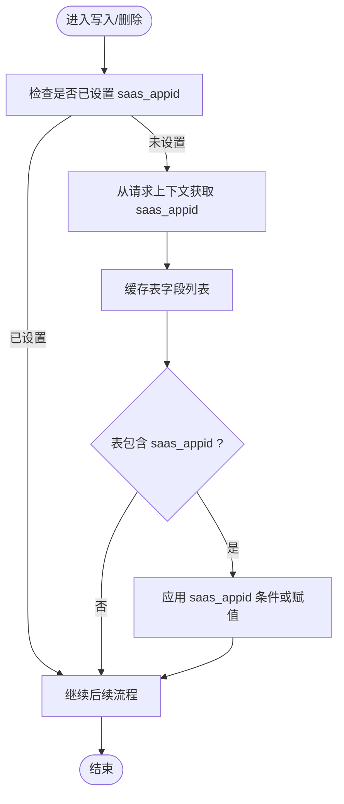
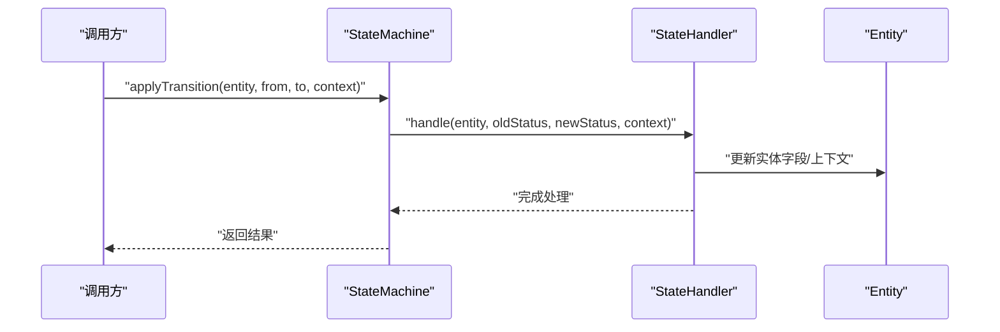
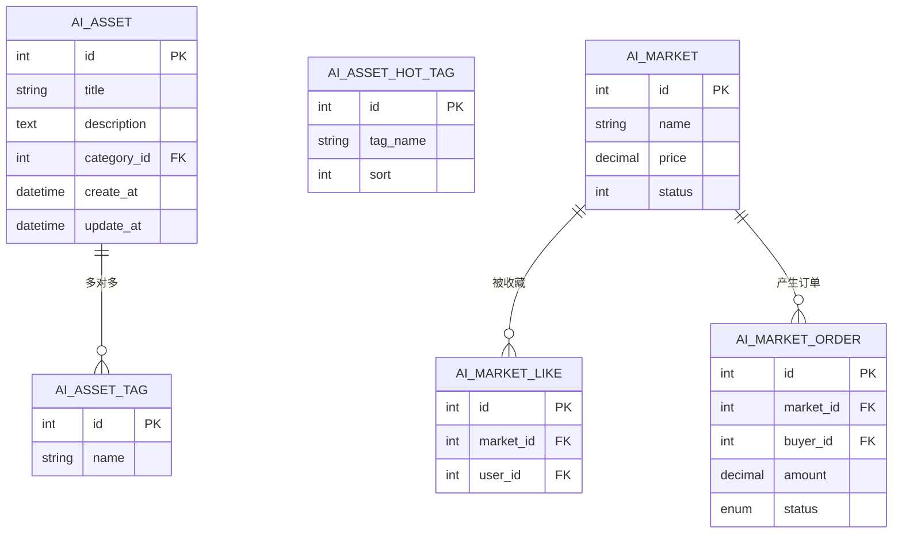
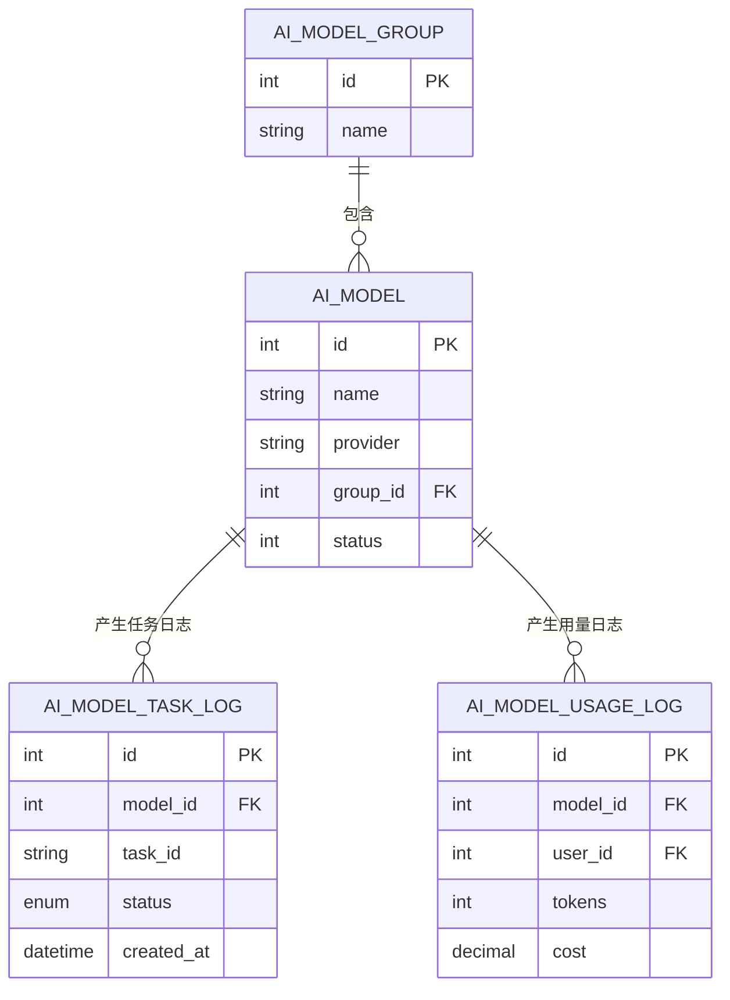
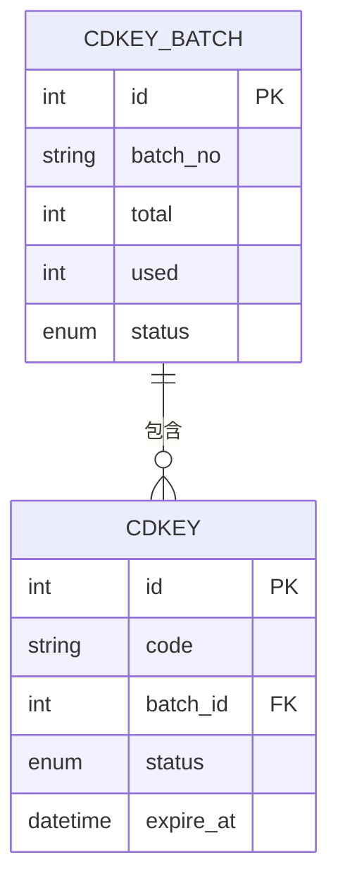
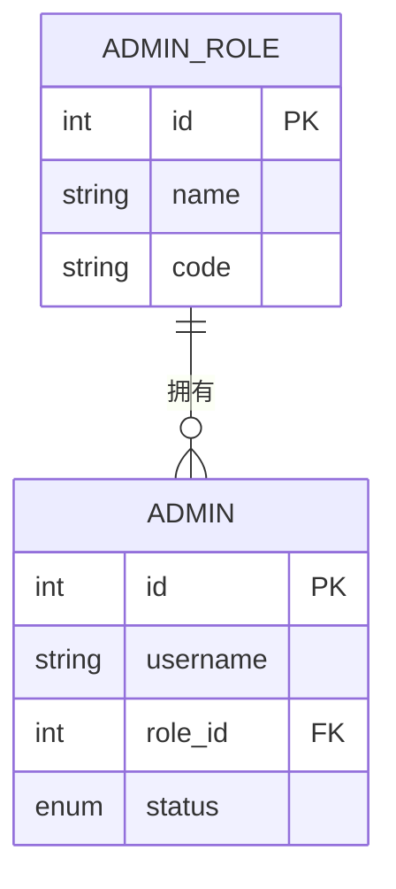
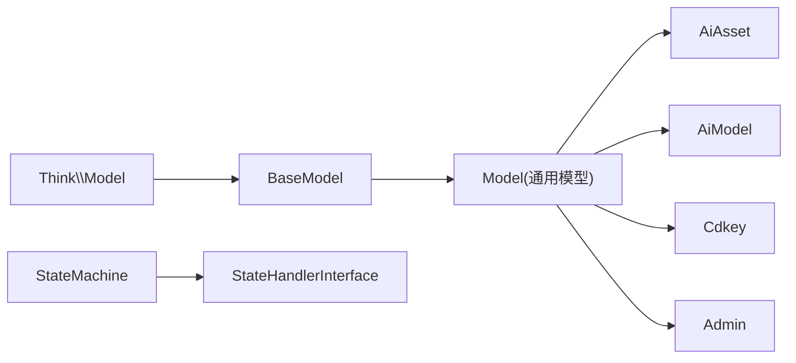

# 实体管理

<cite>
**本文引用的文件**   
- [server/plugin/xbCode/base/BaseModel.php](file://server/plugin/xbCode/base/BaseModel.php)
- [server/plugin/xbCode/Model.php](file://server/plugin/xbCode/Model.php)
- [server/plugin/xbCode/base/stateMachine/StateMachine.php](file://server/plugin/xbCode/base/stateMachine/StateMachine.php)
- [server/plugin/xbCode/base/stateMachine/StateHandlerInterface.php](file://server/plugin/xbCode/base/stateMachine/StateHandlerInterface.php)
- [server/plugin/xbAiAsset/app/model/AiAsset.php](file://server/plugin/xbAiAsset/app/model/AiAsset.php)
- [server/plugin/xbAiAsset/app/model/AiAssetTag.php](file://server/plugin/xbAiAsset/app/model/AiAssetTag.php)
- [server/plugin/xbAiAsset/app/model/AiAssetHotTag.php](file://server/plugin/xbAiAsset/app/model/AiAssetHotTag.php)
- [server/plugin/xbAiAsset/app/model/AiMarket.php](file://server/plugin/xbAiAsset/app/model/AiMarket.php)
- [server/plugin/xbAiAsset/app/model/AiMarketLike.php](file://server/plugin/xbAiAsset/app/model/AiMarketLike.php)
- [server/plugin/xbAiAsset/app/model/AiMarketOrder.php](file://server/plugin/xbAiAsset/app/model/AiMarketOrder.php)
- [server/plugin/xbAiModelAgent/app/model/AiModel.php](file://server/plugin/xbAiModelAgent/app/model/AiModel.php)
- [server/plugin/xbAiModelAgent/app/model/AiModelGroup.php](file://server/plugin/xbAiModelAgent/app/model/AiModelGroup.php)
- [server/plugin/xbAiModelAgent/app/model/AiModelTaskLog.php](file://server/plugin/xbAiModelAgent/app/model/AiModelTaskLog.php)
- [server/plugin/xbAiModelAgent/app/model/AiModelUsageLog.php](file://server/plugin/xbAiModelAgent/app/model/AiModelUsageLog.php)
- [server/plugin/xbCdKey/app/model/Cdkey.php](file://server/plugin/xbCdKey/app/model/Cdkey.php)
- [server/plugin/xbCdKey/app/model/CdkeyBatch.php](file://server/plugin/xbCdKey/app/model/CdkeyBatch.php)
- [server/plugin/xbUser/app/model/Admin.php](file://server/plugin/xbUser/app/model/Admin.php)
- [server/plugin/xbUser/app/model/AdminRole.php](file://server/plugin/xbUser/app/model/AdminRole.php)
</cite>

## 目录
1. [简介](#简介)
2. [项目结构](#项目结构)
3. [核心组件](#核心组件)
4. [架构总览](#架构总览)
5. [详细组件分析](#详细组件分析)
6. [依赖分析](#依赖分析)
7. [性能考虑](#性能考虑)
8. [故障排查指南](#故障排查指南)
9. [结论](#结论)
10. [附录](#附录)

## 简介
本文件围绕“实体管理”能力，系统梳理后端模型基类、通用模型、状态机与领域实体的组织方式，并基于现有代码归纳出实体类型体系、属性配置、关联关系、批量编辑机制、动态表单生成、数据验证规则、版本控制策略、生命周期管理、权限控制、审计日志与性能优化方案。文档同时提供建模最佳实践与扩展开发指南，帮助开发者在插件化架构下高效构建可维护的实体层。

## 项目结构
本项目采用多插件架构，实体定义集中在各插件的 app/model 目录下；通用模型能力由 xbCode 插件提供，包括基础模型、全局查询范围、SaaS 租户隔离、自动时间戳等。前端通过 API 调用后端控制器与服务完成实体 CRUD、批量操作与动态表单渲染。

图表来源
- [server/plugin/xbCode/base/BaseModel.php:1-36](file://server/plugin/xbCode/base/BaseModel.php#L1-L36)
- [server/plugin/xbCode/Model.php:1-116](file://server/plugin/xbCode/Model.php#L1-L116)
- [server/plugin/xbCode/base/stateMachine/StateMachine.php:1-200](file://server/plugin/xbCode/base/stateMachine/StateMachine.php#L1-L200)
- [server/plugin/xbCode/base/stateMachine/StateHandlerInterface.php:1-40](file://server/plugin/xbCode/base/stateMachine/StateHandlerInterface.php#L1-L40)
- [server/plugin/xbAiAsset/app/model/AiAsset.php:1-200](file://server/plugin/xbAiAsset/app/model/AiAsset.php#L1-L200)
- [server/plugin/xbAiAsset/app/model/AiAssetTag.php:1-200](file://server/plugin/xbAiAsset/app/model/AiAssetTag.php#L1-L200)
- [server/plugin/xbAiAsset/app/model/AiAssetHotTag.php:1-200](file://server/plugin/xbAiAsset/app/model/AiAssetHotTag.php#L1-L200)
- [server/plugin/xbAiAsset/app/model/AiMarket.php:1-200](file://server/plugin/xbAiAsset/app/model/AiMarket.php#L1-L200)
- [server/plugin/xbAiAsset/app/model/AiMarketLike.php:1-200](file://server/plugin/xbAiAsset/app/model/AiMarketLike.php#L1-L200)
- [server/plugin/xbAiAsset/app/model/AiMarketOrder.php:1-200](file://server/plugin/xbAiAsset/app/model/AiMarketOrder.php#L1-L200)
- [server/plugin/xbAiModelAgent/app/model/AiModel.php:1-200](file://server/plugin/xbAiModelAgent/app/model/AiModel.php#L1-L200)
- [server/plugin/xbAiModelAgent/app/model/AiModelGroup.php:1-200](file://server/plugin/xbAiModelAgent/app/model/AiModelGroup.php#L1-L200)
- [server/plugin/xbAiModelAgent/app/model/AiModelTaskLog.php:1-200](file://server/plugin/xbAiModelAgent/app/model/AiModelTaskLog.php#L1-L200)
- [server/plugin/xbAiModelAgent/app/model/AiModelUsageLog.php:1-200](file://server/plugin/xbAiModelAgent/app/model/AiModelUsageLog.php#L1-L200)
- [server/plugin/xbCdKey/app/model/Cdkey.php:1-200](file://server/plugin/xbCdKey/app/model/Cdkey.php#L1-L200)
- [server/plugin/xbCdKey/app/model/CdkeyBatch.php:1-200](file://server/plugin/xbCdKey/app/model/CdkeyBatch.php#L1-L200)
- [server/plugin/xbUser/app/model/Admin.php:1-200](file://server/plugin/xbUser/app/model/Admin.php#L1-L200)
- [server/plugin/xbUser/app/model/AdminRole.php:1-200](file://server/plugin/xbUser/app/model/AdminRole.php#L1-L200)

章节来源
- [server/plugin/xbCode/base/BaseModel.php:1-36](file://server/plugin/xbCode/base/BaseModel.php#L1-L36)
- [server/plugin/xbCode/Model.php:1-116](file://server/plugin/xbCode/Model.php#L1-L116)

## 核心组件
- 基础模型（BaseModel）：统一开启自动时间戳，约定创建/更新时间字段名，保证所有实体具备一致的审计时间信息。
- 通用模型（Model）：继承基础模型，提供全局查询范围、写入/删除前事件钩子，实现 SaaS 租户隔离（saas_appid），并提供选择器数据获取方法。
- 状态机（StateMachine + StateHandlerInterface）：为实体提供状态流转抽象，支持在状态变更前后执行自定义逻辑，便于实现版本演进与流程控制。

章节来源
- [server/plugin/xbCode/base/BaseModel.php:1-36](file://server/plugin/xbCode/base/BaseModel.php#L1-L36)
- [server/plugin/xbCode/Model.php:1-116](file://server/plugin/xbCode/Model.php#L1-L116)
- [server/plugin/xbCode/base/stateMachine/StateMachine.php:1-200](file://server/plugin/xbCode/base/stateMachine/StateMachine.php#L1-L200)
- [server/plugin/xbCode/base/stateMachine/StateHandlerInterface.php:1-40](file://server/plugin/xbCode/base/stateMachine/StateHandlerInterface.php#L1-L40)

## 架构总览
实体层以 ThinkORM Model 为基础，通过 xbCode 插件提供的 BaseModel 与 Model 增强通用能力；各业务插件按领域划分模型，形成清晰的实体边界。状态机用于复杂实体的生命周期与版本控制。

图表来源
- [server/plugin/xbCode/base/BaseModel.php:1-36](file://server/plugin/xbCode/base/BaseModel.php#L1-L36)
- [server/plugin/xbCode/Model.php:1-116](file://server/plugin/xbCode/Model.php#L1-L116)
- [server/plugin/xbCode/base/stateMachine/StateMachine.php:1-200](file://server/plugin/xbCode/base/stateMachine/StateMachine.php#L1-L200)
- [server/plugin/xbCode/base/stateMachine/StateHandlerInterface.php:1-40](file://server/plugin/xbCode/base/stateMachine/StateHandlerInterface.php#L1-L40)

## 详细组件分析

### 基础模型与通用模型
- 自动时间戳：统一使用 datetime 格式，字段名为 create_at 与 update_at，便于审计与排序。
- 全局查询范围：默认启用 saas_appid 过滤，确保跨租户数据隔离。
- 写入/删除前事件：在 onBeforeWrite/onBeforeDelete 中注入 saas_appid，避免遗漏。
- 选择器数据：提供 pickOption 快速返回下拉选项数据，减少重复查询拼装。

图表来源
- [server/plugin/xbCode/Model.php:60-116](file://server/plugin/xbCode/Model.php#L60-L116)

章节来源
- [server/plugin/xbCode/base/BaseModel.php:1-36](file://server/plugin/xbCode/base/BaseModel.php#L1-L36)
- [server/plugin/xbCode/Model.php:1-116](file://server/plugin/xbCode/Model.php#L1-L116)

### 状态机与版本控制
- 状态机接口：定义 handle(entity, oldStatus, newStatus, context)，允许在状态变更前修改实体其他字段或记录上下文。
- 状态机实现：提供 applyTransition 等能力，支持嵌套流转，适合实现实体版本推进、审批流、发布流程等。

图表来源
- [server/plugin/xbCode/base/stateMachine/StateMachine.php:1-200](file://server/plugin/xbCode/base/stateMachine/StateMachine.php#L1-L200)
- [server/plugin/xbCode/base/stateMachine/StateHandlerInterface.php:1-40](file://server/plugin/xbCode/base/stateMachine/StateHandlerInterface.php#L1-L40)

章节来源
- [server/plugin/xbCode/base/stateMachine/StateMachine.php:1-200](file://server/plugin/xbCode/base/stateMachine/StateMachine.php#L1-L200)
- [server/plugin/xbCode/base/stateMachine/StateHandlerInterface.php:1-40](file://server/plugin/xbCode/base/stateMachine/StateHandlerInterface.php#L1-L40)

### 资产域实体（xbAiAsset）
- AiAsset：资源主实体，承载元数据、分类、标签等。
- AiAssetTag：标签实体，支持资源与标签的多对多关系。
- AiAssetHotTag：热门标签实体，常用于首页推荐与筛选。
- AiMarket/AiMarketLike/AiMarketOrder：市场交易相关实体，体现商品、收藏、订单等关系。

图表来源
- [server/plugin/xbAiAsset/app/model/AiAsset.php:1-200](file://server/plugin/xbAiAsset/app/model/AiAsset.php#L1-L200)
- [server/plugin/xbAiAsset/app/model/AiAssetTag.php:1-200](file://server/plugin/xbAiAsset/app/model/AiAssetTag.php#L1-L200)
- [server/plugin/xbAiAsset/app/model/AiAssetHotTag.php:1-200](file://server/plugin/xbAiAsset/app/model/AiAssetHotTag.php#L1-L200)
- [server/plugin/xbAiAsset/app/model/AiMarket.php:1-200](file://server/plugin/xbAiAsset/app/model/AiMarket.php#L1-L200)
- [server/plugin/xbAiAsset/app/model/AiMarketLike.php:1-200](file://server/plugin/xbAiAsset/app/model/AiMarketLike.php#L1-L200)
- [server/plugin/xbAiAsset/app/model/AiMarketOrder.php:1-200](file://server/plugin/xbAiAsset/app/model/AiMarketOrder.php#L1-L200)

章节来源
- [server/plugin/xbAiAsset/app/model/AiAsset.php:1-200](file://server/plugin/xbAiAsset/app/model/AiAsset.php#L1-L200)
- [server/plugin/xbAiAsset/app/model/AiAssetTag.php:1-200](file://server/plugin/xbAiAsset/app/model/AiAssetTag.php#L1-L200)
- [server/plugin/xbAiAsset/app/model/AiAssetHotTag.php:1-200](file://server/plugin/xbAiAsset/app/model/AiAssetHotTag.php#L1-L200)
- [server/plugin/xbAiAsset/app/model/AiMarket.php:1-200](file://server/plugin/xbAiAsset/app/model/AiMarket.php#L1-L200)
- [server/plugin/xbAiAsset/app/model/AiMarketLike.php:1-200](file://server/plugin/xbAiAsset/app/model/AiMarketLike.php#L1-L200)
- [server/plugin/xbAiAsset/app/model/AiMarketOrder.php:1-200](file://server/plugin/xbAiAsset/app/model/AiMarketOrder.php#L1-L200)

### 模型代理域实体（xbAiModelAgent）
- AiModel/AiModelGroup：模型与分组，支撑模型管理与编排。
- AiModelTaskLog/AiModelUsageLog：任务与用量日志，用于审计与计费统计。

图表来源
- [server/plugin/xbAiModelAgent/app/model/AiModel.php:1-200](file://server/plugin/xbAiModelAgent/app/model/AiModel.php#L1-L200)
- [server/plugin/xbAiModelAgent/app/model/AiModelGroup.php:1-200](file://server/plugin/xbAiModelAgent/app/model/AiModelGroup.php#L1-L200)
- [server/plugin/xbAiModelAgent/app/model/AiModelTaskLog.php:1-200](file://server/plugin/xbAiModelAgent/app/model/AiModelTaskLog.php#L1-L200)
- [server/plugin/xbAiModelAgent/app/model/AiModelUsageLog.php:1-200](file://server/plugin/xbAiModelAgent/app/model/AiModelUsageLog.php#L1-L200)

章节来源
- [server/plugin/xbAiModelAgent/app/model/AiModel.php:1-200](file://server/plugin/xbAiModelAgent/app/model/AiModel.php#L1-L200)
- [server/plugin/xbAiModelAgent/app/model/AiModelGroup.php:1-200](file://server/plugin/xbAiModelAgent/app/model/AiModelGroup.php#L1-L200)
- [server/plugin/xbAiModelAgent/app/model/AiModelTaskLog.php:1-200](file://server/plugin/xbAiModelAgent/app/model/AiModelTaskLog.php#L1-L200)
- [server/plugin/xbAiModelAgent/app/model/AiModelUsageLog.php:1-200](file://server/plugin/xbAiModelAgent/app/model/AiModelUsageLog.php#L1-L200)

### 码号域实体（xbCdKey）
- Cdkey：单码实体，支持激活、绑定、过期等状态。
- CdkeyBatch：批次实体，用于批量生成与管理码号。

图表来源
- [server/plugin/xbCdKey/app/model/Cdkey.php:1-200](file://server/plugin/xbCdKey/app/model/Cdkey.php#L1-L200)
- [server/plugin/xbCdKey/app/model/CdkeyBatch.php:1-200](file://server/plugin/xbCdKey/app/model/CdkeyBatch.php#L1-L200)

章节来源
- [server/plugin/xbCdKey/app/model/Cdkey.php:1-200](file://server/plugin/xbCdKey/app/model/Cdkey.php#L1-L200)
- [server/plugin/xbCdKey/app/model/CdkeyBatch.php:1-200](file://server/plugin/xbCdKey/app/model/CdkeyBatch.php#L1-L200)

### 用户与权限域实体（xbUser）
- Admin：管理员账户实体。
- AdminRole：角色实体，通常与权限点、菜单、API 访问控制关联。

图表来源
- [server/plugin/xbUser/app/model/Admin.php:1-200](file://server/plugin/xbUser/app/model/Admin.php#L1-L200)
- [server/plugin/xbUser/app/model/AdminRole.php:1-200](file://server/plugin/xbUser/app/model/AdminRole.php#L1-L200)

章节来源
- [server/plugin/xbUser/app/model/Admin.php:1-200](file://server/plugin/xbUser/app/model/Admin.php#L1-L200)
- [server/plugin/xbUser/app/model/AdminRole.php:1-200](file://server/plugin/xbUser/app/model/AdminRole.php#L1-L200)

## 依赖分析
- 模型继承链：业务模型均继承自 xbCode 的 Model，进而继承 BaseModel，最终继承 ThinkORM Model。
- 全局作用域：Model 通过 globalScope 与 scopeAppid 实现跨租户数据隔离。
- 状态机耦合：状态机与处理器接口解耦，便于在不同实体上复用状态流转逻辑。

图表来源
- [server/plugin/xbCode/base/BaseModel.php:1-36](file://server/plugin/xbCode/base/BaseModel.php#L1-L36)
- [server/plugin/xbCode/Model.php:1-116](file://server/plugin/xbCode/Model.php#L1-L116)
- [server/plugin/xbCode/base/stateMachine/StateMachine.php:1-200](file://server/plugin/xbCode/base/stateMachine/StateMachine.php#L1-L200)
- [server/plugin/xbCode/base/stateMachine/StateHandlerInterface.php:1-40](file://server/plugin/xbCode/base/stateMachine/StateHandlerInterface.php#L1-L40)
- [server/plugin/xbAiAsset/app/model/AiAsset.php:1-200](file://server/plugin/xbAiAsset/app/model/AiAsset.php#L1-L200)
- [server/plugin/xbAiModelAgent/app/model/AiModel.php:1-200](file://server/plugin/xbAiModelAgent/app/model/AiModel.php#L1-L200)
- [server/plugin/xbCdKey/app/model/Cdkey.php:1-200](file://server/plugin/xbCdKey/app/model/Cdkey.php#L1-L200)
- [server/plugin/xbUser/app/model/Admin.php:1-200](file://server/plugin/xbUser/app/model/Admin.php#L1-L200)

章节来源
- [server/plugin/xbCode/base/BaseModel.php:1-36](file://server/plugin/xbCode/base/BaseModel.php#L1-L36)
- [server/plugin/xbCode/Model.php:1-116](file://server/plugin/xbCode/Model.php#L1-L116)

## 性能考虑
- 自动时间戳：减少手动维护时间字段的开销，提升一致性。
- 全局查询范围：在查询层统一附加 saas_appid 条件，避免业务层重复拼接，降低漏写风险。
- 字段缓存：在 setAppid 中对表字段进行短时缓存，减少频繁反射或元数据查询。
- 选择器数据：使用 pickOption 直接返回结构化选项，减少前端拼装成本。
- 建议：
  - 对高频查询增加必要索引（如 saas_appid、status、create_at）。
  - 批量操作优先使用批量插入/更新接口，减少往返次数。
  - 大对象或富文本字段考虑分表或归档策略。

[本节为通用指导，不直接分析具体文件]

## 故障排查指南
- 时间戳异常：确认模型是否继承 BaseModel，且未覆盖 autoWriteTimestamp/createTime/updateTime。
- 租户数据串扰：检查是否在非请求上下文（如定时任务）中正确传入 saas_appid，或在 Model::setAppid 中处理 nullsafe 场景。
- 状态机无效：确认状态处理器是否正确实现 handle 接口，并在 applyTransition 时传递正确的上下文。
- 选择器为空：检查数据库是否存在对应字段，以及 pickOption 的 field 参数是否符合预期。

章节来源
- [server/plugin/xbCode/base/BaseModel.php:1-36](file://server/plugin/xbCode/base/BaseModel.php#L1-L36)
- [server/plugin/xbCode/Model.php:85-116](file://server/plugin/xbCode/Model.php#L85-L116)
- [server/plugin/xbCode/base/stateMachine/StateHandlerInterface.php:1-40](file://server/plugin/xbCode/base/stateMachine/StateHandlerInterface.php#L1-L40)

## 结论
通过统一的模型基类与通用模型，项目在实体层面实现了时间戳、租户隔离、选择器数据等通用能力；状态机为复杂实体提供了可扩展的生命周期与版本控制手段。结合各插件领域的实体设计，形成了清晰、可复用的实体管理体系。建议在新增实体时遵循本文的最佳实践，充分利用通用能力，保持高内聚、低耦合的架构风格。

[本节为总结性内容，不直接分析具体文件]

## 附录

### 实体建模最佳实践
- 命名规范：实体类名与表名保持一致语义，字段名使用小写下划线。
- 字段设计：为常用查询字段建立索引；敏感字段加密存储；时间字段使用自动时间戳。
- 关联关系：一对多用 belongsTo/hasMany，多对多用中间表实体，避免过度耦合。
- 状态管理：将复杂状态迁移到状态机，避免在控制器中散落分支逻辑。
- 安全与合规：始终通过全局查询范围或显式条件限定 saas_appid，防止越权访问。

[本节为通用指导，不直接分析具体文件]

### 扩展开发指南
- 新建实体：
  - 在对应插件的 app/model 下创建实体类，继承 xbCode\Model。
  - 如需状态机，实现 StateHandlerInterface 并在服务层调用 StateMachine。
- 动态表单：
  - 利用 Model::pickOption 提供下拉选项，配合前端 XbForm 动态渲染。
- 批量编辑：
  - 在服务层封装批量更新方法，结合事务保证一致性。
- 数据验证：
  - 在控制器或服务层集中校验，错误信息国际化存放于 resource/translations。
- 审计日志：
  - 借助自动时间戳与日志实体（如 UsageLog/TaskLog）记录关键变更。

[本节为通用指导，不直接分析具体文件]