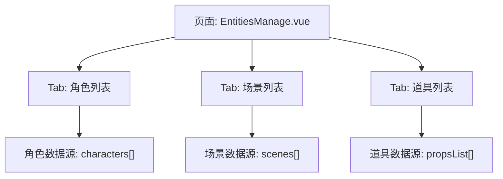
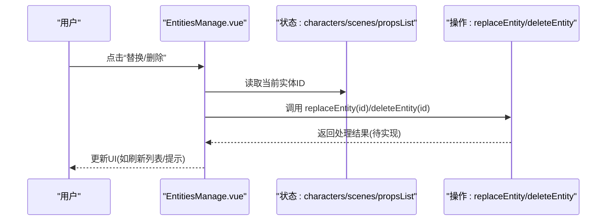
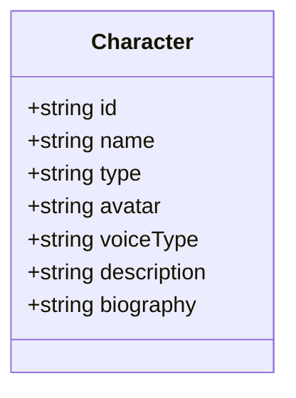
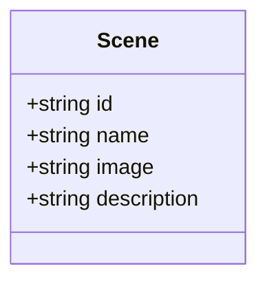
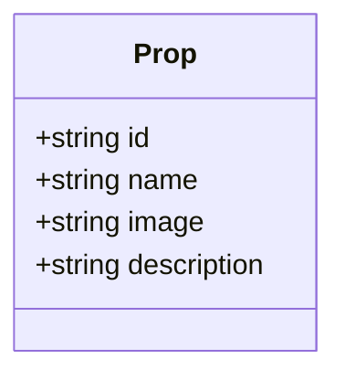
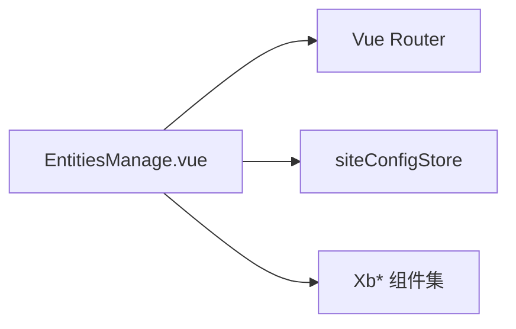

# 实体类型系统

<cite>
**本文引用的文件**   
- [EntitiesManage.vue](file://frontend/src/views/EpisodesPage/EntitiesManage.vue)
</cite>

## 目录
1. [引言](#引言)
2. [项目结构](#项目结构)
3. [核心组件](#核心组件)
4. [架构总览](#架构总览)
5. [详细组件分析](#详细组件分析)
6. [依赖分析](#依赖分析)
7. [性能考虑](#性能考虑)
8. [故障排查指南](#故障排查指南)
9. [结论](#结论)
10. [附录](#附录)

## 引言
本文件围绕“角色、场景、道具”三类核心实体，系统化梳理其定义、数据结构与业务含义，并给出扩展机制、自定义实体开发方法、类型验证规则以及配置与性能优化建议。文档面向前端实现与后续可扩展的通用实体体系，帮助读者快速理解现有实现并在此基础上进行演进。

## 项目结构
当前实体类型系统的核心实现位于分镜管理页面中，采用单页内多标签（Tab）组织三种实体：角色、场景、道具。每个 Tab 下以卡片列表展示实体信息，并提供统一的编辑、替换、删除等交互入口。

图表来源
- [EntitiesManage.vue:1-443](file://frontend/src/views/EpisodesPage/EntitiesManage.vue#L1-L443)

章节来源
- [EntitiesManage.vue:1-443](file://frontend/src/views/EpisodesPage/EntitiesManage.vue#L1-L443)

## 核心组件
- 统一容器与导航
  - 使用 Tabs 组件承载三个实体类型的子视图，通过 activeTab 控制当前显示内容。
- 数据模型
  - 角色 Entity：包含 id、name、type、avatar、voiceType、description、biography 等字段。
  - 场景 Scene：包含 id、name、image、description 等字段。
  - 道具 Prop：包含 id、name、image、description 等字段。
- 操作能力
  - 新增：各 Tab 提供“添加新X”占位卡片，预留从库选择或空白创建流程。
  - 编辑/替换/删除：每张实体卡片右上角提供对应操作按钮，其中 replaceEntity 与 deleteEntity 已预留接口位置。
  - 批量生成：底部工具栏根据当前 Tab 动态文案触发批量图片生成。
  - 旁白设置：底部左侧展示旁白音色选择。

章节来源
- [EntitiesManage.vue:21-37](file://frontend/src/views/EpisodesPage/EntitiesManage.vue#L21-L37)
- [EntitiesManage.vue:70-120](file://frontend/src/views/EpisodesPage/EntitiesManage.vue#L70-L120)
- [EntitiesManage.vue:122-136](file://frontend/src/views/EpisodesPage/EntitiesManage.vue#L122-L136)
- [EntitiesManage.vue:387-410](file://frontend/src/views/EpisodesPage/EntitiesManage.vue#L387-L410)

## 架构总览
从数据到渲染的流向如下：
- 状态层：characters、scenes、propsList 三组响应式数组维护实体集合。
- 视图层：Tabs 切换渲染不同实体列表；每个实体以卡片形式呈现关键信息与操作。
- 交互层：点击操作调用 replaceEntity/deleteEntity 等函数，预留与后端或本地库对接点。

图表来源
- [EntitiesManage.vue:122-136](file://frontend/src/views/EpisodesPage/EntitiesManage.vue#L122-L136)
- [EntitiesManage.vue:187-196](file://frontend/src/views/EpisodesPage/EntitiesManage.vue#L187-L196)
- [EntitiesManage.vue:290-297](file://frontend/src/views/EpisodesPage/EntitiesManage.vue#L290-L297)
- [EntitiesManage.vue:361-368](file://frontend/src/views/EpisodesPage/EntitiesManage.vue#L361-L368)

## 详细组件分析

### 角色实体（Character）
- 数据结构
  - id: string — 唯一标识
  - name: string — 角色名
  - type: string — 固定为“角色”，用于区分类型
  - avatar: string — 头像/立绘资源路径
  - voiceType: string — 音色描述
  - description: string — 角色外观/设定描述
  - biography: string — 角色小传
- 业务含义
  - 作为叙事中的行动主体，关联语音与形象，驱动对话与动作生成。
- 界面要点
  - 卡片顶部为头像与基本信息横向布局，下方为描述与小传的纵向布局。
  - 支持试听音色、生成形象、替换、删除等操作。

图表来源
- [EntitiesManage.vue:28-68](file://frontend/src/views/EpisodesPage/EntitiesManage.vue#L28-L68)

章节来源
- [EntitiesManage.vue:28-68](file://frontend/src/views/EpisodesPage/EntitiesManage.vue#L28-L68)
- [EntitiesManage.vue:158-241](file://frontend/src/views/EpisodesPage/EntitiesManage.vue#L158-L241)

### 场景实体（Scene）
- 数据结构
  - id: string — 唯一标识
  - name: string — 场景名
  - image: string — 背景图资源路径
  - description: string — 场景环境描述
- 业务含义
  - 作为故事发生的空间载体，影响画面构图与氛围渲染。
- 界面要点
  - 卡片顶部为场景大图，下方为名称与描述，支持编辑、替换、删除。

图表来源
- [EntitiesManage.vue:70-97](file://frontend/src/views/EpisodesPage/EntitiesManage.vue#L70-L97)

章节来源
- [EntitiesManage.vue:70-97](file://frontend/src/views/EpisodesPage/EntitiesManage.vue#L70-L97)
- [EntitiesManage.vue:244-313](file://frontend/src/views/EpisodesPage/EntitiesManage.vue#L244-L313)

### 道具实体（Prop）
- 数据结构
  - id: string — 唯一标识
  - name: string — 道具名
  - image: string — 道具图资源路径
  - description: string — 道具说明
- 业务含义
  - 作为可交互或叙事强调的物件，增强画面细节与剧情表达。
- 界面要点
  - 卡片结构与场景类似，顶部为道具图，下方为名称与描述，支持编辑、替换、删除。

图表来源
- [EntitiesManage.vue:99-120](file://frontend/src/views/EpisodesPage/EntitiesManage.vue#L99-L120)

章节来源
- [EntitiesManage.vue:99-120](file://frontend/src/views/EpisodesPage/EntitiesManage.vue#L99-L120)
- [EntitiesManage.vue:315-384](file://frontend/src/views/EpisodesPage/EntitiesManage.vue#L315-L384)

### 实体类型扩展机制与自定义开发
- 扩展思路
  - 在 Tabs 配置中新增一个 tab，并在模板中增加对应的插槽渲染逻辑。
  - 新增一组响应式数组作为该实体的数据源，并定义新的 TypeScript 接口。
  - 复用现有卡片样式与操作按钮，将具体字段映射到新接口。
- 开发步骤
  - 在 tabs 数组中添加新项（label/value）。
  - 新增 interface NewEntity，声明必要字段。
  - 新增 ref<NewEntity[]> 数据源，填充初始数据或接入 API。
  - 在 #newEntity 插槽中编写卡片渲染与操作逻辑。
  - 若需要新增操作，可在组件顶部补充相应方法（如 createNewEntity、updateNewEntity、deleteNewEntity）。
- 注意事项
  - 保持字段命名一致性与语义清晰，避免与已有实体冲突。
  - 对必填字段进行前端校验，减少无效请求。
  - 如需与后端联动，建议在 replaceEntity/deleteEntity 等钩子中统一封装。

章节来源
- [EntitiesManage.vue:21-27](file://frontend/src/views/EpisodesPage/EntitiesManage.vue#L21-L27)
- [EntitiesManage.vue:122-136](file://frontend/src/views/EpisodesPage/EntitiesManage.vue#L122-L136)

### 类型验证规则
- 基础校验
  - id：非空且唯一（建议由后端或全局 ID 生成器保证）。
  - name：非空，长度限制（例如 1~64 字符）。
  - 资源字段（avatar/image）：URL 格式校验，必要时检查是否可达。
  - 文本字段（description/biography 等）：可选，最大长度限制。
- 业务校验
  - 角色：voiceType 需来自预设音色库；type 固定为“角色”。
  - 场景/道具：image 必须存在，确保预览正常。
- 实现建议
  - 在新增/编辑弹窗中集中校验，失败时即时反馈。
  - 提交前统一执行一次校验，避免脏数据入库。

章节来源
- [EntitiesManage.vue:28-120](file://frontend/src/views/EpisodesPage/EntitiesManage.vue#L28-L120)

### 实体类型配置最佳实践
- 配置分层
  - 静态枚举：type 值、音色选项、分辨率/比例等枚举项集中管理。
  - 表单模式：为每种实体定义独立的表单 schema，便于复用与扩展。
  - 路由/菜单：按实体类型划分功能入口，提升可发现性。
- 一致性
  - 统一字段命名规范（驼峰/下划线），前后端保持一致。
  - 统一错误码与提示信息，便于国际化与排障。
- 可观测性
  - 记录关键操作日志（创建/更新/删除/替换），便于审计与回溯。

章节来源
- [EntitiesManage.vue:21-27](file://frontend/src/views/EpisodesPage/EntitiesManage.vue#L21-L27)
- [EntitiesManage.vue:387-410](file://frontend/src/views/EpisodesPage/EntitiesManage.vue#L387-L410)

## 依赖分析
- 内部依赖
  - Vue Router：用于跳转到分镜列表页（goToShotList）。
  - 站点配置 Store：获取货币名称用于生成按钮提示。
  - UI 组件库：XbTabs、XbButton、XbIcon、XbTooltip 等。
- 外部依赖
  - 无直接网络请求依赖（当前为前端演示数据与占位逻辑）。

图表来源
- [EntitiesManage.vue:1-19](file://frontend/src/views/EpisodesPage/EntitiesManage.vue#L1-L19)
- [EntitiesManage.vue:387-410](file://frontend/src/views/EpisodesPage/EntitiesManage.vue#L387-L410)

章节来源
- [EntitiesManage.vue:1-19](file://frontend/src/views/EpisodesPage/EntitiesManage.vue#L1-L19)
- [EntitiesManage.vue:387-410](file://frontend/src/views/EpisodesPage/EntitiesManage.vue#L387-L410)

## 性能考虑
- 列表渲染
  - 使用 key 绑定稳定标识（id），避免不必要的重渲染。
  - 大数据量时启用虚拟滚动或分页加载。
- 图片资源
  - 预加载常用缩略图，懒加载首屏外图片。
  - 对大图进行压缩与 CDN 加速。
- 交互优化
  - 批量操作合并请求，减少网络往返。
  - 防抖/节流高频事件（如搜索、筛选）。

[本节为通用指导，不直接分析具体文件]

## 故障排查指南
- 常见问题
  - 图片无法显示：检查 image/avatar 路径是否正确、CDN 是否可用。
  - 操作无响应：确认 replaceEntity/deleteEntity 是否已正确实现与调用。
  - 列表未更新：检查响应式数据是否被修改，key 是否稳定。
- 定位建议
  - 打开浏览器控制台查看是否有报错或警告。
  - 在关键函数处添加日志输出，追踪数据流与调用链。

章节来源
- [EntitiesManage.vue:122-136](file://frontend/src/views/EpisodesPage/EntitiesManage.vue#L122-L136)
- [EntitiesManage.vue:187-196](file://frontend/src/views/EpisodesPage/EntitiesManage.vue#L187-L196)
- [EntitiesManage.vue:290-297](file://frontend/src/views/EpisodesPage/EntitiesManage.vue#L290-L297)
- [EntitiesManage.vue:361-368](file://frontend/src/views/EpisodesPage/EntitiesManage.vue#L361-L368)

## 结论
当前实体类型系统以清晰的三类核心实体为基础，提供了统一的展示与操作框架。通过标准化的数据结构与可扩展的 Tab 模式，能够便捷地新增自定义实体类型。后续建议完善类型校验、统一 API 对接与性能优化策略，以提升系统的稳定性与可维护性。

[本节为总结性内容，不直接分析具体文件]

## 附录
- 术语表
  - 实体：系统中可被创建、编辑、替换与删除的业务对象。
  - 类型：用于区分不同实体的分类标识（如角色、场景、道具）。
  - 卡片：实体在列表中的可视化单元，包含关键信息与操作入口。

[本节为概念性内容，不直接分析具体文件]