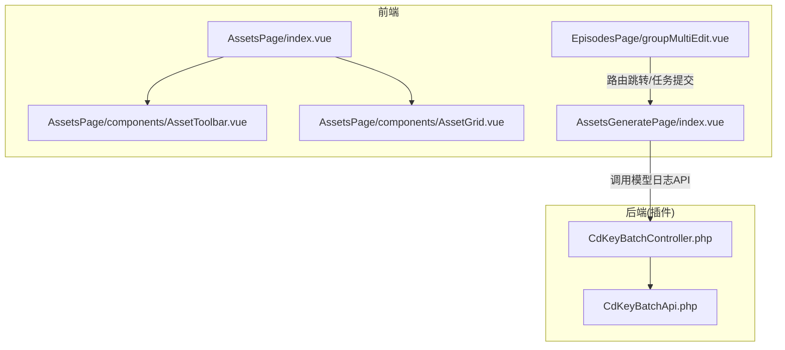
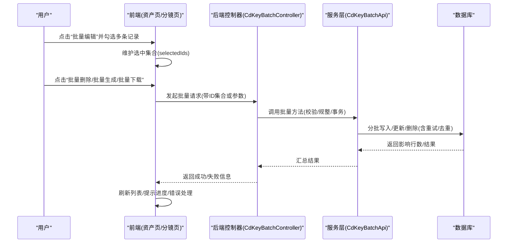
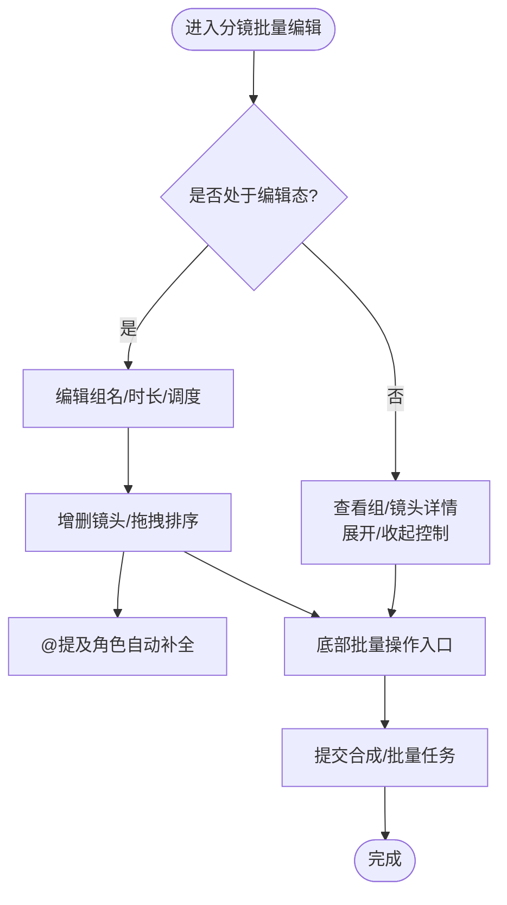
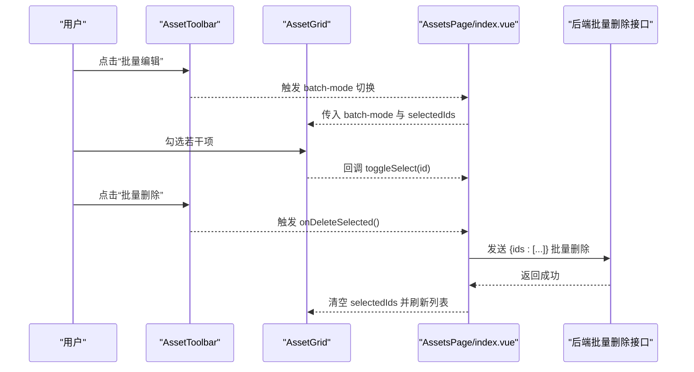
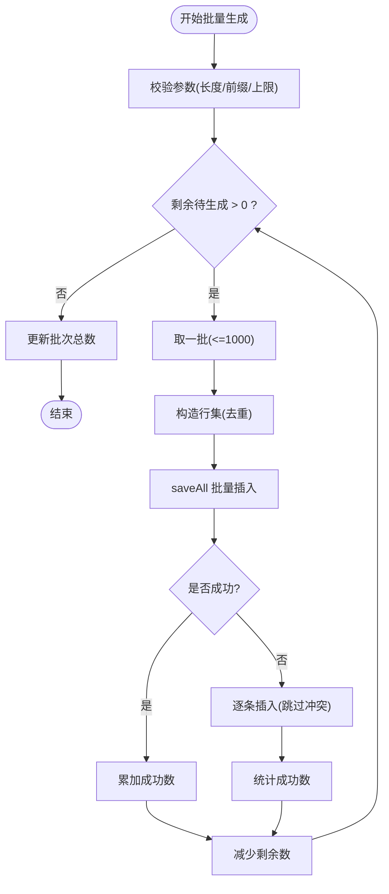
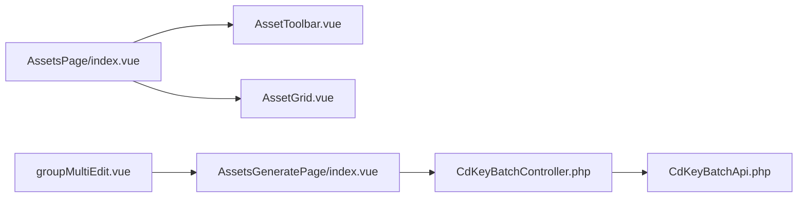

# 批量编辑功能

<cite>
**本文引用的文件列表**
- [groupMultiEdit.vue](file://frontend/src/views/EpisodesPage/groupMultiEdit.vue)
- [AssetsPage/index.vue](file://frontend/src/views/AssetsPage/index.vue)
- [AssetsPage/components/AssetToolbar.vue](file://frontend/src/views/AssetsPage/components/AssetToolbar.vue)
- [AssetsPage/components/AssetGrid.vue](file://frontend/src/views/AssetsPage/components/AssetGrid.vue)
- [AssetsGeneratePage/index.vue](file://frontend/src/views/AssetsGeneratePage/index.vue)
- [CdKeyBatchApi.php](file://server/plugin/xbCdKey/api/CdKeyBatchApi.php)
- [CdKeyBatchController.php](file://server/plugin/xbCdKey/app/admin/controller/CdKeyBatchController.php)
</cite>

## 目录
1. [简介](#简介)
2. [项目结构](#项目结构)
3. [核心组件](#核心组件)
4. [架构总览](#架构总览)
5. [详细组件分析](#详细组件分析)
6. [依赖关系分析](#依赖关系分析)
7. [性能考虑](#性能考虑)
8. [故障排查指南](#故障排查指南)
9. [结论](#结论)
10. [附录](#附录)

## 简介
本文件围绕“批量编辑”能力，系统性梳理多实体同时编辑的实现机制、批量操作的性能优化与数据一致性保障。内容覆盖：
- 批量选择、批量修改、批量删除等高级操作的特性与使用场景
- 进度跟踪、撤销重做机制的设计建议
- 并发冲突处理策略
- 大数据量批量处理的优化方案
- 用户体验设计指南

## 项目结构
仓库采用前后端分离的插件化架构：
- 前端（Vue）：提供资产与分镜管理界面，包含批量模式切换、多选、批量删除、批量生成等交互
- 后端（PHP/webman + 插件）：以插件形式提供业务接口，如卡密批次的批量生成、作废、删除等

图表来源
- [groupMultiEdit.vue:1-705](file://frontend/src/views/EpisodesPage/groupMultiEdit.vue#L1-L705)
- [AssetsPage/index.vue:1-400](file://frontend/src/views/AssetsPage/index.vue#L1-L400)
- [AssetsPage/components/AssetToolbar.vue:1-120](file://frontend/src/views/AssetsPage/components/AssetToolbar.vue#L1-L120)
- [AssetsPage/components/AssetGrid.vue:1-120](file://frontend/src/views/AssetsPage/components/AssetGrid.vue#L1-L120)
- [AssetsGeneratePage/index.vue:1-120](file://frontend/src/views/AssetsGeneratePage/index.vue#L1-L120)
- [CdKeyBatchController.php:1-216](file://server/plugin/xbCdKey/app/admin/controller/CdKeyBatchController.php#L1-L216)
- [CdKeyBatchApi.php:1-280](file://server/plugin/xbCdKey/api/CdKeyBatchApi.php#L1-L280)

章节来源
- [groupMultiEdit.vue:1-705](file://frontend/src/views/EpisodesPage/groupMultiEdit.vue#L1-L705)
- [AssetsPage/index.vue:1-400](file://frontend/src/views/AssetsPage/index.vue#L1-L400)
- [AssetsPage/components/AssetToolbar.vue:1-120](file://frontend/src/views/AssetsPage/components/AssetToolbar.vue#L1-L120)
- [AssetsPage/components/AssetGrid.vue:1-120](file://frontend/src/views/AssetsPage/components/AssetGrid.vue#L1-L120)
- [AssetsGeneratePage/index.vue:1-120](file://frontend/src/views/AssetsGeneratePage/index.vue#L1-L120)
- [CdKeyBatchController.php:1-216](file://server/plugin/xbCdKey/app/admin/controller/CdKeyBatchController.php#L1-L216)
- [CdKeyBatchApi.php:1-280](file://server/plugin/xbCdKey/api/CdKeyBatchApi.php#L1-L280)

## 核心组件
- 分镜组批量编辑（EpisodesPage/groupMultiEdit.vue）
  - 支持镜头组的拖拽排序、复制、删除；支持在组内增删镜头、展开/收起；底部工具栏提供“批量生成视频”“批量修复音频”“批量下载”“预览”“成片合成”等操作入口
- 资产页面批量模式（AssetsPage/index.vue 及其子组件）
  - 通过“批量编辑”按钮进入批量模式，勾选多个资产后执行“批量删除”，并展示已选项数量
- 卡密批次批量能力（CdKeyBatchController.php + CdKeyBatchApi.php）
  - 提供批次新增/编辑/删除、批量生成卡密、批量作废未使用卡密等后端能力

章节来源
- [groupMultiEdit.vue:1-705](file://frontend/src/views/EpisodesPage/groupMultiEdit.vue#L1-L705)
- [AssetsPage/index.vue:1-400](file://frontend/src/views/AssetsPage/index.vue#L1-L400)
- [AssetsPage/components/AssetToolbar.vue:1-120](file://frontend/src/views/AssetsPage/components/AssetToolbar.vue#L1-L120)
- [AssetsPage/components/AssetGrid.vue:1-120](file://frontend/src/views/AssetsPage/components/AssetGrid.vue#L1-L120)
- [CdKeyBatchController.php:1-216](file://server/plugin/xbCdKey/app/admin/controller/CdKeyBatchController.php#L1-L216)
- [CdKeyBatchApi.php:1-280](file://server/plugin/xbCdKey/api/CdKeyBatchApi.php#L1-L280)

## 架构总览
从用户操作到落库的整体流程如下：

图表来源
- [AssetsPage/index.vue:1-400](file://frontend/src/views/AssetsPage/index.vue#L1-L400)
- [AssetsPage/components/AssetToolbar.vue:1-120](file://frontend/src/views/AssetsPage/components/AssetToolbar.vue#L1-L120)
- [AssetsPage/components/AssetGrid.vue:1-120](file://frontend/src/views/AssetsPage/components/AssetGrid.vue#L1-L120)
- [CdKeyBatchController.php:1-216](file://server/plugin/xbCdKey/app/admin/controller/CdKeyBatchController.php#L1-L216)
- [CdKeyBatchApi.php:1-280](file://server/plugin/xbCdKey/api/CdKeyBatchApi.php#L1-L280)

## 详细组件分析

### 分镜组批量编辑（groupMultiEdit.vue）
- 功能要点
  - 左侧：当前镜头组详情（名称、时长、调度），可切换编辑态进行字段修改
  - 中间：脚本文本区，支持创作/预览快捷操作
  - 右侧：镜头组缩略图列表，支持拖拽排序、点击切换
  - 底部：批量操作入口（批量生成视频、批量修复音频、批量下载、预览、成片合成）
- 关键交互
  - 添加/复制/删除镜头组，删除前提示至少保留一组
  - 组内镜头增删、拖拽排序、展开/收起全部
  - 台词输入支持“@提及角色”自动补全
- 数据流
  - 本地状态驱动UI渲染，提交时打包为结构化JSON发送至后端（示例中为占位逻辑）

图表来源
- [groupMultiEdit.vue:1-705](file://frontend/src/views/EpisodesPage/groupMultiEdit.vue#L1-L705)

章节来源
- [groupMultiEdit.vue:1-705](file://frontend/src/views/EpisodesPage/groupMultiEdit.vue#L1-L705)

### 资产页面批量模式（AssetsPage/index.vue 及子组件）
- 功能要点
  - 顶部工具栏提供“批量编辑”开关，显示已选数量，并提供“批量删除”入口
  - 网格/列表视图均支持在批量模式下勾选条目
  - 批量删除成功后刷新列表
- 关键交互
  - 切换批量模式：隐藏单条编辑/预览按钮，显示勾选框
  - 全选/取消全选：根据当前页数据快速设置选中集合
  - 批量删除：对选中ID集合发起批量删除请求

图表来源
- [AssetsPage/index.vue:1-400](file://frontend/src/views/AssetsPage/index.vue#L1-L400)
- [AssetsPage/components/AssetToolbar.vue:1-120](file://frontend/src/views/AssetsPage/components/AssetToolbar.vue#L1-L120)
- [AssetsPage/components/AssetGrid.vue:1-120](file://frontend/src/views/AssetsPage/components/AssetGrid.vue#L1-L120)

章节来源
- [AssetsPage/index.vue:1-400](file://frontend/src/views/AssetsPage/index.vue#L1-L400)
- [AssetsPage/components/AssetToolbar.vue:1-120](file://frontend/src/views/AssetsPage/components/AssetToolbar.vue#L1-L120)
- [AssetsPage/components/AssetGrid.vue:1-120](file://frontend/src/views/AssetsPage/components/AssetGrid.vue#L1-L120)

### 卡密批次批量能力（CdKeyBatchController.php + CdKeyBatchApi.php）
- 功能要点
  - 控制器提供批次CRUD、批量生成、批量作废、删除等入口
  - 服务层实现批量生成卡密的核心逻辑：按批次配置生成唯一码，分批插入，冲突回退单条重试，最后更新批次总数
- 关键流程
  - 批量生成：校验长度/前缀/上限 -> 循环分批构建行 -> saveAll 批量插入 -> 唯一键冲突时降级为逐条插入 -> 累计成功数并更新批次统计
  - 批量作废：将指定批次下所有未使用状态的卡密一次性更新为作废状态

图表来源
- [CdKeyBatchApi.php:106-174](file://server/plugin/xbCdKey/api/CdKeyBatchApi.php#L106-L174)
- [CdKeyBatchController.php:148-175](file://server/plugin/xbCdKey/app/admin/controller/CdKeyBatchController.php#L148-L175)

章节来源
- [CdKeyBatchController.php:1-216](file://server/plugin/xbCdKey/app/admin/controller/CdKeyBatchController.php#L1-L216)
- [CdKeyBatchApi.php:1-280](file://server/plugin/xbCdKey/api/CdKeyBatchApi.php#L1-L280)

### 模型日志批量删除（AssetsGeneratePage/index.vue）
- 功能要点
  - 提供“批量删除”入口，基于已选结果ID集合发起批量删除
- 典型用法
  - 用户在结果面板勾选若干条记录，点击“批量删除”，确认后调用后端批量删除接口

章节来源
- [AssetsGeneratePage/index.vue:1-120](file://frontend/src/views/AssetsGeneratePage/index.vue#L1-L120)

## 依赖关系分析
- 前端组件耦合
  - AssetsPage/index.vue 组合 AssetToolbar 与 AssetGrid，负责批量模式状态与选中集合管理
  - groupMultiEdit.vue 独立于资产页，专注分镜组与镜头的批量编排
- 前后端契约
  - 批量删除/批量生成等接口由控制器暴露，服务层封装具体批量逻辑与异常处理
- 潜在环路与风险
  - 前端无直接后端依赖，仅通过API通信，避免循环引用
  - 服务端需确保批量写操作的幂等性与原子性边界

图表来源
- [AssetsPage/index.vue:1-400](file://frontend/src/views/AssetsPage/index.vue#L1-L400)
- [AssetsPage/components/AssetToolbar.vue:1-120](file://frontend/src/views/AssetsPage/components/AssetToolbar.vue#L1-L120)
- [AssetsPage/components/AssetGrid.vue:1-120](file://frontend/src/views/AssetsPage/components/AssetGrid.vue#L1-L120)
- [groupMultiEdit.vue:1-705](file://frontend/src/views/EpisodesPage/groupMultiEdit.vue#L1-L705)
- [AssetsGeneratePage/index.vue:1-120](file://frontend/src/views/AssetsGeneratePage/index.vue#L1-L120)
- [CdKeyBatchController.php:1-216](file://server/plugin/xbCdKey/app/admin/controller/CdKeyBatchController.php#L1-L216)
- [CdKeyBatchApi.php:1-280](file://server/plugin/xbCdKey/api/CdKeyBatchApi.php#L1-L280)

## 性能考虑
- 前端
  - 批量选择集合使用数组/Map存储，避免重复计算；分页加载时按需合并选中状态
  - 批量删除使用并发聚合（如 Promise.allSettled）提升吞吐，但需限制并发度防止雪崩
- 后端
  - 分批写入（每批固定大小，如1000），降低单次事务压力
  - 唯一键冲突时降级为逐条插入，保证最终一致性
  - 批量作废使用单条UPDATE语句，利用索引加速
- 网络与缓存
  - 批量操作期间禁用不必要的轮询与重绘
  - 对只读列表启用短期缓存，减少重复查询

[本节为通用指导，不直接分析具体文件]

## 故障排查指南
- 批量删除失败
  - 检查前端选中集合是否为空、请求体格式是否正确
  - 确认后端接口权限与参数校验
- 批量生成卡密冲突
  - 关注唯一键冲突日志，确认前缀+随机段是否足够长
  - 观察降级路径是否生效（逐条插入）
- 批量作废未生效
  - 核对批次ID与状态过滤条件
  - 检查受影响行数是否符合预期

章节来源
- [CdKeyBatchApi.php:106-174](file://server/plugin/xbCdKey/api/CdKeyBatchApi.php#L106-L174)
- [CdKeyBatchController.php:137-142](file://server/plugin/xbCdKey/app/admin/controller/CdKeyBatchController.php#L137-L142)

## 结论
本项目在前端提供了完善的批量编辑体验（批量选择、批量删除、批量生成/下载/预览等），在后端具备成熟的批量处理能力（分批写入、冲突降级、批量更新）。建议在现有基础上进一步完善：
- 统一进度反馈与错误汇总
- 引入撤销/重做机制
- 增强并发冲突检测与补偿策略
- 针对超大体量数据的异步任务化与断点续传

[本节为总结性内容，不直接分析具体文件]

## 附录

### 批量操作进度跟踪（设计建议）
- 前端
  - 使用全局进度状态（进行中/已完成/失败数）
  - 对每个子任务派发事件，实时更新百分比与失败明细
- 后端
  - 为耗时批量任务创建任务记录，提供进度查询接口
  - 失败任务记录原因，支持重试

[本节为概念性设计，不直接分析具体文件]

### 撤销/重做机制（设计建议）
- 操作栈
  - 每次批量操作生成一个“变更快照”（Before/After）
  - 撤销时反向应用快照，重做时正向应用
- 一致性
  - 使用事务包裹批量写，失败则整体回滚
  - 对不可逆操作（如删除）增加二次确认与审计日志

[本节为概念性设计，不直接分析具体文件]

### 并发冲突处理（设计建议）
- 乐观锁
  - 为实体版本字段（如 version）加锁，更新时比较版本号
- 幂等键
  - 为批量请求分配幂等ID，服务端去重
- 重试与退避
  - 对瞬时冲突（如唯一键）采用指数退避重试，超过阈值告警

[本节为概念性设计，不直接分析具体文件]

### 大数据量批量处理优化（设计建议）
- 分片与限流
  - 将大批量拆分为小批次，配合令牌桶限流
- 异步化
  - 将耗时操作放入队列，前端轮询/订阅进度
- 索引与SQL优化
  - 批量更新尽量走索引列，避免全表扫描

[本节为概念性设计，不直接分析具体文件]

### 用户体验设计指南
- 明确状态
  - 批量模式开启时高亮选中项，清晰展示已选数量
- 即时反馈
  - 操作进行中禁用危险按钮，完成后给出成功/失败摘要
- 容错友好
  - 失败项单独列出，支持一键重试
- 可访问性
  - 键盘导航支持全选/反选、回车确认

[本节为概念性设计，不直接分析具体文件]