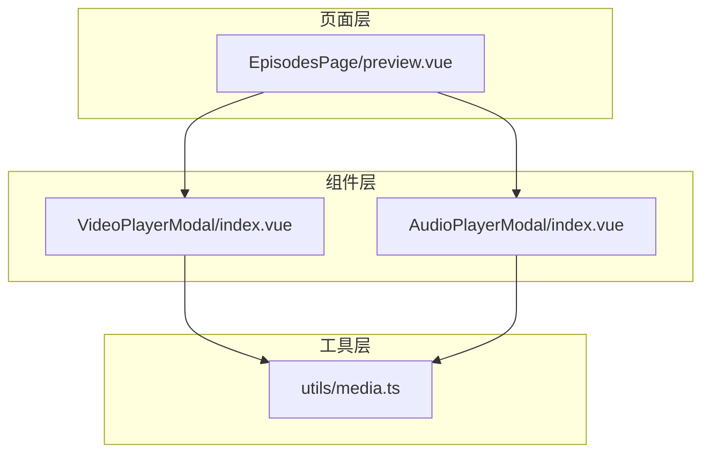
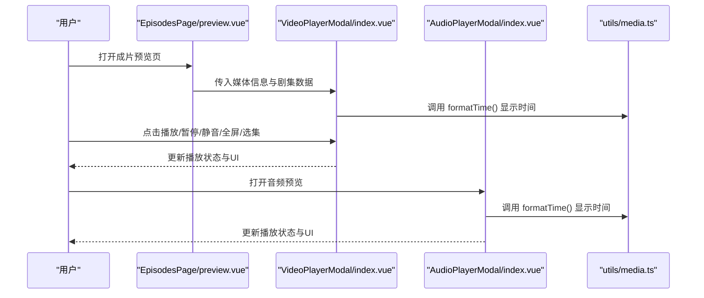
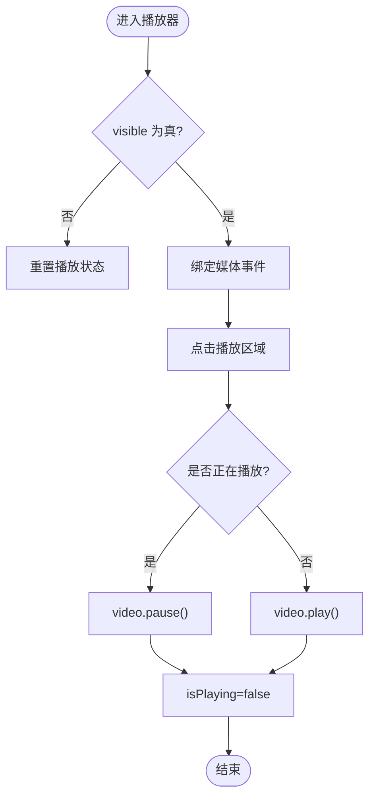
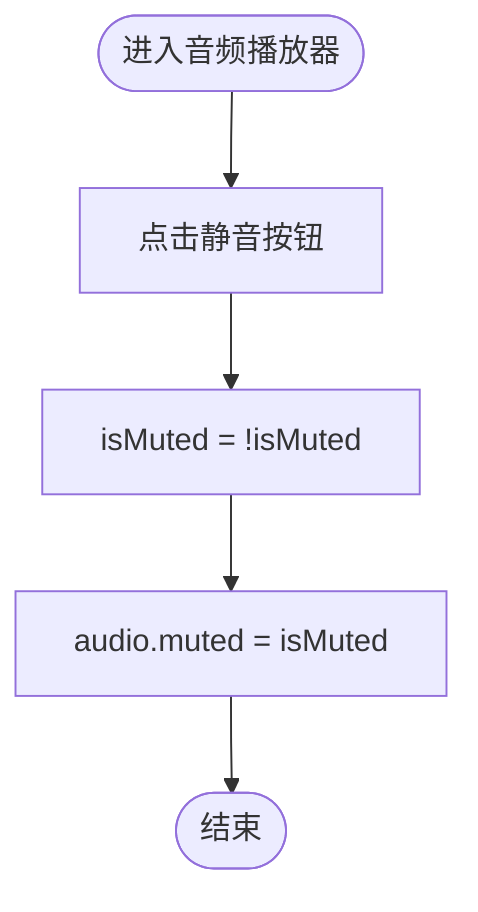
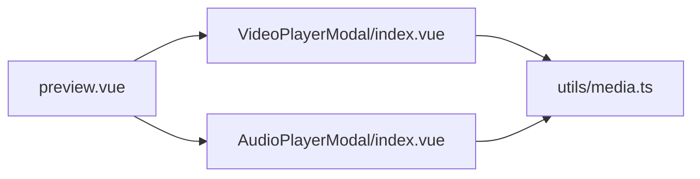

# 预览系统

<cite>
**本文引用的文件**
- [preview.vue](file://frontend/src/views/EpisodesPage/preview.vue)
- [VideoPlayerModal/index.vue](file://frontend/src/components/VideoPlayerModal/index.vue)
- [AudioPlayerModal/index.vue](file://frontend/src/components/AudioPlayerModal/index.vue)
- [media.ts](file://frontend/src/utils/media.ts)
</cite>

## 目录
1. [简介](#简介)
2. [项目结构](#项目结构)
3. [核心组件](#核心组件)
4. [架构总览](#架构总览)
5. [详细组件分析](#详细组件分析)
6. [依赖关系分析](#依赖关系分析)
7. [性能考虑](#性能考虑)
8. [故障排查指南](#故障排查指南)
9. [结论](#结论)
10. [附录](#附录)

## 简介
本文件面向“预览系统”的文档化说明，聚焦于实时预览渲染、多媒体内容展示、交互控制与性能优化机制。结合前端现有实现，重点覆盖：
- 视频与音频播放器的交互控制（播放/暂停、静音、进度拖拽、全屏）
- 剧集切换与多媒体元数据展示
- 预览质量调节、懒加载与响应式适配思路
- 跨平台兼容性与用户体验优化建议
- 扩展接口与自定义渲染器开发指引

## 项目结构
预览相关的前端代码主要位于以下位置：
- 页面入口：EpisodesPage/preview.vue（成片生成后的预览页）
- 播放器模态框：components/VideoPlayerModal/index.vue（视频）、components/AudioPlayerModal/index.vue（音频）
- 工具函数：utils/media.ts（时间格式化等）

图表来源
- [preview.vue:1-52](file://frontend/src/views/EpisodesPage/preview.vue#L1-L52)
- [VideoPlayerModal/index.vue:1-318](file://frontend/src/components/VideoPlayerModal/index.vue#L1-L318)
- [AudioPlayerModal/index.vue:1-181](file://frontend/src/components/AudioPlayerModal/index.vue#L1-L181)
- [media.ts](file://frontend/src/utils/media.ts)

章节来源
- [preview.vue:1-52](file://frontend/src/views/EpisodesPage/preview.vue#L1-L52)
- [VideoPlayerModal/index.vue:1-318](file://frontend/src/components/VideoPlayerModal/index.vue#L1-L318)
- [AudioPlayerModal/index.vue:1-181](file://frontend/src/components/AudioPlayerModal/index.vue#L1-L181)
- [media.ts](file://frontend/src/utils/media.ts)

## 核心组件
- 视频播放器模态框
  - 功能要点：播放/暂停、静音切换、进度条点击跳转、全屏、选集切换、点赞交互、元信息展示（模型名、状态、类型、分辨率、售价等）
  - 数据结构：支持单媒体或带 episodes 的多集列表；当前集由 currentEpisodeId 驱动
- 音频播放器模态框
  - 功能要点：播放/暂停、静音切换、进度条点击跳转、封面图与标题展示、元信息展示
- 成片预览页
  - 功能要点：从路由参数获取 taskId/work_id，预留后端对接以拉取视频数据，提供返回、下载、发布等操作按钮

章节来源
- [VideoPlayerModal/index.vue:1-318](file://frontend/src/components/VideoPlayerModal/index.vue#L1-L318)
- [AudioPlayerModal/index.vue:1-181](file://frontend/src/components/AudioPlayerModal/index.vue#L1-L181)
- [preview.vue:1-52](file://frontend/src/views/EpisodesPage/preview.vue#L1-L52)

## 架构总览
预览系统采用“页面 + 模态播放器 + 工具函数”的分层结构。页面负责导航与操作入口，模态播放器封装原生媒体元素与交互逻辑，工具函数提供通用能力（如时间格式化）。

图表来源
- [preview.vue:1-52](file://frontend/src/views/EpisodesPage/preview.vue#L1-L52)
- [VideoPlayerModal/index.vue:1-318](file://frontend/src/components/VideoPlayerModal/index.vue#L1-L318)
- [AudioPlayerModal/index.vue:1-181](file://frontend/src/components/AudioPlayerModal/index.vue#L1-L181)
- [media.ts](file://frontend/src/utils/media.ts)

## 详细组件分析

### 视频播放器模态框（VideoPlayerModal）
- 关键职责
  - 管理 video 元素生命周期与事件（timeupdate、loadedmetadata、ended）
  - 计算并展示进度条百分比、当前时间与总时长
  - 处理全屏、静音、播放/暂停、进度拖拽
  - 管理 episodes 列表与当前集切换
  - 暴露 close/like 事件供父级处理
- 数据流
  - props.visible 控制显隐与资源释放
  - props.media 驱动 currentMediaUrl 与 currentEpisodeId
  - computed progress 基于 currentTime/duration
- 交互流程（播放/暂停）

图表来源
- [VideoPlayerModal/index.vue:58-83](file://frontend/src/components/VideoPlayerModal/index.vue#L58-L83)
- [VideoPlayerModal/index.vue:106-114](file://frontend/src/components/VideoPlayerModal/index.vue#L106-L114)
- [VideoPlayerModal/index.vue:131-142](file://frontend/src/components/VideoPlayerModal/index.vue#L131-L142)

章节来源
- [VideoPlayerModal/index.vue:1-318](file://frontend/src/components/VideoPlayerModal/index.vue#L1-L318)

### 音频播放器模态框（AudioPlayerModal）
- 关键职责
  - 管理 audio 元素生命周期与事件（timeupdate、loadedmetadata、ended）
  - 计算并展示进度条百分比、当前时间与总时长
  - 处理静音、播放/暂停、进度拖拽
  - 展示封面图、标题与元信息
- 交互流程（静音切换）

图表来源
- [AudioPlayerModal/index.vue:42-54](file://frontend/src/components/AudioPlayerModal/index.vue#L42-L54)
- [AudioPlayerModal/index.vue:71-85](file://frontend/src/components/AudioPlayerModal/index.vue#L71-L85)
- [AudioPlayerModal/index.vue:96-107](file://frontend/src/components/AudioPlayerModal/index.vue#L96-L107)

章节来源
- [AudioPlayerModal/index.vue:1-181](file://frontend/src/components/AudioPlayerModal/index.vue#L1-L181)

### 成片预览页（EpisodesPage/preview.vue）
- 关键职责
  - 从路由参数解析 taskId 与 work_id
  - 预留后端接口对接以获取视频数据
  - 提供返回、下载、发布等动作入口
- 数据流
  - route.query.taskId / work_id 作为输入
  - 待接入后端后填充视频 URL 与标题
  - 通过 XbVideoPlayer 进行展示（占位）

章节来源
- [preview.vue:1-52](file://frontend/src/views/EpisodesPage/preview.vue#L1-L52)

## 依赖关系分析
- 组件间依赖
  - preview.vue 依赖 VideoPlayerModal 与 AudioPlayerModal 完成预览展示
  - 两个播放器均依赖 utils/media.ts 的时间格式化能力
- 外部依赖
  - 使用浏览器原生 <video>/<audio> 元素
  - 使用 UI 组件库中的图标与模态容器（XbIcon、XbModal）

图表来源
- [preview.vue:1-52](file://frontend/src/views/EpisodesPage/preview.vue#L1-L52)
- [VideoPlayerModal/index.vue:1-318](file://frontend/src/components/VideoPlayerModal/index.vue#L1-L318)
- [AudioPlayerModal/index.vue:1-181](file://frontend/src/components/AudioPlayerModal/index.vue#L1-L181)
- [media.ts](file://frontend/src/utils/media.ts)

章节来源
- [preview.vue:1-52](file://frontend/src/views/EpisodesPage/preview.vue#L1-L52)
- [VideoPlayerModal/index.vue:1-318](file://frontend/src/components/VideoPlayerModal/index.vue#L1-L318)
- [AudioPlayerModal/index.vue:1-181](file://frontend/src/components/AudioPlayerModal/index.vue#L1-L181)
- [media.ts](file://frontend/src/utils/media.ts)

## 性能考虑
- 懒加载与按需初始化
  - 在 visible 为真时再绑定媒体事件与初始化状态，避免不必要的 DOM 与内存占用
  - 关闭时主动 pause 与重置 currentTime，防止后台播放
- 进度与时间更新节流
  - timeupdate 频率较高，建议在更复杂场景中对 currentTime 更新做节流或防抖，减少重渲染
- 媒体资源预加载策略
  - 对即将切换的剧集可提前设置 preload="metadata" 或按需预缓冲，平衡首帧速度与带宽
- 图片与缩略图优化
  - 使用合适的尺寸与格式（WebP/AVIF），配合 CDN 缓存与压缩
- 全屏与移动端体验
  - 使用 requestFullscreen 提升沉浸感；移动端注意自动播放限制与手势冲突
- 内存与资源回收
  - 组件销毁前确保移除事件监听、释放引用，避免泄漏

[本节为通用性能建议，不直接分析具体文件]

## 故障排查指南
- 无法自动播放
  - 检查浏览器策略（需用户交互触发 play），确认 muted 初始值与用户手势
- 进度条不同步
  - 核对 onTimeUpdate 中 currentTime 赋值逻辑与 duration 是否正确获取
- 切换剧集无变化
  - 确认 currentEpisodeId 更新后触发了 video.load() 与 reset 状态
- 全屏无效
  - 检查是否在可全屏的元素上调用 requestFullscreen，并确保未被 CSS 遮挡
- 音频/视频无声
  - 检查 muted 状态与音量设置，确认媒体源可用且跨域允许

章节来源
- [VideoPlayerModal/index.vue:131-142](file://frontend/src/components/VideoPlayerModal/index.vue#L131-L142)
- [VideoPlayerModal/index.vue:144-159](file://frontend/src/components/VideoPlayerModal/index.vue#L144-L159)
- [AudioPlayerModal/index.vue:96-107](file://frontend/src/components/AudioPlayerModal/index.vue#L96-L107)

## 结论
当前预览系统以轻量化的模态播放器为核心，围绕原生媒体元素实现了完整的播放控制与基础交互。后续可在以下方面持续增强：
- 引入服务端渲染或流式传输以提升首帧速度
- 增加质量档位选择与自适应码率
- 完善缓存与预加载策略，降低重复请求
- 扩展导出与分享能力，提升创作闭环体验

[本节为总结性内容，不直接分析具体文件]

## 附录

### 扩展接口与自定义渲染器开发指南
- 扩展点
  - 在 VideoPlayerModal 与 AudioPlayerModal 中通过 props 注入新的渲染配置（如画质、字幕、水印）
  - 通过事件回调（close/like）与父组件通信，实现业务侧统计与埋点
- 自定义渲染器
  - 若需替换原生播放器，可抽象出统一的播放器接口（play/pause/seek/mute/fullscreen），并在模态框内按策略注入实现
  - 保持对外 API 不变，内部可切换为第三方播放器或 Canvas/WebGL 渲染管线
- 质量调节与全屏模式
  - 质量调节：根据网络与设备能力动态切换清晰度（HLS/DASH 或多源 URL）
  - 全屏模式：统一封装 requestFullscreen 与退出逻辑，兼容移动端差异
- 导出功能
  - 在页面层集成导出入口，将当前媒体与元数据打包为可下载资源（如截图、片段导出）
- 用户体验优化
  - 骨架屏与占位图，提升感知性能
  - 错误边界与重试机制，保障稳定性
  - 无障碍支持（键盘导航、ARIA 标签）

[本节为概念性指导，不直接分析具体文件]