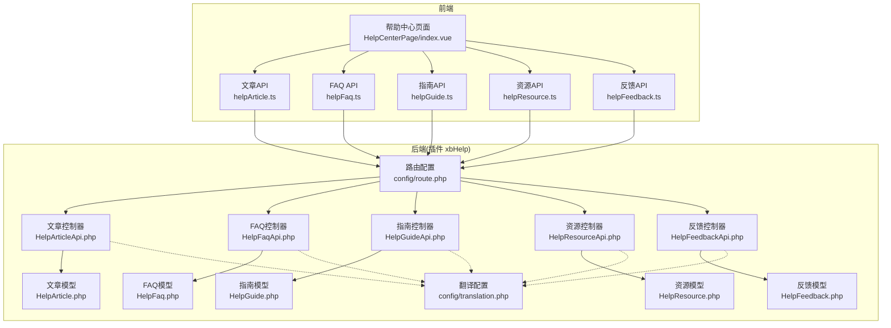
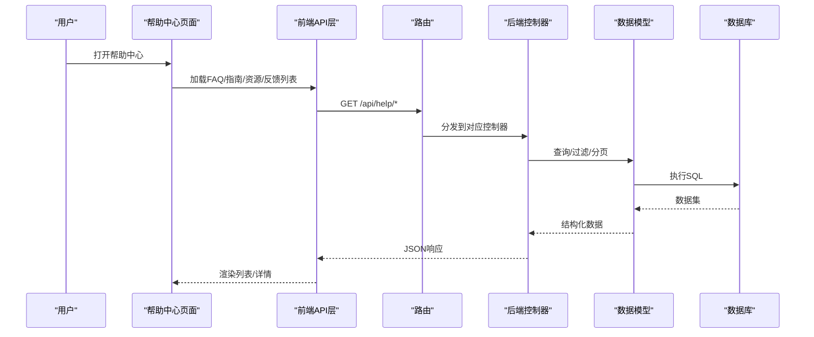
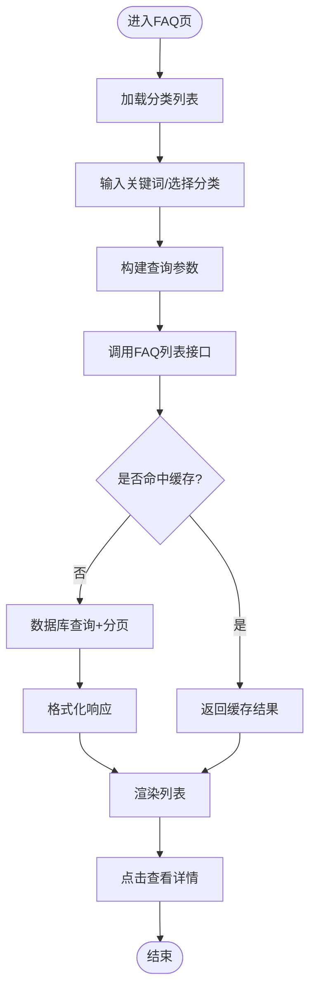
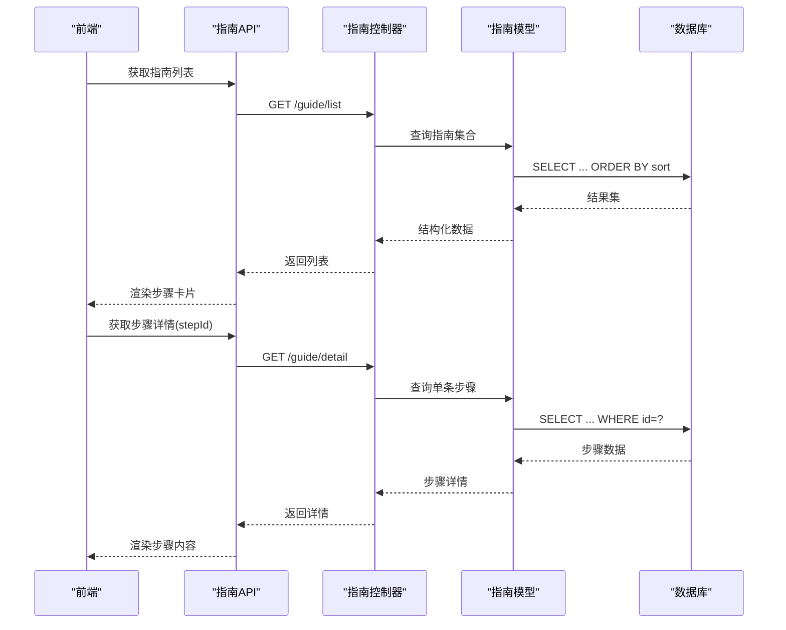
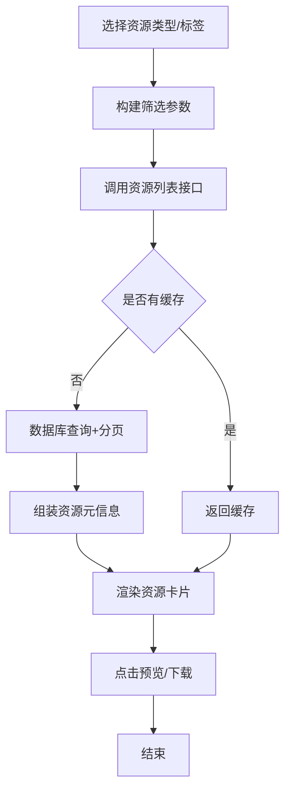
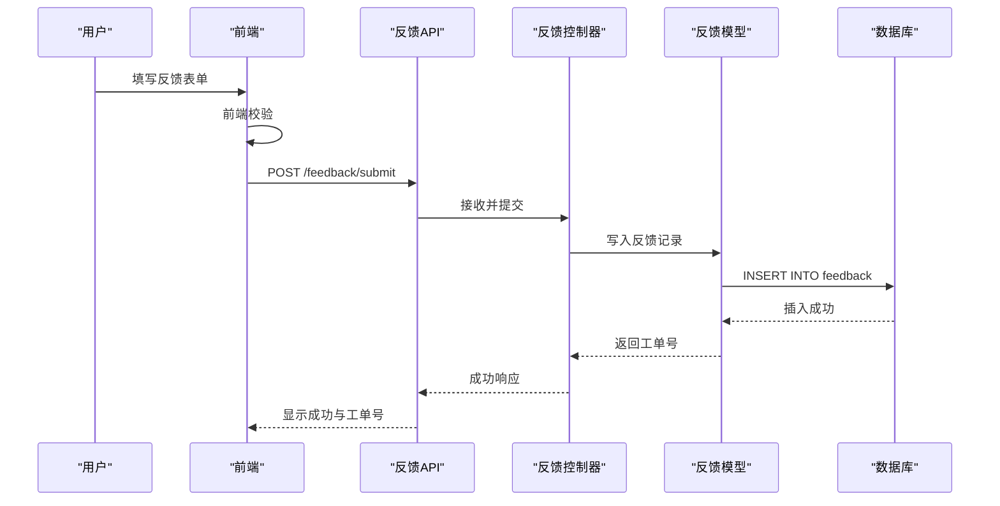
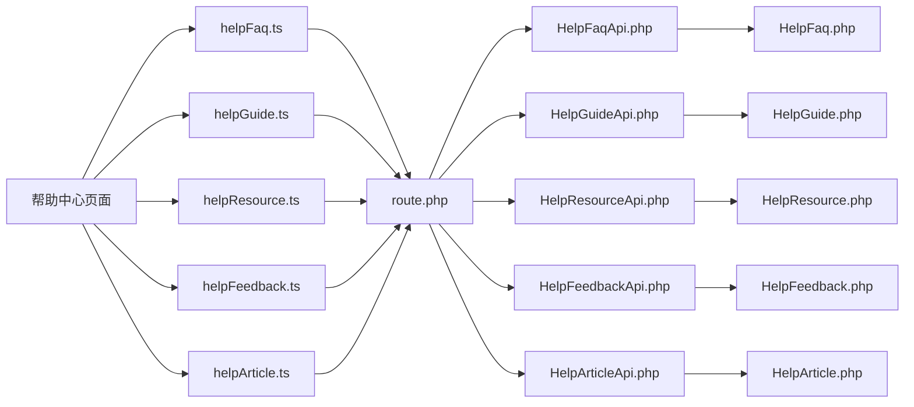

# 帮助中心页面

<cite>
**本文引用的文件**   
- [frontend/src/views/HelpCenterPage/index.vue](file://frontend/src/views/HelpCenterPage/index.vue)
- [frontend/src/api/helpArticle.ts](file://frontend/src/api/helpArticle.ts)
- [frontend/src/api/helpFaq.ts](file://frontend/src/api/helpFaq.ts)
- [frontend/src/api/helpGuide.ts](file://frontend/src/api/helpGuide.ts)
- [frontend/src/api/helpResource.ts](file://frontend/src/api/helpResource.ts)
- [frontend/src/api/helpFeedback.ts](file://frontend/src/api/helpFeedback.ts)
- [server/plugin/xbHelp/config/route.php](file://server/plugin/xbHelp/config/route.php)
- [server/plugin/xbHelp/app/api/HelpArticleApi.php](file://server/plugin/xbHelp/app/api/HelpArticleApi.php)
- [server/plugin/xbHelp/app/api/HelpFaqApi.php](file://server/plugin/xbHelp/app/api/HelpFaqApi.php)
- [server/plugin/xbHelp/app/api/HelpGuideApi.php](file://server/plugin/xbHelp/app/api/HelpGuideApi.php)
- [server/plugin/xbHelp/app/api/HelpResourceApi.php](file://server/plugin/xbHelp/app/api/HelpResourceApi.php)
- [server/plugin/xbHelp/app/api/HelpFeedbackApi.php](file://server/plugin/xbHelp/app/api/HelpFeedbackApi.php)
- [server/plugin/xbHelp/app/model/HelpArticle.php](file://server/plugin/xbHelp/app/model/HelpArticle.php)
- [server/plugin/xbHelp/app/model/HelpFaq.php](file://server/plugin/xbHelp/app/model/HelpFaq.php)
- [server/plugin/xbHelp/app/model/HelpGuide.php](file://server/plugin/xbHelp/app/model/HelpGuide.php)
- [server/plugin/xbHelp/app/model/HelpResource.php](file://server/plugin/xbHelp/app/model/HelpResource.php)
- [server/plugin/xbHelp/app/model/HelpFeedback.php](file://server/plugin/xbHelp/app/model/HelpFeedback.php)
- [server/plugin/xbHelp/config/translation.php](file://server/plugin/xbHelp/config/translation.php)
</cite>

## 目录
1. [简介](#简介)
2. [项目结构](#项目结构)
3. [核心组件](#核心组件)
4. [架构总览](#架构总览)
5. [详细组件分析](#详细组件分析)
6. [依赖关系分析](#依赖关系分析)
7. [性能考虑](#性能考虑)
8. [故障排查指南](#故障排查指南)
9. [结论](#结论)
10. [附录](#附录)

## 简介
本文件面向“帮助中心”页面的实现与使用，覆盖以下能力：
- FAQ 系统：常见问题检索、分类筛选、详情展示
- 快速入门指南：分步引导内容获取与渲染
- 资源库：文档、视频、图片等多媒体资源的浏览与下载
- 联系支持：用户反馈提交、状态跟踪与结果通知
- 内容分类与搜索：基于标签/关键词的过滤与全文检索
- 反馈机制：表单校验、异步提交、成功/失败提示
- 用户自助服务：通过自助查询减少人工客服压力
- 内容管理系统集成：前端 API 调用后端插件接口，数据持久化到数据库
- 多语言支持：翻译配置与国际化键值管理
- 可访问性优化：语义化结构、键盘导航、对比度与焦点管理

## 项目结构
帮助中心由前端页面与后端插件共同构成。前端负责交互与展示，后端以插件形式提供 RESTful 接口与数据模型。

图表来源
- [frontend/src/views/HelpCenterPage/index.vue](file://frontend/src/views/HelpCenterPage/index.vue)
- [frontend/src/api/helpArticle.ts](file://frontend/src/api/helpArticle.ts)
- [frontend/src/api/helpFaq.ts](file://frontend/src/api/helpFaq.ts)
- [frontend/src/api/helpGuide.ts](file://frontend/src/api/helpGuide.ts)
- [frontend/src/api/helpResource.ts](file://frontend/src/api/helpResource.ts)
- [frontend/src/api/helpFeedback.ts](file://frontend/src/api/helpFeedback.ts)
- [server/plugin/xbHelp/config/route.php](file://server/plugin/xbHelp/config/route.php)
- [server/plugin/xbHelp/app/api/HelpArticleApi.php](file://server/plugin/xbHelp/app/api/HelpArticleApi.php)
- [server/plugin/xbHelp/app/api/HelpFaqApi.php](file://server/plugin/xbHelp/app/api/HelpFaqApi.php)
- [server/plugin/xbHelp/app/api/HelpGuideApi.php](file://server/plugin/xbHelp/app/api/HelpGuideApi.php)
- [server/plugin/xbHelp/app/api/HelpResourceApi.php](file://server/plugin/xbHelp/app/api/HelpResourceApi.php)
- [server/plugin/xbHelp/app/api/HelpFeedbackApi.php](file://server/plugin/xbHelp/app/api/HelpFeedbackApi.php)
- [server/plugin/xbHelp/app/model/HelpArticle.php](file://server/plugin/xbHelp/app/model/HelpArticle.php)
- [server/plugin/xbHelp/app/model/HelpFaq.php](file://server/plugin/xbHelp/app/model/HelpFaq.php)
- [server/plugin/xbHelp/app/model/HelpGuide.php](file://server/plugin/xbHelp/app/model/HelpGuide.php)
- [server/plugin/xbHelp/app/model/HelpResource.php](file://server/plugin/xbHelp/app/model/HelpResource.php)
- [server/plugin/xbHelp/app/model/HelpFeedback.php](file://server/plugin/xbHelp/app/model/HelpFeedback.php)
- [server/plugin/xbHelp/config/translation.php](file://server/plugin/xbHelp/config/translation.php)

章节来源
- [frontend/src/views/HelpCenterPage/index.vue](file://frontend/src/views/HelpCenterPage/index.vue)
- [server/plugin/xbHelp/config/route.php](file://server/plugin/xbHelp/config/route.php)

## 核心组件
- 帮助中心主页面：聚合 FAQ、指南、资源、反馈入口，统一处理分类、搜索与分页
- 文章/指南/资源/反馈 API 层：封装请求参数、错误处理与响应解析
- 后端控制器与模型：按领域划分，提供 CRUD 与检索能力，并对接翻译配置
- 翻译配置：为各模块提供多语言文案

章节来源
- [frontend/src/api/helpArticle.ts](file://frontend/src/api/helpArticle.ts)
- [frontend/src/api/helpFaq.ts](file://frontend/src/api/helpFaq.ts)
- [frontend/src/api/helpGuide.ts](file://frontend/src/api/helpGuide.ts)
- [frontend/src/api/helpResource.ts](file://frontend/src/api/helpResource.ts)
- [frontend/src/api/helpFeedback.ts](file://frontend/src/api/helpFeedback.ts)
- [server/plugin/xbHelp/app/api/HelpArticleApi.php](file://server/plugin/xbHelp/app/api/HelpArticleApi.php)
- [server/plugin/xbHelp/app/api/HelpFaqApi.php](file://server/plugin/xbHelp/app/api/HelpFaqApi.php)
- [server/plugin/xbHelp/app/api/HelpGuideApi.php](file://server/plugin/xbHelp/app/api/HelpGuideApi.php)
- [server/plugin/xbHelp/app/api/HelpResourceApi.php](file://server/plugin/xbHelp/app/api/HelpResourceApi.php)
- [server/plugin/xbHelp/app/api/HelpFeedbackApi.php](file://server/plugin/xbHelp/app/api/HelpFeedbackApi.php)
- [server/plugin/xbHelp/app/model/HelpArticle.php](file://server/plugin/xbHelp/app/model/HelpArticle.php)
- [server/plugin/xbHelp/app/model/HelpFaq.php](file://server/plugin/xbHelp/app/model/HelpFaq.php)
- [server/plugin/xbHelp/app/model/HelpGuide.php](file://server/plugin/xbHelp/app/model/HelpGuide.php)
- [server/plugin/xbHelp/app/model/HelpResource.php](file://server/plugin/xbHelp/app/model/HelpResource.php)
- [server/plugin/xbHelp/app/model/HelpFeedback.php](file://server/plugin/xbHelp/app/model/HelpFeedback.php)
- [server/plugin/xbHelp/config/translation.php](file://server/plugin/xbHelp/config/translation.php)

## 架构总览
帮助中心采用前后端分离架构，前端通过 API 层发起 HTTP 请求，后端以插件方式暴露 REST 接口，控制器调用模型完成数据读写，并通过翻译配置返回本地化内容。

图表来源
- [frontend/src/views/HelpCenterPage/index.vue](file://frontend/src/views/HelpCenterPage/index.vue)
- [frontend/src/api/helpFaq.ts](file://frontend/src/api/helpFaq.ts)
- [frontend/src/api/helpGuide.ts](file://frontend/src/api/helpGuide.ts)
- [frontend/src/api/helpResource.ts](file://frontend/src/api/helpResource.ts)
- [frontend/src/api/helpFeedback.ts](file://frontend/src/api/helpFeedback.ts)
- [server/plugin/xbHelp/config/route.php](file://server/plugin/xbHelp/config/route.php)
- [server/plugin/xbHelp/app/api/HelpFaqApi.php](file://server/plugin/xbHelp/app/api/HelpFaqApi.php)
- [server/plugin/xbHelp/app/api/HelpGuideApi.php](file://server/plugin/xbHelp/app/api/HelpGuideApi.php)
- [server/plugin/xbHelp/app/api/HelpResourceApi.php](file://server/plugin/xbHelp/app/api/HelpResourceApi.php)
- [server/plugin/xbHelp/app/api/HelpFeedbackApi.php](file://server/plugin/xbHelp/app/api/HelpFeedbackApi.php)

## 详细组件分析

### FAQ 系统
- 功能要点
  - 列表分页、分类筛选、关键词搜索
  - 详情展开、相关问答推荐
  - 热度排序与置顶策略（如存在）
- 数据流
  - 前端根据分类与关键词构造查询参数
  - 后端控制器进行条件拼接与分页
  - 模型层执行查询并返回标准化结构
- 关键流程

图表来源
- [frontend/src/api/helpFaq.ts](file://frontend/src/api/helpFaq.ts)
- [server/plugin/xbHelp/app/api/HelpFaqApi.php](file://server/plugin/xbHelp/app/api/HelpFaqApi.php)
- [server/plugin/xbHelp/app/model/HelpFaq.php](file://server/plugin/xbHelp/app/model/HelpFaq.php)

章节来源
- [frontend/src/api/helpFaq.ts](file://frontend/src/api/helpFaq.ts)
- [server/plugin/xbHelp/app/api/HelpFaqApi.php](file://server/plugin/xbHelp/app/api/HelpFaqApi.php)
- [server/plugin/xbHelp/app/model/HelpFaq.php](file://server/plugin/xbHelp/app/model/HelpFaq.php)

### 快速入门指南
- 功能要点
  - 步骤式引导内容展示
  - 进度指示与跳转
  - 与资源库联动（图文/视频）
- 数据流
  - 前端请求指南列表与步骤详情
  - 后端按顺序返回步骤节点
  - 前端渲染步骤卡片与导航
- 关键流程

图表来源
- [frontend/src/api/helpGuide.ts](file://frontend/src/api/helpGuide.ts)
- [server/plugin/xbHelp/app/api/HelpGuideApi.php](file://server/plugin/xbHelp/app/api/HelpGuideApi.php)
- [server/plugin/xbHelp/app/model/HelpGuide.php](file://server/plugin/xbHelp/app/model/HelpGuide.php)

章节来源
- [frontend/src/api/helpGuide.ts](file://frontend/src/api/helpGuide.ts)
- [server/plugin/xbHelp/app/api/HelpGuideApi.php](file://server/plugin/xbHelp/app/api/HelpGuideApi.php)
- [server/plugin/xbHelp/app/model/HelpGuide.php](file://server/plugin/xbHelp/app/model/HelpGuide.php)

### 资源库
- 功能要点
  - 多媒体资源（文档、视频、图片）分类浏览
  - 预览与下载
  - 标签筛选与热门排行
- 数据流
  - 前端按类型/标签/关键字筛选
  - 后端控制器组合查询条件
  - 模型层返回资源元信息与链接
- 关键流程

图表来源
- [frontend/src/api/helpResource.ts](file://frontend/src/api/helpResource.ts)
- [server/plugin/xbHelp/app/api/HelpResourceApi.php](file://server/plugin/xbHelp/app/api/HelpResourceApi.php)
- [server/plugin/xbHelp/app/model/HelpResource.php](file://server/plugin/xbHelp/app/model/HelpResource.php)

章节来源
- [frontend/src/api/helpResource.ts](file://frontend/src/api/helpResource.ts)
- [server/plugin/xbHelp/app/api/HelpResourceApi.php](file://server/plugin/xbHelp/app/api/HelpResourceApi.php)
- [server/plugin/xbHelp/app/model/HelpResource.php](file://server/plugin/xbHelp/app/model/HelpResource.php)

### 联系支持（反馈机制）
- 功能要点
  - 表单字段：问题类型、标题、描述、附件等
  - 前端校验与防抖提交
  - 提交后状态提示与工单号回显
- 数据流
  - 前端收集表单数据并校验
  - 调用反馈接口提交
  - 后端落库并返回工单号/状态
- 关键流程

图表来源
- [frontend/src/api/helpFeedback.ts](file://frontend/src/api/helpFeedback.ts)
- [server/plugin/xbHelp/app/api/HelpFeedbackApi.php](file://server/plugin/xbHelp/app/api/HelpFeedbackApi.php)
- [server/plugin/xbHelp/app/model/HelpFeedback.php](file://server/plugin/xbHelp/app/model/HelpFeedback.php)

章节来源
- [frontend/src/api/helpFeedback.ts](file://frontend/src/api/helpFeedback.ts)
- [server/plugin/xbHelp/app/api/HelpFeedbackApi.php](file://server/plugin/xbHelp/app/api/HelpFeedbackApi.php)
- [server/plugin/xbHelp/app/model/HelpFeedback.php](file://server/plugin/xbHelp/app/model/HelpFeedback.php)

### 内容分类与搜索
- 分类体系
  - 文章、FAQ、指南、资源四类内容共享分类维度
  - 分类层级与标签用于多维筛选
- 搜索策略
  - 关键词匹配标题/摘要/正文
  - 结合分类与标签进行二次过滤
  - 支持分页与排序（时间/热度）
- 设计模式
  - 统一查询构建器：将分类、标签、关键词合并为查询条件
  - 缓存策略：对高频查询结果做短期缓存
  - 空态处理：无结果时提供相关推荐或引导提问

章节来源
- [frontend/src/api/helpArticle.ts](file://frontend/src/api/helpArticle.ts)
- [frontend/src/api/helpFaq.ts](file://frontend/src/api/helpFaq.ts)
- [frontend/src/api/helpGuide.ts](file://frontend/src/api/helpGuide.ts)
- [frontend/src/api/helpResource.ts](file://frontend/src/api/helpResource.ts)
- [server/plugin/xbHelp/app/api/HelpArticleApi.php](file://server/plugin/xbHelp/app/api/HelpArticleApi.php)
- [server/plugin/xbHelp/app/api/HelpFaqApi.php](file://server/plugin/xbHelp/app/api/HelpFaqApi.php)
- [server/plugin/xbHelp/app/api/HelpGuideApi.php](file://server/plugin/xbHelp/app/api/HelpGuideApi.php)
- [server/plugin/xbHelp/app/api/HelpResourceApi.php](file://server/plugin/xbHelp/app/api/HelpResourceApi.php)

### 用户自助服务
- 自助路径
  - 先搜索关键词，再按分类缩小范围
  - 查看指南步骤，必要时下载资源
  - 未解决则提交反馈，等待回复
- 体验优化
  - 高亮搜索结果关键词
  - 提供“仍需要帮助？”入口直达反馈
  - 常用问题置顶与推荐

章节来源
- [frontend/src/views/HelpCenterPage/index.vue](file://frontend/src/views/HelpCenterPage/index.vue)

### 内容管理系统集成
- 集成方式
  - 前端通过统一的 API 层调用后端插件接口
  - 后端以插件形式注册路由与控制器
  - 数据模型遵循标准 ORM 规范
- 扩展点
  - 新增内容类型：在路由中注册新接口，新增控制器与模型
  - 自定义筛选：在控制器中扩展查询条件
  - 权限控制：在中间件或控制器中校验角色/权限

章节来源
- [server/plugin/xbHelp/config/route.php](file://server/plugin/xbHelp/config/route.php)
- [server/plugin/xbHelp/app/api/HelpArticleApi.php](file://server/plugin/xbHelp/app/api/HelpArticleApi.php)
- [server/plugin/xbHelp/app/api/HelpFaqApi.php](file://server/plugin/xbHelp/app/api/HelpFaqApi.php)
- [server/plugin/xbHelp/app/api/HelpGuideApi.php](file://server/plugin/xbHelp/app/api/HelpGuideApi.php)
- [server/plugin/xbHelp/app/api/HelpResourceApi.php](file://server/plugin/xbHelp/app/api/HelpResourceApi.php)
- [server/plugin/xbHelp/app/api/HelpFeedbackApi.php](file://server/plugin/xbHelp/app/api/HelpFeedbackApi.php)

### 多语言支持
- 实现方式
  - 后端翻译配置文件集中管理文案键值
  - 控制器根据请求语言返回对应文案
- 最佳实践
  - 所有用户可见文案走翻译键
  - 前端不硬编码中文，仅展示后端返回文本
  - 新增语言需同步更新翻译配置

章节来源
- [server/plugin/xbHelp/config/translation.php](file://server/plugin/xbHelp/config/translation.php)
- [server/plugin/xbHelp/app/api/HelpArticleApi.php](file://server/plugin/xbHelp/app/api/HelpArticleApi.php)
- [server/plugin/xbHelp/app/api/HelpFaqApi.php](file://server/plugin/xbHelp/app/api/HelpFaqApi.php)
- [server/plugin/xbHelp/app/api/HelpGuideApi.php](file://server/plugin/xbHelp/app/api/HelpGuideApi.php)
- [server/plugin/xbHelp/app/api/HelpResourceApi.php](file://server/plugin/xbHelp/app/api/HelpResourceApi.php)
- [server/plugin/xbHelp/app/api/HelpFeedbackApi.php](file://server/plugin/xbHelp/app/api/HelpFeedbackApi.php)

### 可访问性优化
- 建议措施
  - 使用语义化标签与正确的 heading 层级
  - 为交互元素提供 aria-label 与 role
  - 确保键盘可达性与焦点可见
  - 图片提供 alt 文本，视频提供字幕
  - 颜色对比度满足 WCAG 标准

章节来源
- [frontend/src/views/HelpCenterPage/index.vue](file://frontend/src/views/HelpCenterPage/index.vue)

## 依赖关系分析
- 前端依赖
  - 帮助中心页面依赖五个 API 模块
  - API 模块依赖网络请求工具与错误拦截器（通用基础设施）
- 后端依赖
  - 路由配置驱动控制器分发
  - 控制器依赖对应模型进行数据操作
  - 控制器可选依赖翻译配置进行本地化输出

图表来源
- [frontend/src/views/HelpCenterPage/index.vue](file://frontend/src/views/HelpCenterPage/index.vue)
- [frontend/src/api/helpFaq.ts](file://frontend/src/api/helpFaq.ts)
- [frontend/src/api/helpGuide.ts](file://frontend/src/api/helpGuide.ts)
- [frontend/src/api/helpResource.ts](file://frontend/src/api/helpResource.ts)
- [frontend/src/api/helpFeedback.ts](file://frontend/src/api/helpFeedback.ts)
- [frontend/src/api/helpArticle.ts](file://frontend/src/api/helpArticle.ts)
- [server/plugin/xbHelp/config/route.php](file://server/plugin/xbHelp/config/route.php)
- [server/plugin/xbHelp/app/api/HelpFaqApi.php](file://server/plugin/xbHelp/app/api/HelpFaqApi.php)
- [server/plugin/xbHelp/app/api/HelpGuideApi.php](file://server/plugin/xbHelp/app/api/HelpGuideApi.php)
- [server/plugin/xbHelp/app/api/HelpResourceApi.php](file://server/plugin/xbHelp/app/api/HelpResourceApi.php)
- [server/plugin/xbHelp/app/api/HelpFeedbackApi.php](file://server/plugin/xbHelp/app/api/HelpFeedbackApi.php)
- [server/plugin/xbHelp/app/api/HelpArticleApi.php](file://server/plugin/xbHelp/app/api/HelpArticleApi.php)
- [server/plugin/xbHelp/app/model/HelpFaq.php](file://server/plugin/xbHelp/app/model/HelpFaq.php)
- [server/plugin/xbHelp/app/model/HelpGuide.php](file://server/plugin/xbHelp/app/model/HelpGuide.php)
- [server/plugin/xbHelp/app/model/HelpResource.php](file://server/plugin/xbHelp/app/model/HelpResource.php)
- [server/plugin/xbHelp/app/model/HelpFeedback.php](file://server/plugin/xbHelp/app/model/HelpFeedback.php)
- [server/plugin/xbHelp/app/model/HelpArticle.php](file://server/plugin/xbHelp/app/model/HelpArticle.php)

章节来源
- [server/plugin/xbHelp/config/route.php](file://server/plugin/xbHelp/config/route.php)

## 性能考虑
- 前端
  - 列表分页与虚拟滚动（大数据量）
  - 搜索防抖与节流
  - 图片/视频懒加载与占位图
- 后端
  - 数据库索引优化（分类、标签、关键词）
  - 查询结果缓存（Redis/内存）
  - 接口限流与幂等（反馈提交）
- 传输
  - 启用压缩与静态资源 CDN
  - 合理设置缓存头

[本节为通用指导，无需源码引用]

## 故障排查指南
- 常见问题
  - 接口 404：检查路由配置是否正确注册
  - 接口 401/403：检查鉴权中间件与权限
  - 数据为空：检查模型查询条件与数据库数据
  - 多语言缺失：检查翻译配置键是否存在
- 定位方法
  - 前端控制台查看请求与响应
  - 后端日志查看异常堆栈
  - 数据库慢查询分析与索引优化

章节来源
- [server/plugin/xbHelp/config/route.php](file://server/plugin/xbHelp/config/route.php)
- [server/plugin/xbHelp/config/translation.php](file://server/plugin/xbHelp/config/translation.php)

## 结论
帮助中心通过清晰的前后端分层与插件化架构，实现了 FAQ、指南、资源与反馈四大核心能力。借助分类与搜索提升自助效率，结合多语言与可访问性优化提升用户体验。建议在后续迭代中持续完善缓存策略、索引优化与无障碍细节，以提升整体性能与包容性。

[本节为总结，无需源码引用]

## 附录
- 术语
  - FAQ：常见问题解答
  - 指南：分步式入门教程
  - 资源库：文档、视频、图片等多媒体资料集合
  - 反馈：用户问题与建议提交通道
- 参考文件
  - 前端页面与 API 层位于 frontend/src 下
  - 后端插件位于 server/plugin/xbHelp 下

[本节为补充说明，无需源码引用]