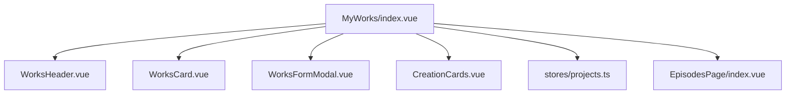
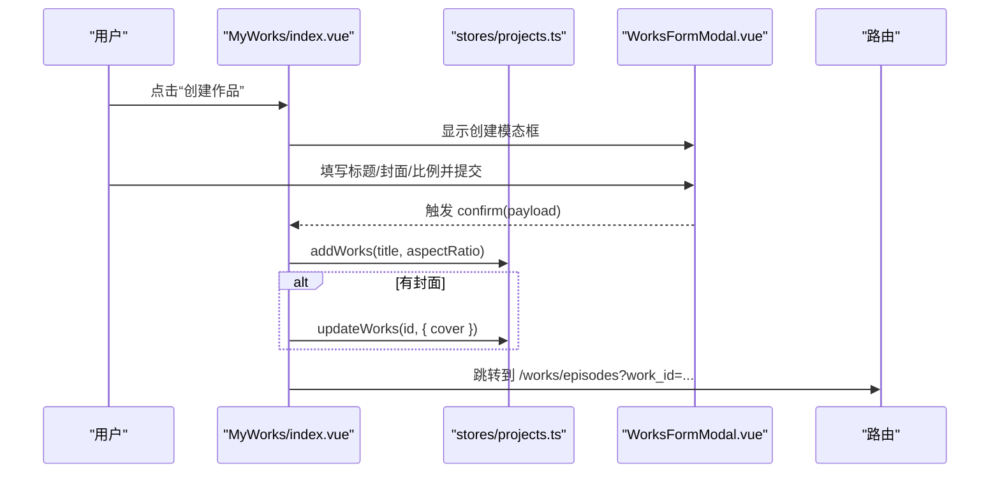
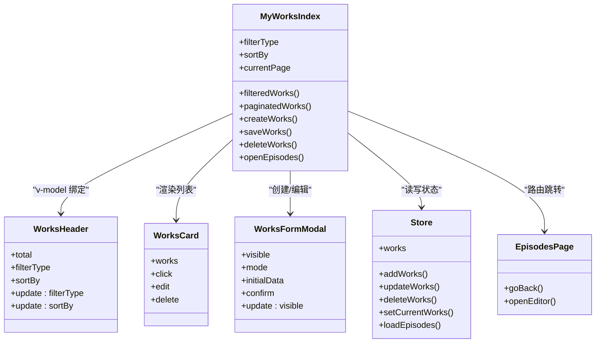
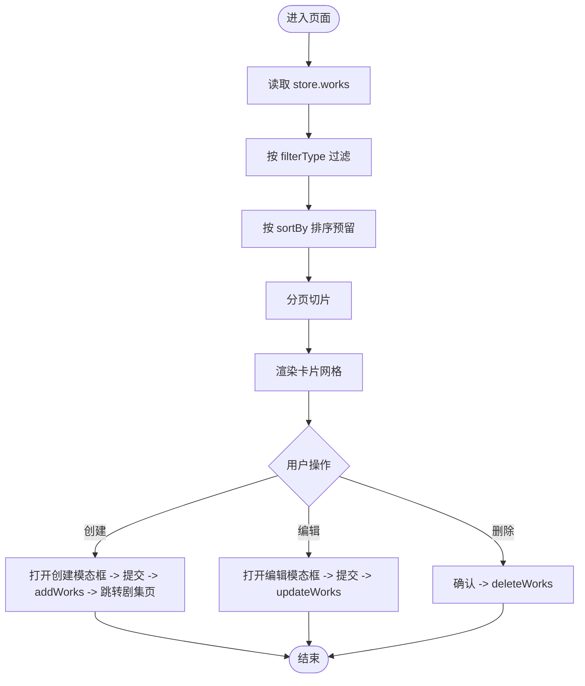
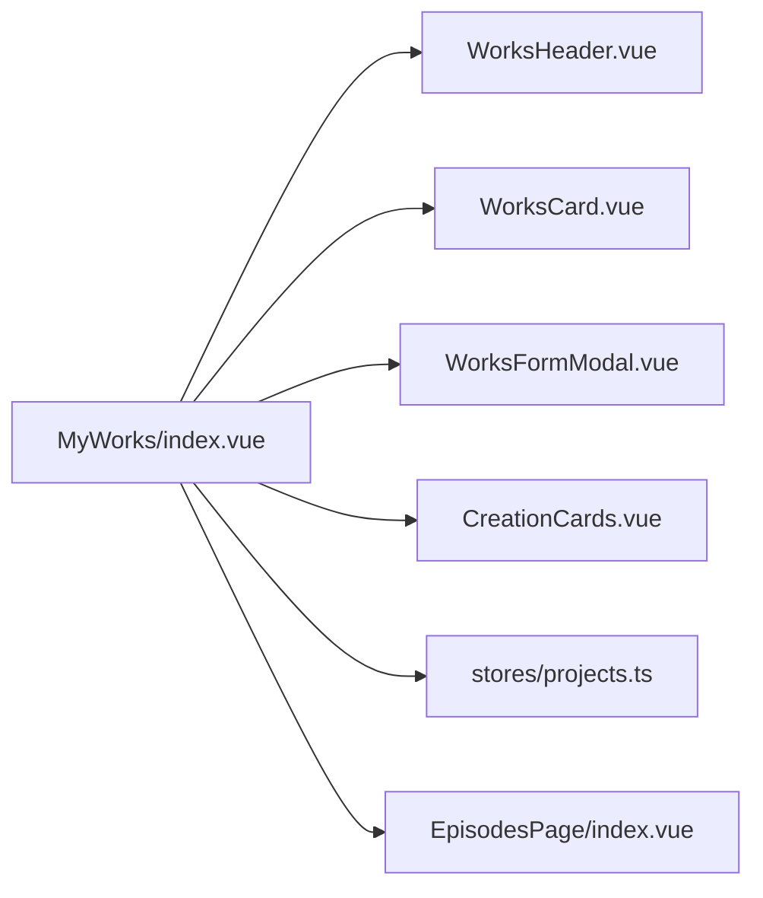

# 我的作品页面

<cite>
**本文引用的文件**   
- [frontend/src/views/MyWorks/index.vue](file://frontend/src/views/MyWorks/index.vue)
- [frontend/src/views/MyWorks/components/WorksCard.vue](file://frontend/src/views/MyWorks/components/WorksCard.vue)
- [frontend/src/views/MyWorks/components/WorksFormModal.vue](file://frontend/src/views/MyWorks/components/WorksFormModal.vue)
- [frontend/src/views/MyWorks/components/WorksHeader.vue](file://frontend/src/views/MyWorks/components/WorksHeader.vue)
- [frontend/src/views/MyWorks/components/CreationCards.vue](file://frontend/src/views/MyWorks/components/CreationCards.vue)
- [frontend/src/stores/projects.ts](file://frontend/src/stores/projects.ts)
- [frontend/src/views/EpisodesPage/index.vue](file://frontend/src/views/EpisodesPage/index.vue)
</cite>

## 目录
1. [简介](#简介)
2. [项目结构](#项目结构)
3. [核心组件与数据流](#核心组件与数据流)
4. [架构总览](#架构总览)
5. [详细组件分析](#详细组件分析)
6. [依赖关系分析](#依赖关系分析)
7. [性能与体验优化建议](#性能与体验优化建议)
8. [故障排查指南](#故障排查指南)
9. [结论](#结论)
10. [附录：扩展规划（版本历史、协作历史、分享）](#附录：扩展规划版本历史协作历史分享)

## 简介
本页面用于管理用户的个人作品，提供作品的创建、编辑、删除、筛选与排序、分页展示等能力。页面由“创作卡片”、“作品头部”、“作品网格”和“表单模态框”组成，并通过 Pinia store 进行状态管理。当前实现以本地状态为主，后续可扩展为服务端持久化、权限控制、分享与统计等功能。

## 项目结构
“我的作品”页面位于前端视图模块中，采用按功能域划分的目录组织方式：
- 页面入口：MyWorks/index.vue
- 子组件：
  - WorksCard.vue：单条作品卡片
  - WorksFormModal.vue：创建/编辑作品的表单弹窗
  - WorksHeader.vue：作品列表的筛选与排序头部
  - CreationCards.vue：快捷创建入口卡片
- 状态管理：stores/projects.ts（Pinia）
- 关联页面：EpisodesPage/index.vue（进入某作品后跳转至剧集管理页）

图表来源
- [frontend/src/views/MyWorks/index.vue:1-184](file://frontend/src/views/MyWorks/index.vue#L1-L184)
- [frontend/src/views/MyWorks/components/WorksHeader.vue:1-84](file://frontend/src/views/MyWorks/components/WorksHeader.vue#L1-L84)
- [frontend/src/views/MyWorks/components/WorksCard.vue:1-60](file://frontend/src/views/MyWorks/components/WorksCard.vue#L1-L60)
- [frontend/src/views/MyWorks/components/WorksFormModal.vue:1-193](file://frontend/src/views/MyWorks/components/WorksFormModal.vue#L1-L193)
- [frontend/src/views/MyWorks/components/CreationCards.vue:1-82](file://frontend/src/views/MyWorks/components/CreationCards.vue#L1-L82)
- [frontend/src/stores/projects.ts:1-279](file://frontend/src/stores/projects.ts#L1-L279)
- [frontend/src/views/EpisodesPage/index.vue:1-115](file://frontend/src/views/EpisodesPage/index.vue#L1-L115)

章节来源
- [frontend/src/views/MyWorks/index.vue:1-184](file://frontend/src/views/MyWorks/index.vue#L1-L184)
- [frontend/src/stores/projects.ts:1-279](file://frontend/src/stores/projects.ts#L1-L279)

## 核心组件与数据流
- 页面级状态
  - 过滤类型 filterType：全部/草稿/已发布
  - 排序 sortBy：更新时间/创建时间/热度
  - 分页 currentPage/pageSize
  - 模态框显隐：创建/编辑/删除/即将上线提示
- 数据源
  - works 列表来自 Pinia store，支持增删改查
- 计算属性
  - filteredWorks：根据 filterType 过滤
  - totalPages/paginatedWorks：基于 pageSize 的分片
- 交互流程
  - 点击“创建作品”或“创作卡片”触发创建流程
  - 编辑/删除通过对应模态框确认并调用 store 方法更新
  - 打开作品跳转到剧集管理页

图表来源
- [frontend/src/views/MyWorks/index.vue:50-57](file://frontend/src/views/MyWorks/index.vue#L50-L57)
- [frontend/src/views/MyWorks/components/WorksFormModal.vue:57-69](file://frontend/src/views/MyWorks/components/WorksFormModal.vue#L57-L69)
- [frontend/src/stores/projects.ts:137-163](file://frontend/src/stores/projects.ts#L137-L163)
- [frontend/src/views/MyWorks/index.vue:91-93](file://frontend/src/views/MyWorks/index.vue#L91-L93)

章节来源
- [frontend/src/views/MyWorks/index.vue:26-48](file://frontend/src/views/MyWorks/index.vue#L26-L48)
- [frontend/src/stores/projects.ts:72-163](file://frontend/src/stores/projects.ts#L72-L163)

## 架构总览
从组件到状态再到路由的整体交互如下：

图表来源
- [frontend/src/views/MyWorks/index.vue:1-184](file://frontend/src/views/MyWorks/index.vue#L1-L184)
- [frontend/src/views/MyWorks/components/WorksHeader.vue:1-84](file://frontend/src/views/MyWorks/components/WorksHeader.vue#L1-L84)
- [frontend/src/views/MyWorks/components/WorksCard.vue:1-60](file://frontend/src/views/MyWorks/components/WorksCard.vue#L1-L60)
- [frontend/src/views/MyWorks/components/WorksFormModal.vue:1-193](file://frontend/src/views/MyWorks/components/WorksFormModal.vue#L1-L193)
- [frontend/src/stores/projects.ts:1-279](file://frontend/src/stores/projects.ts#L1-L279)
- [frontend/src/views/EpisodesPage/index.vue:1-115](file://frontend/src/views/EpisodesPage/index.vue#L1-L115)

## 详细组件分析

### 页面入口：MyWorks/index.vue
- 职责
  - 聚合子组件，维护页面级状态（过滤、排序、分页、模态框）
  - 处理创建、编辑、删除、跳转等交互
- 关键逻辑
  - 过滤：computed 根据 filterType 过滤 works
  - 分页：pageSize=10，自动修正当前页
  - 创建：调用 store.addWorks，可选更新封面，随后跳转剧集页
  - 编辑：填充初始数据，提交后调用 store.updateWorks
  - 删除：二次确认后调用 store.deleteWorks
  - 跳转：使用 router.push 携带 work_id 参数
- 事件与通信
  - 与 WorksHeader 双向绑定 filterType/sortBy
  - 与 WorksCard 透传 click/edit/delete 事件
  - 与 WorksFormModal 双向绑定 visible 与 confirm 回调

章节来源
- [frontend/src/views/MyWorks/index.vue:26-48](file://frontend/src/views/MyWorks/index.vue#L26-L48)
- [frontend/src/views/MyWorks/index.vue:50-97](file://frontend/src/views/MyWorks/index.vue#L50-L97)
- [frontend/src/views/MyWorks/index.vue:108-184](file://frontend/src/views/MyWorks/index.vue#L108-L184)

### 作品卡片：WorksCard.vue
- 职责
  - 展示作品封面、标题、状态标签、更新时间
  - 暴露 click/edit/delete 事件给父组件
- 细节
  - 状态标签：published 显示“已发布”，否则显示“草稿”
  - 操作按钮：编辑与删除，阻止冒泡避免误触卡片点击

章节来源
- [frontend/src/views/MyWorks/components/WorksCard.vue:1-60](file://frontend/src/views/MyWorks/components/WorksCard.vue#L1-L60)

### 表单模态框：WorksFormModal.vue
- 职责
  - 统一的创建/编辑表单，支持封面上传与 AI 生成封面（模拟）
  - 画面比例选择：创建时可切换横屏/竖屏；编辑时只读展示
- 关键逻辑
  - 监听 visible 初始化表单数据
  - 封面上传：FileReader 转 base64 预览
  - AI 生成封面：模拟延迟后随机选取预设图片
  - 校验：标题非空才允许提交
- 事件
  - update:visible 控制弹窗显隐
  - confirm 回传 { title, cover, aspectRatio }

章节来源
- [frontend/src/views/MyWorks/components/WorksFormModal.vue:1-69](file://frontend/src/views/MyWorks/components/WorksFormModal.vue#L1-L69)
- [frontend/src/views/MyWorks/components/WorksFormModal.vue:70-193](file://frontend/src/views/MyWorks/components/WorksFormModal.vue#L70-L193)

### 作品头部：WorksHeader.vue
- 职责
  - 展示总数、筛选（全部/草稿/已发布）、排序下拉（更新时间/创建时间/热度）、搜索输入
- 交互
  - 通过 v-model 与父组件同步 filterType/sortBy
  - 排序菜单点击后关闭自身

章节来源
- [frontend/src/views/MyWorks/components/WorksHeader.vue:1-84](file://frontend/src/views/MyWorks/components/WorksHeader.vue#L1-L84)

### 创作卡片：CreationCards.vue
- 职责
  - 提供三种快速创建入口：剧本、分镜脚本、小说（即将上线）
- 交互
  - 点击“开始创建”触发 create 事件，传入类型
  - 小说类型走“即将上线”提示

章节来源
- [frontend/src/views/MyWorks/components/CreationCards.vue:1-82](file://frontend/src/views/MyWorks/components/CreationCards.vue#L1-L82)

### 状态管理：stores/projects.ts
- 数据结构
  - Works：id/title/cover/updatedAt/episodes/status/aspectRatio
  - Episode：id/worksId/title/cover/order/scenes
  - Scene：场景元信息与媒体占位
- 核心方法
  - addWorks/updateWorks/deleteWorks：作品 CRUD
  - setCurrentWorks/loadEpisodes：加载当前作品及剧集（Mock）
  - addEpisode/updateEpisode：剧集 CRUD
  - addScene/addScenesBatch/reorderScene/deleteScene：分镜场景管理
- 复杂度
  - 新增/删除/更新：O(n) 查找与数组操作
  - 批量新增：O(k) 追加 k 个场景
  - 重排：splice O(n)

图表来源
- [frontend/src/views/MyWorks/index.vue:26-48](file://frontend/src/views/MyWorks/index.vue#L26-L48)
- [frontend/src/stores/projects.ts:137-163](file://frontend/src/stores/projects.ts#L137-L163)

章节来源
- [frontend/src/stores/projects.ts:1-279](file://frontend/src/stores/projects.ts#L1-279)

### 关联页面：EpisodesPage/index.vue
- 职责
  - 根据 URL 中的 work_id 设置当前作品并加载剧集列表
  - 提供剧集的创建、编辑、删除与分页
- 与“我的作品”的关系
  - “我的作品”在创建成功后跳转到该页面，形成作品到剧集的导航链路

章节来源
- [frontend/src/views/EpisodesPage/index.vue:1-115](file://frontend/src/views/EpisodesPage/index.vue#L1-L115)

## 依赖关系分析
- 组件耦合
  - index.vue 作为编排者，低耦合地组合 Header/Card/FormModal/Cards
  - Card 仅负责展示与事件透传，无业务逻辑
- 状态依赖
  - 所有读写均通过 Pinia store，便于跨页面共享与扩展
- 外部依赖
  - Vue Router 用于页面跳转
  - 自定义 UI 组件库（Xb*）用于通用控件

图表来源
- [frontend/src/views/MyWorks/index.vue:1-184](file://frontend/src/views/MyWorks/index.vue#L1-L184)
- [frontend/src/stores/projects.ts:1-279](file://frontend/src/stores/projects.ts#L1-L279)
- [frontend/src/views/EpisodesPage/index.vue:1-115](file://frontend/src/views/EpisodesPage/index.vue#L1-L115)

## 性能与体验优化建议
- 列表渲染
  - 当前使用数组 slice 做前端分页，适合中小规模；若数据量大，建议后端分页
  - 对封面图启用懒加载与尺寸裁剪，减少首屏压力
- 计算属性
  - 过滤与排序可合并为一个 computed，减少重复遍历
- 模态框
  - 表单重置建议在 onMounted 或 visible 变化时统一执行，避免残留状态
- 路由
  - 跳转前校验 work_id 存在性，避免无效跳转

[本节为通用建议，不直接分析具体文件]

## 故障排查指南
- 问题：创建后未跳转
  - 检查是否成功获取到新作品 id，以及路由 push 的参数是否正确
  - 参考路径：[frontend/src/views/MyWorks/index.vue:50-57](file://frontend/src/views/MyWorks/index.vue#L50-L57)
- 问题：编辑后数据未更新
  - 确认 updateWorks 的 id 与字段名正确
  - 参考路径：[frontend/src/stores/projects.ts:157-163](file://frontend/src/stores/projects.ts#L157-L163)
- 问题：删除后分页异常
  - 检查 watch(totalPages) 是否将 currentPage 回退到有效范围
  - 参考路径：[frontend/src/views/MyWorks/index.vue:44-48](file://frontend/src/views/MyWorks/index.vue#L44-L48)
- 问题：AI 生成封面不生效
  - 当前为模拟实现，需替换为真实接口并处理错误与 loading 状态
  - 参考路径：[frontend/src/views/MyWorks/components/WorksFormModal.vue:46-55](file://frontend/src/views/MyWorks/components/WorksFormModal.vue#L46-L55)

章节来源
- [frontend/src/views/MyWorks/index.vue:44-57](file://frontend/src/views/MyWorks/index.vue#L44-L57)
- [frontend/src/stores/projects.ts:157-163](file://frontend/src/stores/projects.ts#L157-L163)
- [frontend/src/views/MyWorks/components/WorksFormModal.vue:46-55](file://frontend/src/views/MyWorks/components/WorksFormModal.vue#L46-L55)

## 结论
“我的作品”页面已完成基础的作品管理与创作入口，具备清晰的组件分层与状态管理。当前以本地 Mock 数据为主，后续可按需接入服务端 API，完善权限控制、分享、统计、版本与协作历史等高级能力。

[本节为总结性内容，不直接分析具体文件]

## 附录：扩展规划（版本历史、协作历史、分享）
- 版本历史
  - 在 store 中增加 versions 数组，记录每次保存的关键变更快照
  - 提供对比与回滚能力
- 协作历史
  - 记录协作者、操作类型、时间戳，支持按人/按操作筛选
- 分享功能
  - 生成分享链接（含权限标识），支持公开/私有/密码访问
  - 分享面板包含二维码、复制链接、平台一键分享
- 作品统计
  - 播放量、收藏数、评论数、下载量等指标汇总
  - 提供趋势图表与导出报表

[本节为概念性规划，不直接分析具体文件]