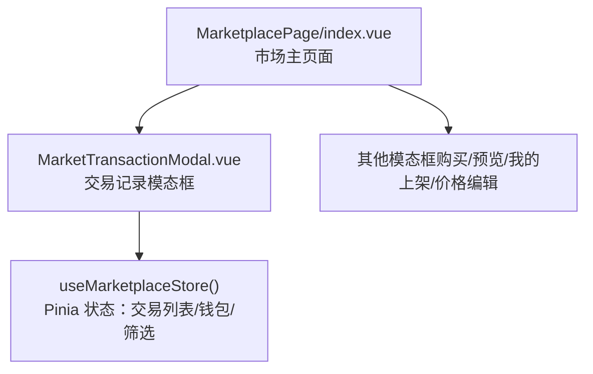
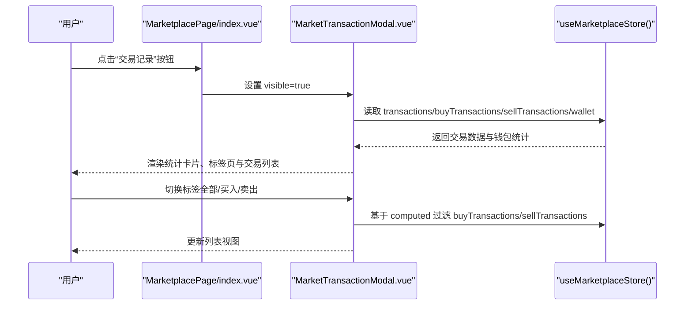
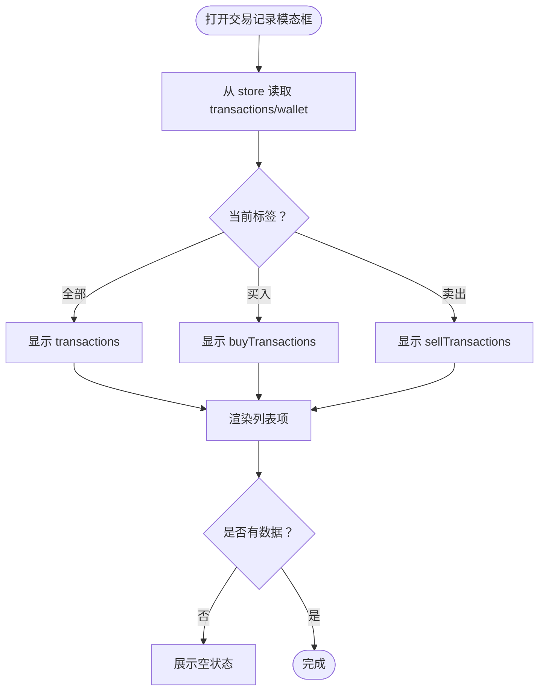
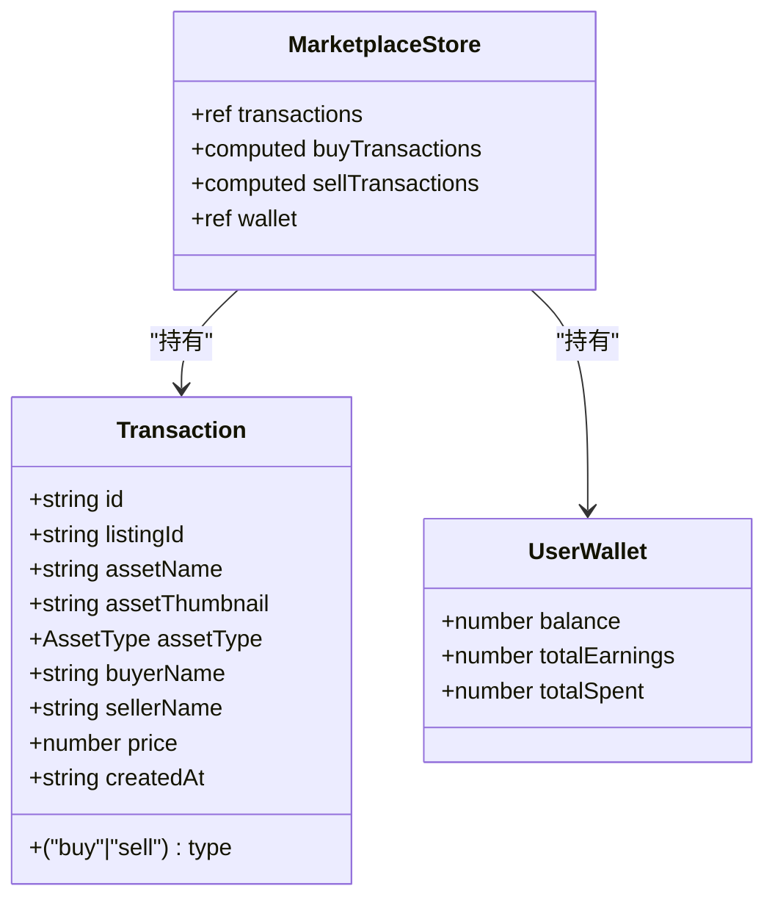
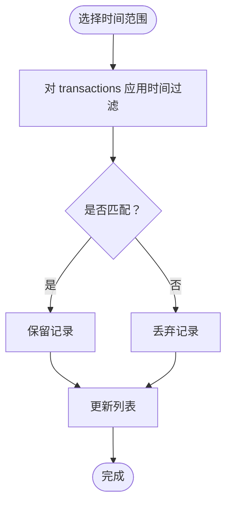
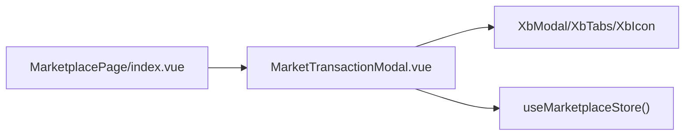

# 交易记录模态框

<cite>
**本文引用的文件**   
- [markettransactionmodal.vue](file://frontend/src/views/MarketplacePage/components/markettransactionmodal.vue)
- [index.vue](file://frontend/src/views/MarketplacePage/index.vue)
- [marketplace.ts](file://frontend/src/stores/marketplace.ts)
</cite>

## 目录
1. [简介](#简介)
2. [项目结构](#项目结构)
3. [核心组件](#核心组件)
4. [架构总览](#架构总览)
5. [详细组件分析](#详细组件分析)
6. [依赖分析](#依赖分析)
7. [性能考虑](#性能考虑)
8. [故障排查指南](#故障排查指南)
9. [结论](#结论)
10. [附录](#附录)

## 简介
本文件围绕“交易记录模态框”进行系统化文档化，覆盖交易历史展示、状态分类、时间筛选与导出等能力的设计与实现思路；同时说明数据格式化、状态图标渲染、批量操作机制，以及交易详情展开、退款处理与客服联系功能的扩展方案。该模态框用于在资产市场中查看用户的买入/卖出交易流水，并提供统计概览与快速筛选。

## 项目结构
交易记录模态框位于市场页面模块下，由父页面控制显隐，并通过 Pinia 共享交易数据。

图表来源
- [index.vue:111-196](file://frontend/src/views/MarketplacePage/index.vue#L111-L196)
- [markettransactionmodal.vue:1-93](file://frontend/src/views/MarketplacePage/components/markettransactionmodal.vue#L1-L93)
- [marketplace.ts:77-334](file://frontend/src/stores/marketplace.ts#L77-L334)

章节来源
- [index.vue:111-196](file://frontend/src/views/MarketplacePage/index.vue#L111-L196)
- [markettransactionmodal.vue:1-93](file://frontend/src/views/MarketplacePage/components/markettransactionmodal.vue#L1-L93)
- [marketplace.ts:77-334](file://frontend/src/stores/marketplace.ts#L77-L334)

## 核心组件
- 交易记录模态框 MarketTransactionModal
  - 功能要点
    - 顶部统计卡片：总收入、总支出、交易笔数
    - 标签页切换：全部 / 买入 / 卖出
    - 交易列表：缩略图、名称、交易对象、金额正负、时间
    - 空状态提示
  - 数据来源
    - 通过 useMarketplaceStore 获取 transactions、buyTransactions、sellTransactions、wallet
  - 交互
    - 通过 visible 属性控制显示/隐藏，使用 update:visible 事件通知父组件

章节来源
- [markettransactionmodal.vue:1-93](file://frontend/src/views/MarketplacePage/components/markettransactionmodal.vue#L1-L93)
- [marketplace.ts:107-128](file://frontend/src/stores/marketplace.ts#L107-L128)
- [marketplace.ts:202-205](file://frontend/src/stores/marketplace.ts#L202-L205)

## 架构总览
交易记录模态框的调用链路与数据流如下：

图表来源
- [index.vue:114-118](file://frontend/src/views/MarketplacePage/index.vue#L114-L118)
- [index.vue:166-170](file://frontend/src/views/MarketplacePage/index.vue#L166-L170)
- [markettransactionmodal.vue:14-27](file://frontend/src/views/MarketplacePage/components/markettransactionmodal.vue#L14-L27)
- [marketplace.ts:202-205](file://frontend/src/stores/marketplace.ts#L202-L205)

## 详细组件分析

### 交易记录模态框（MarketTransactionModal）
- 数据结构
  - Transaction：包含 id、listingId、assetName、assetThumbnail、assetType、buyerName、sellerName、price、type、createdAt
  - UserWallet：balance、totalEarnings、totalSpent
- 计算逻辑
  - 根据当前标签 txTab 选择 buyTransactions/sellTransactions/transactions
  - 列表项按 type 决定金额前缀（+/-）与箭头图标方向
- 渲染细节
  - 图片加载失败回退：使用 onImgError 统一处理
  - 空状态：无交易时展示占位图标与文案
- 可访问性与体验
  - 固定宽度、滚动区域高度限制，避免长列表溢出
  - 颜色语义：收入用品牌色，支出用暖色，便于区分

图表来源
- [markettransactionmodal.vue:16-27](file://frontend/src/views/MarketplacePage/components/markettransactionmodal.vue#L16-L27)
- [markettransactionmodal.vue:63-90](file://frontend/src/views/MarketplacePage/components/markettransactionmodal.vue#L63-L90)
- [marketplace.ts:107-128](file://frontend/src/stores/marketplace.ts#L107-L128)

章节来源
- [markettransactionmodal.vue:1-93](file://frontend/src/views/MarketplacePage/components/markettransactionmodal.vue#L1-L93)
- [marketplace.ts:107-128](file://frontend/src/stores/marketplace.ts#L107-L128)
- [marketplace.ts:202-205](file://frontend/src/stores/marketplace.ts#L202-L205)

### 数据模型与关系

图表来源
- [marketplace.ts:39-71](file://frontend/src/stores/marketplace.ts#L39-L71)
- [marketplace.ts:107-128](file://frontend/src/stores/marketplace.ts#L107-L128)
- [marketplace.ts:202-205](file://frontend/src/stores/marketplace.ts#L202-L205)

章节来源
- [marketplace.ts:39-71](file://frontend/src/stores/marketplace.ts#L39-L71)
- [marketplace.ts:107-128](file://frontend/src/stores/marketplace.ts#L107-L128)
- [marketplace.ts:202-205](file://frontend/src/stores/marketplace.ts#L202-L205)

### 交易详情展开（建议实现）
- 目标
  - 点击某条交易记录，展开详情面板，展示商品缩略图、名称、类型、买家/卖家、金额、时间、订单号等
- 设计要点
  - 使用 expandable 行或抽屉式详情，避免破坏列表布局
  - 详情内提供“复制订单号”、“查看详情链接”等操作
- 数据绑定
  - 基于 Transaction 字段直接映射
- 交互流程
  - 点击行 → 设置 expandedId → 渲染详情区 → 再次点击或点击遮罩关闭

[本节为概念性设计，不直接分析具体文件]

### 时间筛选（建议实现）
- 目标
  - 支持按日期范围筛选交易记录（如最近7天、本月、自定义区间）
- 设计要点
  - 在模态框头部增加日期选择器与快捷选项
  - 将筛选条件作为 store 的可选参数，或本地计算属性过滤
- 算法流程

[本节为概念性设计，不直接分析具体文件]

### 导出功能（建议实现）
- 目标
  - 将当前筛选后的交易记录导出为 CSV/Excel
- 设计要点
  - 导出列：订单号、商品名、类型、买方、卖方、金额、时间
  - 大列表分批生成，避免阻塞 UI
  - 文件名含时间戳，便于归档
- 技术建议
  - 前端使用 Blob + URL.createObjectURL 触发下载
  - 如需服务端导出，提供接口并返回文件流

[本节为概念性设计，不直接分析具体文件]

### 状态图标渲染与金额语义
- 状态图标
  - 买入：向下箭头 + 负号（支出）
  - 卖出：向上箭头 + 正号（收入）
- 颜色语义
  - 收入使用品牌色，支出使用暖色，提升可读性
- 实现位置
  - 列表项中根据 type 动态渲染图标与符号

章节来源
- [markettransactionmodal.vue:76-83](file://frontend/src/views/MarketplacePage/components/markettransactionmodal.vue#L76-L83)

### 批量操作机制（建议实现）
- 场景
  - 批量标记已读、批量导出、批量申请售后/退款
- 设计要点
  - 列表左侧复选框，支持全选/反选
  - 底部工具栏显示选中数量与批量操作按钮
  - 操作完成后刷新列表或局部更新状态

[本节为概念性设计，不直接分析具体文件]

### 退款处理（建议实现）
- 业务背景
  - 当交易发生争议或异常时，需支持发起退款
- 流程建议
  - 在交易详情中提供“申请退款”入口
  - 提交后进入审核状态，成功后更新交易状态并调整钱包余额
  - 记录退款日志，便于审计
- 与钱包联动
  - 退款成功：totalEarnings 或 balance 相应增加
  - 扣款失败：提示用户并引导重试

[本节为概念性设计，不直接分析具体文件]

### 客服联系（建议实现）
- 入口
  - 交易详情或列表底部提供“联系客服”按钮
- 行为
  - 跳转至站内客服会话或外部联系方式
  - 自动附带订单号与交易摘要，减少沟通成本

[本节为概念性设计，不直接分析具体文件]

## 依赖分析
- 组件依赖
  - MarketTransactionModal 依赖 XbModal、XbTabs、XbIcon 等基础 UI 组件
  - 依赖 useMarketplaceStore 提供的交易数据与钱包统计
- 页面集成
  - MarketplacePage/index.vue 负责控制模态框可见性与传递 props

图表来源
- [markettransactionmodal.vue:1-27](file://frontend/src/views/MarketplacePage/components/markettransactionmodal.vue#L1-L27)
- [index.vue:166-170](file://frontend/src/views/MarketplacePage/index.vue#L166-L170)
- [marketplace.ts:77-334](file://frontend/src/stores/marketplace.ts#L77-L334)

章节来源
- [markettransactionmodal.vue:1-27](file://frontend/src/views/MarketplacePage/components/markettransactionmodal.vue#L1-L27)
- [index.vue:166-170](file://frontend/src/views/MarketplacePage/index.vue#L166-L170)
- [marketplace.ts:77-334](file://frontend/src/stores/marketplace.ts#L77-L334)

## 性能考虑
- 列表渲染
  - 使用 v-for key 稳定绑定，避免不必要的重排
  - 图片懒加载与错误回退，降低首屏压力
- 计算优化
  - buyTransactions/sellTransactions 使用 computed 缓存，避免重复过滤
- 交互体验
  - 固定滚动区域高度，避免长列表导致布局抖动
  - 空状态提前判断，减少 DOM 节点

[本节为通用指导，不直接分析具体文件]

## 故障排查指南
- 常见问题
  - 图片加载失败：检查 onImgError 是否正确注册与回退路径
  - 列表为空：确认 store.transactions 是否为空或筛选条件过严
  - 金额符号错误：核对 type 值与渲染逻辑是否一致
- 定位步骤
  - 打开浏览器控制台，观察网络请求与状态更新
  - 在 store 中打印 transactions 与 wallet 快照，验证数据完整性
  - 在组件中临时输出 filteredTransactions 长度与内容

章节来源
- [markettransactionmodal.vue:69-90](file://frontend/src/views/MarketplacePage/components/markettransactionmodal.vue#L69-L90)
- [marketplace.ts:107-128](file://frontend/src/stores/marketplace.ts#L107-L128)

## 结论
交易记录模态框以简洁的统计卡片与标签页为核心，结合 store 中的交易与钱包数据，实现了高效的交易历史浏览与分类筛选。建议在后续迭代中补充详情展开、时间筛选、导出、批量操作、退款与客服联系等功能，以提升用户体验与业务闭环能力。

## 附录
- 相关 API 与数据源
  - 交易记录：store.transactions
  - 买入记录：store.buyTransactions
  - 卖出记录：store.sellTransactions
  - 钱包统计：store.wallet.totalEarnings / totalSpent / balance

章节来源
- [marketplace.ts:107-128](file://frontend/src/stores/marketplace.ts#L107-L128)
- [marketplace.ts:202-205](file://frontend/src/stores/marketplace.ts#L202-L205)