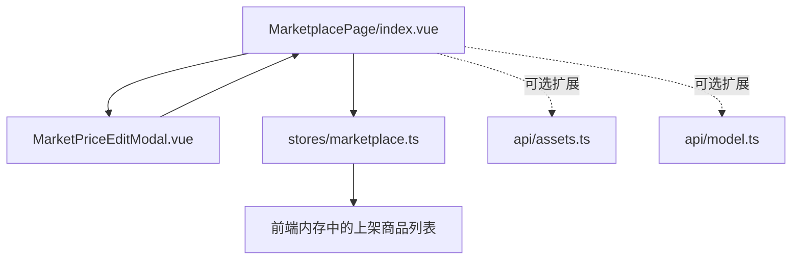
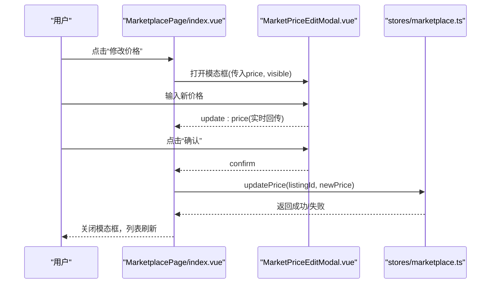
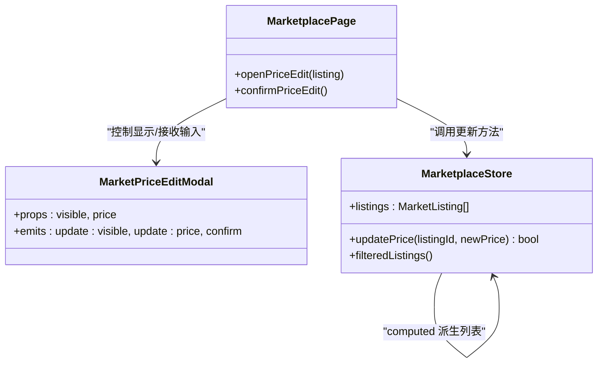
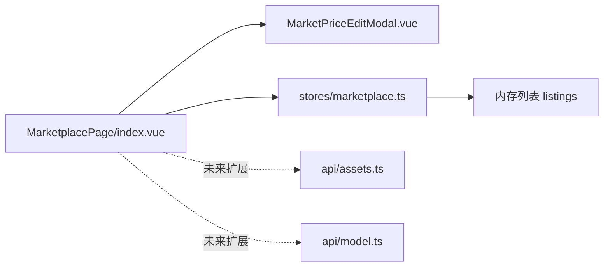

# 价格编辑模态框

<cite>
**本文引用的文件**   
- [MarketplacePage/index.vue](file://frontend/src/views/MarketplacePage/index.vue)
- [MarketPriceEditModal.vue](file://frontend/src/views/MarketplacePage/components/MarketPriceEditModal.vue)
- [marketplace.ts](file://frontend/src/stores/marketplace.ts)
- [assets.ts](file://frontend/src/api/assets.ts)
- [model.ts](file://frontend/src/api/model.ts)
</cite>

## 目录
1. [简介](#简介)
2. [项目结构](#项目结构)
3. [核心组件与数据流](#核心组件与数据流)
4. [架构总览](#架构总览)
5. [详细组件分析](#详细组件分析)
6. [依赖关系分析](#依赖关系分析)
7. [性能与体验优化建议](#性能与体验优化建议)
8. [故障排查指南](#故障排查指南)
9. [结论](#结论)

## 简介
本文件围绕“价格编辑模态框”的实现进行系统化文档说明，覆盖以下关键能力：
- 价格输入验证与范围限制
- 实时预览与双向绑定
- 批量修改与保存确认流程
- 历史记录对比、撤销与重做机制（设计建议）
- 价格建议算法与库存联动更新（设计建议）

当前仓库中已实现基础的价格编辑弹窗与状态管理；历史对比、撤销重做、建议算法与库存联动为可扩展设计点，本文在现有代码基础上给出可落地的方案与集成路径。

## 项目结构
与价格编辑相关的核心位置如下：
- 页面入口：MarketplacePage/index.vue，负责打开/关闭价格编辑模态框、触发保存
- 模态框组件：MarketPriceEditModal.vue，提供价格输入、确认/取消交互
- 市场状态管理：stores/marketplace.ts，维护上架商品列表、价格更新方法等
- 资产接口定义：api/assets.ts，用于资产相关 API 类型与请求封装（当前未直接参与价格编辑）
- 模型价格配置：api/model.ts，包含上游成本价与销售价结构，可作为“价格建议”的数据来源参考

图表来源
- [MarketplacePage/index.vue:86-102](file://frontend/src/views/MarketplacePage/index.vue#L86-L102)
- [MarketPriceEditModal.vue:1-42](file://frontend/src/views/MarketplacePage/components/MarketPriceEditModal.vue#L1-L42)
- [marketplace.ts:295-301](file://frontend/src/stores/marketplace.ts#L295-L301)

章节来源
- [MarketplacePage/index.vue:86-102](file://frontend/src/views/MarketplacePage/index.vue#L86-L102)
- [MarketPriceEditModal.vue:1-42](file://frontend/src/views/MarketplacePage/components/MarketPriceEditModal.vue#L1-L42)
- [marketplace.ts:295-301](file://frontend/src/stores/marketplace.ts#L295-L301)

## 核心组件与数据流
- 打开编辑：页面持有当前编辑项的 listingId 与初始 price，打开模态框并传入 props
- 实时预览：模态框通过 v-model 风格的双向绑定将用户输入回传给父级
- 保存确认：点击确认后，父级调用 store.updatePrice 更新内存中的价格，随后关闭模态框
- 过滤与排序：store 中 computed 列表会基于新价格即时反映到筛选结果中

图表来源
- [MarketplacePage/index.vue:91-102](file://frontend/src/views/MarketplacePage/index.vue#L91-L102)
- [MarketPriceEditModal.vue:24-37](file://frontend/src/views/MarketplacePage/components/MarketPriceEditModal.vue#L24-L37)
- [marketplace.ts:295-301](file://frontend/src/stores/marketplace.ts#L295-L301)

章节来源
- [MarketplacePage/index.vue:91-102](file://frontend/src/views/MarketplacePage/index.vue#L91-L102)
- [MarketPriceEditModal.vue:24-37](file://frontend/src/views/MarketplacePage/components/MarketPriceEditModal.vue#L24-L37)
- [marketplace.ts:295-301](file://frontend/src/stores/marketplace.ts#L295-L301)

## 架构总览
从系统视角看，价格编辑涉及三层：
- 视图层：MarketPriceEditModal 负责输入与校验提示
- 状态层：marketplace store 负责数据变更与派生计算
- 数据层：当前为前端内存数据，后续可扩展至后端持久化与版本历史

图表来源
- [MarketPriceEditModal.vue:3-12](file://frontend/src/views/MarketplacePage/components/MarketPriceEditModal.vue#L3-L12)
- [marketplace.ts:295-301](file://frontend/src/stores/marketplace.ts#L295-L301)
- [marketplace.ts:145-195](file://frontend/src/stores/marketplace.ts#L145-L195)
- [MarketplacePage/index.vue:91-102](file://frontend/src/views/MarketplacePage/index.vue#L91-L102)

## 详细组件分析

### 价格输入验证与范围限制
- 最小值限制：输入框设置 min=1，确保不能输入小于 1 的值
- 确认按钮禁用：当 price <= 0 时禁用确认，避免无效提交
- 建议增强：
  - 增加小数位限制（如最多两位），防止非法精度
  - 增加上限校验（例如最大 10000），并在输入时给出友好提示
  - 对非数字字符进行拦截或自动清理

章节来源
- [MarketPriceEditModal.vue:24-37](file://frontend/src/views/MarketplacePage/components/MarketPriceEditModal.vue#L24-L37)

### 实时预览与双向绑定
- 使用 @input 事件将输入值转换为数值后通过 update:price 回传给父级
- 父级通过 v-model 风格的 :price 与 @update:price 完成双向绑定
- 效果：用户在输入过程中即可看到价格变化，且筛选/排序结果实时更新

章节来源
- [MarketPriceEditModal.vue:24-37](file://frontend/src/views/MarketplacePage/components/MarketPriceEditModal.vue#L24-L37)
- [MarketplacePage/index.vue:173-179](file://frontend/src/views/MarketplacePage/index.vue#L173-L179)

### 批量修改与保存确认
- 当前实现为单条修改：confirmPriceEdit 调用 store.updatePrice 更新单个 listing
- 批量修改建议：
  - 在页面新增“批量选择”与“批量改价”入口
  - 收集选中项 ID 与新价格，遍历调用 updatePrice 或新增 batchUpdatePrice 方法
  - 保存前弹出确认对话框，展示受影响条目数量与价格差异摘要

章节来源
- [MarketplacePage/index.vue:97-102](file://frontend/src/views/MarketplacePage/index.vue#L97-L102)
- [marketplace.ts:295-301](file://frontend/src/stores/marketplace.ts#L295-L301)

### 保存确认流程
- 父级在 confirm 回调中执行：
  - 校验价格 > 0
  - 调用 store.updatePrice 更新
  - 关闭模态框
- 若需要后端持久化，可在 updatePrice 内部发起 API 请求，成功后再关闭

章节来源
- [MarketplacePage/index.vue:97-102](file://frontend/src/views/MarketplacePage/index.vue#L97-L102)
- [marketplace.ts:295-301](file://frontend/src/stores/marketplace.ts#L295-L301)

### 历史记录对比与撤销/重做（设计建议）
- 数据结构建议：
  - 为每个 listing 维护 history: Array<{price, time}>
  - 记录每次修改的时间戳与旧价格
- 功能建议：
  - 在模态框底部展示最近 N 次价格变更记录
  - 支持“撤销”回到上一次价格，“重做”恢复下一次变更
  - 提供“对比”视图，高亮新旧价格差异
- 与 store 的集成：
  - 在 updatePrice 中追加历史记录
  - 新增 undo/redo 方法，按栈操作恢复历史快照

[本节为概念性设计，不直接分析具体文件]

### 价格建议算法（设计建议）
- 数据来源：
  - 同类目平均售价、最低价、最高价
  - 销量/热度指标（viewCount、likeCount）
  - 上游成本价（可参考 model.ts 中的 cost_prices/sale_prices 结构）
- 算法思路：
  - 加权评分 = f(类目均价, 热度, 成本倍率, 竞争度)
  - 输出建议区间与推荐值，供用户参考
- 集成方式：
  - 在打开模态框时异步拉取建议数据
  - 在输入框旁展示“建议价格”与“依据”，允许一键应用

章节来源
- [model.ts:15-76](file://frontend/src/api/model.ts#L15-L76)

### 库存联动更新（设计建议）
- 场景：
  - 某些素材存在库存上限（如限量角色卡）
  - 价格调整可能影响转化率，需联动调整库存策略
- 建议：
  - 在 listing 上增加 stock 字段
  - 价格低于阈值时自动减少库存释放速度，或开启预售模式
  - 在 updatePrice 中根据规则触发库存策略更新

[本节为概念性设计，不直接分析具体文件]

## 依赖关系分析
- 组件耦合：
  - MarketplacePage 与 MarketPriceEditModal 通过 props/emits 松耦合
  - 业务逻辑集中在 marketplace store，便于测试与复用
- 外部依赖：
  - 当前未直接调用 assets.ts 与 model.ts 的 API，但可在此处接入后端服务
- 潜在循环依赖：
  - 当前无循环引用风险

图表来源
- [MarketplacePage/index.vue:86-102](file://frontend/src/views/MarketplacePage/index.vue#L86-L102)
- [MarketPriceEditModal.vue:1-42](file://frontend/src/views/MarketplacePage/components/MarketPriceEditModal.vue#L1-L42)
- [marketplace.ts:295-301](file://frontend/src/stores/marketplace.ts#L295-L301)

章节来源
- [MarketplacePage/index.vue:86-102](file://frontend/src/views/MarketplacePage/index.vue#L86-L102)
- [marketplace.ts:295-301](file://frontend/src/stores/marketplace.ts#L295-L301)

## 性能与体验优化建议
- 输入防抖：对高频输入进行节流/防抖，减少不必要的状态更新
- 局部更新：仅更新受影响的 listing，避免全量重算
- 虚拟滚动：当 listing 数量较大时，采用虚拟列表提升渲染性能
- 错误边界：对异常输入进行快速反馈，避免阻塞主线程

[本节为通用指导，不直接分析具体文件]

## 故障排查指南
- 问题：确认按钮不可用
  - 检查 price 是否 <= 0
  - 确认输入是否为有效数字
- 问题：修改后列表未刷新
  - 确认 store.updatePrice 是否被调用
  - 检查 filteredListings 是否基于 listings 派生
- 问题：批量修改未生效
  - 确认批量逻辑是否正确遍历所有选中项
  - 检查是否有权限限制（仅卖家可改价）

章节来源
- [MarketPriceEditModal.vue:37](file://frontend/src/views/MarketplacePage/components/MarketPriceEditModal.vue#L37)
- [marketplace.ts:295-301](file://frontend/src/stores/marketplace.ts#L295-L301)
- [marketplace.ts:145-195](file://frontend/src/stores/marketplace.ts#L145-L195)

## 结论
当前仓库已具备价格编辑模态框的基础能力：输入校验、实时预览、保存确认与列表刷新。建议在后续迭代中补充：
- 更完善的输入校验与范围限制
- 批量修改与保存确认的二次确认
- 历史记录对比与撤销/重做
- 价格建议算法与库存联动更新

这些增强将显著提升用户体验与运营效率，同时保持现有架构的清晰与可维护性。