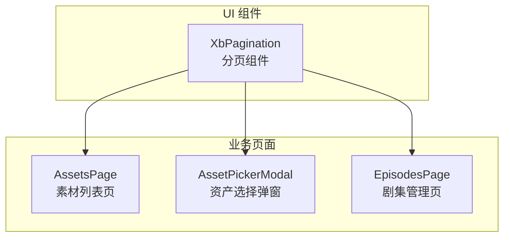
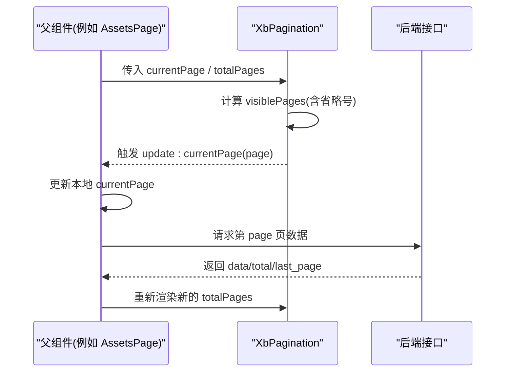
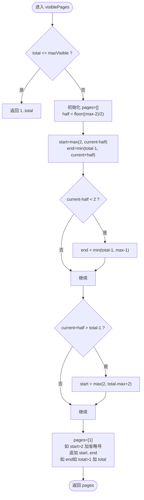
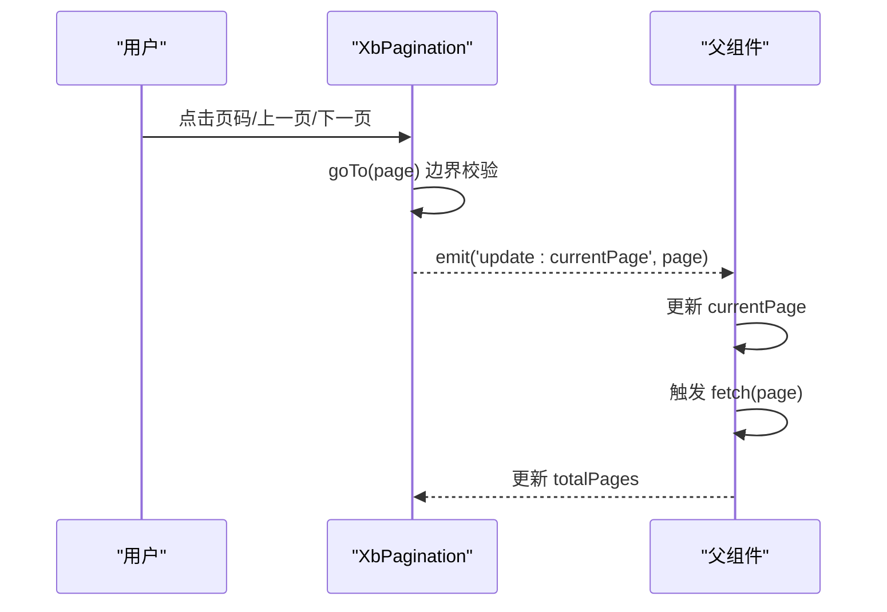
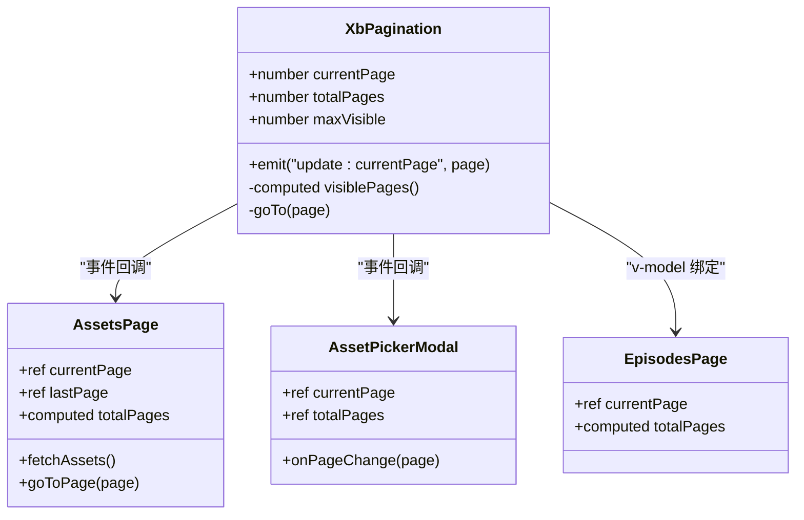

# 分页组件

<cite>
**本文引用的文件**   
- [XbPagination/index.vue](file://frontend/src/xbUi/XbPagination/index.vue)
- [AssetsPage/index.vue](file://frontend/src/views/AssetsPage/index.vue)
- [AssetPickerModal/index.vue](file://frontend/src/components/AssetPickerModal/index.vue)
- [EpisodesPage/index.vue](file://frontend/src/views/EpisodesPage/index.vue)
</cite>

## 目录
1. [简介](#简介)
2. [项目结构](#项目结构)
3. [核心组件](#核心组件)
4. [架构总览](#架构总览)
5. [详细组件分析](#详细组件分析)
6. [依赖关系分析](#依赖关系分析)
7. [性能与优化](#性能与优化)
8. [故障排查指南](#故障排查指南)
9. [结论](#结论)
10. [附录：配置、事件与样式示例](#附录配置事件与样式示例)

## 简介
本文件围绕前端 UI 库中的分页组件 XbPagination，系统化梳理其算法实现、页码计算逻辑、边界条件处理、事件与状态管理，并结合实际页面使用场景给出大量数据下的性能优化策略（含虚拟分页与懒加载思路）。文档同时提供组件的配置项、事件回调与自定义样式的完整示例路径，帮助读者快速上手并安全扩展。

## 项目结构
分页组件位于统一 UI 包中，供多个业务页面复用。典型调用位置包括素材列表、资产选择弹窗、剧集管理等页面。

图表来源
- [XbPagination/index.vue:1-103](file://frontend/src/xbUi/XbPagination/index.vue#L1-L103)
- [AssetsPage/index.vue:405-412](file://frontend/src/views/AssetsPage/index.vue#L405-L412)
- [AssetPickerModal/index.vue:205-211](file://frontend/src/components/AssetPickerModal/index.vue#L205-L211)
- [EpisodesPage/index.vue:92-95](file://frontend/src/views/EpisodesPage/index.vue#L92-L95)

章节来源
- [XbPagination/index.vue:1-103](file://frontend/src/xbUi/XbPagination/index.vue#L1-L103)
- [AssetsPage/index.vue:405-412](file://frontend/src/views/AssetsPage/index.vue#L405-L412)
- [AssetPickerModal/index.vue:205-211](file://frontend/src/components/AssetPickerModal/index.vue#L205-L211)
- [EpisodesPage/index.vue:92-95](file://frontend/src/views/EpisodesPage/index.vue#L92-L95)

## 核心组件
XbPagination 是一个轻量级、无外部依赖的纯展示型分页控件，负责：
- 根据当前页与总页数计算可见页码序列（包含省略号）
- 提供上一页/下一页按钮与页码点击跳转
- 通过双向绑定或事件更新父组件的当前页状态

关键特性
- 可配置最大可见页码数 maxVisible（默认 7）
- 自动在首尾保留固定页码，并在中间区域显示省略号
- 对边界页进行保护，避免越界跳转

章节来源
- [XbPagination/index.vue:4-14](file://frontend/src/xbUi/XbPagination/index.vue#L4-L14)
- [XbPagination/index.vue:19-49](file://frontend/src/xbUi/XbPagination/index.vue#L19-L49)
- [XbPagination/index.vue:51-55](file://frontend/src/xbUi/XbPagination/index.vue#L51-L55)

## 架构总览
从调用方到组件的数据流与事件流如下：

图表来源
- [XbPagination/index.vue:12-14](file://frontend/src/xbUi/XbPagination/index.vue#L12-L14)
- [XbPagination/index.vue:51-55](file://frontend/src/xbUi/XbPagination/index.vue#L51-L55)
- [AssetsPage/index.vue:176-182](file://frontend/src/views/AssetsPage/index.vue#L176-L182)
- [AssetsPage/index.vue:75-105](file://frontend/src/views/AssetsPage/index.vue#L75-L105)

## 详细组件分析

### 算法与页码计算
- 输入：currentPage、totalPages、maxVisible
- 输出：可见页码数组，元素为数字或省略号占位符
- 规则要点：
  - 当 total <= maxVisible 时，直接返回 1..total
  - 否则，以当前页为中心，尽量保持中间区域长度为 max-2，并在首尾保留 1 和 total
  - 若中心区域靠近首尾，则整体区间向有效范围平移，确保不越界
  - 在 start > 2 与 end < total-1 时插入省略号

图表来源
- [XbPagination/index.vue:19-49](file://frontend/src/xbUi/XbPagination/index.vue#L19-L49)

章节来源
- [XbPagination/index.vue:19-49](file://frontend/src/xbUi/XbPagination/index.vue#L19-L49)

### 事件与状态管理
- 事件：update:currentPage(page)
- 父组件职责：
  - 接收事件后校验并更新本地 currentPage
  - 基于新页码发起数据请求
  - 将 last_page 或 computed 的 totalPages 回传给组件
- 组件内部：
  - goTo(page) 会做边界检查，仅当 1<=page<=totalPages 且非当前页才触发事件

图表来源
- [XbPagination/index.vue:51-55](file://frontend/src/xbUi/XbPagination/index.vue#L51-L55)
- [AssetsPage/index.vue:176-182](file://frontend/src/views/AssetsPage/index.vue#L176-L182)

章节来源
- [XbPagination/index.vue:51-55](file://frontend/src/xbUi/XbPagination/index.vue#L51-L55)
- [AssetsPage/index.vue:176-182](file://frontend/src/views/AssetsPage/index.vue#L176-L182)

### 边界条件与异常处理
- 当 totalPages=1 时，组件隐藏自身（模板内 v-if 控制）
- 上一页/下一页按钮在首尾页禁用，防止无效操作
- 父组件在跳转前再次校验页码范围，避免非法页码导致请求异常

章节来源
- [XbPagination/index.vue:59](file://frontend/src/xbUi/XbPagination/index.vue#L59)
- [XbPagination/index.vue:61-70](file://frontend/src/xbUi/XbPagination/index.vue#L61-L70)
- [XbPagination/index.vue:91-100](file://frontend/src/xbUi/XbPagination/index.vue#L91-L100)
- [AssetsPage/index.vue:176-182](file://frontend/src/views/AssetsPage/index.vue#L176-L182)

### 使用示例与集成模式

#### 模式一：事件驱动（推荐用于服务端分页）
- 适用：数据来自后端，按页拉取
- 关键点：监听 update:currentPage，更新本地页码并请求数据

章节来源
- [AssetsPage/index.vue:405-412](file://frontend/src/views/AssetsPage/index.vue#L405-L412)
- [AssetsPage/index.vue:176-182](file://frontend/src/views/AssetsPage/index.vue#L176-L182)
- [AssetsPage/index.vue:75-105](file://frontend/src/views/AssetsPage/index.vue#L75-L105)

#### 模式二：v-model 双向绑定（适合客户端分页）
- 适用：数据已在内存，按 pageSize 切片
- 关键点：使用 v-model:currentPage 同步页码；watch 总页数变化修正越界

章节来源
- [EpisodesPage/index.vue:26-40](file://frontend/src/views/EpisodesPage/index.vue#L26-L40)
- [EpisodesPage/index.vue:92-95](file://frontend/src/views/EpisodesPage/index.vue#L92-L95)

#### 模式三：弹窗内分页（带搜索与类型筛选）
- 适用：在弹窗中选择资源，需跨页保持选中态
- 关键点：分页变更时重置搜索/筛选并重新拉取数据

章节来源
- [AssetPickerModal/index.vue:50-63](file://frontend/src/components/AssetPickerModal/index.vue#L50-L63)
- [AssetPickerModal/index.vue:131-134](file://frontend/src/components/AssetPickerModal/index.vue#L131-L134)
- [AssetPickerModal/index.vue:205-211](file://frontend/src/components/AssetPickerModal/index.vue#L205-L211)

## 依赖关系分析
- 组件对外暴露
  - Props：currentPage、totalPages、maxVisible
  - Events：update:currentPage
- 组件内部依赖
  - 图标组件 XbIcon（用于左右箭头）
- 调用方依赖
  - 各自维护 currentPage、totalPages 以及数据获取逻辑

图表来源
- [XbPagination/index.vue:4-14](file://frontend/src/xbUi/XbPagination/index.vue#L4-L14)
- [XbPagination/index.vue:51-55](file://frontend/src/xbUi/XbPagination/index.vue#L51-L55)
- [AssetsPage/index.vue:176-182](file://frontend/src/views/AssetsPage/index.vue#L176-L182)
- [AssetPickerModal/index.vue:131-134](file://frontend/src/components/AssetPickerModal/index.vue#L131-L134)
- [EpisodesPage/index.vue:26-40](file://frontend/src/views/EpisodesPage/index.vue#L26-L40)

章节来源
- [XbPagination/index.vue:4-14](file://frontend/src/xbUi/XbPagination/index.vue#L4-L14)
- [XbPagination/index.vue:51-55](file://frontend/src/xbUi/XbPagination/index.vue#L51-L55)
- [AssetsPage/index.vue:176-182](file://frontend/src/views/AssetsPage/index.vue#L176-L182)
- [AssetPickerModal/index.vue:131-134](file://frontend/src/components/AssetPickerModal/index.vue#L131-L134)
- [EpisodesPage/index.vue:26-40](file://frontend/src/views/EpisodesPage/index.vue#L26-L40)

## 性能与优化
针对“大量数据”的场景，建议采用以下策略组合：

- 服务端分页（已实现）
  - 通过 page/limit 参数拉取单页数据，避免一次性渲染全量
  - 参考：[AssetsPage/index.vue:75-105](file://frontend/src/views/AssetsPage/index.vue#L75-L105)、[AssetPickerModal/index.vue:65-87](file://frontend/src/components/AssetPickerModal/index.vue#L65-L87)

- 客户端分页（适用于小数据集）
  - 使用内存切片 + 计算属性生成当前页数据
  - 参考：[EpisodesPage/index.vue:26-40](file://frontend/src/views/EpisodesPage/index.vue#L26-L40)

- 虚拟滚动/可视区渲染
  - 当单页条目较多时，结合虚拟滚动只渲染可视区节点，显著降低 DOM 压力
  - 可在现有分页基础上叠加虚拟列表容器，按需挂载/卸载行节点

- 懒加载与预取
  - 在接近末页时预取下一页数据，提升翻页体验
  - 结合节流/防抖减少重复请求

- 去抖与合并请求
  - 搜索/筛选变化时使用防抖，避免频繁刷新
  - 参考：[AssetPickerModal/index.vue:50-63](file://frontend/src/components/AssetPickerModal/index.vue#L50-L63)

- 缓存与幂等
  - 对相同参数的分页结果进行短期缓存，避免重复网络开销
  - 对翻页请求增加幂等键，防止并发导致的覆盖问题

- 渲染优化
  - 使用 key 稳定标识列表项
  - 避免在每帧创建大对象，必要时使用 shallowRef 包裹静态配置

[本节为通用性能建议，无需具体代码引用]

## 故障排查指南
- 现象：点击页码无响应
  - 排查：确认父组件是否正确监听 update:currentPage 并更新 currentPage
  - 参考：[AssetsPage/index.vue:405-412](file://frontend/src/views/AssetsPage/index.vue#L405-L412)

- 现象：最后一页仍显示“下一页”可用
  - 排查：检查 totalPages 计算是否准确，是否存在 last_page 未正确赋值
  - 参考：[AssetsPage/index.vue:93-105](file://frontend/src/views/AssetsPage/index.vue#L93-L105)

- 现象：删除数据后总页数变小，但当前页仍停留在旧页
  - 排查：监听 totalPages 变化，当 currentPage 超出范围时修正为最大值
  - 参考：[EpisodesPage/index.vue:35-40](file://frontend/src/views/EpisodesPage/index.vue#L35-L40)

- 现象：弹窗内分页切换丢失选中态
  - 排查：确保选中态使用 Map 存储并按 id 持久化，跨页不丢失
  - 参考：[AssetPickerModal/index.vue:40-48](file://frontend/src/components/AssetPickerModal/index.vue#L40-L48)

章节来源
- [AssetsPage/index.vue:405-412](file://frontend/src/views/AssetsPage/index.vue#L405-L412)
- [AssetsPage/index.vue:93-105](file://frontend/src/views/AssetsPage/index.vue#L93-L105)
- [EpisodesPage/index.vue:35-40](file://frontend/src/views/EpisodesPage/index.vue#L35-L40)
- [AssetPickerModal/index.vue:40-48](file://frontend/src/components/AssetPickerModal/index.vue#L40-L48)

## 结论
XbPagination 提供了简洁可靠的页码计算与交互能力，配合父组件的状态管理与数据拉取逻辑，即可满足大多数分页场景。对于大数据量场景，建议优先采用服务端分页，并结合虚拟滚动、懒加载与缓存策略进一步优化体验。

[本节为总结性内容，无需具体代码引用]

## 附录：配置、事件与样式示例

### 配置选项
- currentPage: number（必填）——当前页码
- totalPages: number（必填）——总页数
- maxVisible?: number（可选，默认 7）——最大可见页码数量

章节来源
- [XbPagination/index.vue:4-10](file://frontend/src/xbUi/XbPagination/index.vue#L4-L10)

### 事件回调
- update:currentPage(page: number) —— 页码变更事件，父组件据此更新状态并拉取数据

章节来源
- [XbPagination/index.vue:12-14](file://frontend/src/xbUi/XbPagination/index.vue#L12-L14)

### 使用示例（片段路径）
- 服务端分页（事件驱动）
  - 引入与绑定：[AssetsPage/index.vue:405-412](file://frontend/src/views/AssetsPage/index.vue#L405-L412)
  - 事件处理与数据请求：[AssetsPage/index.vue:176-182](file://frontend/src/views/AssetsPage/index.vue#L176-L182)、[AssetsPage/index.vue:75-105](file://frontend/src/views/AssetsPage/index.vue#L75-L105)

- 客户端分页（v-model 双向绑定）
  - 绑定与总页数计算：[EpisodesPage/index.vue:26-40](file://frontend/src/views/EpisodesPage/index.vue#L26-L40)、[EpisodesPage/index.vue:92-95](file://frontend/src/views/EpisodesPage/index.vue#L92-L95)

- 弹窗内分页（带搜索/筛选）
  - 防抖与筛选联动：[AssetPickerModal/index.vue:50-63](file://frontend/src/components/AssetPickerModal/index.vue#L50-L63)
  - 分页回调：[AssetPickerModal/index.vue:131-134](file://frontend/src/components/AssetPickerModal/index.vue#L131-L134)
  - 模板中使用：[AssetPickerModal/index.vue:205-211](file://frontend/src/components/AssetPickerModal/index.vue#L205-L211)

### 自定义样式
- 组件内部使用 Tailwind 类名控制外观，可通过覆盖全局样式或注入主题变量进行定制
- 重点样式点：
  - 激活页高亮：品牌色背景与文字
  - 悬停态：浅色背景与文字过渡
  - 禁用态：不可用光标与弱化颜色
- 如需调整尺寸、间距、圆角等，建议在应用层通过 CSS 变量或 Tailwind 配置集中管理

章节来源
- [XbPagination/index.vue:59-101](file://frontend/src/xbUi/XbPagination/index.vue#L59-L101)