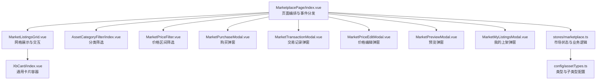
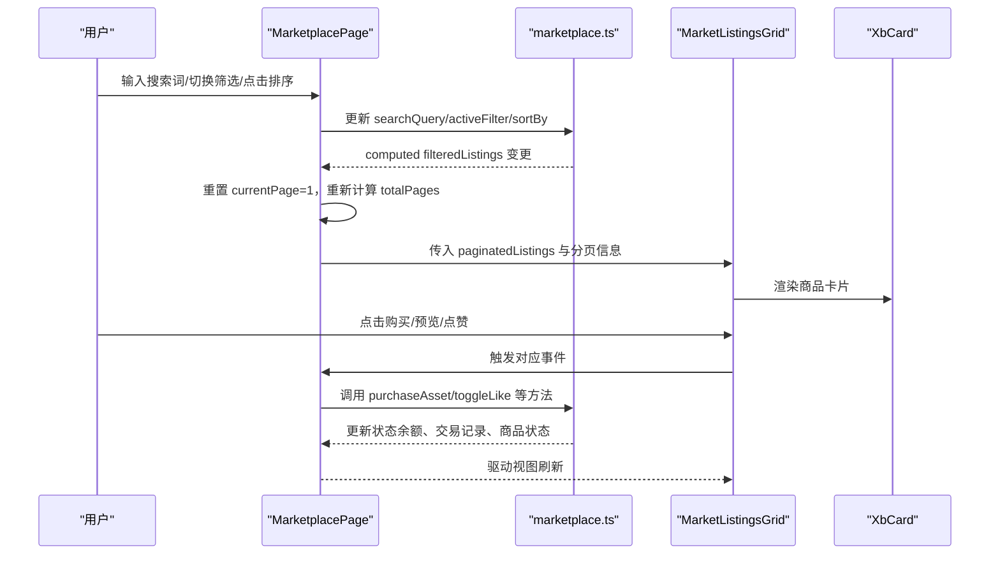
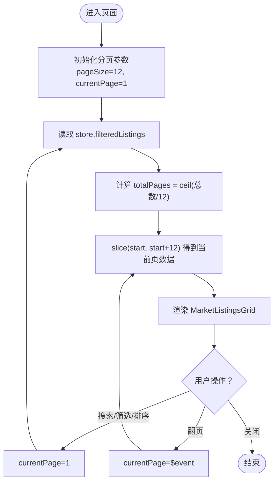
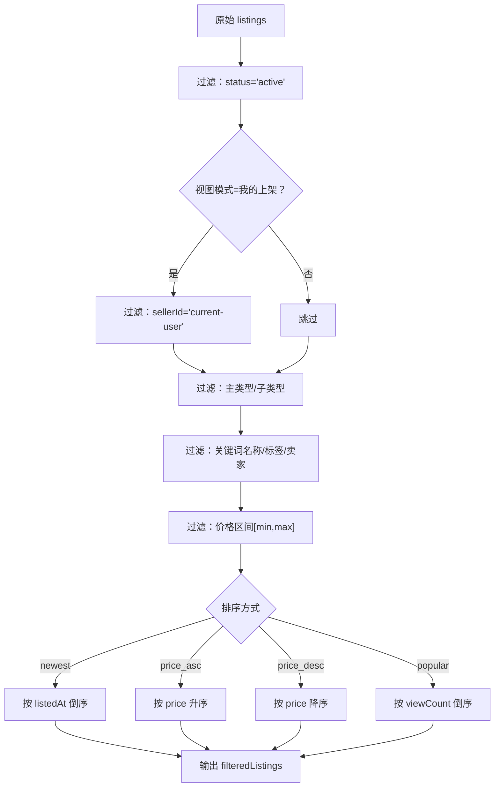
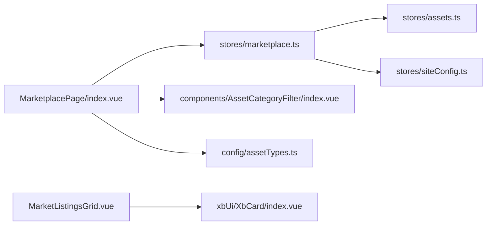

# 商品列表网格

<cite>
**本文引用的文件**
- [frontend/src/views/MarketplacePage/index.vue](file://frontend/src/views/MarketplacePage/index.vue)
- [frontend/src/stores/marketplace.ts](file://frontend/src/stores/marketplace.ts)
- [frontend/src/components/AssetCategoryFilter/index.vue](file://frontend/src/components/AssetCategoryFilter/index.vue)
- [frontend/src/config/assetTypes.ts](file://frontend/src/config/assetTypes.ts)
- [frontend/src/xbUi/XbCard/index.vue](file://frontend/src/xbUi/XbCard/index.vue)
</cite>

## 目录
1. [简介](#简介)
2. [项目结构](#项目结构)
3. [核心组件与状态](#核心组件与状态)
4. [架构总览](#架构总览)
5. [详细组件分析](#详细组件分析)
6. [依赖关系分析](#依赖关系分析)
7. [性能考虑](#性能考虑)
8. [故障排查指南](#故障排查指南)
9. [结论](#结论)
10. [附录](#附录)

## 简介
本文件围绕“商品列表网格”功能，系统化梳理商品卡片渲染、分页加载、搜索筛选与排序的实现逻辑，并给出网格布局算法、虚拟滚动优化与性能调优策略。同时补充搜索关键词高亮、排序切换动画以及空状态处理机制的设计建议与落地方案。文档面向不同技术背景的读者，提供从高层到代码级的渐进式说明。

## 项目结构
市场页面由一个主视图负责编排：左侧为分类与价格筛选面板，右侧为商品网格与分页控件；弹窗用于购买、交易记录、价格编辑、预览与我的上架等场景。数据层通过 Pinia Store 集中管理商品列表、筛选条件、排序方式与用户钱包等信息。

图表来源
- [frontend/src/views/MarketplacePage/index.vue:1-196](file://frontend/src/views/MarketplacePage/index.vue#L1-L196)
- [frontend/src/stores/marketplace.ts:1-334](file://frontend/src/stores/marketplace.ts#L1-L334)
- [frontend/src/components/AssetCategoryFilter/index.vue](file://frontend/src/components/AssetCategoryFilter/index.vue)
- [frontend/src/config/assetTypes.ts](file://frontend/src/config/assetTypes.ts)
- [frontend/src/xbUi/XbCard/index.vue:1-48](file://frontend/src/xbUi/XbCard/index.vue#L1-L48)

章节来源
- [frontend/src/views/MarketplacePage/index.vue:1-196](file://frontend/src/views/MarketplacePage/index.vue#L1-L196)
- [frontend/src/stores/marketplace.ts:1-334](file://frontend/src/stores/marketplace.ts#L1-L334)

## 核心组件与状态
- 页面编排（MarketplacePage）
  - 维护分页参数（当前页、每页条数、总页数），对过滤后的结果进行切片。
  - 监听筛选、搜索、排序变化，自动重置到第一页。
  - 组装类型筛选项（含子类型），将筛选与排序状态同步至 Store。
  - 控制各类弹窗的显隐与交互回调。
- 市场状态（marketplace.ts）
  - 维护商品列表、交易记录、钱包余额等响应式数据。
  - 计算属性 filteredListings 实现多条件过滤与排序。
  - 提供上架、下架、批量上架、购买、改价、点赞等业务方法。
- 分类筛选（AssetCategoryFilter）
  - 接收分类树与当前选中项，触发选择回调。
- 类型配置（assetTypes.ts）
  - 提供 getSubTypes 等方法，动态生成子类型选项。
- 卡片容器（XbCard）
  - 提供可悬停、边框、内边距、阴影等样式开关，作为商品卡片的通用外壳。

章节来源
- [frontend/src/views/MarketplacePage/index.vue:17-62](file://frontend/src/views/MarketplacePage/index.vue#L17-L62)
- [frontend/src/stores/marketplace.ts:145-195](file://frontend/src/stores/marketplace.ts#L145-L195)
- [frontend/src/components/AssetCategoryFilter/index.vue](file://frontend/src/components/AssetCategoryFilter/index.vue)
- [frontend/src/config/assetTypes.ts](file://frontend/src/config/assetTypes.ts)
- [frontend/src/xbUi/XbCard/index.vue:1-48](file://frontend/src/xbUi/XbCard/index.vue#L1-L48)

## 架构总览
整体采用“页面编排 + 状态集中 + 组件化”的分层模式：
- 视图层：MarketplacePage 负责组合 UI 组件、派发事件、维护本地分页与弹窗状态。
- 状态层：marketplace.ts 集中管理数据与业务逻辑，提供 computed 过滤与排序结果。
- 组件层：MarketListingsGrid 负责网格渲染与交互；XbCard 提供统一卡片样式。

图表来源
- [frontend/src/views/MarketplacePage/index.vue:17-62](file://frontend/src/views/MarketplacePage/index.vue#L17-L62)
- [frontend/src/stores/marketplace.ts:145-195](file://frontend/src/stores/marketplace.ts#L145-L195)
- [frontend/src/xbUi/XbCard/index.vue:1-48](file://frontend/src/xbUi/XbCard/index.vue#L1-L48)

## 详细组件分析

### 商品网格与分页（MarketplacePage）
- 分页逻辑
  - 固定 pageSize=12，根据 filteredListings 长度计算 totalPages。
  - 使用 slice 截取当前页数据，避免全量渲染。
- 筛选与排序联动
  - 监听 activeFilter、searchQuery、sortBy 变化，统一重置到第 1 页，确保筛选后首屏稳定。
- 类型筛选
  - 基于 assetTypes.ts 的子类型配置，构建 typeFilters 数组，支持多级选择。
- 搜索
  - 双向绑定 searchInput，提交时写入 store.searchQuery，触发 computed 过滤。
- 弹窗协作
  - 购买、交易记录、价格编辑、预览、我的上架等弹窗由页面统一管理可见性与上下文数据。

图表来源
- [frontend/src/views/MarketplacePage/index.vue:17-29](file://frontend/src/views/MarketplacePage/index.vue#L17-L29)
- [frontend/src/views/MarketplacePage/index.vue:21-24](file://frontend/src/views/MarketplacePage/index.vue#L21-L24)

章节来源
- [frontend/src/views/MarketplacePage/index.vue:17-62](file://frontend/src/views/MarketplacePage/index.vue#L17-L62)

### 过滤与排序（marketplace.ts）
- 过滤维度
  - 状态过滤：仅显示在售商品。
  - 视图模式：全部商品 / 我的上架。
  - 主类型与子类型：按 asset.type 与 asset.subType 过滤。
  - 关键词搜索：匹配名称、标签、卖家昵称（不区分大小写）。
  - 价格区间：最小值与最大值边界校验。
- 排序规则
  - 最新上架：按 listedAt 倒序。
  - 价格升序/降序：按 price 数值比较。
  - 最受欢迎：按 viewCount 倒序。
- 计算属性
  - filteredListings 综合上述条件，返回最终排序后的列表。

图表来源
- [frontend/src/stores/marketplace.ts:145-195](file://frontend/src/stores/marketplace.ts#L145-L195)

章节来源
- [frontend/src/stores/marketplace.ts:145-195](file://frontend/src/stores/marketplace.ts#L145-L195)

### 分类筛选（AssetCategoryFilter）
- 作用
  - 展示主类型与子类型树，支持单选或级联选择。
  - 向父组件 emit select(type, subType)，由 MarketplacePage 同步到 store.activeFilter 与 store.activeSubFilter。
- 数据来源
  - 通过 config/assetTypes.ts 的 getSubTypes 获取子类型列表，保证类型定义与 UI 一致。

章节来源
- [frontend/src/views/MarketplacePage/index.vue:32-49](file://frontend/src/views/MarketplacePage/index.vue#L32-L49)
- [frontend/src/config/assetTypes.ts](file://frontend/src/config/assetTypes.ts)

### 卡片容器（XbCard）
- 能力
  - 提供 hoverable、bordered、padding、shadow 等布尔属性，组合出统一的卡片外观。
  - 插槽 cover/header/body/footer 便于灵活扩展内容。
- 在商品卡片中的角色
  - 作为商品图片、标题、价格、操作按钮等的承载容器，配合网格布局形成一致的视觉风格。

章节来源
- [frontend/src/xbUi/XbCard/index.vue:1-48](file://frontend/src/xbUi/XbCard/index.vue#L1-L48)

## 依赖关系分析
- 页面依赖 Store 提供的过滤与排序结果，并通过 watch 保持分页一致性。
- 页面依赖 AssetCategoryFilter 完成分类选择，依赖 assetTypes.ts 的类型定义。
- 网格组件依赖 XbCard 作为基础卡片容器。
- Store 内部依赖 assets.ts 与 siteConfig.ts 以完成资产与钱包相关操作。

图表来源
- [frontend/src/views/MarketplacePage/index.vue:1-196](file://frontend/src/views/MarketplacePage/index.vue#L1-L196)
- [frontend/src/stores/marketplace.ts:1-334](file://frontend/src/stores/marketplace.ts#L1-L334)
- [frontend/src/xbUi/XbCard/index.vue:1-48](file://frontend/src/xbUi/XbCard/index.vue#L1-L48)

章节来源
- [frontend/src/views/MarketplacePage/index.vue:1-196](file://frontend/src/views/MarketplacePage/index.vue#L1-L196)
- [frontend/src/stores/marketplace.ts:1-334](file://frontend/src/stores/marketplace.ts#L1-L334)

## 性能考虑
- 前端分页
  - 使用 slice 仅渲染当前页数据，降低 DOM 节点数量，提升首屏与滚动性能。
- 计算属性缓存
  - filteredListings 基于响应式依赖自动缓存，仅在筛选/搜索/排序变化时重算。
- 防抖与节流
  - 建议在搜索输入处增加防抖，减少频繁过滤带来的计算开销。
- 图片与媒体
  - 使用缩略图与懒加载，避免一次性加载大图导致卡顿。
- 网格布局算法
  - 推荐 CSS Grid 自适应列数，结合 minmax 与 auto-fill/auto-fit 实现响应式网格。
- 虚拟滚动优化
  - 当单页数据量较大时，可在网格容器内引入虚拟滚动（如 vue-virtual-scroller），仅渲染可视区域条目，显著降低内存占用与重排成本。
- 排序切换动画
  - 使用过渡类名与 transform 做入场/位移动画，避免直接修改布局属性引发回流。
- 空状态处理
  - 当 filteredListings 为空时，展示友好的空状态提示与引导操作（如清空筛选、返回首页）。

[本节为通用性能建议，无需源码引用]

## 故障排查指南
- 筛选后未回到第一页
  - 检查是否对所有影响结果的字段（activeFilter、searchQuery、sortBy）都设置了 watch 重置 currentPage。
- 搜索结果不准确
  - 确认关键词匹配字段（名称、标签、卖家）是否正确且大小写处理一致。
- 价格区间无效
  - 检查最小/最大值的边界校验逻辑，确保不会传入负数或超出范围的值。
- 排序异常
  - 核对排序分支与字段类型（字符串日期需 localeCompare，数字需数值比较）。
- 购买失败
  - 检查余额是否充足、是否为本人商品、状态是否为在售。
- 空状态未显示
  - 在网格组件中判断列表长度为 0 时渲染空状态占位。

章节来源
- [frontend/src/views/MarketplacePage/index.vue:27-29](file://frontend/src/views/MarketplacePage/index.vue#L27-L29)
- [frontend/src/stores/marketplace.ts:145-195](file://frontend/src/stores/marketplace.ts#L145-L195)

## 结论
该商品列表网格通过“页面编排 + 集中状态 + 组件化”的方式实现了完整的筛选、排序、分页与交互闭环。当前实现已具备良好可扩展性，后续可在搜索防抖、虚拟滚动、排序动画与空状态等方面进一步优化体验与性能。

## 附录
- 关键路径参考
  - 分页与事件编排：[frontend/src/views/MarketplacePage/index.vue:17-62](file://frontend/src/views/MarketplacePage/index.vue#L17-L62)
  - 过滤与排序逻辑：[frontend/src/stores/marketplace.ts:145-195](file://frontend/src/stores/marketplace.ts#L145-L195)
  - 分类筛选与类型配置：[frontend/src/views/MarketplacePage/index.vue:32-49](file://frontend/src/views/MarketplacePage/index.vue#L32-L49)、[frontend/src/config/assetTypes.ts](file://frontend/src/config/assetTypes.ts)
  - 卡片容器样式：[frontend/src/xbUi/XbCard/index.vue:1-48](file://frontend/src/xbUi/XbCard/index.vue#L1-L48)