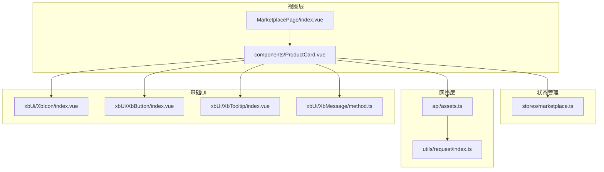
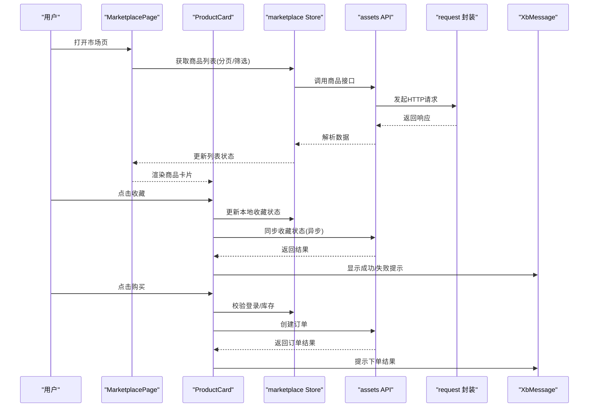
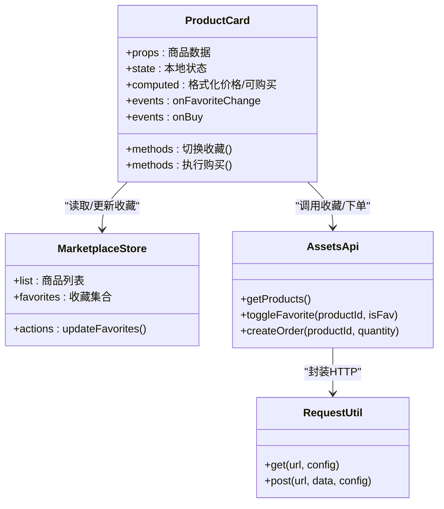
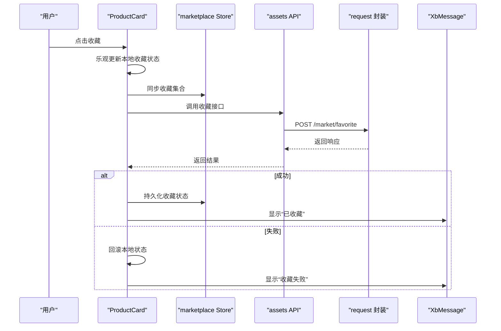
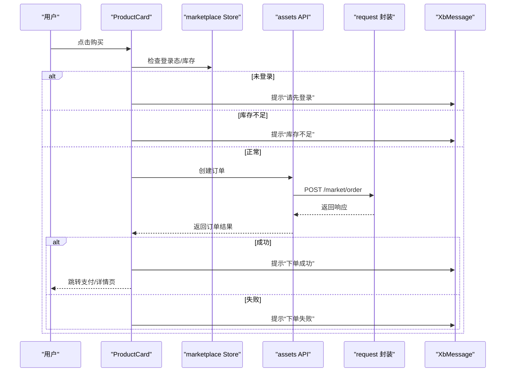
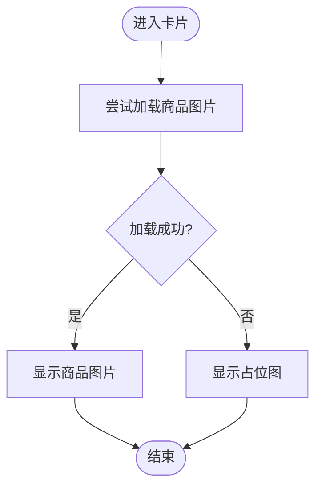
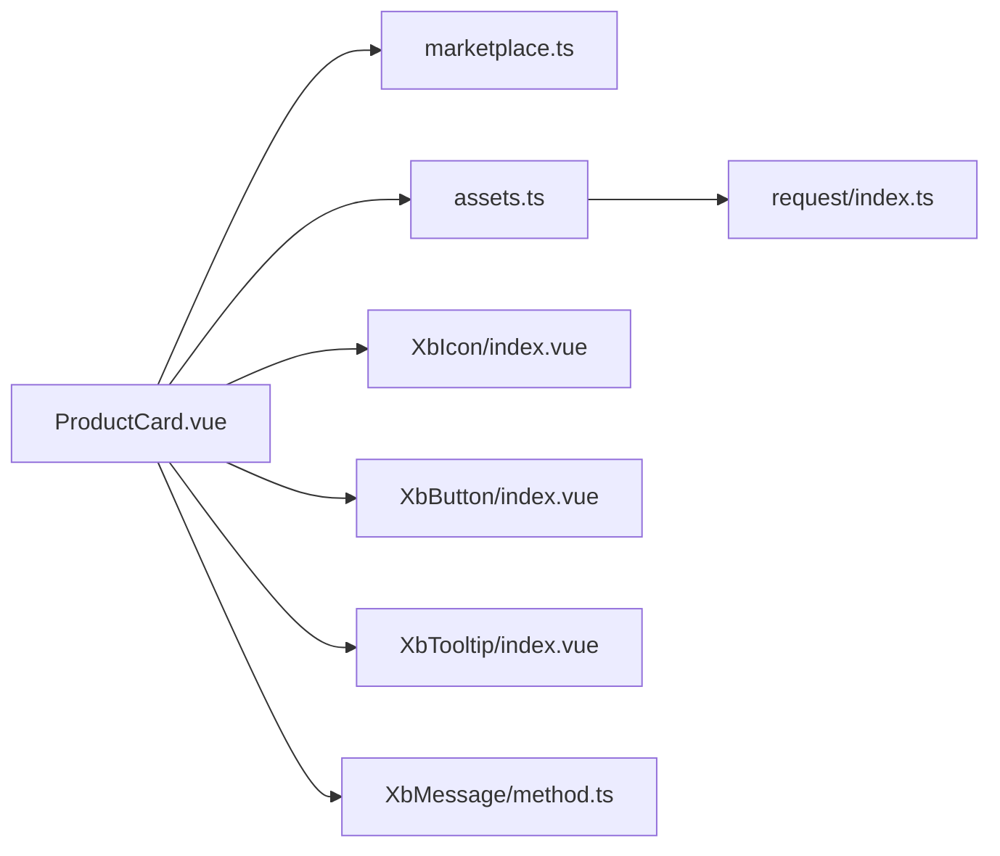

# 商品卡片组件

<cite>
**本文引用的文件**   
- [frontend/src/views/MarketplacePage/index.vue](file://frontend/src/views/MarketplacePage/index.vue)
- [frontend/src/views/MarketplacePage/components/ProductCard.vue](file://frontend/src/views/MarketplacePage/components/ProductCard.vue)
- [frontend/src/stores/marketplace.ts](file://frontend/src/stores/marketplace.ts)
- [frontend/src/api/assets.ts](file://frontend/src/api/assets.ts)
- [frontend/src/utils/request/index.ts](file://frontend/src/utils/request/index.ts)
- [frontend/src/xbUi/XbIcon/index.vue](file://frontend/src/xbUi/XbIcon/index.vue)
- [frontend/src/xbUi/XbButton/index.vue](file://frontend/src/xbUi/XbButton/index.vue)
- [frontend/src/xbUi/XbTooltip/index.vue](file://frontend/src/xbUi/XbTooltip/index.vue)
- [frontend/src/xbUi/XbMessage/method.ts](file://frontend/src/xbUi/XbMessage/method.ts)
</cite>

## 目录
1. [简介](#简介)
2. [项目结构](#项目结构)
3. [核心组件](#核心组件)
4. [架构总览](#架构总览)
5. [详细组件分析](#详细组件分析)
6. [依赖分析](#依赖分析)
7. [性能考虑](#性能考虑)
8. [故障排查指南](#故障排查指南)
9. [结论](#结论)
10. [附录](#附录)

## 简介
本文件围绕“商品卡片组件”进行系统化文档化，覆盖视觉设计、数据绑定与交互逻辑。重点说明：
- 商品图片展示（含占位与加载态）
- 价格显示（单位与格式化）
- 收藏状态切换（本地状态与后端同步）
- 购买操作（下单流程与反馈）
- 响应式布局适配、悬停效果与点击反馈动画
- 组件属性配置、事件处理与样式自定义示例

## 项目结构
该功能位于前端工程中的市场页面模块，核心由视图层、状态管理、API 请求与基础 UI 组件构成。

图表来源
- [frontend/src/views/MarketplacePage/index.vue](file://frontend/src/views/MarketplacePage/index.vue)
- [frontend/src/views/MarketplacePage/components/ProductCard.vue](file://frontend/src/views/MarketplacePage/components/ProductCard.vue)
- [frontend/src/stores/marketplace.ts](file://frontend/src/stores/marketplace.ts)
- [frontend/src/api/assets.ts](file://frontend/src/api/assets.ts)
- [frontend/src/utils/request/index.ts](file://frontend/src/utils/request/index.ts)
- [frontend/src/xbUi/XbIcon/index.vue](file://frontend/src/xbUi/XbIcon/index.vue)
- [frontend/src/xbUi/XbButton/index.vue](file://frontend/src/xbUi/XbButton/index.vue)
- [frontend/src/xbUi/XbTooltip/index.vue](file://frontend/src/xbUi/XbTooltip/index.vue)
- [frontend/src/xbUi/XbMessage/method.ts](file://frontend/src/xbUi/XbMessage/method.ts)

章节来源
- [frontend/src/views/MarketplacePage/index.vue](file://frontend/src/views/MarketplacePage/index.vue)
- [frontend/src/views/MarketplacePage/components/ProductCard.vue](file://frontend/src/views/MarketplacePage/components/ProductCard.vue)
- [frontend/src/stores/marketplace.ts](file://frontend/src/stores/marketplace.ts)
- [frontend/src/api/assets.ts](file://frontend/src/api/assets.ts)
- [frontend/src/utils/request/index.ts](file://frontend/src/utils/request/index.ts)
- [frontend/src/xbUi/XbIcon/index.vue](file://frontend/src/xbUi/XbIcon/index.vue)
- [frontend/src/xbUi/XbButton/index.vue](file://frontend/src/xbUi/XbButton/index.vue)
- [frontend/src/xbUi/XbTooltip/index.vue](file://frontend/src/xbUi/XbTooltip/index.vue)
- [frontend/src/xbUi/XbMessage/method.ts](file://frontend/src/xbUi/XbMessage/method.ts)

## 核心组件
- 商品卡片组件（ProductCard）
  - 职责：渲染单个商品条目，包含图片、标题、价格、收藏按钮、购买按钮等；处理收藏与购买交互；对外暴露事件与可配置属性。
  - 关键能力：
    - 图片展示：支持主图、缩略图、占位图与加载失败回退
    - 价格显示：统一格式化与货币单位
    - 收藏状态：本地优先更新，异步同步至服务端
    - 购买操作：触发下单流程并给出成功/失败提示
    - 响应式与动效：网格自适应、悬停高亮、点击缩放/涟漪反馈
- 市场页容器（MarketplacePage）
  - 职责：拉取商品列表、分页、筛选；将数据映射为卡片数组；承载全局状态（如登录态、购物车等）。
- 状态管理（marketplace store）
  - 职责：集中管理商品列表、当前选中项、收藏集合、加载与错误状态。
- 基础 UI 组件
  - XbIcon：图标渲染（收藏心形、购物车等）
  - XbButton：通用按钮（购买、收藏等）
  - XbTooltip：工具提示（价格说明、库存提示等）
  - XbMessage：消息通知（成功/失败/警告）

章节来源
- [frontend/src/views/MarketplacePage/components/ProductCard.vue](file://frontend/src/views/MarketplacePage/components/ProductCard.vue)
- [frontend/src/views/MarketplacePage/index.vue](file://frontend/src/views/MarketplacePage/index.vue)
- [frontend/src/stores/marketplace.ts](file://frontend/src/stores/marketplace.ts)
- [frontend/src/xbUi/XbIcon/index.vue](file://frontend/src/xbUi/XbIcon/index.vue)
- [frontend/src/xbUi/XbButton/index.vue](file://frontend/src/xbUi/XbButton/index.vue)
- [frontend/src/xbUi/XbTooltip/index.vue](file://frontend/src/xbUi/XbTooltip/index.vue)
- [frontend/src/xbUi/XbMessage/method.ts](file://frontend/src/xbUi/XbMessage/method.ts)

## 架构总览
下图展示了从页面到卡片、再到状态与网络的调用链，以及基础 UI 的参与点。

图表来源
- [frontend/src/views/MarketplacePage/index.vue](file://frontend/src/views/MarketplacePage/index.vue)
- [frontend/src/views/MarketplacePage/components/ProductCard.vue](file://frontend/src/views/MarketplacePage/components/ProductCard.vue)
- [frontend/src/stores/marketplace.ts](file://frontend/src/stores/marketplace.ts)
- [frontend/src/api/assets.ts](file://frontend/src/api/assets.ts)
- [frontend/src/utils/request/index.ts](file://frontend/src/utils/request/index.ts)
- [frontend/src/xbUi/XbMessage/method.ts](file://frontend/src/xbUi/XbMessage/method.ts)

## 详细组件分析

### 商品卡片组件（ProductCard）
- 视觉设计
  - 图片区：固定比例容器，支持圆角、阴影与懒加载；加载失败时显示占位图。
  - 信息区：标题（最多两行省略）、价格（带单位与格式化）、标签（如热销、限时折扣）。
  - 操作区：收藏按钮（心形图标+状态色）、购买按钮（主色调+禁用态）。
  - 响应式：基于栅格或 Flex 布局，在小屏下自动调整列数与字号。
  - 动效：悬停提升阴影与轻微放大；点击收藏/购买有缩放或涟漪反馈。
- 数据绑定
  - 输入属性（props）：商品对象（id、title、price、currency、imageUrl、tags、stock 等）、是否已收藏、是否禁用购买等。
  - 内部状态：loading、hover、active、errorImage、localFavorite。
  - 计算值：格式化后的价格字符串、是否可购买（库存>0且未下架）。
- 交互逻辑
  - 收藏切换：先乐观更新本地状态，再调用后端接口；成功后持久化到 store，失败则回滚并提示。
  - 购买操作：校验登录态与库存，调用下单接口，成功后跳转支付或提示完成。
  - 图片加载：onload/onerror 处理，失败回退到默认占位图。
- 事件与回调
  - onFavoriteChange：收藏状态变化事件（供父级记录日志或统计）
  - onBuy：购买事件（父级可拦截二次确认或埋点）
- 样式自定义
  - 通过 CSS 变量或 Tailwind 类名覆盖颜色、圆角、间距、阴影等。
  - 提供插槽（slot）扩展图片上方标签、右下角角标等。

图表来源
- [frontend/src/views/MarketplacePage/components/ProductCard.vue](file://frontend/src/views/MarketplacePage/components/ProductCard.vue)
- [frontend/src/stores/marketplace.ts](file://frontend/src/stores/marketplace.ts)
- [frontend/src/api/assets.ts](file://frontend/src/api/assets.ts)
- [frontend/src/utils/request/index.ts](file://frontend/src/utils/request/index.ts)

章节来源
- [frontend/src/views/MarketplacePage/components/ProductCard.vue](file://frontend/src/views/MarketplacePage/components/ProductCard.vue)
- [frontend/src/stores/marketplace.ts](file://frontend/src/stores/marketplace.ts)
- [frontend/src/api/assets.ts](file://frontend/src/api/assets.ts)
- [frontend/src/utils/request/index.ts](file://frontend/src/utils/request/index.ts)

#### 收藏切换流程（序列图）

图表来源
- [frontend/src/views/MarketplacePage/components/ProductCard.vue](file://frontend/src/views/MarketplacePage/components/ProductCard.vue)
- [frontend/src/stores/marketplace.ts](file://frontend/src/stores/marketplace.ts)
- [frontend/src/api/assets.ts](file://frontend/src/api/assets.ts)
- [frontend/src/utils/request/index.ts](file://frontend/src/utils/request/index.ts)
- [frontend/src/xbUi/XbMessage/method.ts](file://frontend/src/xbUi/XbMessage/method.ts)

#### 购买操作流程（序列图）

图表来源
- [frontend/src/views/MarketplacePage/components/ProductCard.vue](file://frontend/src/views/MarketplacePage/components/ProductCard.vue)
- [frontend/src/stores/marketplace.ts](file://frontend/src/stores/marketplace.ts)
- [frontend/src/api/assets.ts](file://frontend/src/api/assets.ts)
- [frontend/src/utils/request/index.ts](file://frontend/src/utils/request/index.ts)
- [frontend/src/xbUi/XbMessage/method.ts](file://frontend/src/xbUi/XbMessage/method.ts)

#### 图片加载与回退（流程图）

图表来源
- [frontend/src/views/MarketplacePage/components/ProductCard.vue](file://frontend/src/views/MarketplacePage/components/ProductCard.vue)

### 市场页容器（MarketplacePage）
- 职责
  - 拉取商品列表（分页、排序、筛选）
  - 维护商品列表与分页状态
  - 将数据映射为卡片所需的数据结构
- 与卡片的关系
  - 以 v-for 渲染多个 ProductCard
  - 透传收藏状态与购买事件处理

章节来源
- [frontend/src/views/MarketplacePage/index.vue](file://frontend/src/views/MarketplacePage/index.vue)

### 状态管理（marketplace store）
- 状态字段
  - 商品列表、当前页码、筛选条件、收藏集合、加载与错误标志
- 动作方法
  - 获取商品列表、切换收藏、批量更新收藏状态
- 与组件的耦合
  - 组件通过 actions 修改状态，避免跨层级传递复杂状态

章节来源
- [frontend/src/stores/marketplace.ts](file://frontend/src/stores/marketplace.ts)

### 基础 UI 组件
- XbIcon：用于收藏心形、购物车、提示等图标
- XbButton：购买按钮、收藏按钮的统一样式与禁用态
- XbTooltip：对价格、库存、促销信息进行轻量提示
- XbMessage：全局消息通知（成功、失败、警告）

章节来源
- [frontend/src/xbUi/XbIcon/index.vue](file://frontend/src/xbUi/XbIcon/index.vue)
- [frontend/src/xbUi/XbButton/index.vue](file://frontend/src/xbUi/XbButton/index.vue)
- [frontend/src/xbUi/XbTooltip/index.vue](file://frontend/src/xbUi/XbTooltip/index.vue)
- [frontend/src/xbUi/XbMessage/method.ts](file://frontend/src/xbUi/XbMessage/method.ts)

## 依赖分析
- 组件内聚性
  - ProductCard 仅依赖 marketplace store 与 assets API，保持高内聚低耦合
- 外部依赖
  - request 封装统一处理鉴权、重试与错误拦截
  - 基础 UI 组件提供一致的交互与样式规范
- 潜在循环依赖
  - 组件不直接依赖页面容器，避免循环引用

图表来源
- [frontend/src/views/MarketplacePage/components/ProductCard.vue](file://frontend/src/views/MarketplacePage/components/ProductCard.vue)
- [frontend/src/stores/marketplace.ts](file://frontend/src/stores/marketplace.ts)
- [frontend/src/api/assets.ts](file://frontend/src/api/assets.ts)
- [frontend/src/utils/request/index.ts](file://frontend/src/utils/request/index.ts)
- [frontend/src/xbUi/XbIcon/index.vue](file://frontend/src/xbUi/XbIcon/index.vue)
- [frontend/src/xbUi/XbButton/index.vue](file://frontend/src/xbUi/XbButton/index.vue)
- [frontend/src/xbUi/XbTooltip/index.vue](file://frontend/src/xbUi/XbTooltip/index.vue)
- [frontend/src/xbUi/XbMessage/method.ts](file://frontend/src/xbUi/XbMessage/method.ts)

## 性能考虑
- 图片优化
  - 使用懒加载与缩略图，减少首屏带宽
  - 设置合理的宽高比与占位图，避免布局抖动
- 列表渲染
  - 虚拟滚动（大数据量场景）
  - 防抖/节流搜索与筛选
- 网络请求
  - 合并重复请求、缓存热门商品数据
  - 失败重试与超时控制
- 交互体验
  - 收藏与购买采用乐观更新，降低感知延迟
  - 按钮点击添加短暂禁用态，防止重复提交

[本节为通用指导，无需源码引用]

## 故障排查指南
- 图片无法加载
  - 检查图片 URL 是否有效、CDN 是否可达
  - 查看 onerror 分支是否正确切换到占位图
- 收藏状态不同步
  - 确认收藏接口返回码与数据结构
  - 检查网络拦截器是否抛错或吞掉响应
- 购买失败
  - 校验登录态与权限
  - 检查库存与价格变动导致的业务校验失败
- 消息提示异常
  - 确认消息容器已挂载
  - 检查消息类型与文案参数

章节来源
- [frontend/src/views/MarketplacePage/components/ProductCard.vue](file://frontend/src/views/MarketplacePage/components/ProductCard.vue)
- [frontend/src/api/assets.ts](file://frontend/src/api/assets.ts)
- [frontend/src/utils/request/index.ts](file://frontend/src/utils/request/index.ts)
- [frontend/src/xbUi/XbMessage/method.ts](file://frontend/src/xbUi/XbMessage/method.ts)

## 结论
商品卡片组件在视觉上清晰直观，在交互上具备完善的收藏与购买流程，并通过状态管理与网络层解耦实现良好的可维护性与可扩展性。配合响应式与动效策略，可在多端设备上提供一致的用户体验。建议在生产环境引入图片懒加载、请求缓存与乐观更新策略，进一步提升性能与可用性。

[本节为总结，无需源码引用]

## 附录

### 组件属性配置（示例）
- 商品数据模型（字段建议）
  - id: string | number
  - title: string
  - price: number
  - currency: string
  - imageUrl: string
  - tags: string[]
  - stock: number
  - status: enum（上架/下架）
- 组件 props
  - product: 商品数据对象
  - favorite: boolean（是否已收藏）
  - disabled: boolean（是否禁用购买）
- 事件
  - onFavoriteChange(isFav): void
  - onBuy(): void

章节来源
- [frontend/src/views/MarketplacePage/components/ProductCard.vue](file://frontend/src/views/MarketplacePage/components/ProductCard.vue)

### 样式自定义（示例）
- 通过 CSS 变量覆盖主题色、圆角、阴影
- 使用 Tailwind 类名快速定制间距与尺寸
- 通过插槽扩展图片角标与标签区域

章节来源
- [frontend/src/views/MarketplacePage/components/ProductCard.vue](file://frontend/src/views/MarketplacePage/components/ProductCard.vue)