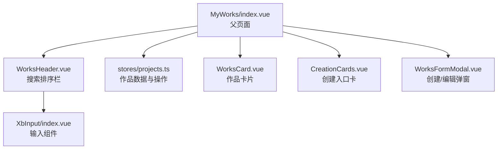
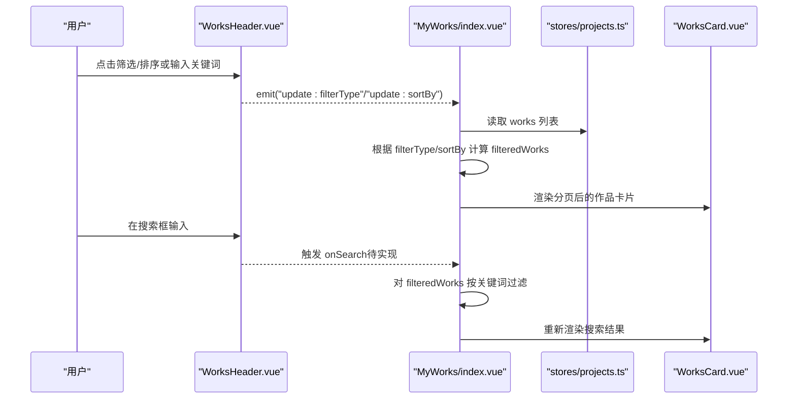
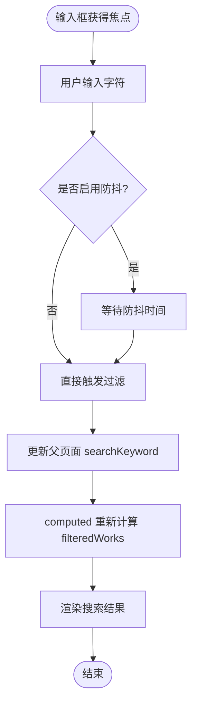
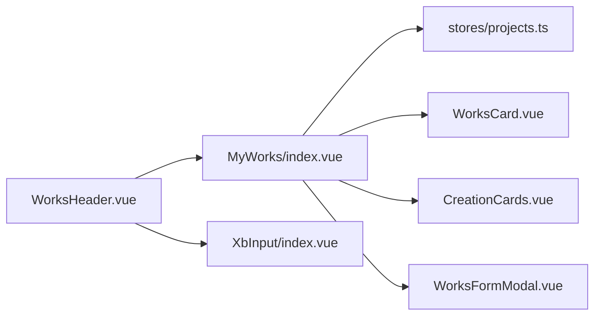

# 搜索排序栏

<cite>
**本文引用的文件**
- [frontend/src/views/MyWorks/index.vue](file://frontend/src/views/MyWorks/index.vue)
- [frontend/src/views/MyWorks/components/WorksHeader.vue](file://frontend/src/views/MyWorks/components/WorksHeader.vue)
- [frontend/src/views/MyWorks/components/WorksCard.vue](file://frontend/src/views/MyWorks/components/WorksCard.vue)
- [frontend/src/views/MyWorks/components/CreationCards.vue](file://frontend/src/views/MyWorks/components/CreationCards.vue)
- [frontend/src/views/MyWorks/components/WorksFormModal.vue](file://frontend/src/views/MyWorks/components/WorksFormModal.vue)
- [frontend/src/stores/projects.ts](file://frontend/src/stores/projects.ts)
- [frontend/src/components/AiScriptModal/index.vue](file://frontend/src/components/AiScriptModal/index.vue)
- [frontend/src/components/AssetPickerModal/index.vue](file://frontend/src/components/AssetPickerModal/index.vue)
- [frontend/src/layouts/components/TopBar/LoginModal/LoginView.vue](file://frontend/src/layouts/components/TopBar/LoginModal/LoginView.vue)
- [frontend/src/layouts/components/TopBar/LoginModal/EmailView.vue](file://frontend/src/layouts/components/TopBar/LoginModal/EmailView.vue)
- [frontend/src/layouts/components/TopBar/LoginModal/SmsView.vue](file://frontend/src/layouts/components/TopBar/LoginModal/SmsView.vue)
- [frontend/src/layouts/components/TopBar/LoginModal/ForgotView.vue](file://frontend/src/layouts/components/TopBar/LoginModal/ForgotView.vue)
- [frontend/src/xbUi/XbInput/index.vue](file://frontend/src/xbUi/XbInput/index.vue)
- [frontend/src/xbUi/XbSelect/index.vue](file://frontend/src/xbUi/XbSelect/index.vue)
</cite>

## 目录
1. [简介](#简介)
2. [项目结构](#项目结构)
3. [核心组件](#核心组件)
4. [架构总览](#架构总览)
5. [详细组件分析](#详细组件分析)
6. [依赖关系分析](#依赖关系分析)
7. [性能与体验优化](#性能与体验优化)
8. [故障排查指南](#故障排查指南)
9. [结论](#结论)
10. [附录：API 与使用示例](#附录api-与使用示例)

## 简介
本文件围绕“搜索排序栏”进行系统化文档化，聚焦以下目标：
- 深入讲解搜索输入框的实现逻辑、实时搜索能力与键盘事件处理。
- 详细说明排序下拉菜单的数据绑定、选项配置与变更监听机制。
- 提供关键词高亮显示、防抖优化与用户体验改进策略。
- 给出完整的 API 接口说明与使用示例，便于快速集成与扩展。

## 项目结构
搜索排序栏位于“我的作品”页面头部区域，由父页面与子组件协作完成：
- 父页面负责状态管理（筛选类型、排序方式、分页等）与数据源（store）。
- WorksHeader 组件承载筛选按钮、排序下拉与搜索输入框的交互。
- XbInput 为通用输入组件，提供双向绑定、键盘事件与基础样式。
- 其他页面中的输入组件可作为参考，展示统一的键盘事件与 v-model 用法。



图表来源
- [frontend/src/views/MyWorks/index.vue:1-184](file://frontend/src/views/MyWorks/index.vue#L1-L184)
- [frontend/src/views/MyWorks/components/WorksHeader.vue:1-84](file://frontend/src/views/MyWorks/components/WorksHeader.vue#L1-L84)
- [frontend/src/xbUi/XbInput/index.vue:1-177](file://frontend/src/xbUi/XbInput/index.vue#L1-L177)
- [frontend/src/stores/projects.ts](file://frontend/src/stores/projects.ts)

章节来源
- [frontend/src/views/MyWorks/index.vue:1-184](file://frontend/src/views/MyWorks/index.vue#L1-L184)
- [frontend/src/views/MyWorks/components/WorksHeader.vue:1-84](file://frontend/src/views/MyWorks/components/WorksHeader.vue#L1-L84)

## 核心组件
- 搜索排序栏（WorksHeader）
  - 功能：展示总数、筛选按钮组、排序下拉菜单、搜索输入框。
  - 数据绑定：通过 v-model:filter-type 与 v-model:sort-by 与父页面双向绑定。
  - 事件：emit('update:filterType', value)、emit('update:sortBy', value)。
- 输入组件（XbInput）
  - 功能：统一输入样式、支持密码可见切换、清除、错误提示、尺寸控制。
  - 事件：'update:modelValue'、'keydown'、'focus'、'blur'、'input'、'clear'。
- 选择组件（XbSelect）
  - 功能：下拉选择、向上/向下展开自适应、多实例互斥关闭、滚动定位选中项。
  - 事件：'update:modelValue'、'change'、'clear'。

章节来源
- [frontend/src/views/MyWorks/components/WorksHeader.vue:1-84](file://frontend/src/views/MyWorks/components/WorksHeader.vue#L1-L84)
- [frontend/src/xbUi/XbInput/index.vue:1-177](file://frontend/src/xbUi/XbInput/index.vue#L1-L177)
- [frontend/src/xbUi/XbSelect/index.vue:1-271](file://frontend/src/xbUi/XbSelect/index.vue#L1-L271)

## 架构总览
搜索排序栏在“我的作品”页面中作为工具条存在，负责收集用户的筛选与排序意图，并通过 v-model 将状态同步回父页面；父页面基于 store 提供的数据计算过滤结果并渲染列表。



图表来源
- [frontend/src/views/MyWorks/index.vue:1-184](file://frontend/src/views/MyWorks/index.vue#L1-L184)
- [frontend/src/views/MyWorks/components/WorksHeader.vue:1-84](file://frontend/src/views/MyWorks/components/WorksHeader.vue#L1-L84)
- [frontend/src/stores/projects.ts](file://frontend/src/stores/projects.ts)

## 详细组件分析

### 搜索输入框实现与键盘事件
- 当前状态
  - WorksHeader 中存在一个原生 input 元素用于搜索，但尚未绑定到父页面的搜索状态，也未实现实时过滤。
- 建议实现方案
  - 在父页面增加 searchKeyword 响应式变量。
  - 在 WorksHeader 中引入 XbInput，使用 v-model 双向绑定，并在 @input 或 @keyup 中调用父页面传入的回调以更新 searchKeyword。
  - 在父页面的 computed 中，将 searchKeyword 应用于 filteredWorks 的二次过滤。
- 键盘事件处理
  - 可监听 Enter 键执行“立即搜索”，Esc 键清空输入。
  - 参考项目中其他输入组件的键盘事件用法，确保一致的交互体验。



章节来源
- [frontend/src/views/MyWorks/components/WorksHeader.vue:1-84](file://frontend/src/views/MyWorks/components/WorksHeader.vue#L1-L84)
- [frontend/src/views/MyWorks/index.vue:1-184](file://frontend/src/views/MyWorks/index.vue#L1-L184)
- [frontend/src/xbUi/XbInput/index.vue:1-177](file://frontend/src/xbUi/XbInput/index.vue#L1-L177)
- [frontend/src/layouts/components/TopBar/LoginModal/LoginView.vue:111-131](file://frontend/src/layouts/components/TopBar/LoginModal/LoginView.vue#L111-L131)
- [frontend/src/layouts/components/TopBar/LoginModal/EmailView.vue:111-146](file://frontend/src/layouts/components/TopBar/LoginModal/EmailView.vue#L111-L146)
- [frontend/src/layouts/components/TopBar/LoginModal/SmsView.vue:111-155](file://frontend/src/layouts/components/TopBar/LoginModal/SmsView.vue#L111-L155)
- [frontend/src/layouts/components/TopBar/LoginModal/ForgotView.vue:120-162](file://frontend/src/layouts/components/TopBar/LoginModal/ForgotView.vue#L120-L162)

### 排序下拉菜单的数据绑定与变更监听
- 数据模型
  - sortOptions：包含 { value, label } 的数组，value 对应 sortBy 的状态值。
- 数据绑定
  - 通过 v-model:sort-by 与父页面 sortBy 双向绑定。
- 变更监听
  - 点击选项时 emit('update:sortBy', opt.value)，同时关闭下拉菜单。
- 交互细节
  - 当前按钮文案动态取自 sortOptions 中匹配项的 label。
  - 下拉菜单使用相对定位与 z-index 保证层级正确。

```mermaid
classDiagram
class WorksHeader {
+props total : number
+props filterType : string
+props sortBy : string
+emits update : filterType
+emits update : sortBy
+data showSortMenu : boolean
+data sortOptions : Array
+data filterOptions : Array
}
class MyWorksIndex {
+data filterType : string
+data sortBy : string
+computed filteredWorks()
}
WorksHeader --|> MyWorksIndex : "v-model : sort-by / v-model : filter-type"
```

图表来源
- [frontend/src/views/MyWorks/components/WorksHeader.vue:1-84](file://frontend/src/views/MyWorks/components/WorksHeader.vue#L1-L84)
- [frontend/src/views/MyWorks/index.vue:1-184](file://frontend/src/views/MyWorks/index.vue#L1-L184)

章节来源
- [frontend/src/views/MyWorks/components/WorksHeader.vue:1-84](file://frontend/src/views/MyWorks/components/WorksHeader.vue#L1-L84)
- [frontend/src/views/MyWorks/index.vue:1-184](file://frontend/src/views/MyWorks/index.vue#L1-L184)

### 关键词高亮显示策略
- 前端高亮
  - 在渲染列表项时，将匹配到的关键词片段用 <mark> 或自定义样式包裹，突出显示。
  - 注意转义与正则安全，避免 XSS 风险。
- 后端高亮
  - 若采用服务端搜索，可在返回数据中包含高亮片段字段，前端直接渲染。
- 性能考虑
  - 大数据量下建议使用虚拟滚动或分页加载，减少 DOM 节点数量。

[本节为概念性内容，不直接分析具体文件]

### 防抖优化与用户体验改进
- 防抖
  - 在输入事件中使用防抖函数，避免每次按键都触发过滤或网络请求。
  - 推荐延迟 200~300ms，兼顾即时性与性能。
- 空态与反馈
  - 无结果时展示友好空态提示。
  - 加载中显示骨架屏或加载指示器。
- 键盘导航
  - 支持 Enter 确认搜索、Esc 清空、方向键在结果列表中导航（可选）。
- 移动端适配
  - 在小屏设备上调整输入框宽度与布局，必要时折叠筛选/排序按钮为抽屉或弹出面板。

[本节为概念性内容，不直接分析具体文件]

## 依赖关系分析
- 组件耦合
  - WorksHeader 与 MyWorks/index.vue 通过 props/emits 解耦，职责清晰。
  - XbInput 作为通用输入组件被多处复用，降低重复代码。
- 外部依赖
  - 数据来源于 stores/projects.ts，所有增删改查均通过 store 方法完成。
- 潜在循环依赖
  - 当前结构未见循环引用，组件间单向依赖。



图表来源
- [frontend/src/views/MyWorks/components/WorksHeader.vue:1-84](file://frontend/src/views/MyWorks/components/WorksHeader.vue#L1-L84)
- [frontend/src/views/MyWorks/index.vue:1-184](file://frontend/src/views/MyWorks/index.vue#L1-L184)
- [frontend/src/stores/projects.ts](file://frontend/src/stores/projects.ts)
- [frontend/src/xbUi/XbInput/index.vue:1-177](file://frontend/src/xbUi/XbInput/index.vue#L1-L177)
- [frontend/src/views/MyWorks/components/WorksCard.vue](file://frontend/src/views/MyWorks/components/WorksCard.vue)
- [frontend/src/views/MyWorks/components/CreationCards.vue](file://frontend/src/views/MyWorks/components/CreationCards.vue)
- [frontend/src/views/MyWorks/components/WorksFormModal.vue](file://frontend/src/views/MyWorks/components/WorksFormModal.vue)

章节来源
- [frontend/src/views/MyWorks/index.vue:1-184](file://frontend/src/views/MyWorks/index.vue#L1-L184)
- [frontend/src/views/MyWorks/components/WorksHeader.vue:1-84](file://frontend/src/views/MyWorks/components/WorksHeader.vue#L1-L84)
- [frontend/src/stores/projects.ts](file://frontend/src/stores/projects.ts)

## 性能与体验优化
- 输入防抖：避免频繁触发过滤或网络请求。
- 计算缓存：使用 computed 缓存过滤结果，仅在依赖变化时重算。
- 分页与虚拟列表：大数据集下优先分页，必要时引入虚拟滚动。
- 懒加载与图片优化：封面图按需加载与压缩。
- 无障碍与可访问性：为输入框与下拉菜单添加 aria-* 属性，提升键盘可达性。

[本节为通用指导，不直接分析具体文件]

## 故障排查指南
- 搜索无效
  - 检查 WorksHeader 是否已绑定输入值与父页面回调。
  - 确认父页面 computed 是否正确应用 searchKeyword 过滤。
- 排序不生效
  - 检查 v-model:sort-by 绑定与 emit('update:sortBy') 是否一致。
  - 确认父页面 sortBy 变化后是否触发重新计算与渲染。
- 键盘事件未触发
  - 确认是否在输入组件上正确监听 keydown/keyup 事件。
  - 参考项目中其他输入组件的键盘事件用法进行对比。

章节来源
- [frontend/src/views/MyWorks/components/WorksHeader.vue:1-84](file://frontend/src/views/MyWorks/components/WorksHeader.vue#L1-L84)
- [frontend/src/views/MyWorks/index.vue:1-184](file://frontend/src/views/MyWorks/index.vue#L1-L184)
- [frontend/src/xbUi/XbInput/index.vue:1-177](file://frontend/src/xbUi/XbInput/index.vue#L1-L177)
- [frontend/src/layouts/components/TopBar/LoginModal/LoginView.vue:111-131](file://frontend/src/layouts/components/TopBar/LoginModal/LoginView.vue#L111-L131)
- [frontend/src/layouts/components/TopBar/LoginModal/EmailView.vue:111-146](file://frontend/src/layouts/components/TopBar/LoginModal/EmailView.vue#L111-L146)
- [frontend/src/layouts/components/TopBar/LoginModal/SmsView.vue:111-155](file://frontend/src/layouts/components/TopBar/LoginModal/SmsView.vue#L111-L155)
- [frontend/src/layouts/components/TopBar/LoginModal/ForgotView.vue:120-162](file://frontend/src/layouts/components/TopBar/LoginModal/ForgotView.vue#L120-L162)

## 结论
通过将搜索输入框与排序下拉菜单整合到统一的搜索排序栏组件中，并以 v-model 与事件机制与父页面协同，可实现高效、可扩展的筛选与排序体验。结合关键词高亮、防抖优化与良好的键盘交互，能显著提升用户效率与满意度。

[本节为总结性内容，不直接分析具体文件]

## 附录：API 与使用示例

### 组件 Props 与 Emits（WorksHeader）
- Props
  - total: number — 当前过滤后的总数
  - filterType: 'all' | 'draft' | 'published' — 筛选类型
  - sortBy: 'update' | 'create' | 'hot' — 排序方式
- Emits
  - update:filterType(value: FilterType)
  - update:sortBy(value: SortType)
- 插槽
  - 默认插槽：可用于扩展头部右侧区域（如搜索输入框）

章节来源
- [frontend/src/views/MyWorks/components/WorksHeader.vue:1-84](file://frontend/src/views/MyWorks/components/WorksHeader.vue#L1-L84)

### 输入组件 API（XbInput）
- Props
  - modelValue?: string | number
  - type?: string
  - placeholder?: string
  - disabled?: boolean
  - readonly?: boolean
  - error?: string
  - label?: string
  - clearable?: boolean
  - maxlength?: number
  - tabindex?: number
  - size?: 'sm' | 'md' | 'lg'
  - showPasswordToggle?: boolean
- Emits
  - update:modelValue
  - focus
  - blur
  - input
  - clear
  - keydown

章节来源
- [frontend/src/xbUi/XbInput/index.vue:1-177](file://frontend/src/xbUi/XbInput/index.vue#L1-L177)

### 选择组件 API（XbSelect）
- Props
  - modelValue?: string | number
  - options?: SelectOption[]
  - placeholder?: string
  - disabled?: boolean
  - error?: string
  - label?: string
  - clearable?: boolean
  - size?: 'sm' | 'md' | 'lg'
- Emits
  - update:modelValue
  - change
  - clear

章节来源
- [frontend/src/xbUi/XbSelect/index.vue:1-271](file://frontend/src/xbUi/XbSelect/index.vue#L1-L271)

### 使用示例（父页面集成）
- 绑定筛选与排序
  - 使用 v-model:filter-type 与 v-model:sort-by 将 WorksHeader 的状态与父页面同步。
- 实现搜索
  - 在父页面维护 searchKeyword，并在 computed 中对 filteredWorks 进行二次过滤。
  - 在 WorksHeader 中引入 XbInput，绑定 @input 或 @keyup 回调以更新 searchKeyword。
- 键盘事件
  - 监听 Enter 执行搜索，Esc 清空输入，保持与其他输入组件一致的交互。

章节来源
- [frontend/src/views/MyWorks/index.vue:1-184](file://frontend/src/views/MyWorks/index.vue#L1-L184)
- [frontend/src/views/MyWorks/components/WorksHeader.vue:1-84](file://frontend/src/views/MyWorks/components/WorksHeader.vue#L1-L84)
- [frontend/src/xbUi/XbInput/index.vue:1-177](file://frontend/src/xbUi/XbInput/index.vue#L1-L177)

### 相关参考（其他页面输入组件）
- 登录视图中的输入组件展示了统一的 v-model 与 @keyup.enter 用法，可作为搜索排序栏键盘事件的参考。
- 资产选择器与脚本输入模态也使用了输入组件的双向绑定模式，有助于理解整体交互一致性。

章节来源
- [frontend/src/layouts/components/TopBar/LoginModal/LoginView.vue:111-131](file://frontend/src/layouts/components/TopBar/LoginModal/LoginView.vue#L111-L131)
- [frontend/src/layouts/components/TopBar/LoginModal/EmailView.vue:111-146](file://frontend/src/layouts/components/TopBar/LoginModal/EmailView.vue#L111-L146)
- [frontend/src/layouts/components/TopBar/LoginModal/SmsView.vue:111-155](file://frontend/src/layouts/components/TopBar/LoginModal/SmsView.vue#L111-L155)
- [frontend/src/layouts/components/TopBar/LoginModal/ForgotView.vue:120-162](file://frontend/src/layouts/components/TopBar/LoginModal/ForgotView.vue#L120-L162)
- [frontend/src/components/AiScriptModal/index.vue:163](file://frontend/src/components/AiScriptModal/index.vue#L163)
- [frontend/src/components/AssetPickerModal/index.vue:145](file://frontend/src/components/AssetPickerModal/index.vue#L145)