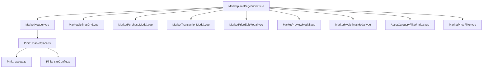
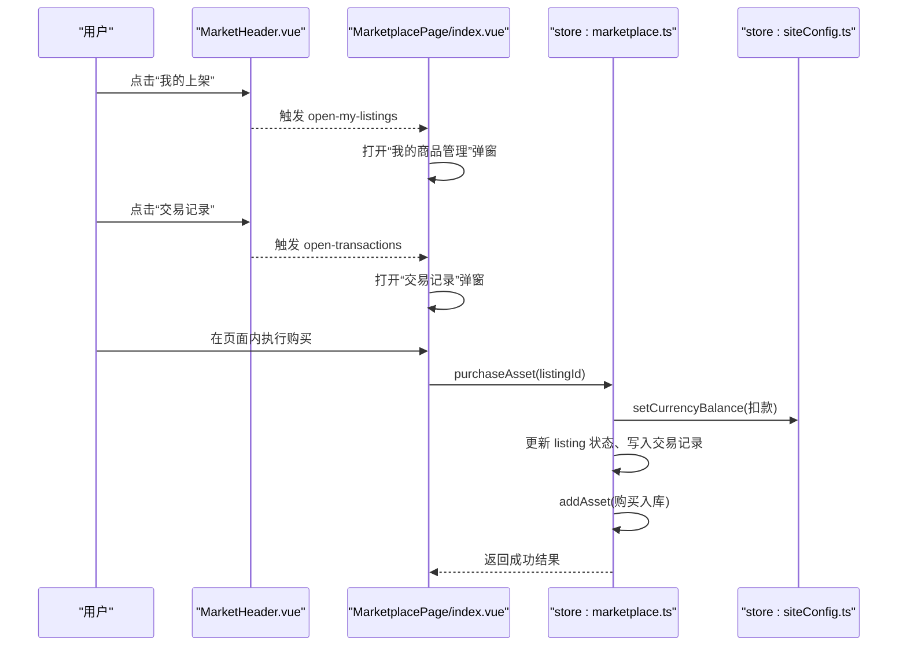
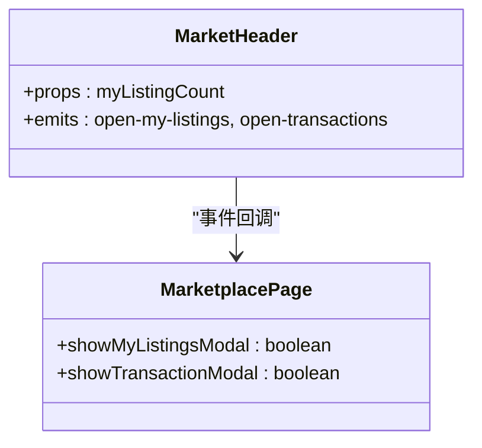
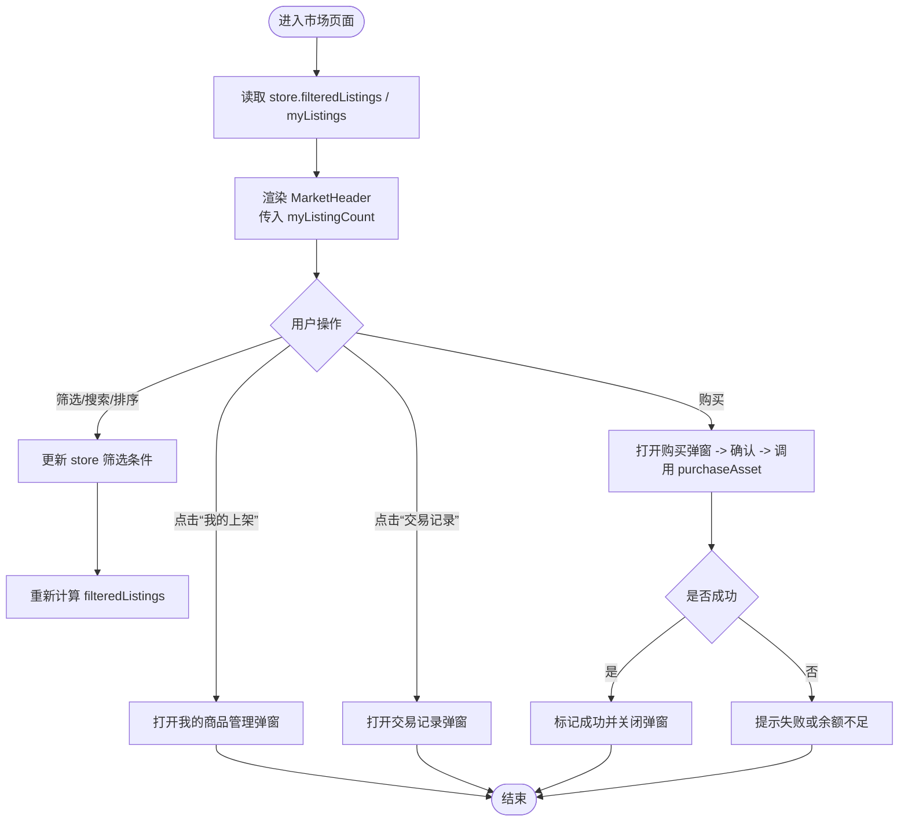
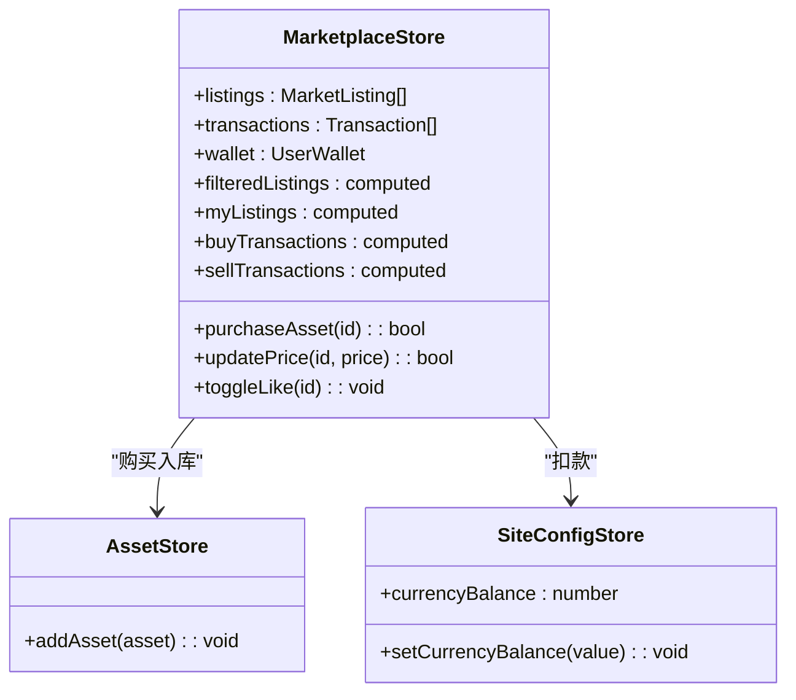
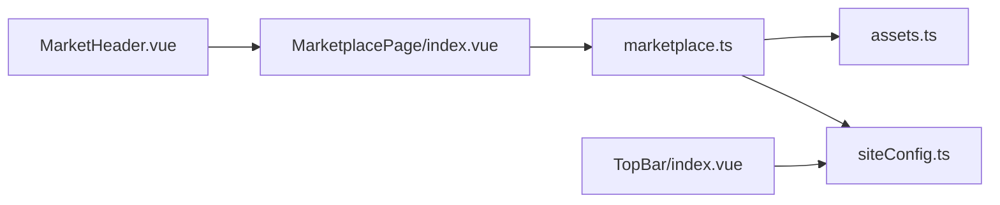

# 市场头部组件

<cite>
**本文引用的文件**   
- [MarketHeader.vue](file://frontend/src/views/MarketplacePage/components/MarketHeader.vue)
- [MarketplacePage/index.vue](file://frontend/src/views/MarketplacePage/index.vue)
- [marketplace.ts](file://frontend/src/stores/marketplace.ts)
- [assets.ts](file://frontend/src/stores/assets.ts)
- [assetTypes.ts](file://frontend/src/config/assetTypes.ts)
- [TopBar/index.vue](file://frontend/src/layouts/components/TopBar/index.vue)
- [siteConfig.ts](file://frontend/src/stores/siteConfig.ts)
</cite>

## 目录
1. [简介](#简介)
2. [项目结构](#项目结构)
3. [核心组件与职责](#核心组件与职责)
4. [架构总览](#架构总览)
5. [详细组件分析](#详细组件分析)
6. [依赖关系分析](#依赖关系分析)
7. [性能与响应式适配](#性能与响应式适配)
8. [故障排查指南](#故障排查指南)
9. [结论](#结论)

## 简介
本文件聚焦“资产市场”页面的头部区域，围绕以下目标展开：
- 市场统计信息展示：我的上架数量、交易记录入口等。
- 用户操作入口与导航：打开“我的商品管理”、“查看交易记录”等交互。
- 数据同步机制：与 Pinia 状态（市场列表、素材库、站点配置）的联动。
- 响应式布局适配：在小屏设备上的显示策略与交互优化。

## 项目结构
与市场头部相关的代码主要分布在页面容器、头部子组件以及全局状态中：
- 页面容器负责组装头部、筛选区、商品网格与各类弹窗。
- 头部子组件仅负责展示与事件派发，不持有业务状态。
- 状态集中在 Pinia Store 中，提供过滤、排序、购买、上架、价格修改等能力。
- 站点配置用于控制货币名称与余额来源，影响顶部栏与购买流程。

图表来源
- [MarketplacePage/index.vue:111-195](file://frontend/src/views/MarketplacePage/index.vue#L111-L195)
- [MarketHeader.vue:13-36](file://frontend/src/views/MarketplacePage/components/MarketHeader.vue#L13-L36)
- [marketplace.ts:77-333](file://frontend/src/stores/marketplace.ts#L77-L333)
- [assets.ts:43-160](file://frontend/src/stores/assets.ts#L43-L160)
- [siteConfig.ts:7-99](file://frontend/src/stores/siteConfig.ts#L7-L99)

章节来源
- [MarketplacePage/index.vue:1-196](file://frontend/src/views/MarketplacePage/index.vue#L1-L196)
- [MarketHeader.vue:1-37](file://frontend/src/views/MarketplacePage/components/MarketHeader.vue#L1-L37)
- [marketplace.ts:1-334](file://frontend/src/stores/marketplace.ts#L1-L334)
- [assets.ts:1-161](file://frontend/src/stores/assets.ts#L1-L161)
- [assetTypes.ts:1-69](file://frontend/src/config/assetTypes.ts#L1-L69)
- [TopBar/index.vue:1-122](file://frontend/src/layouts/components/TopBar/index.vue#L1-L122)
- [siteConfig.ts:1-100](file://frontend/src/stores/siteConfig.ts#L1-L100)

## 核心组件与职责
- MarketHeader.vue
  - 职责：展示“资产市场”标题；展示“我的上架”按钮及数量徽标；提供“交易记录”入口；通过事件向父级通知打开对应弹窗。
  - 输入：myListingCount（当前用户上架商品数量）。
  - 输出：open-my-listings、open-transactions 两个自定义事件。
- MarketplacePage/index.vue
  - 职责：组合 MarketHeader 与其他模块；维护分页、搜索、排序、筛选等状态；控制各弹窗显隐；将 store 中的数据与方法传递给子组件。
- Pinia Stores
  - marketplace.ts：维护市场上架列表、交易记录、钱包、筛选与排序、购买/上架/改价/点赞等业务逻辑。
  - assets.ts：维护本地素材库，供购买后入库使用。
  - siteConfig.ts：提供货币名称与余额计算，影响购买校验与顶部栏显示。

章节来源
- [MarketHeader.vue:1-37](file://frontend/src/views/MarketplacePage/components/MarketHeader.vue#L1-L37)
- [MarketplacePage/index.vue:1-196](file://frontend/src/views/MarketplacePage/index.vue#L1-L196)
- [marketplace.ts:77-333](file://frontend/src/stores/marketplace.ts#L77-L333)
- [assets.ts:43-160](file://frontend/src/stores/assets.ts#L43-L160)
- [siteConfig.ts:53-86](file://frontend/src/stores/siteConfig.ts#L53-L86)

## 架构总览
市场头部作为轻量 UI 组件，遵循“单向数据流 + 事件冒泡”的模式：
- 数据层：Pinia 集中管理市场数据与业务方法。
- 视图层：MarketHeader 只负责渲染与事件派发，不直接读写状态。
- 容器层：MarketplacePage 订阅 store 数据，驱动弹窗与子组件行为。

图表来源
- [MarketHeader.vue:13-36](file://frontend/src/views/MarketplacePage/components/MarketHeader.vue#L13-L36)
- [MarketplacePage/index.vue:64-102](file://frontend/src/views/MarketplacePage/index.vue#L64-L102)
- [marketplace.ts:254-293](file://frontend/src/stores/marketplace.ts#L254-L293)
- [siteConfig.ts:77-86](file://frontend/src/stores/siteConfig.ts#L77-L86)

## 详细组件分析

### 市场头部组件 MarketHeader.vue
- 展示内容
  - 标题：“资产市场”。
  - “我的上架”按钮：当 myListingCount > 0 时显示数量徽标。
  - “交易记录”按钮：无数量徽标。
- 交互设计
  - 点击“我的上架”：向上抛出 open-my-listings 事件，由父组件打开“我的商品管理”弹窗。
  - 点击“交易记录”：向上抛出 open-transactions 事件，由父组件打开“交易记录”弹窗。
- 样式与可访问性
  - 采用边框与悬停高亮提升可点击感。
  - 图标+文字组合，便于快速识别。
- 与状态的关系
  - 仅消费 myListingCount 属性，不直接访问 store。
  - 所有业务变更由父组件协调完成。

图表来源
- [MarketHeader.vue:1-37](file://frontend/src/views/MarketplacePage/components/MarketHeader.vue#L1-L37)
- [MarketplacePage/index.vue:111-195](file://frontend/src/views/MarketplacePage/index.vue#L111-L195)

章节来源
- [MarketHeader.vue:1-37](file://frontend/src/views/MarketplacePage/components/MarketHeader.vue#L1-L37)

### 页面容器 MarketplacePage/index.vue
- 头部集成
  - 传入 myListingCount 来自 store.myListings.length。
  - 监听 open-my-listings 与 open-transactions，控制对应弹窗可见性。
- 筛选与排序
  - 类型筛选：主类型与子类型联动，重置页码与子筛选。
  - 价格区间：双向绑定到 store.priceMin/priceMax。
  - 搜索：实时同步到 store.searchQuery。
  - 排序：下拉选择同步到 store.sortBy。
- 购买流程
  - 打开购买弹窗 -> 确认购买 -> 调用 store.purchaseAsset -> 成功后标记并关闭弹窗。
- 价格编辑
  - 打开价格编辑弹窗 -> 输入新价格 -> 调用 store.updatePrice -> 关闭弹窗。
- 预览与我的商品
  - 预览弹窗：点击商品卡片打开详情预览。
  - 我的商品弹窗：从 store.myListings 获取当前用户上架列表。

图表来源
- [MarketplacePage/index.vue:111-195](file://frontend/src/views/MarketplacePage/index.vue#L111-L195)
- [marketplace.ts:145-205](file://frontend/src/stores/marketplace.ts#L145-L205)
- [marketplace.ts:254-293](file://frontend/src/stores/marketplace.ts#L254-L293)

章节来源
- [MarketplacePage/index.vue:1-196](file://frontend/src/views/MarketplacePage/index.vue#L1-L196)

### 状态管理 marketplace.ts
- 关键数据
  - listings：市场上架列表（含卖家、价格、状态、浏览/点赞数等）。
  - transactions：交易记录（买入/卖出）。
  - wallet：钱包信息（余额、累计收入/支出）。
  - 筛选与排序：activeFilter、activeSubFilter、sortBy、priceMin/priceMax、searchQuery。
- 计算属性
  - filteredListings：根据状态、筛选、排序、价格区间、搜索词综合过滤与排序。
  - myListings：仅当前用户且在售的上架商品。
  - buyTransactions/sellTransactions：按类型拆分交易记录。
- 核心方法
  - listAsset/listAssetsBatch：上架素材（关联 asset.listingId）。
  - unlistAsset：下架商品（置为 removed，解除关联）。
  - purchaseAsset：校验余额、扣款、更新 listing 状态、写入交易记录、入库素材。
  - updatePrice：修改在售商品价格。
  - toggleLike：切换点赞状态并更新计数。

图表来源
- [marketplace.ts:77-333](file://frontend/src/stores/marketplace.ts#L77-L333)
- [assets.ts:43-160](file://frontend/src/stores/assets.ts#L43-L160)
- [siteConfig.ts:53-86](file://frontend/src/stores/siteConfig.ts#L53-L86)

章节来源
- [marketplace.ts:1-334](file://frontend/src/stores/marketplace.ts#L1-L334)
- [assets.ts:1-161](file://frontend/src/stores/assets.ts#L1-L161)
- [siteConfig.ts:1-100](file://frontend/src/stores/siteConfig.ts#L1-L100)

### 类型与分类配置 assetTypes.ts
- 作用：定义音色、音效、视频的子类型映射与标签，供筛选器构建与展示。
- 与头部的关系：间接影响“我的上架”与“交易记录”的数据范围（通过主/子类型筛选）。

章节来源
- [assetTypes.ts:1-69](file://frontend/src/config/assetTypes.ts#L1-L69)

### 全局顶部栏 TopBar/index.vue 与站点配置
- 顶部栏展示货币余额与充值入口，受站点配置控制。
- 购买流程会调用 setCurrencyBalance 更新余额，从而与顶部栏保持同步。

章节来源
- [TopBar/index.vue:1-122](file://frontend/src/layouts/components/TopBar/index.vue#L1-L122)
- [siteConfig.ts:53-86](file://frontend/src/stores/siteConfig.ts#L53-L86)

## 依赖关系分析
- 组件耦合
  - MarketHeader 与 MarketplacePage 通过 props/emits 解耦，符合单一职责原则。
  - MarketplacePage 聚合多个子组件与弹窗，承担编排职责。
- 状态依赖
  - MarketplacePage 依赖 marketplace.ts 提供的计算属性与方法。
  - marketplace.ts 依赖 assets.ts（购买入库）与 siteConfig.ts（余额读写）。
- 外部依赖
  - 路由与全局事件由 TopBar 处理，与头部组件无直接耦合。

图表来源
- [MarketHeader.vue:1-37](file://frontend/src/views/MarketplacePage/components/MarketHeader.vue#L1-L37)
- [MarketplacePage/index.vue:1-196](file://frontend/src/views/MarketplacePage/index.vue#L1-L196)
- [marketplace.ts:77-333](file://frontend/src/stores/marketplace.ts#L77-L333)
- [assets.ts:43-160](file://frontend/src/stores/assets.ts#L43-L160)
- [siteConfig.ts:53-86](file://frontend/src/stores/siteConfig.ts#L53-L86)
- [TopBar/index.vue:1-122](file://frontend/src/layouts/components/TopBar/index.vue#L1-L122)

章节来源
- [MarketplacePage/index.vue:1-196](file://frontend/src/views/MarketplacePage/index.vue#L1-L196)
- [marketplace.ts:1-334](file://frontend/src/stores/marketplace.ts#L1-L334)
- [assets.ts:1-161](file://frontend/src/stores/assets.ts#L1-L161)
- [siteConfig.ts:1-100](file://frontend/src/stores/siteConfig.ts#L1-L100)
- [TopBar/index.vue:1-122](file://frontend/src/layouts/components/TopBar/index.vue#L1-L122)

## 性能与响应式适配
- 性能
  - 过滤与排序集中在 computed 中，避免重复计算；分页在页面层基于 filteredListings 切片，减少渲染压力。
  - 购买流程涉及多处状态更新，建议后续引入批量更新或事务化提交以提升一致性。
- 响应式
  - 头部按钮在小屏下保留图标与短文本，确保可用性。
  - 左侧筛选面板与右侧内容区采用固定宽度与弹性布局，小屏时可考虑折叠或抽屉式筛选。
  - 弹窗在全屏模式下需保证滚动与遮罩层级正确。

[本节为通用指导，无需源码引用]

## 故障排查指南
- 问题：点击“我的上架”无反应
  - 检查 MarketplacePage 是否正确监听 open-my-listings 事件并设置 showMyListingsModal。
  - 确认 store.myListings 是否为空导致徽标隐藏但不影响交互。
- 问题：点击“交易记录”无反应
  - 检查 open-transactions 事件绑定与 showTransactionModal 状态。
- 问题：购买失败
  - 检查余额是否充足（siteConfig.currencyBalance），以及 listing 状态是否为 active。
  - 确认 purchaseAsset 返回值与页面 success 标志位同步。
- 问题：修改价格无效
  - 确认 listing.sellerId 是否为当前用户，否则 updatePrice 会拒绝。
- 问题：顶部余额未更新
  - 确认 setCurrencyBalance 是否被调用，且 recharge_type 分支正确。

章节来源
- [MarketplacePage/index.vue:64-102](file://frontend/src/views/MarketplacePage/index.vue#L64-L102)
- [marketplace.ts:254-301](file://frontend/src/stores/marketplace.ts#L254-L301)
- [siteConfig.ts:77-86](file://frontend/src/stores/siteConfig.ts#L77-L86)

## 结论
市场头部组件以极简方式承载了关键的用户入口与统计信息，配合容器组件与 Pinia 状态管理，实现了清晰的数据流与良好的可扩展性。建议在后续迭代中：
- 增加后端接口对接，替换当前本地数据。
- 完善错误提示与加载态，提升用户体验。
- 针对移动端进一步优化筛选与弹窗的交互模式。