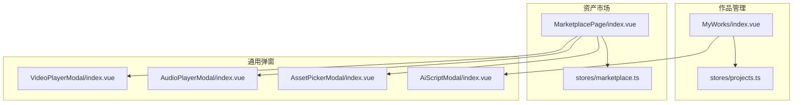
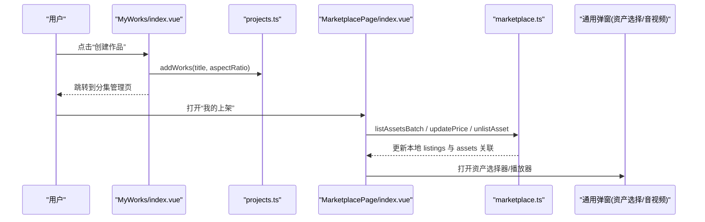
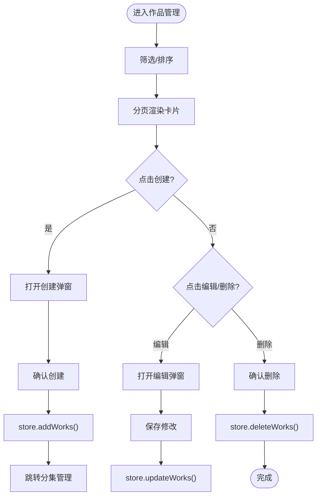
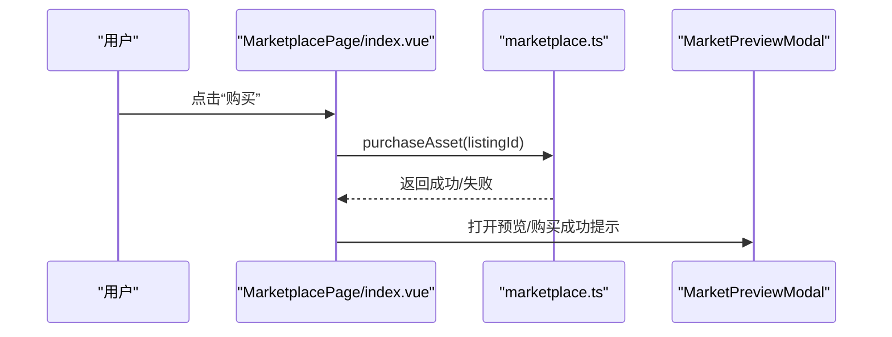
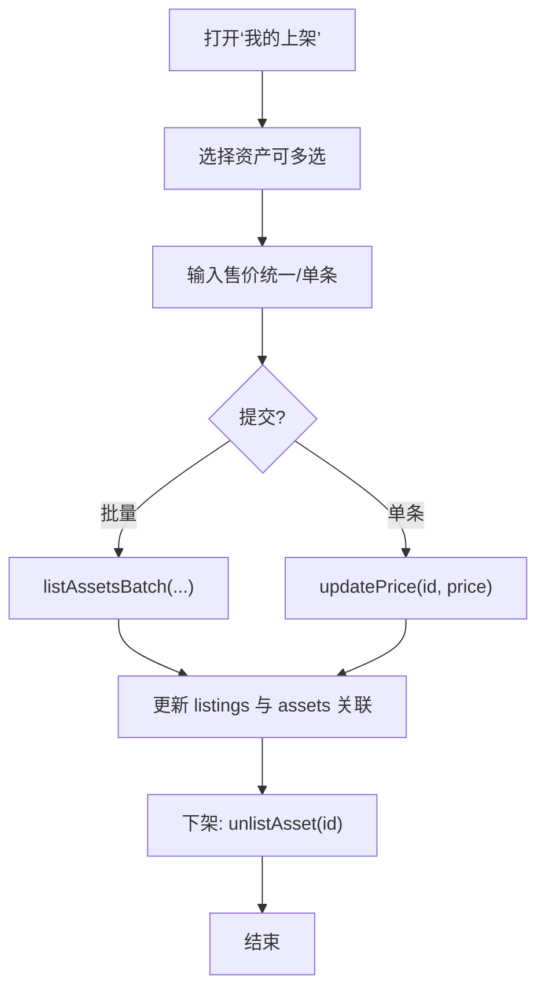
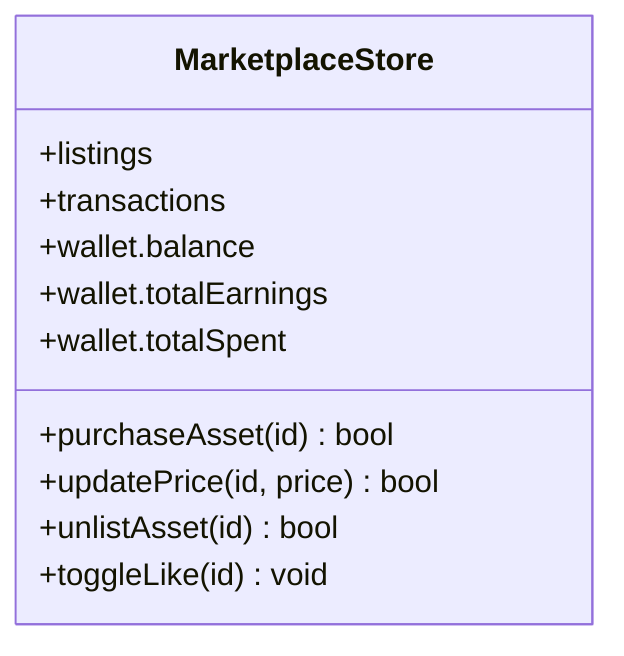
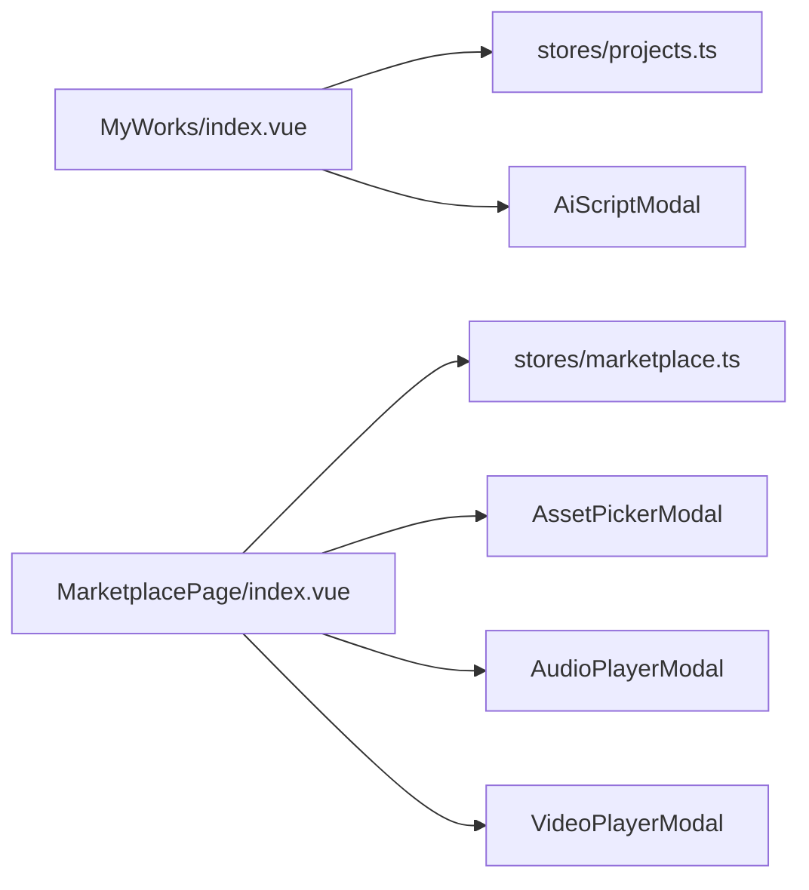

# 我的商品模态框

<cite>
**本文引用的文件**   
- [frontend/src/views/MyWorks/index.vue](file://frontend/src/views/MyWorks/index.vue)
- [frontend/src/views/MarketplacePage/index.vue](file://frontend/src/views/MarketplacePage/index.vue)
- [frontend/src/stores/marketplace.ts](file://frontend/src/stores/marketplace.ts)
- [frontend/src/stores/projects.ts](file://frontend/src/stores/projects.ts)
- [frontend/src/components/AiScriptModal/index.vue](file://frontend/src/components/AiScriptModal/index.vue)
- [frontend/src/components/AssetPickerModal/index.vue](file://frontend/src/components/AssetPickerModal/index.vue)
- [frontend/src/components/AudioPlayerModal/index.vue](file://frontend/src/components/AudioPlayerModal/index.vue)
- [frontend/src/components/VideoPlayerModal/index.vue](file://frontend/src/components/VideoPlayerModal/index.vue)
</cite>

## 目录
1. [简介](#简介)
2. [项目结构](#项目结构)
3. [核心组件与能力](#核心组件与能力)
4. [架构总览](#架构总览)
5. [详细组件分析](#详细组件分析)
6. [依赖关系分析](#依赖关系分析)
7. [性能与体验优化](#性能与体验优化)
8. [故障排查指南](#故障排查指南)
9. [结论](#结论)
10. [附录：SEO与模板导入建议](#附录seo与模板导入建议)

## 简介
本文件围绕“我的商品”相关的前端实现，系统性梳理个人商品管理、上架下架、编辑删除、数据分析（销售统计、收益计算）、批量操作、模板导入以及 SEO 优化建议。文档以源码为依据，结合可视化图示，帮助读者快速理解数据流、状态管理与交互流程，并为后续扩展提供清晰路径。

## 项目结构
“我的商品”功能由两个主要页面组成：
- 作品管理页：负责作品的创建、编辑、删除、分页与筛选，并引导进入分集管理。
- 资产市场页：负责商品的浏览、购买、交易记录查看、价格修改、批量挂售与预览等。

图表来源
- [frontend/src/views/MyWorks/index.vue:1-184](file://frontend/src/views/MyWorks/index.vue#L1-L184)
- [frontend/src/views/MarketplacePage/index.vue:1-196](file://frontend/src/views/MarketplacePage/index.vue#L1-L196)
- [frontend/src/stores/marketplace.ts](file://frontend/src/stores/marketplace.ts)
- [frontend/src/stores/projects.ts](file://frontend/src/stores/projects.ts)
- [frontend/src/components/AiScriptModal/index.vue:154-197](file://frontend/src/components/AiScriptModal/index.vue#L154-L197)
- [frontend/src/components/AssetPickerModal/index.vue:137-224](file://frontend/src/components/AssetPickerModal/index.vue#L137-L224)
- [frontend/src/components/AudioPlayerModal/index.vue:110-177](file://frontend/src/components/AudioPlayerModal/index.vue#L110-L177)
- [frontend/src/components/VideoPlayerModal/index.vue:173-314](file://frontend/src/components/VideoPlayerModal/index.vue#L173-L314)

章节来源
- [frontend/src/views/MyWorks/index.vue:1-184](file://frontend/src/views/MyWorks/index.vue#L1-L184)
- [frontend/src/views/MarketplacePage/index.vue:1-196](file://frontend/src/views/MarketplacePage/index.vue#L1-L196)

## 核心组件与能力
- 作品管理（创建/编辑/删除/分页/筛选）
- 分集管理入口（从作品跳转至分集列表）
- 资产市场（浏览/搜索/排序/筛选/购买/预览）
- 我的上架（批量挂售/单条改价/下架）
- 交易记录（买入/卖出明细与汇总）
- 通用弹窗（AI脚本、资产选择、音视频播放）

章节来源
- [frontend/src/views/MyWorks/index.vue:1-184](file://frontend/src/views/MyWorks/index.vue#L1-L184)
- [frontend/src/views/MarketplacePage/index.vue:1-196](file://frontend/src/views/MarketplacePage/index.vue#L1-L196)

## 架构总览
前端采用“视图 + Store”的轻量状态管理模式。作品管理与资产市场各自维护独立的状态；通用弹窗作为可复用 UI 层被多处引用。

图表来源
- [frontend/src/views/MyWorks/index.vue:50-97](file://frontend/src/views/MyWorks/index.vue#L50-L97)
- [frontend/src/views/MarketplacePage/index.vue:64-109](file://frontend/src/views/MarketplacePage/index.vue#L64-L109)
- [frontend/src/stores/marketplace.ts](file://frontend/src/stores/marketplace.ts)
- [frontend/src/stores/projects.ts](file://frontend/src/stores/projects.ts)
- [frontend/src/components/AssetPickerModal/index.vue:137-224](file://frontend/src/components/AssetPickerModal/index.vue#L137-L224)
- [frontend/src/components/AudioPlayerModal/index.vue:110-177](file://frontend/src/components/AudioPlayerModal/index.vue#L110-L177)
- [frontend/src/components/VideoPlayerModal/index.vue:173-314](file://frontend/src/components/VideoPlayerModal/index.vue#L173-L314)

## 详细组件分析

### 作品管理（创建/编辑/删除/分页/筛选）
- 创建：通过表单弹窗收集标题、封面、比例，写入 store 后跳转分集管理。
- 编辑：回填初始数据，仅允许修改标题与封面，画面比例在创建后不可更改。
- 删除：二次确认后调用 store 删除方法。
- 筛选与排序：支持按状态过滤与按更新时间/创建时间/热度排序。
- 分页：前端分页，自动修正当前页码。

图表来源
- [frontend/src/views/MyWorks/index.vue:26-48](file://frontend/src/views/MyWorks/index.vue#L26-L48)
- [frontend/src/views/MyWorks/index.vue:50-97](file://frontend/src/views/MyWorks/index.vue#L50-L97)
- [frontend/src/views/MyWorks/index.vue:108-184](file://frontend/src/views/MyWorks/index.vue#L108-L184)

章节来源
- [frontend/src/views/MyWorks/index.vue:1-184](file://frontend/src/views/MyWorks/index.vue#L1-L184)

### 资产市场（浏览/购买/预览/交易记录）
- 浏览：左侧分类+价格区间筛选，右侧网格展示，支持搜索与排序。
- 购买：校验余额，扣减余额，生成交易记录，并将资产加入本地库。
- 预览：根据类型动态渲染图片/音频/视频播放器。
- 交易记录：汇总总收入/总支出/笔数，支持按买入/卖出筛选。

图表来源
- [frontend/src/views/MarketplacePage/index.vue:64-109](file://frontend/src/views/MarketplacePage/index.vue#L64-L109)
- [frontend/src/stores/marketplace.ts](file://frontend/src/stores/marketplace.ts)

章节来源
- [frontend/src/views/MarketplacePage/index.vue:1-196](file://frontend/src/views/MarketplacePage/index.vue#L1-L196)

### 我的上架（批量挂售/改价/下架）
- 批量挂售：从“未上架资产”中选择多个，统一设置售价后提交。
- 单条改价：行内编辑价格，回车确认或点击确认按钮。
- 下架：将商品标记为移除，并解除与资产的关联。

图表来源
- [frontend/src/views/MarketplacePage/index.vue:86-109](file://frontend/src/views/MarketplacePage/index.vue#L86-L109)
- [frontend/src/stores/marketplace.ts](file://frontend/src/stores/marketplace.ts)

章节来源
- [frontend/src/views/MarketplacePage/index.vue:1-196](file://frontend/src/views/MarketplacePage/index.vue#L1-L196)

### 数据分析（销售统计、收益计算）
- 销售统计：交易记录列表包含买入/卖出明细，顶部汇总显示总收入、总支出与交易笔数。
- 收益计算：
  - 总收入 = 所有卖出记录的金额之和
  - 总支出 = 所有买入记录的金额之和
  - 净收益 = 总收入 - 总支出
- 余额变化：购买时扣减余额，卖出时增加余额（由 store 内部逻辑维护）。

图表来源
- [frontend/src/stores/marketplace.ts](file://frontend/src/stores/marketplace.ts)

章节来源
- [frontend/src/views/MarketplacePage/index.vue:1-196](file://frontend/src/views/MarketplacePage/index.vue#L1-L196)

### 批量操作
- 资产库批量删除：勾选多条资产后批量删除。
- 结果面板批量加入资产库：对已成功生成的记录批量加入资产库。
- 市场批量挂售：选择多个资产统一定价后批量上架。

章节来源
- [frontend/src/views/MarketplacePage/index.vue:1-196](file://frontend/src/views/MarketplacePage/index.vue#L1-L196)

### 模板导入
- 资产选择器：用于从资产库中选取参考图/主体等，支持多选与分页。
- AI 脚本弹窗：辅助生成脚本内容，可作为“模板化”创作入口。

章节来源
- [frontend/src/components/AssetPickerModal/index.vue:137-224](file://frontend/src/components/AssetPickerModal/index.vue#L137-L224)
- [frontend/src/components/AiScriptModal/index.vue:154-197](file://frontend/src/components/AiScriptModal/index.vue#L154-L197)

### SEO 优化建议
- 标题与描述：为商品名称、标签与描述提供结构化字段，便于搜索引擎抓取。
- 缩略图与媒体：确保缩略图尺寸合理、命名含关键词，提升加载与索引效果。
- 链接与锚点：为商品详情页生成稳定 URL，包含类型与 ID，利于外链分享。
- 元信息：在页面头部注入 title、description、keywords 等 meta 标签。
- 结构化数据：使用 JSON-LD 标注商品、价格、评价等信息。

[本节为概念性建议，不直接分析具体文件]

## 依赖关系分析
- MyWorks 依赖 projects store 进行作品数据的增删改查与分页。
- Marketplace 依赖 marketplace store 进行商品上下架、购买、交易记录与余额管理。
- 通用弹窗（资产选择、音视频播放）被市场与创作流程复用，降低耦合度。

图表来源
- [frontend/src/views/MyWorks/index.vue:1-184](file://frontend/src/views/MyWorks/index.vue#L1-L184)
- [frontend/src/views/MarketplacePage/index.vue:1-196](file://frontend/src/views/MarketplacePage/index.vue#L1-L196)
- [frontend/src/stores/projects.ts](file://frontend/src/stores/projects.ts)
- [frontend/src/stores/marketplace.ts](file://frontend/src/stores/marketplace.ts)
- [frontend/src/components/AssetPickerModal/index.vue:137-224](file://frontend/src/components/AssetPickerModal/index.vue#L137-L224)
- [frontend/src/components/AudioPlayerModal/index.vue:110-177](file://frontend/src/components/AudioPlayerModal/index.vue#L110-L177)
- [frontend/src/components/VideoPlayerModal/index.vue:173-314](file://frontend/src/components/VideoPlayerModal/index.vue#L173-L314)
- [frontend/src/components/AiScriptModal/index.vue:154-197](file://frontend/src/components/AiScriptModal/index.vue#L154-L197)

章节来源
- [frontend/src/views/MyWorks/index.vue:1-184](file://frontend/src/views/MyWorks/index.vue#L1-L184)
- [frontend/src/views/MarketplacePage/index.vue:1-196](file://frontend/src/views/MarketplacePage/index.vue#L1-L196)

## 性能与体验优化
- 前端分页：减少首屏渲染压力，提升滚动流畅度。
- 懒加载与占位：媒体资源按需加载，避免阻塞主线程。
- 防抖搜索：对搜索输入做节流处理，降低频繁请求。
- 批量操作反馈：明确进度与结果提示，增强用户信心。
- 缓存策略：对静态资源与枚举配置进行缓存，缩短冷启动时间。

[本节为通用指导，不直接分析具体文件]

## 故障排查指南
- 购买失败：检查余额是否充足、商品是否仍为在售状态。
- 批量操作无响应：确认选中项是否为空，或是否存在网络异常。
- 预览无法播放：核对媒体 URL 是否有效，浏览器是否支持对应格式。
- 上架失败：确认资产未被其他商品占用，且价格大于零。

章节来源
- [frontend/src/views/MarketplacePage/index.vue:64-109](file://frontend/src/views/MarketplacePage/index.vue#L64-L109)

## 结论
“我的商品”模块通过清晰的视图与 Store 分层，实现了作品管理、商品上下架、批量操作与基础数据分析。借助通用弹窗组件，系统具备良好的可扩展性与复用性。建议在后续迭代中完善后端对接、引入服务端分页与更丰富的统计图表，同时加强 SEO 与可访问性优化。

[本节为总结性内容，不直接分析具体文件]

## 附录：SEO与模板导入建议
- 模板导入：可通过资产选择器批量导入参考素材，结合 AI 脚本弹窗生成标准化脚本，提高创作效率。
- SEO 落地：在路由守卫或页面初始化阶段注入 meta 与结构化数据，确保每个商品页具备唯一标识与丰富描述。

[本节为概念性建议，不直接分析具体文件]