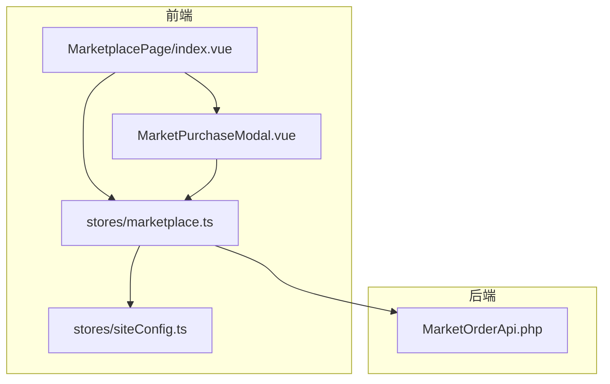
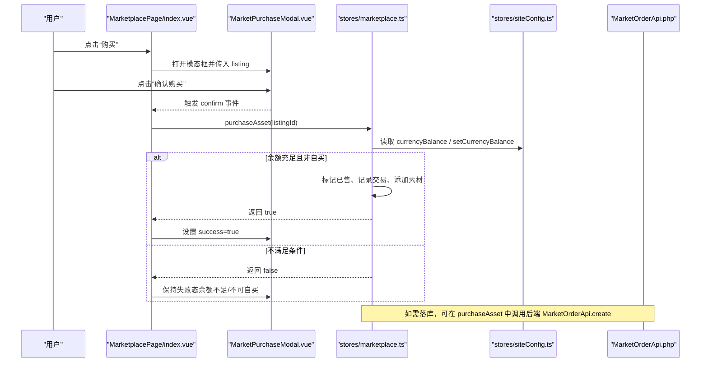
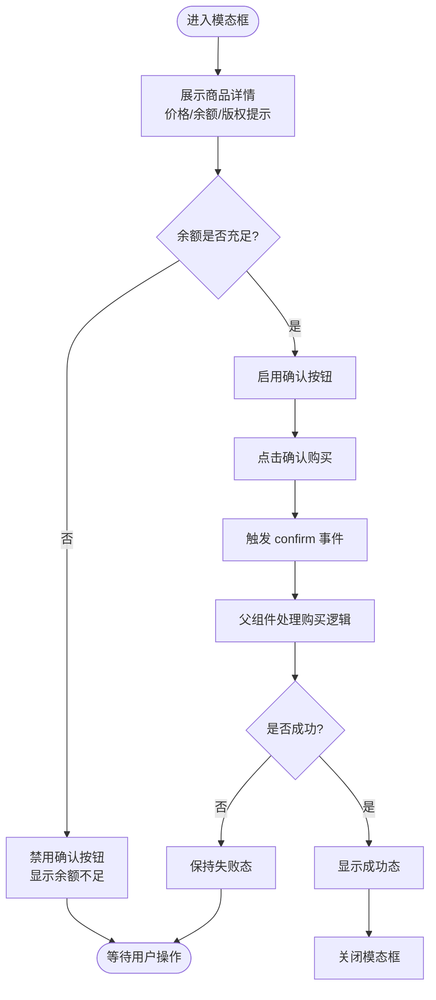
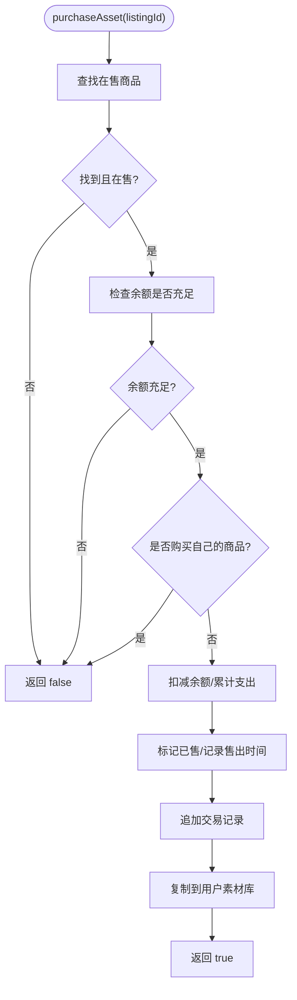
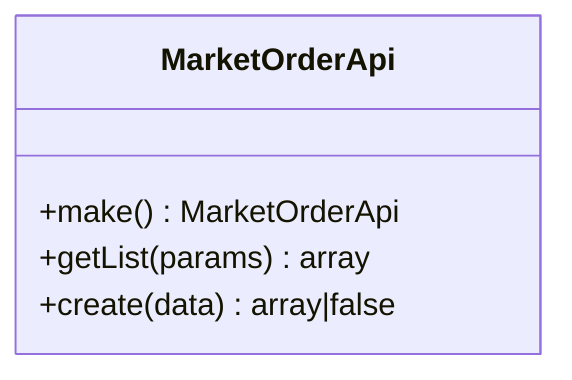
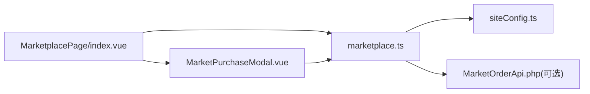

# 购买模态框

<cite>
**本文引用的文件**   
- [MarketplacePage/index.vue](file://frontend/src/views/MarketplacePage/index.vue)
- [MarketPurchaseModal.vue](file://frontend/src/views/MarketplacePage/components/MarketPurchaseModal.vue)
- [marketplace.ts](file://frontend/src/stores/marketplace.ts)
- [siteConfig.ts](file://frontend/src/stores/siteConfig.ts)
- [MarketOrderApi.php](file://server/plugin\xbAiAsset\api\MarketOrderApi.php)
</cite>

## 目录
1. [简介](#简介)
2. [项目结构](#项目结构)
3. [核心组件](#核心组件)
4. [架构总览](#架构总览)
5. [详细组件分析](#详细组件分析)
6. [依赖关系分析](#依赖关系分析)
7. [性能与体验优化](#性能与体验优化)
8. [故障排查指南](#故障排查指南)
9. [结论](#结论)

## 简介
本文件围绕“购买模态框”展开，系统性说明商品详情展示、价格确认、支付流程集成、成功反馈的实现逻辑；并深入讲解订单验证、余额检查、支付状态管理与错误处理机制。同时补充倒计时提示、重复购买检测与用户体验优化的实践建议，帮助开发者快速理解与扩展该功能。

## 项目结构
前端侧通过页面级入口组织购买相关弹窗与交互，后端提供市场交易接口用于创建订单与资产复制等事务性操作。关键文件如下：
- 页面入口：负责打开/关闭购买模态框、触发购买动作、管理成功态
- 购买模态框：展示商品详情、价格与余额对比、版权提示、确认按钮
- 状态管理：维护上架列表、交易记录、钱包余额、购买逻辑
- 站点配置：动态货币名称与余额来源（余额或积分）
- 服务端接口：创建交易记录、校验商品状态、防止自买、复制素材到买家名下

图表来源
- [MarketplacePage/index.vue:1-196](file://frontend/src/views/MarketplacePage/index.vue#L1-L196)
- [MarketPurchaseModal.vue:1-105](file://frontend/src/views/MarketplacePage/components/MarketPurchaseModal.vue#L1-L105)
- [marketplace.ts:1-334](file://frontend/src/stores/marketplace.ts#L1-L334)
- [siteConfig.ts:1-100](file://frontend/src/stores/siteConfig.ts#L1-L100)
- [MarketOrderApi.php:23-143](file://server/plugin\xbAiAsset\api\MarketOrderApi.php#L23-L143)

章节来源
- [MarketplacePage/index.vue:1-196](file://frontend/src/views/MarketplacePage/index.vue#L1-L196)
- [MarketPurchaseModal.vue:1-105](file://frontend/src/views/MarketplacePage/components/MarketPurchaseModal.vue#L1-L105)
- [marketplace.ts:1-334](file://frontend/src/stores/marketplace.ts#L1-L334)
- [siteConfig.ts:1-100](file://frontend/src/stores/siteConfig.ts#L1-L100)
- [MarketOrderApi.php:23-143](file://server/plugin\xbAiAsset\api\MarketOrderApi.php#L23-L143)

## 核心组件
- 购买模态框（MarketPurchaseModal.vue）
  - 展示商品缩略图、名称、类型标签、卖家信息与头像
  - 显示商品价格、当前余额、支付后余额，并根据余额是否充足禁用确认按钮
  - 版权提示：仅授权使用权，禁止二次转售
  - 成功态：展示成功图标与提示文案，支持关闭
- 页面入口（MarketplacePage/index.vue）
  - 控制购买模态框的可见性与成功态
  - 点击“确认购买”时调用 store.purchaseAsset(listingId)
- 状态管理（marketplace.ts）
  - purchaseAsset 方法实现：
    - 校验商品存在且在售
    - 余额不足则拒绝
    - 禁止购买自己的商品
    - 扣减余额、更新钱包统计
    - 标记已售、记录交易、添加到用户素材库
- 站点配置（siteConfig.ts）
  - currencyName/currencyBalance 根据充值类型动态选择余额或积分
  - setCurrencyBalance 按充值类型写入对应字段

章节来源
- [MarketPurchaseModal.vue:1-105](file://frontend/src/views/MarketplacePage/components/MarketPurchaseModal.vue#L1-L105)
- [MarketplacePage/index.vue:64-82](file://frontend/src/views/MarketplacePage/index.vue#L64-L82)
- [marketplace.ts:254-293](file://frontend/src/stores/marketplace.ts#L254-L293)
- [siteConfig.ts:53-86](file://frontend/src/stores/siteConfig.ts#L53-L86)

## 架构总览
购买流程从前端 UI 触发，经状态层完成本地校验与数据变更，必要时可对接后端接口进行持久化与业务编排。

图表来源
- [MarketplacePage/index.vue:64-82](file://frontend/src/views/MarketplacePage/index.vue#L64-L82)
- [MarketPurchaseModal.vue:76-87](file://frontend/src/views/MarketplacePage/components/MarketPurchaseModal.vue#L76-L87)
- [marketplace.ts:254-293](file://frontend/src/stores/marketplace.ts#L254-L293)
- [siteConfig.ts:64-86](file://frontend/src/stores/siteConfig.ts#L64-L86)
- [MarketOrderApi.php:82-143](file://server/plugin\xbAiAsset\api\MarketOrderApi.php#L82-L143)

## 详细组件分析

### 购买模态框（MarketPurchaseModal.vue）
- 商品详情展示
  - 缩略图、名称、类型标签、卖家头像与昵称
  - 图片加载失败统一降级处理
- 价格与余额
  - 显示商品价格、当前余额、支付后余额
  - 余额不足时自动禁用确认按钮，并提供“余额不足”文案
- 版权提示
  - 明确授权范围与禁止二次转售
- 成功反馈
  - 成功态展示成功图标与提示文案，支持一键关闭

图表来源
- [MarketPurchaseModal.vue:31-87](file://frontend/src/views/MarketplacePage/components/MarketPurchaseModal.vue#L31-L87)
- [MarketPurchaseModal.vue:90-102](file://frontend/src/views/MarketplacePage/components/MarketPurchaseModal.vue#L90-L102)

章节来源
- [MarketPurchaseModal.vue:1-105](file://frontend/src/views/MarketplacePage/components/MarketPurchaseModal.vue#L1-L105)

### 页面入口（MarketplacePage/index.vue）
- 控制购买模态框的 visible 与 success 状态
- 打开模态框时重置 success 为 false
- 点击确认后调用 store.purchaseAsset，并根据返回值切换 success

章节来源
- [MarketplacePage/index.vue:64-82](file://frontend/src/views/MarketplacePage/index.vue#L64-L82)
- [MarketplacePage/index.vue:157-164](file://frontend/src/views/MarketplacePage/index.vue#L157-L164)

### 状态管理（marketplace.ts）
- purchaseAsset 核心逻辑
  - 校验商品存在且在售
  - 余额不足直接拒绝
  - 禁止购买自己的商品
  - 扣减余额、累计支出
  - 标记已售、记录售出时间
  - 新增交易记录
  - 将素材复制到用户素材库
- 其他能力
  - 上架/下架、批量上架、修改售价、点赞切换等

图表来源
- [marketplace.ts:254-293](file://frontend/src/stores/marketplace.ts#L254-L293)

章节来源
- [marketplace.ts:254-293](file://frontend/src/stores/marketplace.ts#L254-L293)

### 站点配置（siteConfig.ts）
- 货币名称与余额来源
  - 根据 recharge_type 决定使用余额还是积分
- 余额读写
  - currencyBalance 计算属性读取 user.balance 或 user.integral
  - setCurrencyBalance 按充值类型写入对应字段

章节来源
- [siteConfig.ts:53-86](file://frontend/src/stores/siteConfig.ts#L53-L86)

### 后端接口（MarketOrderApi.php）
- create 方法职责
  - 校验市场上架状态
  - 获取素材信息
  - 禁止自买
  - 组装订单数据并保存
  - 复制素材到买家名下
  - 更新售出时间
  - 触发事件钩子（创建前/创建后）
- getList 方法职责
  - 支持按买家/卖家/上架记录/素材ID筛选分页

图表来源
- [MarketOrderApi.php:23-143](file://server/plugin\xbAiAsset\api\MarketOrderApi.php#L23-L143)

章节来源
- [MarketOrderApi.php:23-143](file://server/plugin\xbAiAsset\api\MarketOrderApi.php#L23-L143)

## 依赖关系分析
- 组件耦合
  - MarketplacePage 与 MarketPurchaseModal 通过 props/emits 解耦
  - 购买逻辑集中在 marketplace store，便于复用与测试
- 外部依赖
  - siteConfig store 提供货币名称与余额来源
  - 可选对接后端 MarketOrderApi 进行持久化与事务编排
- 潜在循环依赖
  - 当前无循环依赖迹象，store 之间通过 computed 与函数调用形成单向依赖

图表来源
- [MarketplacePage/index.vue:1-196](file://frontend/src/views/MarketplacePage/index.vue#L1-L196)
- [MarketPurchaseModal.vue:1-105](file://frontend/src/views/MarketplacePage/components/MarketPurchaseModal.vue#L1-L105)
- [marketplace.ts:1-334](file://frontend/src/stores/marketplace.ts#L1-L334)
- [siteConfig.ts:1-100](file://frontend/src/stores/siteConfig.ts#L1-L100)
- [MarketOrderApi.php:23-143](file://server/plugin\xbAiAsset\api\MarketOrderApi.php#L23-L143)

## 性能与体验优化
- 防抖与节流
  - 对搜索与筛选输入做防抖，减少过滤重算
- 乐观更新与回滚
  - 先本地更新状态，再异步落库；失败时回滚余额与交易记录
- 并发与幂等
  - 引入订单号与幂等键，避免重复提交导致重复扣款
- 资源加载
  - 图片懒加载与占位图，提升首屏渲染速度
- 无障碍与可读性
  - 按钮禁用态提供清晰提示，键盘可达性与焦点管理

[本节为通用建议，无需代码来源]

## 故障排查指南
- 余额不足
  - 现象：确认按钮禁用，提示“余额不足”
  - 排查：检查 siteConfig.currencyBalance 与 listing.price 比较逻辑
- 购买自己的商品
  - 现象：购买被拒绝
  - 排查：确认 listing.sellerId 与当前用户标识的比较
- 商品不存在或已下架
  - 现象：购买失败
  - 排查：确认 listing.status 是否为在售
- 后端未持久化
  - 现象：刷新后状态丢失
  - 排查：在 purchaseAsset 中调用 MarketOrderApi.create，并确保事务与事件正确触发
- 图片加载失败
  - 现象：缩略图显示异常
  - 排查：确保 onImgError 降级处理生效

章节来源
- [MarketPurchaseModal.vue:76-87](file://frontend/src/views/MarketplacePage/components/MarketPurchaseModal.vue#L76-L87)
- [marketplace.ts:254-293](file://frontend/src/stores/marketplace.ts#L254-L293)
- [siteConfig.ts:64-86](file://frontend/src/stores/siteConfig.ts#L64-L86)
- [MarketOrderApi.php:82-143](file://server/plugin\xbAiAsset\api\MarketOrderApi.php#L82-L143)

## 结论
购买模态框在前端实现了完整的商品展示、价格与余额校验、成功反馈闭环；状态管理集中了购买核心逻辑，便于扩展与测试。若需生产环境落地，建议在 purchaseAsset 中接入后端 MarketOrderApi.create，结合幂等与事务保障资金安全，并通过乐观更新与错误回滚提升用户体验。