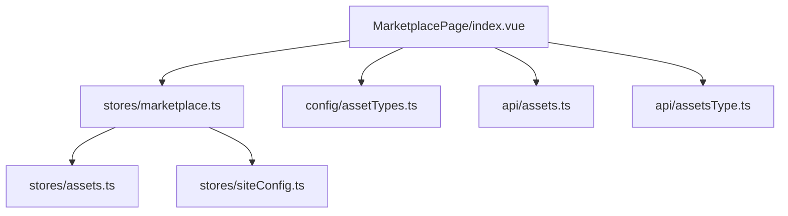
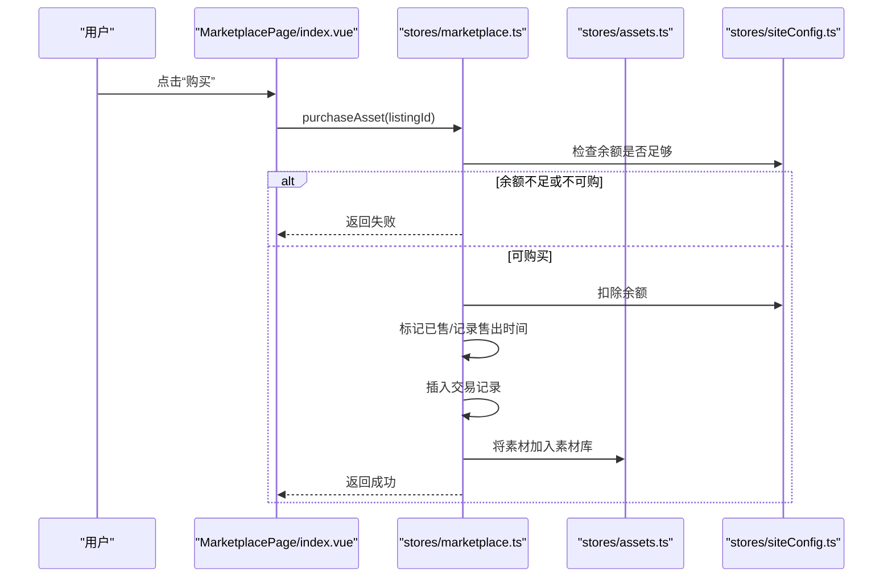
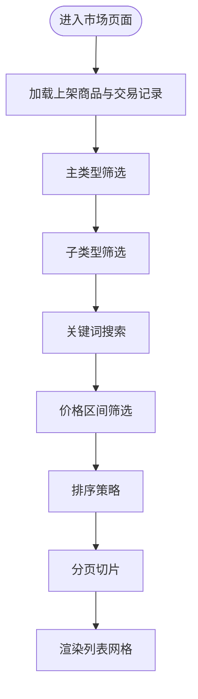
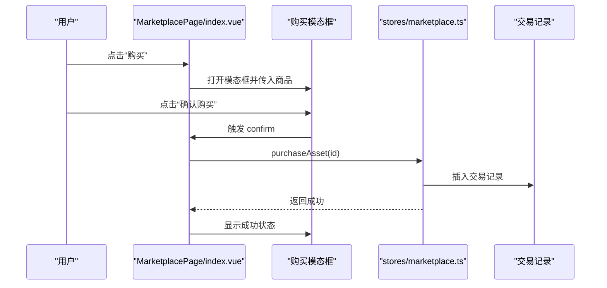
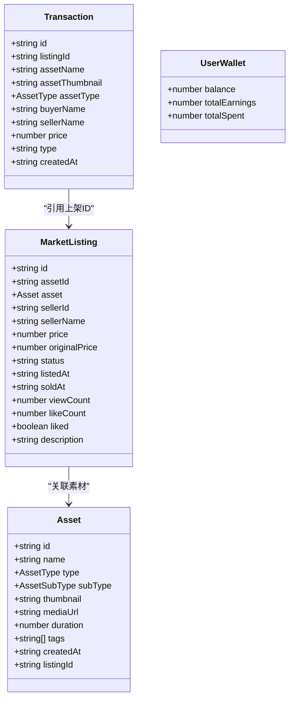
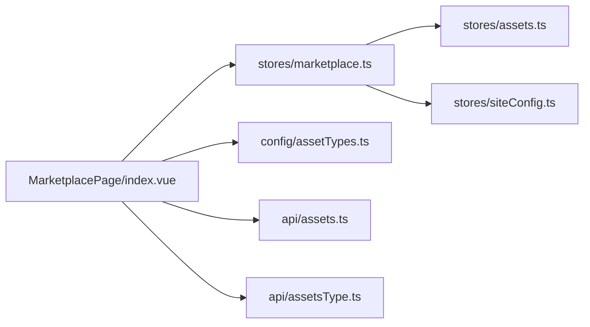

# 资产市场页面

<cite>
**本文引用的文件**   
- [frontend/src/views/MarketplacePage/index.vue](file://frontend/src/views/MarketplacePage/index.vue)
- [frontend/src/stores/marketplace.ts](file://frontend/src/stores/marketplace.ts)
- [frontend/src/stores/assets.ts](file://frontend/src/stores/assets.ts)
- [frontend/src/config/assetTypes.ts](file://frontend/src/config/assetTypes.ts)
- [frontend/src/api/assets.ts](file://frontend/src/api/assets.ts)
- [frontend/src/api/assetsType.ts](file://frontend/src/api/assetsType.ts)
</cite>

## 目录
1. [简介](#简介)
2. [项目结构](#项目结构)
3. [核心组件](#核心组件)
4. [架构总览](#架构总览)
5. [详细组件分析](#详细组件分析)
6. [依赖关系分析](#依赖关系分析)
7. [性能与可扩展性](#性能与可扩展性)
8. [故障排查指南](#故障排查指南)
9. [结论](#结论)
10. [附录](#附录)

## 简介
本文件围绕“资产市场”页面，系统性梳理商品展示、交易流程、价格筛选与用户交互的实现逻辑，并深入说明商品卡片、列表网格、购买模态框、交易记录的管理机制。同时覆盖支付集成（基于站点余额）、订单管理（交易记录）、评价系统（点赞）与数据统计分析（浏览/点赞/销量等指标）的落地方案与扩展建议。

## 项目结构
资产市场页面采用“视图 + Store + 配置 + API”的分层组织方式：
- 视图层：MarketplacePage/index.vue 作为入口，组合头部、筛选区、列表网格与多个模态框。
- 状态层：marketplace.ts 维护市场上架、交易记录、钱包与筛选排序；assets.ts 维护素材库；siteConfig.ts 提供站点配置（如余额）。
- 配置层：assetTypes.ts 定义主类型与子类型映射及标签。
- API 层：assets.ts、assetsType.ts 封装后端接口调用（当前页面以本地数据为主，API 已预留）。

图表来源
- [frontend/src/views/MarketplacePage/index.vue:1-196](file://frontend/src/views/MarketplacePage/index.vue#L1-L196)
- [frontend/src/stores/marketplace.ts:1-334](file://frontend/src/stores/marketplace.ts#L1-L334)
- [frontend/src/stores/assets.ts:1-161](file://frontend/src/stores/assets.ts#L1-L161)
- [frontend/src/config/assetTypes.ts:1-69](file://frontend/src/config/assetTypes.ts#L1-L69)
- [frontend/src/api/assets.ts:1-135](file://frontend/src/api/assets.ts#L1-L135)
- [frontend/src/api/assetsType.ts:1-27](file://frontend/src/api/assetsType.ts#L1-L27)

章节来源
- [frontend/src/views/MarketplacePage/index.vue:1-196](file://frontend/src/views/MarketplacePage/index.vue#L1-L196)
- [frontend/src/stores/marketplace.ts:1-334](file://frontend/src/stores/marketplace.ts#L1-L334)
- [frontend/src/stores/assets.ts:1-161](file://frontend/src/stores/assets.ts#L1-L161)
- [frontend/src/config/assetTypes.ts:1-69](file://frontend/src/config/assetTypes.ts#L1-L69)
- [frontend/src/api/assets.ts:1-135](file://frontend/src/api/assets.ts#L1-L135)
- [frontend/src/api/assetsType.ts:1-27](file://frontend/src/api/assetsType.ts#L1-L27)

## 核心组件
- 市场首页容器：负责组装头部、左侧筛选面板、右侧列表网格与各类模态框，处理分页、搜索、排序与筛选联动。
- 市场状态管理：集中管理上架商品、交易记录、钱包余额、筛选条件、排序策略与业务方法（上架、下架、购买、改价、点赞）。
- 素材库管理：维护素材基础信息，支持新增与删除，并与市场上架进行关联。
- 类型配置：统一维护主类型与子类型映射、中文标签与获取工具函数。
- API 封装：提供资产与资产类型的请求封装，便于后续接入后端。

章节来源
- [frontend/src/views/MarketplacePage/index.vue:1-196](file://frontend/src/views/MarketplacePage/index.vue#L1-L196)
- [frontend/src/stores/marketplace.ts:1-334](file://frontend/src/stores/marketplace.ts#L1-L334)
- [frontend/src/stores/assets.ts:1-161](file://frontend/src/stores/assets.ts#L1-L161)
- [frontend/src/config/assetTypes.ts:1-69](file://frontend/src/config/assetTypes.ts#L1-L69)
- [frontend/src/api/assets.ts:1-135](file://frontend/src/api/assets.ts#L1-L135)
- [frontend/src/api/assetsType.ts:1-27](file://frontend/src/api/assetsType.ts#L1-L27)

## 架构总览
从数据到视图的流转如下：
- 视图层通过 Pinia store 读取过滤后的商品列表、交易记录与钱包信息。
- 筛选与排序在 computed 中完成，保证响应式更新。
- 购买流程校验余额后扣款、标记已售、写入交易记录并同步至素材库。
- 类型与子类型由配置层提供，确保前后端一致。

图表来源
- [frontend/src/views/MarketplacePage/index.vue:64-81](file://frontend/src/views/MarketplacePage/index.vue#L64-L81)
- [frontend/src/stores/marketplace.ts:254-293](file://frontend/src/stores/marketplace.ts#L254-L293)
- [frontend/src/stores/assets.ts:115-122](file://frontend/src/stores/assets.ts#L115-L122)

## 详细组件分析

### 商品展示与筛选
- 主类型与子类型：通过 assetTypes.ts 提供子类型映射与标签，MarketplacePage 构建分类项并传递给筛选组件。
- 筛选逻辑：按主类型、子类型、关键词、价格区间过滤，再按最新/价格升序/价格降序/热门排序。
- 分页：前端根据过滤结果计算总页数并按页切片渲染。

图表来源
- [frontend/src/views/MarketplacePage/index.vue:17-29](file://frontend/src/views/MarketplacePage/index.vue#L17-L29)
- [frontend/src/stores/marketplace.ts:145-195](file://frontend/src/stores/marketplace.ts#L145-L195)
- [frontend/src/config/assetTypes.ts:18-48](file://frontend/src/config/assetTypes.ts#L18-L48)

章节来源
- [frontend/src/views/MarketplacePage/index.vue:31-62](file://frontend/src/views/MarketplacePage/index.vue#L31-L62)
- [frontend/src/stores/marketplace.ts:145-195](file://frontend/src/stores/marketplace.ts#L145-L195)
- [frontend/src/config/assetTypes.ts:1-69](file://frontend/src/config/assetTypes.ts#L1-L69)

### 商品卡片与列表网格
- 商品卡片：展示缩略图、名称、标签、价格、浏览量、点赞数与卖家信息；支持预览、购买、点赞等操作。
- 列表网格：接收分页后的商品数组，渲染为网格布局，并提供搜索输入、排序下拉与翻页控件。
- 交互事件：向父级冒泡 preview/purchase/toggle-like 等事件，由 MarketplacePage 统一处理。

章节来源
- [frontend/src/views/MarketplacePage/index.vue:140-154](file://frontend/src/views/MarketplacePage/index.vue#L140-L154)
- [frontend/src/stores/marketplace.ts:303-309](file://frontend/src/stores/marketplace.ts#L303-L309)

### 购买模态框与交易记录
- 购买模态框：选择商品后弹出，确认购买时调用 store.purchaseAsset，成功后显示成功状态。
- 交易记录：store 内维护买入/卖出两类交易记录，可按类型筛选查看。
- 我的上架：支持查看当前用户上架的商品，并可编辑价格或下架。

图表来源
- [frontend/src/views/MarketplacePage/index.vue:64-81](file://frontend/src/views/MarketplacePage/index.vue#L64-L81)
- [frontend/src/stores/marketplace.ts:254-293](file://frontend/src/stores/marketplace.ts#L254-L293)

章节来源
- [frontend/src/views/MarketplacePage/index.vue:157-170](file://frontend/src/views/MarketplacePage/index.vue#L157-L170)
- [frontend/src/stores/marketplace.ts:107-121](file://frontend/src/stores/marketplace.ts#L107-L121)

### 价格筛选与排序
- 价格筛选：最小值与最大值双向绑定至 store，computed 中执行范围过滤并限制合理边界。
- 排序策略：支持最新上架、价格升序/降序、最受欢迎（按浏览量）。

章节来源
- [frontend/src/views/MarketplacePage/index.vue:131-136](file://frontend/src/views/MarketplacePage/index.vue#L131-L136)
- [frontend/src/stores/marketplace.ts:170-192](file://frontend/src/stores/marketplace.ts#L170-L192)

### 支付集成（基于站点余额）
- 支付方式：使用站点配置的货币余额进行扣款，避免直接对接第三方支付。
- 余额校验：购买前检查余额是否充足，不足则拒绝购买。
- 余额变更：购买成功后更新站点余额与钱包统计（累计支出）。

章节来源
- [frontend/src/stores/marketplace.ts:254-293](file://frontend/src/stores/marketplace.ts#L254-L293)

### 订单管理与交易记录
- 交易记录：包含商品名、缩略图、类型、买卖双方昵称、金额、时间与类型（买入/卖出）。
- 我的交易：可按类型筛选查看历史交易。
- 订单状态：通过商品 status 字段体现在售/已售/已下架。

章节来源
- [frontend/src/stores/marketplace.ts:39-61](file://frontend/src/stores/marketplace.ts#L39-L61)
- [frontend/src/stores/marketplace.ts:107-121](file://frontend/src/stores/marketplace.ts#L107-L121)

### 评价系统与数据统计
- 点赞：每个商品具备 liked 与 likeCount，支持切换点赞状态。
- 浏览统计：商品具备 viewCount，可用于“最受欢迎”排序。
- 销售统计：通过交易记录汇总收入与支出，结合钱包 totalEarnings/totalSpent 展示。

章节来源
- [frontend/src/stores/marketplace.ts:303-309](file://frontend/src/stores/marketplace.ts#L303-L309)
- [frontend/src/stores/marketplace.ts:123-128](file://frontend/src/stores/marketplace.ts#L123-L128)

### 数据模型与关系

图表来源
- [frontend/src/stores/marketplace.ts:5-74](file://frontend/src/stores/marketplace.ts#L5-L74)
- [frontend/src/stores/assets.ts:18-40](file://frontend/src/stores/assets.ts#L18-L40)

## 依赖关系分析
- 视图依赖 store 暴露的状态与方法，并通过事件回调驱动 UI 行为。
- store 依赖 assets 与 siteConfig 两个外部状态源，实现跨模块协作。
- 类型配置独立于业务逻辑，便于扩展新的主/子类型。
- API 层已封装资产与类型接口，便于后续替换为真实后端数据。

图表来源
- [frontend/src/views/MarketplacePage/index.vue:1-196](file://frontend/src/views/MarketplacePage/index.vue#L1-L196)
- [frontend/src/stores/marketplace.ts:1-334](file://frontend/src/stores/marketplace.ts#L1-L334)
- [frontend/src/stores/assets.ts:1-161](file://frontend/src/stores/assets.ts#L1-L161)
- [frontend/src/config/assetTypes.ts:1-69](file://frontend/src/config/assetTypes.ts#L1-L69)
- [frontend/src/api/assets.ts:1-135](file://frontend/src/api/assets.ts#L1-L135)
- [frontend/src/api/assetsType.ts:1-27](file://frontend/src/api/assetsType.ts#L1-L27)

章节来源
- [frontend/src/views/MarketplacePage/index.vue:1-196](file://frontend/src/views/MarketplacePage/index.vue#L1-L196)
- [frontend/src/stores/marketplace.ts:1-334](file://frontend/src/stores/marketplace.ts#L1-L334)
- [frontend/src/stores/assets.ts:1-161](file://frontend/src/stores/assets.ts#L1-L161)
- [frontend/src/config/assetTypes.ts:1-69](file://frontend/src/config/assetTypes.ts#L1-L69)
- [frontend/src/api/assets.ts:1-135](file://frontend/src/api/assets.ts#L1-L135)
- [frontend/src/api/assetsType.ts:1-27](file://frontend/src/api/assetsType.ts#L1-L27)

## 性能与可扩展性
- 计算优化：过滤与排序集中在 computed 中，避免重复计算；分页在前端切片，适合中小规模数据。
- 大数据量建议：当商品数量较大时，可将过滤与排序下沉至后端，前端仅做分页与缓存。
- 懒加载与虚拟滚动：对长列表引入虚拟滚动以提升渲染性能。
- 图片与媒体资源：缩略图与音视频建议使用 CDN 与懒加载，减少首屏压力。
- 可扩展点：
  - 增加更多排序维度（评分、折扣力度）。
  - 引入评论与评分系统，聚合平均评分与评论数。
  - 接入第三方支付网关，替代余额支付。
  - 增加推荐算法（基于浏览与购买行为）。

[本节为通用指导，不直接分析具体文件]

## 故障排查指南
- 购买失败
  - 余额不足：检查站点余额与商品价格，确保余额大于等于售价。
  - 不可购买：若商品已售或属于自己上架，应阻止购买。
  - 定位路径：购买方法与余额校验逻辑。
- 筛选无结果
  - 检查主/子类型、关键词与价格区间是否正确设置。
  - 确认过滤逻辑顺序与边界值限制。
- 交易记录缺失
  - 确认购买成功后是否插入交易记录。
  - 核对交易记录的 type 字段是否为 buy/sell。
- 点赞异常
  - 检查 liked 与 likeCount 的同步更新逻辑。

章节来源
- [frontend/src/stores/marketplace.ts:254-293](file://frontend/src/stores/marketplace.ts#L254-L293)
- [frontend/src/stores/marketplace.ts:145-195](file://frontend/src/stores/marketplace.ts#L145-L195)
- [frontend/src/stores/marketplace.ts:303-309](file://frontend/src/stores/marketplace.ts#L303-L309)

## 结论
资产市场页面以清晰的层次结构与响应式状态管理实现了完整的商品展示、筛选排序、购买交易与数据统计能力。通过配置化的类型体系与预留的 API 层，具备良好的扩展性与可维护性。建议在数据规模增长后引入后端过滤与分页、虚拟滚动与资源懒加载，并逐步完善评价与支付集成。

[本节为总结，不直接分析具体文件]

## 附录
- 关键实现路径参考
  - 市场首页与事件分发：[frontend/src/views/MarketplacePage/index.vue:1-196](file://frontend/src/views/MarketplacePage/index.vue#L1-L196)
  - 市场上架与交易状态管理：[frontend/src/stores/marketplace.ts:1-334](file://frontend/src/stores/marketplace.ts#L1-L334)
  - 素材库与新增素材：[frontend/src/stores/assets.ts:115-122](file://frontend/src/stores/assets.ts#L115-L122)
  - 类型与子类型配置：[frontend/src/config/assetTypes.ts:18-48](file://frontend/src/config/assetTypes.ts#L18-L48)
  - 资产 API 封装：[frontend/src/api/assets.ts:98-135](file://frontend/src/api/assets.ts#L98-L135)
  - 资产类型 API 封装：[frontend/src/api/assetsType.ts:21-27](file://frontend/src/api/assetsType.ts#L21-L27)