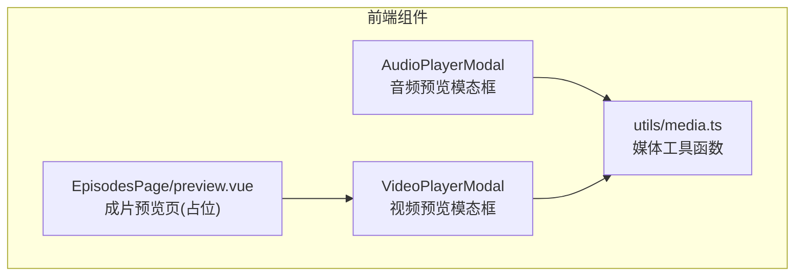
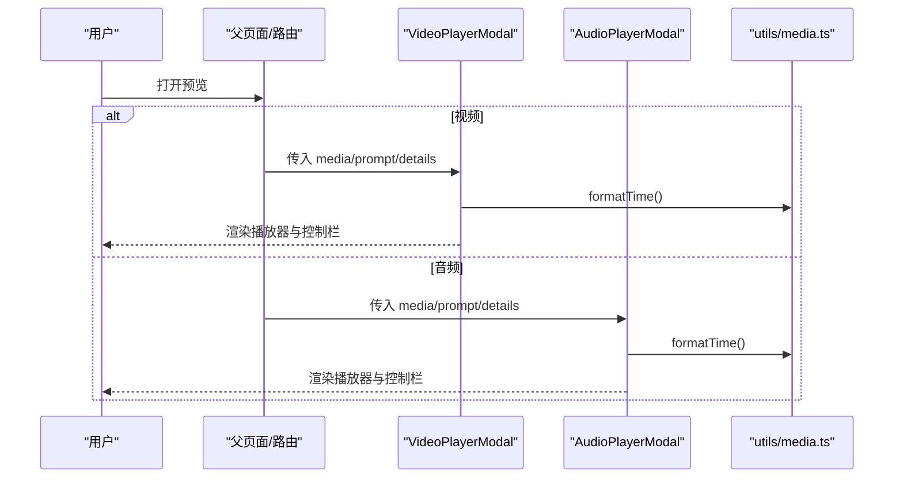
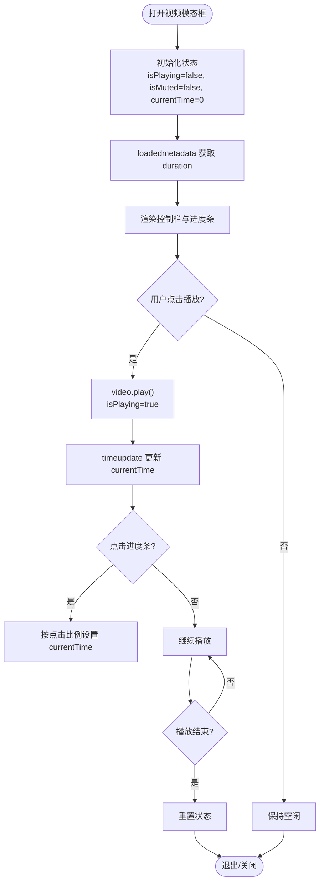
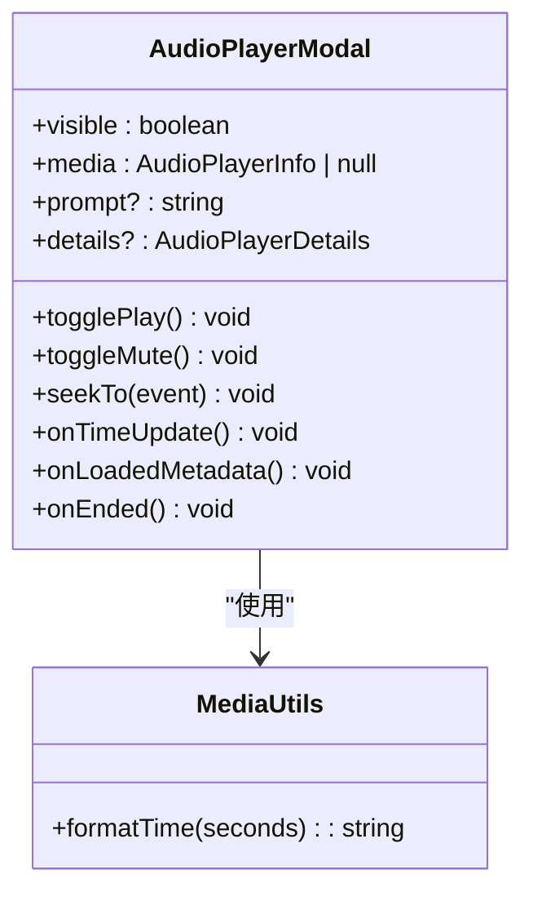
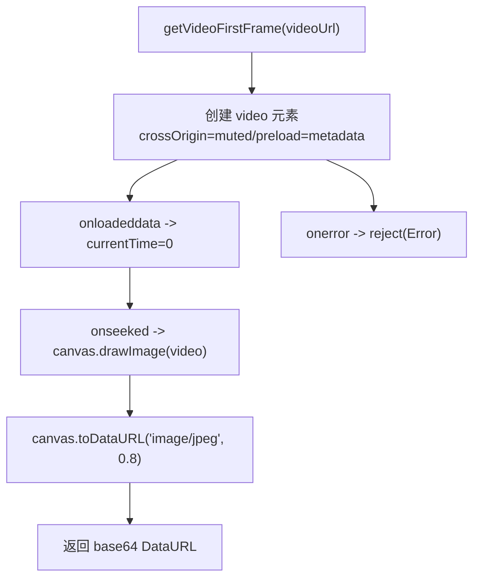
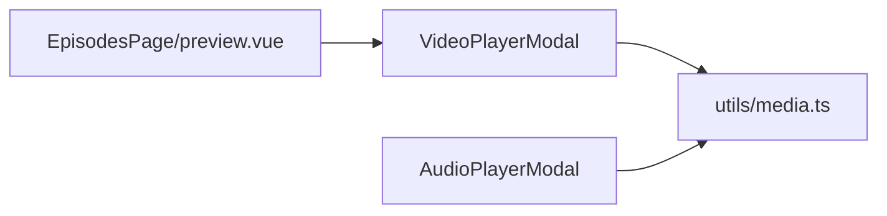

# 预览模态框

<cite>
**本文引用的文件**   
- [AudioPlayerModal/index.vue](file://frontend/src/components/AudioPlayerModal/index.vue)
- [VideoPlayerModal/index.vue](file://frontend/src/components/VideoPlayerModal/index.vue)
- [media.ts](file://frontend/src/utils/media.ts)
- [preview.vue](file://frontend/src/views/EpisodesPage/preview.vue)
</cite>

## 目录
1. [简介](#简介)
2. [项目结构](#项目结构)
3. [核心组件](#核心组件)
4. [架构总览](#架构总览)
5. [详细组件分析](#详细组件分析)
6. [依赖关系分析](#依赖关系分析)
7. [性能与体验优化](#性能与体验优化)
8. [故障排查指南](#故障排查指南)
9. [结论](#结论)
10. [附录](#附录)

## 简介
本文件围绕“预览模态框”能力，系统化梳理多媒体内容（图片、视频、音频）的预览、缩放控制、全屏展示、下载限制、懒加载、播放器集成、播放控制、文件类型检测、水印与版权保护、分享等实现逻辑。文档以代码级为依据，结合流程图与时序图帮助读者快速理解并扩展功能。

## 项目结构
与预览模态框直接相关的核心文件：
- 音频预览模态框：frontend/src/components/AudioPlayerModal/index.vue
- 视频预览模态框：frontend/src/components/VideoPlayerModal/index.vue
- 媒体工具函数（时间格式化、类型判断、首帧截取）：frontend/src/utils/media.ts
- 剧集生成后独立预览页（占位）：frontend/src/views/EpisodesPage/preview.vue

图表来源
- [AudioPlayerModal/index.vue:1-181](file://frontend/src/components/AudioPlayerModal/index.vue#L1-L181)
- [VideoPlayerModal/index.vue:1-318](file://frontend/src/components/VideoPlayerModal/index.vue#L1-L318)
- [media.ts:1-55](file://frontend/src/utils/media.ts#L1-L55)
- [preview.vue:1-52](file://frontend/src/views/EpisodesPage/preview.vue#L1-L52)

章节来源
- [AudioPlayerModal/index.vue:1-181](file://frontend/src/components/AudioPlayerModal/index.vue#L1-L181)
- [VideoPlayerModal/index.vue:1-318](file://frontend/src/components/VideoPlayerModal/index.vue#L1-L318)
- [media.ts:1-55](file://frontend/src/utils/media.ts#L1-L55)
- [preview.vue:1-52](file://frontend/src/views/EpisodesPage/preview.vue#L1-L52)

## 核心组件
- 音频预览模态框
  - 职责：承载音频资源、封面、进度条、播放/暂停、静音切换、时间显示、详情与提示词面板。
  - 关键特性：关闭时自动停止播放；监听可见性与媒体变化重置状态；进度条点击跳转。
- 视频预览模态框
  - 职责：承载视频资源、封面、自定义控制栏、进度条、全屏、点赞交互、选集列表、详情与提示词面板。
  - 关键特性：禁用原生下载按钮；禁止右键菜单；支持多集切换；关闭时清理播放状态。
- 媒体工具函数
  - 职责：时间格式化、资产类型判定、视频首帧截图（用于封面或缩略图）。
- 成片预览页（占位）
  - 职责：展示生成成功状态与基础操作入口（返回、下载、发布），预留视频播放器接入点。

章节来源
- [AudioPlayerModal/index.vue:1-181](file://frontend/src/components/AudioPlayerModal/index.vue#L1-L181)
- [VideoPlayerModal/index.vue:1-318](file://frontend/src/components/VideoPlayerModal/index.vue#L1-L318)
- [media.ts:1-55](file://frontend/src/utils/media.ts#L1-L55)
- [preview.vue:1-52](file://frontend/src/views/EpisodesPage/preview.vue#L1-L52)

## 架构总览
预览模态框采用“容器模态 + 专用播放器子组件”的分层设计：
- 容器层：统一弹窗外壳、尺寸与关闭行为。
- 播放器层：分别封装音频与视频的播放控制、UI 与事件处理。
- 工具层：提供通用媒体工具（时间格式化、类型判断、首帧截取）。
- 页面层：在特定业务页面中调用模态框进行预览。

图表来源
- [VideoPlayerModal/index.vue:1-318](file://frontend/src/components/VideoPlayerModal/index.vue#L1-L318)
- [AudioPlayerModal/index.vue:1-181](file://frontend/src/components/AudioPlayerModal/index.vue#L1-L181)
- [media.ts:1-55](file://frontend/src/utils/media.ts#L1-L55)

## 详细组件分析

### 视频预览模态框
- 数据模型
  - 视频信息：名称、封面、主链接、可选分集数组、当前分集ID、观看数、点赞数、作品ID等。
  - 详情信息：模型名、状态、类型、分辨率、售价等。
- 播放控制
  - 播放/暂停、静音切换、进度条拖拽跳转、结束回调重置状态。
  - 全屏：通过浏览器全屏 API 进入全屏。
  - 下载保护：禁用原生下载控件、阻止右键菜单。
- 分集管理
  - 根据 currentEpisodeId 计算当前媒体 URL，切换分集时重置播放状态并重新加载。
- 交互增强
  - 点赞开关：本地状态切换并向上抛事件。
  - 右侧面板：展示详情与提示词。

图表来源
- [VideoPlayerModal/index.vue:106-146](file://frontend/src/components/VideoPlayerModal/index.vue#L106-L146)
- [VideoPlayerModal/index.vue:148-159](file://frontend/src/components/VideoPlayerModal/index.vue#L148-L159)
- [VideoPlayerModal/index.vue:173-232](file://frontend/src/components/VideoPlayerModal/index.vue#L173-L232)

章节来源
- [VideoPlayerModal/index.vue:1-318](file://frontend/src/components/VideoPlayerModal/index.vue#L1-L318)

### 音频预览模态框
- 数据模型
  - 音频信息：名称、封面、媒体链接。
  - 详情信息：模型名、状态、类型、分辨率、售价等。
- 播放控制
  - 播放/暂停、静音切换、进度条点击跳转、时间更新与时长获取。
  - 关闭时自动暂停并重置时间。
- 侧边面板
  - 展示详情与提示词。

图表来源
- [AudioPlayerModal/index.vue:1-181](file://frontend/src/components/AudioPlayerModal/index.vue#L1-L181)
- [media.ts:1-7](file://frontend/src/utils/media.ts#L1-L7)

章节来源
- [AudioPlayerModal/index.vue:1-181](file://frontend/src/components/AudioPlayerModal/index.vue#L1-L181)
- [media.ts:1-55](file://frontend/src/utils/media.ts#L1-L55)

### 媒体工具函数
- 时间格式化：将秒转换为 mm:ss。
- 类型检测：基于 AssetType 判断是否为音频或视频资产。
- 视频首帧截取：创建临时 video 元素，定位到第一帧后用 canvas 绘制为 base64 DataURL，便于封面或缩略图展示。

图表来源
- [media.ts:20-54](file://frontend/src/utils/media.ts#L20-L54)

章节来源
- [media.ts:1-55](file://frontend/src/utils/media.ts#L1-L55)

### 成片预览页（占位）
- 作用：展示生成成功状态，提供返回、下载、发布等操作入口，预留视频播放器接入点。
- 现状：未对接后端数据，仅作为流程占位。

章节来源
- [preview.vue:1-52](file://frontend/src/views/EpisodesPage/preview.vue#L1-L52)

## 依赖关系分析
- 组件内聚性
  - 音频与视频模态框各自封装完整播放逻辑，职责清晰，耦合度低。
- 外部依赖
  - 均依赖 utils/media.ts 的时间格式化与类型判断。
  - 视频模态框依赖浏览器全屏 API 与原生 video 事件。
  - 音频模态框依赖原生 audio 事件。
- 潜在循环依赖
  - 未发现循环引用，均为单向依赖。

图表来源
- [VideoPlayerModal/index.vue:1-318](file://frontend/src/components/VideoPlayerModal/index.vue#L1-L318)
- [AudioPlayerModal/index.vue:1-181](file://frontend/src/components/AudioPlayerModal/index.vue#L1-L181)
- [media.ts:1-55](file://frontend/src/utils/media.ts#L1-L55)
- [preview.vue:1-52](file://frontend/src/views/EpisodesPage/preview.vue#L1-L52)

章节来源
- [VideoPlayerModal/index.vue:1-318](file://frontend/src/components/VideoPlayerModal/index.vue#L1-L318)
- [AudioPlayerModal/index.vue:1-181](file://frontend/src/components/AudioPlayerModal/index.vue#L1-L181)
- [media.ts:1-55](file://frontend/src/utils/media.ts#L1-L55)
- [preview.vue:1-52](file://frontend/src/views/EpisodesPage/preview.vue#L1-L52)

## 性能与体验优化
- 懒加载与首帧封面
  - 建议对图片使用懒加载策略（如 IntersectionObserver），减少首屏压力。
  - 使用 getVideoFirstFrame 生成首帧作为 poster，提升加载感知速度。
- 播放控制节流
  - 进度条 seek 可加入防抖，避免频繁设置 currentTime 导致卡顿。
- 内存与资源释放
  - 关闭模态框时确保 pause 与 currentTime 归零，避免后台播放占用资源。
- 跨域与缓存
  - 首帧截取需设置 crossOrigin，并确保服务端允许跨域访问。
- 移动端适配
  - 控制栏在小屏下可考虑隐藏部分按钮，优先保留播放/暂停与全屏。

[本节为通用指导，不直接分析具体文件]

## 故障排查指南
- 无法播放或黑屏
  - 检查媒体 URL 是否可访问、格式是否受支持。
  - 视频首帧截取失败时，确认 crossOrigin 配置与服务端 CORS。
- 进度条不响应
  - 确认 duration 已正确获取（loadedmetadata 事件触发）。
  - 检查 seekTo 计算比例与边界处理。
- 全屏无效
  - 确认在用户手势触发范围内调用 requestFullscreen。
- 下载未被禁用
  - 确认 controlsList="nodownload" 与 oncontextmenu 阻止生效。
- 音频无声
  - 检查 muted 状态与设备音量，必要时提示用户开启声音。

章节来源
- [VideoPlayerModal/index.vue:144-146](file://frontend/src/components/VideoPlayerModal/index.vue#L144-L146)
- [VideoPlayerModal/index.vue:179-191](file://frontend/src/components/VideoPlayerModal/index.vue#L179-L191)
- [AudioPlayerModal/index.vue:81-85](file://frontend/src/components/AudioPlayerModal/index.vue#L81-L85)
- [media.ts:20-54](file://frontend/src/utils/media.ts#L20-L54)

## 结论
当前预览模态框已具备音视频播放、进度控制、全屏、下载限制与分集管理等核心能力，并通过工具函数提供时间格式化与首帧截取。后续可在图片懒加载、水印与版权保护、分享能力等方面进一步增强，以提升用户体验与内容安全。

[本节为总结性内容，不直接分析具体文件]

## 附录
- 扩展建议
  - 图片懒加载：在图片网格中使用 IntersectionObserver 按需加载。
  - 水印与版权：在视频/图片上层叠加半透明文字或 Logo，防止简单截屏传播。
  - 分享功能：调用 Web Share API 或在无支持环境复制链接。
  - 下载控制：除禁用原生控件外，可增加动态水印与防盗链策略。

[本节为概念性内容，不直接分析具体文件]