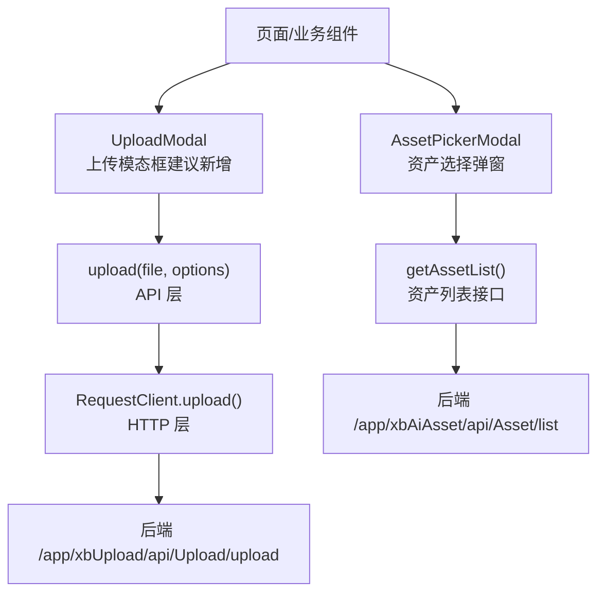
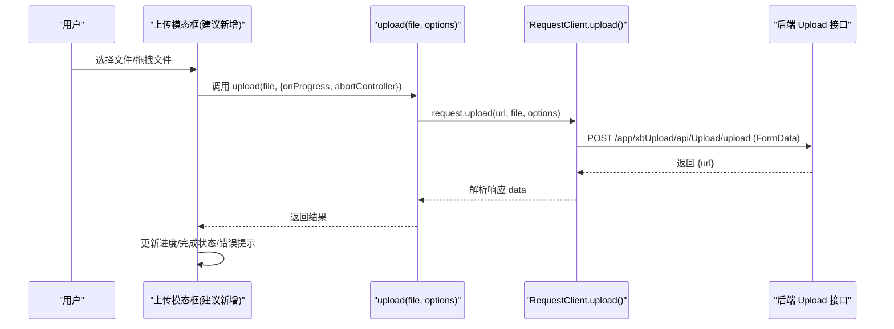
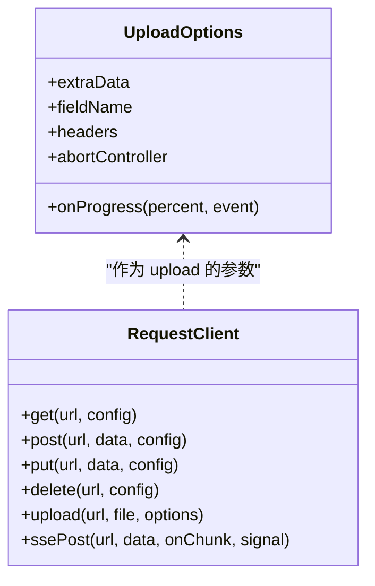
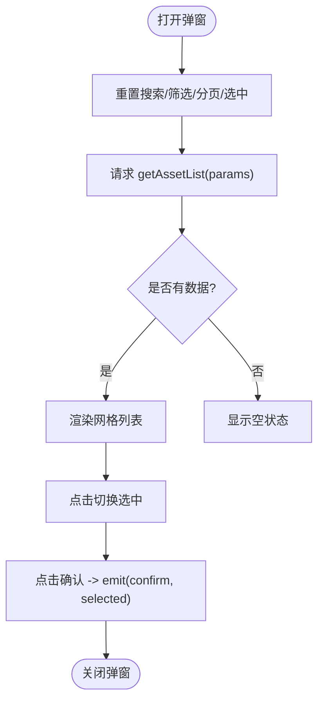
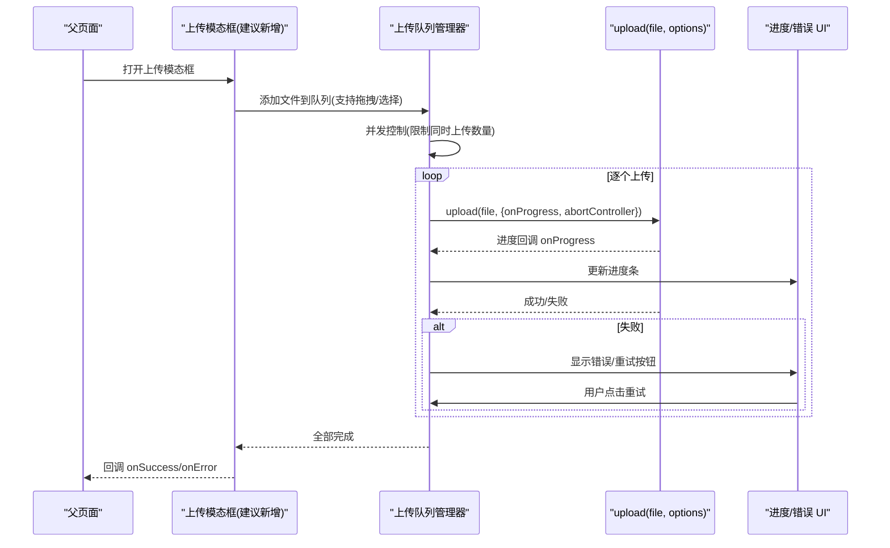
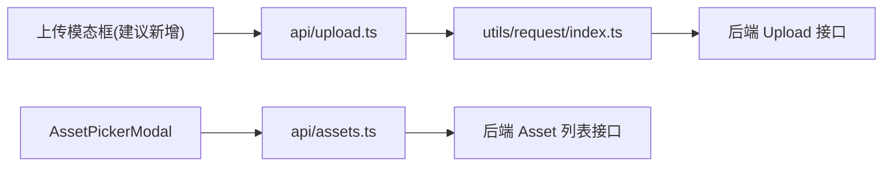

# 资产上传模态框

<cite>
**本文引用的文件**
- [frontend/src/api/upload.ts](file://frontend/src/api/upload.ts)
- [frontend/src/utils/request/index.ts](file://frontend/src/utils/request/index.ts)
- [frontend/src/components/AssetPickerModal/index.vue](file://frontend/src/components/AssetPickerModal/index.vue)
- [frontend/src/api/assets.ts](file://frontend/src/api/assets.ts)
- [frontend/src/stores/assets.ts](file://frontend/src/stores/assets.ts)
- [frontend/src/utils/image.ts](file://frontend/src/utils/image.ts)
</cite>

## 目录
1. [简介](#简介)
2. [项目结构](#项目结构)
3. [核心组件](#核心组件)
4. [架构总览](#架构总览)
5. [详细组件分析](#详细组件分析)
6. [依赖关系分析](#依赖关系分析)
7. [性能与体验优化](#性能与体验优化)
8. [故障排查指南](#故障排查指南)
9. [结论](#结论)
10. [附录：自定义配置与回调示例路径](#附录自定义配置与回调示例路径)

## 简介
本文件围绕“资产上传模态框”的完整实现进行系统化文档化，重点覆盖以下能力：
- 文件上传流程、进度条显示与错误处理机制
- 多文件上传、拖拽上传、文件类型验证与大小限制
- 断点续传、并发上传控制、取消上传与重试机制
- 如何自定义上传配置与处理上传回调

说明：当前仓库中未找到名为“资产上传模态框”的具体前端组件实现。因此，本文基于现有上传能力（请求封装与上传 API）与资产选择弹窗（AssetPickerModal）进行整合设计，给出可落地的实现方案与最佳实践，并提供可直接定位到源码的路径以便二次开发。

## 项目结构
与上传相关的核心代码位于前端模块：
- 上传 API 封装：frontend/src/api/upload.ts
- 通用请求客户端与上传方法：frontend/src/utils/request/index.ts
- 资产选择弹窗（用于展示已上传资产并选择）：frontend/src/components/AssetPickerModal/index.vue
- 资产数据模型与列表接口：frontend/src/api/assets.ts
- 本地素材状态管理（演示用）：frontend/src/stores/assets.ts
- 图片加载失败占位工具：frontend/src/utils/image.ts

图表来源
- [frontend/src/api/upload.ts:1-24](file://frontend/src/api/upload.ts#L1-L24)
- [frontend/src/utils/request/index.ts:82-121](file://frontend/src/utils/request/index.ts#L82-L121)
- [frontend/src/components/AssetPickerModal/index.vue:66-87](file://frontend/src/components/AssetPickerModal/index.vue#L66-L87)
- [frontend/src/api/assets.ts:98-103](file://frontend/src/api/assets.ts#L98-L103)

章节来源
- [frontend/src/api/upload.ts:1-24](file://frontend/src/api/upload.ts#L1-L24)
- [frontend/src/utils/request/index.ts:1-237](file://frontend/src/utils/request/index.ts#L1-L237)
- [frontend/src/components/AssetPickerModal/index.vue:1-227](file://frontend/src/components/AssetPickerModal/index.vue#L1-L227)
- [frontend/src/api/assets.ts:1-135](file://frontend/src/api/assets.ts#L1-L135)
- [frontend/src/stores/assets.ts:1-161](file://frontend/src/stores/assets.ts#L1-L161)
- [frontend/src/utils/image.ts](file://frontend/src/utils/image.ts)

## 核心组件
- 上传 API 封装
  - 提供 upload(file, options) 方法，支持 onProgress 进度回调与 abortController 取消上传。
  - 字段名 fieldName 默认 'file'，可通过 options 扩展 extraData、headers 等。
- 通用请求客户端 RequestClient
  - 统一拦截器（Token、白名单、错误处理）。
  - upload() 内部使用 FormData 发送，支持 onUploadProgress 计算百分比，支持 signal 取消，上传不设置超时。
- 资产选择弹窗 AssetPickerModal
  - 负责展示、搜索、分页与多选/单选资产，作为“上传后选择”的入口。
- 资产数据模型 assets.ts
  - 定义资产项、列表参数与响应结构，以及创建/更新/删除接口。

章节来源
- [frontend/src/api/upload.ts:1-24](file://frontend/src/api/upload.ts#L1-L24)
- [frontend/src/utils/request/index.ts:10-22](file://frontend/src/utils/request/index.ts#L10-L22)
- [frontend/src/utils/request/index.ts:82-121](file://frontend/src/utils/request/index.ts#L82-L121)
- [frontend/src/components/AssetPickerModal/index.vue:1-227](file://frontend/src/components/AssetPickerModal/index.vue#L1-L227)
- [frontend/src/api/assets.ts:1-135](file://frontend/src/api/assets.ts#L1-L135)

## 架构总览
从用户触发上传到服务端落盘的关键链路如下：

图表来源
- [frontend/src/api/upload.ts:15-23](file://frontend/src/api/upload.ts#L15-L23)
- [frontend/src/utils/request/index.ts:82-121](file://frontend/src/utils/request/index.ts#L82-L121)

## 详细组件分析

### 上传 API 与请求客户端
- 上传选项 UploadOptions
  - onProgress(percent, event): 进度回调，percent 范围 0~100
  - extraData: 额外表单字段
  - fieldName: 文件字段名，默认 'file'
  - headers: 自定义请求头
  - abortController: 用于中止上传
- RequestClient.upload()
  - 构造 FormData，附加文件与 extraData
  - 通过 axios.post 发起上传，监听 onUploadProgress 计算百分比
  - 支持 signal 取消；上传不设超时
  - 返回 Promise<T>，最终解包为 res.data.data

图表来源
- [frontend/src/utils/request/index.ts:10-22](file://frontend/src/utils/request/index.ts#L10-L22)
- [frontend/src/utils/request/index.ts:82-121](file://frontend/src/utils/request/index.ts#L82-L121)

章节来源
- [frontend/src/api/upload.ts:1-24](file://frontend/src/api/upload.ts#L1-L24)
- [frontend/src/utils/request/index.ts:1-237](file://frontend/src/utils/request/index.ts#L1-L237)

### 资产选择弹窗（AssetPickerModal）
- 功能要点
  - 支持按名称模糊搜索与类型筛选
  - 分页加载，跨页保持选中状态
  - 单选/多选模式，最大选择数限制
  - 打开时重置状态，关闭时触发 close，确认时触发 confirm(selected[])
- 与上传的关系
  - 该弹窗用于“选择已有资产”，并非上传入口。实际上传应在“上传模态框”中完成，完成后刷新或追加到列表供选择。

图表来源
- [frontend/src/components/AssetPickerModal/index.vue:66-87](file://frontend/src/components/AssetPickerModal/index.vue#L66-L87)
- [frontend/src/components/AssetPickerModal/index.vue:100-129](file://frontend/src/components/AssetPickerModal/index.vue#L100-L129)

章节来源
- [frontend/src/components/AssetPickerModal/index.vue:1-227](file://frontend/src/components/AssetPickerModal/index.vue#L1-L227)
- [frontend/src/api/assets.ts:98-103](file://frontend/src/api/assets.ts#L98-L103)

### 上传模态框（建议新增）
说明：仓库中未发现“上传模态框”的实现。建议在业务页面新增一个上传模态框，复用现有 upload API 与 RequestClient.upload，并结合以下能力完善体验：
- 多文件队列与并发控制
- 拖拽上传与点击选择
- 文件类型与大小校验
- 进度条与错误提示
- 取消上传与重试
- 上传成功后刷新资产列表或插入新条目

[此图为概念流程图，无需图表来源]

## 依赖关系分析
- 组件耦合
  - 上传模态框（建议新增）依赖 upload API 与 RequestClient.upload
  - AssetPickerModal 依赖资产列表接口 assets.ts
- 外部依赖
  - Axios 网络库（由 RequestClient 封装）
  - 后端 Upload 接口与 Asset 列表接口

图表来源
- [frontend/src/api/upload.ts:15-23](file://frontend/src/api/upload.ts#L15-L23)
- [frontend/src/utils/request/index.ts:82-121](file://frontend/src/utils/request/index.ts#L82-L121)
- [frontend/src/components/AssetPickerModal/index.vue:66-87](file://frontend/src/components/AssetPickerModal/index.vue#L66-L87)
- [frontend/src/api/assets.ts:98-103](file://frontend/src/api/assets.ts#L98-L103)

章节来源
- [frontend/src/api/upload.ts:1-24](file://frontend/src/api/upload.ts#L1-L24)
- [frontend/src/utils/request/index.ts:1-237](file://frontend/src/utils/request/index.ts#L1-L237)
- [frontend/src/components/AssetPickerModal/index.vue:1-227](file://frontend/src/components/AssetPickerModal/index.vue#L1-L227)
- [frontend/src/api/assets.ts:1-135](file://frontend/src/api/assets.ts#L1-L135)

## 性能与体验优化
- 并发上传控制
  - 维护上传队列与并发上限，避免浏览器连接数耗尽导致整体吞吐下降。
- 进度反馈
  - 使用 onProgress 实时更新进度条，对大文件分片上传时可按分片粒度聚合显示。
- 取消与重试
  - 利用 AbortController.signal 中断单个上传；失败时提供重试按钮与指数退避策略。
- 资源预取与缓存
  - 缩略图与媒体地址命中 CDN 缓存；首次加载后可做本地缓存策略。
- 错误边界
  - 网络异常、服务端错误、文件校验失败分别给出明确提示与恢复路径。

[本节为通用指导，不涉及具体文件分析]

## 故障排查指南
- 上传无进度
  - 检查是否传入 onProgress 且后端返回了 total 字节数。
  - 参考：RequestClient.upload 的 onUploadProgress 逻辑。
- 无法取消上传
  - 确认是否传入 abortController 并在需要时调用 abort()。
  - 参考：RequestClient.upload 的 signal 传递。
- 上传成功但列表未更新
  - 在上传成功后调用资产列表刷新或插入新记录。
  - 参考：AssetPickerModal 的 fetchAssets 与分页逻辑。
- 图片加载失败
  - 使用统一的图片错误占位处理。
  - 参考：AssetPickerModal 中的 onImgError 使用。

章节来源
- [frontend/src/utils/request/index.ts:106-121](file://frontend/src/utils/request/index.ts#L106-L121)
- [frontend/src/components/AssetPickerModal/index.vue:66-87](file://frontend/src/components/AssetPickerModal/index.vue#L66-L87)
- [frontend/src/components/AssetPickerModal/index.vue:180-186](file://frontend/src/components/AssetPickerModal/index.vue#L180-L186)

## 结论
- 当前仓库提供了稳定的上传基础能力（upload API 与 RequestClient.upload），可用于构建完整的“资产上传模态框”。
- 建议新增上传模态框组件，结合队列、并发、取消、重试与进度反馈，形成完善的上传体验。
- 上传完成后，应联动资产列表刷新或增量插入，确保用户在“资产选择弹窗”中能立即看到新上传的资源。

[本节为总结性内容，不涉及具体文件分析]

## 附录：自定义配置与回调示例路径
- 自定义上传字段名与额外表单字段
  - 参考路径：[frontend/src/api/upload.ts:15-23](file://frontend/src/api/upload.ts#L15-L23)、[frontend/src/utils/request/index.ts:82-121](file://frontend/src/utils/request/index.ts#L82-L121)
- 上传进度回调
  - 参考路径：[frontend/src/utils/request/index.ts:111-116](file://frontend/src/utils/request/index.ts#L111-L116)
- 取消上传
  - 参考路径：[frontend/src/utils/request/index.ts:117-118](file://frontend/src/utils/request/index.ts#L117-L118)
- 自定义请求头
  - 参考路径：[frontend/src/utils/request/index.ts:108-110](file://frontend/src/utils/request/index.ts#L108-L110)
- 上传成功后刷新资产列表
  - 参考路径：[frontend/src/components/AssetPickerModal/index.vue:66-87](file://frontend/src/components/AssetPickerModal/index.vue#L66-L87)
- 图片加载失败占位
  - 参考路径：[frontend/src/components/AssetPickerModal/index.vue:180-186](file://frontend/src/components/AssetPickerModal/index.vue#L180-L186)