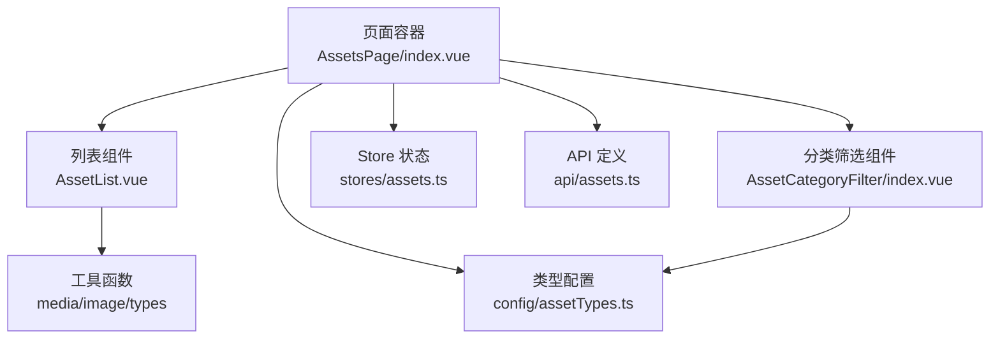
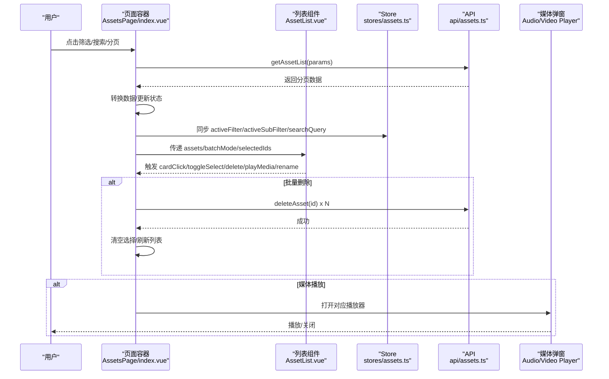
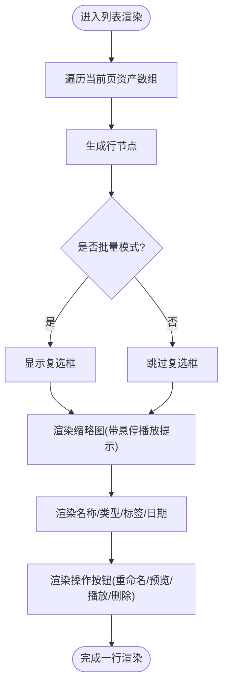
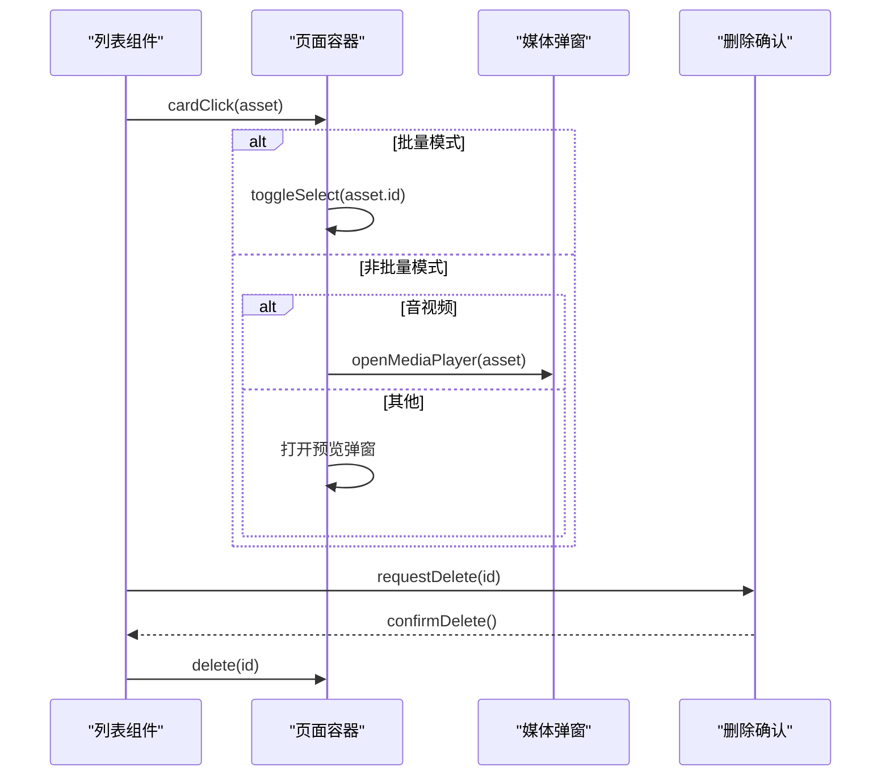
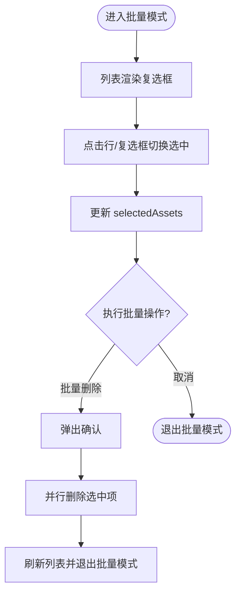
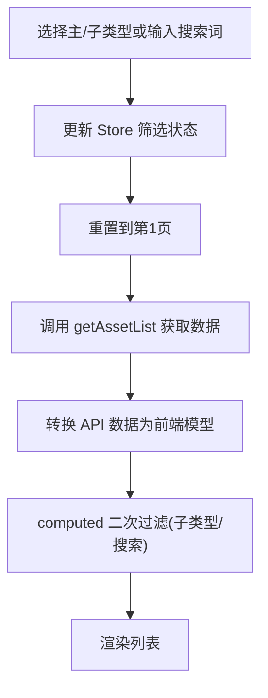
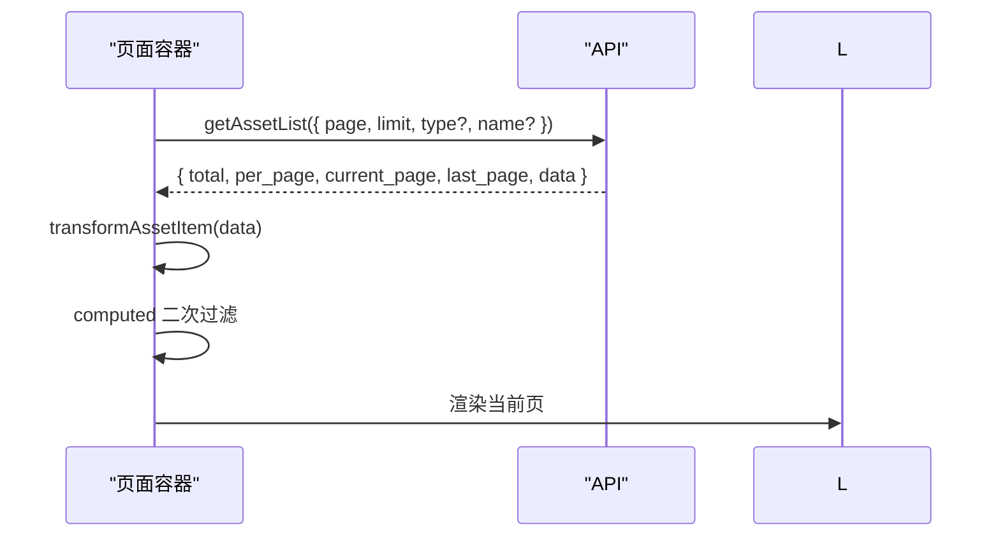
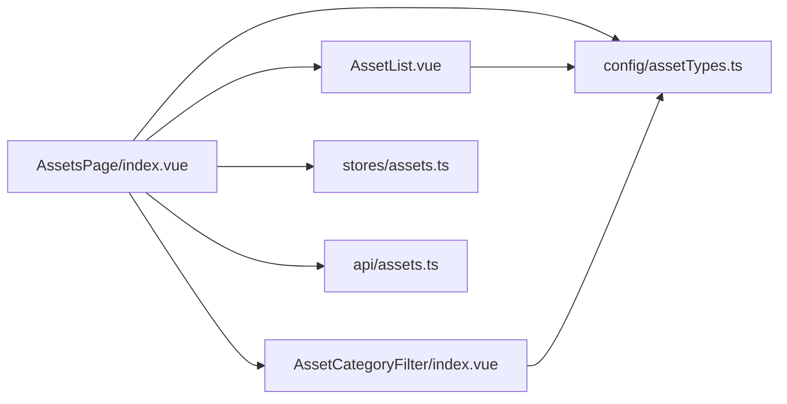

# 资产列表视图

<cite>
**本文引用的文件**
- [frontend/src/views/AssetsPage/index.vue](file://frontend/src/views/AssetsPage/index.vue)
- [frontend/src/views/AssetsPage/components/AssetList.vue](file://frontend/src/views/AssetsPage/components/AssetList.vue)
- [frontend/src/components/AssetCategoryFilter/index.vue](file://frontend/src/components/AssetCategoryFilter/index.vue)
- [frontend/src/stores/assets.ts](file://frontend/src/stores/assets.ts)
- [frontend/src/config/assetTypes.ts](file://frontend/src/config/assetTypes.ts)
- [frontend/src/api/assets.ts](file://frontend/src/api/assets.ts)
</cite>

## 目录
1. [简介](#简介)
2. [项目结构](#项目结构)
3. [核心组件](#核心组件)
4. [架构总览](#架构总览)
5. [详细组件分析](#详细组件分析)
6. [依赖关系分析](#依赖关系分析)
7. [性能与优化](#性能与优化)
8. [故障排查指南](#故障排查指南)
9. [结论](#结论)
10. [附录：扩展与自定义列配置示例](#附录扩展与自定义列配置示例)

## 简介
本文件围绕“资产列表视图”的列表布局、行项渲染、数据表格化展示、点击事件处理、批量选择模式、排序与筛选、长列表性能优化（含虚拟滚动方案）、键盘导航与无障碍访问，以及扩展与自定义列配置进行系统化说明。文档以仓库中现有实现为依据，并给出可落地的优化建议与扩展路径。

## 项目结构
资产列表视图由页面容器与多个子组件协作完成：
- 页面容器负责状态管理、API 交互、分页、筛选联动、批量操作与媒体播放弹窗控制。
- 列表组件负责行级渲染、删除确认、预览/播放触发等。
- 分类筛选组件提供主类型与子类型的折叠式筛选。
- Store 提供本地数据模型与过滤逻辑（用于演示与前端二次过滤）。
- 配置模块提供类型标签、子类型映射等元信息。
- API 模块定义后端接口契约与请求封装。

图表来源
- [frontend/src/views/AssetsPage/index.vue:1-473](file://frontend/src/views/AssetsPage/index.vue#L1-L473)
- [frontend/src/views/AssetsPage/components/AssetList.vue:1-108](file://frontend/src/views/AssetsPage/components/AssetList.vue#L1-L108)
- [frontend/src/components/AssetCategoryFilter/index.vue:1-112](file://frontend/src/components/AssetCategoryFilter/index.vue#L1-L112)
- [frontend/src/stores/assets.ts:1-161](file://frontend/src/stores/assets.ts#L1-L161)
- [frontend/src/config/assetTypes.ts:1-69](file://frontend/src/config/assetTypes.ts#L1-L69)
- [frontend/src/api/assets.ts:1-135](file://frontend/src/api/assets.ts#L1-L135)

章节来源
- [frontend/src/views/AssetsPage/index.vue:1-473](file://frontend/src/views/AssetsPage/index.vue#L1-L473)
- [frontend/src/views/AssetsPage/components/AssetList.vue:1-108](file://frontend/src/views/AssetsPage/components/AssetList.vue#L1-L108)
- [frontend/src/components/AssetCategoryFilter/index.vue:1-112](file://frontend/src/components/AssetCategoryFilter/index.vue#L1-L112)
- [frontend/src/stores/assets.ts:1-161](file://frontend/src/stores/assets.ts#L1-L161)
- [frontend/src/config/assetTypes.ts:1-69](file://frontend/src/config/assetTypes.ts#L1-L69)
- [frontend/src/api/assets.ts:1-135](file://frontend/src/api/assets.ts#L1-L135)

## 核心组件
- 页面容器（AssetsPage/index.vue）
  - 职责：聚合状态、发起 API 请求、分页、筛选联动、批量选择、打开预览/播放器、重命名与删除流程。
  - 关键能力：
    - 列表获取与错误处理：加载态、错误态、空态、分页切换。
    - 筛选联动：主类型与子类型筛选通过 Store 驱动，结合前端 computed 做二次过滤。
    - 批量模式：勾选多行后支持批量删除。
    - 媒体播放：根据资产类型自动打开音频或视频播放器弹窗。
- 列表组件（AssetList.vue）
  - 职责：将传入的资产数组渲染为行项；在批量模式下显示复选框；行内操作（预览/播放、重命名、删除）。
  - 交互：点击整行触发 cardClick；操作按钮触发 preview/playMedia/requestRename/delete 等事件。
- 分类筛选组件（AssetCategoryFilter/index.vue）
  - 职责：渲染主类型与子类型选项，支持展开/收起与计数显示；选中后向上层 emit select。
- Store（stores/assets.ts）
  - 职责：维护 Asset 类型定义、默认样例数据、搜索词与活跃筛选状态、基础增删与前端过滤方法。
- 类型配置（config/assetTypes.ts）
  - 职责：提供子类型映射、类型标签、是否具备子类型等辅助能力。
- API（api/assets.ts）
  - 职责：定义前后端类型映射、列表查询参数与响应结构、CRUD 接口。

章节来源
- [frontend/src/views/AssetsPage/index.vue:1-473](file://frontend/src/views/AssetsPage/index.vue#L1-L473)
- [frontend/src/views/AssetsPage/components/AssetList.vue:1-108](file://frontend/src/views/AssetsPage/components/AssetList.vue#L1-L108)
- [frontend/src/components/AssetCategoryFilter/index.vue:1-112](file://frontend/src/components/AssetCategoryFilter/index.vue#L1-L112)
- [frontend/src/stores/assets.ts:1-161](file://frontend/src/stores/assets.ts#L1-L161)
- [frontend/src/config/assetTypes.ts:1-69](file://frontend/src/config/assetTypes.ts#L1-L69)
- [frontend/src/api/assets.ts:1-135](file://frontend/src/api/assets.ts#L1-L135)

## 架构总览
以下序列图展示了从用户操作到数据刷新与 UI 更新的完整链路，包括筛选、搜索、分页、批量删除与媒体播放。

图表来源
- [frontend/src/views/AssetsPage/index.vue:76-182](file://frontend/src/views/AssetsPage/index.vue#L76-L182)
- [frontend/src/views/AssetsPage/components/AssetList.vue:22-45](file://frontend/src/views/AssetsPage/components/AssetList.vue#L22-L45)
- [frontend/src/api/assets.ts:101-134](file://frontend/src/api/assets.ts#L101-L134)
- [frontend/src/stores/assets.ts:133-149](file://frontend/src/stores/assets.ts#L133-L149)

## 详细组件分析

### 列表布局与行项渲染机制
- 布局结构
  - 每行包含：批量复选框（仅在批量模式显示）、缩略图、名称与标签、创建时间、操作按钮（重命名、预览/播放、删除）。
  - 缩略图区域对音视频素材悬停时显示播放图标，提示可播放。
- 渲染策略
  - 使用 v-for 遍历当前页数据，key 使用唯一 id，确保高效更新。
  - 行点击统一派发 cardClick，上层根据批量模式与资产类型决定是切换选中还是打开预览/播放器。
- 数据表格化展示
  - 行内字段：名称、类型标签、标签集合、创建日期。
  - 类型标签通过 getTypeLabel 统一输出，保证文案一致性。

图表来源
- [frontend/src/views/AssetsPage/components/AssetList.vue:48-96](file://frontend/src/views/AssetsPage/components/AssetList.vue#L48-L96)
- [frontend/src/config/assetTypes.ts:54-68](file://frontend/src/config/assetTypes.ts#L54-L68)

章节来源
- [frontend/src/views/AssetsPage/components/AssetList.vue:1-108](file://frontend/src/views/AssetsPage/components/AssetList.vue#L1-L108)
- [frontend/src/config/assetTypes.ts:1-69](file://frontend/src/config/assetTypes.ts#L1-L69)

### 点击事件处理与媒体播放
- 行点击
  - 批量模式：切换选中状态。
  - 非批量模式：音视频走播放器弹窗，其他类型走预览弹窗。
- 操作按钮
  - 预览/播放：根据类型分发至预览或媒体弹窗。
  - 重命名：向父组件请求打开重命名弹窗。
  - 删除：弹出确认框，确认后调用删除接口。

图表来源
- [frontend/src/views/AssetsPage/index.vue:225-275](file://frontend/src/views/AssetsPage/index.vue#L225-L275)
- [frontend/src/views/AssetsPage/components/AssetList.vue:22-45](file://frontend/src/views/AssetsPage/components/AssetList.vue#L22-L45)

章节来源
- [frontend/src/views/AssetsPage/index.vue:225-275](file://frontend/src/views/AssetsPage/index.vue#L225-L275)
- [frontend/src/views/AssetsPage/components/AssetList.vue:22-45](file://frontend/src/views/AssetsPage/components/AssetList.vue#L22-L45)

### 批量选择模式
- 入口：工具栏切换批量模式。
- 行为：
  - 列表行左侧显示复选框，选中行高亮。
  - 支持全选/反选（可在工具栏扩展），当前已支持逐行切换。
  - 批量删除：确认后并行调用删除接口，完成后清空选择并刷新列表。
- 状态：
  - selectedAssets 保存选中 ID 集合。
  - batchMode 控制批量模式开关。

图表来源
- [frontend/src/views/AssetsPage/index.vue:184-211](file://frontend/src/views/AssetsPage/index.vue#L184-L211)
- [frontend/src/views/AssetsPage/components/AssetList.vue:57-64](file://frontend/src/views/AssetsPage/components/AssetList.vue#L57-L64)

章节来源
- [frontend/src/views/AssetsPage/index.vue:184-211](file://frontend/src/views/AssetsPage/index.vue#L184-L211)
- [frontend/src/views/AssetsPage/components/AssetList.vue:57-64](file://frontend/src/views/AssetsPage/components/AssetList.vue#L57-L64)

### 排序与筛选功能
- 筛选
  - 主类型筛选：通过分类筛选组件选择，更新 store.activeFilter，并重置分页重新拉取。
  - 子类型筛选：仅对具备子类型的类型生效，更新 store.activeSubFilter，并在前端 computed 中对当前页数据进行二次过滤。
  - 搜索：输入关键词后按名称与标签模糊匹配，同时影响后端 name 参数与前端二次过滤。
- 排序
  - 当前未内置排序能力。建议在工具栏增加排序下拉（如按创建时间、名称），并通过后端排序参数或前端计算属性实现。

图表来源
- [frontend/src/views/AssetsPage/index.vue:127-169](file://frontend/src/views/AssetsPage/index.vue#L127-L169)
- [frontend/src/stores/assets.ts:133-149](file://frontend/src/stores/assets.ts#L133-L149)

章节来源
- [frontend/src/views/AssetsPage/index.vue:127-169](file://frontend/src/views/AssetsPage/index.vue#L127-L169)
- [frontend/src/stores/assets.ts:133-149](file://frontend/src/stores/assets.ts#L133-L149)

### 分页与数据流
- 分页参数：page、limit 由页面容器组装并传给后端。
- 响应结构：total、per_page、current_page、last_page、data。
- 数据流：
  - 页面容器负责分页切换与数据刷新。
  - 列表组件仅渲染当前页数据，避免全量渲染。

图表来源
- [frontend/src/views/AssetsPage/index.vue:76-105](file://frontend/src/views/AssetsPage/index.vue#L76-L105)
- [frontend/src/api/assets.ts:32-58](file://frontend/src/api/assets.ts#L32-L58)

章节来源
- [frontend/src/views/AssetsPage/index.vue:76-105](file://frontend/src/views/AssetsPage/index.vue#L76-L105)
- [frontend/src/api/assets.ts:32-58](file://frontend/src/api/assets.ts#L32-L58)

## 依赖关系分析
- 组件耦合
  - 页面容器与列表组件通过 props/emits 解耦，职责清晰。
  - 分类筛选组件与页面容器通过事件通信，低耦合。
- 外部依赖
  - API 模块提供统一的请求封装与类型约束。
  - Store 提供类型定义与前端过滤能力（便于演示与快速迭代）。
  - 配置模块提供类型标签与子类型映射。

图表来源
- [frontend/src/views/AssetsPage/index.vue:1-20](file://frontend/src/views/AssetsPage/index.vue#L1-L20)
- [frontend/src/views/AssetsPage/components/AssetList.vue:1-6](file://frontend/src/views/AssetsPage/components/AssetList.vue#L1-L6)
- [frontend/src/components/AssetCategoryFilter/index.vue:1-4](file://frontend/src/components/AssetCategoryFilter/index.vue#L1-L4)
- [frontend/src/stores/assets.ts:1-16](file://frontend/src/stores/assets.ts#L1-L16)
- [frontend/src/config/assetTypes.ts:1-16](file://frontend/src/config/assetTypes.ts#L1-L16)
- [frontend/src/api/assets.ts:1-31](file://frontend/src/api/assets.ts#L1-L31)

章节来源
- [frontend/src/views/AssetsPage/index.vue:1-20](file://frontend/src/views/AssetsPage/index.vue#L1-L20)
- [frontend/src/views/AssetsPage/components/AssetList.vue:1-6](file://frontend/src/views/AssetsPage/components/AssetList.vue#L1-L6)
- [frontend/src/components/AssetCategoryFilter/index.vue:1-4](file://frontend/src/components/AssetCategoryFilter/index.vue#L1-L4)
- [frontend/src/stores/assets.ts:1-16](file://frontend/src/stores/assets.ts#L1-L16)
- [frontend/src/config/assetTypes.ts:1-16](file://frontend/src/config/assetTypes.ts#L1-L16)
- [frontend/src/api/assets.ts:1-31](file://frontend/src/api/assets.ts#L1-L31)

## 性能与优化
- 当前实现要点
  - 分页加载：每次只渲染一页数据，降低 DOM 压力。
  - 前端二次过滤：在已分页的数据上再做子类型与搜索过滤，减少不必要的网络请求。
  - 图片错误兜底：使用 onImgError 处理加载失败。
- 长列表优化建议（虚拟滚动）
  - 目标：当单页数据量大时，仅渲染可视区域内的行项，显著降低渲染开销。
  - 推荐方案：
    - 使用成熟的虚拟滚动库（如 vue-virtual-scroller），将列表替换为虚拟滚动容器。
    - 固定行高或使用动态行高估算器，提升滚动流畅度。
    - 保持 key 稳定且唯一，避免不必要的重渲染。
  - 实施步骤：
    - 引入虚拟滚动组件，包裹列表容器。
    - 将 assets 作为数据源传入，设置 itemHeight 与预估高度。
    - 保留现有事件绑定（cardClick、toggleSelect、delete 等），确保交互不变。
- 其他优化
  - 防抖搜索：对搜索输入增加防抖，减少频繁请求与计算。
  - 懒加载图片：结合 IntersectionObserver 延迟加载缩略图。
  - 预取下一页：在接近末尾时预取下一页数据，提升翻页体验。
  - 去抖动批量删除：避免重复提交。

[本节为通用优化建议，不直接分析具体文件]

## 故障排查指南
- 列表为空
  - 检查 loading/error 分支是否正确显示。
  - 确认 API 返回结构与分页参数是否正确。
- 筛选无效
  - 核对 activeFilter/activeSubFilter 是否与数据类型一致。
  - 确认前端 computed 过滤条件与后端 type/name 参数是否协同工作。
- 批量删除失败
  - 检查并发删除的错误处理与重试策略。
  - 确认删除成功后是否刷新列表与清空选择。
- 媒体无法播放
  - 校验 mediaUrl 是否存在与跨域策略。
  - 确认播放器弹窗可见性与资源加载日志。

章节来源
- [frontend/src/views/AssetsPage/index.vue:97-105](file://frontend/src/views/AssetsPage/index.vue#L97-L105)
- [frontend/src/views/AssetsPage/index.vue:200-211](file://frontend/src/views/AssetsPage/index.vue#L200-L211)
- [frontend/src/views/AssetsPage/index.vue:257-275](file://frontend/src/views/AssetsPage/index.vue#L257-L275)

## 结论
资产列表视图通过清晰的组件分层与状态管理，实现了基础的列表展示、筛选、搜索、分页、批量操作与媒体播放。针对长列表场景，建议引入虚拟滚动与图片懒加载等优化手段，进一步提升用户体验。后续可扩展排序、更多筛选维度与更丰富的列配置，以满足复杂业务需求。

[本节为总结性内容，不直接分析具体文件]

## 附录：扩展与自定义列配置示例
- 扩展列配置思路
  - 在配置模块中新增列定义（如“来源”、“时长”、“大小”等），并提供格式化函数。
  - 在列表组件中根据列配置动态渲染单元格。
  - 在工具栏提供列显示/隐藏的控制面板。
- 示例路径参考
  - 列配置定义位置：[frontend/src/config/assetTypes.ts:1-69](file://frontend/src/config/assetTypes.ts#L1-L69)
  - 列表渲染入口：[frontend/src/views/AssetsPage/components/AssetList.vue:48-96](file://frontend/src/views/AssetsPage/components/AssetList.vue#L48-L96)
  - 页面容器集成点：[frontend/src/views/AssetsPage/index.vue:380-392](file://frontend/src/views/AssetsPage/index.vue#L380-L392)

章节来源
- [frontend/src/config/assetTypes.ts:1-69](file://frontend/src/config/assetTypes.ts#L1-L69)
- [frontend/src/views/AssetsPage/components/AssetList.vue:48-96](file://frontend/src/views/AssetsPage/components/AssetList.vue#L48-L96)
- [frontend/src/views/AssetsPage/index.vue:380-392](file://frontend/src/views/AssetsPage/index.vue#L380-L392)