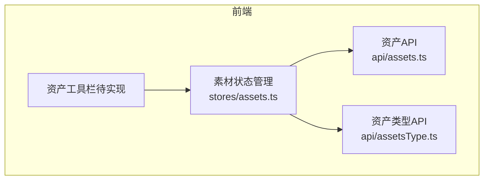
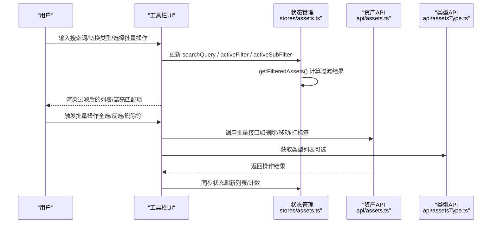
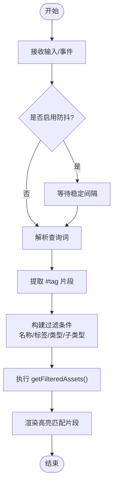
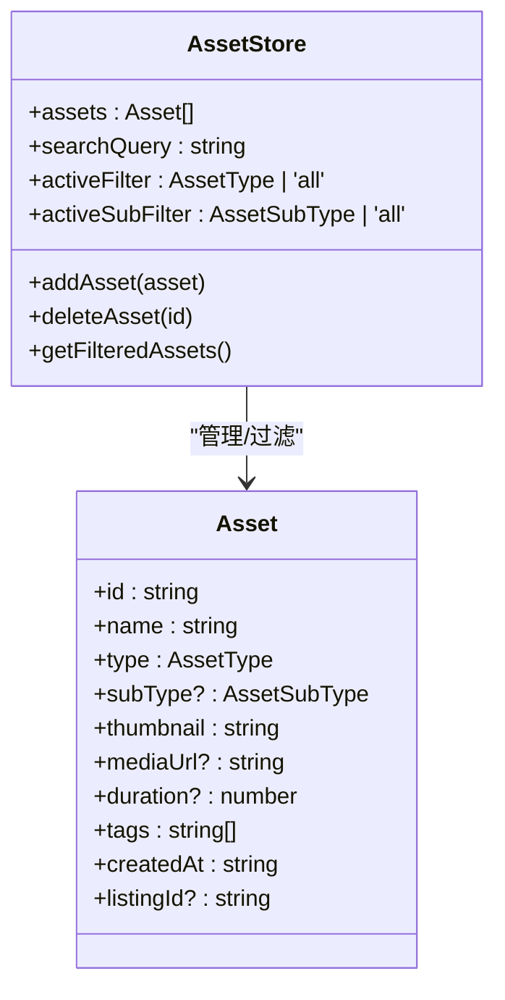
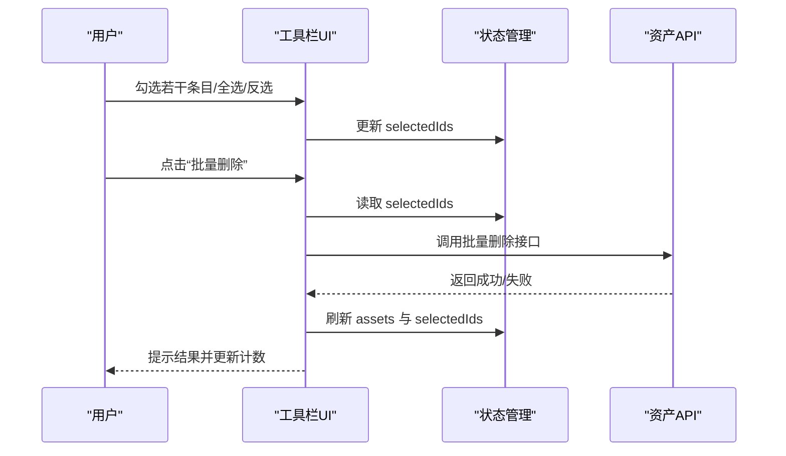
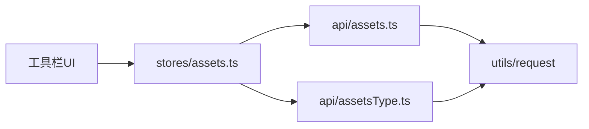

# 资产工具栏

<cite>
**本文引用的文件**   
- [assets.ts](file://frontend/src/api/assets.ts)
- [assetsType.ts](file://frontend/src/api/assetsType.ts)
- [assets.ts（状态管理）](file://frontend/src/stores/assets.ts)
</cite>

## 目录
1. [简介](#简介)
2. [项目结构](#项目结构)
3. [核心组件](#核心组件)
4. [架构总览](#架构总览)
5. [详细组件分析](#详细组件分析)
6. [依赖分析](#依赖分析)
7. [性能考虑](#性能考虑)
8. [故障排查指南](#故障排查指南)
9. [结论](#结论)
10. [附录](#附录)

## 简介
本文件围绕“资产工具栏”的前端实现进行系统化文档化，重点覆盖以下能力：
- 搜索功能：实时搜索、标签快速搜索、搜索历史记忆、搜索结果高亮
- 视图切换机制：主类型与子类型的筛选联动
- 批量操作模式：选择状态管理、全选/反选、已选项计数、操作按钮组
- 扩展方式：如何扩展工具栏功能与自定义搜索行为

说明：仓库中未找到具体工具栏的 Vue 组件源码，因此本文基于现有 API 与状态管理模块，给出可落地的实现方案与最佳实践。

## 项目结构
与资产工具栏直接相关的前端代码主要包含：
- API 层：资产列表、详情、增删改查接口定义；资产类型列表接口定义
- 状态管理层：素材数据、筛选条件、过滤逻辑等

图表来源
- [assets.ts（状态管理）:43-159](file://frontend/src/stores/assets.ts#L43-L159)
- [assets.ts:98-134](file://frontend/src/api/assets.ts#L98-L134)
- [assetsType.ts:21-26](file://frontend/src/api/assetsType.ts#L21-L26)

章节来源
- [assets.ts（状态管理）:43-159](file://frontend/src/stores/assets.ts#L43-L159)
- [assets.ts:98-134](file://frontend/src/api/assets.ts#L98-L134)
- [assetsType.ts:21-26](file://frontend/src/api/assetsType.ts#L21-L26)

## 核心组件
本节聚焦于与工具栏强相关的两个核心部分：
- 状态管理（stores/assets.ts）：维护素材集合、筛选条件与过滤结果
- API 层（api/assets.ts、api/assetsType.ts）：提供后端交互契约

要点
- 素材模型：包含 id、name、type、subType、tags、mediaUrl、duration、createdAt 等字段
- 筛选维度：主类型（type）、子类型（subType）、关键词（searchQuery）
- 过滤函数：getFilteredAssets 支持多条件组合过滤
- 基础 CRUD：addAsset、deleteAsset 用于本地演示数据的增删

章节来源
- [assets.ts（状态管理）:18-40](file://frontend/src/stores/assets.ts#L18-L40)
- [assets.ts（状态管理）:108-149](file://frontend/src/stores/assets.ts#L108-L149)
- [assets.ts:8-30](file://frontend/src/api/assets.ts#L8-L30)
- [assetsType.ts:3-19](file://frontend/src/api/assetsType.ts#L3-L19)

## 架构总览
从“输入—处理—输出”的角度，资产工具栏的数据流如下：

图表来源
- [assets.ts（状态管理）:108-149](file://frontend/src/stores/assets.ts#L108-L149)
- [assets.ts:98-134](file://frontend/src/api/assets.ts#L98-L134)
- [assetsType.ts:21-26](file://frontend/src/api/assetsType.ts#L21-L26)

## 详细组件分析

### 搜索功能实现
目标
- 实时搜索：在输入时即时过滤
- 标签快速搜索：同时匹配名称与标签
- 搜索历史记忆：持久化最近搜索词
- 搜索结果高亮：对匹配文本进行视觉强调

实现建议
- 实时搜索
  - 将 searchQuery 绑定到输入框，使用防抖减少频繁过滤
  - 在 getFilteredAssets 中按 name 与 tags 进行大小写不敏感匹配
- 标签快速搜索
  - 支持以 #tag 语法快速定位标签
  - 解析输入中的 #tag 片段并加入过滤条件
- 搜索历史记忆
  - 使用 localStorage 保存最近 N 条搜索记录
  - 提供清空历史与点击回填能力
- 搜索结果高亮
  - 在渲染层对匹配片段进行包裹与样式高亮
  - 注意仅高亮可见文本，避免影响媒体元素

流程图（算法级）

章节来源
- [assets.ts（状态管理）:108-149](file://frontend/src/stores/assets.ts#L108-L149)

### 视图切换机制
目标
- 主类型筛选：角色/背景/表情/道具/动作/特效/音色/音效/视频
- 子类型筛选：根据主类型动态展示可用子类型
- 联动重置：切换主类型时自动清理无效的子类型选择

实现建议
- activeFilter 与 activeSubFilter 作为响应式状态
- 当 activeFilter 变化时，校验当前 activeSubFilter 是否仍有效，否则重置为 all
- 渲染侧根据 activeFilter 动态生成子类型选项

类图（概念映射）

图表来源
- [assets.ts（状态管理）:18-40](file://frontend/src/stores/assets.ts#L18-L40)
- [assets.ts（状态管理）:43-159](file://frontend/src/stores/assets.ts#L43-L159)

章节来源
- [assets.ts（状态管理）:108-149](file://frontend/src/stores/assets.ts#L108-L149)

### 批量操作模式
目标
- 选择状态管理：维护已选 ID 集合
- 全选/反选：基于当前过滤结果或全量数据
- 已选项计数：实时显示已选数量
- 操作按钮组：批量删除、批量打标签、批量移动分类等

实现建议
- 新增 selectedIds: Set<string> 存储已选 ID
- 全选：selectedIds = new Set(当前过滤结果的 id 集合)
- 反选：遍历当前过滤结果，若已在选中集合则移除，否则添加
- 计数：computed(selectedIds.size)
- 批量操作：
  - 先校验 selectedIds 非空
  - 调用对应 API（例如批量删除），成功后刷新列表与计数
  - 失败时保留选择状态并提示错误

序列图（批量删除）

章节来源
- [assets.ts（状态管理）:108-149](file://frontend/src/stores/assets.ts#L108-L149)
- [assets.ts:125-134](file://frontend/src/api/assets.ts#L125-L134)

### 搜索历史记忆
目标
- 持久化最近 N 条搜索词
- 支持点击回填与一键清空
- 避免重复项，保持时间顺序

实现建议
- 使用 localStorage 存储 JSON 数组
- 写入策略：新词置前，去重，限制长度（如最多 20 条）
- 读取策略：在工具栏初始化时加载历史记录
- 交互：下拉面板展示历史，点击回填至搜索框

章节来源
- [assets.ts（状态管理）:108-149](file://frontend/src/stores/assets.ts#L108-L149)

### 搜索结果高亮
目标
- 对名称与标签中的匹配片段进行高亮
- 避免误伤 HTML 标签与媒体内容
- 支持多关键词高亮

实现建议
- 将搜索词拆分为多个 token（支持 #tag 与空格分隔）
- 使用正则替换匹配片段为带样式的包裹节点
- 仅在文本节点上应用高亮，跳过 img/video/audio 等元素

章节来源
- [assets.ts（状态管理）:141-147](file://frontend/src/stores/assets.ts#L141-L147)

### 扩展工具栏与自定义搜索
目标
- 在不改动核心状态的前提下，扩展新的筛选维度或搜索行为
- 通过组合现有 API 与 store 方法实现

示例思路
- 新增“来源”筛选：在 store 中增加 activeSource，并在 getFilteredAssets 中追加过滤条件
- 自定义搜索：在输入事件中预处理 query（如去除停用词、同义词扩展），再更新 searchQuery
- 接入真实数据：在工具栏初始化时调用 api/assets.ts 的 getAssetList，并将结果注入 store.assets

章节来源
- [assets.ts（状态管理）:132-149](file://frontend/src/stores/assets.ts#L132-L149)
- [assets.ts:98-134](file://frontend/src/api/assets.ts#L98-L134)

## 依赖分析
- 组件耦合
  - 工具栏 UI 依赖 stores/assets.ts 提供的状态与方法
  - 状态管理依赖 api/assets.ts 与 api/assetsType.ts 的接口契约
- 外部依赖
  - 请求封装：utils/request（由 API 层统一使用）
  - 类型定义：AssetItem、AssetListParams 等来自 api/assets.ts

图表来源
- [assets.ts（状态管理）:43-159](file://frontend/src/stores/assets.ts#L43-L159)
- [assets.ts:98-134](file://frontend/src/api/assets.ts#L98-L134)
- [assetsType.ts:21-26](file://frontend/src/api/assetsType.ts#L21-L26)

章节来源
- [assets.ts（状态管理）:43-159](file://frontend/src/stores/assets.ts#L43-L159)
- [assets.ts:98-134](file://frontend/src/api/assets.ts#L98-L134)
- [assetsType.ts:21-26](file://frontend/src/api/assetsType.ts#L21-L26)

## 性能考虑
- 防抖与节流
  - 搜索输入使用防抖（如 200~300ms），降低频繁过滤开销
  - 滚动加载时使用节流控制加载更多
- 过滤复杂度
  - 当前过滤为 O(n)，n 为当前数据集规模
  - 大数据集建议分页+服务端过滤，前端仅做轻量二次过滤
- 渲染优化
  - 虚拟列表渲染长列表
  - 高亮仅在可见区域计算
- 缓存
  - 类型列表与热门标签可短期缓存
  - 搜索历史使用 localStorage 持久化

[本节为通用指导，不涉及具体文件分析]

## 故障排查指南
常见问题与建议
- 搜索无结果
  - 检查 searchQuery 是否为空字符串或仅空白字符
  - 确认 activeFilter/activeSubFilter 是否与数据一致
- 批量操作无效
  - 校验 selectedIds 是否为空
  - 检查 API 返回状态码与业务码
- 高亮异常
  - 确保只对文本节点高亮，避免破坏 DOM 结构
  - 检查正则表达式是否正确转义特殊字符
- 历史记忆丢失
  - 检查 localStorage 权限与存储空间
  - 确认序列化/反序列化是否正常

章节来源
- [assets.ts（状态管理）:108-149](file://frontend/src/stores/assets.ts#L108-L149)
- [assets.ts:98-134](file://frontend/src/api/assets.ts#L98-L134)

## 结论
本文基于现有 API 与状态管理模块，给出了资产工具栏的完整实现蓝图，涵盖搜索、视图切换、批量操作、历史记忆与高亮等关键能力，并提供扩展与优化的实践建议。后续可在 UI 层落地这些方案，以获得流畅且可扩展的资产管理体验。

[本节为总结性内容，不涉及具体文件分析]

## 附录
- 术语
  - 主类型：asset type（如角色、背景、表情等）
  - 子类型：asset subType（如音色、音效、视频下的细分）
  - 已选项：selectedIds 集合
- 参考路径
  - 过滤逻辑：stores/assets.ts 中的 getFilteredAssets
  - 资产接口：api/assets.ts 中的 getAssetList、createAsset、updateAsset、deleteAsset
  - 类型接口：api/assetsType.ts 中的 getAssetTypeList

章节来源
- [assets.ts（状态管理）:132-149](file://frontend/src/stores/assets.ts#L132-L149)
- [assets.ts:98-134](file://frontend/src/api/assets.ts#L98-L134)
- [assetsType.ts:21-26](file://frontend/src/api/assetsType.ts#L21-L26)