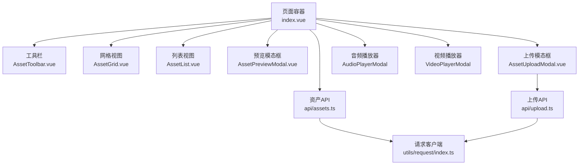
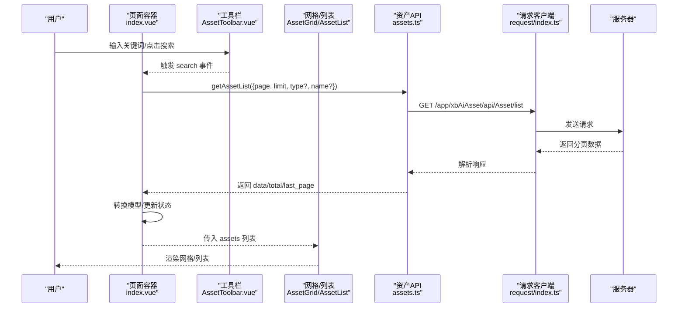
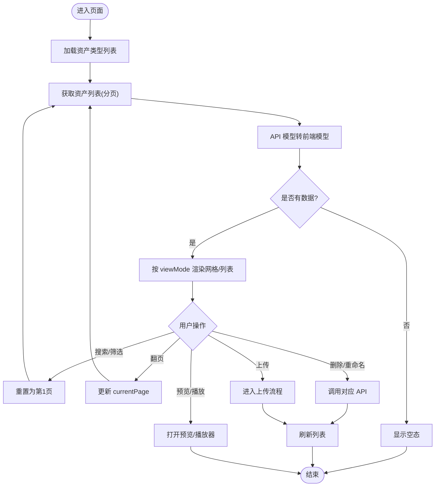
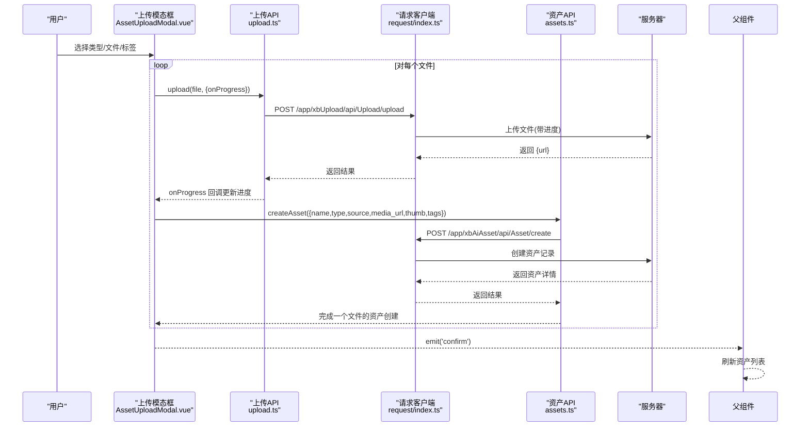
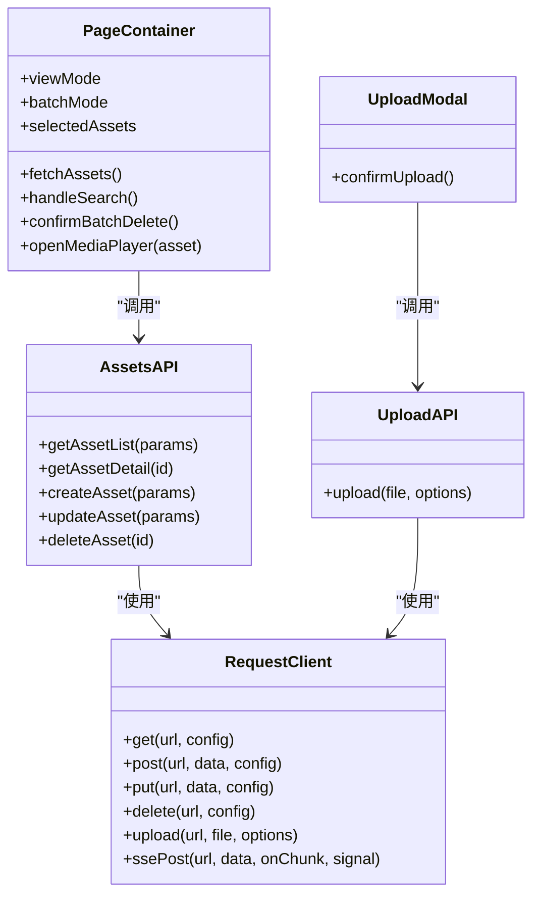

# 资产管理页面

<cite>
**本文引用的文件**
- [frontend/src/views/AssetsPage/index.vue](file://frontend/src/views/AssetsPage/index.vue)
- [frontend/src/views/AssetsPage/components/AssetToolbar.vue](file://frontend/src/views/AssetsPage/components/AssetToolbar.vue)
- [frontend/src/views/AssetsPage/components/AssetGrid.vue](file://frontend/src/views/AssetsPage/components/AssetGrid.vue)
- [frontend/src/views/AssetsPage/components/AssetList.vue](file://frontend/src/views/AssetsPage/components/AssetList.vue)
- [frontend/src/views/AssetsPage/components/AssetPreviewModal.vue](file://frontend/src/views/AssetsPage/components/AssetPreviewModal.vue)
- [frontend/src/views/AssetsPage/components/AssetUploadModal.vue](file://frontend/src/views/AssetsPage/components/AssetUploadModal.vue)
- [frontend/src/api/assets.ts](file://frontend/src/api/assets.ts)
- [frontend/src/api/upload.ts](file://frontend/src/api/upload.ts)
- [frontend/src/utils/request/index.ts](file://frontend/src/utils/request/index.ts)
- [frontend/src/stores/assets.ts](file://frontend/src/stores/assets.ts)
</cite>

## 目录
1. [简介](#简介)
2. [项目结构](#项目结构)
3. [核心组件](#核心组件)
4. [架构总览](#架构总览)
5. [详细组件分析](#详细组件分析)
6. [依赖关系分析](#依赖关系分析)
7. [性能与体验优化](#性能与体验优化)
8. [故障排查指南](#故障排查指南)
9. [结论](#结论)

## 简介
本文件面向资产管理页面的前端实现，系统性梳理资产列表的网格/列表视图切换、预览模态框、上传模态框与工具栏的实现逻辑；深入讲解资产的增删改查（CRUD）、批量处理、搜索过滤、分页加载等核心能力；并覆盖文件上传进度管理、大文件处理策略、图片预览优化与整体用户体验设计要点。文档同时提供代码级架构图与流程图，帮助读者快速理解数据流与控制流。

## 项目结构
资产管理页面采用“页面容器 + 子组件”的拆分方式：
- 页面容器负责状态编排、API 调用、事件分发与弹窗控制
- 子组件聚焦展示与交互细节（工具栏、网格、列表、预览、上传）
- API 层封装 HTTP 请求与类型定义
- 通用请求客户端统一拦截器、上传进度与 SSE 支持
- Store 提供全局筛选状态与示例数据（当前页面主要使用本地 ref 驱动）

图表来源
- [frontend/src/views/AssetsPage/index.vue:1-473](file://frontend/src/views/AssetsPage/index.vue#L1-L473)
- [frontend/src/views/AssetsPage/components/AssetToolbar.vue:1-98](file://frontend/src/views/AssetsPage/components/AssetToolbar.vue#L1-L98)
- [frontend/src/views/AssetsPage/components/AssetGrid.vue:1-97](file://frontend/src/views/AssetsPage/components/AssetGrid.vue#L1-L97)
- [frontend/src/views/AssetsPage/components/AssetList.vue:1-108](file://frontend/src/views/AssetsPage/components/AssetList.vue#L1-L108)
- [frontend/src/views/AssetsPage/components/AssetPreviewModal.vue:1-50](file://frontend/src/views/AssetsPage/components/AssetPreviewModal.vue#L1-L50)
- [frontend/src/views/AssetsPage/components/AssetUploadModal.vue:1-273](file://frontend/src/views/AssetsPage/components/AssetUploadModal.vue#L1-L273)
- [frontend/src/api/assets.ts:1-135](file://frontend/src/api/assets.ts#L1-L135)
- [frontend/src/api/upload.ts:1-24](file://frontend/src/api/upload.ts#L1-L24)
- [frontend/src/utils/request/index.ts:1-237](file://frontend/src/utils/request/index.ts#L1-L237)

章节来源
- [frontend/src/views/AssetsPage/index.vue:1-473](file://frontend/src/views/AssetsPage/index.vue#L1-L473)

## 核心组件
- 页面容器 index.vue
  - 维护视图模式、批量模式、选中项、分页、搜索词、错误与加载状态
  - 负责 API 调用、数据转换、筛选与分页联动、批量删除、重命名、媒体播放与预览
- 工具栏 AssetToolbar.vue
  - 提供搜索输入、标签快捷筛选、批量编辑开关、已选项计数、删除入口、网格/列表视图切换
- 网格视图 AssetGrid.vue
  - 卡片式布局，悬停显示操作按钮，批量模式下显示勾选框，触发重命名/删除事件
- 列表视图 AssetList.vue
  - 行式布局，显示缩略图、名称、类型、标签、创建时间，支持预览/播放/重命名/删除
- 预览模态框 AssetPreviewModal.vue
  - 大图预览，展示名称、类型、标签与创建时间
- 上传模态框 AssetUploadModal.vue
  - 选择资产类型、拖拽/多选文件、标签选择、上传进度条、错误提示、成功后回调刷新

章节来源
- [frontend/src/views/AssetsPage/components/AssetToolbar.vue:1-98](file://frontend/src/views/AssetsPage/components/AssetToolbar.vue#L1-L98)
- [frontend/src/views/AssetsPage/components/AssetGrid.vue:1-97](file://frontend/src/views/AssetsPage/components/AssetGrid.vue#L1-L97)
- [frontend/src/views/AssetsPage/components/AssetList.vue:1-108](file://frontend/src/views/AssetsPage/components/AssetList.vue#L1-L108)
- [frontend/src/views/AssetsPage/components/AssetPreviewModal.vue:1-50](file://frontend/src/views/AssetsPage/components/AssetPreviewModal.vue#L1-L50)
- [frontend/src/views/AssetsPage/components/AssetUploadModal.vue:1-273](file://frontend/src/views/AssetsPage/components/AssetUploadModal.vue#L1-L273)

## 架构总览
从用户操作到数据落库的关键路径如下：
- 列表加载：页面容器组装查询参数 -> 调用资产列表接口 -> 转换为前端模型 -> 渲染网格/列表
- 搜索与筛选：工具栏触发搜索 -> 更新 store 或本地搜索词 -> 重置页码 -> 重新拉取
- 批量删除：批量模式勾选 -> 确认弹窗 -> 逐个删除 -> 刷新列表
- 上传流程：选择类型与文件 -> 逐文件上传 -> 创建资产记录 -> 关闭弹窗并刷新
- 预览与播放：非音视频打开预览模态框；音视频打开对应播放器模态框

图表来源
- [frontend/src/views/AssetsPage/index.vue:76-105](file://frontend/src/views/AssetsPage/index.vue#L76-L105)
- [frontend/src/api/assets.ts:101-103](file://frontend/src/api/assets.ts#L101-L103)
- [frontend/src/utils/request/index.ts:60-63](file://frontend/src/utils/request/index.ts#L60-L63)

## 详细组件分析

### 页面容器（index.vue）
- 视图与批量模式
  - viewMode 控制网格/列表渲染分支
  - batchMode 控制是否进入批量选择模式
- 搜索与筛选
  - 工具栏搜索输入双向绑定，回车触发搜索
  - 侧边分类筛选通过 store.activeFilter 与 activeSubFilter 驱动
  - 前端二次过滤：子类型与标签匹配
- 分页加载
  - 固定 pageSize=20，currentPage 变化时重新拉取
  - last_page 用于计算总页数
- CRUD 操作
  - 新增：上传完成后由上传模态框回调触发刷新
  - 读取：getAssetList 获取分页数据
  - 更新：重命名弹窗调用 updateAsset
  - 删除：单个删除与批量删除分别调用 deleteAsset
- 媒体播放与预览
  - 根据类型判断打开音频/视频播放器或预览模态框
- 错误与空态
  - loading/error 状态控制加载与错误提示
  - 空态引导跳转 AI 生成页面

图表来源
- [frontend/src/views/AssetsPage/index.vue:126-145](file://frontend/src/views/AssetsPage/index.vue#L126-L145)
- [frontend/src/views/AssetsPage/index.vue:76-105](file://frontend/src/views/AssetsPage/index.vue#L76-L105)
- [frontend/src/views/AssetsPage/index.vue:156-169](file://frontend/src/views/AssetsPage/index.vue#L156-L169)
- [frontend/src/views/AssetsPage/index.vue:177-182](file://frontend/src/views/AssetsPage/index.vue#L177-L182)
- [frontend/src/views/AssetsPage/index.vue:216-223](file://frontend/src/views/AssetsPage/index.vue#L216-L223)
- [frontend/src/views/AssetsPage/index.vue:301-315](file://frontend/src/views/AssetsPage/index.vue#L301-L315)
- [frontend/src/views/AssetsPage/index.vue:226-236](file://frontend/src/views/AssetsPage/index.vue#L226-L236)

章节来源
- [frontend/src/views/AssetsPage/index.vue:1-473](file://frontend/src/views/AssetsPage/index.vue#L1-L473)

### 工具栏（AssetToolbar.vue）
- 功能点
  - 搜索输入与按钮触发搜索事件
  - 常用标签快捷筛选，点击后触发 searchByTag
  - 批量编辑开关，显示已选项数量与批量删除入口
  - 网格/列表视图切换按钮
- 交互细节
  - 批量模式下仅显示勾选与删除相关控件
  - 视图切换通过 v-model 双向绑定父组件 viewMode

章节来源
- [frontend/src/views/AssetsPage/components/AssetToolbar.vue:1-98](file://frontend/src/views/AssetsPage/components/AssetToolbar.vue#L1-L98)

### 网格视图（AssetGrid.vue）
- 展示
  - 五列网格，图片占满卡片区域，悬停放大效果
  - 音视频卡片悬停显示播放图标
  - 悬停显示重命名与删除按钮
- 交互
  - 普通模式点击卡片：根据类型决定预览或播放
  - 批量模式点击卡片：切换选中状态
  - 删除前弹出确认弹窗

章节来源
- [frontend/src/views/AssetsPage/components/AssetGrid.vue:1-97](file://frontend/src/views/AssetsPage/components/AssetGrid.vue#L1-L97)

### 列表视图（AssetList.vue）
- 展示
  - 每行包含缩略图、名称、类型、标签、创建时间
  - 音视频行内显示播放图标
- 交互
  - 点击行：音视频走播放，其余走预览
  - 行内操作：重命名、预览、删除（带确认）

章节来源
- [frontend/src/views/AssetsPage/components/AssetList.vue:1-108](file://frontend/src/views/AssetsPage/components/AssetList.vue#L1-L108)

### 预览模态框（AssetPreviewModal.vue）
- 展示大图，底部显示名称、类型、标签与创建时间
- 不可点击遮罩关闭，需显式关闭

章节来源
- [frontend/src/views/AssetsPage/components/AssetPreviewModal.vue:1-50](file://frontend/src/views/AssetsPage/components/AssetPreviewModal.vue#L1-L50)

### 上传模态框（AssetUploadModal.vue）
- 类型选择
  - 打开弹窗时异步加载资产类型列表，默认选中第一个
  - 根据类型动态设置 accept 与提示文案
- 文件选择与预览
  - 支持多选与拖拽，图片即时预览，其他类型显示文件图标
  - 移除文件时释放对象 URL
- 标签选择
  - 可多选标签，提交时以逗号分隔字符串传递
- 上传流程
  - 逐文件上传，实时进度累计
  - 上传成功后创建资产记录（名称含类型与随机后缀，thumb=media_url）
  - 全部完成后触发 confirm 回调，父组件刷新列表
- 错误处理
  - 捕获异常并展示错误信息

图表来源
- [frontend/src/views/AssetsPage/components/AssetUploadModal.vue:122-162](file://frontend/src/views/AssetsPage/components/AssetUploadModal.vue#L122-L162)
- [frontend/src/api/upload.ts:15-23](file://frontend/src/api/upload.ts#L15-L23)
- [frontend/src/utils/request/index.ts:83-121](file://frontend/src/utils/request/index.ts#L83-L121)
- [frontend/src/api/assets.ts:118-120](file://frontend/src/api/assets.ts#L118-L120)

章节来源
- [frontend/src/views/AssetsPage/components/AssetUploadModal.vue:1-273](file://frontend/src/views/AssetsPage/components/AssetUploadModal.vue#L1-L273)
- [frontend/src/api/upload.ts:1-24](file://frontend/src/api/upload.ts#L1-L24)
- [frontend/src/api/assets.ts:1-135](file://frontend/src/api/assets.ts#L1-L135)
- [frontend/src/utils/request/index.ts:1-237](file://frontend/src/utils/request/index.ts#L1-L237)

## 依赖关系分析
- 组件耦合
  - 页面容器集中持有状态与业务逻辑，子组件通过 props/emits 通信，职责清晰
  - 工具栏与视图组件无直接依赖，均受容器控制
- API 依赖
  - 资产模块 API 集中在 assets.ts，提供 list/detail/create/update/delete
  - 上传模块 API 在 upload.ts，基于 request.upload 实现进度上报
- 请求客户端
  - 统一封装 Axios 实例、拦截器、上传进度与 SSE 支持
  - 上传方法支持 extraData、fieldName、headers、abortController 等扩展

图表来源
- [frontend/src/utils/request/index.ts:32-121](file://frontend/src/utils/request/index.ts#L32-L121)
- [frontend/src/api/assets.ts:98-135](file://frontend/src/api/assets.ts#L98-L135)
- [frontend/src/api/upload.ts:15-23](file://frontend/src/api/upload.ts#L15-L23)
- [frontend/src/views/AssetsPage/index.vue:76-105](file://frontend/src/views/AssetsPage/index.vue#L76-L105)
- [frontend/src/views/AssetsPage/components/AssetUploadModal.vue:122-162](file://frontend/src/views/AssetsPage/components/AssetUploadModal.vue#L122-L162)

章节来源
- [frontend/src/utils/request/index.ts:1-237](file://frontend/src/utils/request/index.ts#L1-L237)
- [frontend/src/api/assets.ts:1-135](file://frontend/src/api/assets.ts#L1-L135)
- [frontend/src/api/upload.ts:1-24](file://frontend/src/api/upload.ts#L1-L24)

## 性能与体验优化
- 列表渲染
  - 网格/列表按需渲染，避免不必要的 DOM 节点
  - 图片加载失败统一 fallback，提升稳定性
- 图片预览优化
  - 上传预览使用 URL.createObjectURL，移除时及时 revokeObjectURL，防止内存泄漏
  - 建议后续引入缩略图/懒加载/IntersectionObserver 进一步优化首屏与滚动性能
- 上传进度与大文件
  - 使用 request.upload 的 onUploadProgress 回调，结合多文件循环累计百分比，提供稳定进度反馈
  - 大文件建议：分片上传、断点续传、并发限制、取消上传（AbortController）
- 搜索与筛选
  - 服务端分页+关键词过滤，前端再按子类型与标签二次过滤，兼顾灵活性与性能
  - 建议将高频筛选条件缓存，减少重复计算
- 交互体验
  - 批量模式下的视觉反馈（边框高亮、勾选框）
  - 关键操作（删除、重命名）均有确认弹窗，降低误操作风险
  - 空态引导至 AI 生成，提高转化

[本节为通用指导，不直接分析具体文件]

## 故障排查指南
- 列表为空或报错
  - 检查网络请求是否成功，查看错误状态与提示信息
  - 确认分页参数是否正确（page/limit），以及筛选条件是否过于严格
- 上传失败
  - 检查文件类型是否符合 accept 限制
  - 查看上传进度回调是否正常触发，确认后端返回的 url 字段
  - 若出现跨域或鉴权问题，检查请求头与 Token 注入
- 预览/播放异常
  - 确认 mediaUrl 有效且可访问
  - 音视频类型判断逻辑是否与后端一致
- 批量删除未生效
  - 确认 selectedAssets 是否为空
  - 检查 Promise.allSettled 中各删除请求的错误日志

章节来源
- [frontend/src/views/AssetsPage/index.vue:97-105](file://frontend/src/views/AssetsPage/index.vue#L97-L105)
- [frontend/src/views/AssetsPage/components/AssetUploadModal.vue:156-162](file://frontend/src/views/AssetsPage/components/AssetUploadModal.vue#L156-L162)
- [frontend/src/utils/request/index.ts:83-121](file://frontend/src/utils/request/index.ts#L83-L121)

## 结论
资产管理页面通过清晰的组件分层与统一的请求客户端，实现了完整的资产浏览、检索、预览、播放、上传与批量管理能力。当前实现已满足日常使用场景，后续可在图片懒加载、分片上传、取消上传、服务端端侧筛选等方面继续优化，以提升大规模数据与超大文件场景下的性能与体验。