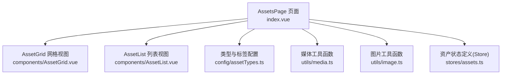
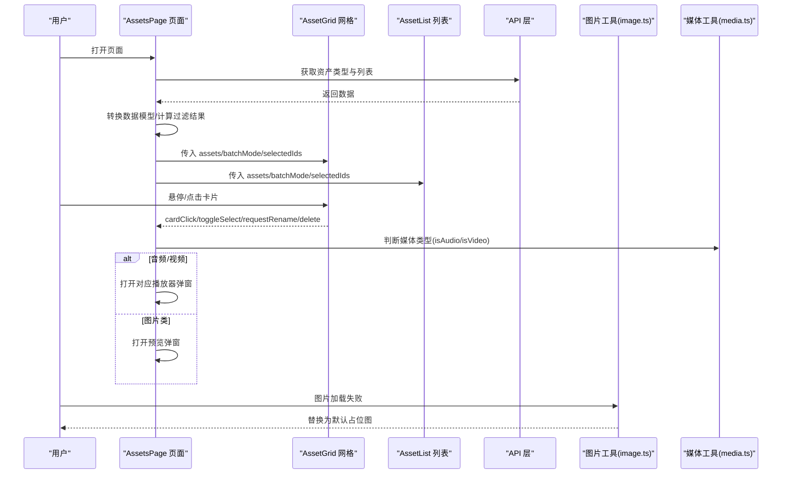
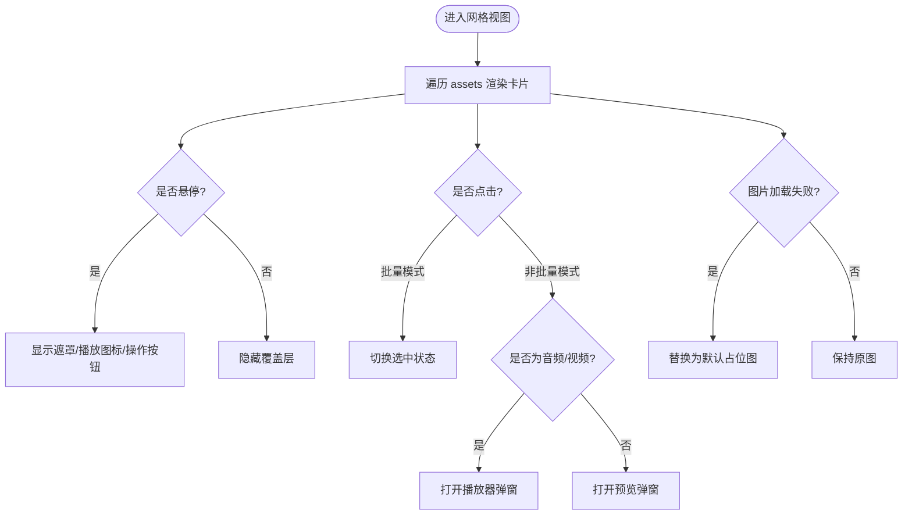
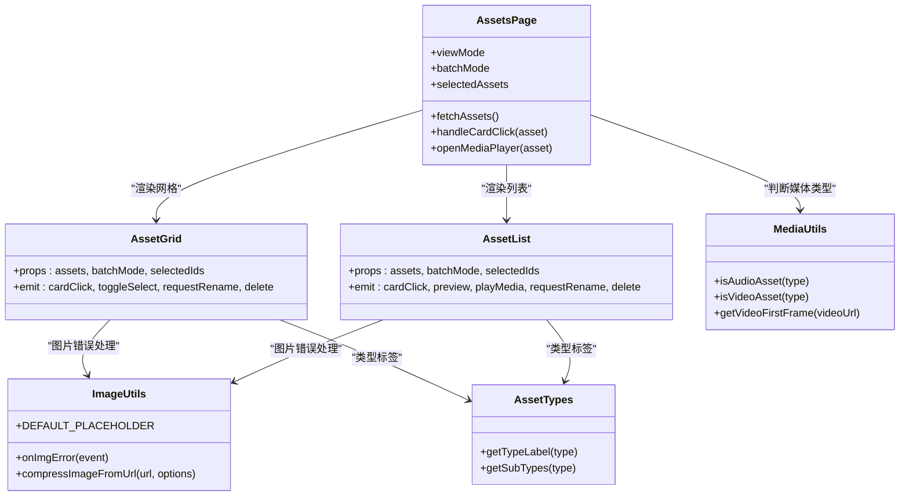

# 资产网格视图

<cite>
**本文引用的文件**   
- [frontend/src/views/AssetsPage/index.vue](file://frontend/src/views/AssetsPage/index.vue)
- [frontend/src/views/AssetsPage/components/AssetGrid.vue](file://frontend/src/views/AssetsPage/components/AssetGrid.vue)
- [frontend/src/views/AssetsPage/components/AssetList.vue](file://frontend/src/views/AssetsPage/components/AssetList.vue)
- [frontend/src/utils/image.ts](file://frontend/src/utils/image.ts)
- [frontend/src/utils/media.ts](file://frontend/src/utils/media.ts)
- [frontend/src/config/assetTypes.ts](file://frontend/src/config/assetTypes.ts)
- [frontend/src/stores/assets.ts](file://frontend/src/stores/assets.ts)
</cite>

## 目录
1. [简介](#简介)
2. [项目结构](#项目结构)
3. [核心组件](#核心组件)
4. [架构总览](#架构总览)
5. [详细组件分析](#详细组件分析)
6. [依赖关系分析](#依赖关系分析)
7. [性能与优化](#性能与优化)
8. [故障排查指南](#故障排查指南)
9. [结论](#结论)
10. [附录：自定义卡片样式与行为示例](#附录自定义卡片样式与行为示例)

## 简介
本文件聚焦“资产网格视图”的前端实现，系统性讲解网格布局、卡片渲染、响应式适配、交互反馈（点击、批量选择、悬停）、图片加载与缩略图生成、内存管理与滚动性能优化策略。文档同时提供可落地的自定义卡片样式与行为的实践路径，帮助开发者快速扩展和定制。

## 项目结构
资产网格视图位于页面级组件 AssetsPage 中，由多个子组件协作完成：
- 页面容器：负责数据获取、筛选、分页、批量操作、播放器弹窗等编排
- 网格视图：以 CSS Grid 展示卡片，支持悬停播放图标、重命名/删除按钮、批量勾选
- 列表视图：行式展示，便于信息密度更高的场景
- 工具与配置：图片错误占位、媒体类型判断、视频首帧截取、类型标签映射

图表来源
- [frontend/src/views/AssetsPage/index.vue:1-473](file://frontend/src/views/AssetsPage/index.vue#L1-L473)
- [frontend/src/views/AssetsPage/components/AssetGrid.vue:1-97](file://frontend/src/views/AssetsPage/components/AssetGrid.vue#L1-L97)
- [frontend/src/views/AssetsPage/components/AssetList.vue:1-108](file://frontend/src/views/AssetsPage/components/AssetList.vue#L1-L108)
- [frontend/src/config/assetTypes.ts:1-69](file://frontend/src/config/assetTypes.ts#L1-L69)
- [frontend/src/utils/media.ts:1-55](file://frontend/src/utils/media.ts#L1-L55)
- [frontend/src/utils/image.ts:1-106](file://frontend/src/utils/image.ts#L1-L106)
- [frontend/src/stores/assets.ts:1-161](file://frontend/src/stores/assets.ts#L1-L161)

章节来源
- [frontend/src/views/AssetsPage/index.vue:1-473](file://frontend/src/views/AssetsPage/index.vue#L1-L473)

## 核心组件
- 网格视图 AssetGrid
  - 使用 CSS Grid 五列布局，卡片为正方形缩略图区域 + 底部信息区
  - 非批量模式：悬停显示播放图标（音频/视频）与右上角操作按钮（重命名、删除）
  - 批量模式：右上角显示勾选框，选中项高亮边框
  - 事件：cardClick、toggleSelect、requestRename、delete
- 列表视图 AssetList
  - 行式布局，左侧缩略图，中间名称+标签+时间，右侧操作按钮
  - 事件：cardClick、preview、playMedia、requestRename、delete
- 页面容器 AssetsPage
  - 管理数据源、筛选、分页、批量删除、预览与播放器弹窗
  - 将 API 返回的资产项转换为前端统一模型，并驱动网格/列表渲染

章节来源
- [frontend/src/views/AssetsPage/components/AssetGrid.vue:1-97](file://frontend/src/views/AssetsPage/components/AssetGrid.vue#L1-L97)
- [frontend/src/views/AssetsPage/components/AssetList.vue:1-108](file://frontend/src/views/AssetsPage/components/AssetList.vue#L1-L108)
- [frontend/src/views/AssetsPage/index.vue:1-473](file://frontend/src/views/AssetsPage/index.vue#L1-L473)

## 架构总览
从数据到渲染的关键链路如下：
- 页面初始化时拉取资产类型与列表数据
- 根据筛选条件（主类型、子类型、关键词）计算当前页数据
- 网格/列表组件接收数据并渲染卡片
- 用户交互触发事件，由页面容器协调业务逻辑（预览、播放、重命名、删除、批量操作）

图表来源
- [frontend/src/views/AssetsPage/index.vue:1-473](file://frontend/src/views/AssetsPage/index.vue#L1-L473)
- [frontend/src/views/AssetsPage/components/AssetGrid.vue:1-97](file://frontend/src/views/AssetsPage/components/AssetGrid.vue#L1-L97)
- [frontend/src/views/AssetsPage/components/AssetList.vue:1-108](file://frontend/src/views/AssetsPage/components/AssetList.vue#L1-L108)
- [frontend/src/utils/image.ts:1-106](file://frontend/src/utils/image.ts#L1-L106)
- [frontend/src/utils/media.ts:1-55](file://frontend/src/utils/media.ts#L1-L55)

## 详细组件分析

### 网格布局与卡片渲染机制
- 布局
  - 使用 CSS Grid 固定五列，卡片容器采用 aspect-square 保持正方形比例
  - 卡片内部分为“缩略图区域”和“信息区域”，信息区包含名称、类型标签与最多两个标签
- 渲染
  - 缩略图通过 img 标签绑定 thumbnail；当加载失败时，onImgError 回调替换为内联 SVG 占位图
  - 非批量模式下，音频/视频卡片悬停显示半透明遮罩与播放图标；右上角显示重命名与删除按钮
  - 批量模式下，右上角显示勾选框，选中项增加主题色边框
- 交互
  - 点击卡片：在批量模式下切换选中，在非批量模式下根据类型打开播放器或预览弹窗
  - 删除：先弹出确认框，确认后向上抛出 delete 事件由父组件处理

图表来源
- [frontend/src/views/AssetsPage/components/AssetGrid.vue:1-97](file://frontend/src/views/AssetsPage/components/AssetGrid.vue#L1-L97)
- [frontend/src/utils/image.ts:1-106](file://frontend/src/utils/image.ts#L1-L106)
- [frontend/src/views/AssetsPage/index.vue:1-473](file://frontend/src/views/AssetsPage/index.vue#L1-L473)

章节来源
- [frontend/src/views/AssetsPage/components/AssetGrid.vue:1-97](file://frontend/src/views/AssetsPage/components/AssetGrid.vue#L1-L97)
- [frontend/src/views/AssetsPage/index.vue:1-473](file://frontend/src/views/AssetsPage/index.vue#L1-L473)

### 列表视图对比
- 布局更紧凑，适合信息密度高的场景
- 同样支持批量勾选、悬停播放提示、重命名/预览/删除等操作
- 事件与网格视图保持一致，便于统一处理

章节来源
- [frontend/src/views/AssetsPage/components/AssetList.vue:1-108](file://frontend/src/views/AssetsPage/components/AssetList.vue#L1-L108)

### 数据流与类型映射
- 页面容器负责：
  - 调用接口获取资产类型与列表
  - 将后端字段映射为前端统一模型（含类型映射、标签拆分、日期格式化等）
  - 维护搜索词、活跃筛选、分页状态，计算当前页数据
- 类型映射
  - 前端类型与后端枚举值之间建立双向映射，确保筛选参数正确传递
- 筛选与搜索
  - 支持按主类型、子类型、关键词（名称/标签）组合过滤

章节来源
- [frontend/src/views/AssetsPage/index.vue:1-473](file://frontend/src/views/AssetsPage/index.vue#L1-L473)
- [frontend/src/config/assetTypes.ts:1-69](file://frontend/src/config/assetTypes.ts#L1-L69)
- [frontend/src/stores/assets.ts:1-161](file://frontend/src/stores/assets.ts#L1-L161)

### 图片懒加载与缩略图生成
- 图片懒加载
  - 当前使用原生 img 标签，未引入 IntersectionObserver 懒加载；可通过懒加载库或原生 observer 进一步优化首屏与滚动性能
- 缩略图生成
  - 图片压缩：compressImageFromUrl 可将远程图片缩放并转 base64，适用于上传前压缩或本地生成缩略图
  - 视频首帧：getVideoFirstFrame 利用 video + canvas 截取第一帧作为封面，注意跨域与资源清理
- 错误占位
  - onImgError 将失败图片替换为内联 SVG 占位图，避免空白与闪烁

章节来源
- [frontend/src/utils/image.ts:1-106](file://frontend/src/utils/image.ts#L1-L106)
- [frontend/src/utils/media.ts:1-55](file://frontend/src/utils/media.ts#L1-L55)

### 交互反馈与批量选择
- 悬停效果
  - 网格：scale 放大、遮罩渐显、操作按钮渐显
  - 列表：缩略图区域遮罩与播放图标
- 批量选择
  - 开启批量模式后，卡片/行出现勾选框，选中项高亮边框
  - 批量删除：二次确认后逐个调用删除接口，完成后刷新列表并退出批量模式

章节来源
- [frontend/src/views/AssetsPage/components/AssetGrid.vue:1-97](file://frontend/src/views/AssetsPage/components/AssetGrid.vue#L1-L97)
- [frontend/src/views/AssetsPage/components/AssetList.vue:1-108](file://frontend/src/views/AssetsPage/components/AssetList.vue#L1-L108)
- [frontend/src/views/AssetsPage/index.vue:1-473](file://frontend/src/views/AssetsPage/index.vue#L1-L473)

## 依赖关系分析
- 组件耦合
  - AssetsPage 作为编排者，向下分发 props 并接收事件，职责清晰
  - AssetGrid/AssetList 仅关注渲染与基础交互，复杂逻辑上抛至父组件
- 外部依赖
  - utils/image.ts：图片错误占位与压缩
  - utils/media.ts：媒体类型判断与视频首帧截取
  - config/assetTypes.ts：类型标签与子类型选项
  - stores/assets.ts：资产类型与子类型定义（页面实际走 API，但 Store 提供类型与数据结构参考）

图表来源
- [frontend/src/views/AssetsPage/index.vue:1-473](file://frontend/src/views/AssetsPage/index.vue#L1-L473)
- [frontend/src/views/AssetsPage/components/AssetGrid.vue:1-97](file://frontend/src/views/AssetsPage/components/AssetGrid.vue#L1-L97)
- [frontend/src/views/AssetsPage/components/AssetList.vue:1-108](file://frontend/src/views/AssetsPage/components/AssetList.vue#L1-L108)
- [frontend/src/utils/image.ts:1-106](file://frontend/src/utils/image.ts#L1-L106)
- [frontend/src/utils/media.ts:1-55](file://frontend/src/utils/media.ts#L1-L55)
- [frontend/src/config/assetTypes.ts:1-69](file://frontend/src/config/assetTypes.ts#L1-L69)

章节来源
- [frontend/src/views/AssetsPage/index.vue:1-473](file://frontend/src/views/AssetsPage/index.vue#L1-L473)
- [frontend/src/views/AssetsPage/components/AssetGrid.vue:1-97](file://frontend/src/views/AssetsPage/components/AssetGrid.vue#L1-L97)
- [frontend/src/views/AssetsPage/components/AssetList.vue:1-108](file://frontend/src/views/AssetsPage/components/AssetList.vue#L1-L108)
- [frontend/src/utils/image.ts:1-106](file://frontend/src/utils/image.ts#L1-L106)
- [frontend/src/utils/media.ts:1-55](file://frontend/src/utils/media.ts#L1-L55)
- [frontend/src/config/assetTypes.ts:1-69](file://frontend/src/config/assetTypes.ts#L1-L69)

## 性能与优化
- 渲染与布局
  - 网格使用固定列数与正方形比例，减少重排；建议在小屏设备下通过响应式断点调整列数（例如移动端两列）
  - 列表模式适合大数据量场景，减少 DOM 节点体积
- 图片加载
  - 当前未启用懒加载，建议在大量图片场景引入 IntersectionObserver 或第三方懒加载库，按需加载缩略图
  - 对大图进行服务端裁剪或前端压缩（compressImageFromUrl），降低带宽与解码压力
- 视频封面
  - getVideoFirstFrame 会创建 video 元素并绘制到 canvas，务必在成功后移除 video 节点，避免内存泄漏
- 滚动性能
  - 长列表建议使用虚拟滚动（如 vue-virtual-scroller）或分页加载，避免一次性渲染过多节点
- 事件与动画
  - 悬停动画使用 transform/opacity，避免触发布局抖动
  - 批量操作尽量合并请求或使用 Promise.allSettled 并发控制，提升用户体验

[本节为通用性能建议，不直接分析具体代码文件]

## 故障排查指南
- 图片无法显示
  - 检查 onImgError 是否正确替换为占位图
  - 若使用 compressImageFromUrl，确认服务端允许跨域访问，否则 canvas 会被污染导致报错
- 视频封面生成失败
  - 检查 getVideoFirstFrame 的跨域设置与资源清理逻辑
  - 确认视频 URL 可正常加载且支持 seeked 事件
- 批量删除无响应
  - 确认父组件已监听 delete 事件并调用删除接口
  - 检查 Promise.allSettled 的错误处理与后续刷新逻辑
- 筛选/搜索无效
  - 检查 activeFilter/activeSubFilter/searchQuery 的状态更新与 computed 过滤逻辑

章节来源
- [frontend/src/utils/image.ts:1-106](file://frontend/src/utils/image.ts#L1-L106)
- [frontend/src/utils/media.ts:1-55](file://frontend/src/utils/media.ts#L1-L55)
- [frontend/src/views/AssetsPage/index.vue:1-473](file://frontend/src/views/AssetsPage/index.vue#L1-L473)

## 结论
资产网格视图通过清晰的组件分层与事件上抛机制，实现了灵活的网格/列表双模式展示、完善的交互反馈与可扩展的数据流程。结合图片压缩、视频首帧截取与错误占位，整体具备较好的可用性与可维护性。针对大规模数据与图片密集场景，建议进一步引入懒加载与虚拟滚动，以获得更优的滚动与内存表现。

[本节为总结性内容，不直接分析具体代码文件]

## 附录：自定义卡片样式与行为示例
以下示例以“如何自定义网格卡片样式与行为”为目标，给出可直接落地的步骤与定位路径（不粘贴源码，仅提供文件与行号以便查阅）：

- 修改网格列数与间距
  - 目标：将五列改为四列或三列，调整卡片间距
  - 参考位置：网格根容器的 grid-cols-* 与 gap-* 类名
  - 文件与行号：[frontend/src/views/AssetsPage/components/AssetGrid.vue:39-41](file://frontend/src/views/AssetsPage/components/AssetGrid.vue#L39-L41)

- 自定义卡片悬停动效
  - 目标：改变缩放幅度、过渡时长或遮罩透明度
  - 参考位置：缩略图区域的 scale 与 transition 类名、遮罩层的 opacity 与背景色
  - 文件与行号：[frontend/src/views/AssetsPage/components/AssetGrid.vue:43-50](file://frontend/src/views/AssetsPage/components/AssetGrid.vue#L43-L50)

- 添加卡片角标或状态徽章
  - 目标：在卡片右上角显示“已上架/草稿”等状态
  - 参考位置：在卡片容器内新增绝对定位元素，绑定状态字段
  - 文件与行号：[frontend/src/views/AssetsPage/components/AssetGrid.vue:40-61](file://frontend/src/views/AssetsPage/components/AssetGrid.vue#L40-L61)

- 扩展卡片点击行为
  - 目标：点击卡片后执行额外逻辑（如上报埋点、跳转详情）
  - 参考位置：cardClick 事件触发处与父组件处理函数
  - 文件与行号：
    - 网格事件发射：[frontend/src/views/AssetsPage/components/AssetGrid.vue:40-41](file://frontend/src/views/AssetsPage/components/AssetGrid.vue#L40-L41)
    - 父组件处理：[frontend/src/views/AssetsPage/index.vue:225-236](file://frontend/src/views/AssetsPage/index.vue#L225-L236)

- 自定义批量选择样式
  - 目标：修改选中态边框颜色、勾选框尺寸或动画
  - 参考位置：批量模式下的勾选框与 ring 高亮类名
  - 文件与行号：[frontend/src/views/AssetsPage/components/AssetGrid.vue:40-41](file://frontend/src/views/AssetsPage/components/AssetGrid.vue#L40-L41)

- 自定义列表卡片样式
  - 目标：调整缩略图圆角、行高、标签样式
  - 参考位置：列表项容器与缩略图区域类名
  - 文件与行号：[frontend/src/views/AssetsPage/components/AssetList.vue:53-73](file://frontend/src/views/AssetsPage/components/AssetList.vue#L53-L73)

- 自定义图片错误占位图
  - 目标：替换默认 SVG 占位图为品牌占位图
  - 参考位置：DEFAULT_PLACEHOLDER 与 onImgError 回调
  - 文件与行号：[frontend/src/utils/image.ts:1-12](file://frontend/src/utils/image.ts#L1-L12)

- 自定义视频封面生成策略
  - 目标：调整截图分辨率、质量或超时策略
  - 参考位置：getVideoFirstFrame 中的 canvas 尺寸与 toDataURL 参数
  - 文件与行号：[frontend/src/utils/media.ts:20-54](file://frontend/src/utils/media.ts#L20-L54)

- 自定义类型标签文案
  - 目标：修改“人物角色/场景图片”等中文标签
  - 参考位置：TYPE_LABELS 映射表
  - 文件与行号：[frontend/src/config/assetTypes.ts:54-68](file://frontend/src/config/assetTypes.ts#L54-L68)

章节来源
- [frontend/src/views/AssetsPage/components/AssetGrid.vue:1-97](file://frontend/src/views/AssetsPage/components/AssetGrid.vue#L1-L97)
- [frontend/src/views/AssetsPage/components/AssetList.vue:1-108](file://frontend/src/views/AssetsPage/components/AssetList.vue#L1-L108)
- [frontend/src/views/AssetsPage/index.vue:1-473](file://frontend/src/views/AssetsPage/index.vue#L1-L473)
- [frontend/src/utils/image.ts:1-106](file://frontend/src/utils/image.ts#L1-L106)
- [frontend/src/utils/media.ts:1-55](file://frontend/src/utils/media.ts#L1-L55)
- [frontend/src/config/assetTypes.ts:1-69](file://frontend/src/config/assetTypes.ts#L1-L69)