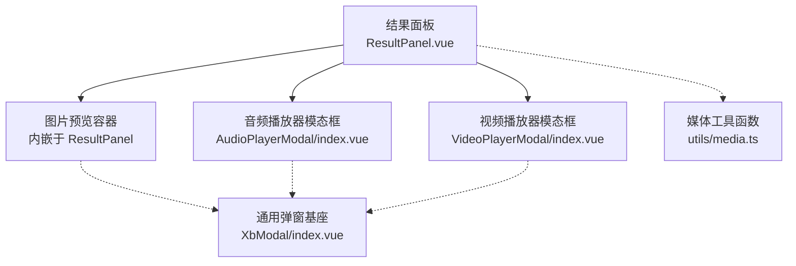
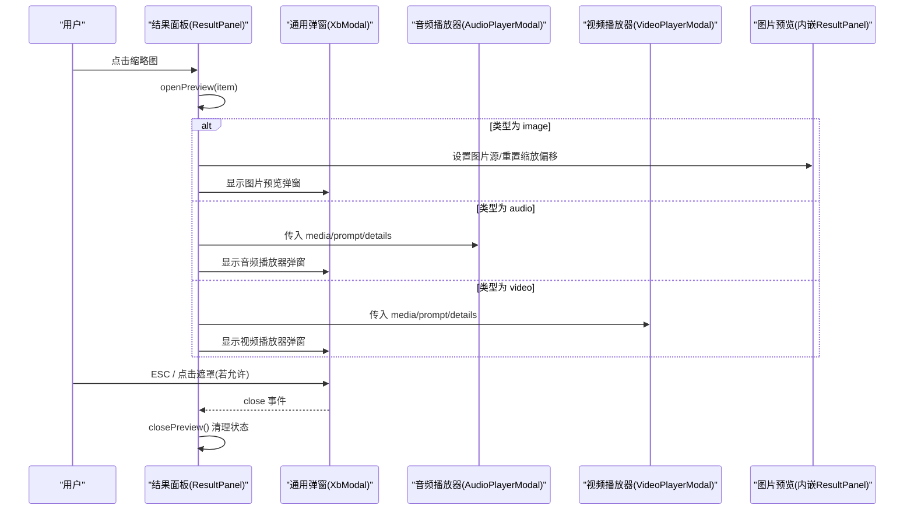
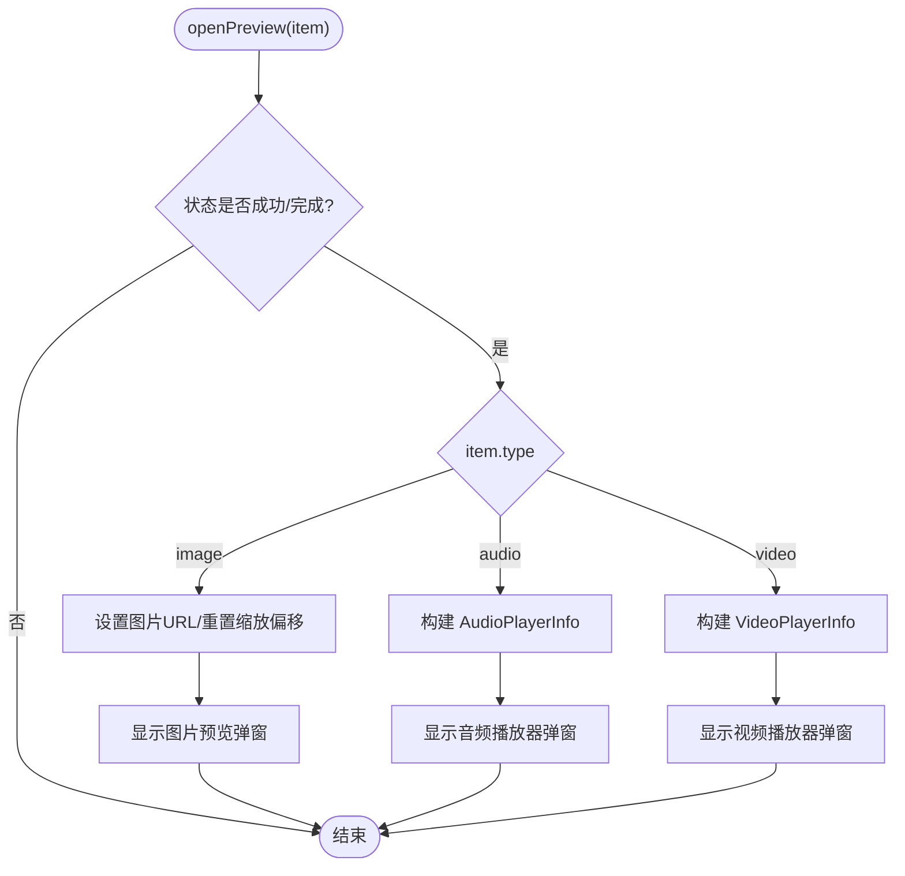
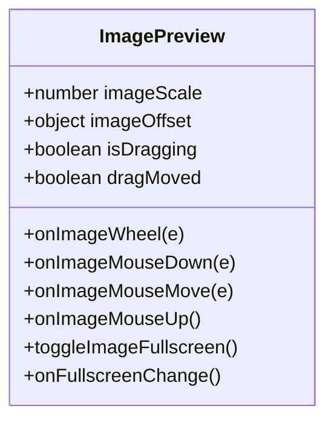
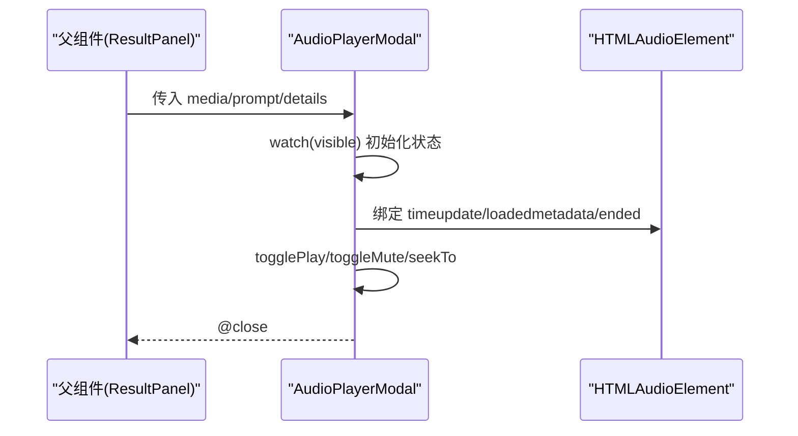
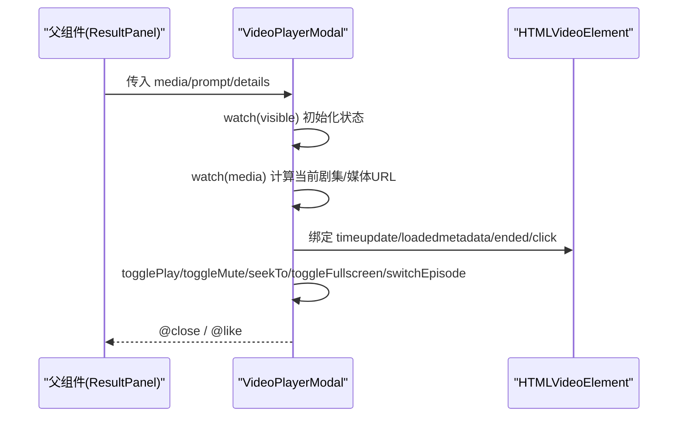
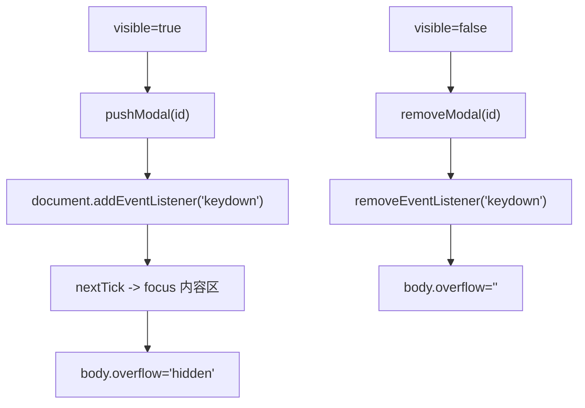
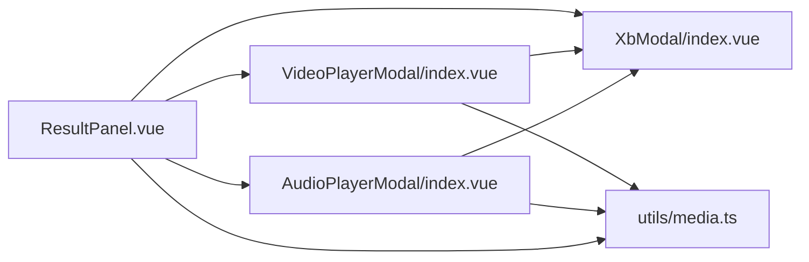

# 资产预览模态框

<cite>
**本文引用的文件**   
- [ResultPanel.vue](file://frontend/src/views/AssetsGeneratePage/components/ResultPanel.vue)
- [ImagePanel.vue](file://frontend/src/views/AssetsGeneratePage/components/ImagePanel.vue)
- [AudioPlayerModal/index.vue](file://frontend/src/components/AudioPlayerModal/index.vue)
- [VideoPlayerModal/index.vue](file://frontend/src/components/VideoPlayerModal/index.vue)
- [XbModal/index.vue](file://frontend/src/xbUi/XbModal/index.vue)
- [media.ts](file://frontend/src/utils/media.ts)
</cite>

## 目录
1. [简介](#简介)
2. [项目结构](#项目结构)
3. [核心组件](#核心组件)
4. [架构总览](#架构总览)
5. [详细组件分析](#详细组件分析)
6. [依赖关系分析](#依赖关系分析)
7. [性能与体验优化](#性能与体验优化)
8. [故障排查指南](#故障排查指南)
9. [结论](#结论)
10. [附录：扩展与自定义示例路径](#附录扩展与自定义示例路径)

## 简介
本文件围绕“资产预览模态框”展开，系统性说明图片、音频、视频三类媒体在结果面板中的预览流程、打开关闭逻辑、全屏显示、缩放与拖拽、键盘快捷键（ESC 关闭）、遮罩层点击处理以及移动端适配要点。同时给出如何扩展新媒体类型或自定义预览行为的实践指引。

## 项目结构
资产预览由“结果面板”统一调度，根据媒体类型分发到对应的专用播放器模态框；基础弹窗能力由通用 XbModal 提供。

图表来源
- [ResultPanel.vue:363-402](file://frontend/src/views/AssetsGeneratePage/components/ResultPanel.vue#L363-L402)
- [AudioPlayerModal/index.vue:110-179](file://frontend/src/components/AudioPlayerModal/index.vue#L110-L179)
- [VideoPlayerModal/index.vue:173-316](file://frontend/src/components/VideoPlayerModal/index.vue#L173-L316)
- [XbModal/index.vue:33-116](file://frontend/src/xbUi/XbModal/index.vue#L33-L116)
- [media.ts](file://frontend/src/utils/media.ts)

章节来源
- [ResultPanel.vue:363-402](file://frontend/src/views/AssetsGeneratePage/components/ResultPanel.vue#L363-L402)
- [XbModal/index.vue:33-116](file://frontend/src/xbUi/XbModal/index.vue#L33-L116)

## 核心组件
- 结果面板（ResultPanel）
  - 负责打开/关闭预览、按类型路由到不同播放器、维护图片缩放与全屏状态、组合右侧详情与提示词信息。
- 音频播放器模态框（AudioPlayerModal）
  - 基于原生 audio 实现播放控制、进度条、静音切换、时长格式化展示。
- 视频播放器模态框（VideoPlayerModal）
  - 基于原生 video 实现播放控制、进度条、静音切换、全屏、选集切换、点赞交互。
- 通用弹窗（XbModal）
  - 提供遮罩、ESC 关闭、可配置动画、焦点管理、body 滚动锁定等基础能力。

章节来源
- [ResultPanel.vue:363-402](file://frontend/src/views/AssetsGeneratePage/components/ResultPanel.vue#L363-L402)
- [AudioPlayerModal/index.vue:20-108](file://frontend/src/components/AudioPlayerModal/index.vue#L20-L108)
- [VideoPlayerModal/index.vue:32-171](file://frontend/src/components/VideoPlayerModal/index.vue#L32-L171)
- [XbModal/index.vue:33-116](file://frontend/src/xbUi/XbModal/index.vue#L33-L116)

## 架构总览
下图展示了从用户点击缩略图到具体播放器呈现的完整调用链，以及各模态框与通用弹窗的关系。

图表来源
- [ResultPanel.vue:363-402](file://frontend/src/views/AssetsGeneratePage/components/ResultPanel.vue#L363-L402)
- [XbModal/index.vue:78-112](file://frontend/src/xbUi/XbModal/index.vue#L78-L112)
- [AudioPlayerModal/index.vue:110-179](file://frontend/src/components/AudioPlayerModal/index.vue#L110-L179)
- [VideoPlayerModal/index.vue:173-316](file://frontend/src/components/VideoPlayerModal/index.vue#L173-L316)

## 详细组件分析

### 结果面板（ResultPanel）——预览入口与状态中枢
- 打开逻辑
  - 仅对成功/完成状态的项开放预览。
  - 根据 item.type 分支：
    - image：设置图片 URL，重置缩放与偏移，显示图片预览弹窗。
    - audio：构造 AudioPlayerInfo，显示音频播放器弹窗。
    - video：构造 VideoPlayerInfo，显示视频播放器弹窗。
- 关闭逻辑
  - 清空所有预览相关状态，必要时退出全屏。
- 图片缩放与全屏
  - 支持滚轮缩放（限制范围）、鼠标拖拽平移、点击切换全屏。
  - 监听全屏变化事件，退出时复位缩放与偏移。
- 右侧信息区
  - 复用 ModelLogDetailInfo 展示模型名、状态、分辨率、消费金额等。
  - 展示提示词内容（换行处理）。

图表来源
- [ResultPanel.vue:363-402](file://frontend/src/views/AssetsGeneratePage/components/ResultPanel.vue#L363-L402)

章节来源
- [ResultPanel.vue:281-402](file://frontend/src/views/AssetsGeneratePage/components/ResultPanel.vue#L281-L402)

### 图片预览（内嵌于结果面板）——缩放、拖拽、全屏
- 缩放
  - 仅在图片预览容器处于全屏时响应滚轮缩放，缩放范围限定在最小值与最大值之间。
- 拖拽
  - 按下左键开始拖动，移动超过阈值后标记为“已拖动”，避免与点击冲突。
  - 拖动中实时更新偏移量，释放时结束拖动。
- 全屏
  - 点击容器触发全屏切换；退出全屏时自动复位缩放与偏移。
- 事件绑定
  - 挂载时注册全局 mousemove/mouseup/fullscreenchange 监听，卸载时移除。

图表来源
- [ResultPanel.vue:281-361](file://frontend/src/views/AssetsGeneratePage/components/ResultPanel.vue#L281-L361)

章节来源
- [ResultPanel.vue:281-361](file://frontend/src/views/AssetsGeneratePage/components/ResultPanel.vue#L281-L361)

### 音频播放器模态框（AudioPlayerModal）
- 打开/关闭
  - visible 为 true 时初始化播放状态；关闭时暂停并重置时间。
- 播放控制
  - 播放/暂停、静音切换、进度条点击跳转、时间更新、元数据加载完成获取时长、播放结束复位。
- 展示
  - 封面图、标题、进度条、时间显示、控制按钮。
  - 右侧可选展示详情与提示词。

图表来源
- [AudioPlayerModal/index.vue:42-108](file://frontend/src/components/AudioPlayerModal/index.vue#L42-L108)
- [AudioPlayerModal/index.vue:110-179](file://frontend/src/components/AudioPlayerModal/index.vue#L110-L179)

章节来源
- [AudioPlayerModal/index.vue:20-108](file://frontend/src/components/AudioPlayerModal/index.vue#L20-L108)
- [AudioPlayerModal/index.vue:110-179](file://frontend/src/components/AudioPlayerModal/index.vue#L110-L179)

### 视频播放器模态框（VideoPlayerModal）
- 打开/关闭
  - visible 为 true 时初始化播放状态；关闭时暂停并重置时间。
- 播放控制
  - 播放/暂停、静音切换、进度条点击跳转、时间更新、元数据加载完成获取时长、播放结束复位。
- 全屏
  - 通过 video.requestFullscreen 进入全屏。
- 选集
  - 支持多集列表，切换剧集时重置播放状态并重新加载。
- 展示
  - 视频区域、覆盖层播放按钮、底部控制栏、右侧详情与提示词、选集列表。

图表来源
- [VideoPlayerModal/index.vue:58-171](file://frontend/src/components/VideoPlayerModal/index.vue#L58-L171)
- [VideoPlayerModal/index.vue:173-316](file://frontend/src/components/VideoPlayerModal/index.vue#L173-L316)

章节来源
- [VideoPlayerModal/index.vue:32-171](file://frontend/src/components/VideoPlayerModal/index.vue#L32-L171)
- [VideoPlayerModal/index.vue:173-316](file://frontend/src/components/VideoPlayerModal/index.vue#L173-L316)

### 通用弹窗（XbModal）——遮罩、ESC、焦点与动画
- 遮罩层点击关闭
  - 当 closeOnOverlay 为真且非 persistent 时，点击遮罩关闭。
- 键盘支持
  - 仅顶层弹窗响应键盘事件；ESC 关闭（非 persistent）；Enter/Space 提交（submitOnEnter 且目标非可编辑元素）。
- 生命周期
  - 打开时入栈、添加 keydown 监听、锁定 body 滚动、将焦点移入内容；关闭时出栈、移除监听、恢复滚动。
- 动画
  - 支持多种入场/出场动画，可随机或指定。

图表来源
- [XbModal/index.vue:78-116](file://frontend/src/xbUi/XbModal/index.vue#L78-L116)

章节来源
- [XbModal/index.vue:33-116](file://frontend/src/xbUi/XbModal/index.vue#L33-L116)

## 依赖关系分析
- 结果面板依赖
  - 音频/视频播放器模态框用于渲染对应媒体。
  - 通用弹窗提供统一的遮罩、ESC、动画等能力。
  - 媒体工具函数用于时间格式化与视频首帧提取（缩略图优化）。
- 播放器模态框依赖
  - 通用弹窗作为宿主容器。
  - 媒体工具函数用于时间格式化。
- 图片预览
  - 直接内嵌于结果面板，使用 DOM API 进行全屏与缩放。

图表来源
- [ResultPanel.vue:363-402](file://frontend/src/views/AssetsGeneratePage/components/ResultPanel.vue#L363-L402)
- [AudioPlayerModal/index.vue:110-179](file://frontend/src/components/AudioPlayerModal/index.vue#L110-L179)
- [VideoPlayerModal/index.vue:173-316](file://frontend/src/components/VideoPlayerModal/index.vue#L173-L316)
- [XbModal/index.vue:33-116](file://frontend/src/xbUi/XbModal/index.vue#L33-L116)
- [media.ts](file://frontend/src/utils/media.ts)

章节来源
- [ResultPanel.vue:363-402](file://frontend/src/views/AssetsGeneratePage/components/ResultPanel.vue#L363-L402)
- [AudioPlayerModal/index.vue:110-179](file://frontend/src/components/AudioPlayerModal/index.vue#L110-L179)
- [VideoPlayerModal/index.vue:173-316](file://frontend/src/components/VideoPlayerModal/index.vue#L173-L316)
- [XbModal/index.vue:33-116](file://frontend/src/xbUi/XbModal/index.vue#L33-L116)

## 性能与体验优化
- 图片缩略图
  - 结果面板针对视频类型优先使用第一帧作为封面，减少大图加载成本。
- 缩放与拖拽
  - 图片缩放仅在容器全屏时生效，避免不必要的计算；拖拽阈值避免误触。
- 播放器资源
  - 打开时重置播放状态，关闭时主动暂停并归零时间，防止后台继续消耗资源。
- 全屏体验
  - 退出全屏时复位缩放与偏移，保证下次打开一致性。
- 键盘与焦点
  - 弹窗打开后将焦点移至内容区，提升无障碍体验；ESC 关闭符合常见交互预期。

章节来源
- [ResultPanel.vue:228-260](file://frontend/src/views/AssetsGeneratePage/components/ResultPanel.vue#L228-L260)
- [ResultPanel.vue:281-361](file://frontend/src/views/AssetsGeneratePage/components/ResultPanel.vue#L281-L361)
- [AudioPlayerModal/index.vue:42-108](file://frontend/src/components/AudioPlayerModal/index.vue#L42-L108)
- [VideoPlayerModal/index.vue:58-171](file://frontend/src/components/VideoPlayerModal/index.vue#L58-L171)
- [XbModal/index.vue:94-116](file://frontend/src/xbUi/XbModal/index.vue#L94-L116)

## 故障排查指南
- 无法通过 ESC 关闭
  - 检查弹窗是否为顶层（isTopModal），确认未设置为 persistent。
- 遮罩点击无效
  - 确认 closeOnOverlay 为真且非 persistent。
- 图片缩放不生效
  - 确认图片预览容器已进入全屏；滚轮缩放仅在 fullscreen 状态下启用。
- 拖拽与点击冲突
  - 拖动超过阈值会标记为已拖动，此时点击不会触发全屏切换。
- 音频/视频无声音
  - 检查是否处于静音状态；部分浏览器策略要求用户交互后才能自动播放。
- 全屏失败
  - 某些环境可能不支持 requestFullscreen，需降级处理或引导用户使用原生控件。

章节来源
- [XbModal/index.vue:78-116](file://frontend/src/xbUi/XbModal/index.vue#L78-L116)
- [ResultPanel.vue:281-361](file://frontend/src/views/AssetsGeneratePage/components/ResultPanel.vue#L281-L361)
- [AudioPlayerModal/index.vue:42-108](file://frontend/src/components/AudioPlayerModal/index.vue#L42-L108)
- [VideoPlayerModal/index.vue:58-171](file://frontend/src/components/VideoPlayerModal/index.vue#L58-L171)

## 结论
资产预览模态框以结果面板为中心，按媒体类型路由至专用播放器，结合通用弹窗提供的遮罩、ESC、动画与焦点管理能力，形成一致的用户体验。图片预览额外实现了缩放与拖拽，视频支持全屏与选集切换，音频提供简洁的播放控制。整体方案具备良好的可扩展性，便于新增媒体类型或定制行为。

## 附录：扩展与自定义示例路径
- 新增媒体类型（例如 PDF/文档）
  - 在结果面板的 openPreview 分支中添加新类型判断，渲染新的预览模态框。
  - 参考路径：[ResultPanel.vue:363-402](file://frontend/src/views/AssetsGeneratePage/components/ResultPanel.vue#L363-L402)
- 自定义图片预览行为（如双击放大、手势缩放）
  - 在图片预览容器上增加手势事件处理，结合现有缩放与偏移状态。
  - 参考路径：[ResultPanel.vue:281-361](file://frontend/src/views/AssetsGeneratePage/components/ResultPanel.vue#L281-L361)
- 扩展播放器功能（如字幕、倍速、画中画）
  - 在对应播放器模态框中扩展控制逻辑与 UI。
  - 音频参考：[AudioPlayerModal/index.vue:110-179](file://frontend/src/components/AudioPlayerModal/index.vue#L110-L179)
  - 视频参考：[VideoPlayerModal/index.vue:173-316](file://frontend/src/components/VideoPlayerModal/index.vue#L173-L316)
- 调整弹窗行为（如禁止遮罩关闭、禁用 ESC）
  - 通过 XbModal 的 closeOnOverlay 与 persistent 属性控制。
  - 参考路径：[XbModal/index.vue:33-116](file://frontend/src/xbUi/XbModal/index.vue#L33-L116)
- 参考图放大预览（生成页场景）
  - 使用 Teleport 将放大预览置于 body，点击遮罩关闭。
  - 参考路径：[ImagePanel.vue:225-240](file://frontend/src/views/AssetsGeneratePage/components/ImagePanel.vue#L225-L240)