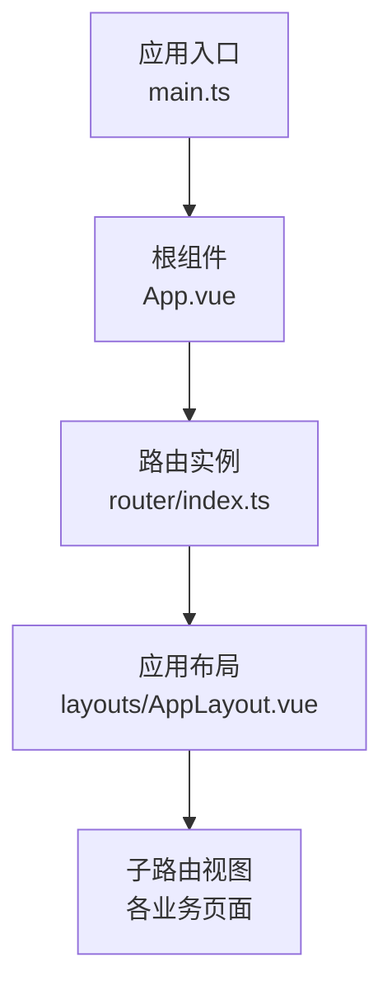
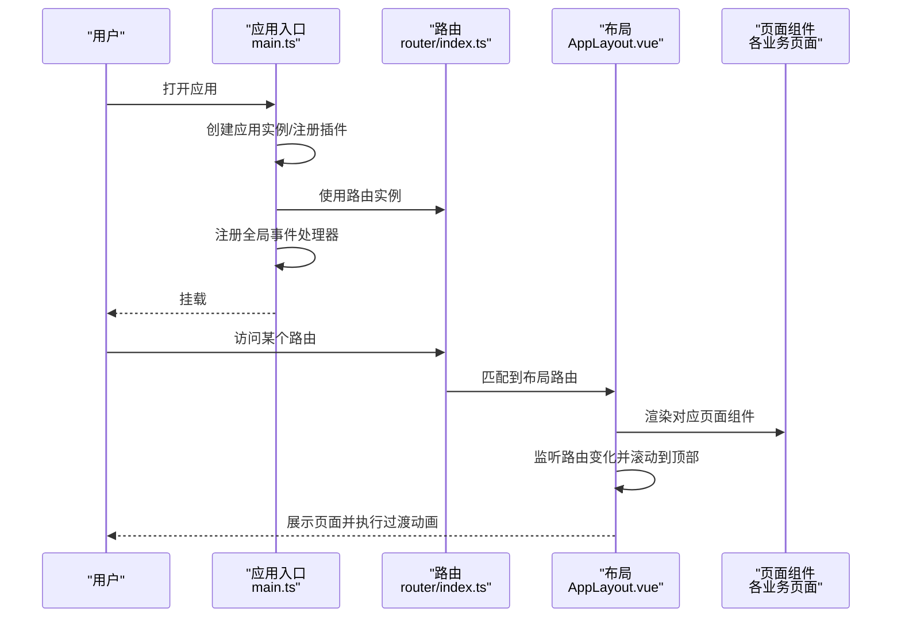
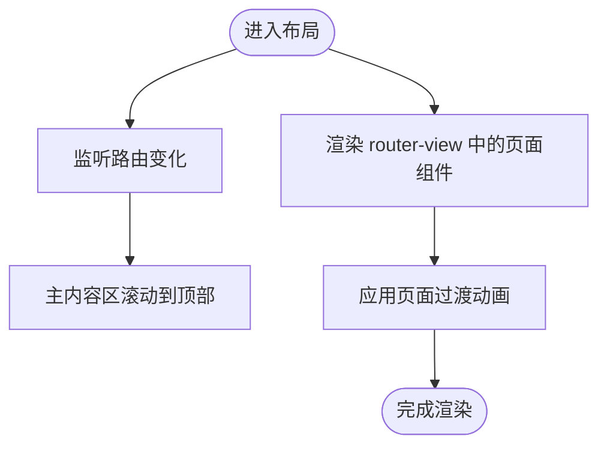
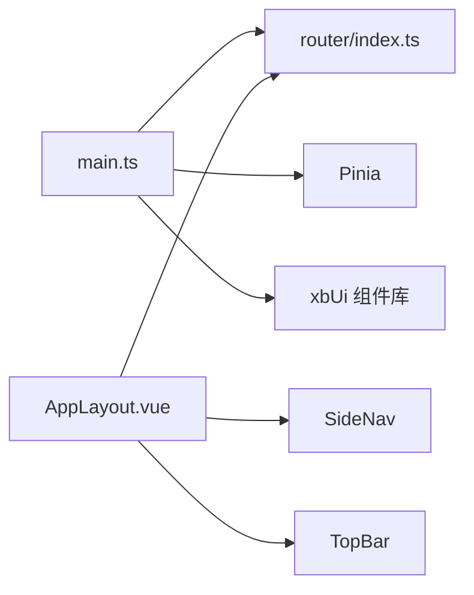

# 页面组件

<cite>
**本文引用的文件**   
- [main.ts](file://frontend/src/main.ts)
- [App.vue](file://frontend/src/App.vue)
- [index.ts](file://frontend/src/router/index.ts)
- [AppLayout.vue](file://frontend/src/layouts/AppLayout.vue)
</cite>

## 目录
1. [简介](#简介)
2. [项目结构](#项目结构)
3. [核心组件](#核心组件)
4. [架构总览](#架构总览)
5. [详细组件分析](#详细组件分析)
6. [依赖分析](#依赖分析)
7. [性能考虑](#性能考虑)
8. [故障排查指南](#故障排查指南)
9. [结论](#结论)
10. [附录](#附录)

## 简介
本章节聚焦前端页面级组件的组织与实现，围绕布局设计、数据流管理、用户交互处理等核心概念展开。文档将说明首页、资产管理、协作创作、资产市场等主要业务页面的组织方式与复用策略，并给出性能优化、SEO配置、移动端适配和用户体验优化的实践建议。

## 项目结构
前端采用 Vue 3 + Vue Router + Pinia 的轻量 SPA 架构。入口应用负责初始化全局插件、路由守卫与事件总线；根组件仅承载路由视图；布局组件提供侧边栏、顶栏与主内容区，统一页面过渡与滚动行为。

图表来源
- [main.ts:1-21](file://frontend/src/main.ts#L1-L21)
- [App.vue:1-4](file://frontend/src/App.vue#L1-L4)
- [index.ts:1-15](file://frontend/src/router/index.ts#L1-L15)
- [AppLayout.vue:1-50](file://frontend/src/layouts/AppLayout.vue#L1-L50)

章节来源
- [main.ts:1-21](file://frontend/src/main.ts#L1-L21)
- [App.vue:1-4](file://frontend/src/App.vue#L1-L4)
- [index.ts:1-15](file://frontend/src/router/index.ts#L1-L15)
- [AppLayout.vue:1-50](file://frontend/src/layouts/AppLayout.vue#L1-L50)

## 核心组件
- 应用入口 main.ts
  - 职责：创建应用实例、注册 Pinia、Router、自定义 UI 库、注册全局 HTTP 状态码事件处理器、挂载到 DOM。
  - 关键点：通过事件总线触发登录弹窗等全局交互；集中式错误拦截由外部模块完成。
- 根组件 App.vue
  - 职责：作为最外层容器，渲染当前路由对应的页面组件。
- 路由 index.ts
  - 职责：创建 Hash 模式路由实例，加载路由表，安装前置/后置守卫。
- 布局 AppLayout.vue
  - 职责：提供全屏布局（侧边导航 + 顶部栏 + 主内容区），监听路由变化自动滚动至顶部，为页面切换添加淡入淡出过渡效果。

章节来源
- [main.ts:1-21](file://frontend/src/main.ts#L1-L21)
- [App.vue:1-4](file://frontend/src/App.vue#L1-L4)
- [index.ts:1-15](file://frontend/src/router/index.ts#L1-L15)
- [AppLayout.vue:1-50](file://frontend/src/layouts/AppLayout.vue#L1-L50)

## 架构总览
下图展示了从应用启动到页面渲染的关键流程，以及布局层对路由视图的统一包装。

图表来源
- [main.ts:1-21](file://frontend/src/main.ts#L1-L21)
- [index.ts:1-15](file://frontend/src/router/index.ts#L1-L15)
- [AppLayout.vue:1-50](file://frontend/src/layouts/AppLayout.vue#L1-L50)

## 详细组件分析

### 应用入口 main.ts
- 初始化顺序
  - 创建应用实例
  - 注册 Pinia 状态管理
  - 注册路由
  - 注册 xbUi 组件库
  - 注册全局 HTTP 状态码事件处理器（如 401/403/301/302）
  - 挂载到 DOM
- 关键交互
  - 通过事件总线触发登录弹窗，便于在鉴权失败时统一引导用户登录。
- 扩展点
  - 可接入全局消息提示（Toast）以增强反馈体验。

章节来源
- [main.ts:1-21](file://frontend/src/main.ts#L1-L21)

### 根组件 App.vue
- 职责单一：仅包含路由视图占位符，确保所有页面均通过路由注入。
- 优势：保持根组件轻量化，利于后续引入全局样式或主题切换。

章节来源
- [App.vue:1-4](file://frontend/src/App.vue#L1-L4)

### 路由 index.ts
- 历史模式：Hash 模式，适合静态托管环境。
- 生命周期钩子：
  - beforeEach：用于权限校验、跳转前拦截等。
  - afterEach：用于埋点、标题更新等。
- 可扩展性：新增页面只需在路由表中注册，即可被布局包裹并参与过渡动画。

章节来源
- [index.ts:1-15](file://frontend/src/router/index.ts#L1-L15)

### 布局 AppLayout.vue
- 布局结构
  - 左侧：SideNav（侧边导航）
  - 顶部：TopBar（顶部栏）
  - 主体：router-view 包裹页面组件，支持 out-in 过渡
  - 底部：版权信息
- 交互细节
  - 监听路由变化，自动将主内容区滚动至顶部，保证一致的阅读起点。
  - 通过 transition 组件实现页面切换时的淡入淡出与位移效果。
- 样式要点
  - 使用 flex 布局撑满视口，主内容区可滚动。
  - 定义 page-enter-active/page-leave-active 等过渡类名。

图表来源
- [AppLayout.vue:1-50](file://frontend/src/layouts/AppLayout.vue#L1-L50)

章节来源
- [AppLayout.vue:1-50](file://frontend/src/layouts/AppLayout.vue#L1-L50)

### 主要业务页面组织与复用策略（概念性说明）
- 首页
  - 定位：品牌展示、功能入口、推荐内容聚合。
  - 组件复用：Banner、卡片列表、分类筛选、搜索框等通用区块。
- 资产管理
  - 定位：资产的增删改查、批量操作、预览与下载。
  - 组件复用：分页表格、筛选器、上传组件、预览模态框。
- 协作创作
  - 定位：多人协同编辑、版本对比、评论与任务分配。
  - 组件复用：富文本编辑器、实时状态指示、时间线组件。
- 资产市场
  - 定位：商品展示、购买流程、评价与收藏。
  - 组件复用：商品卡片、购物车、支付流程步骤条。

[本节为概念性说明，不直接分析具体源码文件]

## 依赖分析
- 内部依赖
  - main.ts 依赖 router、Pinia、xbUi、事件系统。
  - AppLayout.vue 依赖 SideNav、TopBar 与 vue-router。
- 外部依赖
  - Vue 3 运行时与模板编译器
  - Vue Router（Hash 模式）
  - Pinia（状态管理）
  - 自定义 UI 库 xbUi

图表来源
- [main.ts:1-21](file://frontend/src/main.ts#L1-L21)
- [index.ts:1-15](file://frontend/src/router/index.ts#L1-L15)
- [AppLayout.vue:1-50](file://frontend/src/layouts/AppLayout.vue#L1-L50)

章节来源
- [main.ts:1-21](file://frontend/src/main.ts#L1-L21)
- [index.ts:1-15](file://frontend/src/router/index.ts#L1-L15)
- [AppLayout.vue:1-50](file://frontend/src/layouts/AppLayout.vue#L1-L50)

## 性能考虑
- 路由与组件
  - 使用路由懒加载减少首屏体积（按需引入页面组件）。
  - 在布局中使用 keep-alive 缓存高频页面，避免重复渲染。
- 资源与网络
  - 图片与媒体资源启用压缩与 CDN 缓存。
  - 接口请求合并与去抖防抖，避免频繁重绘。
- 渲染与交互
  - 长列表使用虚拟滚动或分页加载。
  - 大对象变更使用浅比较与局部更新，减少不必要的重渲染。
- SEO 与可发现性
  - 若需 SEO，考虑 SSR/SSG 方案或预渲染关键页面。
  - 为重要页面设置动态 title、meta 描述与结构化数据。
- 移动端适配
  - 基于响应式断点与弹性布局，确保小屏可用性与触控友好。
  - 避免固定高度导致溢出，合理使用 overflow 与滚动区域。
- 用户体验
  - 页面切换过渡动画时长适中，避免阻塞主线程。
  - 统一错误提示与空状态展示，提升可感知稳定性。

[本节提供通用指导，不直接分析具体源码文件]

## 故障排查指南
- 路由未生效
  - 检查路由表是否正确注册，是否被布局路由包裹。
  - 确认 beforeEach/afterEach 中是否存在阻断逻辑。
- 页面未显示或空白
  - 检查 App.vue 是否包含 router-view。
  - 确认路由路径与组件导入路径一致。
- 布局滚动异常
  - 检查主内容区是否设置了 overflow 与 ref 引用。
  - 确认路由变化监听是否触发滚动到顶部。
- 全局事件未触发
  - 检查 main.ts 中事件处理器是否注册成功。
  - 确认事件总线实例是否唯一且正确传递。

章节来源
- [index.ts:1-15](file://frontend/src/router/index.ts#L1-L15)
- [App.vue:1-4](file://frontend/src/App.vue#L1-L4)
- [AppLayout.vue:1-50](file://frontend/src/layouts/AppLayout.vue#L1-L50)
- [main.ts:1-21](file://frontend/src/main.ts#L1-L21)

## 结论
本项目的前端页面体系以“入口初始化 + 根容器 + 路由 + 统一布局”为核心骨架，具备清晰的职责边界与良好的扩展性。通过统一的布局过渡、滚动行为与全局事件机制，能够高效支撑首页、资产管理、协作创作、资产市场等多业务场景。后续可在路由懒加载、缓存策略、SEO 与移动端体验方面持续优化，进一步提升性能与可用性。

## 附录
- 术语
  - SPA：单页应用
  - SSR/SSG：服务端渲染/静态站点生成
  - 路由守卫：在路由切换前后执行的钩子函数
  - 事件总线：跨组件通信的发布订阅机制