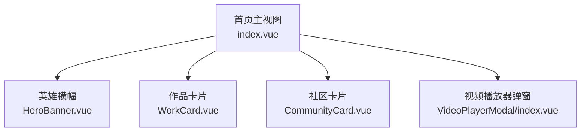
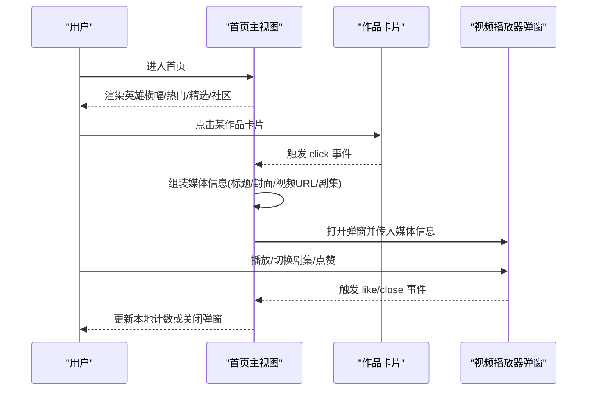
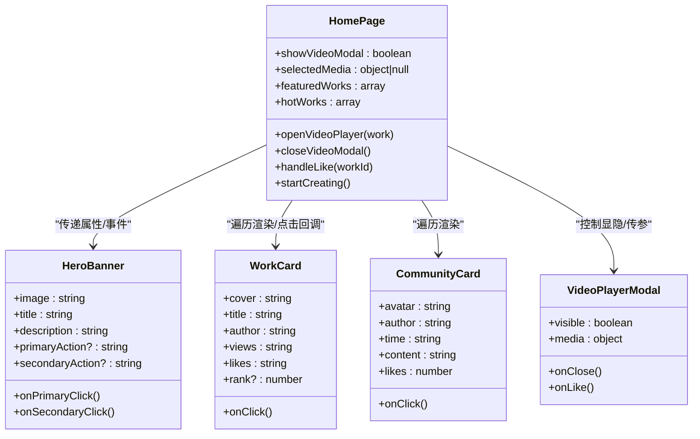
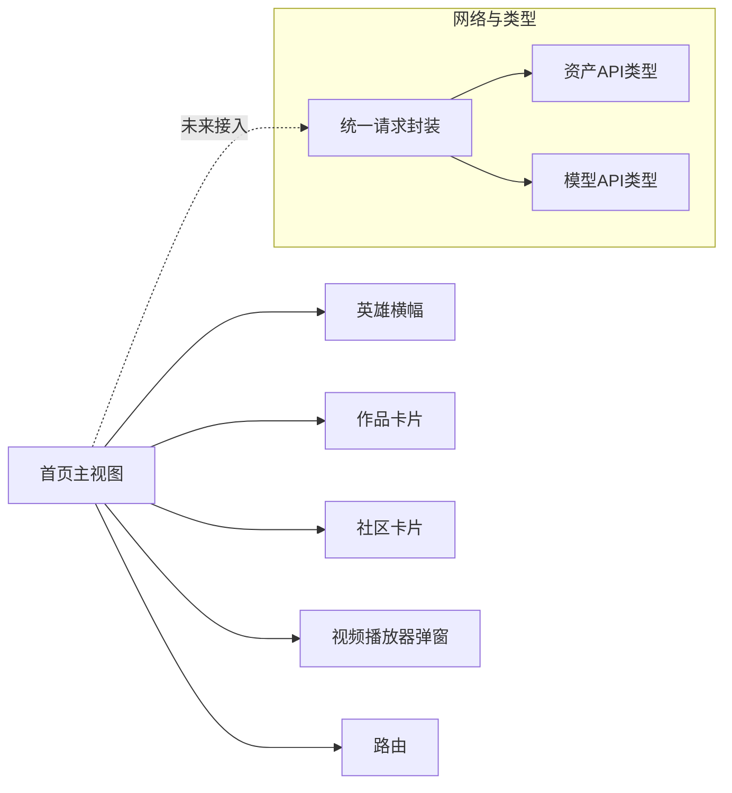

# 首页组件

<cite>
**本文引用的文件**   
- [frontend/src/views/HomePage/index.vue](file://frontend/src/views/HomePage/index.vue)
- [frontend/src/views/HomePage/components/HeroBanner.vue](file://frontend/src/views/HomePage/components/HeroBanner.vue)
- [frontend/src/views/HomePage/components/WorkCard.vue](file://frontend/src/views/HomePage/components/WorkCard.vue)
- [frontend/src/views/HomePage/components/CommunityCard.vue](file://frontend/src/views/HomePage/components/CommunityCard.vue)
- [frontend/src/components/VideoPlayerModal/index.vue](file://frontend/src/components/VideoPlayerModal/index.vue)
- [frontend/index.html](file://frontend/index.html)
- [frontend/src/utils/request/index.ts](file://frontend/src/utils/request/index.ts)
- [frontend/src/api/assets.ts](file://frontend/src/api/assets.ts)
- [frontend/src/api/model.ts](file://frontend/src/api/model.ts)
</cite>

## 目录
1. [简介](#简介)
2. [项目结构](#项目结构)
3. [核心组件](#核心组件)
4. [架构总览](#架构总览)
5. [详细组件分析](#详细组件分析)
6. [依赖关系分析](#依赖关系分析)
7. [性能考虑](#性能考虑)
8. [故障排查指南](#故障排查指南)
9. [结论](#结论)
10. [附录](#附录)

## 简介
本文件围绕“首页”页面进行系统化文档化，覆盖整体布局、英雄横幅、社区卡片与作品卡片的实现逻辑；并补充数据加载策略、用户引导流程、响应式设计与SEO优化配置；同时梳理组件间通信机制、性能优化技巧与用户体验设计原则。目标是帮助开发者快速理解与扩展首页功能。

## 项目结构
首页由一个主视图与若干子组件构成：
- 主视图负责聚合数据、编排布局、处理交互（如打开视频播放器、跳转创作页）
- 子组件包括英雄横幅、作品卡片、社区卡片等展示型组件
- 视频播放通过通用弹窗组件承载

图表来源
- [frontend/src/views/HomePage/index.vue:1-189](file://frontend/src/views/HomePage/index.vue#L1-L189)
- [frontend/src/views/HomePage/components/HeroBanner.vue:1-39](file://frontend/src/views/HomePage/components/HeroBanner.vue#L1-L39)
- [frontend/src/views/HomePage/components/WorkCard.vue:1-53](file://frontend/src/views/HomePage/components/WorkCard.vue#L1-L53)
- [frontend/src/views/HomePage/components/CommunityCard.vue:1-34](file://frontend/src/views/HomePage/components/CommunityCard.vue#L1-L34)
- [frontend/src/components/VideoPlayerModal/index.vue](file://frontend/src/components/VideoPlayerModal/index.vue)

章节来源
- [frontend/src/views/HomePage/index.vue:1-189](file://frontend/src/views/HomePage/index.vue#L1-L189)

## 核心组件
- 英雄横幅：提供品牌信息、主副行动按钮，支持点击事件回调
- 作品卡片：展示封面、标题、作者、观看数与点赞数，可选排名徽章，悬停显示播放图标
- 社区卡片：展示用户头像、昵称、时间、内容与点赞数
- 视频播放器弹窗：以模态形式播放视频，支持多集切换与互动（如点赞）

章节来源
- [frontend/src/views/HomePage/components/HeroBanner.vue:1-39](file://frontend/src/views/HomePage/components/HeroBanner.vue#L1-L39)
- [frontend/src/views/HomePage/components/WorkCard.vue:1-53](file://frontend/src/views/HomePage/components/WorkCard.vue#L1-L53)
- [frontend/src/views/HomePage/components/CommunityCard.vue:1-34](file://frontend/src/views/HomePage/components/CommunityCard.vue#L1-L34)
- [frontend/src/components/VideoPlayerModal/index.vue](file://frontend/src/components/VideoPlayerModal/index.vue)

## 架构总览
首页采用“父组件管理状态 + 子组件纯展示 + 弹窗承载复杂交互”的轻量架构。当前版本的数据为本地静态数据，便于快速演示与开发；后续可替换为API拉取。

图表来源
- [frontend/src/views/HomePage/index.vue:63-78](file://frontend/src/views/HomePage/index.vue#L63-L78)
- [frontend/src/views/HomePage/components/WorkCard.vue:17-18](file://frontend/src/views/HomePage/components/WorkCard.vue#L17-L18)
- [frontend/src/components/VideoPlayerModal/index.vue](file://frontend/src/components/VideoPlayerModal/index.vue)

## 详细组件分析

### 首页主视图（index.vue）
- 布局组织
  - 顶部英雄横幅区域
  - 热门作品排行区（网格布局）
  - 精选作品画廊区（网格布局）
  - 社区动态区（网格布局）
  - 底部视频播放器弹窗
- 数据与状态
  - 使用本地数组维护“精选作品”和“热门作品”，包含封面、标题、作者、观看数、点赞数、剧集列表等
  - 维护视频弹窗可见性与选中媒体信息
- 交互逻辑
  - 点击作品卡片时，根据ID映射到对应视频路径，构造媒体信息并打开弹窗
  - 点赞操作在本地数据中做简单反馈（可扩展至后端）
  - “开始创作”按钮跳转到创作入口路由
- 响应式与动画
  - 使用Tailwind栅格与间距类实现响应式布局
  - 根容器添加淡入动画类

章节来源
- [frontend/src/views/HomePage/index.vue:1-189](file://frontend/src/views/HomePage/index.vue#L1-L189)

#### 组件关系图（代码级）

图表来源
- [frontend/src/views/HomePage/index.vue:1-189](file://frontend/src/views/HomePage/index.vue#L1-L189)
- [frontend/src/views/HomePage/components/HeroBanner.vue:1-39](file://frontend/src/views/HomePage/components/HeroBanner.vue#L1-L39)
- [frontend/src/views/HomePage/components/WorkCard.vue:1-53](file://frontend/src/views/HomePage/components/WorkCard.vue#L1-L53)
- [frontend/src/views/HomePage/components/CommunityCard.vue:1-34](file://frontend/src/views/HomePage/components/CommunityCard.vue#L1-L34)
- [frontend/src/components/VideoPlayerModal/index.vue](file://frontend/src/components/VideoPlayerModal/index.vue)

### 英雄横幅（HeroBanner.vue）
- 属性定义：图片、标题、描述、主/次按钮文案
- 事件定义：主按钮点击、次按钮点击
- 视觉与交互：背景渐变遮罩、居中文本与按钮组、悬停与点击反馈

章节来源
- [frontend/src/views/HomePage/components/HeroBanner.vue:1-39](file://frontend/src/views/HomePage/components/HeroBanner.vue#L1-L39)

### 作品卡片（WorkCard.vue）
- 属性定义：封面、标题、作者、观看数、点赞数、可选排名
- 事件定义：点击事件
- 视觉与交互：封面缩放过渡、排名徽章样式、悬停播放图标渐显

章节来源
- [frontend/src/views/HomePage/components/WorkCard.vue:1-53](file://frontend/src/views/HomePage/components/WorkCard.vue#L1-L53)

### 社区卡片（CommunityCard.vue）
- 属性定义：头像首字、作者、时间、内容、点赞数
- 事件定义：点击事件（预留）
- 视觉与交互：头像占位、简洁排版、点赞计数

章节来源
- [frontend/src/views/HomePage/components/CommunityCard.vue:1-34](file://frontend/src/views/HomePage/components/CommunityCard.vue#L1-L34)

### 视频播放器弹窗（VideoPlayerModal）
- 作用：集中承载视频播放、剧集切换、点赞等交互
- 与首页通信：接收媒体信息与可见性控制，向上抛出关闭与点赞事件

章节来源
- [frontend/src/components/VideoPlayerModal/index.vue](file://frontend/src/components/VideoPlayerModal/index.vue)

## 依赖关系分析
- 组件内聚与耦合
  - 首页主视图承担编排职责，子组件保持高内聚低耦合
  - 弹窗作为独立能力被复用
- 外部依赖
  - 路由：用于导航到创作页
  - UI基础库：图标与通用按钮样式
  - 网络层：当前首页未直接调用API，但项目提供了统一的请求封装与资产/模型接口类型定义，便于后续接入

图表来源
- [frontend/src/views/HomePage/index.vue:1-189](file://frontend/src/views/HomePage/index.vue#L1-L189)
- [frontend/src/utils/request/index.ts:1-237](file://frontend/src/utils/request/index.ts#L1-L237)
- [frontend/src/api/assets.ts:1-135](file://frontend/src/api/assets.ts#L1-L135)
- [frontend/src/api/model.ts:1-106](file://frontend/src/api/model.ts#L1-L106)

章节来源
- [frontend/src/utils/request/index.ts:1-237](file://frontend/src/utils/request/index.ts#L1-L237)
- [frontend/src/api/assets.ts:1-135](file://frontend/src/api/assets.ts#L1-L135)
- [frontend/src/api/model.ts:1-106](file://frontend/src/api/model.ts#L1-L106)

## 性能考虑
- 渲染性能
  - 列表项使用稳定key（id），避免不必要的重渲染
  - 封面图建议启用懒加载与尺寸适配（结合CDN裁剪）
- 交互性能
  - 弹窗按需挂载，减少首屏DOM体积
  - 大列表分页或虚拟滚动（当数据量增长时）
- 资源优化
  - 图片压缩与WebP格式
  - 视频预加载策略与分片加载
- 网络优化
  - 使用统一请求封装的缓存与重试策略（可在拦截器层扩展）
  - 对热点数据（如热门作品）引入前端缓存

[本节为通用指导，不直接分析具体文件]

## 故障排查指南
- 常见问题定位
  - 视频无法播放：检查媒体URL映射与资源路径是否正确
  - 弹窗不显示：确认可见性状态与媒体对象字段是否完整
  - 点赞无反馈：确认事件冒泡与本地数据更新逻辑
- 日志与调试
  - 在关键交互处增加控制台输出，辅助定位问题
  - 使用浏览器开发者工具检查网络请求与资源加载

章节来源
- [frontend/src/views/HomePage/index.vue:80-88](file://frontend/src/views/HomePage/index.vue#L80-L88)

## 结论
当前首页实现了清晰的模块化结构与良好的交互体验，采用本地数据便于快速迭代。建议在后续阶段接入真实API，完善数据缓存、错误处理与SEO元信息，进一步提升性能与可发现性。

[本节为总结性内容，不直接分析具体文件]

## 附录

### 数据加载策略（现状与演进）
- 现状：首页数据为本地静态数组，适合演示与初期开发
- 演进建议：
  - 将“热门作品”“精选作品”“社区动态”替换为API拉取
  - 使用统一请求封装进行错误处理与重试
  - 对列表数据实施分页与增量加载

章节来源
- [frontend/src/views/HomePage/index.vue:25-61](file://frontend/src/views/HomePage/index.vue#L25-L61)
- [frontend/src/utils/request/index.ts:1-237](file://frontend/src/utils/request/index.ts#L1-L237)
- [frontend/src/api/assets.ts:1-135](file://frontend/src/api/assets.ts#L1-L135)
- [frontend/src/api/model.ts:1-106](file://frontend/src/api/model.ts#L1-L106)

### 用户引导流程
- 首次访问：英雄横幅主按钮引导至创作入口
- 浏览作品：点击作品卡片打开视频弹窗，提升沉浸体验
- 社区参与：社区卡片提供“进入社区”快捷入口

章节来源
- [frontend/src/views/HomePage/index.vue:96-98](file://frontend/src/views/HomePage/index.vue#L96-L98)
- [frontend/src/views/HomePage/index.vue:104-111](file://frontend/src/views/HomePage/index.vue#L104-L111)
- [frontend/src/views/HomePage/index.vue:165-166](file://frontend/src/views/HomePage/index.vue#L165-L166)

### 响应式设计要点
- 使用栅格系统在不同屏幕下调整列数
- 卡片与横幅采用相对单位与弹性布局
- 图片与视频自适应容器尺寸

章节来源
- [frontend/src/views/HomePage/index.vue:121-156](file://frontend/src/views/HomePage/index.vue#L121-L156)

### SEO优化配置
- 页面标题与描述已在入口HTML中设置
- 建议后续为各区块补充结构化数据与Open Graph标签

章节来源
- [frontend/index.html:1-15](file://frontend/index.html#L1-L15)