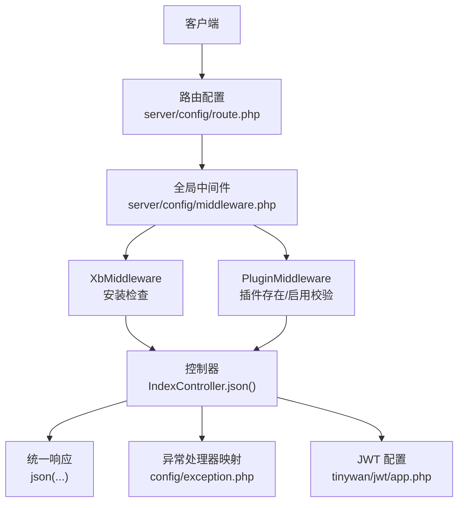
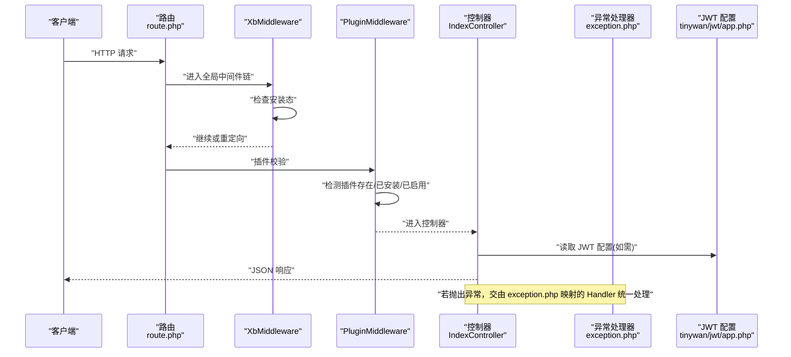
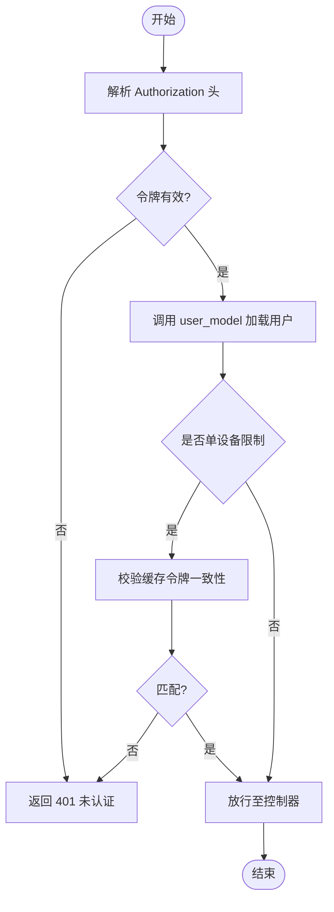
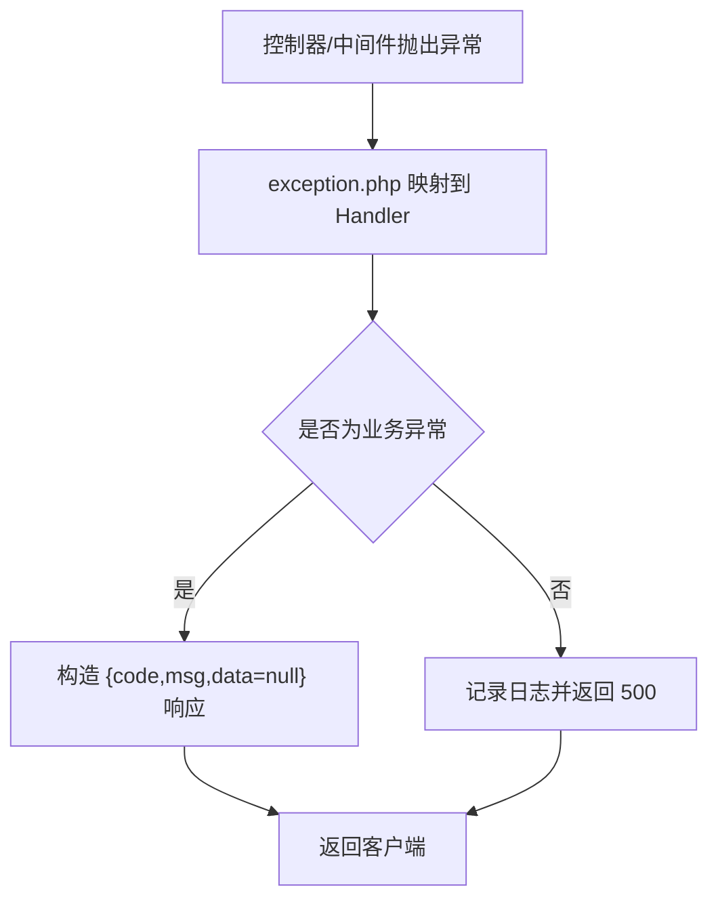
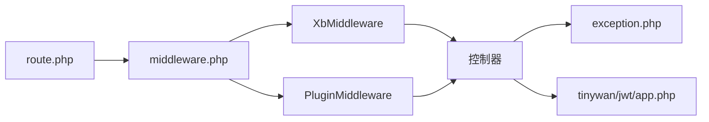

# API设计规范

<cite>
**本文引用的文件**   
- [server/config/route.php](file://server/config/route.php)
- [server/app/controller/IndexController.php](file://server/app/controller/IndexController.php)
- [server/support/Request.php](file://server/support/Request.php)
- [server/support/Response.php](file://server/support/Response.php)
- [server/config/plugin/tinywan/jwt/app.php](file://server/config/plugin/tinywan/jwt/app.php)
- [server/config/exception.php](file://server/config/exception.php)
- [server/config/middleware.php](file://server/config/middleware.php)
- [server/plugin/xbCode/app/middleware/XbMiddleware.php](file://server/plugin/xbCode/app/middleware/XbMiddleware.php)
- [server/plugin/xbCode/app/middleware/PluginMiddleware.php](file://server/plugin/xbCode/app/middleware/PluginMiddleware.php)
</cite>

## 目录
1. [引言](#引言)
2. [项目结构](#项目结构)
3. [核心组件](#核心组件)
4. [架构总览](#架构总览)
5. [详细组件分析](#详细组件分析)
6. [依赖分析](#依赖分析)
7. [性能考虑](#性能考虑)
8. [故障排查指南](#故障排查指南)
9. [结论](#结论)
10. [附录](#附录)

## 引言
本规范面向本项目（基于 Webman 的 PHP 后端）的 RESTful API 设计与实现，覆盖以下主题：
- RESTful 设计原则、URL 命名规范、HTTP 状态码使用
- 请求与响应格式、版本控制策略
- JWT 认证机制、参数校验、错误处理
- 分页查询、文件上传下载等通用能力
- 接口示例、Swagger 文档生成、接口测试方法

本规范同时结合仓库中已有的中间件、异常处理器、JWT 配置等实际代码进行落地说明。

## 项目结构
后端采用 Webman 框架，插件化组织业务模块。本次规范重点涉及的路由、控制器、支持类、中间件与配置如下：
- 路由入口：server/config/route.php
- 示例控制器：server/app/controller/IndexController.php
- 请求/响应封装：server/support/Request.php、server/support/Response.php
- 全局异常处理器映射：server/config/exception.php
- 全局中间件注册：server/config/middleware.php
- 插件级中间件：server/plugin/xbCode/app/middleware/XbMiddleware.php、server/plugin/xbCode/app/middleware/PluginMiddleware.php
- JWT 插件配置：server/config/plugin/tinywan/jwt/app.php

图示来源
- [server/config/route.php:1-22](file://server/config/route.php#L1-L22)
- [server/config/middleware.php:1-12](file://server/config/middleware.php#L1-L12)
- [server/plugin/xbCode/app/middleware/XbMiddleware.php:1-43](file://server/plugin/xbCode/app/middleware/XbMiddleware.php#L1-L43)
- [server/plugin/xbCode/app/middleware/PluginMiddleware.php:1-79](file://server/plugin/xbCode/app/middleware/PluginMiddleware.php#L1-L79)
- [server/app/controller/IndexController.php:1-43](file://server/app/controller/IndexController.php#L1-L43)
- [server/config/exception.php:1-17](file://server/config/exception.php#L1-L17)
- [server/config/plugin/tinywan/jwt/app.php:1-37](file://server/config/plugin/tinywan/jwt/app.php#L1-L37)

章节来源
- [server/config/route.php:1-22](file://server/config/route.php#L1-L22)
- [server/app/controller/IndexController.php:1-43](file://server/app/controller/IndexController.php#L1-L43)
- [server/support/Request.php:1-24](file://server/support/Request.php#L1-L24)
- [server/support/Response.php:1-24](file://server/support/Response.php#L1-L24)
- [server/config/exception.php:1-17](file://server/config/exception.php#L1-L17)
- [server/config/middleware.php:1-12](file://server/config/middleware.php#L1-L12)
- [server/plugin/xbCode/app/middleware/XbMiddleware.php:1-43](file://server/plugin/xbCode/app/middleware/XbMiddleware.php#L1-L43)
- [server/plugin/xbCode/app/middleware/PluginMiddleware.php:1-79](file://server/plugin/xbCode/app/middleware/PluginMiddleware.php#L1-L79)
- [server/config/plugin/tinywan/jwt/app.php:1-37](file://server/config/plugin/tinywan/jwt/app.php#L1-L37)

## 核心组件
- 路由层
  - 通过 server/config/route.php 集中定义 RESTful 资源路由，遵循“名词复数 + HTTP 动词”的约定。
- 控制器层
  - 以 IndexController 为例，返回 JSON 响应，体现统一的响应结构与状态码语义。
- 中间件层
  - 全局中间件在 config/middleware.php 中注册；插件级中间件用于安装态与插件启用态校验。
- 异常处理
  - 通过 config/exception.php 将未捕获异常映射到自定义 Handler，便于统一错误响应。
- 认证鉴权
  - 使用 tinywan/jwt 插件，提供 access_token/refresh_token 签发与校验能力，支持 RSA/HMAC 算法与缓存策略。
- 请求/响应封装
  - support/Request.php 与 support/Response.php 作为扩展点，可在此注入通用逻辑（如签名校验、审计日志）。

章节来源
- [server/config/route.php:1-22](file://server/config/route.php#L1-L22)
- [server/app/controller/IndexController.php:1-43](file://server/app/controller/IndexController.php#L1-L43)
- [server/config/middleware.php:1-12](file://server/config/middleware.php#L1-L12)
- [server/plugin/xbCode/app/middleware/XbMiddleware.php:1-43](file://server/plugin/xbCode/app/middleware/XbMiddleware.php#L1-L43)
- [server/plugin/xbCode/app/middleware/PluginMiddleware.php:1-79](file://server/plugin/xbCode/app/middleware/PluginMiddleware.php#L1-L79)
- [server/config/exception.php:1-17](file://server/config/exception.php#L1-L17)
- [server/config/plugin/tinywan/jwt/app.php:1-37](file://server/config/plugin/tinywan/jwt/app.php#L1-L37)
- [server/support/Request.php:1-24](file://server/support/Request.php#L1-L24)
- [server/support/Response.php:1-24](file://server/support/Response.php#L1-L24)

## 架构总览
下图展示一次受保护的 RESTful 请求从客户端到控制器的完整链路，以及中间件、异常处理与 JWT 配置的参与方式。

图示来源
- [server/config/route.php:1-22](file://server/config/route.php#L1-L22)
- [server/config/middleware.php:1-12](file://server/config/middleware.php#L1-L12)
- [server/plugin/xbCode/app/middleware/XbMiddleware.php:1-43](file://server/plugin/xbCode/app/middleware/XbMiddleware.php#L1-L43)
- [server/plugin/xbCode/app/middleware/PluginMiddleware.php:1-79](file://server/plugin/xbCode/app/middleware/PluginMiddleware.php#L1-L79)
- [server/app/controller/IndexController.php:1-43](file://server/app/controller/IndexController.php#L1-L43)
- [server/config/exception.php:1-17](file://server/config/exception.php#L1-L17)
- [server/config/plugin/tinywan/jwt/app.php:1-37](file://server/config/plugin/tinywan/jwt/app.php#L1-L37)

## 详细组件分析

### RESTful 设计原则与 URL 命名规范
- 资源导向：URL 表示资源，使用名词复数形式，避免动词。
- 层级清晰：子资源通过路径嵌套表达关系。
- 无状态：每次请求包含完成所需的全部信息。
- 幂等性：GET/PUT/DELETE 应满足幂等要求。
- 版本控制：建议通过 URL 前缀 /api/v1/ 管理版本演进。

参考示例（仅示意）：
- GET /api/v1/users
- POST /api/v1/users
- GET /api/v1/users/{id}
- PUT /api/v1/users/{id}
- DELETE /api/v1/users/{id}

章节来源
- [server/config/route.php:1-22](file://server/config/route.php#L1-L22)

### HTTP 状态码使用
- 2xx：成功
  - 200 OK：常规成功
  - 201 Created：创建成功
  - 204 No Content：删除成功且无响应体
- 4xx：客户端错误
  - 400 Bad Request：参数校验失败
  - 401 Unauthorized：未认证或令牌无效
  - 403 Forbidden：权限不足
  - 404 Not Found：资源不存在
  - 422 Unprocessable Entity：语义错误（如业务规则不满足）
- 5xx：服务端错误
  - 500 Internal Server Error：未捕获异常或系统错误

章节来源
- [server/app/controller/IndexController.php:1-43](file://server/app/controller/IndexController.php#L1-L43)
- [server/config/exception.php:1-17](file://server/config/exception.php#L1-L17)

### 请求与响应格式
- 请求
  - Content-Type：application/json（表单上传除外）
  - 认证头：Authorization: Bearer <access_token>
  - 分页参数：page、per_page
  - 排序与过滤：sort、filter.*
- 响应
  - 统一结构：{ code, msg, data }
  - code：业务状态码（0 表示成功）
  - msg：人类可读消息
  - data：业务数据（对象或数组）

章节来源
- [server/app/controller/IndexController.php:1-43](file://server/app/controller/IndexController.php#L1-L43)

### 版本控制策略
- URL 前缀：/api/v1/...
- 兼容性：新增字段保持向后兼容，废弃字段保留一段时间并标注弃用
- 变更日志：维护 CHANGELOG，记录破坏性变更

章节来源
- [server/config/route.php:1-22](file://server/config/route.php#L1-L22)

### JWT 认证机制
- 算法与密钥
  - 支持 HS256 及 RSA 公私钥对
  - 访问令牌与刷新令牌分别配置独立密钥与过期时间
- 令牌生命周期
  - access_exp：访问令牌有效期
  - refresh_exp：刷新令牌有效期
  - leeway：时钟偏差容忍
- 单设备与会话
  - is_single_device：是否限制单设备登录
  - cache_token_ttl：令牌缓存 TTL
- 获取令牌
  - is_support_get_token：是否支持从请求参数获取令牌
  - is_support_get_token_key：参数名（默认 authorization）
- 用户模型回调
  - user_model：根据 uid 加载用户信息的闭包

图示来源
- [server/config/plugin/tinywan/jwt/app.php:1-37](file://server/config/plugin/tinywan/jwt/app.php#L1-L37)

章节来源
- [server/config/plugin/tinywan/jwt/app.php:1-37](file://server/config/plugin/tinywan/jwt/app.php#L1-L37)

### 参数验证
- 前端/网关层：基础非空、类型、长度、格式校验
- 后端服务层：严格校验所有入参，拒绝非法值
- 错误提示：使用 422 返回具体字段错误信息，msg 中包含字段级错误列表

章节来源
- [server/app/controller/IndexController.php:1-43](file://server/app/controller/IndexController.php#L1-L43)

### 错误处理
- 全局异常映射：通过 config/exception.php 指定统一异常处理器
- 业务异常：在中间件或控制器中抛出业务异常，由统一处理器转换为标准错误响应
- 日志：记录关键异常堆栈与上下文，便于排障

图示来源
- [server/config/exception.php:1-17](file://server/config/exception.php#L1-L17)
- [server/plugin/xbCode/app/middleware/PluginMiddleware.php:1-79](file://server/plugin/xbCode/app/middleware/PluginMiddleware.php#L1-L79)

章节来源
- [server/config/exception.php:1-17](file://server/config/exception.php#L1-L17)
- [server/plugin/xbCode/app/middleware/PluginMiddleware.php:1-79](file://server/plugin/xbCode/app/middleware/PluginMiddleware.php#L1-L79)

### 分页查询
- 请求参数
  - page：页码，默认 1
  - per_page：每页条数，默认 20，最大上限建议 100
- 响应结构
  - data.list：当前页数据
  - data.total：总条数
  - data.page、data.per_page：当前分页参数
  - data.pages：总页数

章节来源
- [server/app/controller/IndexController.php:1-43](file://server/app/controller/IndexController.php#L1-L43)

### 文件上传与下载
- 上传
  - 端点：POST /api/v1/files
  - Content-Type：multipart/form-data
  - 字段：file（必填）、category（可选）
  - 响应：返回文件元信息与访问地址
- 下载
  - 端点：GET /api/v1/files/{id}/download
  - 鉴权：需要有效的 access_token
  - 响应：二进制流或重定向到存储地址

章节来源
- [server/app/controller/IndexController.php:1-43](file://server/app/controller/IndexController.php#L1-L43)

### 接口示例（示意）
- 健康检查
  - GET /api/v1/health
  - 响应：{ code: 0, msg: "ok", data: null }
- 用户列表
  - GET /api/v1/users?page=1&per_page=20
  - 响应：{ code: 0, msg: "ok", data: { list: [...], total: N, ... } }
- 创建用户
  - POST /api/v1/users
  - Body：{ name, email, phone }
  - 响应：{ code: 0, msg: "ok", data: { id, ... } }
- 更新用户
  - PUT /api/v1/users/{id}
  - Body：{ name?, email?, phone? }
  - 响应：{ code: 0, msg: "ok", data: { ... } }
- 删除用户
  - DELETE /api/v1/users/{id}
  - 响应：{ code: 0, msg: "ok", data: null }

章节来源
- [server/app/controller/IndexController.php:1-43](file://server/app/controller/IndexController.php#L1-L43)

### Swagger 文档生成
- 方案一：OpenAPI 注解
  - 在控制器方法上添加 OpenAPI 注解，描述路径、参数、响应与错误码
  - 构建阶段生成 openapi.yaml/json，供在线文档与客户端 SDK 使用
- 方案二：YAML 手工维护
  - 在项目根目录维护 openapi.yaml，按版本拆分文件
  - 使用工具（如 swagger-codegen）生成多语言客户端
- 集成建议
  - 在 CI 中增加文档校验步骤，确保接口与文档一致
  - 发布时自动部署静态文档站点

[本节为通用实践说明，不涉及具体源码]

### 接口测试方法
- 手动测试
  - 使用 Postman/Newman 或 curl 发起请求，覆盖正常、边界与异常场景
- 自动化测试
  - 使用 PHPUnit 编写接口用例，断言状态码与响应结构
  - 引入 Mock 外部依赖（数据库、第三方服务），保证测试稳定性
- 契约测试
  - 基于 OpenAPI 文档执行契约测试，防止前后端联调问题

[本节为通用实践说明，不涉及具体源码]

## 依赖分析
- 中间件依赖
  - XbMiddleware：负责安装态检查与重定向
  - PluginMiddleware：负责插件存在/安装/启用校验，并在不满足条件时抛出内部异常
- 异常处理依赖
  - 全局异常处理器映射在 exception.php 中指向 support\exception\Handler
- JWT 依赖
  - tinywan/jwt 插件配置位于 plugin/tinywan/jwt/app.php，提供令牌签发与校验所需的算法、密钥与缓存策略

图示来源
- [server/config/route.php:1-22](file://server/config/route.php#L1-L22)
- [server/config/middleware.php:1-12](file://server/config/middleware.php#L1-L12)
- [server/plugin/xbCode/app/middleware/XbMiddleware.php:1-43](file://server/plugin/xbCode/app/middleware/XbMiddleware.php#L1-L43)
- [server/plugin/xbCode/app/middleware/PluginMiddleware.php:1-79](file://server/plugin/xbCode/app/middleware/PluginMiddleware.php#L1-L79)
- [server/config/exception.php:1-17](file://server/config/exception.php#L1-L17)
- [server/config/plugin/tinywan/jwt/app.php:1-37](file://server/config/plugin/tinywan/jwt/app.php#L1-L37)

章节来源
- [server/config/middleware.php:1-12](file://server/config/middleware.php#L1-L12)
- [server/plugin/xbCode/app/middleware/XbMiddleware.php:1-43](file://server/plugin/xbCode/app/middleware/XbMiddleware.php#L1-L43)
- [server/plugin/xbCode/app/middleware/PluginMiddleware.php:1-79](file://server/plugin/xbCode/app/middleware/PluginMiddleware.php#L1-L79)
- [server/config/exception.php:1-17](file://server/config/exception.php#L1-L17)
- [server/config/plugin/tinywan/jwt/app.php:1-37](file://server/config/plugin/tinywan/jwt/app.php#L1-L37)

## 性能考虑
- 连接复用与长连接：Webman 基于 Workerman，充分利用事件驱动模型
- 缓存策略：合理使用 Redis 缓存热点数据与 JWT 令牌
- 限流与熔断：在网关或应用层对敏感接口实施限流
- 异步任务：耗时操作（如文件转码、报表生成）放入队列异步处理
- 数据库优化：索引、分页、只读副本与读写分离

[本节为通用实践说明，不涉及具体源码]

## 故障排查指南
- 常见错误
  - 401 未认证：检查 Authorization 头与 access_token 有效性
  - 403 权限不足：检查角色与权限分配
  - 404 资源不存在：核对 URL 与路由定义
  - 422 参数错误：检查请求体字段与校验规则
  - 500 服务器错误：查看日志与异常堆栈
- 定位步骤
  - 开启调试日志，记录请求 ID、参数与响应
  - 使用中间件打印关键路径（安装态、插件启用态）
  - 针对 JWT 相关错误，检查密钥、过期时间与缓存键

章节来源
- [server/config/exception.php:1-17](file://server/config/exception.php#L1-L17)
- [server/plugin/xbCode/app/middleware/PluginMiddleware.php:1-79](file://server/plugin/xbCode/app/middleware/PluginMiddleware.php#L1-L79)
- [server/plugin/xbCode/app/middleware/XbMiddleware.php:1-43](file://server/plugin/xbCode/app/middleware/XbMiddleware.php#L1-L43)

## 结论
本规范围绕 RESTful 设计、统一响应、JWT 认证、异常处理、分页与文件传输等核心主题，给出了在本项目中的落地方案与最佳实践。配合 OpenAPI 文档与自动化测试，可有效提升接口质量与团队协作效率。

## 附录
- 术语
  - 访问令牌：短期有效的身份凭证
  - 刷新令牌：长期有效的令牌续期凭证
  - 幂等：多次相同请求产生相同副作用
- 参考
  - Webman 官方文档
  - OpenAPI 规范
  - JWT RFC 7519

[本节为补充说明，不涉及具体源码]