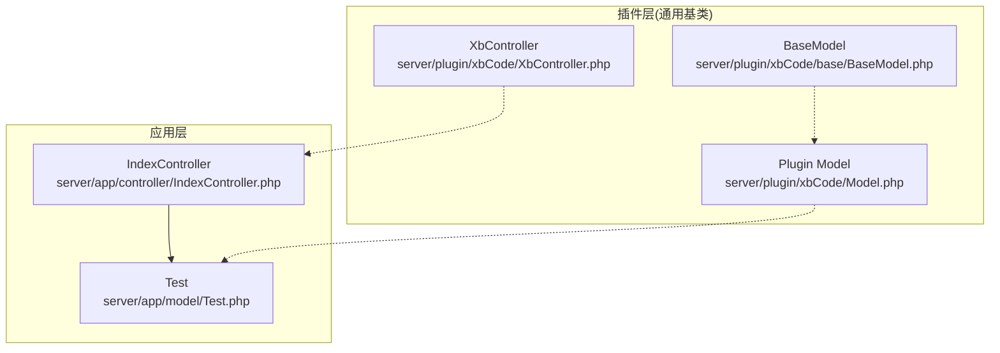
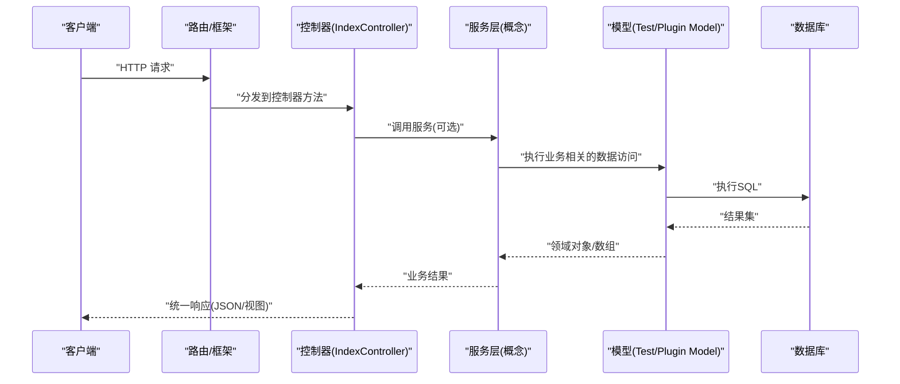
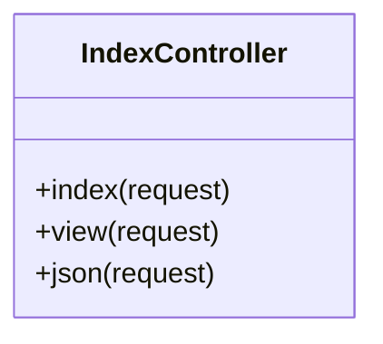
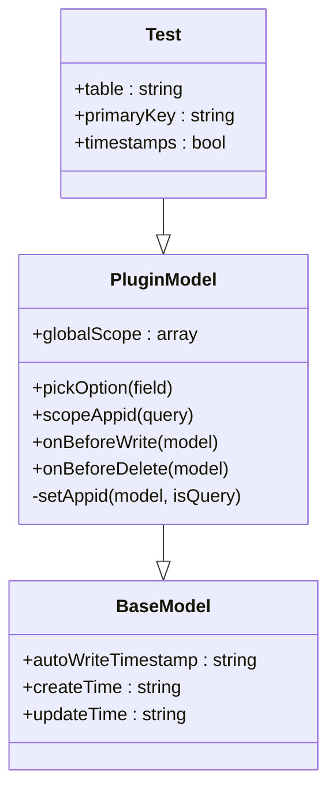
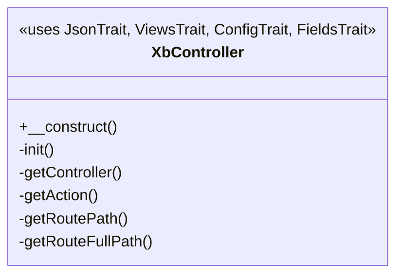
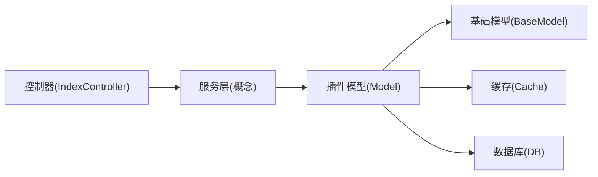

# MVC架构模式

<cite>
**本文引用的文件**   
- [IndexController.php](file://server/app/controller/IndexController.php)
- [Test.php](file://server/app/model/Test.php)
- [XbController.php](file://server/plugin/xbCode/XbController.php)
- [Model.php](file://server/plugin/xbCode/Model.php)
- [BaseModel.php](file://server/plugin/xbCode/base/BaseModel.php)
</cite>

## 目录
1. [简介](#简介)
2. [项目结构](#项目结构)
3. [核心组件](#核心组件)
4. [架构总览](#架构总览)
5. [详细组件分析](#详细组件分析)
6. [依赖关系分析](#依赖关系分析)
7. [性能考虑](#性能考虑)
8. [故障排查指南](#故障排查指南)
9. [结论](#结论)
10. [附录](#附录)

## 简介
本文件围绕MVC（模型-视图-控制器）架构模式，结合仓库中实际代码，系统阐述控制器层、模型层与服务层的职责划分与设计原则。重点包括：
- 控制器的请求处理流程与响应封装
- 模型的数据库操作封装与通用能力
- 服务层的业务逻辑组织方式（概念性说明）
- 各层之间的调用关系与数据流转
- 命名规范、错误处理策略、事务管理等最佳实践

## 项目结构
本项目采用插件化架构，核心示例位于 server/app 下，通用扩展能力通过 plugin 提供。以下图展示与MVC相关的核心文件及其关系。

图表来源
- [IndexController.php:1-43](file://server/app/controller/IndexController.php#L1-L43)
- [Test.php:1-29](file://server/app/model/Test.php#L1-L29)
- [XbController.php:1-110](file://server/plugin/xbCode/XbController.php#L1-L110)
- [Model.php:1-116](file://server/plugin/xbCode/Model.php#L1-L116)
- [BaseModel.php:1-36](file://server/plugin/xbCode/base/BaseModel.php#L1-L36)

章节来源
- [IndexController.php:1-43](file://server/app/controller/IndexController.php#L1-L43)
- [Test.php:1-29](file://server/app/model/Test.php#L1-L29)
- [XbController.php:1-110](file://server/plugin/xbCode/XbController.php#L1-L110)
- [Model.php:1-116](file://server/plugin/xbCode/Model.php#L1-L116)
- [BaseModel.php:1-36](file://server/plugin/xbCode/base/BaseModel.php#L1-L36)

## 核心组件
- 控制器层
  - 负责接收HTTP请求、参数校验、调用服务或模型、组装响应。
  - 示例入口方法返回HTML、JSON或渲染视图，体现统一的响应封装风格。
- 模型层
  - 负责数据访问与领域对象映射，封装CRUD、查询范围、事件钩子等。
  - 示例模型配置表名、主键、时间戳行为；插件模型提供全局作用域与多租户字段注入。
- 服务层（概念）
  - 承载跨模型的业务编排、外部系统集成、事务边界管理、领域规则校验等。
  - 在现有仓库中未直接出现显式Service目录，但可在控制器或插件API中按此原则组织复杂逻辑。

章节来源
- [IndexController.php:1-43](file://server/app/controller/IndexController.php#L1-L43)
- [Test.php:1-29](file://server/app/model/Test.php#L1-L29)
- [Model.php:1-116](file://server/plugin/xbCode/Model.php#L1-L116)

## 架构总览
下图展示了从HTTP请求到模型访问的端到端流程，以及插件提供的通用能力如何被复用。

图表来源
- [IndexController.php:1-43](file://server/app/controller/IndexController.php#L1-L43)
- [Test.php:1-29](file://server/app/model/Test.php#L1-L29)
- [Model.php:1-116](file://server/plugin/xbCode/Model.php#L1-L116)

## 详细组件分析

### 控制器层分析
- 职责
  - 解析请求参数、鉴权与权限校验、调用服务/模型、构造响应。
  - 保持薄控制器：不包含复杂业务逻辑，避免直接写SQL。
- 设计要点
  - 使用统一的响应封装（如json()），便于前端一致处理。
  - 对异常进行集中捕获并转换为标准错误码与消息。
  - 将可复用的前置/后置逻辑抽取为中间件或基类方法。
- 示例参考
  - 返回HTML页面、渲染模板、返回JSON响应的三种典型路径。

图表来源
- [IndexController.php:1-43](file://server/app/controller/IndexController.php#L1-L43)

章节来源
- [IndexController.php:1-43](file://server/app/controller/IndexController.php#L1-L43)

### 模型层分析
- 职责
  - 定义表映射、主键、时间戳等元信息。
  - 提供查询范围、事件钩子、选择器数据等通用能力。
- 设计要点
  - 单一职责：只关注数据访问与领域建模，不承载跨模块业务编排。
  - 使用全局作用域实现公共过滤条件（如多租户）。
  - 利用事件钩子在写入/删除前自动填充必要字段。
- 示例参考
  - 基础模型配置表名、主键、时间戳开关。
  - 插件模型提供全局作用域与“saas_appid”字段自动注入。

图表来源
- [BaseModel.php:1-36](file://server/plugin/xbCode/base/BaseModel.php#L1-L36)
- [Model.php:1-116](file://server/plugin/xbCode/Model.php#L1-L116)
- [Test.php:1-29](file://server/app/model/Test.php#L1-L29)

章节来源
- [Test.php:1-29](file://server/app/model/Test.php#L1-L29)
- [Model.php:1-116](file://server/plugin/xbCode/Model.php#L1-L116)
- [BaseModel.php:1-36](file://server/plugin/xbCode/base/BaseModel.php#L1-L36)

### 控制器基类与工具能力
- 职责
  - 提供控制器通用能力：获取控制器名、动作名、路由路径等。
  - 通过Trait引入JSON、视图、配置、字段等工具方法，减少重复代码。
- 设计要点
  - 所有业务控制器继承该基类，获得一致的上下文与工具方法。
  - 路由路径解析支持模块化场景，便于日志与审计。

图表来源
- [XbController.php:1-110](file://server/plugin/xbCode/XbController.php#L1-L110)

章节来源
- [XbController.php:1-110](file://server/plugin/xbCode/XbController.php#L1-L110)

### 服务层（概念性说明）
- 职责
  - 编排多个模型操作，实现跨表/跨系统的业务流程。
  - 管理事务边界、重试与补偿、缓存一致性、外部调用封装。
- 设计要点
  - 以用例为中心组织服务接口，输入输出清晰稳定。
  - 对外暴露领域语义化的方法名，隐藏底层实现细节。
  - 与控制器解耦，便于单元测试与复用。

[本节为概念性说明，不涉及具体源码文件]

## 依赖关系分析
- 控制器依赖
  - 控制器可直接调用模型或服务；建议优先调用服务，保持控制器轻量。
- 模型依赖
  - 插件模型依赖Think ORM与缓存，用于全局作用域与字段缓存。
- 基类与Trait
  - 控制器基类通过Trait组合能力，提升复用性与一致性。

图表来源
- [IndexController.php:1-43](file://server/app/controller/IndexController.php#L1-L43)
- [Model.php:1-116](file://server/plugin/xbCode/Model.php#L1-L116)
- [BaseModel.php:1-36](file://server/plugin/xbCode/base/BaseModel.php#L1-L36)

章节来源
- [IndexController.php:1-43](file://server/app/controller/IndexController.php#L1-L43)
- [Model.php:1-116](file://server/plugin/xbCode/Model.php#L1-L116)
- [BaseModel.php:1-36](file://server/plugin/xbCode/base/BaseModel.php#L1-L36)

## 性能考虑
- 查询优化
  - 合理使用索引与分页，避免全表扫描。
  - 使用字段投影减少数据传输量。
- 缓存策略
  - 对字典、枚举、配置类数据进行缓存，降低热点查询压力。
  - 注意缓存失效与一致性策略。
- 连接池与并发
  - 合理设置数据库连接池大小，避免连接耗尽。
  - 长耗时任务异步化（队列/进程），缩短请求时延。
- 批量操作
  - 大批量写入/更新使用批量接口，减少往返次数。

[本节为通用指导，不涉及具体源码文件]

## 故障排查指南
- 常见问题定位
  - 检查路由是否正确分发到控制器方法。
  - 确认模型表名、主键、字段是否与数据库一致。
  - 查看全局作用域是否意外过滤了数据（如多租户字段缺失）。
- 日志与监控
  - 记录关键请求ID、入参、出参与异常堆栈。
  - 对慢查询进行采样与分析。
- 错误处理策略
  - 统一异常类型与错误码，便于前端一致处理。
  - 区分用户可见错误与内部错误，避免泄露敏感信息。
- 事务管理
  - 明确事务边界，确保失败回滚。
  - 避免在事务中进行外部网络调用，必要时采用补偿机制。

[本节为通用指导，不涉及具体源码文件]

## 结论
- 控制器应保持薄且专注请求处理与响应封装。
- 模型应聚焦数据访问与领域建模，并通过全局作用域与事件钩子增强通用性。
- 服务层承担复杂业务编排与事务管理，是保证系统可维护性的关键。
- 借助插件基类与Trait，可快速构建一致的控制器与模型能力。

[本节为总结性内容，不涉及具体源码文件]

## 附录
- 命名规范建议
  - 控制器：PascalCase + Controller后缀，方法名动词+名词。
  - 模型：PascalCase，单数形式，与表名对应。
  - 服务：PascalCase + Service后缀，方法名表达领域意图。
- 响应格式建议
  - 统一包含状态码、消息、数据体，便于前端处理。
- 安全建议
  - 输入校验、权限校验、防注入、限流与熔断。

[本节为通用指导，不涉及具体源码文件]