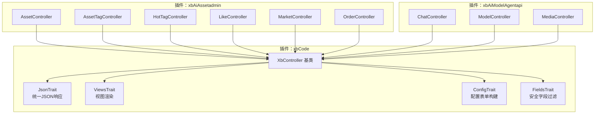
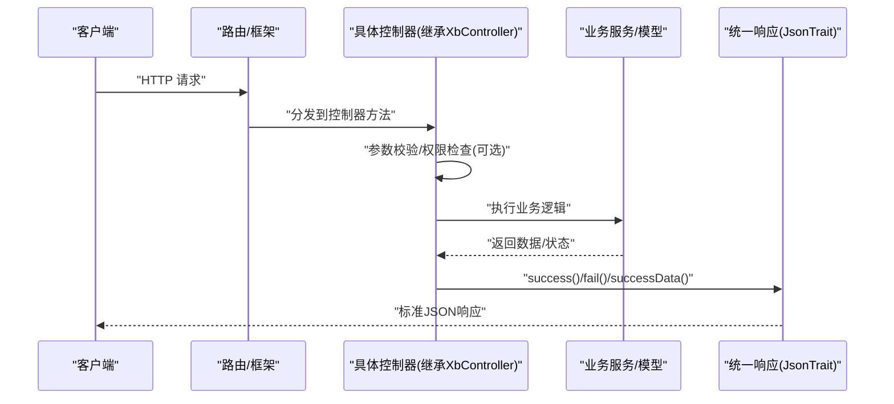
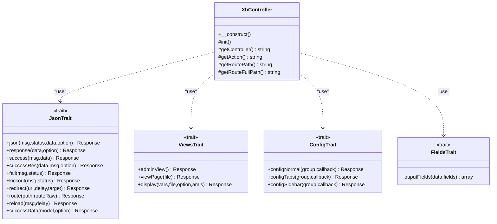
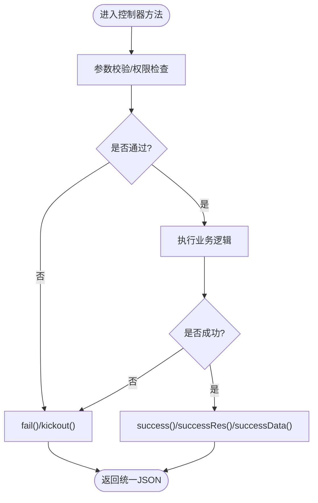
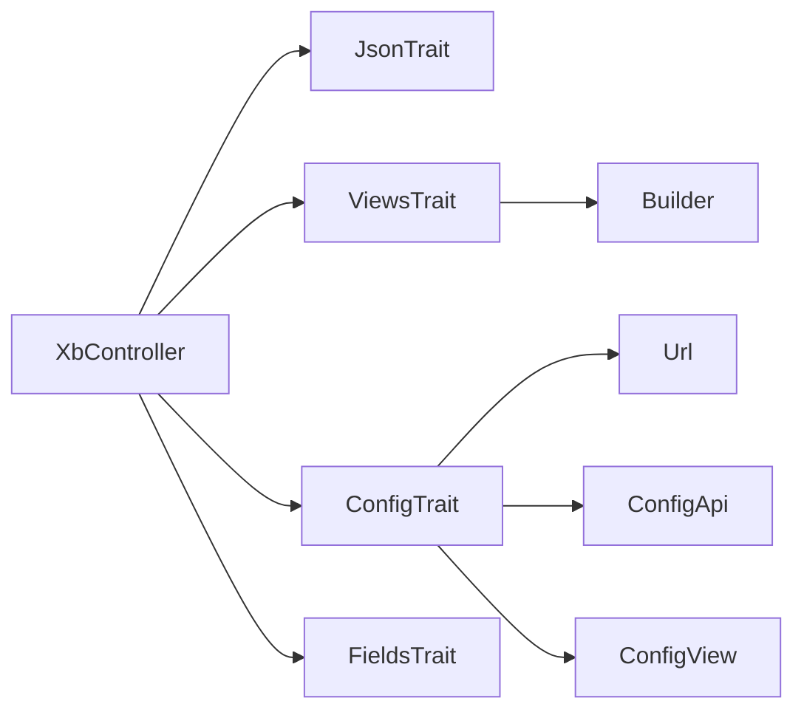

# 控制器层设计

<cite>
**本文引用的文件**
- [XbController.php](file://server/plugin/xbCode/XbController.php)
- [JsonTrait.php](file://server/plugin/xbCode/trait/JsonTrait.php)
- [ViewsTrait.php](file://server/plugin/xbCode/trait/ViewsTrait.php)
- [ConfigTrait.php](file://server/plugin/xbCode/trait/ConfigTrait.php)
- [FieldsTrait.php](file://server/plugin/xbCode/trait/FieldsTrait.php)
- [AssetController.php（插件：xbAiAsset，admin）](file://server/plugin/xbAiAsset/app/admin/controller/AssetController.php)
- [ChatController.php（插件：xbAiModelAgent，api）](file://server/plugin/xbAiModelAgent/app/api/controller/ChatController.php)
</cite>

## 目录
1. [引言](#引言)
2. [项目结构](#项目结构)
3. [核心组件](#核心组件)
4. [架构总览](#架构总览)
5. [详细组件分析](#详细组件分析)
6. [依赖关系分析](#依赖关系分析)
7. [性能与扩展性](#性能与扩展性)
8. [故障排查指南](#故障排查指南)
9. [结论](#结论)
10. [附录：最佳实践与示例路径](#附录最佳实践与示例路径)

## 引言
本章节聚焦于控制器层的职责边界、请求处理流程、参数验证、响应格式化等核心能力，并围绕 XbController 基类的设计模式进行系统化说明。XbController 通过组合多个 Trait 提供统一的 JSON 响应构造、视图渲染、配置表单构建与安全字段输出等通用能力；业务控制器仅需继承该基类即可复用这些横切关注点，从而保持控制器方法简洁、可测试且一致。

## 项目结构
控制器层位于各插件的 app 目录下，遵循“模块/控制器”的组织方式。例如：
- 管理端控制器：plugin/xbAiAsset/app/admin/controller/*
- 开放 API 控制器：plugin/xbAiModelAgent/app/api/controller/*
- 基础控制器与通用 Trait：plugin/xbCode/XbController.php 与 plugin/xbCode/trait/*

图表来源
- [XbController.php:1-110](file://server/plugin/xbCode/XbController.php#L1-L110)
- [JsonTrait.php:1-210](file://server/plugin/xbCode/trait/JsonTrait.php#L1-L210)
- [ViewsTrait.php:1-99](file://server/plugin/xbCode/trait/ViewsTrait.php#L1-L99)
- [ConfigTrait.php:1-125](file://server/plugin/xbCode/trait/ConfigTrait.php#L1-L125)
- [FieldsTrait.php:1-37](file://server/plugin/xbCode/trait/FieldsTrait.php#L1-L37)
- [AssetController.php（插件：xbAiAsset，admin）](file://server/plugin/xbAiAsset/app/admin/controller/AssetController.php)
- [ChatController.php（插件：xbAiModelAgent，api）](file://server/plugin/xbAiModelAgent/app/api/controller/ChatController.php)

章节来源
- [XbController.php:1-110](file://server/plugin/xbCode/XbController.php#L1-L110)

## 核心组件
- XbController 基类
  - 通过 use 引入 JsonTrait、ViewsTrait、ConfigTrait、FieldsTrait，为子类提供统一能力。
  - 提供 init() 钩子，便于子类在构造后执行初始化逻辑。
  - 提供 getController/getAction/getRoutePath/getRouteFullPath 等辅助方法，用于获取当前路由上下文信息。

- JsonTrait（统一响应）
  - json：封装标准 JSON 结构 {msg, status, data?, option?}。
  - response：校验返回数据格式并调用 json。
  - success/successRes/fail/kickout/redirect/route/reload：面向前端的便捷方法，内置事件名与提示文案，便于前端统一处理。
  - successData：将模型或分页结果转换为统一的数据结构 items/page/total。

- ViewsTrait（视图渲染）
  - adminView：后台单页入口渲染。
  - viewPage：按模块/控制器/方法自动解析 HTML 视图。
  - display：基于 Builder 渲染页面并包装为成功响应。

- ConfigTrait（配置表单）
  - configNormal/configTabs/configSidebar：根据 group 动态生成配置表单，支持 PUT 保存与回调定制。
  - 内部使用 Url/ConfigApi/ConfigView 完成 URL 生成、配置存取与表单构建。

- FieldsTrait（安全字段）
  - ouputFields：白名单过滤输出字段，避免敏感信息泄露。

章节来源
- [XbController.php:1-110](file://server/plugin/xbCode/XbController.php#L1-L110)
- [JsonTrait.php:1-210](file://server/plugin/xbCode/trait/JsonTrait.php#L1-L210)
- [ViewsTrait.php:1-99](file://server/plugin/xbCode/trait/ViewsTrait.php#L1-L99)
- [ConfigTrait.php:1-125](file://server/plugin/xbCode/trait/ConfigTrait.php#L1-L125)
- [FieldsTrait.php:1-37](file://server/plugin/xbCode/trait/FieldsTrait.php#L1-L37)

## 架构总览
下图展示了从 HTTP 请求进入，到控制器方法执行、调用服务/模型、最终返回统一响应的典型流程。XbController 作为所有控制器的父类，确保响应格式、视图渲染、配置表单等横切能力的一致性。

图表来源
- [XbController.php:1-110](file://server/plugin/xbCode/XbController.php#L1-L110)
- [JsonTrait.php:1-210](file://server/plugin/xbCode/trait/JsonTrait.php#L1-L210)

## 详细组件分析

### XbController 基类与 Trait 协作
- 设计要点
  - 组合优于继承：通过 Trait 注入能力，降低耦合度，提升可测试性。
  - 生命周期钩子：init() 允许子类在构造后注入依赖或加载配置。
  - 路由上下文：getController/getAction/getRoutePath/getRouteFullPath 帮助定位当前资源与方法，便于日志、鉴权、埋点等横切逻辑。

- 关键方法
  - __construct：调用 init()。
  - init：空实现，供子类覆盖。
  - getController/getAction/getRoutePath/getRouteFullPath：读取 request 上下文并规范化命名。

图表来源
- [XbController.php:1-110](file://server/plugin/xbCode/XbController.php#L1-L110)
- [JsonTrait.php:1-210](file://server/plugin/xbCode/trait/JsonTrait.php#L1-L210)
- [ViewsTrait.php:1-99](file://server/plugin/xbCode/trait/ViewsTrait.php#L1-L99)
- [ConfigTrait.php:1-125](file://server/plugin/xbCode/trait/ConfigTrait.php#L1-L125)
- [FieldsTrait.php:1-37](file://server/plugin/xbCode/trait/FieldsTrait.php#L1-L37)

章节来源
- [XbController.php:1-110](file://server/plugin/xbCode/XbController.php#L1-L110)

### 统一响应与错误处理（JsonTrait）
- 响应结构
  - 标准字段：msg、status、data（可选）、option（可选）。
  - option 中可携带前端事件指令，如 EVENT:NOTIFY、EVENT:KICKOUT、EVENT:REDIRECT、EVENT:ROUTE 等，便于前端集中处理。

- 常用方法
  - success/successRes：成功场景，前者附带通知事件，后者仅返回数据。
  - fail：失败场景，附带错误通知事件。
  - kickout：强制前端退出登录。
  - redirect/route/reload：驱动前端跳转、重定向或刷新。
  - successData：适配模型或分页结果，标准化 items/page/total。

- 错误处理建议
  - 业务异常优先抛出结构化异常，由全局异常处理器统一捕获并映射为 fail 响应。
  - 参数校验失败应返回明确的 msg 与合适的 status，避免直接暴露堆栈。

图表来源
- [JsonTrait.php:1-210](file://server/plugin/xbCode/trait/JsonTrait.php#L1-L210)

章节来源
- [JsonTrait.php:1-210](file://server/plugin/xbCode/trait/JsonTrait.php#L1-L210)

### 视图渲染与页面构建（ViewsTrait）
- adminView：后台 SPA 入口，若路径不带尾部斜杠则重定向补齐。
- viewPage：按模块/控制器/方法自动解析 HTML 视图，缺失时抛出异常。
- display：基于 Builder 渲染页面内容并包装为成功响应，适合动态页面片段。

章节来源
- [ViewsTrait.php:1-99](file://server/plugin/xbCode/trait/ViewsTrait.php#L1-L99)

### 配置表单快速构建（ConfigTrait）
- configNormal：普通配置项表单，GET 返回表单定义与数据，PUT 保存配置。
- configTabs：选项卡式配置，支持 _tab 参数区分保存范围。
- configSidebar：侧边栏模式，内部复用 configTabs 并设置 tabsMode 为 vertical。
- 回调机制：允许传入闭包对表单构建器进行二次定制。

章节来源
- [ConfigTrait.php:1-125](file://server/plugin/xbCode/trait/ConfigTrait.php#L1-L125)

### 安全字段输出（FieldsTrait）
- ouputFields：基于白名单过滤数组字段，避免敏感信息外泄。
- 适用场景：对外接口返回用户信息、资产信息等需要脱敏的场景。

章节来源
- [FieldsTrait.php:1-37](file://server/plugin/xbCode/trait/FieldsTrait.php#L1-L37)

### 控制器编写规范与示例路径
- RESTful 原则
  - 资源名词化，动词由 HTTP 方法表达：GET 列表/详情，POST 创建，PUT 更新，DELETE 删除。
  - 路径层级清晰：/module/controller/action，结合 XbController 的路由辅助方法可自动生成完整路径。

- 参数验证
  - 建议在控制器入口处进行必要校验，不合法直接 fail 并给出明确 msg。
  - 复杂校验可下沉至服务层或专用 Validator，但控制器需保证输入最小可信集。

- 响应格式化
  - 成功：successRes 或 successData（列表/分页）。
  - 失败：fail 或 kickout（认证失效）。
  - 前端交互：redirect/route/reload 配合 option 中的事件名。

- 示例参考路径
  - 管理端控制器示例：[AssetController.php（插件：xbAiAsset，admin）](file://server/plugin/xbAiAsset/app/admin/controller/AssetController.php)
  - 开放 API 控制器示例：[ChatController.php（插件：xbAiModelAgent，api）](file://server/plugin/xbAiModelAgent/app/api/controller/ChatController.php)

章节来源
- [AssetController.php（插件：xbAiAsset，admin）](file://server/plugin/xbAiAsset/app/admin/controller/AssetController.php)
- [ChatController.php（插件：xbAiModelAgent，api）](file://server/plugin/xbAiModelAgent/app/api/controller/ChatController.php)

## 依赖关系分析
- 内聚与耦合
  - XbController 高内聚地聚合了响应、视图、配置、字段等通用能力，业务控制器仅依赖基类，耦合度低。
  - Trait 之间无相互依赖，职责单一，易于替换与扩展。

- 外部依赖
  - JsonTrait 依赖框架的 json/response 函数。
  - ViewsTrait 依赖 Builder 与文件系统访问。
  - ConfigTrait 依赖 Url/ConfigApi/ConfigView 完成配置存取与表单构建。

图表来源
- [XbController.php:1-110](file://server/plugin/xbCode/XbController.php#L1-L110)
- [JsonTrait.php:1-210](file://server/plugin/xbCode/trait/JsonTrait.php#L1-L210)
- [ViewsTrait.php:1-99](file://server/plugin/xbCode/trait/ViewsTrait.php#L1-L99)
- [ConfigTrait.php:1-125](file://server/plugin/xbCode/trait/ConfigTrait.php#L1-L125)

章节来源
- [XbController.php:1-110](file://server/plugin/xbCode/XbController.php#L1-L110)

## 性能与扩展性
- 性能
  - 响应构造轻量，避免在控制器中进行重型计算。
  - 视图渲染按需加载，避免不必要的 I/O。
  - 配置表单缓存：ConfigApi 可在上层做缓存策略以减少重复查询。

- 扩展性
  - 新增横切能力：以 Trait 形式扩展，避免修改基类。
  - 自定义响应：在基类中增加新的便捷方法，或在中间件层统一拦截处理。
  - 鉴权与日志：可通过 init() 钩子或中间件接入，保持控制器纯净。

## 故障排查指南
- 常见问题
  - 视图文件不存在：ViewsTrait 会在找不到视图时抛出异常，检查路径与文件名是否正确。
  - 配置组未定义：ConfigTrait 在读取/保存配置时会依赖后端配置源，确认 group 与配置源一致。
  - 返回数据格式错误：response 会校验必须字段，确保包含 msg/status/data。

- 定位建议
  - 查看 option 中的 eventName 与 eventData，确认前端是否正确消费事件。
  - 使用 getRoutePath/getRouteFullPath 打印当前路由，核对路由匹配情况。
  - 在 init() 中记录关键上下文，便于问题复现与追踪。

章节来源
- [ViewsTrait.php:1-99](file://server/plugin/xbCode/trait/ViewsTrait.php#L1-L99)
- [ConfigTrait.php:1-125](file://server/plugin/xbCode/trait/ConfigTrait.php#L1-L125)
- [JsonTrait.php:1-210](file://server/plugin/xbCode/trait/JsonTrait.php#L1-L210)
- [XbController.php:1-110](file://server/plugin/xbCode/XbController.php#L1-L110)

## 结论
XbController 通过 Trait 组合提供了统一的响应、视图、配置与字段处理能力，使控制器专注于业务编排。遵循 RESTful 原则、严格的参数校验与一致的响应格式，能够显著提升 API 的可维护性与可观测性。建议在项目中广泛采用该模式，并通过中间件与全局异常处理完善鉴权、日志与错误上报。

## 附录：最佳实践与示例路径
- 控制器方法模板
  - 入参校验 → 业务调用 → 成功/失败响应 → 前端事件（可选）
- 推荐做法
  - 使用 successRes 返回纯数据，success 用于带通知的成功场景。
  - 列表/分页使用 successData 标准化 items/page/total。
  - 认证失败使用 kickout，配合前端统一处理。
  - 页面跳转使用 route/redirect，刷新使用 reload。
- 示例参考路径
  - 管理端控制器示例：[AssetController.php（插件：xbAiAsset，admin）](file://server/plugin/xbAiAsset/app/admin/controller/AssetController.php)
  - 开放 API 控制器示例：[ChatController.php（插件：xbAiModelAgent，api）](file://server/plugin/xbAiModelAgent/app/api/controller/ChatController.php)