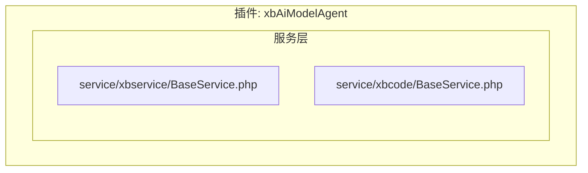
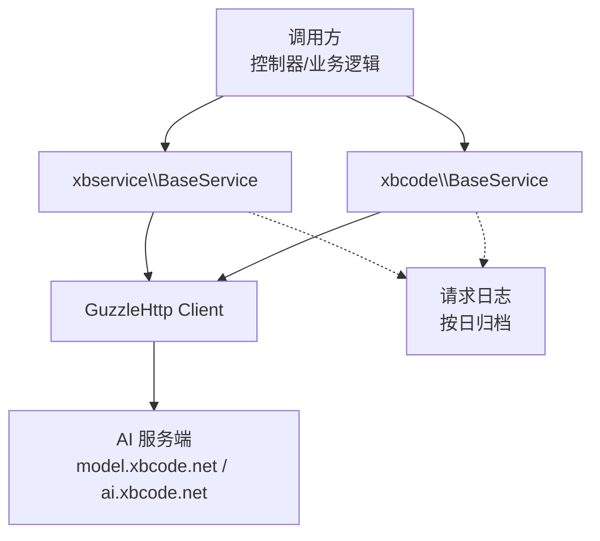
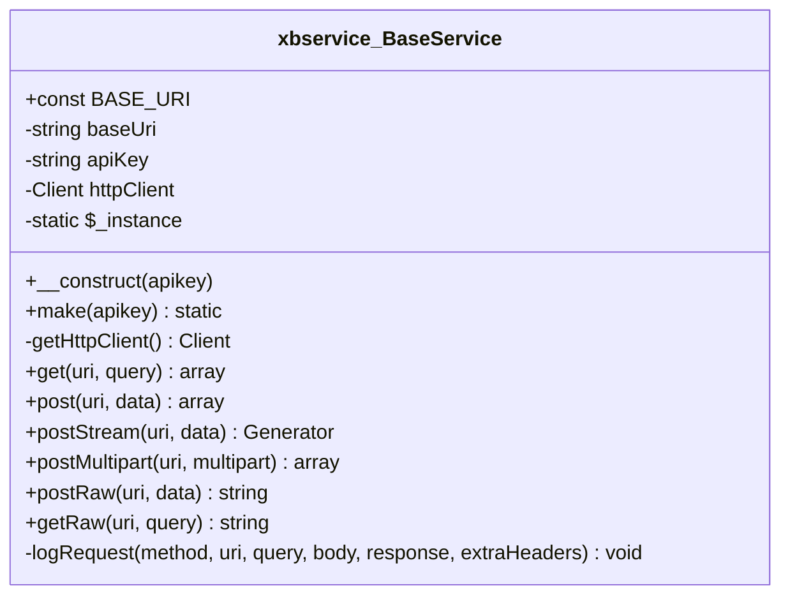
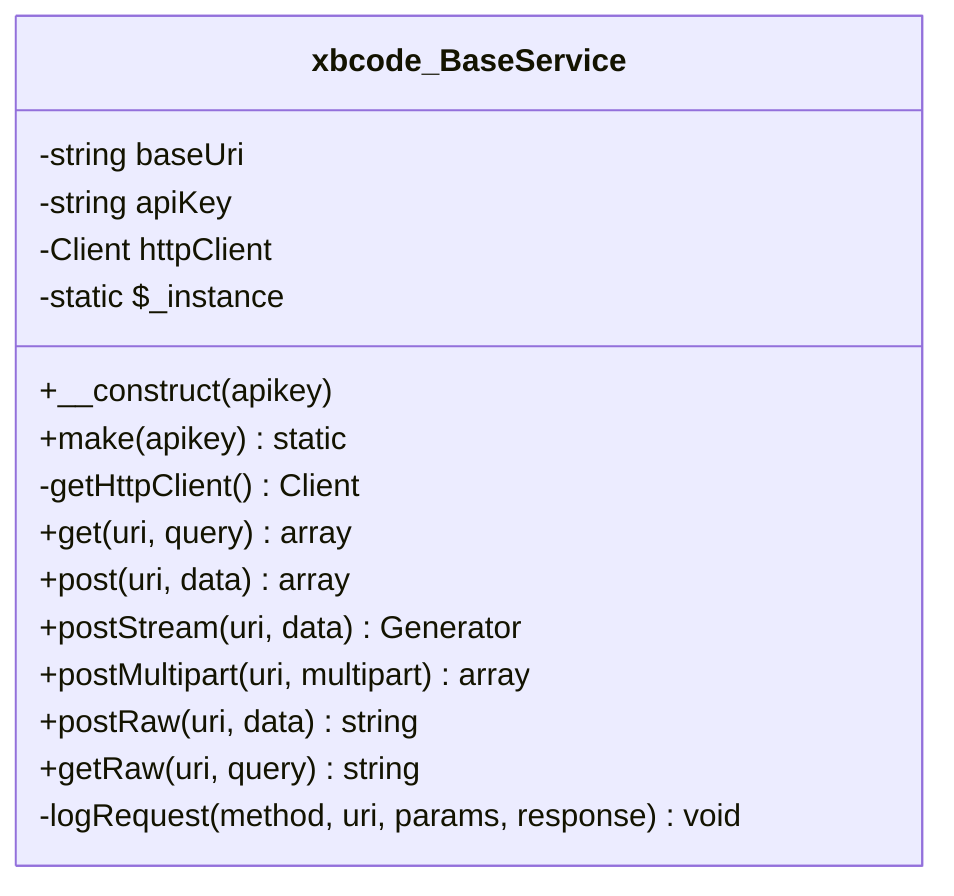
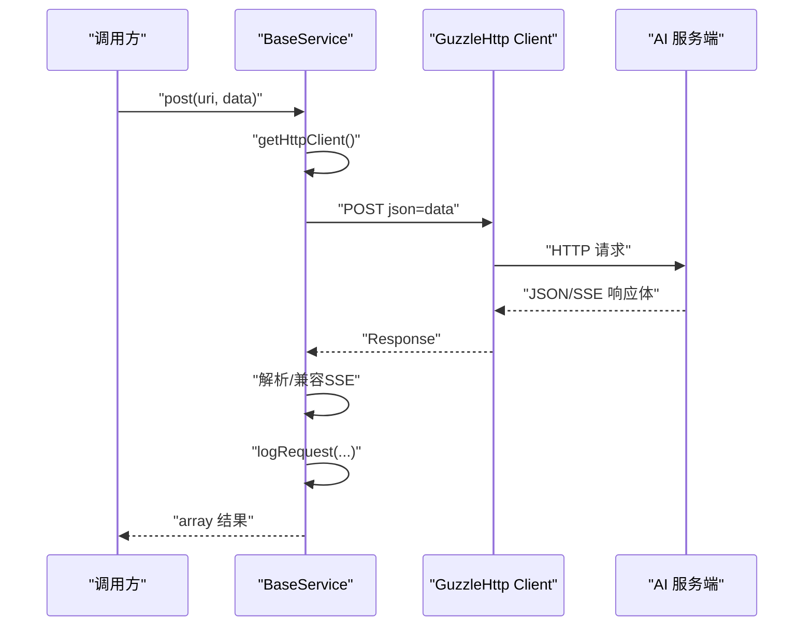
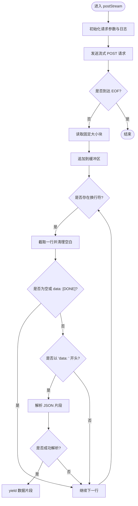
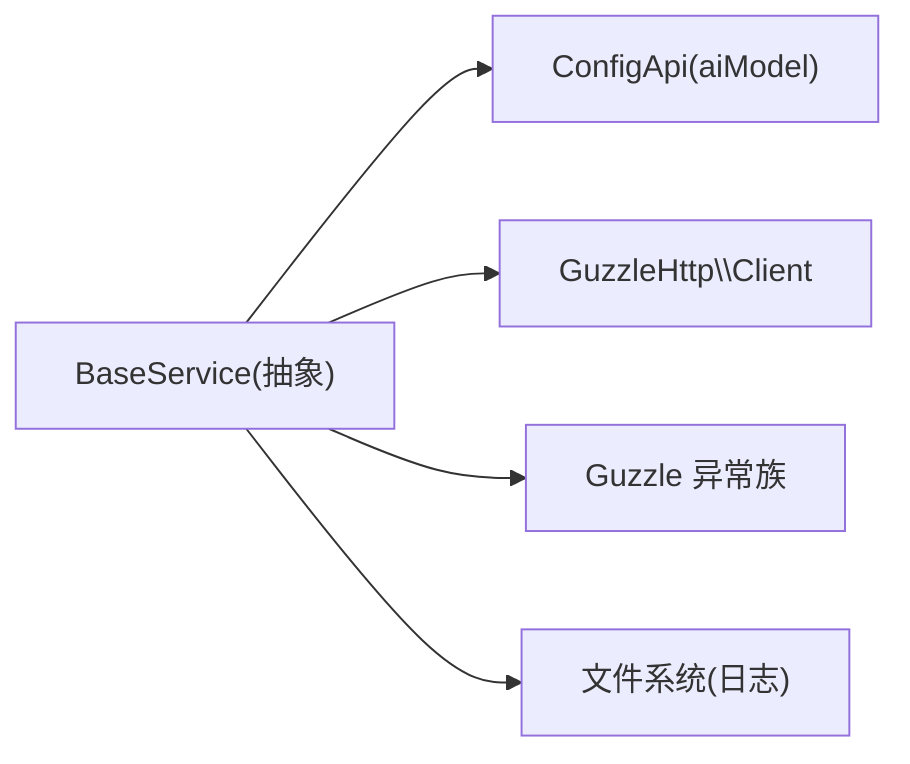

# 服务层设计

<cite>
**本文引用的文件**   
- [BaseService.php](file://server/plugin/xbAiModelAgent/service/xbservice/BaseService.php)
- [BaseService.php](file://server/plugin/xbAiModelAgent/service\xbcode\BaseService.php)
</cite>

## 目录
1. [简介](#简介)
2. [项目结构](#项目结构)
3. [核心组件](#核心组件)
4. [架构总览](#架构总览)
5. [详细组件分析](#详细组件分析)
6. [依赖关系分析](#依赖关系分析)
7. [性能考量](#性能考量)
8. [故障排查指南](#故障排查指南)
9. [结论](#结论)
10. [附录](#附录)

## 简介
本文件聚焦于服务层的设计与实现，围绕两个基础 HTTP 客户端基类展开：xbservice 与 xbcode。二者均提供统一的 API 访问能力、异常处理、日志记录、流式响应支持等通用功能，并通过配置中心注入 API Key，从而屏蔽底层网络细节，为上层业务服务提供稳定、可观测的对外调用能力。

## 项目结构
服务层位于插件模块下，按“xbservice”和“xbcode”两条技术线分别维护各自的 BaseService 抽象基类，便于在不同上游 AI 服务之间进行解耦与替换。

图表来源
- [BaseService.php:1-475](file://server/plugin/xbAiModelAgent/service/xbservice/BaseService.php#L1-L475)
- [BaseService.php:1-457](file://server/plugin/xbAiModelAgent/service\xbcode\BaseService.php#L1-L457)

章节来源
- [BaseService.php:1-475](file://server/plugin/xbAiModelAgent/service/xbservice/BaseService.php#L1-L475)
- [BaseService.php:1-457](file://server/plugin/xbAiModelAgent/service\xbcode\BaseService.php#L1-L457)

## 核心组件
- xbservice\BaseService：面向 model.xbcode.net 的统一 HTTP 客户端基类，提供 GET/POST/流式/原始二进制响应等方法，内置鉴权头、超时、SSE 兼容解析与请求日志落盘。
- xbcode\BaseService：面向 ai.xbcode.net 的统一 HTTP 客户端基类，能力与前者一致，差异在于默认 base_uri、实例化策略（单例）与日志路径。

共性职责
- 统一认证：通过 Bearer Token 自动附加 Authorization 请求头。
- 统一错误：将 ClientException/ServerException/GuzzleException 转换为运行时异常并附带错误码。
- 统一日志：将请求方法、URL、参数、响应摘要写入按日切分的日志文件。
- 统一超时：默认长超时以适配 AI 模型生成场景。
- 统一 SSE 兼容：在 JSON 非数组时尝试从 data: 行中解析首个有效片段。

章节来源
- [BaseService.php:26-104](file://server/plugin/xbAiModelAgent/service/xbservice/BaseService.php#L26-L104)
- [BaseService.php:26-101](file://server/plugin/xbAiModelAgent/service\xbcode\BaseService.php#L26-L101)

## 架构总览
下图展示了服务层在整体中的位置：控制器或业务入口通过 Base Service 发起外部 AI 调用；Base Service 负责鉴权、重试边界、异常转换与日志记录；最终返回结构化数据或流式片段给调用方。

图表来源
- [BaseService.php:88-104](file://server/plugin/xbAiModelAgent/service/xbservice/BaseService.php#L88-L104)
- [BaseService.php:84-101](file://server/plugin/xbAiModelAgent/service\xbcode\BaseService.php#L84-L101)
- [BaseService.php:434-473](file://server/plugin/xbAiModelAgent/service/xbservice/BaseService.php#L434-L473)
- [BaseService.php:425-455](file://server/plugin/xbAiModelAgent/service\xbcode\BaseService.php#L425-L455)

## 详细组件分析

### xbservice\BaseService 分析
- 关键属性
  - BASE_URI：常量形式的默认基础地址。
  - baseUri：实例级基础地址（含尾部斜杠），用于 Guzzle base_uri。
  - apiKey：从配置中心获取或通过构造参数传入。
  - httpClient：延迟初始化的 Guzzle 客户端。
  - $_instance：静态实例占位（当前未使用）。
- 关键方法
  - make(apikey)：工厂方法，直接 new static()。
  - getHttpClient()：懒加载创建带鉴权头的 Client。
  - get/post/postStream/postMultipart/postRaw/getRaw：覆盖常见请求模式，统一异常与日志。
  - logRequest(method, uri, query, body, response, extraHeaders)：将请求上下文与响应摘要持久化到 runtime/logs/xbAiModelAgent/{date}.log。
- 行为要点
  - 构造阶段若未提供 apikey，则通过 ConfigApi::make('aiModel')->get('api_key', '') 读取；缺失则抛出异常。
  - post/postStream 对 SSE 格式做兼容：当 JSON 解析失败时，逐行扫描 data: 前缀并取首个有效 JSON。
  - 所有异常分支均先记录日志再抛出 RuntimeException，确保可观测性。

图表来源
- [BaseService.php:26-104](file://server/plugin/xbAiModelAgent/service/xbservice/BaseService.php#L26-L104)
- [BaseService.php:113-420](file://server/plugin/xbAiModelAgent/service/xbservice/BaseService.php#L113-L420)
- [BaseService.php:434-473](file://server/plugin/xbAiModelAgent/service/xbservice/BaseService.php#L434-L473)

章节来源
- [BaseService.php:26-104](file://server/plugin/xbAiModelAgent/service/xbservice/BaseService.php#L26-L104)
- [BaseService.php:113-420](file://server/plugin/xbAiModelAgent/service/xbservice/BaseService.php#L113-L420)
- [BaseService.php:434-473](file://server/plugin/xbAiModelAgent/service/xbservice/BaseService.php#L434-L473)

### xbcode\BaseService 分析
- 关键差异
  - baseUri 默认指向 ai.xbcode.net。
  - make(apikey) 采用单例模式：首次创建后复用同一实例。
  - logRequest 日志路径为 runtime/logs/ai_model/{date}.log。
- 其他方法与行为与 xbservice 版本基本一致，包括 SSE 兼容、异常转换与日志记录。

图表来源
- [BaseService.php:26-101](file://server/plugin/xbAiModelAgent/service\xbcode\BaseService.php#L26-L101)
- [BaseService.php:110-413](file://server/plugin/xbAiModelAgent/service\xbcode\BaseService.php#L110-L413)
- [BaseService.php:425-455](file://server/plugin/xbAiModelAgent/service\xbcode\BaseService.php#L425-L455)

章节来源
- [BaseService.php:26-101](file://server/plugin/xbAiModelAgent/service\xbcode\BaseService.php#L26-L101)
- [BaseService.php:110-413](file://server/plugin/xbAiModelAgent/service\xbcode\BaseService.php#L110-L413)
- [BaseService.php:425-455](file://server/plugin/xbAiModelAgent/service\xbcode\BaseService.php#L425-L455)

### 典型调用序列（以 POST 为例）

图表来源
- [BaseService.php:159-220](file://server/plugin/xbAiModelAgent/service/xbservice/BaseService.php#L159-L220)
- [BaseService.php:159-217](file://server/plugin/xbAiModelAgent/service\xbcode\BaseService.php#L159-L217)
- [BaseService.php:434-473](file://server/plugin/xbAiModelAgent/service/xbservice/BaseService.php#L434-L473)
- [BaseService.php:425-455](file://server/plugin/xbAiModelAgent/service\xbcode\BaseService.php#L425-L455)

### 流式响应处理流程（postStream）

图表来源
- [BaseService.php:229-282](file://server/plugin/xbAiModelAgent/service/xbservice/BaseService.php#L229-L282)
- [BaseService.php:226-279](file://server/plugin/xbAiModelAgent/service\xbcode\BaseService.php#L226-L279)

## 依赖关系分析
- 内部依赖
  - 配置中心：ConfigApi::make('aiModel')->get('api_key', '') 用于获取 API Key。
  - 运行时路径：runtime_path('/logs/...') 用于日志落盘。
- 外部依赖
  - GuzzleHttp\Client：统一 HTTP 客户端。
  - Guzzle 异常族：ClientException、ServerException、GuzzleException。
- 耦合与内聚
  - 高内聚：网络封装、鉴权、异常、日志集中在基类中。
  - 低耦合：上层仅依赖接口方法（get/post/stream/raw），不感知具体实现细节。
- 潜在循环依赖
  - 未发现循环引用；BaseService 仅单向依赖配置与网络库。

图表来源
- [BaseService.php:64-73](file://server/plugin/xbAiModelAgent/service/xbservice/BaseService.php#L64-L73)
- [BaseService.php:58-67](file://server/plugin/xbAiModelAgent/service\xbcode\BaseService.php#L58-L67)
- [BaseService.php:88-104](file://server/plugin/xbAiModelAgent/service/xbservice/BaseService.php#L88-L104)
- [BaseService.php:84-101](file://server/plugin/xbAiModelAgent/service\xbcode\BaseService.php#L84-L101)
- [BaseService.php:434-473](file://server/plugin/xbAiModelAgent/service/xbservice/BaseService.php#L434-L473)
- [BaseService.php:425-455](file://server/plugin/xbAiModelAgent/service\xbcode\BaseService.php#L425-L455)

章节来源
- [BaseService.php:64-73](file://server/plugin/xbAiModelAgent/service/xbservice/BaseService.php#L64-L73)
- [BaseService.php:58-67](file://server/plugin/xbAiModelAgent/service\xbcode\BaseService.php#L58-L67)
- [BaseService.php:88-104](file://server/plugin/xbAiModelAgent/service/xbservice/BaseService.php#L88-L104)
- [BaseService.php:84-101](file://server/plugin/xbAiModelAgent/service\xbcode\BaseService.php#L84-L101)
- [BaseService.php:434-473](file://server/plugin/xbAiModelAgent/service/xbservice/BaseService.php#L434-L473)
- [BaseService.php:425-455](file://server/plugin/xbAiModelAgent/service\xbcode\BaseService.php#L425-L455)

## 性能考量
- 连接复用：Guzzle 客户端在单次请求生命周期内复用，减少握手开销。
- 长超时：默认 300s，适合大模型生成场景，避免中间层误判超时。
- 流式输出：postStream 使用 Generator 分片产出，降低内存峰值。
- 日志 I/O：按日切分文件并以原子追加方式写入，避免锁竞争导致的阻塞。
- 建议优化
  - 引入连接池与 Keep-Alive 调优（如并发量提升时）。
  - 对高频短请求启用本地缓存（例如字典/枚举查询）。
  - 对大响应体考虑分块落盘而非全量入内存。

[本节为通用指导，无需代码来源]

## 故障排查指南
- 常见问题定位
  - 缺少 API Key：构造时会抛出异常，需检查配置中心 aiModel.api_key。
  - 网络异常：ClientException/ServerException/GuzzleException 会被捕获并转为运行时异常，同时记录错误码与消息。
  - 响应格式异常：当 JSON 解析失败且非 SSE 格式时，会记录 body 以便回溯。
- 日志查看
  - xbservice：runtime/logs/xbAiModelAgent/{日期}.log
  - xbcode：runtime/logs/ai_model/{日期}.log
- 快速自检清单
  - 确认 baseUri 与目标服务一致。
  - 确认 Authorization 头已携带正确 Bearer Token。
  - 核对请求体结构与字段命名是否与上游约定一致。
  - 针对 SSE 场景优先使用 postStream，避免一次性拉取导致超时。

章节来源
- [BaseService.php:64-73](file://server/plugin/xbAiModelAgent/service/xbservice/BaseService.php#L64-L73)
- [BaseService.php:58-67](file://server/plugin/xbAiModelAgent/service\xbcode\BaseService.php#L58-L67)
- [BaseService.php:113-220](file://server/plugin/xbAiModelAgent/service/xbservice/BaseService.php#L113-L220)
- [BaseService.php:110-217](file://server/plugin/xbAiModelAgent/service\xbcode\BaseService.php#L110-L217)
- [BaseService.php:434-473](file://server/plugin/xbAiModelAgent/service/xbservice/BaseService.php#L434-L473)
- [BaseService.php:425-455](file://server/plugin/xbAiModelAgent/service\xbcode\BaseService.php#L425-L455)

## 结论
xbservice 与 xbcode 两套 BaseService 提供了高度一致的 HTTP 客户端抽象，覆盖了鉴权、异常、日志、SSE 兼容与原始二进制响应等关键能力。通过分层与抽象，上层业务可以专注于领域逻辑，而将跨域调用细节下沉至服务层，从而实现更好的可维护性与可观测性。

[本节为总结性内容，无需代码来源]

## 附录
- 最佳实践建议
  - 在控制器或服务中优先使用 make() 工厂方法获取实例，必要时传入 apikey 以支持多租户或多环境切换。
  - 对于需要实时反馈的场景，优先使用 postStream 并逐步消费 yield 的数据片段。
  - 对可能失败的远程调用增加幂等与重试策略（可在上层封装）。
  - 结合事件机制（如应用内事件总线）将耗时操作异步化，避免阻塞主线程。
- 参考路径
  - xbservice 基类：[BaseService.php:26-475](file://server/plugin/xbAiModelAgent/service/xbservice/BaseService.php#L26-L475)
  - xbcode 基类：[BaseService.php:26-457](file://server/plugin/xbAiModelAgent/service\xbcode\BaseService.php#L26-L457)