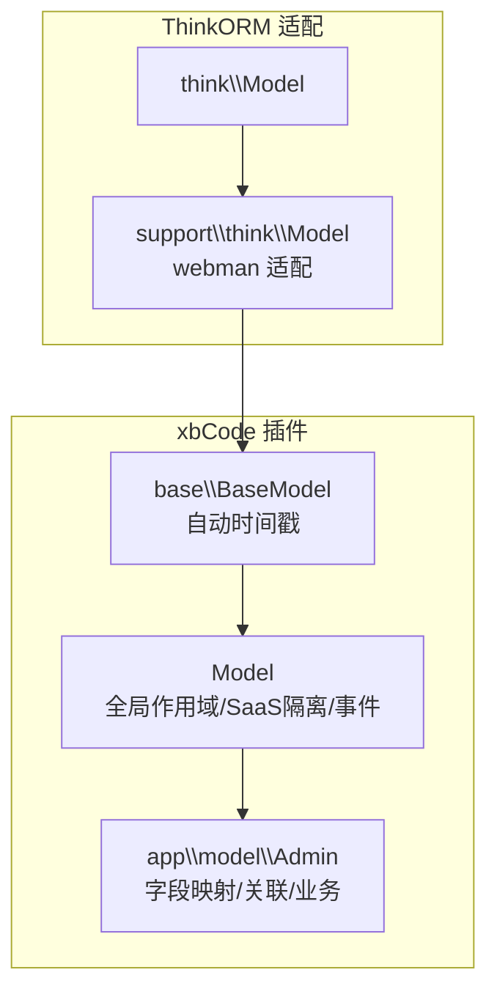
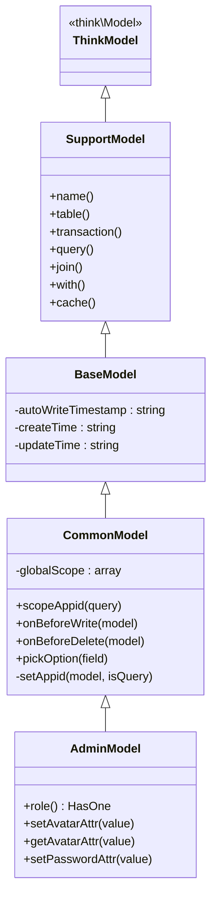
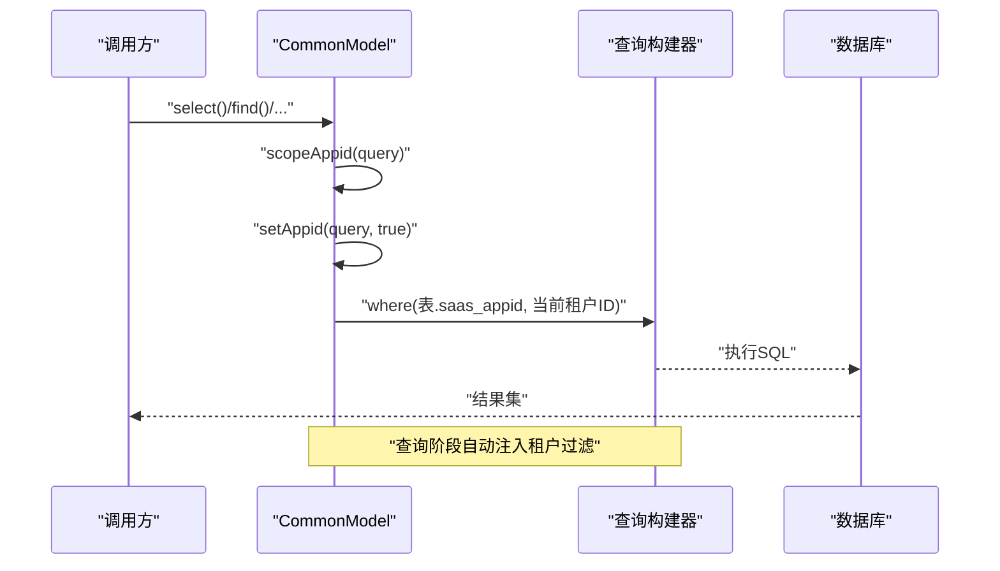
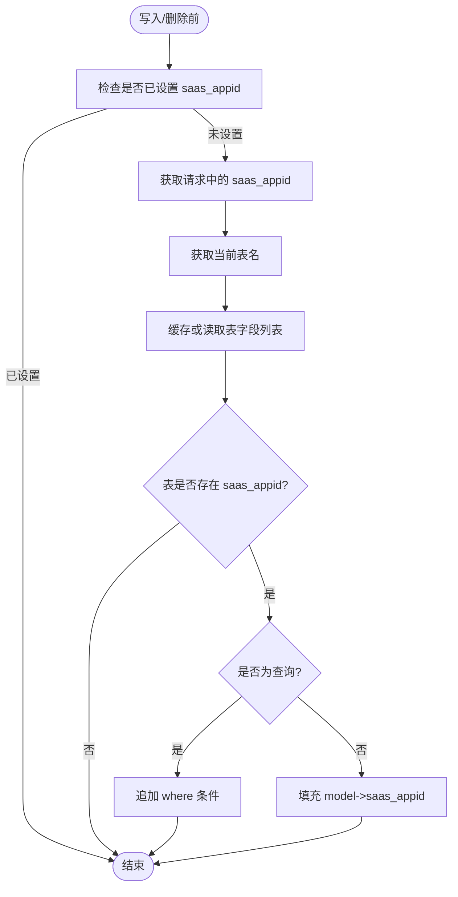
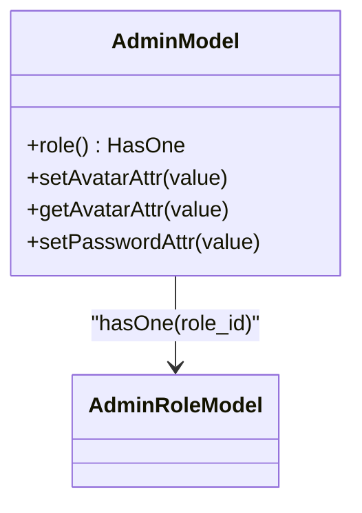
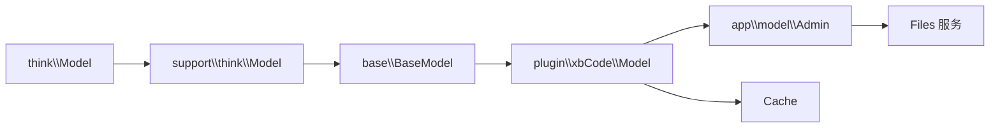

# 模型层设计

<cite>
**本文引用的文件**   
- [server/plugin\xbCode\base\BaseModel.php](file://server/plugin\xbCode\base\BaseModel.php)
- [server/plugin\xbCode\Model.php](file://server/plugin\xbCode\Model.php)
- [server/vendor/webman\think-orm\src\support\think\Model.php](file://server/vendor/webman\think-orm\src\support\think\Model.php)
- [server/plugin\xbCode\app\model\Admin.php](file://server/plugin\xbCode\app\model\Admin.php)
</cite>

## 目录
1. [简介](#简介)
2. [项目结构](#项目结构)
3. [核心组件](#核心组件)
4. [架构总览](#架构总览)
5. [详细组件分析](#详细组件分析)
6. [依赖关系分析](#依赖关系分析)
7. [性能考量](#性能考量)
8. [故障排查指南](#故障排查指南)
9. [结论](#结论)
10. [附录](#附录)

## 简介
本文件聚焦于模型层的综合设计与实现，围绕 BaseModel 基类展开，系统阐述数据库操作封装、关联关系定义、查询构建器使用、字段映射与数据验证、事件监听机制、软删除实现等关键能力。同时提供继承 BaseModel 的正确方式、表结构定义、业务方法编写范式，并说明多模型关联、复杂查询优化与事务处理等高级特性。

## 项目结构
本项目采用插件化架构，模型层位于 plugin\xbCode 下，通过分层继承形成“通用模型 -> 领域模型”的清晰边界：
- think-ORM 适配层：在 vendor 中提供对 think\Model 的轻量包装，暴露常用静态方法与查询构造器 API。
- 基础模型层：BaseModel 统一时间戳策略与默认行为。
- 通用模型层：plugin\xbCode\Model 扩展全局作用域、SaaS 租户隔离、写入/删除前事件钩子等。
- 领域模型层：如 Admin 等业务模型，负责具体字段映射、访问器/修改器、关联关系与业务方法。

图表来源
- [server/vendor\webman\think-orm\src\support\think\Model.php:1-61](file://server/vendor/webman\think-orm\src\support\think\Model.php#L1-L61)
- [server/plugin\xbCode\base\BaseModel.php:1-36](file://server/plugin\xbCode\base\BaseModel.php#L1-L36)
- [server/plugin\xbCode\Model.php:1-116](file://server/plugin\xbCode\Model.php#L1-L116)
- [server/plugin\xbCode\app\model\Admin.php:1-76](file://server/plugin\xbCode\app\model\Admin.php#L1-L76)

章节来源
- [server/vendor\webman\think-orm\src\support\think\Model.php:1-61](file://server/vendor/webman\think-orm\src\support\think\Model.php#L1-L61)
- [server/plugin\xbCode\base\BaseModel.php:1-36](file://server/plugin\xbCode\base\BaseModel.php#L1-L36)
- [server/plugin\xbCode\Model.php:1-116](file://server/plugin\xbCode\Model.php#L1-L116)
- [server/plugin\xbCode\app\model\Admin.php:1-76](file://server/plugin\xbCode\app\model\Admin.php#L1-L76)

## 核心组件
- think-ORM 适配层
  - 职责：为 webman 环境提供 think\Model 的便捷静态方法声明（如 name/table/transaction/query/join/with/cache 等），屏蔽底层差异，提升可读性与可维护性。
  - 关键点：以 @method 形式声明静态方法，便于 IDE 提示与调用约束。
- 基础模型 BaseModel
  - 职责：统一时间戳策略，开启自动时间戳，指定创建/更新时间字段名。
  - 关键点：autoWriteTimestamp、createTime、updateTime 三个受保护属性控制时间戳行为。
- 通用模型 Model（plugin\xbCode）
  - 职责：提供全局查询范围、SaaS 租户隔离、写入/删除前事件钩子、选择器数据快捷方法。
  - 关键点：globalScope、scopeAppid、onBeforeWrite、onBeforeDelete、setAppid、pickOption。
- 领域模型示例 Admin
  - 职责：演示字段映射（访问器/修改器）、关联关系定义、业务逻辑集成。
  - 关键点：hasOne 关联、头像路径转换、密码加密存储。

章节来源
- [server/vendor\webman\think-orm\src\support\think\Model.php:1-61](file://server/vendor/webman\think-orm\src\support\think\Model.php#L1-L61)
- [server/plugin\xbCode\base\BaseModel.php:1-36](file://server/plugin\xbCode\base\BaseModel.php#L1-L36)
- [server/plugin\xbCode\Model.php:1-116](file://server/plugin\xbCode\Model.php#L1-L116)
- [server/plugin\xbCode\app\model\Admin.php:1-76](file://server/plugin\xbCode\app\model\Admin.php#L1-L76)

## 架构总览
下图展示从 think-ORM 到领域模型的继承链与职责划分，以及 SaaS 租户隔离在查询与写入时的注入点。

图表来源
- [server/vendor\webman\think-orm\src\support\think\Model.php:1-61](file://server/vendor/webman\think-orm\src\support\think\Model.php#L1-L61)
- [server/plugin\xbCode\base\BaseModel.php:1-36](file://server/plugin\xbCode\base\BaseModel.php#L1-L36)
- [server/plugin\xbCode\Model.php:1-116](file://server/plugin\xbCode\Model.php#L1-L116)
- [server/plugin\xbCode\app\model\Admin.php:1-76](file://server/plugin\xbCode\app\model\Admin.php#L1-L76)

## 详细组件分析

### BaseModel 基类
- 自动时间戳
  - 启用自动时间戳写入，类型 datetime。
  - 创建时间字段名为 create_at，更新时间字段名为 update_at。
- 适用场景
  - 所有继承自 BaseModel 的模型将默认具备时间戳能力，无需重复配置。

章节来源
- [server/plugin\xbCode\base\BaseModel.php:1-36](file://server/plugin\xbCode\base\BaseModel.php#L1-L36)

### 通用模型 Model（plugin\xbCode）
- 全局查询范围
  - 通过 globalScope 注册 appid 全局作用域，确保所有查询自动附加 saas_appid 条件。
- SaaS 租户隔离
  - setAppid 根据请求上下文动态注入 saas_appid；若表不存在该字段则跳过。
  - 查询时追加 where 条件，写入时填充字段值。
- 事件钩子
  - onBeforeWrite/onBeforeDelete 在保存/删除前触发，保证写入/删除均携带租户信息。
- 选择器数据
  - pickOption 快速返回下拉选项数据，支持自定义字段映射。

图表来源
- [server/plugin\xbCode\Model.php:23-50](file://server/plugin\xbCode\Model.php#L23-L50)
- [server/plugin\xbCode\Model.php:85-115](file://server/plugin\xbCode\Model.php#L85-L115)

图表来源
- [server/plugin\xbCode\Model.php:85-115](file://server/plugin\xbCode\Model.php#L85-L115)

章节来源
- [server/plugin\xbCode\Model.php:1-116](file://server/plugin\xbCode\Model.php#L1-L116)

### 领域模型 Admin
- 关联关系
  - role(): 一对一关联角色模型，基于外键 role_id 指向 AdminRole.id。
- 字段映射
  - setAvatarAttr/getAvatarAttr：在保存/读取头像路径时，结合上传插件进行路径/URL 转换。
  - setPasswordAttr：保存前对密码进行加密处理。
- 业务集成
  - 通过插件存在性判断决定是否启用上传功能，增强健壮性。

图表来源
- [server/plugin\xbCode\app\model\Admin.php:26-29](file://server/plugin\xbCode\app\model\Admin.php#L26-L29)
- [server/plugin\xbCode\app\model\Admin.php:38-74](file://server/plugin\xbCode\app\model\Admin.php#L38-L74)

章节来源
- [server/plugin\xbCode\app\model\Admin.php:1-76](file://server/plugin\xbCode\app\model\Admin.php#L1-L76)

## 依赖关系分析
- 继承链
  - support\think\Model 继承 think\Model，作为 webman 环境的 ORM 适配层。
  - base\BaseModel 继承 support\think\Model，统一时间戳策略。
  - plugin\xbCode\Model 继承 base\BaseModel，提供全局作用域与 SaaS 隔离。
  - 领域模型（如 Admin）继承 plugin\xbCode\Model，承载业务语义。
- 外部依赖
  - 缓存：用于缓存表字段元数据，避免频繁反射/DDL 查询。
  - 上传服务：在字段映射中按需调用，提高解耦度。

图表来源
- [server/vendor\webman\think-orm\src\support\think\Model.php:1-61](file://server/vendor/webman\think-orm\src\support\think\Model.php#L1-L61)
- [server/plugin\xbCode\base\BaseModel.php:1-36](file://server/plugin\xbCode\base\BaseModel.php#L1-L36)
- [server/plugin\xbCode\Model.php:1-116](file://server/plugin\xbCode\Model.php#L1-L116)
- [server/plugin\xbCode\app\model\Admin.php:1-76](file://server/plugin\xbCode\app\model\Admin.php#L1-L76)

章节来源
- [server/vendor\webman\think-orm\src\support\think\Model.php:1-61](file://server/vendor/webman\think-orm\src\support\think\Model.php#L1-L61)
- [server/plugin\xbCode\base\BaseModel.php:1-36](file://server/plugin\xbCode\base\BaseModel.php#L1-L36)
- [server/plugin\xbCode\Model.php:1-116](file://server/plugin\xbCode\Model.php#L1-L116)
- [server/plugin\xbCode\app\model\Admin.php:1-76](file://server/plugin\xbCode\app\model\Admin.php#L1-L76)

## 性能考量
- 全局作用域
  - 通过全局作用域集中注入 saas_appid 条件，减少重复代码，但需注意在大表上建立索引以提升查询效率。
- 元数据缓存
  - 表字段列表通过缓存降低 DDL 查询开销，建议合理设置过期时间与失效策略。
- 预加载关联
  - 使用 with() 预加载关联，避免 N+1 查询问题。
- 只读字段
  - 使用 field() 仅选择必要字段，减少网络传输与内存占用。
- 事务
  - 批量写操作使用 transaction() 包裹，保证一致性与原子性。

[本节为通用指导，不直接分析具体文件]

## 故障排查指南
- 查询未带租户条件
  - 检查是否启用了全局作用域 scopeAppid，确认 setAppid 是否正确注入 where 条件。
- 写入缺少 saas_appid
  - 确认 onBeforeWrite 是否被触发，检查表结构是否包含 saas_appid 字段。
- 头像 URL 不正确
  - 检查 get/setAvatarAttr 是否在启用上传插件时被正确调用。
- 密码未加密
  - 确认 setPasswordAttr 是否生效，传入值是否为明文。

章节来源
- [server/plugin\xbCode\Model.php:47-75](file://server/plugin\xbCode\Model.php#L47-L75)
- [server/plugin\xbCode\app\model\Admin.php:38-74](file://server/plugin\xbCode\app\model\Admin.php#L38-L74)

## 结论
本模型层通过清晰的继承层次与职责分离，实现了统一的自动时间戳、全局查询范围、SaaS 租户隔离、事件钩子与字段映射等能力。领域模型在此基础上专注业务语义与关联关系，配合 think-ORM 提供的查询构建器与事务能力，能够高效、安全地支撑复杂业务场景。

[本节为总结性内容，不直接分析具体文件]

## 附录

### 如何正确继承 BaseModel 与通用模型
- 新建领域模型
  - 继承 plugin\xbCode\Model，获得全局作用域与 SaaS 隔离能力。
- 定义表结构与字段映射
  - 使用访问器/修改器完成字段读写时的格式转换。
- 定义关联关系
  - 使用 hasOne/hasMany/belongsTo 等方法描述模型间关系。
- 使用查询构建器
  - 利用 where/join/with/cache 等构建复杂查询。
- 事务处理
  - 使用 transaction() 包裹多条写操作，确保一致性。

章节来源
- [server/plugin\xbCode\Model.php:33-38](file://server/plugin\xbCode\Model.php#L33-L38)
- [server/plugin\xbCode\app\model\Admin.php:26-29](file://server/plugin\xbCode\app\model\Admin.php#L26-L29)
- [server/vendor\webman\think-orm\src\support\think\Model.php:10-56](file://server/vendor\webman\think-orm\src\support\think\Model.php#L10-L56)