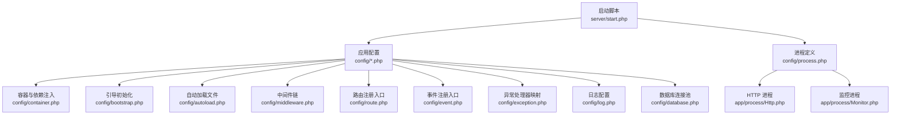
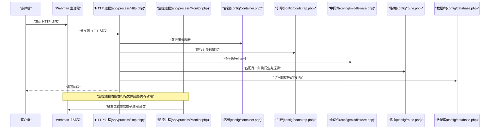
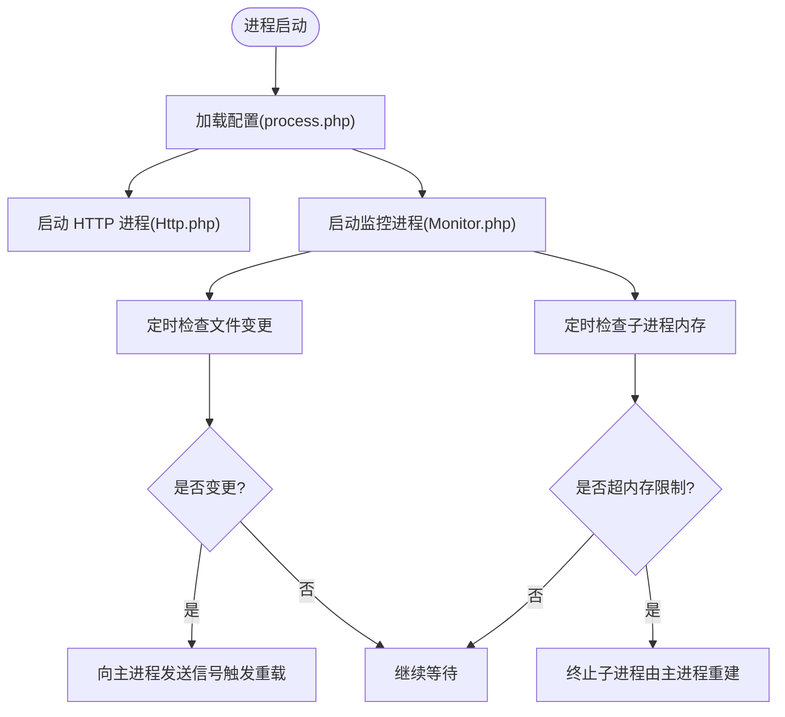
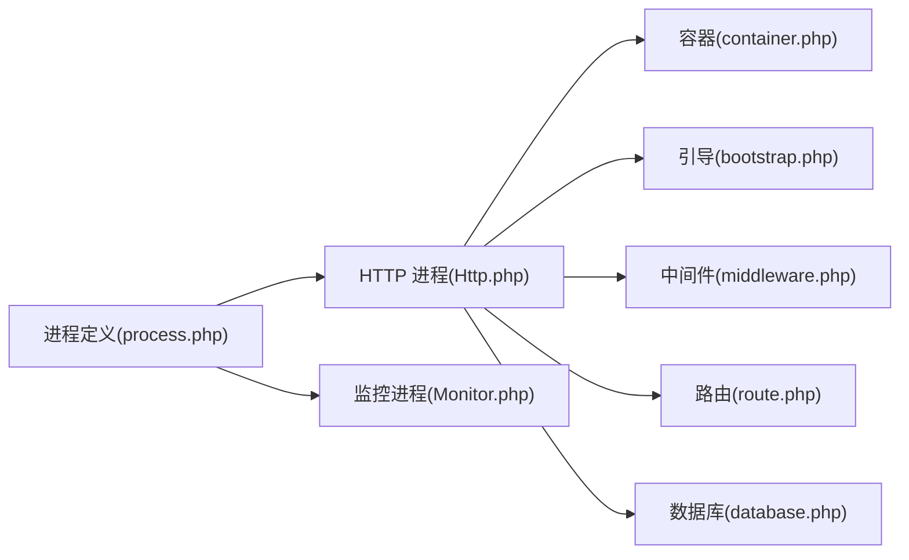

# Webman框架基础

<cite>
**本文引用的文件**   
- [start.php](file://server/start.php)
- [app.php](file://server/config/app.php)
- [server.php](file://server/config/server.php)
- [process.php](file://server/config/process.php)
- [event.php](file://server/config/event.php)
- [container.php](file://server/config/container.php)
- [middleware.php](file://server/config/middleware.php)
- [bootstrap.php](file://server/config/bootstrap.php)
- [autoload.php](file://server/config/autoload.php)
- [exception.php](file://server/config/exception.php)
- [log.php](file://server/config/log.php)
- [database.php](file://server/config/database.php)
- [Http.php](file://server/app/process/Http.php)
- [Monitor.php](file://server/app/process/Monitor.php)
</cite>

## 目录
1. [简介](#简介)
2. [项目结构](#项目结构)
3. [核心组件](#核心组件)
4. [架构总览](#架构总览)
5. [详细组件分析](#详细组件分析)
6. [依赖关系分析](#依赖关系分析)
7. [性能考虑](#性能考虑)
8. [故障排查指南](#故障排查指南)
9. [结论](#结论)
10. [附录](#附录)

## 简介
本文件面向初次接触 Webman 的开发者，系统梳理该项目的启动流程、应用配置、进程模型、事件机制、服务容器与依赖注入、中间件链、日志与异常处理、数据库连接池等核心能力。文档以仓库中的实际配置文件与进程类为依据，辅以可视化图示，帮助快速上手并掌握最佳实践与调优要点。

## 项目结构
本项目采用“应用 + 插件”的组织方式：
- server 为后端运行入口与配置中心，包含启动脚本、全局配置、自定义进程、支持类等。
- app 下提供业务控制器、视图、中间件、自定义进程等。
- plugin 下按功能域拆分为多个独立插件（如 xbCode、xbUser、xbUpload 等），每个插件自带 config、app、api 等子目录，便于热重载与隔离扩展。
- runtime 存放运行时产物（缓存、日志、临时文件、PID 等）。

图表来源
- [start.php:1-6](file://server/start.php#L1-L6)
- [app.php:1-13](file://server/config/app.php#L1-L13)
- [server.php:1-12](file://server/config/server.php#L1-L12)
- [process.php:1-43](file://server/config/process.php#L1-L43)
- [Http.php:1-10](file://server/app/process/Http.php#L1-L10)
- [Monitor.php:1-306](file://server/app/process/Monitor.php#L1-L306)
- [container.php:1-15](file://server/config/container.php#L1-L15)
- [bootstrap.php:1-19](file://server/config/bootstrap.php#L1-L19)
- [autoload.php:1-22](file://server/config/autoload.php#L1-L22)
- [middleware.php:1-12](file://server/config/middleware.php#L1-L12)
- [route.php:1-22](file://server/config/route.php#L1-L22)
- [event.php:1-6](file://server/config/event.php#L1-L6)
- [exception.php:1-17](file://server/config/exception.php#L1-L17)
- [log.php:1-33](file://server/config/log.php#L1-L33)
- [database.php:1-35](file://server/config/database.php#L1-L35)

章节来源
- [start.php:1-6](file://server/start.php#L1-L6)
- [app.php:1-13](file://server/config/app.php#L1-L13)
- [server.php:1-12](file://server/config/server.php#L1-L12)
- [process.php:1-43](file://server/config/process.php#L1-L43)
- [Http.php:1-10](file://server/app/process/Http.php#L1-L10)
- [Monitor.php:1-306](file://server/app/process/Monitor.php#L1-L306)
- [container.php:1-15](file://server/config/container.php#L1-L15)
- [bootstrap.php:1-19](file://server/config/bootstrap.php#L1-L19)
- [autoload.php:1-22](file://server/config/autoload.php#L1-L22)
- [middleware.php:1-12](file://server/config/middleware.php#L1-L12)
- [route.php:1-22](file://server/config/route.php#L1-L22)
- [event.php:1-6](file://server/config/event.php#L1-L6)
- [exception.php:1-17](file://server/config/exception.php#L1-L17)
- [log.php:1-33](file://server/config/log.php#L1-L33)
- [database.php:1-35](file://server/config/database.php#L1-L35)

## 核心组件
- 启动入口
  - 通过统一入口加载 Composer 自动加载器并调用应用运行方法，完成进程与服务的初始化。
- 应用配置
  - 应用级开关、时区、请求类、静态资源路径、运行时路径、控制器后缀与复用策略等。
- 服务器配置
  - 事件循环、优雅停机超时、PID/状态/日志输出路径、最大包体大小等。
- 进程管理
  - 内置 HTTP 进程与文件监控进程；监控进程支持文件变更检测与内存超限回收。
- 服务容器与依赖注入
  - 默认返回一个容器实例，用于注册单例、工厂与解析依赖。
- 引导与自动加载
  - 引导阶段执行 Session、ORM 等初始化；自动加载常用函数与 Request/Response 基类。
- 中间件链
  - 全局中间件数组，按顺序执行，可拦截请求与响应。
- 路由与事件
  - 路由注册入口与事件监听注册入口，供业务按需扩展。
- 异常与日志
  - 异常处理器映射到统一 Handler；日志使用 Monolog 轮转文件处理器。
- 数据库连接池
  - 基于 PDO 的连接池配置，含最小/最大连接数、等待超时、空闲回收与心跳检测。

章节来源
- [start.php:1-6](file://server/start.php#L1-L6)
- [app.php:1-13](file://server/config/app.php#L1-L13)
- [server.php:1-12](file://server/config/server.php#L1-L12)
- [process.php:1-43](file://server/config/process.php#L1-L43)
- [container.php:1-15](file://server/config/container.php#L1-L15)
- [bootstrap.php:1-19](file://server/config/bootstrap.php#L1-L19)
- [autoload.php:1-22](file://server/config/autoload.php#L1-L22)
- [middleware.php:1-12](file://server/config/middleware.php#L1-L12)
- [route.php:1-22](file://server/config/route.php#L1-L22)
- [event.php:1-6](file://server/config/event.php#L1-L6)
- [exception.php:1-17](file://server/config/exception.php#L1-L17)
- [log.php:1-33](file://server/config/log.php#L1-L33)
- [database.php:1-35](file://server/config/database.php#L1-L35)

## 架构总览
Webman 基于 Workerman 的事件驱动模型，采用多进程架构：主进程负责调度与监控，HTTP 进程处理请求，监控进程负责热重载与内存保护。

图表来源
- [start.php:1-6](file://server/start.php#L1-L6)
- [Http.php:1-10](file://server/app/process/Http.php#L1-L10)
- [Monitor.php:1-306](file://server/app/process/Monitor.php#L1-L306)
- [container.php:1-15](file://server/config/container.php#L1-L15)
- [bootstrap.php:1-19](file://server/config/bootstrap.php#L1-L19)
- [middleware.php:1-12](file://server/config/middleware.php#L1-L12)
- [route.php:1-22](file://server/config/route.php#L1-L22)
- [database.php:1-35](file://server/config/database.php#L1-L35)

## 详细组件分析

### 启动流程与进程模型
- 启动入口
  - 切换工作目录、引入自动加载器、调用应用运行方法，完成进程树构建与服务监听。
- HTTP 进程
  - 继承应用基类，作为标准 HTTP 服务进程承载路由与业务。
- 监控进程
  - 定时扫描指定目录与文件后缀，发现变更后向主进程发送信号触发热重载；同时具备内存监控，超过阈值则回收子进程。

图表来源
- [process.php:1-43](file://server/config/process.php#L1-L43)
- [Http.php:1-10](file://server/app/process/Http.php#L1-L10)
- [Monitor.php:1-306](file://server/app/process/Monitor.php#L1-L306)

章节来源
- [start.php:1-6](file://server/start.php#L1-L6)
- [process.php:1-43](file://server/config/process.php#L1-L43)
- [Http.php:1-10](file://server/app/process/Http.php#L1-L10)
- [Monitor.php:1-306](file://server/app/process/Monitor.php#L1-L306)

### 应用配置详解
- 应用配置(app.php)
  - debug 开关、错误级别、默认时区、请求类、公共目录、运行时目录、控制器后缀与复用策略。
- 服务器配置(server.php)
  - 事件循环类型、优雅停机超时、PID/状态/日志输出路径、最大包体大小。
- 自动加载与引导
  - autoload.php 指定需全局加载的文件；bootstrap.php 在应用启动后执行引导任务（如 Session、ORM）。
- 中间件(middleware.php)
  - 全局中间件列表，按顺序执行，适合鉴权、跨域、限流等横切逻辑。
- 路由(route.php)与事件(event.php)
  - 路由与事件的集中注册点，可按模块拆分维护。
- 异常(exception.php)与日志(log.php)
  - 异常处理器映射到统一 Handler；日志采用 Monolog 轮转文件处理器，便于归档与检索。
- 数据库(database.php)
  - 连接池参数：最大/最小连接数、等待超时、空闲回收、心跳间隔等，适用于高并发场景。

章节来源
- [app.php:1-13](file://server/config/app.php#L1-L13)
- [server.php:1-12](file://server/config/server.php#L1-L12)
- [autoload.php:1-22](file://server/config/autoload.php#L1-L22)
- [bootstrap.php:1-19](file://server/config/bootstrap.php#L1-L19)
- [middleware.php:1-12](file://server/config/middleware.php#L1-L12)
- [route.php:1-22](file://server/config/route.php#L1-L22)
- [event.php:1-6](file://server/config/event.php#L1-L6)
- [exception.php:1-17](file://server/config/exception.php#L1-L17)
- [log.php:1-33](file://server/config/log.php#L1-L33)
- [database.php:1-35](file://server/config/database.php#L1-L35)

### 服务容器与依赖注入
- 容器实例
  - container.php 返回容器实例，作为依赖注入的核心。
- 使用建议
  - 将可复用对象注册为单例；对需要外部参数的对象使用工厂闭包；避免在构造中执行重 IO。
- 生命周期
  - 容器在进程内常驻，注意避免持有长生命周期的大对象引用导致内存增长。

章节来源
- [container.php:1-15](file://server/config/container.php#L1-L15)

### 中间件链与请求处理
- 中间件注册
  - middleware.php 定义全局中间件数组，按声明顺序执行。
- 典型职责
  - 鉴权、日志、限流、跨域、请求校验、响应压缩等。
- 执行时机
  - 在路由匹配前执行前置逻辑，在响应生成后执行后置逻辑。

章节来源
- [middleware.php:1-12](file://server/config/middleware.php#L1-L12)

### 事件系统
- 事件注册
  - event.php 为事件监听器的集中注册点，可按模块划分。
- 适用场景
  - 解耦业务副作用（如统计、通知、异步任务）与核心流程。

章节来源
- [event.php:1-6](file://server/config/event.php#L1-L6)

### 异常处理与日志
- 异常处理
  - exception.php 将空键映射到统一异常处理器，便于集中格式化输出与埋点。
- 日志记录
  - log.php 使用 Monolog 轮转文件处理器，按天归档，便于问题回溯。

章节来源
- [exception.php:1-17](file://server/config/exception.php#L1-L17)
- [log.php:1-33](file://server/config/log.php#L1-L33)

### 数据库连接池
- 连接池参数
  - max_connections/min_connections/wait_timeout/idle_timeout/heartbeat_interval 等。
- 使用建议
  - 根据并发量与慢查询情况调整最大连接数；合理设置心跳间隔保障连接健康；避免在请求中创建额外连接。

章节来源
- [database.php:1-35](file://server/config/database.php#L1-L35)

## 依赖关系分析
- 进程间依赖
  - HTTP 进程依赖容器、引导、中间件、路由与数据库；监控进程依赖文件系统与进程信号。
- 配置依赖
  - 各配置项相互独立但共同决定运行时行为，修改需谨慎评估影响面。

图表来源
- [process.php:1-43](file://server/config/process.php#L1-L43)
- [Http.php:1-10](file://server/app/process/Http.php#L1-L10)
- [Monitor.php:1-306](file://server/app/process/Monitor.php#L1-L306)
- [container.php:1-15](file://server/config/container.php#L1-L15)
- [bootstrap.php:1-19](file://server/config/bootstrap.php#L1-L19)
- [middleware.php:1-12](file://server/config/middleware.php#L1-L12)
- [route.php:1-22](file://server/config/route.php#L1-L22)
- [database.php:1-35](file://server/config/database.php#L1-L35)

章节来源
- [process.php:1-43](file://server/config/process.php#L1-L43)
- [Http.php:1-10](file://server/app/process/Http.php#L1-L10)
- [Monitor.php:1-306](file://server/app/process/Monitor.php#L1-L306)
- [container.php:1-15](file://server/config/container.php#L1-L15)
- [bootstrap.php:1-19](file://server/config/bootstrap.php#L1-L19)
- [middleware.php:1-12](file://server/config/middleware.php#L1-L12)
- [route.php:1-22](file://server/config/route.php#L1-L22)
- [database.php:1-35](file://server/config/database.php#L1-L35)

## 性能考虑
- 进程与线程
  - 合理设置 CPU 核数对应的进程数；避免在请求中执行阻塞 IO。
- 连接池
  - 根据 QPS 与慢查询比例调整最大连接数；开启心跳检测保持连接活跃。
- 静态资源
  - 将静态资源交由反向代理或 CDN 加速，减少 PHP 进程压力。
- 监控与热重载
  - 生产环境关闭文件监控或仅监听必要目录，避免频繁 stat 开销。
- 日志与磁盘
  - 控制日志级别与轮转数量，避免磁盘 IO 成为瓶颈。

[本节为通用指导，不直接分析具体文件]

## 故障排查指南
- 无法热重载
  - 确认 exec 未被禁用；检查监控目录与后缀配置；观察监控进程日志提示。
- 内存泄漏或持续增长
  - 关注监控进程的内存回收行为；检查是否存在大对象被容器长期持有。
- 数据库连接耗尽
  - 检查连接池最大连接数与等待超时；定位慢查询与未释放连接。
- 日志缺失或过大
  - 核对日志路径与权限；调整轮转策略与日志级别。

章节来源
- [Monitor.php:1-306](file://server/app/process/Monitor.php#L1-L306)
- [log.php:1-33](file://server/config/log.php#L1-L33)
- [database.php:1-35](file://server/config/database.php#L1-L35)

## 结论
Webman 以简洁的配置与清晰的进程模型为核心，结合服务容器、中间件、事件与连接池等机制，提供了高性能且易扩展的后端开发体验。通过合理配置与应用层最佳实践，可在保证稳定性的前提下获得优异的吞吐与延迟表现。

[本节为总结性内容，不直接分析具体文件]

## 附录
- 关键配置清单
  - 应用配置：debug、时区、请求类、公共目录、运行时目录、控制器后缀与复用。
  - 服务器配置：事件循环、优雅停机、PID/状态/日志路径、最大包体。
  - 进程配置：监控目录、文件后缀、是否启用文件/内存监控。
  - 容器与引导：容器实例、Session/ORM 初始化。
  - 中间件：全局中间件列表。
  - 路由与事件：路由与事件注册入口。
  - 异常与日志：异常处理器映射、Monolog 轮转配置。
  - 数据库：连接池参数与选项。

章节来源
- [app.php:1-13](file://server/config/app.php#L1-L13)
- [server.php:1-12](file://server/config/server.php#L1-L12)
- [process.php:1-43](file://server/config/process.php#L1-L43)
- [container.php:1-15](file://server/config/container.php#L1-L15)
- [bootstrap.php:1-19](file://server/config/bootstrap.php#L1-L19)
- [middleware.php:1-12](file://server/config/middleware.php#L1-L12)
- [route.php:1-22](file://server/config/route.php#L1-L22)
- [event.php:1-6](file://server/config/event.php#L1-L6)
- [exception.php:1-17](file://server/config/exception.php#L1-L17)
- [log.php:1-33](file://server/config/log.php#L1-L33)
- [database.php:1-35](file://server/config/database.php#L1-L35)