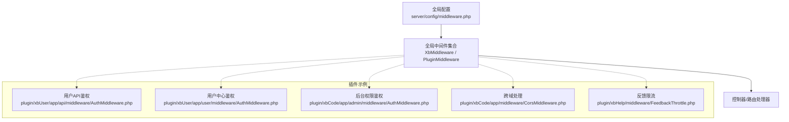
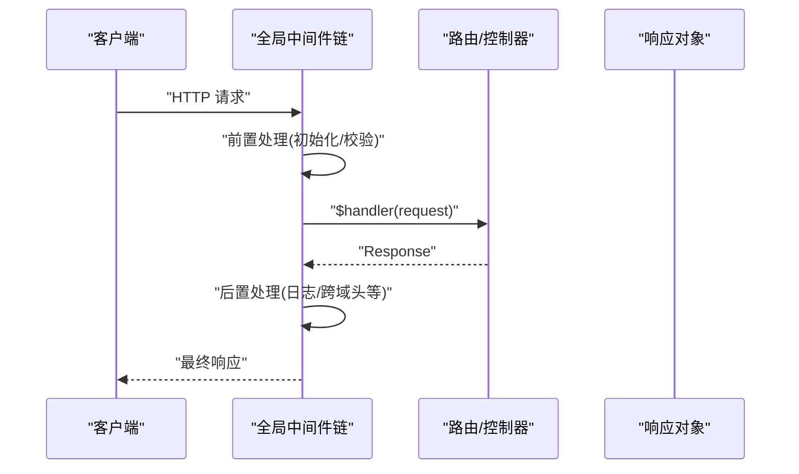
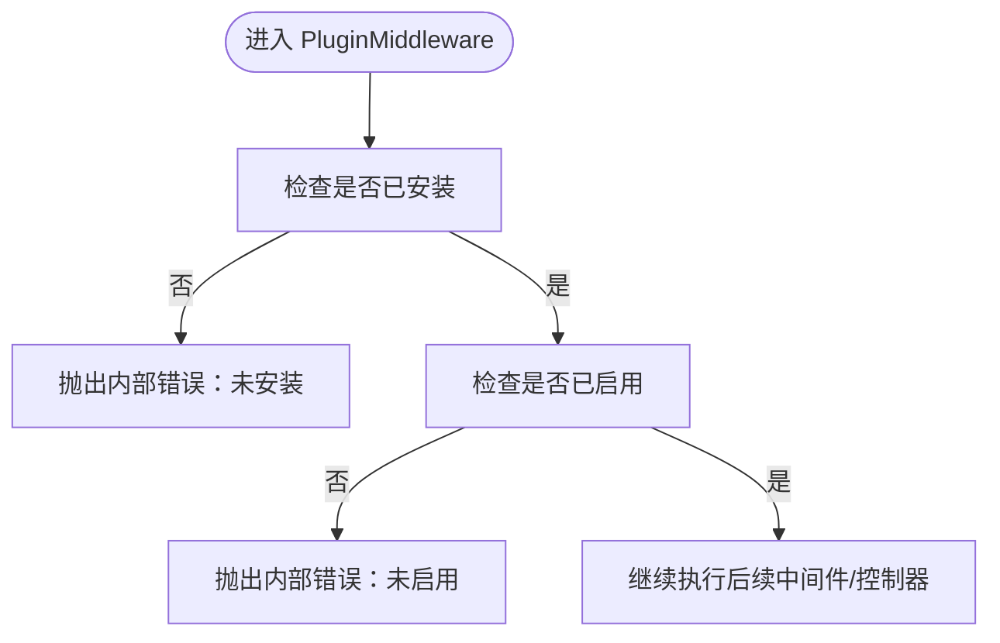
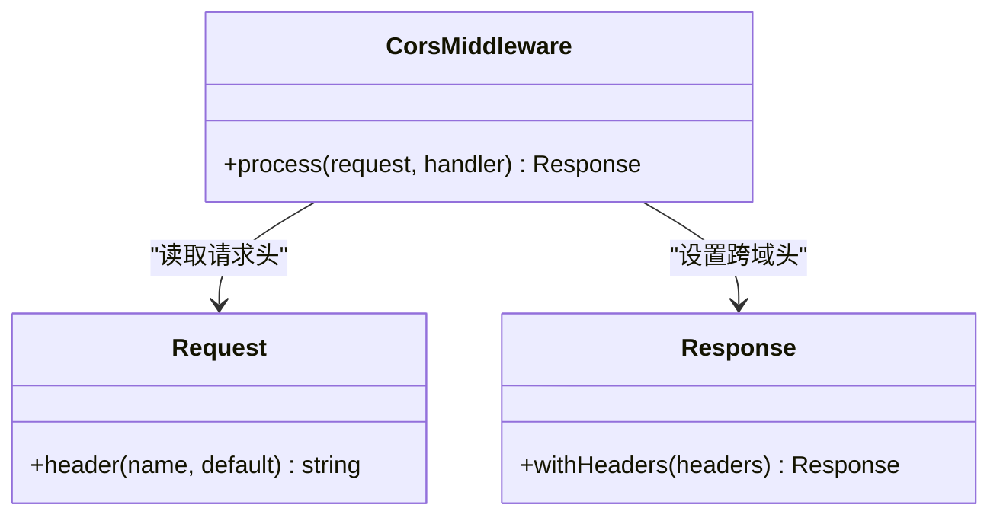
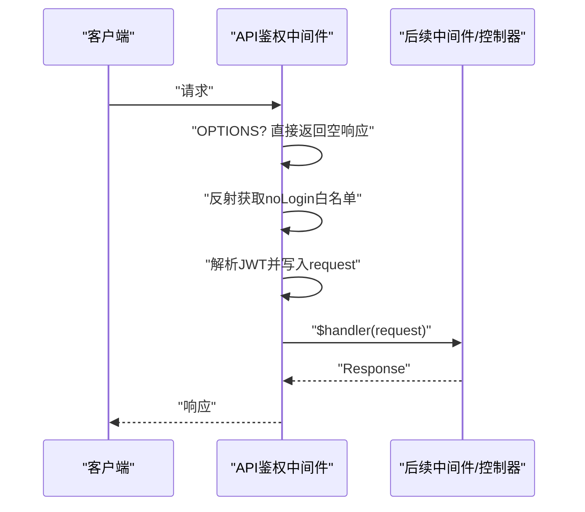
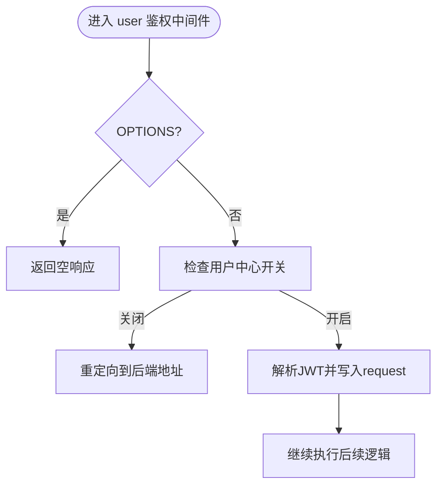
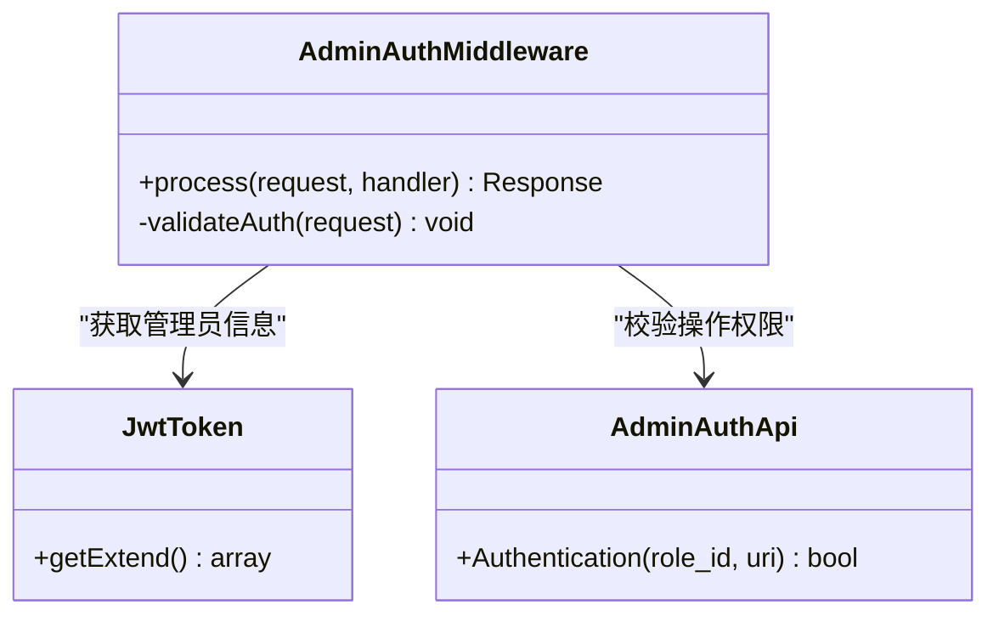
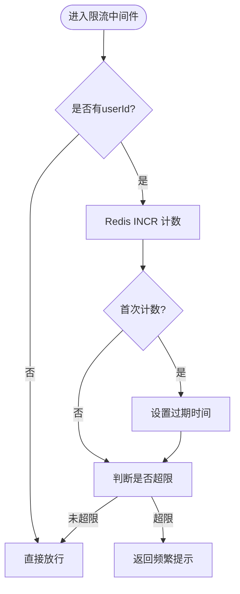
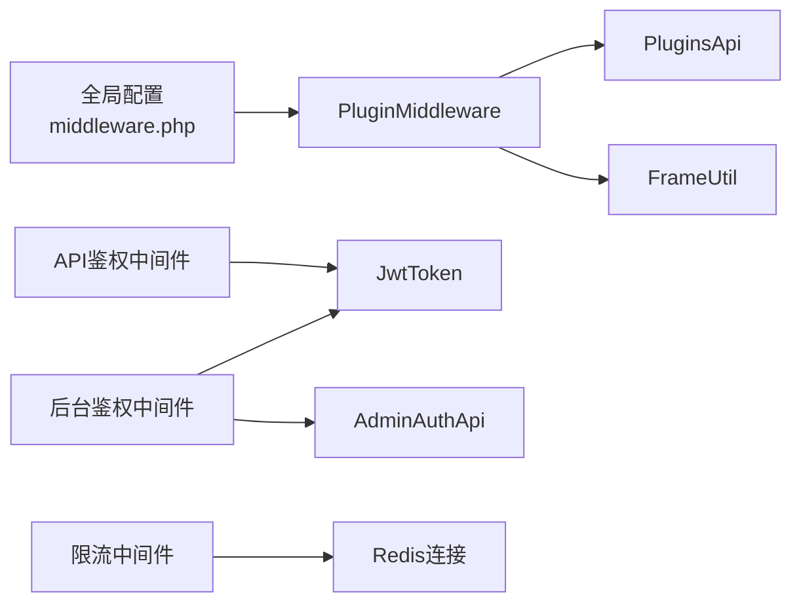

# 中间件管道

<cite>
**本文引用的文件**   
- [server/config/middleware.php](file://server/config/middleware.php)
- [server/app/middleware/StaticFile.php](file://server/app/middleware/StaticFile.php)
- [server/plugin/xbCode/app/middleware/CorsMiddleware.php](file://server/plugin/xbCode/app/middleware/CorsMiddleware.php)
- [server/plugin/xbUser/app/api/middleware/AuthMiddleware.php](file://server/plugin/xbUser/app/api/middleware/AuthMiddleware.php)
- [server/plugin/xbUser/app/user/middleware/AuthMiddleware.php](file://server/plugin/xbUser/app/user/middleware/AuthMiddleware.php)
- [server/plugin/xbCode/app/admin/middleware/AuthMiddleware.php](file://server/plugin/xbCode/app/admin/middleware/AuthMiddleware.php)
- [server/plugin/xbHelp/middleware/FeedbackThrottle.php](file://server/plugin/xbHelp/middleware/FeedbackThrottle.php)
- [server/plugin/xbCode/app/middleware/PluginMiddleware.php](file://server/plugin/xbCode/app/middleware/PluginMiddleware.php)
</cite>

## 目录
1. [简介](#简介)
2. [项目结构](#项目结构)
3. [核心组件](#核心组件)
4. [架构总览](#架构总览)
5. [详细组件分析](#详细组件分析)
6. [依赖分析](#依赖分析)
7. [性能考虑](#性能考虑)
8. [故障排查指南](#故障排查指南)
9. [结论](#结论)
10. [附录](#附录)

## 简介
本文件围绕 Webman 中间件管道，系统阐述请求在应用中的执行流程、注册机制、优先级控制与参数传递方式；并结合仓库中实际代码，说明全局中间件与路由（按命名空间）中间件的差异。同时给出权限验证、日志记录、请求限流、跨域处理等常见场景的实现思路与参考路径，帮助开发者快速构建可维护的中间件体系。

## 项目结构
本项目采用“全局配置 + 插件化”的组织方式：
- 全局中间件注册位于 server/config/middleware.php，通过 @ 命名空间将一组中间件绑定到所有请求。
- 各插件在自身 config/middleware.php 中按需注册路由级或命名空间级中间件。
- 业务中间件实现遵循 Webman\MiddlewareInterface，统一以 process(Request, callable): Response 的形式参与洋葱模型调用链。

图示来源
- [server/config/middleware.php:1-12](file://server/config/middleware.php#L1-L12)
- [server/plugin/xbCode/app/middleware/PluginMiddleware.php:1-79](file://server/plugin/xbCode/app/middleware/PluginMiddleware.php#L1-L79)

章节来源
- [server/config/middleware.php:1-12](file://server/config/middleware.php#L1-L12)

## 核心组件
- 全局中间件注册点：server/config/middleware.php 使用 @ 键将中间件类名数组注入到全局管道，顺序即执行顺序。
- 典型全局中间件：
  - XbMiddleware：框架通用初始化逻辑（如容器、基础上下文）。
  - PluginMiddleware：插件安装/启用状态校验，拦截未安装或未启用的插件访问。
- 静态资源中间件：app/middleware/StaticFile.php 提供基础安全与可选跨域头设置。
- 插件内中间件：各插件可在自身 config/middleware.php 中注册路由级或命名空间级中间件，形成更细粒度的控制。

章节来源
- [server/config/middleware.php:1-12](file://server/config/middleware.php#L1-L12)
- [server/app/middleware/StaticFile.php:1-43](file://server/app/middleware/StaticFile.php#L1-L43)
- [server/plugin/xbCode/app/middleware/PluginMiddleware.php:1-79](file://server/plugin/xbCode/app/middleware/PluginMiddleware.php#L1-L79)

## 架构总览
Webman 的请求进入后，会依次经过全局中间件链，再进入路由匹配与控制器执行。中间件以“洋葱模型”组织：外层先执行前置逻辑，再调用 $handler($request) 进入内层，最后在外层进行后置处理并返回响应。

[此图为概念性流程图，不直接映射具体源码文件]

## 详细组件分析

### 全局中间件与命名空间中间件
- 全局中间件
  - 注册位置：server/config/middleware.php
  - 作用范围：所有请求
  - 执行顺序：数组顺序即为执行顺序
- 命名空间/路由中间件
  - 注册位置：各插件的 config/middleware.php
  - 作用范围：仅命中对应命名空间的路由
  - 执行顺序：同全局一样，按数组顺序执行

章节来源
- [server/config/middleware.php:1-12](file://server/config/middleware.php#L1-L12)

### 插件检测中间件（PluginMiddleware）
职责：
- 检查插件是否存在、是否已安装、是否已启用
- 对未满足条件的请求抛出内部错误

图示来源
- [server/plugin/xbCode/app/middleware/PluginMiddleware.php:1-79](file://server/plugin/xbCode/app/middleware/PluginMiddleware.php#L1-L79)

章节来源
- [server/plugin/xbCode/app/middleware/PluginMiddleware.php:1-79](file://server/plugin/xbCode/app/middleware/PluginMiddleware.php#L1-L79)

### 跨域处理中间件（CorsMiddleware）
职责：
- 为响应附加跨域相关头部
- 支持读取请求头动态设置允许的来源、方法与头字段

图示来源
- [server/plugin/xbCode/app/middleware/CorsMiddleware.php:1-45](file://server/plugin/xbCode/app/middleware/CorsMiddleware.php#L1-L45)

章节来源
- [server/plugin/xbCode/app/middleware/CorsMiddleware.php:1-45](file://server/plugin/xbCode/app/middleware/CorsMiddleware.php#L1-L45)

### 用户 API 鉴权中间件（xbUser/api/AuthMiddleware）
职责：
- 跳过 OPTIONS 预检请求
- 基于反射读取控制器 noLogin 白名单
- 解析 JWT 扩展信息，写入 request->uid 与 request->user
- 根据用户状态决定是否放行

图示来源
- [server/plugin/xbUser/app/api/middleware/AuthMiddleware.php:1-89](file://server/plugin/xbUser/app/api/middleware/AuthMiddleware.php#L1-L89)

章节来源
- [server/plugin/xbUser/app/api/middleware/AuthMiddleware.php:1-89](file://server/plugin/xbUser/app/api/middleware/AuthMiddleware.php#L1-L89)

### 用户中心鉴权中间件（xbUser/user/AuthMiddleware）
职责：
- 除常规鉴权外，增加“用户中心开关”检查
- 若关闭则重定向至后端入口

图示来源
- [server/plugin/xbUser/app/user/middleware/AuthMiddleware.php:1-114](file://server/plugin/xbUser/app/user/middleware/AuthMiddleware.php#L1-L114)

章节来源
- [server/plugin/xbUser/app/user/middleware/AuthMiddleware.php:1-114](file://server/plugin/xbUser/app/user/middleware/AuthMiddleware.php#L1-L114)

### 后台权限鉴权中间件（xbCode/admin/AuthMiddleware）
职责：
- 解析管理员身份与角色
- 结合 noAuth 白名单与权限接口判定操作权限
- 系统管理员豁免权限校验

图示来源
- [server/plugin/xbCode/app/admin/middleware/AuthMiddleware.php:1-125](file://server/plugin/xbCode/app/admin/middleware/AuthMiddleware.php#L1-L125)

章节来源
- [server/plugin/xbCode/app/admin/middleware/AuthMiddleware.php:1-125](file://server/plugin/xbCode/app/admin/middleware/AuthMiddleware.php#L1-L125)

### 反馈限流中间件（xbHelp/FeedbackThrottle）
职责：
- 基于 Redis 计数限制单位时间内提交次数
- 超过阈值直接返回错误响应

图示来源
- [server/plugin/xbHelp/middleware/FeedbackThrottle.php:1-36](file://server/plugin/xbHelp/middleware/FeedbackThrottle.php#L1-L36)

章节来源
- [server/plugin/xbHelp/middleware/FeedbackThrottle.php:1-36](file://server/plugin/xbHelp/middleware/FeedbackThrottle.php#L1-L36)

### 静态文件中间件（app/middleware/StaticFile）
职责：
- 禁止访问隐藏文件（以 . 开头的路径）
- 可选添加跨域响应头（默认注释）

章节来源
- [server/app/middleware/StaticFile.php:1-43](file://server/app/middleware/StaticFile.php#L1-L43)

## 依赖分析
- 全局中间件依赖关系
  - PluginMiddleware 依赖插件能力 API 与工具类，用于检测插件存在/安装/启用状态。
  - 鉴权中间件依赖 JWT 库与自定义异常类，完成令牌解析与错误语义化。
  - 限流中间件依赖 Redis 连接进行计数与过期控制。
- 耦合与内聚
  - 每个中间件职责单一，内聚性强；对外依赖清晰，便于替换与测试。
- 潜在循环依赖
  - 中间件之间无相互引用，避免循环依赖风险。

图示来源
- [server/config/middleware.php:1-12](file://server/config/middleware.php#L1-L12)
- [server/plugin/xbCode/app/middleware/PluginMiddleware.php:1-79](file://server/plugin/xbCode/app/middleware/PluginMiddleware.php#L1-L79)
- [server/plugin/xbUser/app/api/middleware/AuthMiddleware.php:1-89](file://server/plugin/xbUser/app/api/middleware/AuthMiddleware.php#L1-L89)
- [server/plugin/xbCode/app/admin/middleware/AuthMiddleware.php:1-125](file://server/plugin/xbCode/app/admin/middleware/AuthMiddleware.php#L1-L125)
- [server/plugin/xbHelp/middleware/FeedbackThrottle.php:1-36](file://server/plugin/xbHelp/middleware/FeedbackThrottle.php#L1-L36)

章节来源
- [server/config/middleware.php:1-12](file://server/config/middleware.php#L1-L12)
- [server/plugin/xbCode/app/middleware/PluginMiddleware.php:1-79](file://server/plugin/xbCode/app/middleware/PluginMiddleware.php#L1-L79)
- [server/plugin/xbUser/app/api/middleware/AuthMiddleware.php:1-89](file://server/plugin/xbUser/app/api/middleware/AuthMiddleware.php#L1-L89)
- [server/plugin/xbCode/app/admin/middleware/AuthMiddleware.php:1-125](file://server/plugin/xbCode/app/admin/middleware/AuthMiddleware.php#L1-L125)
- [server/plugin/xbHelp/middleware/FeedbackThrottle.php:1-36](file://server/plugin/xbHelp/middleware/FeedbackThrottle.php#L1-L36)

## 性能考虑
- 中间件顺序优化
  - 将轻量且高命中率的中间件置于前面（如跨域、静态资源），减少不必要的计算。
  - 将耗时操作（如数据库/外部服务调用）放在靠后的位置，并在必要时短路返回。
- 缓存与幂等
  - 限流计数建议配合合理的过期时间与分布式存储，避免热点键倾斜。
- 响应头批量设置
  - 跨域头建议在统一的中间件中集中设置，避免重复赋值。

[本节为通用指导，不直接分析具体文件]

## 故障排查指南
- 常见问题定位
  - 插件未安装/未启用：检查 PluginMiddleware 抛出的内部错误，确认插件标识与状态。
  - 鉴权失败：查看 API/后台鉴权中间件抛出的未授权/禁止访问异常，确认 JWT 与白名单配置。
  - 限流触发：核对限流键前缀与阈值，确认 Redis 连通性与过期策略。
- 调试建议
  - 在全局中间件前后打印关键请求标识（如 traceId）。
  - 针对特定命名空间临时注册调试中间件，缩小问题范围。

章节来源
- [server/plugin/xbCode/app/middleware/PluginMiddleware.php:1-79](file://server/plugin/xbCode/app/middleware/PluginMiddleware.php#L1-L79)
- [server/plugin/xbUser/app/api/middleware/AuthMiddleware.php:1-89](file://server/plugin/xbUser/app/api/middleware/AuthMiddleware.php#L1-L89)
- [server/plugin/xbCode/app/admin/middleware/AuthMiddleware.php:1-125](file://server/plugin/xbCode/app/admin/middleware/AuthMiddleware.php#L1-L125)
- [server/plugin/xbHelp/middleware/FeedbackThrottle.php:1-36](file://server/plugin/xbHelp/middleware/FeedbackThrottle.php#L1-L36)

## 结论
通过全局与命名空间两级中间件注册机制，本项目实现了清晰的横切关注点分层：插件检测、跨域、鉴权、限流各司其职。借助 Webman 的洋葱模型，中间件可按需组合、灵活插拔，既保证了安全性与稳定性，也提升了可维护性与扩展性。

[本节为总结性内容，不直接分析具体文件]

## 附录

### 中间件执行流程要点
- 执行顺序
  - 全局中间件按注册数组顺序执行；命名空间中间件在其范围内按顺序执行。
- 参数传递
  - 通过 Request 对象属性传递上下文数据（例如 uid、user、role_id、username 等）。
- 短路返回
  - 当中间件直接返回 Response 时，后续中间件与控制器不再执行。

章节来源
- [server/config/middleware.php:1-12](file://server/config/middleware.php#L1-L12)
- [server/plugin/xbUser/app/api/middleware/AuthMiddleware.php:1-89](file://server/plugin/xbUser/app/api/middleware/AuthMiddleware.php#L1-L89)
- [server/plugin/xbCode/app/admin/middleware/AuthMiddleware.php:1-125](file://server/plugin/xbCode/app/admin/middleware/AuthMiddleware.php#L1-L125)

### 常见中间件实现参考路径
- 权限验证
  - API 鉴权：[server/plugin/xbUser/app/api/middleware/AuthMiddleware.php:1-89](file://server/plugin/xbUser/app/api/middleware/AuthMiddleware.php#L1-L89)
  - 后台鉴权：[server/plugin/xbCode/app/admin/middleware/AuthMiddleware.php:1-125](file://server/plugin/xbCode/app/admin/middleware/AuthMiddleware.php#L1-L125)
- 日志记录
  - 建议在全局中间件中进行统一日志采集（请求入参、出参、耗时、traceId）。
- 请求限流
  - 反馈限流示例：[server/plugin/xbHelp/middleware/FeedbackThrottle.php:1-36](file://server/plugin/xbHelp/middleware/FeedbackThrottle.php#L1-L36)
- 跨域处理
  - 跨域中间件：[server/plugin/xbCode/app/middleware/CorsMiddleware.php:1-45](file://server/plugin/xbCode/app/middleware/CorsMiddleware.php#L1-L45)
  - 静态文件中间件（可选跨域头）：[server/app/middleware/StaticFile.php:1-43](file://server/app/middleware/StaticFile.php#L1-L43)