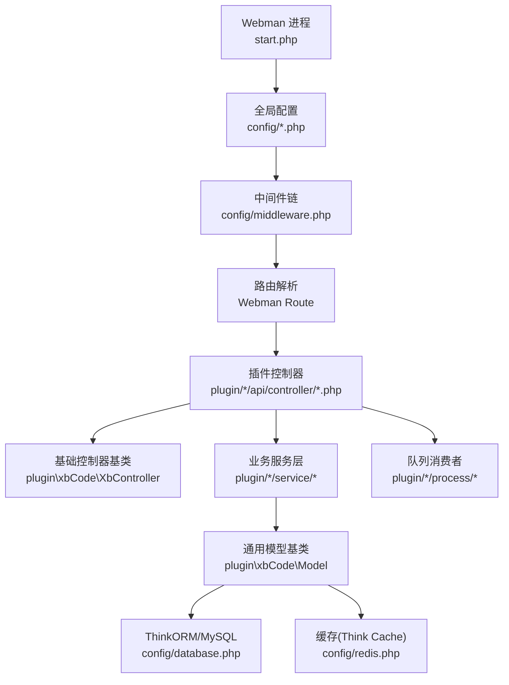
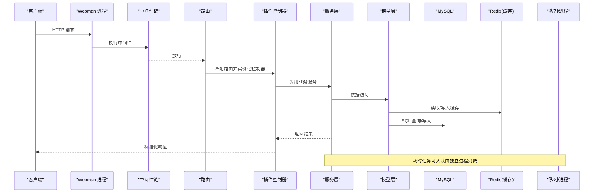
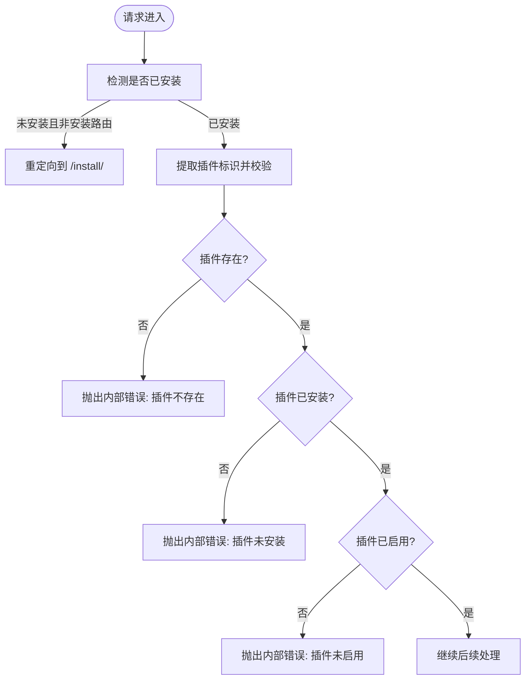
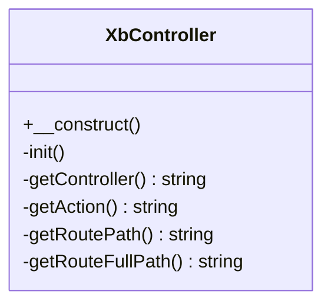
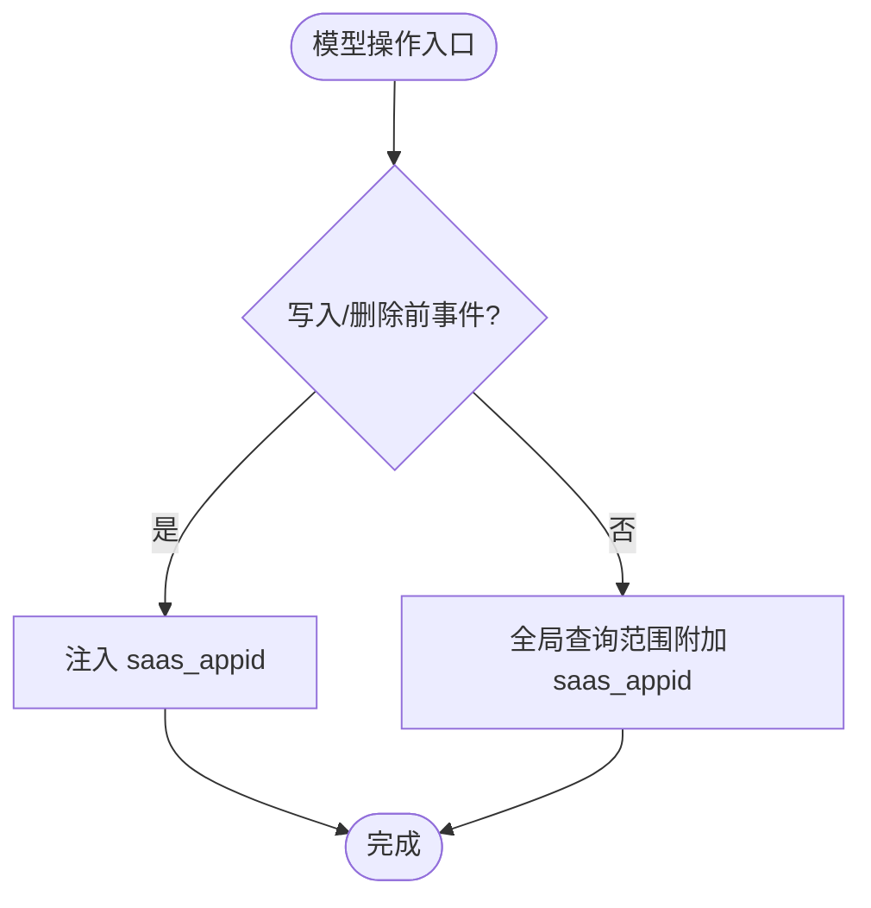
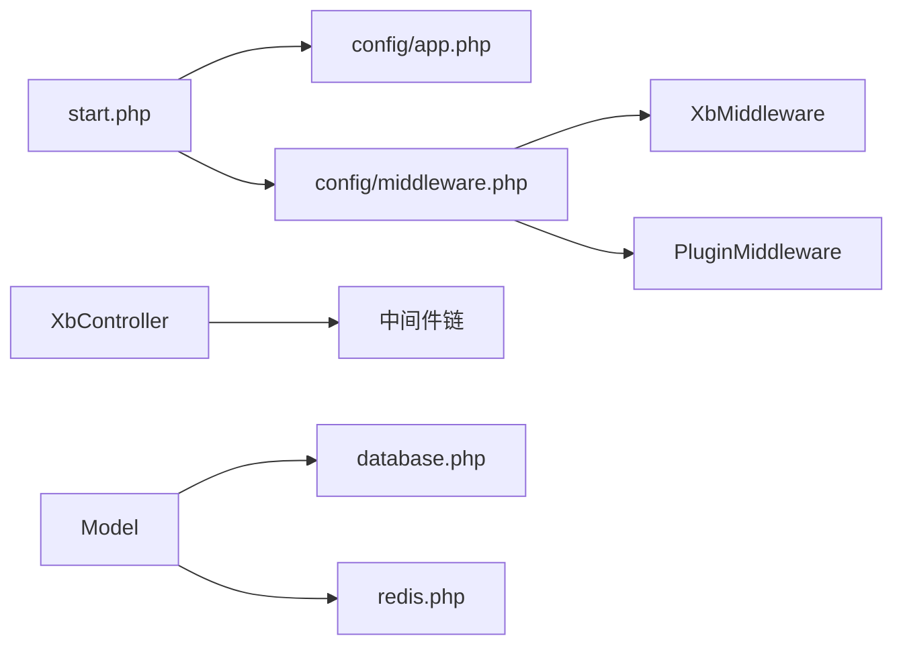

# 后端开发

<cite>
**本文引用的文件**
- [start.php](file://server/start.php)
- [README.md](file://server/README.md)
- [config/app.php](file://server/config/app.php)
- [config/middleware.php](file://server/config/middleware.php)
- [config/database.php](file://server/config/database.php)
- [config/redis.php](file://server/config/redis.php)
- [config/exception.php](file://server/config/exception.php)
- [plugin\xbCode\XbController.php](file://server/plugin\xbCode\XbController.php)
- [plugin\xbCode\Model.php](file://server/plugin\xbCode\Model.php)
- [plugin\xbCode\app\middleware\XbMiddleware.php](file://server/plugin\xbCode\app\middleware\XbMiddleware.php)
- [plugin\xbCode\app\middleware\PluginMiddleware.php](file://server/plugin\xbCode\app\middleware\PluginMiddleware.php)
</cite>

## 目录
1. [简介](#简介)
2. [项目结构](#项目结构)
3. [核心组件](#核心组件)
4. [架构总览](#架构总览)
5. [详细组件分析](#详细组件分析)
6. [依赖关系分析](#依赖关系分析)
7. [性能考虑](#性能考虑)
8. [故障排查指南](#故障排查指南)
9. [结论](#结论)
10. [附录](#附录)

## 简介
本文件面向“积木云AI创作平台”的后端开发，基于 Webman 框架与插件化架构（xbCode），系统性阐述 MVC 模式、中间件机制、错误处理策略、API 设计规范，并深入讲解插件系统原理、控制器-模型-服务层职责划分、数据库操作、缓存策略、队列处理等核心技术。文档同时提供开发示例、调试方法与性能优化建议，帮助开发者快速上手与高效迭代。

## 项目结构
后端采用“应用 + 插件”的模块化组织方式：
- 应用根目录 server 包含启动入口、全局配置、运行时目录与公共支持类。
- 插件位于 server/plugin 下，每个插件具备独立的 api、app、config、enum、service、process 等目录，实现功能解耦与可插拔。
- 前端位于 frontend 目录，通过 API 与后端交互。

图表来源
- [start.php:1-6](file://server/start.php#L1-L6)
- [config/app.php:1-13](file://server/config/app.php#L1-L13)
- [config/middleware.php:1-12](file://server/config/middleware.php#L1-L12)
- [config/database.php:1-35](file://server/config/database.php#L1-L35)
- [config/redis.php:1-17](file://server/config/redis.php#L1-L17)
- [plugin\xbCode\XbController.php:1-110](file://server/plugin\xbCode\XbController.php#L1-L110)
- [plugin\xbCode\Model.php:1-116](file://server/plugin\xbCode\Model.php#L1-L116)

章节来源
- [README.md:1-148](file://server/README.md#L1-L148)
- [start.php:1-6](file://server/start.php#L1-L6)

## 核心组件
- 启动与运行
  - 入口脚本加载自动加载器并调用 support\App::run() 启动 Webman 进程。
- 应用配置
  - 应用开关、时区、请求类、静态资源路径、运行时目录、控制器后缀与复用策略等。
- 中间件
  - 全局中间件注册，包括安装检查与插件权限校验。
- 基础控制器
  - 统一 JSON/视图/配置/字段工具能力，提供控制器与方法名获取、完整路由路径生成等。
- 基础模型
  - 全局查询范围、写入前事件、删除前事件、SaaS 多租户 saas_appid 注入与缓存字段元数据。
- 数据库与缓存
  - MySQL 连接池与 Think Cache 集成 Redis，提供高并发下的稳定读写。
- 异常处理
  - 全局异常处理器映射，便于统一错误响应与日志记录。

章节来源
- [start.php:1-6](file://server/start.php#L1-L6)
- [config/app.php:1-13](file://server/config/app.php#L1-L13)
- [config/middleware.php:1-12](file://server/config/middleware.php#L1-L12)
- [plugin\xbCode\XbController.php:1-110](file://server/plugin\xbCode\XbController.php#L1-L110)
- [plugin\xbCode\Model.php:1-116](file://server/plugin\xbCode\Model.php#L1-L116)
- [config/database.php:1-35](file://server/config/database.php#L1-L35)
- [config/redis.php:1-17](file://server/config/redis.php#L1-L17)
- [config/exception.php:1-17](file://server/config/exception.php#L1-L17)

## 架构总览
整体遵循 Webman 的高性能异步模型，结合 xbCode 插件体系形成“应用内核 + 插件扩展”的架构。请求进入后经过全局中间件链进行安装状态与插件权限校验，随后由路由分发到具体插件的控制器，控制器调用服务层完成业务编排，服务层通过模型访问数据库与缓存，必要时将耗时任务投递至队列或长驻进程处理。

图表来源
- [config/middleware.php:1-12](file://server/config/middleware.php#L1-L12)
- [plugin\xbCode\XbController.php:1-110](file://server/plugin\xbCode\XbController.php#L1-L110)
- [plugin\xbCode\Model.php:1-116](file://server/plugin\xbCode\Model.php#L1-L116)
- [config/database.php:1-35](file://server/config/database.php#L1-L35)
- [config/redis.php:1-17](file://server/config/redis.php#L1-L17)

## 详细组件分析

### 中间件机制与安装/插件校验
- 安装检查中间件
  - 在未安装状态下拦截非安装相关请求并重定向至安装流程。
- 插件校验中间件
  - 校验插件标识是否存在、是否已安装、是否启用；对特定静态资源（如预览图）放行。

图表来源
- [plugin\xbCode\app\middleware\XbMiddleware.php:1-43](file://server/plugin\xbCode\app\middleware\XbMiddleware.php#L1-L43)
- [plugin\xbCode\app\middleware\PluginMiddleware.php:1-79](file://server/plugin\xbCode\app\middleware\PluginMiddleware.php#L1-L79)
- [config/middleware.php:1-12](file://server/config/middleware.php#L1-L12)

章节来源
- [config/middleware.php:1-12](file://server/config/middleware.php#L1-L12)
- [plugin\xbCode\app\middleware\XbMiddleware.php:1-43](file://server/plugin\xbCode\app\middleware\XbMiddleware.php#L1-L43)
- [plugin\xbCode\app\middleware\PluginMiddleware.php:1-79](file://server/plugin\xbCode\app\middleware\PluginMiddleware.php#L1-L79)

### 控制器基类与路由信息
- 提供控制器与方法名的下划线命名转换、完整路由路径（含模块）生成等辅助方法。
- 引入 JSON/视图/配置/字段等 Trait，统一响应与渲染能力。

图表来源
- [plugin\xbCode\XbController.php:1-110](file://server/plugin\xbCode\XbController.php#L1-L110)

章节来源
- [plugin\xbCode\XbController.php:1-110](file://server/plugin\xbCode\XbController.php#L1-L110)

### 模型基类与多租户隔离
- 全局查询范围：为所有查询自动附加 saas_appid 条件，实现多租户数据隔离。
- 生命周期钩子：写入前与删除前事件自动注入 saas_appid。
- 字段元数据缓存：通过缓存表字段列表，避免频繁反射/DDL 查询，提升性能。

图表来源
- [plugin\xbCode\Model.php:1-116](file://server/plugin\xbCode\Model.php#L1-L116)

章节来源
- [plugin\xbCode\Model.php:1-116](file://server/plugin\xbCode\Model.php#L1-L116)

### 数据库与连接池
- 默认连接：MySQL，字符集 utf8mb4，严格模式开启。
- 连接池参数：最大/最小连接数、等待超时、空闲回收、心跳检测间隔等，适配协程环境。
- 表前缀与环境变量驱动，便于多环境部署。

章节来源
- [config/database.php:1-35](file://server/config/database.php#L1-L35)

### 缓存策略（Redis）
- 默认连接：Redis，支持密码与库号选择。
- 连接池参数：与数据库类似，保障高并发场景下的稳定性。
- 典型用法：模型层缓存表字段元数据，减少元数据查询开销。

章节来源
- [config/redis.php:1-17](file://server/config/redis.php#L1-L17)
- [plugin\xbCode\Model.php:1-116](file://server/plugin\xbCode\Model.php#L1-L116)

### 错误处理策略
- 全局异常处理器映射，便于统一捕获与格式化响应。
- 插件校验中间件中针对“插件不存在/未安装/未启用”抛出内部错误，确保对外一致的错误语义。

章节来源
- [config/exception.php:1-17](file://server/config/exception.php#L1-L17)
- [plugin\xbCode\app\middleware\PluginMiddleware.php:1-79](file://server/plugin\xbCode\app\middleware\PluginMiddleware.php#L1-L79)

### API 设计规范
- 路由与控制器
  - 使用 Webman 路由，控制器继承基础控制器以统一响应格式与工具能力。
- 鉴权与权限
  - 通过中间件完成安装态与插件态校验，后续可在插件内扩展登录鉴权与接口签名。
- 请求/响应
  - 请求对象来自 Webman Request，响应对象为 Response；建议使用统一的 JSON 响应结构。
- 版本与命名
  - 建议按插件维度划分命名空间与路由前缀，保持清晰的可维护性。

章节来源
- [config/middleware.php:1-12](file://server/config/middleware.php#L1-L12)
- [plugin\xbCode\XbController.php:1-110](file://server/plugin\xbCode\XbController.php#L1-L110)

### 插件系统原理与实现
- 插件目录约定
  - 每个插件位于 plugin/<插件名>，包含 api、app、config、enum、service、process 等标准目录。
- 插件生命周期
  - 安装/卸载、启用/禁用、配置项管理、菜单与路由注册、进程与队列消费者定义。
- 插件校验
  - 中间件在请求阶段校验插件存在性、安装状态与启用状态，防止非法访问。
- 插件间协作
  - 通过共享的基础控制器/模型与服务层抽象，降低耦合度。

章节来源
- [plugin\xbCode\app\middleware\PluginMiddleware.php:1-79](file://server/plugin\xbCode\app\middleware\PluginMiddleware.php#L1-L79)

### 控制器-模型-服务层职责划分
- 控制器层
  - 负责接收请求、参数校验、调用服务层、组装响应。
- 服务层
  - 封装业务逻辑，协调多个模型与外部服务，保证单一职责与可测试性。
- 模型层
  - 数据访问与领域规则，提供查询范围、事件钩子与缓存策略。

章节来源
- [plugin\xbCode\XbController.php:1-110](file://server/plugin\xbCode\XbController.php#L1-L110)
- [plugin\xbCode\Model.php:1-116](file://server/plugin\xbCode\Model.php#L1-L116)

### 队列处理与长驻进程
- 队列消费者
  - 插件可通过 process 目录定义消费者进程，处理下载、上传、查询等耗时任务。
- 任务调度
  - 结合定时任务与消息队列，实现异步化与削峰填谷。
- 监控与重启
  - 通过 runtime/windows 下的启动脚本统一管理各进程的生命周期。

章节来源
- [README.md:1-148](file://server/README.md#L1-L148)

## 依赖关系分析
- 启动依赖
  - start.php 加载自动加载器并启动应用。
- 配置依赖
  - app、database、redis、middleware、exception 等配置文件集中管理。
- 中间件依赖
  - 全局中间件链中注册安装检查与插件校验中间件。
- 基础类依赖
  - 控制器与模型基类提供跨插件的通用能力。

图表来源
- [start.php:1-6](file://server/start.php#L1-L6)
- [config/app.php:1-13](file://server/config/app.php#L1-L13)
- [config/middleware.php:1-12](file://server/config/middleware.php#L1-L12)
- [plugin\xbCode\XbController.php:1-110](file://server/plugin\xbCode\XbController.php#L1-L110)
- [plugin\xbCode\Model.php:1-116](file://server/plugin\xbCode\Model.php#L1-L116)
- [config/database.php:1-35](file://server/config/database.php#L1-L35)
- [config/redis.php:1-17](file://server/config/redis.php#L1-L17)

章节来源
- [start.php:1-6](file://server/start.php#L1-L6)
- [config/app.php:1-13](file://server/config/app.php#L1-L13)
- [config/middleware.php:1-12](file://server/config/middleware.php#L1-L12)
- [plugin\xbCode\XbController.php:1-110](file://server/plugin\xbCode\XbController.php#L1-L110)
- [plugin\xbCode\Model.php:1-116](file://server/plugin\xbCode\Model.php#L1-L116)
- [config/database.php:1-35](file://server/config/database.php#L1-L35)
- [config/redis.php:1-17](file://server/config/redis.php#L1-L17)

## 性能考虑
- 连接池调优
  - 根据 QPS 与 CPU 核数调整数据库与 Redis 的最大/最小连接数、等待超时与心跳间隔。
- 缓存优先
  - 热点数据优先走缓存，模型层已对表字段元数据进行缓存，建议在业务层也合理设置缓存键与过期时间。
- 异步化
  - 将耗时 IO 与计算任务放入队列，缩短主链路响应时间。
- 静态资源
  - 将静态资源交由 Nginx 直接返回，减少 PHP 进程压力。
- 日志与监控
  - 控制日志级别与采样率，避免磁盘 IO 成为瓶颈；结合运行时日志定位慢查询与异常。

[本节为通用指导，不直接分析具体文件]

## 故障排查指南
- 未安装状态导致重定向
  - 现象：访问任意页面被重定向到安装页。
  - 排查：确认安装流程已完成，或临时放开安装相关路由。
- 插件未安装或未启用
  - 现象：接口返回内部错误提示插件不存在/未安装/未启用。
  - 排查：检查插件标识、安装状态与启用状态，确认中间件校验逻辑。
- 数据库连接失败
  - 现象：连接池报错或超时。
  - 排查：核对环境变量与连接池参数，检查网络与数据库服务可用性。
- Redis 不可用
  - 现象：缓存读写失败或连接池耗尽。
  - 排查：检查 Redis 地址、端口、密码与库号，评估连接池上限。
- 全局异常未捕获
  - 现象：异常堆栈直接输出。
  - 排查：确认全局异常处理器映射是否正确，检查自定义异常类型。

章节来源
- [plugin\xbCode\app\middleware\XbMiddleware.php:1-43](file://server/plugin\xbCode\app\middleware\XbMiddleware.php#L1-L43)
- [plugin\xbCode\app\middleware\PluginMiddleware.php:1-79](file://server/plugin\xbCode\app\middleware\PluginMiddleware.php#L1-L79)
- [config/database.php:1-35](file://server/config/database.php#L1-L35)
- [config/redis.php:1-17](file://server/config/redis.php#L1-L17)
- [config/exception.php:1-17](file://server/config/exception.php#L1-L17)

## 结论
本项目基于 Webman 与 xbCode 插件体系，形成了高可扩展、高可用的后端架构。通过中间件完成安装与插件态校验，基础控制器与模型提供跨插件的通用能力，配合数据库连接池与 Redis 缓存，满足 AI 创作平台的高并发与复杂业务需求。建议在实际开发中遵循分层职责、统一 API 规范，并将耗时任务异步化，以获得更佳的吞吐与稳定性。

[本节为总结性内容，不直接分析具体文件]

## 附录
- 开发示例
  - 新增插件接口：在对应插件的 api/controller 下创建控制器，继承基础控制器，编写业务逻辑并通过路由暴露。
  - 数据访问：在插件 model 目录下定义模型，继承基础模型，利用全局查询范围与事件钩子实现多租户隔离。
  - 缓存使用：在模型或服务层使用 Think Cache 读写 Redis，注意键命名与过期策略。
  - 队列任务：在插件 process 目录定义消费者，处理下载、上传、批量生成等任务。
- 调试方法
  - 开启应用 debug 模式，查看详细错误信息。
  - 使用运行时日志与中间件埋点，追踪请求链路。
  - 针对数据库与 Redis 连接问题，打印连接池统计与慢查询日志。
- 最佳实践
  - 控制器只做参数校验与响应组装，业务逻辑下沉至服务层。
  - 模型只关注数据访问与领域约束，避免在模型中写复杂业务。
  - 对敏感配置使用环境变量，避免硬编码。
  - 为关键接口增加幂等性与限流保护。

[本节为通用指导，不直接分析具体文件]