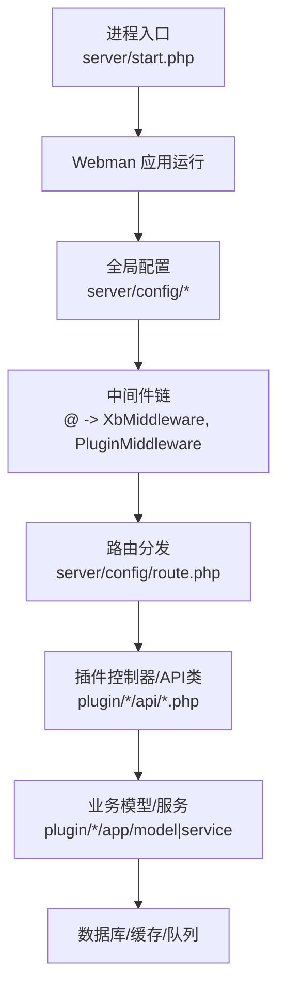
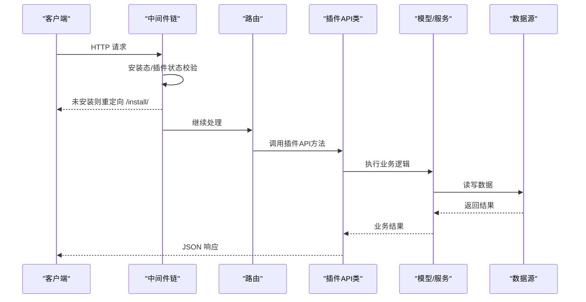
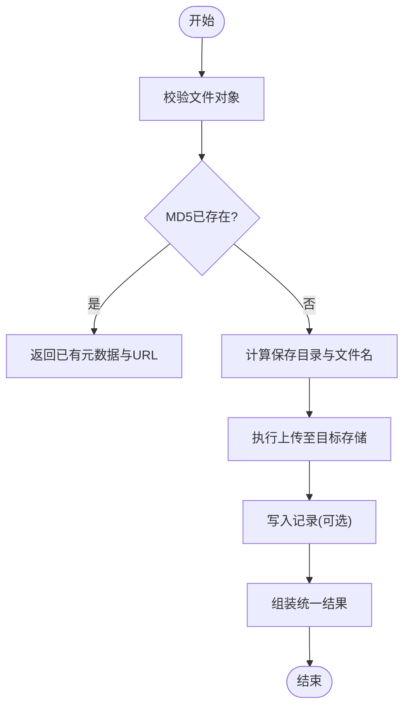
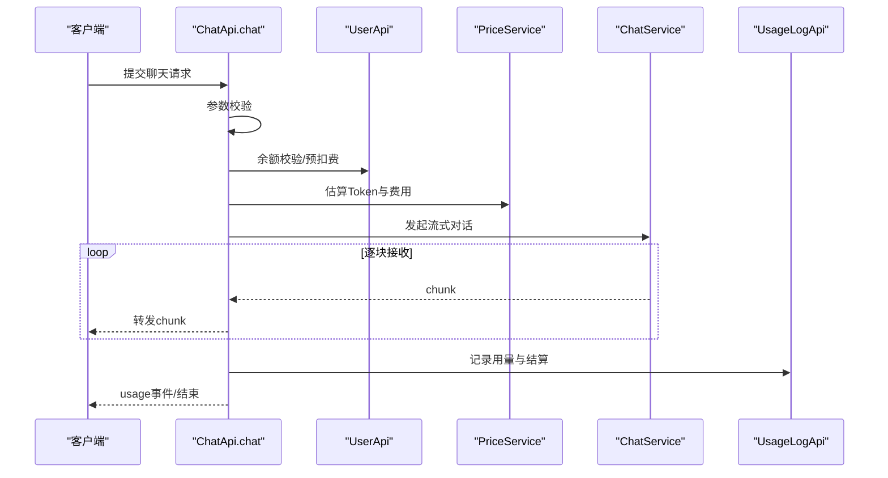
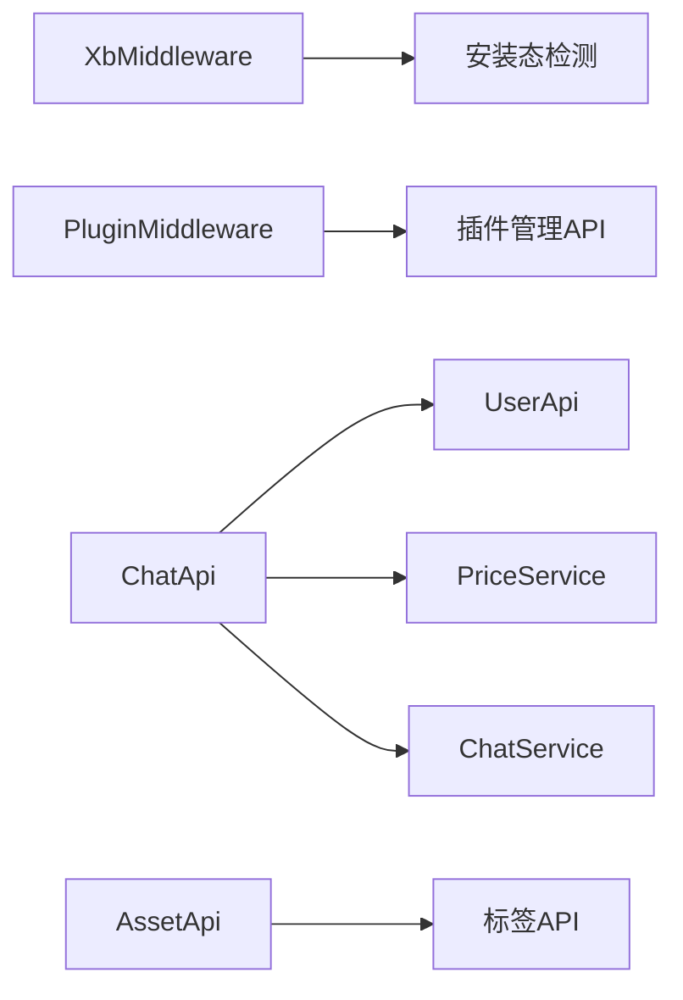

# 插件API设计规范

<cite>
**本文引用的文件**   
- [start.php](file://server/start.php)
- [server.php](file://server/config/server.php)
- [route.php](file://server/config/route.php)
- [Request.php](file://server/support/Request.php)
- [Response.php](file://server/support/Response.php)
- [XbController.php](file://server/plugin\xbCode\XbController.php)
- [UserApi.php](file://server/plugin\xbUser\api\UserApi.php)
- [UploadApi.php](file://server/plugin\xbUpload\api\UploadApi.php)
- [AssetApi.php](file://server/plugin\xbAiAsset\api\AssetApi.php)
- [ChatApi.php](file://server/plugin\xbAiModelAgent\api\ChatApi.php)
- [middleware.php](file://server/config/middleware.php)
- [XbMiddleware.php](file://server/plugin\xbCode\app\middleware\XbMiddleware.php)
- [PluginMiddleware.php](file://server/plugin\xbCode\app\middleware\PluginMiddleware.php)
- [PasswdUtil.php](file://server/plugin\xbCode\utils\PasswdUtil.php)
</cite>

## 目录
1. [引言](#引言)
2. [项目结构](#项目结构)
3. [核心组件](#核心组件)
4. [架构总览](#架构总览)
5. [详细组件分析](#详细组件分析)
6. [依赖关系分析](#依赖关系分析)
7. [性能考量](#性能考量)
8. [故障排查指南](#故障排查指南)
9. [结论](#结论)
10. [附录](#附录)

## 引言
本规范面向基于 Webman 的插件化系统，统一约定插件对外暴露的 API 设计原则、接口命名、请求与响应格式、错误码定义、认证授权机制、版本控制策略，并覆盖 RESTful、WebSocket 实时接口、文件上传下载、第三方服务集成等模式。同时给出 API 文档自动生成、接口测试与性能监控的实践建议，确保多插件协同下的可维护性与可扩展性。

## 项目结构
后端采用 Webman 框架，启动入口位于 server/start.php；全局配置在 server/config 下（如 server.php、middleware.php、route.php）；插件以独立目录形式置于 server/plugin 下，每个插件包含 api、app、config、enum、service 等子目录，遵循“按插件隔离”的组织方式。

图示来源
- [start.php:1-6](file://server/start.php#L1-L6)
- [server.php:1-12](file://server/config/server.php#L1-L12)
- [middleware.php:1-12](file://server/config/middleware.php#L1-L12)
- [route.php:1-22](file://server/config/route.php#L1-L22)

章节来源
- [start.php:1-6](file://server/start.php#L1-L6)
- [server.php:1-12](file://server/config/server.php#L1-L12)
- [middleware.php:1-12](file://server/config/middleware.php#L1-L12)
- [route.php:1-22](file://server/config/route.php#L1-L22)

## 核心组件
- 基础请求/响应封装：support/Request.php、support/Response.php 继承 Webman 原生类型，便于扩展。
- 控制器基类：plugin\xbCode\XbController 提供控制器与方法名解析、完整路由路径获取等通用能力。
- 中间件：XbMiddleware 负责安装态检查与重定向；PluginMiddleware 负责插件存在/安装/启用校验。
- 插件 API 示例：
  - 用户域：plugin\xbUser\api\UserApi.php
  - 上传域：plugin\xbUpload\api\UploadApi.php
  - 素材域：plugin\xbAiAsset\api\AssetApi.php
  - AI聊天流式：plugin\xbAiModelAgent\api\ChatApi.php

章节来源
- [Request.php:1-24](file://server/support/Request.php#L1-L24)
- [Response.php:1-24](file://server/support/Response.php#L1-L24)
- [XbController.php:1-110](file://server/plugin\xbCode\XbController.php#L1-L110)
- [XbMiddleware.php:1-43](file://server/plugin\xbCode\app\middleware\XbMiddleware.php#L1-L43)
- [PluginMiddleware.php:1-79](file://server/plugin\xbCode\app\middleware\PluginMiddleware.php#L1-L79)
- [UserApi.php:1-445](file://server/plugin\xbUser\api\UserApi.php#L1-L445)
- [UploadApi.php:1-409](file://server/plugin\xbUpload\api\UploadApi.php#L1-L409)
- [AssetApi.php:1-192](file://server/plugin\xbAiAsset\api\AssetApi.php#L1-L192)
- [ChatApi.php:1-287](file://server/plugin\xbAiModelAgent\api\ChatApi.php#L1-L287)

## 架构总览
整体采用“中间件前置校验 + 插件内 API 类实现”的分层模式。请求进入后先经过安装态与插件状态校验，再路由到具体插件的 API 方法；业务逻辑由插件内部模型与服务完成，必要时通过事件总线进行跨模块解耦。

图示来源
- [middleware.php:1-12](file://server/config/middleware.php#L1-L12)
- [XbMiddleware.php:1-43](file://server/plugin\xbCode\app\middleware\XbMiddleware.php#L1-L43)
- [PluginMiddleware.php:1-79](file://server/plugin\xbCode\app\middleware\PluginMiddleware.php#L1-L79)
- [route.php:1-22](file://server/config/route.php#L1-L22)

## 详细组件分析

### 统一响应与错误码规范
- 响应体结构
  - code: 整数，业务状态码
  - message: 字符串，人类可读消息
  - data: 任意，业务数据
  - trace_id: 可选，用于链路追踪
- 错误码分层
  - 1xxxx：系统级错误（如 10001 参数校验失败、10002 权限不足、10003 资源不存在、10004 服务不可用）
  - 2xxxx：用户域错误（20xxx）
  - 3xxxx：上传域错误（30xxx）
  - 4xxxx：AI/模型域错误（40xxx）
- 异常到响应的映射
  - 业务异常抛出时，统一捕获并转换为标准响应体
  - 日志记录需包含请求ID、关键入参与堆栈摘要

章节来源
- [UserApi.php:67-85](file://server/plugin\xbUser\api\UserApi.php#L67-L85)
- [UserApi.php:97-117](file://server/plugin\xbUser\api\UserApi.php#L97-L117)
- [UserApi.php:129-158](file://server/plugin\xbUser\api\UserApi.php#L129-L158)
- [UserApi.php:168-181](file://server/plugin\xbUser\api\UserApi.php#L168-L181)
- [UserApi.php:214-237](file://server/plugin\xbUser\api\UserApi.php#L214-L237)
- [UserApi.php:274-291](file://server/plugin\xbUser\api\UserApi.php#L274-L291)
- [UserApi.php:303-347](file://server/plugin\xbUser\api\UserApi.php#L303-L347)
- [UserApi.php:359-403](file://server/plugin\xbUser\api\UserApi.php#L359-L403)
- [UploadApi.php:121-128](file://server/plugin\xbUpload\api\UploadApi.php#L121-L128)
- [UploadApi.php:137-201](file://server/plugin\xbUpload\api\UploadApi.php#L137-L201)
- [UploadApi.php:211-235](file://server/plugin\xbUpload\api\UploadApi.php#L211-L235)
- [UploadApi.php:245-263](file://server/plugin\xbUpload\api\UploadApi.php#L245-L263)
- [ChatApi.php:55-81](file://server/plugin\xbAiModelAgent\api\ChatApi.php#L55-L81)
- [ChatApi.php:167-175](file://server/plugin\xbAiModelAgent\api\ChatApi.php#L167-L175)

### 认证与授权机制
- 鉴权位置
  - 中间件层：XbMiddleware 负责安装态检查；PluginMiddleware 负责插件存在/安装/启用校验
- 登录态与令牌
  - 建议在中间件中从请求头或 Cookie 解析令牌，注入当前用户上下文
- 密码安全
  - 使用工具类生成/校验密码哈希，避免明文存储
- 权限粒度
  - 基于角色/资源的访问控制可在中间件或控制器中实现

章节来源
- [XbMiddleware.php:32-42](file://server/plugin\xbCode\app\middleware\XbMiddleware.php#L32-L42)
- [PluginMiddleware.php:51-78](file://server/plugin\xbCode\app\middleware\PluginMiddleware.php#L51-L78)
- [PasswdUtil.php:20-26](file://server/plugin\xbCode\utils\PasswdUtil.php#L20-L26)

### 接口命名与RESTful规范
- 资源名词复数化，动词使用HTTP方法表达
  - GET /plugins/{name}/assets 列表
  - POST /plugins/{name}/assets 创建
  - PUT /plugins/{name}/assets/{id} 更新
  - DELETE /plugins/{name}/assets/{id} 删除
- 查询参数
  - 分页：page、limit
  - 排序：order_by、order_dir
  - 过滤：type、source、user_id 等
- 路径与模块
  - 结合插件名作为一级路径前缀，避免冲突
- 控制器辅助
  - 使用 XbController 提供的 getController/getAction/getRouteFullPath 等方法统一生成路由标识

章节来源
- [XbController.php:57-109](file://server/plugin\xbCode\XbController.php#L57-L109)
- [AssetApi.php:46-73](file://server/plugin\xbAiAsset\api\AssetApi.php#L46-L73)

### 请求与响应格式
- Content-Type
  - application/json（默认）
  - multipart/form-data（文件上传）
- 请求体
  - 字段命名采用小写下划线或驼峰，保持前后端一致
  - 必填字段需在服务端校验并返回明确错误信息
- 响应体
  - 统一包装为 {code,message,data}
  - 列表接口返回分页对象，包含 total、list、page、limit 等

章节来源
- [UserApi.php:67-85](file://server/plugin\xbUser\api\UserApi.php#L67-L85)
- [AssetApi.php:46-73](file://server/plugin\xbAiAsset\api\AssetApi.php#L46-L73)

### WebSocket 实时接口设计
- 连接建立
  - 握手阶段携带 token 或 session，中间件完成鉴权
- 消息协议
  - 采用 JSON 帧，包含 type、payload、trace_id
  - 心跳：ping/pong 维持长连接
- 订阅与发布
  - 基于频道/房间模型，支持按用户或资源维度推送
- 错误与重连
  - 服务端主动断开需附带 reason 与重试间隔
  - 客户端指数退避重连

[本节为概念性说明，不直接分析具体文件]

### 文件上传下载接口规范
- 上传
  - 表单字段名固定为 file（可通过参数指定）
  - 返回统一文件元数据与直链地址
- 下载
  - 支持远程 URL 拉取并落盘后走统一上传流程
  - 本地路径上传用于后台任务或批量导入
- 去重与校验
  - 基于 MD5 去重，避免重复存储
  - 校验 MIME、大小、扩展名白名单
- 存储策略
  - 按类型分目录，日期分片，便于清理与CDN缓存

图示来源
- [UploadApi.php:137-201](file://server/plugin\xbUpload\api\UploadApi.php#L137-L201)
- [UploadApi.php:325-341](file://server/plugin\xbUpload\api\UploadApi.php#L325-L341)
- [UploadApi.php:350-373](file://server/plugin\xbUpload\api\UploadApi.php#L350-L373)

章节来源
- [UploadApi.php:121-128](file://server/plugin\xbUpload\api\UploadApi.php#L121-L128)
- [UploadApi.php:137-201](file://server/plugin\xbUpload\api\UploadApi.php#L137-L201)
- [UploadApi.php:211-235](file://server/plugin\xbUpload\api\UploadApi.php#L211-L235)
- [UploadApi.php:245-263](file://server/plugin\xbUpload\api\UploadApi.php#L245-L263)
- [UploadApi.php:325-341](file://server/plugin\xbUpload\api\UploadApi.php#L325-L341)
- [UploadApi.php:350-373](file://server/plugin\xbUpload\api\UploadApi.php#L350-L373)

### 第三方服务集成接口
- 模型代理
  - 通过 ChatApi 将外部模型能力抽象为统一接口
  - 支持流式输出与用量统计
- 计费与预扣费
  - 根据模型定价估算 Token 并预扣余额，结束后多退少补
- 错误处理
  - 上游异常透传并记录日志，保证幂等与可追溯

图示来源
- [ChatApi.php:55-175](file://server/plugin\xbAiModelAgent\api\ChatApi.php#L55-L175)
- [ChatApi.php:191-285](file://server/plugin\xbAiModelAgent\api\ChatApi.php#L191-L285)
- [UserApi.php:274-291](file://server/plugin\xbUser\api\UserApi.php#L274-L291)
- [UserApi.php:359-403](file://server/plugin\xbUser\api\UserApi.php#L359-L403)

章节来源
- [ChatApi.php:55-175](file://server/plugin\xbAiModelAgent\api\ChatApi.php#L55-L175)
- [ChatApi.php:191-285](file://server/plugin\xbAiModelAgent\api\ChatApi.php#L191-L285)
- [UserApi.php:274-291](file://server/plugin\xbUser\api\UserApi.php#L274-L291)
- [UserApi.php:359-403](file://server/plugin\xbUser\api\UserApi.php#L359-L403)

### 事件与扩展点
- 事件驱动
  - 在关键业务节点（增删改）触发事件，供其他插件监听
- 典型事件
  - 资产创建/更新/删除前后事件
  - 用户积分/余额变动事件
- 最佳实践
  - 事件处理器应幂等且快速，耗时操作放入队列

章节来源
- [AssetApi.php:91-108](file://server/plugin\xbAiAsset\api\AssetApi.php#L91-L108)
- [AssetApi.php:116-137](file://server/plugin\xbAiAsset\api\AssetApi.php#L116-L137)
- [AssetApi.php:144-163](file://server/plugin\xbAiAsset\api\AssetApi.php#L144-L163)
- [UserApi.php:303-347](file://server/plugin\xbUser\api\UserApi.php#L303-L347)
- [UserApi.php:359-403](file://server/plugin\xbUser\api\UserApi.php#L359-L403)

## 依赖关系分析
- 中间件依赖
  - XbMiddleware 依赖安装态检测工具
  - PluginMiddleware 依赖插件管理 API
- 插件间耦合
  - ChatApi 依赖 UserApi 做余额校验与扣费
  - AssetApi 依赖标签相关 API 同步标签
- 外部依赖
  - 数据库、缓存、队列、第三方模型服务

图示来源
- [XbMiddleware.php:32-42](file://server/plugin\xbCode\app\middleware\XbMiddleware.php#L32-L42)
- [PluginMiddleware.php:51-78](file://server/plugin\xbCode\app\middleware\PluginMiddleware.php#L51-L78)
- [ChatApi.php:55-175](file://server/plugin\xbAiModelAgent\api\ChatApi.php#L55-L175)
- [AssetApi.php:171-190](file://server/plugin\xbAiAsset\api\AssetApi.php#L171-L190)

章节来源
- [XbMiddleware.php:32-42](file://server/plugin\xbCode\app\middleware\XbMiddleware.php#L32-L42)
- [PluginMiddleware.php:51-78](file://server/plugin\xbCode\app\middleware\PluginMiddleware.php#L51-L78)
- [ChatApi.php:55-175](file://server/plugin\xbAiModelAgent\api\ChatApi.php#L55-L175)
- [AssetApi.php:171-190](file://server/plugin\xbAiAsset\api\AssetApi.php#L171-L190)

## 性能考量
- 大请求体限制
  - 通过 max_package_size 控制最大包体，避免内存溢出
- 流式传输
  - 聊天接口采用 Generator 逐块输出，降低首字节延迟
- 缓存策略
  - 热点数据（如用户选项）使用缓存，减少数据库压力
- 异步与队列
  - 非关键路径（如日志、通知）放入队列，缩短主流程耗时

章节来源
- [server.php:10-11](file://server/config/server.php#L10-L11)
- [ChatApi.php:55-175](file://server/plugin\xbAiModelAgent\api\ChatApi.php#L55-L175)
- [UserApi.php:435-445](file://server/plugin\xbUser\api\UserApi.php#L435-L445)

## 故障排查指南
- 常见问题定位
  - 未安装：被重定向至 /install/
  - 插件未启用：返回内部错误提示
  - 余额不足：聊天接口提前拦截并返回错误
  - 上传失败：检查文件对象、MD5、MIME、存储路径
- 日志与追踪
  - 记录请求ID、关键入参与异常堆栈
  - 对第三方调用增加超时与重试策略

章节来源
- [XbMiddleware.php:32-42](file://server/plugin\xbCode\app\middleware\XbMiddleware.php#L32-L42)
- [PluginMiddleware.php:51-78](file://server/plugin\xbCode\app\middleware\PluginMiddleware.php#L51-L78)
- [ChatApi.php:167-175](file://server/plugin\xbAiModelAgent\api\ChatApi.php#L167-L175)
- [UploadApi.php:137-201](file://server/plugin\xbUpload\api\UploadApi.php#L137-L201)

## 结论
本规范围绕“中间件前置校验 + 插件自治 + 统一响应与错误码 + 事件驱动”的设计思想，明确了 RESTful、WebSocket、文件上传下载与第三方集成的标准化要求。配合统一的鉴权、版本控制与可观测性措施，可有效提升插件生态的可维护性与稳定性。

## 附录

### 版本控制策略
- 路径版本
  - 在路由前缀引入 v1/v2，兼容历史接口
- 内容协商
  - 通过 Accept 或请求头声明期望的版本
- 废弃策略
  - 保留至少两个大版本，废弃接口需标注 deprecation 响应头与过期时间

[本节为概念性说明，不直接分析具体文件]

### API 文档自动生成
- 注解驱动
  - 在 API 类方法上添加注释描述参数、返回值与错误码
- 代码扫描
  - 构建期扫描 plugin/*/api 目录，生成 OpenAPI/Swagger 文档
- 在线预览
  - 提供 /doc 页面，自动加载最新文档

[本节为概念性说明，不直接分析具体文件]

### 接口测试
- 单测
  - 针对 API 类的核心方法进行单元测试，覆盖正常与异常分支
- 集成测试
  - 构造最小环境，验证中间件、路由与插件装配
- 契约测试
  - 基于生成的文档进行契约校验，防止破坏性变更

[本节为概念性说明，不直接分析具体文件]

### 性能监控
- 指标采集
  - QPS、P95/P99 延迟、错误率、下游调用耗时
- 链路追踪
  - 全链路 trace_id 贯穿中间件、API、模型与外部服务
- 告警规则
  - 错误率阈值、慢请求阈值、下游超时告警

[本节为概念性说明，不直接分析具体文件]