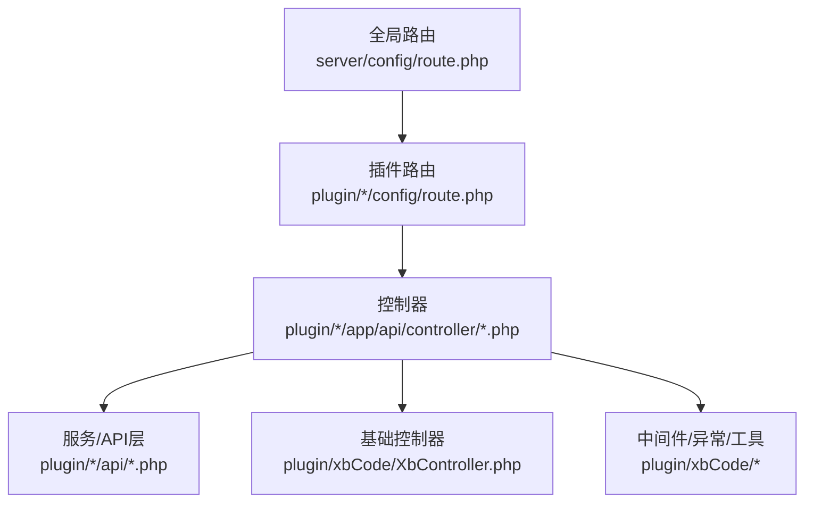
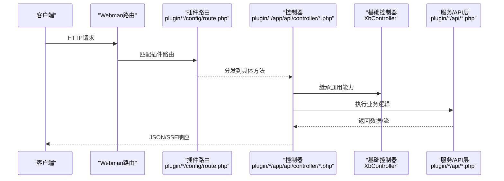
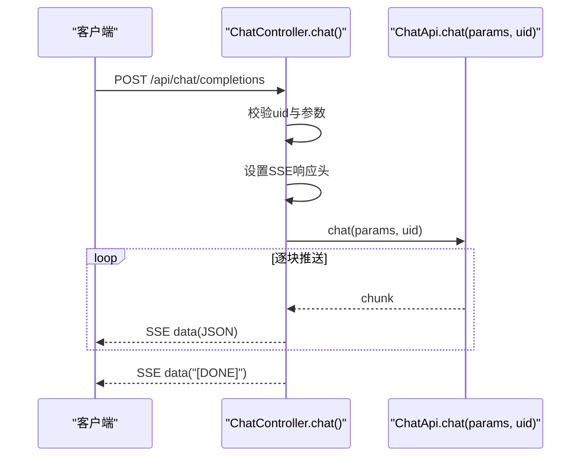
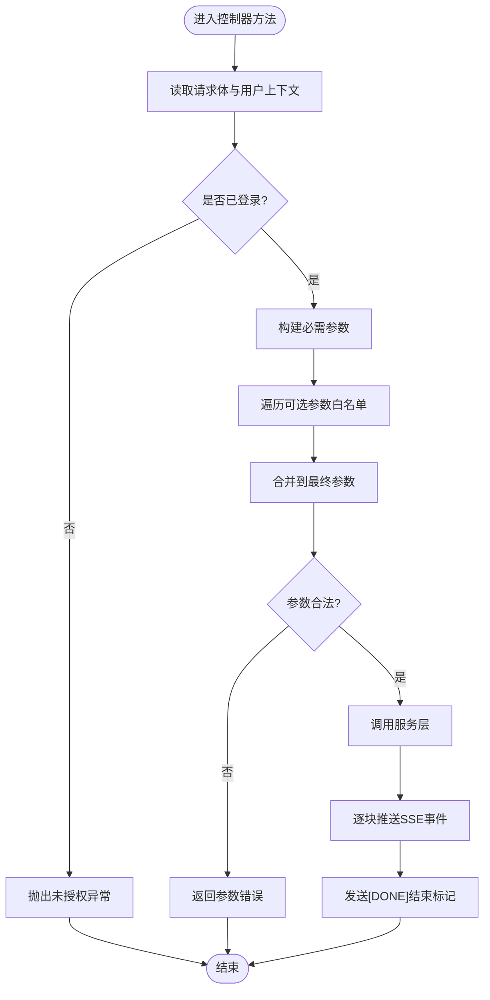
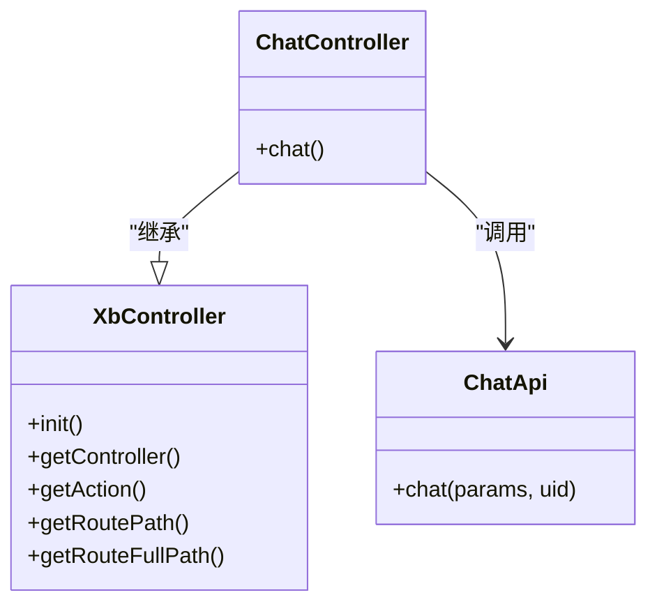

# API接口设计

<cite>
**本文引用的文件**   
- [server/config/route.php](file://server/config/route.php)
- [server/app/controller/IndexController.php](file://server/app/controller/IndexController.php)
- [server/plugin/xbCode/XbController.php](file://server/plugin/xbCode/XbController.php)
- [server/plugin/xbAiModelAgent/config/route.php](file://server/plugin/xbAiModelAgent/config/route.php)
- [server/plugin/xbAiModelAgent/app/api/controller/ChatController.php](file://server/plugin/xbAiModelAgent/app/api/controller/ChatController.php)
- [server/plugin/xbUser/config/route.php](file://server/plugin/xbUser/config/route.php)
- [server/plugin/xbUser/app/user/controller/IndexController.php](file://server/plugin/xbUser/app/user/controller/IndexController.php)
</cite>

## 目录
1. [引言](#引言)
2. [项目结构](#项目结构)
3. [核心组件](#核心组件)
4. [架构总览](#架构总览)
5. [详细组件分析](#详细组件分析)
6. [依赖分析](#依赖分析)
7. [性能考虑](#性能考虑)
8. [故障排查指南](#故障排查指南)
9. [结论](#结论)
10. [附录](#附录)

## 引言
本指南面向插件开发者，系统化阐述在本仓库中如何设计并实现RESTful风格的API接口。内容覆盖控制器编写规范、路由配置方法、请求参数验证、响应格式标准化、安全认证机制、错误处理策略与版本管理方案，并提供CRUD、复杂业务逻辑与批量操作的完整开发示例路径，帮助快速落地高质量插件API。

## 项目结构
本项目基于Webman框架，采用“插件化”组织方式：每个插件在自身目录下提供独立的config/route.php进行路由注册，并在app下按模块（如api、admin、home）划分控制器与服务。根级路由配置文件用于全局入口或默认行为。

图表来源
- [server/config/route.php:1-22](file://server/config/route.php#L1-L22)
- [server/plugin/xbAiModelAgent/config/route.php:1-13](file://server/plugin/xbAiModelAgent/config/route.php#L1-L13)
- [server/plugin/xbCode/XbController.php:1-110](file://server/plugin/xbCode/XbController.php#L1-L110)

章节来源
- [server/config/route.php:1-22](file://server/config/route.php#L1-L22)

## 核心组件
- 基础控制器基类：提供统一的JSON视图、配置读取、字段处理等能力，便于插件控制器继承复用。
- 插件路由：各插件通过自身的config/route.php声明路由，避免全局污染，提升可维护性。
- 统一响应：使用json()返回标准JSON结构，保持前后端一致。
- 流式响应：支持SSE（Server-Sent Events），适用于AI对话等长连接场景。

章节来源
- [server/plugin/xbCode/XbController.php:1-110](file://server/plugin/xbCode/XbController.php#L1-L110)
- [server/app/controller/IndexController.php:38-40](file://server/app/controller/IndexController.php#L38-L40)

## 架构总览
下图展示了从客户端到控制器的典型调用链路，以及插件内分层职责。

图表来源
- [server/plugin/xbAiModelAgent/config/route.php:1-13](file://server/plugin/xbAiModelAgent/config/route.php#L1-L13)
- [server/plugin/xbAiModelAgent/app/api/controller/ChatController.php:1-116](file://server/plugin/xbAiModelAgent/app/api/controller/ChatController.php#L1-L116)
- [server/plugin/xbCode/XbController.php:1-110](file://server/plugin/xbCode/XbController.php#L1-L110)

## 详细组件分析

### 控制器编写规范
- 继承基础控制器：所有插件控制器建议继承XbController，以获得统一的响应、配置、视图等能力。
- 方法命名与职责：一个HTTP动作对应一个方法；将业务逻辑下沉至服务/API层，控制器仅做参数解析与响应封装。
- 注解文档：可使用API文档注解标注接口说明、参数类型与必填项，便于生成文档。
- 权限控制：对需要登录的方法进行鉴权，未登录时抛出统一异常，由全局异常处理器返回标准错误。

章节来源
- [server/plugin/xbCode/XbController.php:1-110](file://server/plugin/xbCode/XbController.php#L1-L110)
- [server/plugin/xbAiModelAgent/app/api/controller/ChatController.php:1-116](file://server/plugin/xbAiModelAgent/app/api/controller/ChatController.php#L1-L116)

### 路由配置方法
- 插件路由：在插件的config/route.php中使用Webman Route进行注册，推荐以/api为前缀区分对外接口。
- 分组与静态资源：可按模块分组，静态资源通过闭包直接返回文件响应。
- 禁用默认路由：在需要严格白名单的路由文件中可禁用默认路由，避免意外暴露。

章节来源
- [server/plugin/xbAiModelAgent/config/route.php:1-13](file://server/plugin/xbAiModelAgent/config/route.php#L1-L13)
- [server/plugin/xbUser/config/route.php:1-11](file://server/plugin/xbUser/config/route.php#L1-L11)

### 请求参数验证
- 基础校验：在控制器中读取请求体并进行空值检查与类型转换。
- 可选参数透传：对于模型推理等场景，可通过白名单键集合选择性透传参数。
- 结构化校验：建议引入表单验证器或自定义校验函数，集中定义规则与错误消息。

章节来源
- [server/plugin/xbAiModelAgent/app/api/controller/ChatController.php:46-85](file://server/plugin/xbAiModelAgent/app/api/controller/ChatController.php#L46-L85)

### 响应格式标准化
- 成功响应：使用json()返回包含code、msg、data的标准结构。
- 失败响应：抛出统一业务异常，由全局异常处理器转换为标准错误JSON。
- 流式响应：SSE模式下逐块推送事件，最后发送结束标记。

章节来源
- [server/app/controller/IndexController.php:38-40](file://server/app/controller/IndexController.php#L38-L40)
- [server/plugin/xbAiModelAgent/app/api/controller/ChatController.php:87-114](file://server/plugin/xbAiModelAgent/app/api/controller/ChatController.php#L87-L114)

### 安全认证机制
- 用户上下文：从请求对象中获取已登录用户ID，作为后续权限判断依据。
- 未登录拦截：当缺少必要上下文时，抛出未授权异常，返回标准错误。
- 公开接口：明确声明无需登录的方法列表，减少不必要的鉴权开销。

章节来源
- [server/plugin/xbAiModelAgent/app/api/controller/ChatController.php:48-56](file://server/plugin/xbAiModelAgent/app/api/controller/ChatController.php#L48-L56)
- [server/plugin/xbUser/app/user/controller/IndexController.php:24-33](file://server/plugin/xbUser/app/user/controller/IndexController.php#L24-L33)

### 错误处理策略
- 业务异常：针对未登录、权限不足、参数非法等业务错误，抛出专用异常类。
- 全局异常：由框架或插件的全局异常处理器捕获，统一输出错误码与消息。
- 流式异常：在SSE场景中，向客户端推送错误事件并正常关闭连接。

章节来源
- [server/plugin/xbAiModelAgent/app/api/controller/ChatController.php:54-56](file://server/plugin/xbAiModelAgent/app/api/controller/ChatController.php#L54-L56)
- [server/plugin/xbAiModelAgent/app/api/controller/ChatController.php:102-111](file://server/plugin/xbAiModelAgent/app/api/controller/ChatController.php#L102-L111)

### 版本管理方案
- URL前缀：通过/api/v1、/api/v2等前缀区分接口版本，便于平滑演进。
- 路由分组：在插件路由中按版本分组，逐步迁移旧接口。
- 兼容策略：保留旧版本路由一段时间，配合灰度发布与监控告警。

[本节为概念性说明，不直接分析具体文件]

### CRUD操作示例（路径指引）
- 创建：POST /api/{resource}
- 查询：GET /api/{resource}/{id}
- 更新：PUT /api/{resource}/{id}
- 删除：DELETE /api/{resource}/{id}
- 列表：GET /api/{resource}?page=...&limit=...&keyword=...

章节来源
- [server/plugin/xbAiModelAgent/config/route.php:8-12](file://server/plugin/xbAiModelAgent/config/route.php#L8-L12)

### 复杂业务逻辑示例（路径指引）
- 流式聊天：POST /api/chat/completions，控制器负责鉴权与参数组装，服务层返回迭代流，控制器逐块推送SSE事件。

章节来源
- [server/plugin/xbAiModelAgent/app/api/controller/ChatController.php:46-114](file://server/plugin/xbAiModelAgent/app/api/controller/ChatController.php#L46-L114)

### 批量操作示例（路径指引）
- 批量导入/导出：POST /api/{resource}/batch/import 与 POST /api/{resource}/batch/export
- 事务与幂等：批量写入建议使用事务，结合唯一键或幂等键避免重复执行。
- 进度反馈：对耗时任务返回任务ID，前端轮询或通过SSE推送进度。

[本节为概念性说明，不直接分析具体文件]

#### 流式聊天接口时序图

图表来源
- [server/plugin/xbAiModelAgent/app/api/controller/ChatController.php:46-114](file://server/plugin/xbAiModelAgent/app/api/controller/ChatController.php#L46-L114)

#### 参数校验流程图

图表来源
- [server/plugin/xbAiModelAgent/app/api/controller/ChatController.php:48-111](file://server/plugin/xbAiModelAgent/app/api/controller/ChatController.php#L48-L111)

## 依赖分析
- 控制器依赖基础控制器：获得统一响应与工具方法。
- 控制器依赖服务/API层：业务逻辑解耦，便于测试与复用。
- 路由与控制器解耦：通过插件路由文件集中管理，降低耦合度。

图表来源
- [server/plugin/xbCode/XbController.php:1-110](file://server/plugin/xbCode/XbController.php#L1-L110)
- [server/plugin/xbAiModelAgent/app/api/controller/ChatController.php:1-116](file://server/plugin/xbAiModelAgent/app/api/controller/ChatController.php#L1-L116)

章节来源
- [server/plugin/xbCode/XbController.php:1-110](file://server/plugin/xbCode/XbController.php#L1-L110)
- [server/plugin/xbAiModelAgent/app/api/controller/ChatController.php:1-116](file://server/plugin/xbAiModelAgent/app/api/controller/ChatController.php#L1-L116)

## 性能考虑
- 流式传输：SSE适合大文本增量输出，减少首字节延迟。
- 参数透传：仅传递必要参数，避免冗余计算。
- 缓存与限流：对热点接口增加缓存与限流策略，保护后端服务。
- 异步任务：对耗时操作采用队列或后台任务，接口立即返回任务ID。

[本节为通用指导，不直接分析具体文件]

## 故障排查指南
- 未登录访问：检查控制器中用户上下文校验与异常抛出位置。
- 参数缺失：核对可选参数白名单与请求体字段名一致性。
- SSE中断：确认响应头设置与事件推送顺序，确保最后发送[DONE]。
- 路由未命中：检查插件路由文件是否正确注册且未被全局默认路由覆盖。

章节来源
- [server/plugin/xbAiModelAgent/app/api/controller/ChatController.php:48-56](file://server/plugin/xbAiModelAgent/app/api/controller/ChatController.php#L48-L56)
- [server/plugin/xbAiModelAgent/app/api/controller/ChatController.php:87-111](file://server/plugin/xbAiModelAgent/app/api/controller/ChatController.php#L87-L111)

## 结论
通过插件化的路由与控制器组织、统一的基础控制器与响应规范、严格的参数校验与安全认证、以及完善的错误处理与流式响应支持，本仓库提供了高质量的插件API开发范式。遵循本指南可实现稳定、可扩展、易维护的RESTful接口体系。

## 附录
- 常用响应结构：{ code, msg, data }
- 常见状态码：200成功、401未授权、400参数错误、500服务器错误
- 最佳实践：接口文档注解、单元测试覆盖、灰度发布与监控告警

[本节为通用补充，不直接分析具体文件]