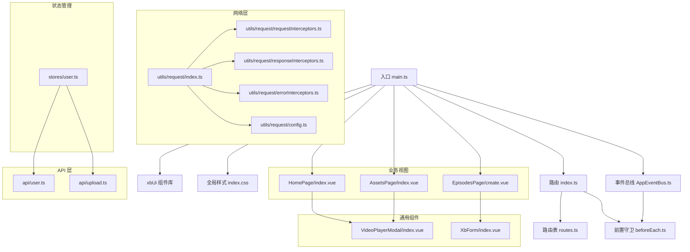
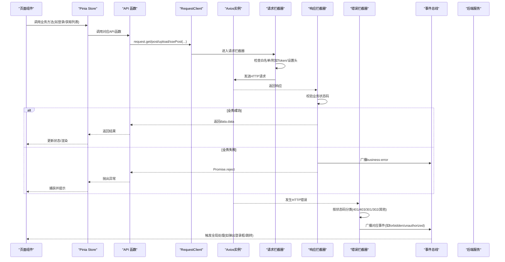
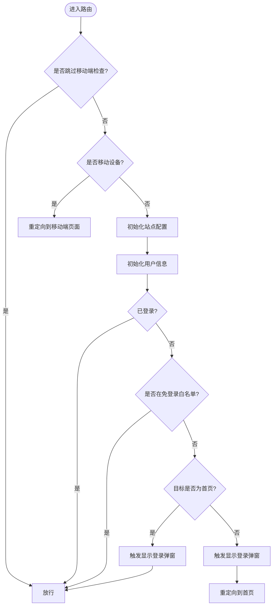
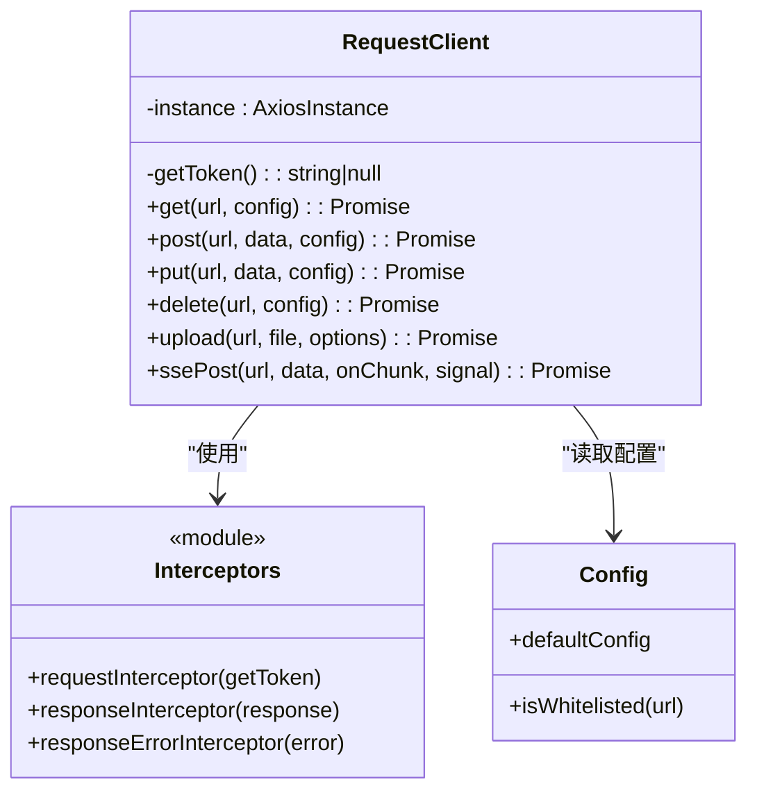
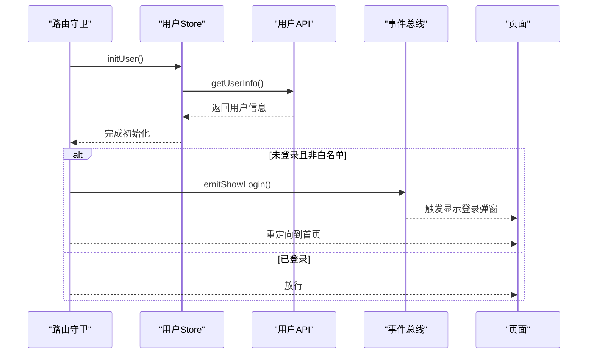
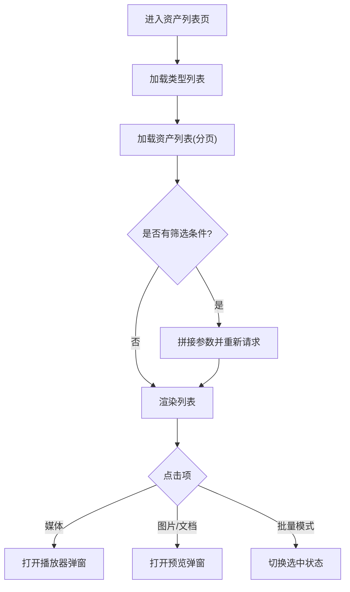
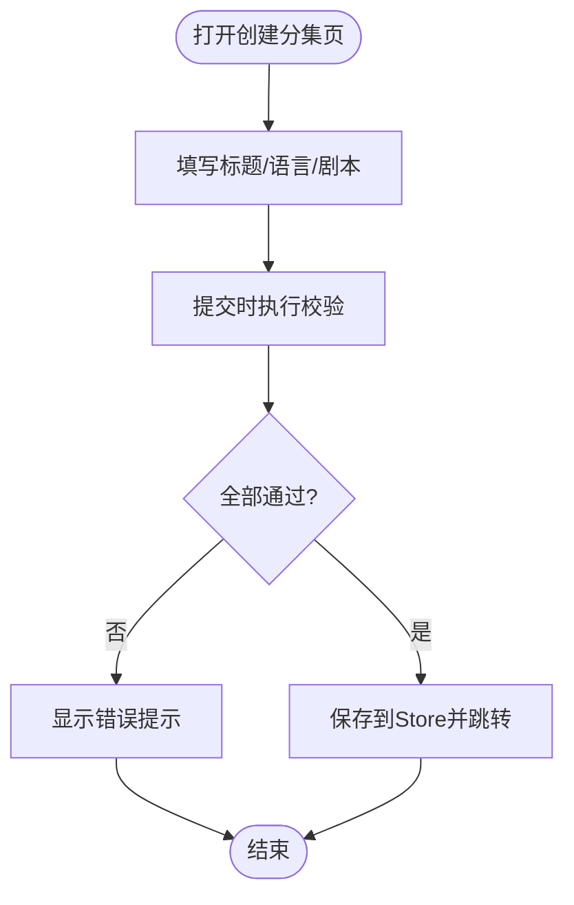
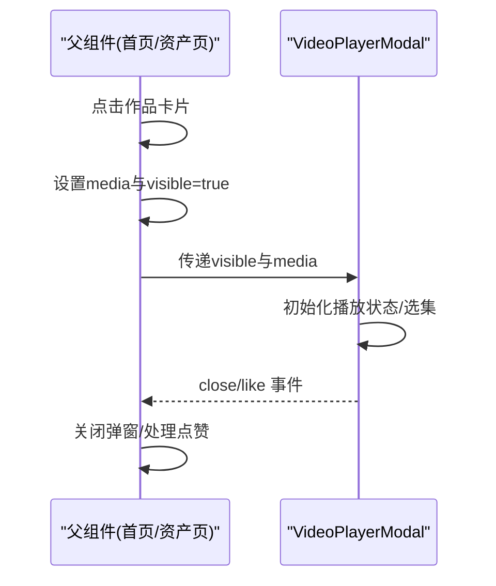
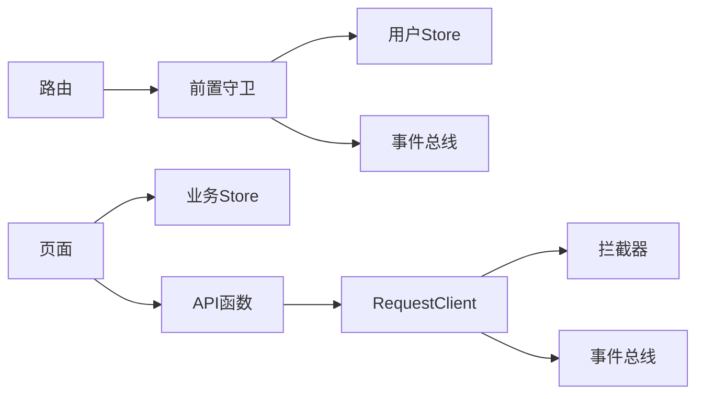

# 前端页面集成

<cite>
**本文引用的文件**   
- [main.ts](file://frontend/src/main.ts)
- [index.ts（路由）](file://frontend/src/router/index.ts)
- [routes.ts（路由表）](file://frontend/src/router/routes.ts)
- [beforeEach.ts（前置守卫）](file://frontend/src/router/guards/beforeEach.ts)
- [index.ts（请求客户端）](file://frontend/src/utils/request/index.ts)
- [config.ts（请求配置与白名单）](file://frontend/src/utils/request/config.ts)
- [requestInterceptors.ts（请求拦截器）](file://frontend/src/utils/request/requestInterceptors.ts)
- [responseInterceptors.ts（响应拦截器）](file://frontend/src/utils/request/responseInterceptors.ts)
- [errorInterceptors.ts（错误拦截器）](file://frontend/src/utils/request/errorInterceptors.ts)
- [AppEventBus.ts（应用事件总线）](file://frontend/src/events/AppEventBus.ts)
- [user.ts（用户状态管理）](file://frontend/src/stores/user.ts)
- [user.ts（用户API）](file://frontend/src/api/user.ts)
- [upload.ts（上传API）](file://frontend/src/api/upload.ts)
- [HomePage/index.vue（首页示例）](file://frontend/src/views/HomePage/index.vue)
- [VideoPlayerModal/index.vue（视频弹窗组件）](file://frontend/src/components/VideoPlayerModal/index.vue)
- [AssetsPage/index.vue（资产列表页）](file://frontend/src/views/AssetsPage/index.vue)
- [EpisodesPage/create.vue（创建分集表单页）](file://frontend/src/views/EpisodesPage/create.vue)
- [XbForm/index.vue（表单组件）](file://frontend/src\xbUi\XbForm\index.vue)
</cite>

## 目录
1. [简介](#简介)
2. [项目结构](#项目结构)
3. [核心组件](#核心组件)
4. [架构总览](#架构总览)
5. [详细组件分析](#详细组件分析)
6. [依赖关系分析](#依赖关系分析)
7. [性能考虑](#性能考虑)
8. [故障排查指南](#故障排查指南)
9. [结论](#结论)
10. [附录：集成清单与最佳实践](#附录集成清单与最佳实践)

## 简介
本指南面向插件开发者，系统化说明如何将插件的前端页面集成到现有系统中。内容涵盖：
- Vue 组件开发规范与复用机制
- API 调用封装与统一错误处理
- 路由注册方法与导航守卫
- 样式隔离策略
- 前后端数据交互模式、SSE 流式支持
- 状态管理方案（Pinia）
- 常见 UI 模式的完整示例：列表页、表单页、弹窗组件

## 项目结构
前端采用 Vue 3 + TypeScript + Vite 工程化方案，结合 Pinia 进行状态管理，Vue Router 进行路由控制，Axios 作为 HTTP 客户端，并内置统一的请求拦截与错误广播机制。UI 层基于自研 xbUi 组件库。

图表来源
- [main.ts:1-21](file://frontend/src/main.ts#L1-L21)
- [index.ts（路由）:1-15](file://frontend/src/router/index.ts#L1-L15)
- [routes.ts（路由表）:1-110](file://frontend/src/router/routes.ts#L1-L110)
- [beforeEach.ts（前置守卫）:1-54](file://frontend/src/router/guards/beforeEach.ts#L1-L54)
- [index.ts（请求客户端）:1-237](file://frontend/src/utils/request/index.ts#L1-L237)
- [config.ts（请求配置与白名单）:1-39](file://frontend/src/utils/request/config.ts#L1-L39)
- [requestInterceptors.ts（请求拦截器）:1-47](file://frontend/src/utils/request/requestInterceptors.ts#L1-L47)
- [responseInterceptors.ts（响应拦截器）:1-24](file://frontend/src/utils/request/responseInterceptors.ts#L1-L24)
- [errorInterceptors.ts（错误拦截器）:1-57](file://frontend/src/utils/request/errorInterceptors.ts#L1-L57)
- [AppEventBus.ts（应用事件总线）:1-109](file://frontend/src/events/AppEventBus.ts#L1-L109)
- [user.ts（用户状态管理）:1-327](file://frontend/src/stores/user.ts#L1-L327)
- [user.ts（用户API）:1-226](file://frontend/src/api/user.ts#L1-L226)
- [upload.ts（上传API）:1-24](file://frontend/src/api/upload.ts#L1-L24)
- [HomePage/index.vue（首页示例）:1-189](file://frontend/src/views/HomePage/index.vue#L1-L189)
- [VideoPlayerModal/index.vue（视频弹窗组件）:1-318](file://frontend/src/components/VideoPlayerModal/index.vue#L1-L318)
- [AssetsPage/index.vue（资产列表页）:1-473](file://frontend/src/views/AssetsPage/index.vue#L1-L473)
- [EpisodesPage/create.vue（创建分集表单页）:1-215](file://frontend/src/views/EpisodesPage/create.vue#L1-L215)
- [XbForm/index.vue（表单组件）:1-164](file://frontend/src\xbUi\XbForm\index.vue#L1-L164)

章节来源
- [main.ts:1-21](file://frontend/src/main.ts#L1-L21)
- [index.ts（路由）:1-15](file://frontend/src/router/index.ts#L1-L15)
- [routes.ts（路由表）:1-110](file://frontend/src/router/routes.ts#L1-L110)

## 核心组件
- 应用入口与插件装配
  - 初始化 Vue 应用、挂载 Pinia、Router、自定义 xbUi 组件库
  - 注册全局 HTTP 状态码事件处理器，统一触发登录弹窗等全局行为
- 路由系统
  - 使用 Hash 历史模式，集中定义路由表，按模块拆分 children
  - 前置守卫负责移动端跳转、站点配置初始化、用户信息初始化与鉴权
- 网络层
  - RequestClient 封装 Axios，提供 get/post/put/delete/upload/ssePost 等方法
  - 请求拦截器自动附加 Token、设置必要头；非白名单接口无 Token 直接拒绝
  - 响应拦截器统一校验业务状态码，失败时通过事件总线广播业务错误
  - 错误拦截器根据 HTTP 状态码分发不同事件（401/403/301/302/其他）
- 事件总线
  - AppEventBus 基于 window CustomEvent，提供 emit/on/off/once 及快捷方法
  - 与网络层联动，实现“显示登录弹窗”等跨模块通信
- 状态管理
  - user store 管理登录态、用户信息、绑定信息等，封装登录/登出/修改资料等动作
  - 在路由守卫中调用 initUser，保证刷新后状态恢复
- 典型页面与组件
  - 首页：组合多个子组件，演示弹窗播放、卡片交互
  - 资产列表页：展示列表/网格视图、筛选、分页、批量操作、预览与播放器弹窗
  - 创建分集表单页：表单输入、校验、保存与跳转
  - 视频弹窗组件：播放控制、选集切换、点赞、全屏等

章节来源
- [main.ts:1-21](file://frontend/src/main.ts#L1-L21)
- [index.ts（路由）:1-15](file://frontend/src/router/index.ts#L1-L15)
- [beforeEach.ts（前置守卫）:1-54](file://frontend/src/router/guards/beforeEach.ts#L1-L54)
- [index.ts（请求客户端）:1-237](file://frontend/src/utils/request/index.ts#L1-L237)
- [config.ts（请求配置与白名单）:1-39](file://frontend/src/utils/request/config.ts#L1-L39)
- [requestInterceptors.ts（请求拦截器）:1-47](file://frontend/src/utils/request/requestInterceptors.ts#L1-L47)
- [responseInterceptors.ts（响应拦截器）:1-24](file://frontend/src/utils/request/responseInterceptors.ts#L1-L24)
- [errorInterceptors.ts（错误拦截器）:1-57](file://frontend/src/utils/request/errorInterceptors.ts#L1-L57)
- [AppEventBus.ts（应用事件总线）:1-109](file://frontend/src/events/AppEventBus.ts#L1-L109)
- [user.ts（用户状态管理）:1-327](file://frontend/src/stores/user.ts#L1-L327)
- [HomePage/index.vue（首页示例）:1-189](file://frontend/src/views/HomePage/index.vue#L1-L189)
- [AssetsPage/index.vue（资产列表页）:1-473](file://frontend/src/views/AssetsPage/index.vue#L1-L473)
- [EpisodesPage/create.vue（创建分集表单页）:1-215](file://frontend/src/views/EpisodesPage/create.vue#L1-L215)
- [VideoPlayerModal/index.vue（视频弹窗组件）:1-318](file://frontend/src/components/VideoPlayerModal/index.vue#L1-L318)
- [XbForm/index.vue（表单组件）:1-164](file://frontend/src\xbUi\XbForm\index.vue#L1-L164)

## 架构总览
下图展示了从页面发起请求到后端返回的完整链路，以及错误与鉴权的统一处理流程。

图表来源
- [index.ts（请求客户端）:1-237](file://frontend/src/utils/request/index.ts#L1-L237)
- [requestInterceptors.ts（请求拦截器）:1-47](file://frontend/src/utils/request/requestInterceptors.ts#L1-L47)
- [responseInterceptors.ts（响应拦截器）:1-24](file://frontend/src/utils/request/responseInterceptors.ts#L1-L24)
- [errorInterceptors.ts（错误拦截器）:1-57](file://frontend/src/utils/request/errorInterceptors.ts#L1-L57)
- [AppEventBus.ts（应用事件总线）:1-109](file://frontend/src/events/AppEventBus.ts#L1-L109)
- [user.ts（用户状态管理）:1-327](file://frontend/src/stores/user.ts#L1-L327)
- [user.ts（用户API）:1-226](file://frontend/src/api/user.ts#L1-L226)

## 详细组件分析

### 路由与导航守卫
- 路由注册
  - 根路由下按功能划分 children，每个页面使用懒加载引入，减少首屏体积
  - meta 字段承载标题、步骤、是否隐藏导航等元信息
- 前置守卫
  - 移动端设备检测并强制跳转到移动端页面
  - 初始化站点配置与用户信息
  - 未登录时的访问策略：白名单放行、首页允许并弹出登录框、其他页面重定向至首页并弹出登录框

图表来源
- [beforeEach.ts（前置守卫）:1-54](file://frontend/src/router/guards/beforeEach.ts#L1-L54)
- [routes.ts（路由表）:1-110](file://frontend/src/router/routes.ts#L1-L110)

章节来源
- [index.ts（路由）:1-15](file://frontend/src/router/index.ts#L1-L15)
- [routes.ts（路由表）:1-110](file://frontend/src/router/routes.ts#L1-L110)
- [beforeEach.ts（前置守卫）:1-54](file://frontend/src/router/guards/beforeEach.ts#L1-L54)

### 网络层与 API 封装
- RequestClient
  - 构造时合并默认配置与传入配置，注入获取 Token 的函数
  - 统一拦截器：请求拦截器自动附加 Token 与必要头；响应拦截器校验业务状态码；错误拦截器按 HTTP 状态码广播事件
  - 提供 upload 方法支持进度回调与取消控制器；ssePost 方法用于服务端推送流式响应
- 白名单机制
  - 通过配置文件与 JSON 白名单，判断是否需要鉴权
- API 层
  - 将具体接口地址与方法封装为函数，供 Store 或页面调用
  - 类型定义清晰，便于 TS 推导

图表来源
- [index.ts（请求客户端）:1-237](file://frontend/src/utils/request/index.ts#L1-L237)
- [requestInterceptors.ts（请求拦截器）:1-47](file://frontend/src/utils/request/requestInterceptors.ts#L1-L47)
- [responseInterceptors.ts（响应拦截器）:1-24](file://frontend/src/utils/request/responseInterceptors.ts#L1-L24)
- [errorInterceptors.ts（错误拦截器）:1-57](file://frontend/src/utils/request/errorInterceptors.ts#L1-L57)
- [config.ts（请求配置与白名单）:1-39](file://frontend/src/utils/request/config.ts#L1-L39)

章节来源
- [index.ts（请求客户端）:1-237](file://frontend/src/utils/request/index.ts#L1-L237)
- [config.ts（请求配置与白名单）:1-39](file://frontend/src/utils/request/config.ts#L1-L39)
- [requestInterceptors.ts（请求拦截器）:1-47](file://frontend/src/utils/request/requestInterceptors.ts#L1-L47)
- [responseInterceptors.ts（响应拦截器）:1-24](file://frontend/src/utils/request/responseInterceptors.ts#L1-L24)
- [errorInterceptors.ts（错误拦截器）:1-57](file://frontend/src/utils/request/errorInterceptors.ts#L1-L57)
- [user.ts（用户API）:1-226](file://frontend/src/api/user.ts#L1-L226)
- [upload.ts（上传API）:1-24](file://frontend/src/api/upload.ts#L1-L24)

### 状态管理与鉴权流程
- 用户状态
  - 维护 isLoggedIn、userInfo、绑定状态等
  - 提供 loginAction/mobileLoginAction/emailLoginAction/logoutAction 等方法
  - 登录成功后持久化 token 并拉取用户信息；登出时清理本地状态
- 路由守卫联动
  - 在 beforeEach 中调用 initUser，确保刷新后恢复登录态
  - 未登录时触发 app:show-login 事件，由上层监听并弹出登录弹窗

图表来源
- [beforeEach.ts（前置守卫）:1-54](file://frontend/src/router/guards/beforeEach.ts#L1-L54)
- [user.ts（用户状态管理）:1-327](file://frontend/src/stores/user.ts#L1-L327)
- [user.ts（用户API）:1-226](file://frontend/src/api/user.ts#L1-L226)
- [AppEventBus.ts（应用事件总线）:1-109](file://frontend/src/events/AppEventBus.ts#L1-L109)

章节来源
- [user.ts（用户状态管理）:1-327](file://frontend/src/stores/user.ts#L1-L327)
- [beforeEach.ts（前置守卫）:1-54](file://frontend/src/router/guards/beforeEach.ts#L1-L54)
- [AppEventBus.ts（应用事件总线）:1-109](file://frontend/src/events/AppEventBus.ts#L1-L109)

### 列表页面集成示例（资产列表）
- 数据获取与映射
  - 调用 API 获取分页数据，将后端类型映射为前端类型
  - 支持按类型、标签、关键词筛选，前端二次过滤
- 交互与弹窗
  - 网格/列表视图切换、批量选择与删除
  - 媒体资源点击打开音频/视频播放器弹窗；其余资源打开预览弹窗
- 状态与错误
  - loading/error 状态管理，空状态兜底
  - 分页控件与页码跳转

图表来源
- [AssetsPage/index.vue（资产列表页）:1-473](file://frontend/src/views/AssetsPage/index.vue#L1-L473)
- [VideoPlayerModal/index.vue（视频弹窗组件）:1-318](file://frontend/src/components/VideoPlayerModal/index.vue#L1-L318)

章节来源
- [AssetsPage/index.vue（资产列表页）:1-473](file://frontend/src/views/AssetsPage/index.vue#L1-L473)
- [VideoPlayerModal/index.vue（视频弹窗组件）:1-318](file://frontend/src/components/VideoPlayerModal/index.vue#L1-L318)

### 表单页面集成示例（创建分集）
- 表单结构与校验
  - 使用 XbForm 提供上下文，子项通过 provide/inject 注册字段
  - 支持必填、长度、正则与自定义异步校验
- 业务逻辑
  - 保存前执行校验，成功后写入 Store 并跳转下一步
  - 导入剧本文件、智能扩写等增强体验

图表来源
- [EpisodesPage/create.vue（创建分集表单页）:1-215](file://frontend/src/views/EpisodesPage/create.vue#L1-L215)
- [XbForm/index.vue（表单组件）:1-164](file://frontend/src\xbUi\XbForm\index.vue#L1-L164)

章节来源
- [EpisodesPage/create.vue（创建分集表单页）:1-215](file://frontend/src/views/EpisodesPage/create.vue#L1-L215)
- [XbForm/index.vue（表单组件）:1-164](file://frontend/src\xbUi\XbForm\index.vue#L1-L164)

### 弹窗组件集成示例（视频播放器）
- 组件职责
  - 接收 visible/media 属性，内部维护播放状态、时间轴、音量、全屏等
  - 支持多集切换、点赞、详情面板展示
- 父级集成
  - 父组件持有弹窗可见性与媒体信息，点击卡片时填充并显示弹窗
  - 关闭弹窗时重置播放状态

图表来源
- [HomePage/index.vue（首页示例）:1-189](file://frontend/src/views/HomePage/index.vue#L1-L189)
- [AssetsPage/index.vue（资产列表页）:1-473](file://frontend/src/views/AssetsPage/index.vue#L1-L473)
- [VideoPlayerModal/index.vue（视频弹窗组件）:1-318](file://frontend/src/components/VideoPlayerModal/index.vue#L1-L318)

章节来源
- [HomePage/index.vue（首页示例）:1-189](file://frontend/src/views/HomePage/index.vue#L1-L189)
- [AssetsPage/index.vue（资产列表页）:1-473](file://frontend/src/views/AssetsPage/index.vue#L1-L473)
- [VideoPlayerModal/index.vue（视频弹窗组件）:1-318](file://frontend/src/components/VideoPlayerModal/index.vue#L1-L318)

## 依赖关系分析
- 低耦合高内聚
  - 网络层独立于业务，API 层仅做地址与方法封装，业务逻辑集中在 Store 与页面
  - 事件总线解耦了鉴权、错误提示等横切关注点
- 关键依赖链
  - 路由守卫依赖用户 Store 与事件总线
  - 页面依赖 API 与 Store，必要时直接使用 RequestClient 的高级能力（如 SSE）
  - 组件通过 props/emits 与父级通信，避免深层嵌套依赖

图表来源
- [index.ts（路由）:1-15](file://frontend/src/router/index.ts#L1-L15)
- [beforeEach.ts（前置守卫）:1-54](file://frontend/src/router/guards/beforeEach.ts#L1-L54)
- [user.ts（用户状态管理）:1-327](file://frontend/src/stores/user.ts#L1-L327)
- [index.ts（请求客户端）:1-237](file://frontend/src/utils/request/index.ts#L1-L237)
- [AppEventBus.ts（应用事件总线）:1-109](file://frontend/src/events/AppEventBus.ts#L1-L109)

章节来源
- [index.ts（路由）:1-15](file://frontend/src/router/index.ts#L1-L15)
- [beforeEach.ts（前置守卫）:1-54](file://frontend/src/router/guards/beforeEach.ts#L1-L54)
- [index.ts（请求客户端）:1-237](file://frontend/src/utils/request/index.ts#L1-L237)
- [AppEventBus.ts（应用事件总线）:1-109](file://frontend/src/events/AppEventBus.ts#L1-L109)

## 性能考虑
- 路由懒加载：所有页面按需引入，降低首屏包体
- 列表分页：服务端分页配合前端缓存，避免重复请求
- 上传优化：支持进度回调与取消控制器，提升大文件体验
- SSE 流式：使用 XMLHttpRequest 解析事件流，避免 CORS 问题，适合长耗时任务
- 组件复用：通用弹窗与表单组件减少重复代码，提高可维护性

[本节为通用指导，无需源码引用]

## 故障排查指南
- 登录过期/权限不足
  - 现象：请求被拒绝或触发全局登录弹窗
  - 定位：检查请求拦截器是否附加 Token、白名单是否正确、用户 Store 是否初始化
- 业务错误
  - 现象：统一提示“请求失败”，但无具体原因
  - 定位：查看响应拦截器对业务状态码的处理，确认后端返回格式
- 网络错误
  - 现象：401/403/301/302 等
  - 定位：错误拦截器会广播对应事件，可在应用层监听并给出友好提示或跳转
- 上传失败
  - 现象：上传无进度或中断
  - 定位：检查 FormData 字段名、额外字段、AbortController 使用是否正确

章节来源
- [requestInterceptors.ts（请求拦截器）:1-47](file://frontend/src/utils/request/requestInterceptors.ts#L1-L47)
- [responseInterceptors.ts（响应拦截器）:1-24](file://frontend/src/utils/request/responseInterceptors.ts#L1-L24)
- [errorInterceptors.ts（错误拦截器）:1-57](file://frontend/src/utils/request/errorInterceptors.ts#L1-L57)
- [index.ts（请求客户端）:1-237](file://frontend/src/utils/request/index.ts#L1-L237)

## 结论
通过将路由、网络层、事件总线与状态管理解耦，本项目形成了可扩展、易维护的前端集成体系。插件开发者只需遵循以下要点即可快速接入：
- 新增页面：在路由表中注册，按需懒加载
- 调用接口：优先使用 API 层函数，复杂场景可直接使用 RequestClient
- 状态管理：将共享状态放入 Pinia Store，并在路由守卫中初始化
- 样式隔离：使用 scoped 样式与组件命名空间，避免全局污染
- 错误与鉴权：利用事件总线统一处理，保持用户体验一致

[本节为总结，无需源码引用]

## 附录：集成清单与最佳实践
- 新增页面
  - 在 routes.ts 中添加路由，meta 标注标题与步骤
  - 在 beforeEach 中如需特殊逻辑，扩展守卫
- 新增 API
  - 在 api 目录下新建模块，封装请求方法与类型
  - 在 Store 或页面中调用，统一错误处理
- 新增组件
  - 使用 xbUi 基础组件构建，props/emits 明确契约
  - 弹窗类组件建议置于 components 目录，并提供类型定义
- 样式隔离
  - 使用 scoped 样式与 Tailwind 类名，避免全局冲突
  - 主题变量通过 CSS 变量统一管理
- 鉴权与错误
  - 白名单接口在 white.json 中声明
  - 监听 app:show-login 事件以弹出登录弹窗
- 上传与流式
  - 上传使用 request.upload，支持进度与取消
  - 流式输出使用 ssePost，注意处理 [DONE] 与缓冲区

[本节为通用指导，无需源码引用]