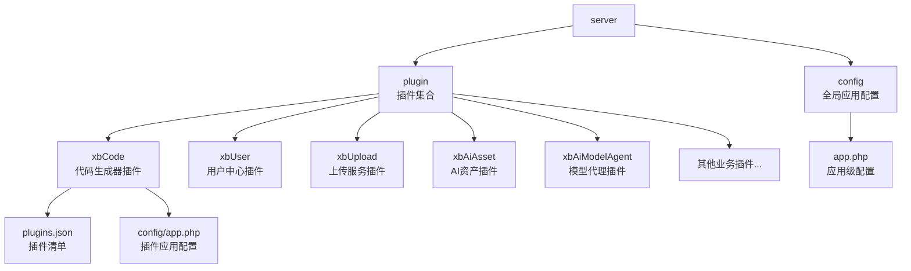
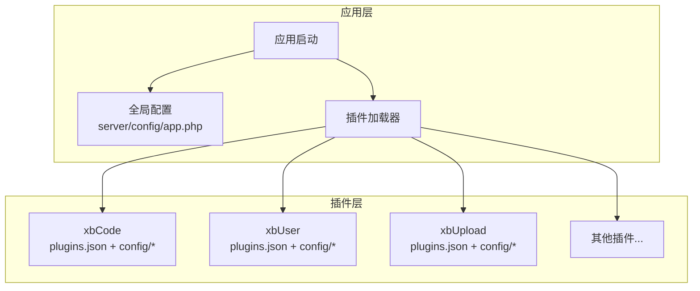
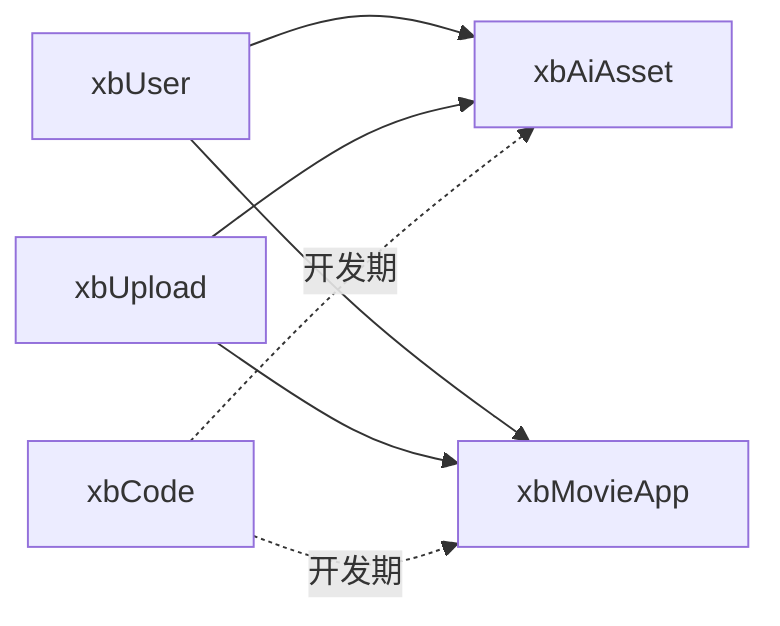

# 插件基础开发

<cite>
**本文引用的文件**
- [server/config/app.php](file://server/config/app.php)
- [server/plugin/xbCode/plugins.json](file://server/plugin/xbCode/plugins.json)
- [server/plugin/xbCode/config/app.php](file://server/plugin/xbCode/config/app.php)
- [server/plugin/xbUser/plugins.json](file://server/plugin/xbUser/plugins.json)
- [server/plugin/xbUser/config/app.php](file://server/plugin/xbUser/config/app.php)
- [server/plugin/xbUpload/plugins.json](file://server/plugin/xbUpload/plugins.json)
- [server/plugin/xbUpload/config/app.php](file://server/plugin/xbUpload/config/app.php)
- [server/plugin/xbAiAsset/plugins.json](file://server/plugin/xbAiAsset/plugins.json)
- [server/plugin/xbAiModelAgent/plugins.json](file://server/plugin/xbAiModelAgent/plugins.json)
- [server/plugin/xbCdKey/plugins.json](file://server/plugin/xbCdKey/plugins.json)
- [server/plugin/xbCoupon/plugins.json](file://server/plugin/xbCoupon/plugins.json)
- [server/plugin/xbCrontab/plugins.json](file://server/plugin/xbCrontab/plugins.json)
- [server/plugin/xbDevDoc/plugins.json](file://server/plugin/xbDevDoc/plugins.json)
- [server/plugin/xbEmail/plugins.json](file://server/plugin/xbEmail/plugins.json)
- [server/plugin/xbHelp/plugins.json](file://server/plugin/xbHelp/plugins.json)
- [server/plugin/xbMailqq/plugins.json](file://server/plugin/xbMailqq/plugins.json)
- [server/plugin/xbMovieApp/plugins.json](file://server/plugin/xbMovieApp/plugins.json)
- [server/plugin/xbPromptTemplate/plugins.json](file://server/plugin/xbPromptTemplate/plugins.json)
- [server/plugin/xbSms/plugins.json](file://server/plugin/xbSms/plugins.json)
- [server/plugin/xbSmsAliyun/plugins.json](file://server/plugin/xbSmsAliyun/plugins.json)
- [server/plugin/xbSmsBao/plugins.json](file://server/plugin/xbSmsBao/plugins.json)
- [server/plugin/xbSmsTencent/plugins.json](file://server/plugin/xbSmsTencent/plugins.json)
- [server/plugin/xbUploadCos/plugins.json](file://server/plugin/xbUploadCos/plugins.json)
- [server/plugin/xbUploadOss/plugins.json](file://server/plugin/xbUploadOss/plugins.json)
- [server/plugin/xbUploadQiniu/plugins.json](file://server/plugin/xbUploadQiniu/plugins.json)
- [server/plugin/xbUserWork/plugins.json](file://server/plugin/xbUserWork/plugins.json)
- [server/plugin/xbWebMessage/plugins.json](file://server/plugin/xbWebMessage/plugins.json)
</cite>

## 目录
1. [简介](#简介)
2. [项目结构](#项目结构)
3. [核心组件](#核心组件)
4. [架构总览](#架构总览)
5. [详细组件分析](#详细组件分析)
6. [依赖分析](#依赖分析)
7. [性能考虑](#性能考虑)
8. [故障排查指南](#故障排查指南)
9. [结论](#结论)
10. [附录](#附录)

## 简介
本章节面向首次接触该项目的开发者，系统阐述“插件基础开发”的核心概念与规范。内容涵盖：
- 插件的基本概念与职责边界
- 插件目录结构与命名约定
- plugins.json 配置项详解（元数据、依赖、版本等）
- 应用配置 app.php 的编写方法与最佳实践
- 使用插件初始化命令快速搭建插件框架的流程说明
- 常见插件目录与文件的用途与组织方式

## 项目结构
仓库采用前后端分离结构，后端位于 server 目录，插件统一放置在 server/plugin 下，每个插件以独立子目录形式存在，并遵循统一的目录与配置文件约定。

图表来源
- [server/config/app.php:1-13](file://server/config/app.php#L1-L13)
- [server/plugin/xbCode/plugins.json](file://server/plugin/xbCode/plugins.json)
- [server/plugin/xbCode/config/app.php](file://server/plugin/xbCode/config/app.php)

章节来源
- [server/config/app.php:1-13](file://server/config/app.php#L1-L13)

## 核心组件
本节聚焦插件体系中的两个关键配置：
- plugins.json：描述插件元数据、依赖关系、版本约束、安装脚本入口等
- config/app.php：插件自身的应用级配置，覆盖或补充全局配置

### plugins.json 配置要点
- 元数据字段：用于标识插件名称、标题、描述、作者、许可证、图标等
- 依赖声明：通过依赖键列出所需的其他插件或扩展，支持版本范围
- 版本管理：定义当前插件版本，便于升级与兼容性检查
- 安装与更新：可指定安装脚本路径，用于建表、初始化数据等
- 路由与中间件：可声明插件提供的路由前缀、中间件列表等
- 资源与静态文件：声明 public 目录映射、前端资源打包产物位置等

注意：不同插件的 plugins.json 可能包含略有差异的字段，但上述为通用核心字段集合。

章节来源
- [server/plugin/xbCode/plugins.json](file://server/plugin/xbCode/plugins.json)
- [server/plugin/xbUser/plugins.json](file://server/plugin/xbUser/plugins.json)
- [server/plugin/xbUpload/plugins.json](file://server/plugin/xbUpload/plugins.json)
- [server/plugin/xbAiAsset/plugins.json](file://server/plugin/xbAiAsset/plugins.json)
- [server/plugin/xbAiModelAgent/plugins.json](file://server/plugin/xbAiModelAgent/plugins.json)
- [server/plugin/xbCdKey/plugins.json](file://server/plugin/xbCdKey/plugins.json)
- [server/plugin/xbCoupon/plugins.json](file://server/plugin/xbCoupon/plugins.json)
- [server/plugin/xbCrontab/plugins.json](file://server/plugin/xbCrontab/plugins.json)
- [server/plugin/xbDevDoc/plugins.json](file://server/plugin/xbDevDoc/plugins.json)
- [server/plugin/xbEmail/plugins.json](file://server/plugin/xbEmail/plugins.json)
- [server/plugin/xbHelp/plugins.json](file://server/plugin/xbHelp/plugins.json)
- [server/plugin/xbMailqq/plugins.json](file://server/plugin/xbMailqq/plugins.json)
- [server/plugin/xbMovieApp/plugins.json](file://server/plugin/xbMovieApp/plugins.json)
- [server/plugin/xbPromptTemplate/plugins.json](file://server/plugin/xbPromptTemplate/plugins.json)
- [server/plugin/xbSms/plugins.json](file://server/plugin/xbSms/plugins.json)
- [server/plugin/xbSmsAliyun/plugins.json](file://server/plugin/xbSmsAliyun/plugins.json)
- [server/plugin/xbSmsBao/plugins.json](file://server/plugin/xbSmsBao/plugins.json)
- [server/plugin/xbSmsTencent/plugins.json](file://server/plugin/xbSmsTencent/plugins.json)
- [server/plugin/xbUploadCos/plugins.json](file://server/plugin/xbUploadCos/plugins.json)
- [server/plugin/xbUploadOss/plugins.json](file://server/plugin/xbUploadOss/plugins.json)
- [server/plugin/xbUploadQiniu/plugins.json](file://server/plugin/xbUploadQiniu/plugins.json)
- [server/plugin/xbUserWork/plugins.json](file://server/plugin/xbUserWork/plugins.json)
- [server/plugin/xbWebMessage/plugins.json](file://server/plugin/xbWebMessage/plugins.json)

### 插件应用配置 app.php
每个插件通常提供自己的 config/app.php，用于：
- 覆盖或补充全局 app.php 的配置项
- 定义插件专属的路由、中间件、进程、队列、视图、翻译等
- 暴露插件开关、调试模式、时区、控制器后缀等运行时参数

章节来源
- [server/plugin/xbCode/config/app.php](file://server/plugin/xbCode/config/app.php)
- [server/plugin/xbUser/config/app.php](file://server/plugin/xbUser/config/app.php)
- [server/plugin/xbUpload/config/app.php](file://server/plugin/xbUpload/config/app.php)

## 架构总览
下图展示了插件在整体系统中的加载与运行流程概览：应用启动后读取全局配置，扫描 plugin 目录下的各插件，解析其 plugins.json 完成注册与依赖校验，随后加载插件的 config/* 配置，最终将插件的路由、中间件、进程等注入到运行期。

图表来源
- [server/config/app.php:1-13](file://server/config/app.php#L1-L13)
- [server/plugin/xbCode/plugins.json](file://server/plugin/xbCode/plugins.json)
- [server/plugin/xbUser/plugins.json](file://server/plugin/xbUser/plugins.json)
- [server/plugin/xbUpload/plugins.json](file://server/plugin/xbUpload/plugins.json)

## 详细组件分析

### 插件目录结构规范
一个标准的插件目录通常包含以下子目录与文件：
- api：对外接口控制器或 API 实现
- app：业务逻辑、模型、队列任务、后台模块等
- base：公共基类、Trait、常量等
- bootstrap：插件启动引导脚本
- builder：代码生成器相关模板与构建逻辑
- command：命令行工具
- config：插件配置（含 app.php、autoload.php、route.php、middleware.php 等）
- data：静态数据、字典、种子数据
- enum：枚举类型
- event：事件定义与监听
- exception：异常处理
- process：常驻进程（如队列消费者、定时任务）
- public：静态资源（图片、JS、CSS）
- service：服务层封装
- setting：后台设置界面与配置项
- skills：技能或工作流定义
- trait：复用行为片段
- utils：工具函数库
- install.sql / update.sql：数据库安装与升级脚本
- plugins.json：插件清单与元数据
- README.md：使用说明

建议：
- 保持目录职责单一，避免跨目录强耦合
- 将可复用的能力下沉至 base、trait、utils、service
- 通过 config/* 集中管理插件配置，避免硬编码

章节来源
- [server/plugin/xbCode/plugins.json](file://server/plugin/xbCode/plugins.json)
- [server/plugin/xbUser/plugins.json](file://server/plugin/xbUser/plugins.json)
- [server/plugin/xbUpload/plugins.json](file://server/plugin/xbUpload/plugins.json)
- [server/plugin/xbAiAsset/plugins.json](file://server/plugin/xbAiAsset/plugins.json)
- [server/plugin/xbAiModelAgent/plugins.json](file://server/plugin/xbAiModelAgent/plugins.json)

### plugins.json 配置详解
- 元数据
  - 名称、标题、描述、作者、许可证、图标、文档链接等
- 依赖
  - 依赖的插件名及版本范围
  - 可选依赖与强制依赖的区分
- 版本
  - 当前版本号，语义化版本控制
- 安装与更新
  - 安装脚本路径（install.sql、update.sql）
  - 自定义安装/更新回调方法
- 路由与中间件
  - 路由前缀、分组、命名空间
  - 中间件列表与作用域
- 资源与静态文件
  - public 目录映射
  - 前端资源包输出路径
- 进程与队列
  - 常驻进程定义（process）
  - 队列消费器（queue consumer）
- 事件与监听
  - 事件注册与监听器绑定
- 国际化与视图
  - 翻译文件路径
  - 视图目录映射

章节来源
- [server/plugin/xbCode/plugins.json](file://server/plugin/xbCode/plugins.json)
- [server/plugin/xbUser/plugins.json](file://server/plugin/xbUser/plugins.json)
- [server/plugin/xbUpload/plugins.json](file://server/plugin/xbUpload/plugins.json)
- [server/plugin/xbAiAsset/plugins.json](file://server/plugin/xbAiAsset/plugins.json)
- [server/plugin/xbAiModelAgent/plugins.json](file://server/plugin/xbAiModelAgent/plugins.json)
- [server/plugin/xbCdKey/plugins.json](file://server/plugin/xbCdKey/plugins.json)
- [server/plugin/xbCoupon/plugins.json](file://server/plugin/xbCoupon/plugins.json)
- [server/plugin/xbCrontab/plugins.json](file://server/plugin/xbCrontab/plugins.json)
- [server/plugin/xbDevDoc/plugins.json](file://server/plugin/xbDevDoc/plugins.json)
- [server/plugin/xbEmail/plugins.json](file://server/plugin/xbEmail/plugins.json)
- [server/plugin/xbHelp/plugins.json](file://server/plugin/xbHelp/plugins.json)
- [server/plugin/xbMailqq/plugins.json](file://server/plugin/xbMailqq/plugins.json)
- [server/plugin/xbMovieApp/plugins.json](file://server/plugin/xbMovieApp/plugins.json)
- [server/plugin/xbPromptTemplate/plugins.json](file://server/plugin/xbPromptTemplate/plugins.json)
- [server/plugin/xbSms/plugins.json](file://server/plugin/xbSms/plugins.json)
- [server/plugin/xbSmsAliyun/plugins.json](file://server/plugin/xbSmsAliyun/plugins.json)
- [server/plugin/xbSmsBao/plugins.json](file://server/plugin/xbSmsBao/plugins.json)
- [server/plugin/xbSmsTencent/plugins.json](file://server/plugin/xbSmsTencent/plugins.json)
- [server/plugin/xbUploadCos/plugins.json](file://server/plugin/xbUploadCos/plugins.json)
- [server/plugin/xbUploadOss/plugins.json](file://server/plugin/xbUploadOss/plugins.json)
- [server/plugin/xbUploadQiniu/plugins.json](file://server/plugin/xbUploadQiniu/plugins.json)
- [server/plugin/xbUserWork/plugins.json](file://server/plugin/xbUserWork/plugins.json)
- [server/plugin/xbWebMessage/plugins.json](file://server/plugin/xbWebMessage/plugins.json)

### 应用配置 app.php 编写方法
- 全局 app.php 的作用
  - 定义应用级默认配置（调试、时区、控制器后缀、路径等）
- 插件 app.php 的职责
  - 覆盖或补充全局配置
  - 声明插件专属的路由、中间件、进程、队列、视图、翻译等
- 常用配置项
  - debug：是否开启调试模式
  - default_timezone：默认时区
  - controller_suffix：控制器类后缀
  - public_path：静态资源根目录
  - runtime_path：运行时目录
  - request_class：请求类绑定
  - controller_reuse：控制器实例复用策略

章节来源
- [server/config/app.php:1-13](file://server/config/app.php#L1-L13)
- [server/plugin/xbCode/config/app.php](file://server/plugin/xbCode/config/app.php)
- [server/plugin/xbUser/config/app.php](file://server/plugin/xbUser/config/app.php)
- [server/plugin/xbUpload/config/app.php](file://server/plugin/xbUpload/config/app.php)

### 插件初始化命令与快速搭建
- 目标
  - 通过命令快速生成标准插件骨架，包括 plugins.json、config/*、api、app、public、data、enum 等目录与基础文件
- 典型步骤
  - 执行初始化命令，传入插件名与必要元数据
  - 自动生成插件目录结构与基础配置文件
  - 根据依赖自动填充 plugins.json 的依赖声明
  - 生成 install.sql 与 update.sql 模板
  - 生成路由、中间件、进程、队列等示例配置
- 注意事项
  - 确保插件名符合命名规范，避免冲突
  - 合理划分依赖，避免循环依赖
  - 在 plugins.json 中明确版本约束，便于升级

章节来源
- [server/plugin/xbCode/plugins.json](file://server/plugin/xbCode/plugins.json)
- [server/plugin/xbDeveloper/plugins.json](file://server/plugin/xbDeveloper/plugins.json)

### 插件生命周期与数据迁移
- 安装阶段
  - 执行 install.sql 创建表结构与初始数据
  - 调用安装回调进行额外初始化（如缓存预热、索引优化）
- 升级阶段
  - 按版本顺序执行 update.sql 或升级回调
  - 兼容旧数据结构，保证平滑升级
- 卸载阶段
  - 清理数据、删除表、释放资源
  - 移除路由、中间件、进程等注册信息

章节来源
- [server/plugin/xbCode/plugins.json](file://server/plugin/xbCode/plugins.json)
- [server/plugin/xbUser/plugins.json](file://server/plugin/xbUser/plugins.json)
- [server/plugin/xbUpload/plugins.json](file://server/plugin/xbUpload/plugins.json)

## 依赖分析
插件之间可能存在依赖关系，例如：
- xbUser 作为基础能力被多个业务插件依赖
- xbUpload 作为存储抽象被 xbAiAsset、xbMovieApp 等使用
- xbCode 作为开发工具被其他插件在开发期引用

图表来源
- [server/plugin/xbUser/plugins.json](file://server/plugin/xbUser/plugins.json)
- [server/plugin/xbUpload/plugins.json](file://server/plugin/xbUpload/plugins.json)
- [server/plugin/xbAiAsset/plugins.json](file://server/plugin/xbAiAsset/plugins.json)
- [server/plugin/xbMovieApp/plugins.json](file://server/plugin/xbMovieApp/plugins.json)
- [server/plugin/xbCode/plugins.json](file://server/plugin/xbCode/plugins.json)

章节来源
- [server/plugin/xbUser/plugins.json](file://server/plugin/xbUser/plugins.json)
- [server/plugin/xbUpload/plugins.json](file://server/plugin/xbUpload/plugins.json)
- [server/plugin/xbAiAsset/plugins.json](file://server/plugin/xbAiAsset/plugins.json)
- [server/plugin/xbMovieApp/plugins.json](file://server/plugin/xbMovieApp/plugins.json)
- [server/plugin/xbCode/plugins.json](file://server/plugin/xbCode/plugins.json)

## 性能考虑
- 按需加载：仅在需要时加载插件配置与路由，减少启动开销
- 静态资源合并：对插件 public 资源进行合并与压缩，减少请求数
- 数据库连接池：合理配置连接池大小，避免高并发下连接耗尽
- 缓存策略：对热点数据启用缓存，降低数据库压力
- 进程隔离：将耗时任务放入独立进程或队列，避免阻塞主线程

## 故障排查指南
- 插件未生效
  - 检查 plugins.json 是否完整且语法正确
  - 确认依赖是否满足，是否存在版本冲突
  - 查看插件配置是否覆盖错误的全局配置
- 路由不可访问
  - 核对路由前缀与命名空间是否正确
  - 检查中间件是否拦截了请求
- 静态资源 404
  - 确认 public 目录映射是否正确
  - 检查 Web 服务器静态资源根路径
- 数据库迁移失败
  - 检查 install.sql/update.sql 语法与权限
  - 确认数据库连接配置与时区设置

章节来源
- [server/config/app.php:1-13](file://server/config/app.php#L1-L13)
- [server/plugin/xbCode/plugins.json](file://server/plugin/xbCode/plugins.json)
- [server/plugin/xbUser/plugins.json](file://server/plugin/xbUser/plugins.json)
- [server/plugin/xbUpload/plugins.json](file://server/plugin/xbUpload/plugins.json)

## 结论
通过统一的插件目录结构、规范的 plugins.json 配置与清晰的 app.php 配置分层，项目实现了良好的可扩展性与可维护性。建议在开发新插件时严格遵循本文档的结构与最佳实践，并在发布前进行依赖与兼容性验证，以确保系统的稳定运行。

## 附录
- 插件清单参考
  - 代码生成器：server/plugin/xbCode/plugins.json
  - 用户中心：server/plugin/xbUser/plugins.json
  - 上传服务：server/plugin/xbUpload/plugins.json
  - AI 资产：server/plugin/xbAiAsset/plugins.json
  - 模型代理：server/plugin/xbAiModelAgent/plugins.json
  - 短信服务：server/plugin/xbSms/plugins.json
  - 邮件服务：server/plugin/xbEmail/plugins.json
  - 帮助中心：server/plugin/xbHelp/plugins.json
  - 优惠券：server/plugin/xbCoupon/plugins.json
  - 定时任务：server/plugin/xbCrontab/plugins.json
  - 开发文档：server/plugin/xbDevDoc/plugins.json
  - 码密钥：server/plugin/xbCdKey/plugins.json
  - 电影应用：server/plugin/xbMovieApp/plugins.json
  - 提示词模板：server/plugin/xbPromptTemplate/plugins.json
  - 用户作品：server/plugin/xbUserWork/plugins.json
  - 网页消息：server/plugin/xbWebMessage/plugins.json
  - 阿里云短信：server/plugin/xbSmsAliyun/plugins.json
  - 宝塔短信：server/plugin/xbSmsBao/plugins.json
  - 腾讯云短信：server/plugin/xbSmsTencent/plugins.json
  - 对象存储 COS：server/plugin/xbUploadCos/plugins.json
  - 对象存储 OSS：server/plugin/xbUploadOss/plugins.json
  - 七牛云存储：server/plugin/xbUploadQiniu/plugins.json
  - 邮箱 QQ：server/plugin/xbMailqq/plugins.json