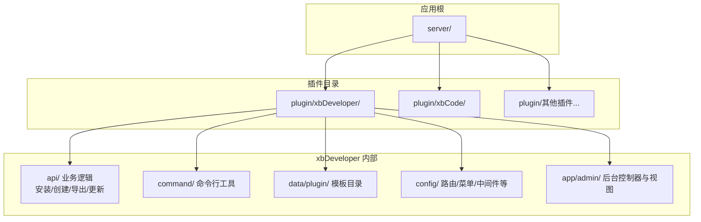
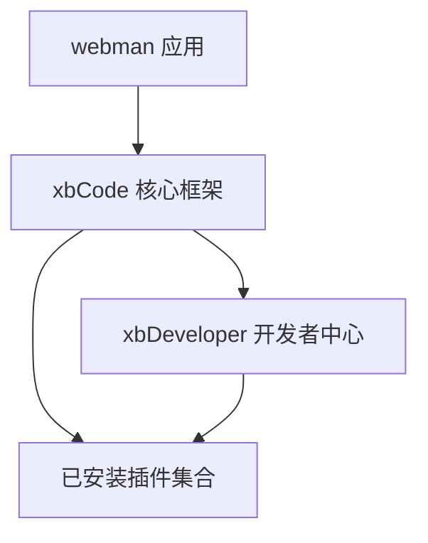
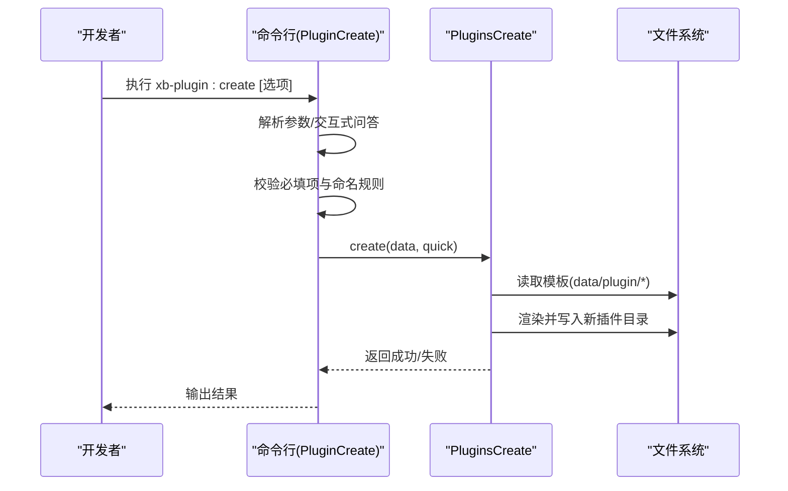
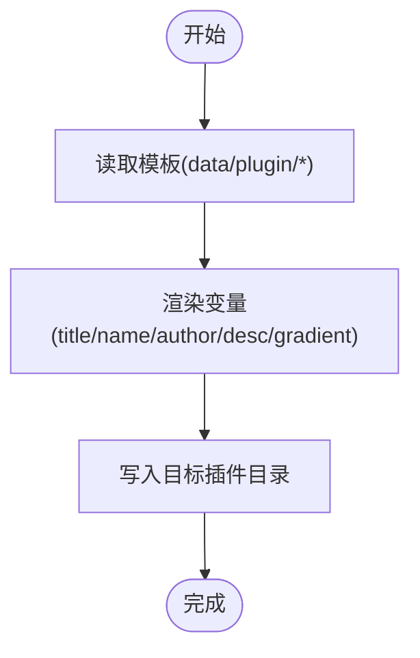
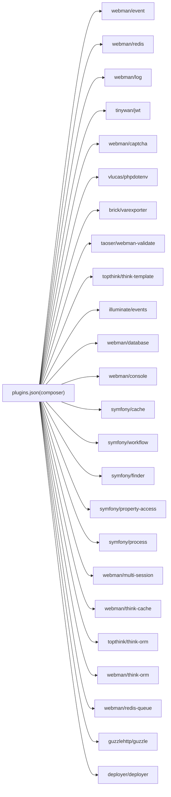

# 插件开发指南

<cite>
**本文引用的文件**   
- [server/plugin/xbDeveloper/README.md](file://server/plugin/xbDeveloper/README.md)
- [server/plugin/xbCode/README.md](file://server/plugin/xbCode/README.md)
- [server/plugin/xbDeveloper/plugins.json](file://server/plugin/xbDeveloper/plugins.json)
- [server/plugin/xbCode/plugins.json](file://server/plugin/xbCode/plugins.json)
- [server/plugin/xbDeveloper/command/PluginCreate.php](file://server/plugin/xbDeveloper/command/PluginCreate.php)
</cite>

## 目录
1. [简介](#简介)
2. [项目结构](#项目结构)
3. [核心组件](#核心组件)
4. [架构总览](#架构总览)
5. [详细组件分析](#详细组件分析)
6. [依赖分析](#依赖分析)
7. [性能考虑](#性能考虑)
8. [故障排查指南](#故障排查指南)
9. [结论](#结论)
10. [附录](#附录)

## 简介
本指南面向希望在基于 webman 的 xbCode 生态中从零开始创建完整插件的开发者。内容覆盖：
- 插件初始化命令使用与交互流程
- 基础文件结构与配置规范
- API 接口定义、控制器与模型组织方式
- 数据库模型与安装脚本
- 前端页面集成（动态渲染与远程组件）
- 调试方法、错误处理策略与性能优化建议

通过 xbDeveloper 提供的“脚手架 + 生命周期管理”能力，你可以快速生成符合规范的插件骨架，并在后台或命令行完成安装、导出、更新等全生命周期操作。

## 项目结构
xbCode 采用插件化架构，插件统一位于 server/plugin 目录下，每个插件拥有独立目录与 plugins.json 描述信息。xbDeveloper 作为“开发者中心”，提供模板驱动的代码生成、克隆、导出、安装/卸载、版本更新以及 CLI 工具。

图表来源
- [server/plugin/xbDeveloper/README.md:56-75](file://server/plugin/xbDeveloper/README.md#L56-L75)
- [server/plugin/xbCode/README.md:26-47](file://server/plugin/xbCode/README.md#L26-L47)

章节来源
- [server/plugin/xbDeveloper/README.md:1-102](file://server/plugin/xbDeveloper/README.md#L1-L102)
- [server/plugin/xbCode/README.md:1-148](file://server/plugin/xbCode/README.md#L1-L148)

## 核心组件
- 插件元数据与依赖声明
  - 每个插件根目录包含 plugins.json，用于描述标题、名称、版本、作者、Composer 依赖等。
  - 示例参考：
    - [server/plugin/xbDeveloper/plugins.json](file://server/plugin/xbDeveloper/plugins.json)
    - [server/plugin/xbCode/plugins.json](file://server/plugin/xbCode/plugins.json)

- 插件生命周期管理（xbDeveloper）
  - 创建：基于 data/plugin/ 下的模板生成标准目录与配置文件。
  - 克隆：支持从现有插件复制代码，便于二次开发。
  - 导出：打包插件及必要资源供分发。
  - 安装/卸载：执行 SQL 初始化与系统注册逻辑。
  - 版本更新：处理版本迭代与配置同步。
  - 命令行：提供 webman 指令，支持无界面操作。

- 命令行工具
  - 提供创建插件的命令入口，支持参数传入与交互式问答。
  - 参考实现：[server/plugin/xbDeveloper/command/PluginCreate.php](file://server/plugin/xbDeveloper/command/PluginCreate.php)

章节来源
- [server/plugin/xbDeveloper/plugins.json:1-9](file://server/plugin/xbDeveloper/plugins.json#L1-L9)
- [server/plugin/xbCode/plugins.json:1-34](file://server/plugin/xbCode/plugins.json#L1-L34)
- [server/plugin/xbDeveloper/README.md:13-23](file://server/plugin/xbDeveloper/README.md#L13-L23)
- [server/plugin/xbDeveloper/command/PluginCreate.php:27-45](file://server/plugin/xbDeveloper/command/PluginCreate.php#L27-L45)

## 架构总览
xbCode 为应用层提供插件化运行环境；xbDeveloper 在插件层提供“开发辅助 + 生命周期管理”。整体关系如下：

图表来源
- [server/plugin/xbCode/README.md:26-47](file://server/plugin/xbCode/README.md#L26-L47)
- [server/plugin/xbDeveloper/README.md:1-11](file://server/plugin/xbDeveloper/README.md#L1-L11)

## 详细组件分析

### 插件创建命令与交互流程
- 命令入口
  - 类名：PluginCreate
  - 默认命令名：xb-plugin:create
  - 功能：接收 title/name/author/desc/gradient 等选项，校验后调用创建逻辑。
- 交互与校验
  - 若未传参则进入交互式问答；对必填字段进行非空校验；对 name 进行字母数字正则校验。
  - 支持渐变色预览图开关（y/n）。
- 执行路径
  - 校验通过后，输出确认信息并调用 PluginsCreate::create 完成模板渲染与文件写入。

图表来源
- [server/plugin/xbDeveloper/command/PluginCreate.php:27-45](file://server/plugin/xbDeveloper/command/PluginCreate.php#L27-L45)
- [server/plugin/xbDeveloper/command/PluginCreate.php:55-170](file://server/plugin/xbDeveloper/command/PluginCreate.php#L55-L170)

章节来源
- [server/plugin/xbDeveloper/command/PluginCreate.php:27-45](file://server/plugin/xbDeveloper/command/PluginCreate.php#L27-L45)
- [server/plugin/xbDeveloper/command/PluginCreate.php:55-170](file://server/plugin/xbDeveloper/command/PluginCreate.php#L55-L170)

### 插件目录结构与模板机制
- 标准目录
  - api/：接口实现（如 Install.php 等）
  - app/admin/：后台控制器与 Vue 视图
  - app/api/controller/：对外 API 控制器
  - app/model/：数据模型
  - config/：路由、菜单、中间件、静态资源等配置
  - enum/：枚举定义
  - public/：静态资源
  - setting/：动态表单配置
  - install.sql / update.sql：数据库变更脚本
  - plugins.json：插件元数据
- 模板驱动
  - data/plugin/ 下存放 .tpl 模板，确保生成的代码符合编码规范与目录约定。

图表来源
- [server/plugin/xbDeveloper/README.md:56-75](file://server/plugin/xbDeveloper/README.md#L56-L75)

章节来源
- [server/plugin/xbDeveloper/README.md:56-75](file://server/plugin/xbDeveloper/README.md#L56-L75)

### 插件元数据与依赖声明
- plugins.json 关键字段
  - title：插件标题
  - name：插件标识
  - version：版本号
  - author：作者
  - desc：描述
  - composer：Composer 依赖映射（键为类名，值为包名）
- 作用
  - 用于插件识别、依赖安装、版本管理与市场展示。

章节来源
- [server/plugin/xbDeveloper/plugins.json:1-9](file://server/plugin/xbDeveloper/plugins.json#L1-L9)
- [server/plugin/xbCode/plugins.json:1-34](file://server/plugin/xbCode/plugins.json#L1-L34)

### 后端开发最佳实践（控制器、模型、API）
- 控制器
  - 将业务逻辑拆分到 app/api/controller 下，按模块划分文件。
  - 遵循 RESTful 风格，输入校验与异常抛出集中处理。
- 模型
  - 使用 think-orm 模型，定义表名、主键、时间戳、关联关系。
  - 复杂查询封装到模型方法，避免在控制器中堆砌 SQL。
- API 接口
  - 在 api/ 下定义接口类（如 Install.php），负责安装、初始化、数据迁移等。
  - 对外接口需做好鉴权、限流与日志记录。

章节来源
- [server/plugin/xbDeveloper/README.md:56-75](file://server/plugin/xbDeveloper/README.md#L56-L75)

### 数据库模型与安装脚本
- 安装脚本
  - install.sql：首次安装时执行的建表与初始数据脚本。
  - update.sql：版本升级时的增量变更脚本。
- 模型设计
  - 合理设置索引与外键约束，保证查询性能与数据一致性。
  - 使用软删除、审计字段（created_at/updated_at）提升可维护性。

章节来源
- [server/plugin/xbDeveloper/README.md:56-75](file://server/plugin/xbDeveloper/README.md#L56-L75)

### 前端页面集成（动态渲染与远程组件）
- 动态渲染
  - xbCode 支持基于 JSON 的动态构建（表格、表单、定制页面），无需编写前端工程代码即可完成插件页面。
- 远程组件
  - 可通过自定义远程组件扩展页面能力，结合后台配置实现可视化搭建。
- 集成要点
  - 在插件 config/route.php 中注册路由。
  - 在 config/menu.php 中添加菜单项，使页面可在后台导航访问。
  - 如需静态资源，放入 public/ 并通过路由或 CDN 访问。

章节来源
- [server/plugin/xbCode/README.md:26-47](file://server/plugin/xbCode/README.md#L26-L47)
- [server/plugin/xbDeveloper/README.md:56-75](file://server/plugin/xbDeveloper/README.md#L56-L75)

### 插件调试方法与错误处理策略
- 调试方法
  - 使用 webman 日志中间件与插件内 log 配置，定位问题。
  - 在命令行模式下执行创建/安装/导出等操作，观察控制台输出。
- 错误处理
  - 对必填字段与命名规则进行前置校验，尽早失败。
  - 捕获异常并输出友好提示，避免进程崩溃。
  - 对文件操作（模板读写、SQL 执行）增加幂等性与回滚策略。

章节来源
- [server/plugin/xbDeveloper/command/PluginCreate.php:94-116](file://server/plugin/xbDeveloper/command/PluginCreate.php#L94-L116)
- [server/plugin/xbDeveloper/command/PluginCreate.php:164-170](file://server/plugin/xbDeveloper/command/PluginCreate.php#L164-L170)

### 性能优化技巧
- 模板渲染
  - 批量写入文件，减少 I/O 次数；必要时缓存模板解析结果。
- 数据库
  - 合理使用索引，避免 N+1 查询；分页与条件过滤在前端与后端共同控制。
- 队列与异步
  - 耗时任务（如导入导出、图片处理）放入队列，降低请求延迟。
- 缓存
  - 对热点配置与字典数据进行缓存，缩短响应时间。

章节来源
- [server/plugin/xbCode/README.md:26-47](file://server/plugin/xbCode/README.md#L26-L47)

## 依赖分析
- 插件元数据中的 composer 字段声明了运行时依赖，由框架在安装/更新阶段拉取。
- 核心依赖包括事件、Redis、日志、JWT、验证码、环境变量、ThinkORM、Console、工作流、Finder、属性访问、进程、多会话、缓存、队列、HTTP 客户端与部署工具等。

图表来源
- [server/plugin/xbCode/plugins.json:7-32](file://server/plugin/xbCode/plugins.json#L7-L32)

章节来源
- [server/plugin/xbCode/plugins.json:1-34](file://server/plugin/xbCode/plugins.json#L1-L34)

## 性能考虑
- 模板与文件操作
  - 合并小文件写入，减少磁盘抖动；对大文件采用分块写入。
- 数据库访问
  - 使用批量插入/更新；避免在循环中频繁查询。
- 缓存策略
  - 对静态配置、字典、枚举进行缓存；注意失效与预热。
- 队列与并发
  - 合理设置消费者数量与重试策略，避免阻塞主线程。

## 故障排查指南
- 常见问题
  - 插件标识非法：仅允许字母与数字，需在创建前校验。
  - 必填字段为空：title/name/author/desc 必须填写。
  - 权限不足：plugin/ 目录需具备写权限。
- 定位步骤
  - 查看命令行输出与日志文件。
  - 检查 plugins.json 的版本与依赖是否匹配。
  - 验证 install.sql/update.sql 语法与权限。
- 恢复策略
  - 回滚至上一版本；清理临时文件与缓存；重新执行安装/更新。

章节来源
- [server/plugin/xbDeveloper/command/PluginCreate.php:94-116](file://server/plugin/xbDeveloper/command/PluginCreate.php#L94-L116)
- [server/plugin/xbDeveloper/README.md:97-102](file://server/plugin/xbDeveloper/README.md#L97-L102)

## 结论
借助 xbCode 的插件化能力与 xbDeveloper 的脚手架与生命周期管理，开发者可以高效地完成从创建、开发、调试到发布的全流程。遵循统一的目录结构与配置规范，配合合理的错误处理与性能优化策略，能够显著提升插件质量与交付效率。

## 附录
- 常用命令
  - 创建插件：php webman plugin:create {插件标识}
  - 安装插件：php webman plugin:install {插件标识}
  - 导出插件：php webman plugin:export {插件标识}
  - 更新插件：php webman plugin:update {插件标识}
- 参考文档
  - xbDeveloper 使用说明与目录结构说明
  - xbCode 框架特性与环境要求

章节来源
- [server/plugin/xbDeveloper/README.md:28-53](file://server/plugin/xbDeveloper/README.md#L28-L53)
- [server/plugin/xbCode/README.md:49-85](file://server/plugin/xbCode/README.md#L49-L85)