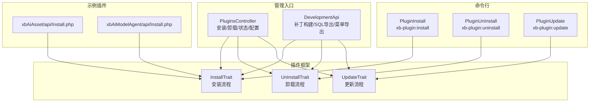
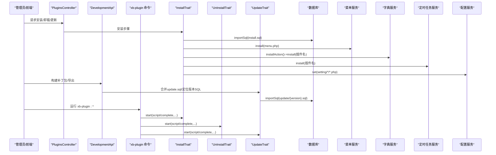
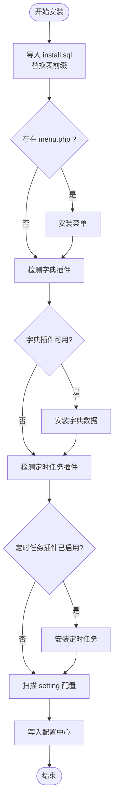
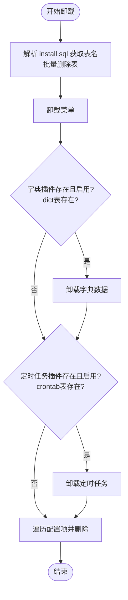
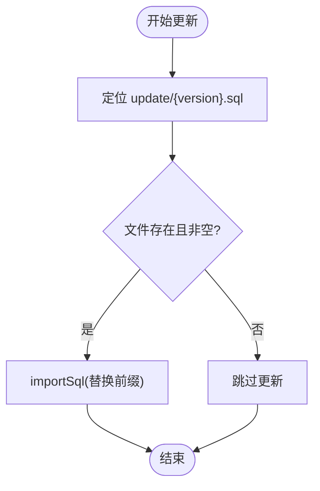
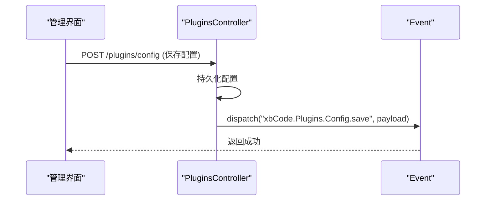
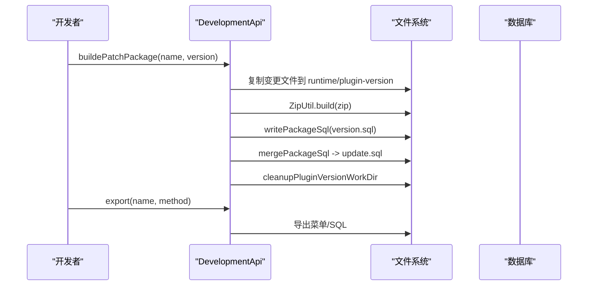
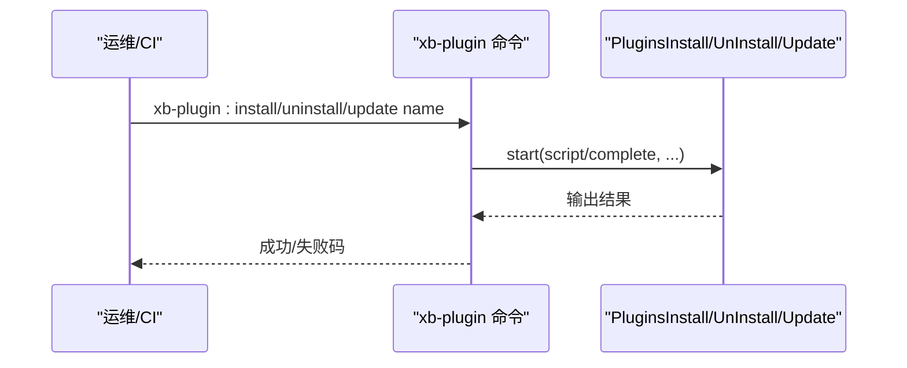
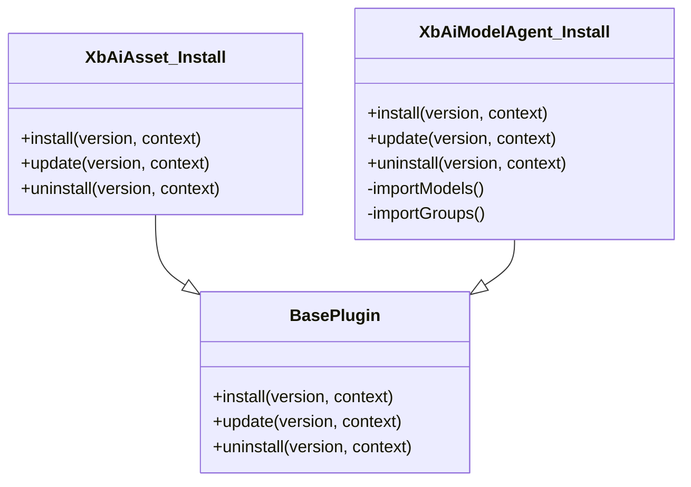
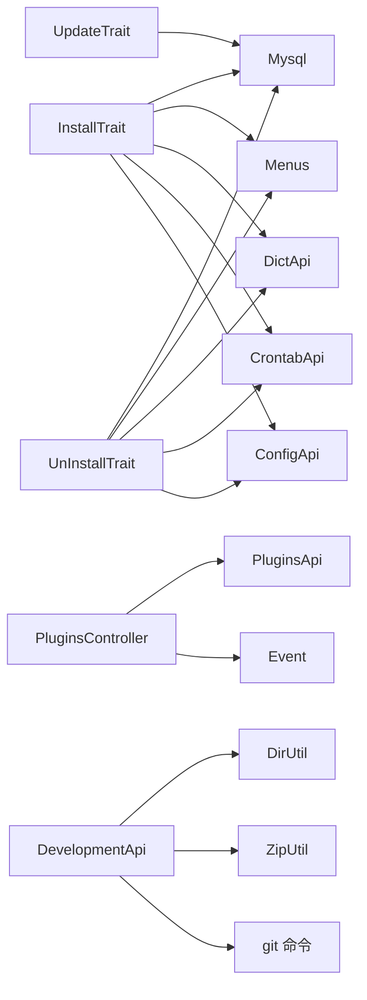

# 插件生命周期管理

<cite>
**本文引用的文件**
- [InstallTrait.php](file://server/plugin\xbCode\base\plugin\InstallTrait.php)
- [UnInstallTrait.php](file://server/plugin\xbCode\base\plugin\UnInstallTrait.php)
- [UpdateTrait.php](file://server/plugin\xbCode\base\plugin\UpdateTrait.php)
- [PluginsController.php](file://server/plugin\xbCode\app\admin\controller\PluginsController.php)
- [DevelopmentApi.php](file://server/plugin\xbDeveloper\api\DevelopmentApi.php)
- [PluginInstall.php](file://server/plugin\xbDeveloper\command\PluginInstall.php)
- [PluginUnInstall.php](file://server/plugin\xbDeveloper\command\PluginUnInstall.php)
- [PluginUpdate.php](file://server/plugin\xbDeveloper\command\PluginUpdate.php)
- [xbAiAsset Install.php](file://server/plugin\xbAiAsset\api\Install.php)
- [xbAiModelAgent Install.php](file://server/plugin\xbAiModelAgent\api\Install.php)
</cite>

## 目录
1. [简介](#简介)
2. [项目结构](#项目结构)
3. [核心组件](#核心组件)
4. [架构总览](#架构总览)
5. [详细组件分析](#详细组件分析)
6. [依赖关系分析](#依赖关系分析)
7. [性能与一致性考虑](#性能与一致性考虑)
8. [故障排查指南](#故障排查指南)
9. [结论](#结论)
10. [附录：最佳实践与扩展点](#附录最佳实践与扩展点)

## 简介
本文件围绕“插件生命周期管理”展开，系统梳理安装、卸载、更新等关键阶段的处理逻辑，覆盖数据库迁移执行、菜单/字典/定时任务/配置项的初始化与清理、版本兼容性与补丁构建、以及事件监听与自定义扩展方法。文档以代码级实现为依据，提供流程图与时序图帮助理解控制流，并给出可操作的实践建议。

## 项目结构
后端采用 Webman + ThinkORM 的组合，插件位于 server/plugin 目录下，每个插件包含 api、config、data、enum、setting 等标准目录。生命周期相关能力由基础 Trait 提供（安装、卸载、更新），并通过控制器与命令入口触发；开发者辅助能力集中在 xbDeveloper 插件中，用于开发期操作与补丁构建。

图表来源
- [InstallTrait.php:25-173](file://server/plugin\xbCode\base\plugin\InstallTrait.php#L25-L173)
- [UnInstallTrait.php:25-173](file://server/plugin\xbCode\base\plugin\UnInstallTrait.php#L25-L173)
- [UpdateTrait.php:20-48](file://server/plugin\xbCode\base\plugin\UpdateTrait.php#L20-L48)
- [PluginsController.php:76-124](file://server/plugin\xbCode\app\admin\controller\PluginsController.php#L76-L124)
- [DevelopmentApi.php:69-210](file://server/plugin\xbDeveloper\api\DevelopmentApi.php#L69-L210)
- [PluginInstall.php:29-79](file://server/plugin\xbDeveloper\command\PluginInstall.php#L29-L79)
- [PluginUnInstall.php:15-57](file://server/plugin\xbDeveloper\command\PluginUnInstall.php#L15-L57)
- [PluginUpdate.php:15-57](file://server/plugin\xbDeveloper\command\PluginUpdate.php#L15-L57)
- [xbAiAsset Install.php:19-62](file://server/plugin\xbAiAsset\api\Install.php#L19-L62)
- [xbAiModelAgent Install.php:21-144](file://server/plugin\xbAiModelAgent\api\Install.php#L21-L144)

章节来源
- [PluginsController.php:76-124](file://server/plugin\xbCode\app\admin\controller\PluginsController.php#L76-L124)
- [InstallTrait.php:25-173](file://server/plugin\xbCode\base\plugin\InstallTrait.php#L25-L173)
- [UnInstallTrait.php:25-173](file://server/plugin\xbCode\base\plugin\UnInstallTrait.php#L25-L173)
- [UpdateTrait.php:20-48](file://server/plugin\xbCode\base\plugin\UpdateTrait.php#L20-L48)
- [DevelopmentApi.php:69-210](file://server/plugin\xbDeveloper\api\DevelopmentApi.php#L69-L210)
- [PluginInstall.php:29-79](file://server/plugin\xbDeveloper\command\PluginInstall.php#L29-L79)
- [PluginUnInstall.php:15-57](file://server/plugin\xbDeveloper\command\PluginUnInstall.php#L15-L57)
- [PluginUpdate.php:15-57](file://server/plugin\xbDeveloper\command\PluginUpdate.php#L15-L57)
- [xbAiAsset Install.php:19-62](file://server/plugin\xbAiAsset\api\Install.php#L19-L62)
- [xbAiModelAgent Install.php:21-144](file://server/plugin\xbAiModelAgent\api\Install.php#L21-L144)

## 核心组件
- 安装流程（InstallTrait）
  - 数据库安装：读取 install.sql，替换表前缀后导入。
  - 菜单安装：加载 config/menu.php，调用菜单安装接口。
  - 字典安装：若字典插件存在且启用，则按插件名批量安装字典。
  - 定时任务安装：若定时任务插件存在且启用，则按插件名注册任务。
  - 配置项安装：扫描 setting 目录下的分组与选项卡配置，写入配置中心。
- 卸载流程（UnInstallTrait）
  - 数据库卸载：解析 install.sql 中的表名，批量删除。
  - 菜单卸载：按插件名移除菜单。
  - 字典卸载：在满足依赖与表存在条件时，按插件名卸载字典。
  - 定时任务卸载：在满足依赖与表存在条件时，按插件名卸载任务。
  - 配置项卸载：遍历 setting 下配置项定义，逐条删除对应配置记录。
- 更新流程（UpdateTrait）
  - 版本 SQL 更新：根据当前插件版本定位 update/{version}.sql，替换前缀后导入。
- 管理入口（PluginsController）
  - 提供安装/卸载步骤式 API，并在完成后刷新插件缓存。
  - 支持插件状态切换、配置保存与表单渲染、删除插件代码、查看说明、刷新缓存。
- 开发者辅助（DevelopmentApi）
  - 补丁包构建：收集 Git 变更与 SQL 变更，生成 zip 与合并后的 update.sql。
  - 导出工具：导出菜单、SQL 等。
- 命令行（xb-plugin:*）
  - 安装/卸载/更新命令，驱动脚本执行与完成回调。

章节来源
- [InstallTrait.php:25-173](file://server/plugin\xbCode\base\plugin\InstallTrait.php#L25-L173)
- [UnInstallTrait.php:25-173](file://server/plugin\xbCode\base\plugin\UnInstallTrait.php#L25-L173)
- [UpdateTrait.php:20-48](file://server/plugin\xbCode\base\plugin\UpdateTrait.php#L20-L48)
- [PluginsController.php:76-124](file://server/plugin\xbCode\app\admin\controller\PluginsController.php#L76-L124)
- [DevelopmentApi.php:69-210](file://server/plugin\xbDeveloper\api\DevelopmentApi.php#L69-L210)
- [PluginInstall.php:29-79](file://server/plugin\xbDeveloper\command\PluginInstall.php#L29-L79)
- [PluginUnInstall.php:15-57](file://server/plugin\xbDeveloper\command\PluginUnInstall.php#L15-L57)
- [PluginUpdate.php:15-57](file://server/plugin\xbDeveloper\command\PluginUpdate.php#L15-L57)

## 架构总览
下图展示了从管理界面或命令行到具体生命周期执行的调用链，以及各阶段对数据库、菜单、字典、定时任务与配置的读写路径。

图表来源
- [PluginsController.php:76-124](file://server/plugin\xbCode\app\admin\controller\PluginsController.php#L76-L124)
- [InstallTrait.php:25-173](file://server/plugin\xbCode\base\plugin\InstallTrait.php#L25-L173)
- [UnInstallTrait.php:25-173](file://server/plugin\xbCode\base\plugin\UnInstallTrait.php#L25-L173)
- [UpdateTrait.php:20-48](file://server/plugin\xbCode\base\plugin\UpdateTrait.php#L20-L48)
- [DevelopmentApi.php:69-210](file://server/plugin\xbDeveloper\api\DevelopmentApi.php#L69-L210)
- [PluginInstall.php:29-79](file://server/plugin\xbDeveloper\command\PluginInstall.php#L29-L79)
- [PluginUnInstall.php:15-57](file://server/plugin\xbDeveloper\command\PluginUnInstall.php#L15-L57)
- [PluginUpdate.php:15-57](file://server/plugin\xbDeveloper\command\PluginUpdate.php#L15-L57)

## 详细组件分析

### 安装流程（InstallTrait）
- 数据库安装
  - 读取数据库连接前缀，将 install.sql 中的旧前缀替换为新前缀后导入。
- 菜单安装
  - 加载 config/menu.php，校验非空后调用菜单安装接口。
- 字典安装
  - 检查字典插件类是否存在，再调用字典安装动作进行安装。
- 定时任务安装
  - 检查定时任务插件是否已启用，若存在则按插件名注册任务。
- 配置项安装
  - 扫描 setting 目录，分别处理普通配置与选项卡配置，统一写入配置中心。

图表来源
- [InstallTrait.php:25-173](file://server/plugin\xbCode\base\plugin\InstallTrait.php#L25-L173)

章节来源
- [InstallTrait.php:25-173](file://server/plugin\xbCode\base\plugin\InstallTrait.php#L25-L173)

### 卸载流程（UnInstallTrait）
- 数据库卸载
  - 解析 install.sql 中的表名，批量删除。
- 菜单卸载
  - 按插件名移除菜单。
- 字典卸载
  - 在字典插件存在、启用且 dict 表存在时，按插件名卸载字典。
- 定时任务卸载
  - 在定时任务插件存在、启用且 crontab 表存在时，按插件名卸载任务。
- 配置项卸载
  - 遍历 setting 下配置项定义，逐条查询并删除配置记录。

图表来源
- [UnInstallTrait.php:25-173](file://server/plugin\xbCode\base\plugin\UnInstallTrait.php#L25-L173)

章节来源
- [UnInstallTrait.php:25-173](file://server/plugin\xbCode\base\plugin\UnInstallTrait.php#L25-L173)

### 更新流程（UpdateTrait）
- 版本 SQL 更新
  - 根据插件版本定位 update/{version}.sql，替换前缀后导入。
  - 若文件不存在或为空则跳过。

图表来源
- [UpdateTrait.php:20-48](file://server/plugin\xbCode\base\plugin\UpdateTrait.php#L20-L48)

章节来源
- [UpdateTrait.php:20-48](file://server/plugin\xbCode\base\plugin\UpdateTrait.php#L20-L48)

### 管理入口与事件（PluginsController）
- 安装/卸载/状态/配置/删除/说明/刷新缓存等管理功能。
- 配置保存后触发事件，便于外部监听与扩展。

图表来源
- [PluginsController.php:147-190](file://server/plugin\xbCode\app\admin\controller\PluginsController.php#L147-L190)

章节来源
- [PluginsController.php:76-124](file://server/plugin\xbCode\app\admin\controller\PluginsController.php#L76-L124)
- [PluginsController.php:147-190](file://server/plugin\xbCode\app\admin\controller\PluginsController.php#L147-L190)

### 开发者辅助与补丁构建（DevelopmentApi）
- 补丁包构建
  - 收集 Git 变更与 SQL 变更，复制文件、打包 zip、写入版本 SQL、合并为 update.sql，并清理临时工作目录。
- 导出菜单/SQL
  - 导出菜单至插件配置，导出 SQL 文件。

图表来源
- [DevelopmentApi.php:69-210](file://server/plugin\xbDeveloper\api\DevelopmentApi.php#L69-L210)

章节来源
- [DevelopmentApi.php:69-210](file://server/plugin\xbDeveloper\api\DevelopmentApi.php#L69-L210)

### 命令行入口（xb-plugin:*）
- 安装命令：执行安装脚本，可选执行完成方法。
- 卸载命令：执行卸载脚本与完成回调。
- 更新命令：执行更新脚本与完成回调。

图表来源
- [PluginInstall.php:29-79](file://server/plugin\xbDeveloper\command\PluginInstall.php#L29-L79)
- [PluginUnInstall.php:15-57](file://server/plugin\xbDeveloper\command\PluginUnInstall.php#L15-L57)
- [PluginUpdate.php:15-57](file://server/plugin\xbDeveloper\command\PluginUpdate.php#L15-L57)

章节来源
- [PluginInstall.php:29-79](file://server/plugin\xbDeveloper\command\PluginInstall.php#L29-L79)
- [PluginUnInstall.php:15-57](file://server/plugin\xbDeveloper\command\PluginUnInstall.php#L15-L57)
- [PluginUpdate.php:15-57](file://server/plugin\xbDeveloper\command\PluginUpdate.php#L15-L57)

### 插件侧钩子与自定义扩展
- 插件安装类需继承 BasePlugin，重写 install/update/uninstall 方法，并在其中调用父类方法以复用默认流程。
- 可在自定义方法中追加业务初始化逻辑（如导入模型/分组数据）。

图表来源
- [xbAiAsset Install.php:19-62](file://server/plugin\xbAiAsset\api\Install.php#L19-L62)
- [xbAiModelAgent Install.php:21-144](file://server/plugin\xbAiModelAgent\api\Install.php#L21-L144)

章节来源
- [xbAiAsset Install.php:19-62](file://server/plugin\xbAiAsset\api\Install.php#L19-L62)
- [xbAiModelAgent Install.php:21-144](file://server/plugin\xbAiModelAgent\api\Install.php#L21-L144)

## 依赖关系分析
- 安装/卸载/更新 Trait 依赖：
  - 数据库：Mysql::importSql、Mysql::getSqlNames、Mysql::dropTables、Mysql::hasTable
  - 菜单：Menus::install、Menus::uninstall
  - 字典：DictApi::installAction()->install()/uninstall()
  - 定时任务：CrontabApi::make()->install()/uninstall()
  - 配置：ConfigApi::make(group)->set()
- 管理入口依赖：
  - PluginsApi：列表、缓存、状态、配置模板
  - Event：配置保存事件
- 开发者辅助依赖：
  - DirUtil、ZipUtil、Git 命令、文件系统

图表来源
- [InstallTrait.php:25-173](file://server/plugin\xbCode\base\plugin\InstallTrait.php#L25-L173)
- [UnInstallTrait.php:25-173](file://server/plugin\xbCode\base\plugin\UnInstallTrait.php#L25-L173)
- [UpdateTrait.php:20-48](file://server/plugin\xbCode\base\plugin\UpdateTrait.php#L20-L48)
- [PluginsController.php:76-124](file://server/plugin\xbCode\app\admin\controller\PluginsController.php#L76-L124)
- [DevelopmentApi.php:69-210](file://server/plugin\xbDeveloper\api\DevelopmentApi.php#L69-L210)

章节来源
- [InstallTrait.php:25-173](file://server/plugin\xbCode\base\plugin\InstallTrait.php#L25-L173)
- [UnInstallTrait.php:25-173](file://server/plugin\xbCode\base\plugin\UnInstallTrait.php#L25-L173)
- [UpdateTrait.php:20-48](file://server/plugin\xbCode\base\plugin\UpdateTrait.php#L20-L48)
- [PluginsController.php:76-124](file://server/plugin\xbCode\app\admin\controller\PluginsController.php#L76-L124)
- [DevelopmentApi.php:69-210](file://server/plugin\xbDeveloper\api\DevelopmentApi.php#L69-L210)

## 性能与一致性考虑
- 数据库迁移
  - 使用 importSql 批量导入，注意大 SQL 文件的分块与事务边界，避免长事务导致锁竞争。
- 资源清理
  - 卸载流程应确保幂等，重复卸载不应报错；对缺失文件或表的判断要前置。
- 补丁构建
  - 合并 update.sql 时避免重复语句；构建完成后及时清理 runtime 临时目录，释放磁盘空间。
- 事件与缓存
  - 安装/卸载完成后刷新插件缓存，保证后续请求命中最新元数据。

[本节为通用指导，不直接分析具体文件]

## 故障排查指南
- 安装失败
  - 检查 install.sql 是否存在及前缀替换是否正确。
  - 确认依赖插件（字典、定时任务）是否已安装并启用。
- 卸载失败
  - 检查目标表是否存在；若字典/定时任务未安装或未启用，卸载逻辑会提前返回。
- 更新失败
  - 确认 update/{version}.sql 是否存在且内容非空。
- 补丁构建失败
  - 确认插件目录为 Git 仓库；检查 git status 输出与权限。
- 配置保存无响应
  - 检查事件监听器是否注册；确认路由与参数传递正确。

章节来源
- [InstallTrait.php:25-173](file://server/plugin\xbCode\base\plugin\InstallTrait.php#L25-L173)
- [UnInstallTrait.php:25-173](file://server/plugin\xbCode\base\plugin\UnInstallTrait.php#L25-L173)
- [UpdateTrait.php:20-48](file://server/plugin\xbCode\base\plugin\UpdateTrait.php#L20-L48)
- [DevelopmentApi.php:69-210](file://server/plugin\xbDeveloper\api\DevelopmentApi.php#L69-L210)
- [PluginsController.php:147-190](file://server/plugin\xbCode\app\admin\controller\PluginsController.php#L147-L190)

## 结论
本系统通过统一的 Trait 抽象与控制器/命令入口，提供了完整的插件生命周期管理能力。安装阶段自动完成数据库、菜单、字典、定时任务与配置的初始化；卸载阶段安全地清理资源；更新阶段基于版本 SQL 平滑演进。开发者可通过继承 BasePlugin 扩展自身业务逻辑，并使用事件机制与补丁构建工具提升开发与运维效率。

[本节为总结性内容，不直接分析具体文件]

## 附录：最佳实践与扩展点
- 插件结构规范
  - 在 plugin/{name}/config/menu.php 定义菜单；在 plugin/{name}/install.sql 定义初始表结构；在 plugin/{name}/update/{version}.sql 定义增量变更。
- 安装钩子
  - 在插件 api/Install.php 中继承 BasePlugin，按需追加业务初始化（如导入模型/分组数据）。
- 版本兼容性
  - 严格遵循版本号命名，确保 update/{version}.sql 与版本一一对应；必要时在 update.sql 中汇总所有增量。
- 事件监听
  - 在配置保存后监听 xbCode.Plugins.Config.save 事件，实现跨插件联动。
- 资源清理
  - 卸载逻辑必须幂等；对缺失对象进行存在性检查后再操作。
- 补丁构建
  - 使用 DevelopmentApi 的补丁构建能力，结合 Git 变更与 SQL 变更，生成可部署包与合并 SQL。

章节来源
- [xbAiModelAgent Install.php:21-144](file://server/plugin\xbAiModelAgent\api\Install.php#L21-L144)
- [PluginsController.php:147-190](file://server/plugin\xbCode\app\admin\controller\PluginsController.php#L147-L190)
- [DevelopmentApi.php:69-210](file://server/plugin\xbDeveloper\api\DevelopmentApi.php#L69-L210)