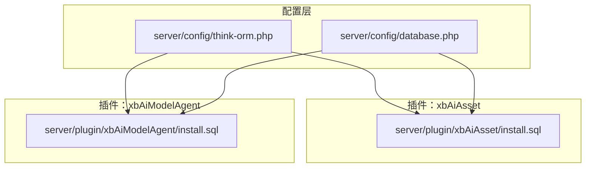
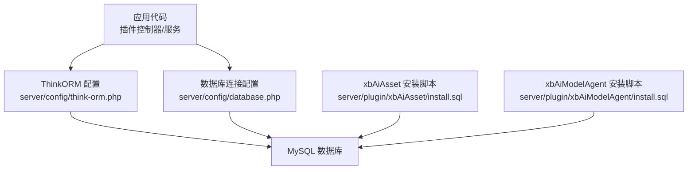
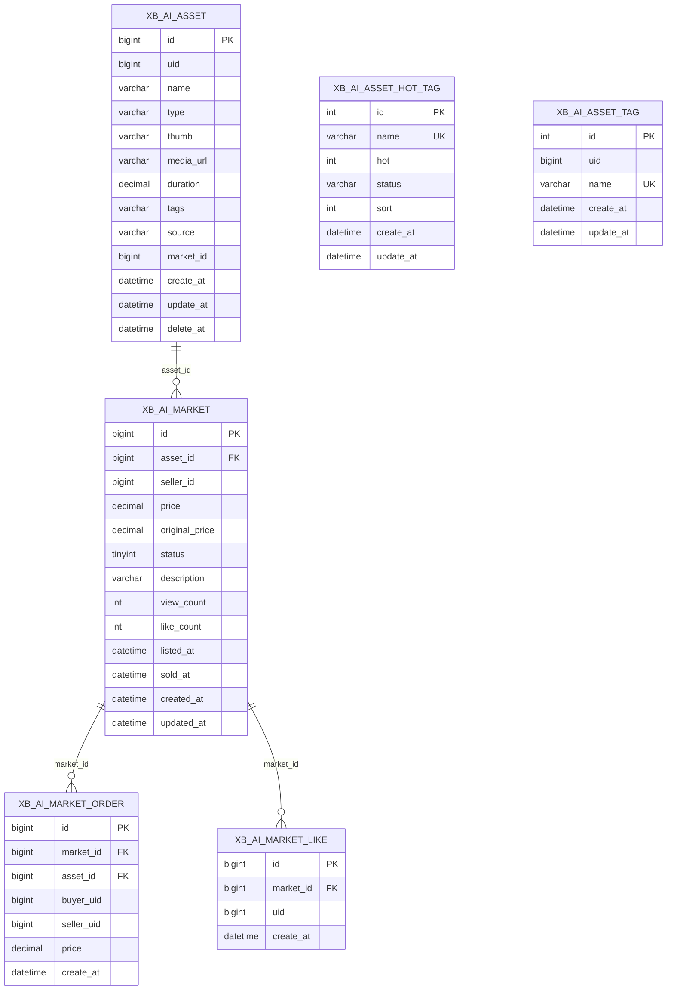
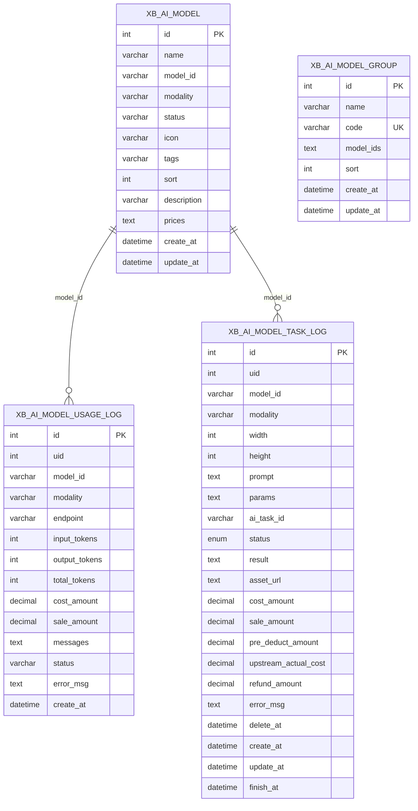
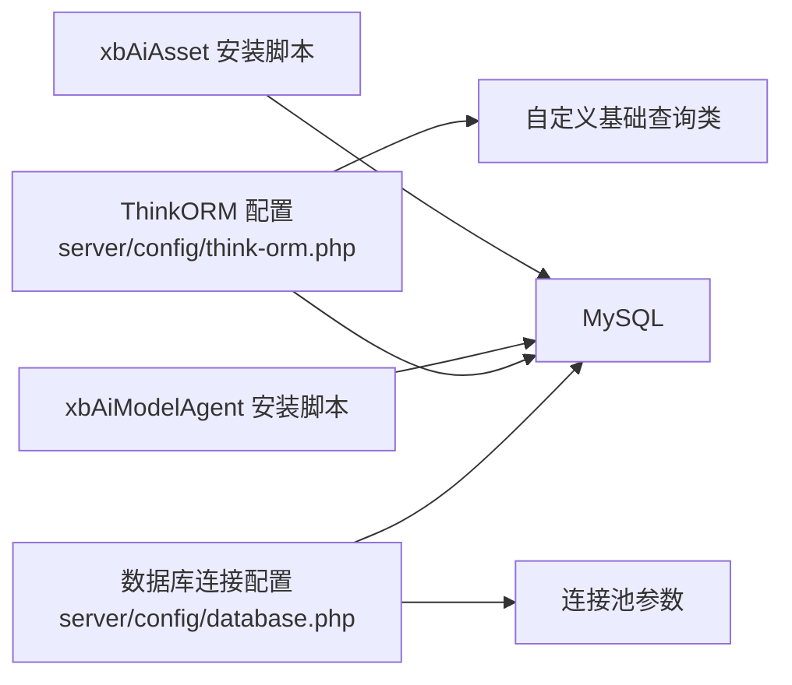

# 数据库模型设计

<cite>
**本文引用的文件**   
- [think-orm.php](file://server/config/think-orm.php)
- [database.php](file://server/config/database.php)
- [install.sql（xbAiAsset）](file://server/plugin/xbAiAsset/install.sql)
- [install.sql（xbAiModelAgent）](file://server/plugin/xbAiModelAgent/install.sql)
</cite>

## 目录
1. [简介](#简介)
2. [项目结构](#项目结构)
3. [核心组件](#核心组件)
4. [架构总览](#架构总览)
5. [详细组件分析](#详细组件分析)
6. [依赖关系分析](#依赖关系分析)
7. [性能考虑](#性能考虑)
8. [故障排查指南](#故障排查指南)
9. [结论](#结论)
10. [附录](#附录)

## 简介
本文件面向插件开发者，系统化阐述在插件中如何设计与实现数据库模型。内容覆盖：
- ThinkORM 模型类编写规范与约定
- 表结构设计、字段类型选择与命名约定
- 关联关系建模（一对一、一对多、多对多）
- 迁移文件的创建与管理流程
- 索引优化策略与查询性能建议
- 数据验证规则设置与最佳实践
- 基于现有插件的完整示例与ER图

## 项目结构
本项目采用“插件化”组织方式，每个插件包含自身的安装脚本 install.sql，用于初始化或升级数据库表结构；ThinkORM 与数据库连接配置位于 server/config 下。

图表来源
- [think-orm.php:1-40](file://server/config/think-orm.php#L1-L40)
- [database.php:1-35](file://server/config/database.php#L1-L35)
- [install.sql（xbAiAsset）:1-105](file://server/plugin/xbAiAsset/install.sql#L1-L105)
- [install.sql（xbAiModelAgent）:1-91](file://server/plugin/xbAiModelAgent/install.sql#L1-L91)

章节来源
- [think-orm.php:1-40](file://server/config/think-orm.php#L1-L40)
- [database.php:1-35](file://server/config/database.php#L1-L35)

## 核心组件
- 数据库连接与驱动
  - ThinkORM 默认连接为 mysql，支持前缀、字符集、断线重连、SQL日志开关等。
  - 自定义基础查询类通过配置注入，便于统一查询行为。
- 插件安装脚本
  - 各插件根目录提供 install.sql，集中定义建表、索引、唯一约束等DDL语句。
- 命名与前缀
  - 全局表前缀由配置决定，所有表名以该前缀开头，避免跨插件冲突。

章节来源
- [think-orm.php:1-40](file://server/config/think-orm.php#L1-L40)
- [database.php:1-35](file://server/config/database.php#L1-L35)

## 架构总览
下图展示 ThinkORM 配置、数据库连接池与插件安装脚本之间的关系，以及它们如何共同支撑插件的数据访问。

图表来源
- [think-orm.php:1-40](file://server/config/think-orm.php#L1-L40)
- [database.php:1-35](file://server/config/database.php#L1-L35)
- [install.sql（xbAiAsset）:1-105](file://server/plugin/xbAiAsset/install.sql#L1-L105)
- [install.sql（xbAiModelAgent）:1-91](file://server/plugin/xbAiModelAgent/install.sql#L1-L91)

## 详细组件分析

### 资产域（xbAiAsset）数据模型
- 实体与关系
  - 用户资产（xb_ai_asset）：记录素材基本信息、来源、媒体地址、标签等。
  - 市场上架（xb_ai_market）：记录上架信息、价格、状态、计数等。
  - 市场订单（xb_ai_market_order）：记录交易流水。
  - 点赞（xb_ai_market_like）：用户对商品点赞，唯一约束防止重复。
  - 热门标签库（xb_ai_asset_hot_tag）：平台级热门标签。
  - 用户标签库（xb_ai_asset_tag）：用户自建标签。
- 典型关系
  - 一对多：用户资产 -> 市场上架（asset_id）
  - 一对多：市场上架 -> 订单（market_id）
  - 多对一：订单 -> 用户（buyer_uid/seller_uid）
  - 多对一：点赞 -> 市场上架（market_id）
  - 多对多（概念）：资产 <-> 标签（可通过 tags 字段或扩展中间表实现）

图表来源
- [install.sql（xbAiAsset）:1-105](file://server/plugin/xbAiAsset/install.sql#L1-L105)

章节来源
- [install.sql（xbAiAsset）:1-105](file://server/plugin/xbAiAsset/install.sql#L1-L105)

### 模型代理域（xbAiModelAgent）数据模型
- 实体与关系
  - 模型（xb_ai_model）：模型元数据、模态、状态、标签、排序、描述、价格配置等。
  - 使用日志（xb_ai_model_usage_log）：按接口调用统计 token、成本、销售金额、消息体等。
  - 任务日志（xb_ai_model_task_log）：异步生成任务的状态、结果、费用明细、错误信息等。
  - 模型分组（xb_ai_model_group）：分组标识与关联模型ID列表（JSON）。
- 典型关系
  - 一对多：模型 -> 使用日志（model_id）
  - 一对多：模型 -> 任务日志（model_id）
  - 多对一：使用日志/任务日志 -> 用户（uid）

图表来源
- [install.sql（xbAiModelAgent）:1-91](file://server/plugin/xbAiModelAgent/install.sql#L1-L91)

章节来源
- [install.sql（xbAiModelAgent）:1-91](file://server/plugin/xbAiModelAgent/install.sql#L1-L91)

### ThinkORM 模型类编写要点
- 继承与命名
  - 模型类通常继承框架提供的 Model 基类，类名与表名遵循“驼峰转下划线+前缀”的映射约定。
  - 若需统一查询行为，可在配置中指定自定义基础查询类。
- 字段与类型
  - 主键默认自增，建议使用无符号整型或大整型。
  - 时间戳字段使用 datetime，并配合默认值与自动更新。
  - JSON 文本使用 text 存储结构化数据。
- 软删除
  - 引入 delete_at 字段并在查询时过滤已删除记录。
- 关联定义
  - 一对多：hasMany/hasOne 根据外键方向定义。
  - 多对多：通过中间表或组合查询实现。
- 事件与钩子
  - 利用模型事件完成审计、缓存失效、消息通知等横切逻辑。

章节来源
- [think-orm.php:1-40](file://server/config/think-orm.php#L1-L40)

### 表结构与字段类型选择
- 主键与自增
  - 小表使用 int(10) unsigned，大表或高并发场景使用 bigint(20) unsigned。
- 字符串与枚举
  - 短文本用 varchar，长度预估留余量；固定集合可用 tinyint 或 varchar 枚举。
- 数值与货币
  - 金额使用 decimal(p,s)，精度与小数位按业务需求设定。
- 时间与软删除
  - 使用 datetime 并设置默认 CURRENT_TIMESTAMP；软删除字段 delete_at 置空表示未删除。
- JSON 字段
  - 使用 text 存储 JSON，必要时在应用层解析校验。

章节来源
- [install.sql（xbAiAsset）:1-105](file://server/plugin/xbAiAsset/install.sql#L1-L105)
- [install.sql（xbAiModelAgent）:1-91](file://server/plugin/xbAiModelAgent/install.sql#L1-L91)

### 关联关系建模最佳实践
- 一对一
  - 将外键放在从表，并为外键建立索引；或使用共享主键。
- 一对多
  - 在多端表维护外键，并对常用查询列建立复合索引。
- 多对多
  - 使用中间表承载两端外键，并为每端外键及联合查询条件建立索引。
- 反查与冗余
  - 适度冗余高频字段（如名称快照）以减少 JOIN，但需保证一致性。

章节来源
- [install.sql（xbAiAsset）:1-105](file://server/plugin/xbAiAsset/install.sql#L1-L105)
- [install.sql（xbAiModelAgent）:1-91](file://server/plugin/xbAiModelAgent/install.sql#L1-L91)

### 迁移文件创建与管理
- 文件位置
  - 插件根目录放置 install.sql，集中管理建表与索引变更。
- 版本演进
  - 新增字段或索引时，追加增量 SQL 或在 update.sql 中定义升级脚本。
- 幂等性
  - 使用 DROP TABLE IF EXISTS / CREATE TABLE 或 ALTER TABLE ... ADD COLUMN IF NOT EXISTS 等幂等写法。
- 回滚策略
  - 保留对应回滚脚本，确保可逆操作。

章节来源
- [install.sql（xbAiAsset）:1-105](file://server/plugin/xbAiAsset/install.sql#L1-L105)
- [install.sql（xbAiModelAgent）:1-91](file://server/plugin/xbAiModelAgent/install.sql#L1-L91)

### 索引优化策略
- 单列索引
  - 对外键、筛选列（如 status、type）、排序列建立索引。
- 复合索引
  - 将等值查询列置于左侧，范围查询列置于右侧，遵循最左前缀原则。
- 唯一索引
  - 对业务唯一键（如 market_id+uid）建立唯一索引，防止重复写入。
- 覆盖索引
  - 针对高频查询，尽量让索引包含所需字段，减少回表。
- 监控与评估
  - 结合慢查询日志与执行计划持续优化。

章节来源
- [install.sql（xbAiAsset）:1-105](file://server/plugin/xbAiAsset/install.sql#L1-L105)
- [install.sql（xbAiModelAgent）:1-91](file://server/plugin/xbAiModelAgent/install.sql#L1-L91)

### 数据验证规则设置
- 服务端校验
  - 在控制器或服务层进行必填、格式、范围、唯一性等校验。
- 数据库约束
  - 使用 NOT NULL、DEFAULT、CHECK（视数据库版本）、UNIQUE 等约束兜底。
- 前端提示
  - 前端表单校验仅作为体验增强，不可替代后端校验。
- 错误处理
  - 统一异常捕获与返回码，便于前端友好提示。

章节来源
- [think-orm.php:1-40](file://server/config/think-orm.php#L1-L40)

## 依赖关系分析
- 配置到实现的依赖
  - ThinkORM 配置指向自定义基础查询类，影响所有模型的查询行为。
  - 数据库连接池参数影响高并发下的连接复用与稳定性。
- 插件到配置的依赖
  - 插件安装脚本依赖全局表前缀与字符集配置，确保一致性与兼容性。

图表来源
- [think-orm.php:1-40](file://server/config/think-orm.php#L1-L40)
- [database.php:1-35](file://server/config/database.php#L1-L35)
- [install.sql（xbAiAsset）:1-105](file://server/plugin/xbAiAsset/install.sql#L1-L105)
- [install.sql（xbAiModelAgent）:1-91](file://server/plugin/xbAiModelAgent/install.sql#L1-L91)

章节来源
- [think-orm.php:1-40](file://server/config/think-orm.php#L1-L40)
- [database.php:1-35](file://server/config/database.php#L1-L35)

## 性能考虑
- 连接池调优
  - 合理设置最大/最小连接数、等待超时、空闲回收与心跳间隔，避免连接耗尽或频繁重建。
- 查询优化
  - 优先使用索引覆盖，避免 SELECT *；分页查询使用延迟关联或游标分页。
- 事务与锁
  - 控制事务粒度，避免长事务；热点行写时使用乐观锁或队列化落盘。
- 读写分离
  - 读多写少场景可引入只读副本，降低主库压力。
- 缓存策略
  - 对热点字典、配置、排行榜等使用 Redis 缓存，注意一致性。

[本节为通用指导，不直接分析具体文件]

## 故障排查指南
- 连接失败
  - 检查环境变量（主机、端口、用户名、密码、库名、字符集、前缀）是否正确。
- 权限问题
  - 确认数据库账号具备建表、索引、插入、更新等必要权限。
- 字符集乱码
  - 确保客户端、连接、表、列均使用 utf8mb4。
- 慢查询定位
  - 开启 SQL 日志，结合 EXPLAIN 分析执行计划，补充缺失索引。
- 连接池异常
  - 调整 wait_timeout、idle_timeout、heartbeat_interval 等参数，观察连接泄漏与回收情况。

章节来源
- [think-orm.php:1-40](file://server/config/think-orm.php#L1-L40)
- [database.php:1-35](file://server/config/database.php#L1-L35)

## 结论
通过统一的 ThinkORM 配置与插件化的 install.sql，项目实现了清晰的数据库模型管理与可扩展的表结构演进。结合合理的索引策略、严格的验证与完善的故障排查手段，可有效保障系统在高并发与复杂业务场景下的稳定与高效。

[本节为总结性内容，不直接分析具体文件]

## 附录
- 术语
  - 软删除：通过 delete_at 标记删除而非物理删除。
  - 幂等：多次执行同一操作不会产生副作用。
  - 覆盖索引：查询所需字段全部存在于索引中，无需回表。
- 参考路径
  - ThinkORM 配置：[server/config/think-orm.php](file://server/config/think-orm.php)
  - 数据库连接配置：[server/config/database.php](file://server/config/database.php)
  - 资产域安装脚本：[server/plugin/xbAiAsset/install.sql](file://server/plugin/xbAiAsset/install.sql)
  - 模型代理域安装脚本：[server/plugin/xbAiModelAgent/install.sql](file://server/plugin/xbAiModelAgent/install.sql)