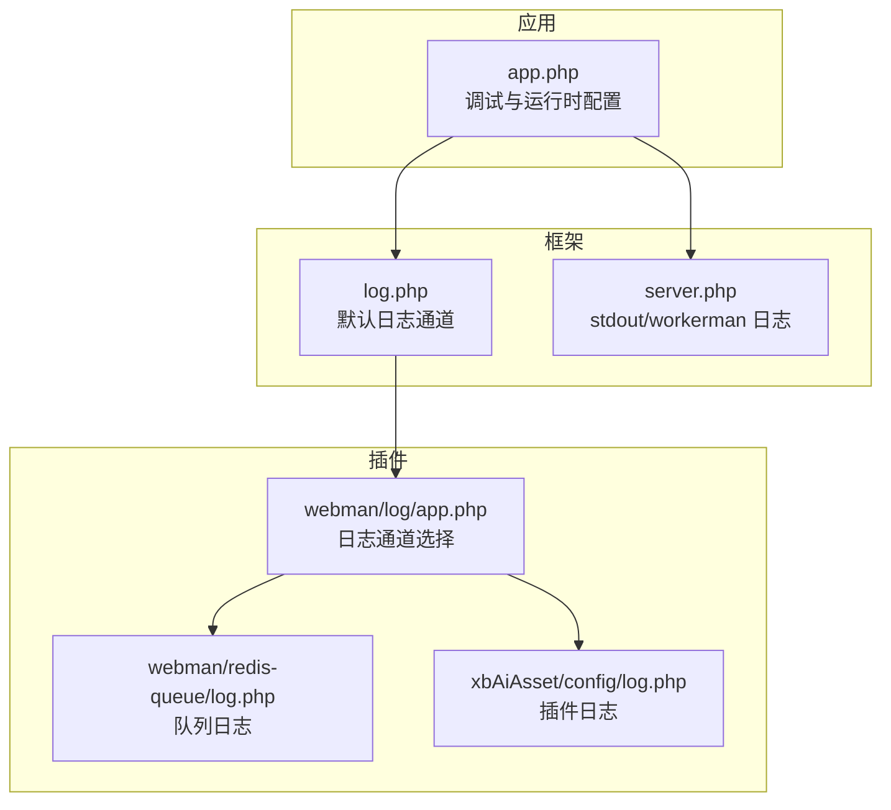
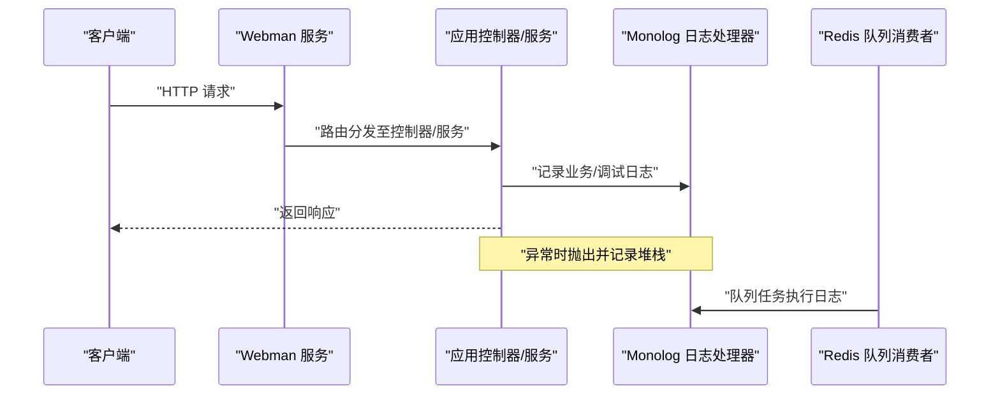
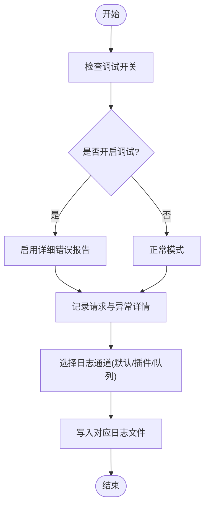
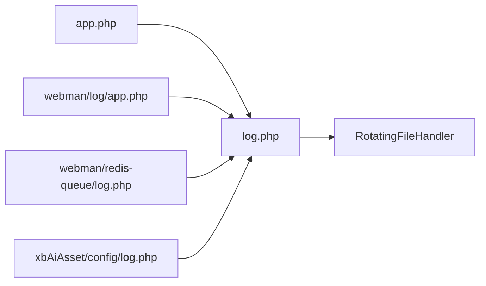

# 调试与测试

<cite>
**本文引用的文件**   
- [server/config/app.php](file://server/config/app.php)
- [server/config/log.php](file://server/config/log.php)
- [server/config/server.php](file://server/config/server.php)
- [server/plugin/webman/log/app.php](file://server/plugin/webman/log/app.php)
- [server/plugin/webman/redis-queue/log.php](file://server/plugin/webman/redis-queue/log.php)
- [server/plugin/xbAiAsset/config/log.php](file://server/plugin/xbAiAsset/config/log.php)
- [server/plugin/xbDeveloper/README.md](file://server/plugin/xbDeveloper/README.md)
</cite>

## 目录
1. [简介](#简介)
2. [项目结构](#项目结构)
3. [核心组件](#核心组件)
4. [架构总览](#架构总览)
5. [详细组件分析](#详细组件分析)
6. [依赖关系分析](#依赖关系分析)
7. [性能考量](#性能考量)
8. [故障排查指南](#故障排查指南)
9. [结论](#结论)
10. [附录](#附录)

## 简介
本指南面向插件开发者，聚焦于在基于 Webman 的 xbCode 生态中进行“调试与测试”的实用方法。内容涵盖：
- 日志记录与错误追踪（系统级、插件级、队列与进程）
- 性能分析与优化建议
- 单元测试与集成测试策略
- 自动化测试流程
- 常见问题定位与实战案例

## 项目结构
围绕调试与测试，本项目提供了多层次的日志配置与可观测性能力：
- 应用层：全局调试开关、错误报告级别、时区等
- 框架层：Webman 默认日志通道、标准输出与工作进程日志
- 插件层：各插件独立日志通道与文件路径
- 任务队列：Redis Queue 专用日志通道

图表来源
- [server/config/app.php:1-13](file://server/config/app.php#L1-L13)
- [server/config/log.php:1-33](file://server/config/log.php#L1-L33)
- [server/config/server.php:1-20](file://server/config/server.php#L1-L20)
- [server/plugin/webman/log/app.php:1-30](file://server/plugin/webman/log/app.php#L1-L30)
- [server/plugin/webman/redis-queue/log.php:1-30](file://server/plugin/webman/redis-queue/log.php#L1-L30)
- [server/plugin/xbAiAsset/config/log.php:1-20](file://server/plugin/xbAiAsset/config/log.php#L1-L20)

章节来源
- [server/config/app.php:1-13](file://server/config/app.php#L1-L13)
- [server/config/log.php:1-33](file://server/config/log.php#L1-L33)
- [server/config/server.php:1-20](file://server/config/server.php#L1-L20)
- [server/plugin/webman/log/app.php:1-30](file://server/plugin/webman/log/app.php#L1-L30)
- [server/plugin/webman/redis-queue/log.php:1-30](file://server/plugin/webman/redis-queue/log.php#L1-L30)
- [server/plugin/xbAiAsset/config/log.php:1-20](file://server/plugin/xbAiAsset/config/log.php#L1-L20)

## 核心组件
- 全局调试与错误上报
  - 通过应用配置控制调试模式与错误报告级别，便于本地开发快速暴露问题。
- 统一日志通道
  - 默认使用 RotatingFileHandler 将日志写入 runtime/logs 下，支持按天或大小轮转。
- 进程与标准输出日志
  - 工作进程与 stdout 日志分别输出到不同文件，便于区分请求日志与进程运行日志。
- 插件日志隔离
  - 插件可通过自身配置定义独立日志通道与文件路径，避免日志互相污染。
- 队列日志
  - Redis Queue 插件提供独立日志通道，便于追踪异步任务执行轨迹。

章节来源
- [server/config/app.php:1-13](file://server/config/app.php#L1-L13)
- [server/config/log.php:1-33](file://server/config/log.php#L1-L33)
- [server/config/server.php:1-20](file://server/config/server.php#L1-L20)
- [server/plugin/webman/log/app.php:1-30](file://server/plugin/webman/log/app.php#L1-L30)
- [server/plugin/webman/redis-queue/log.php:1-30](file://server/plugin/webman/redis-queue/log.php#L1-L30)
- [server/plugin/xbAiAsset/config/log.php:1-20](file://server/plugin/xbAiAsset/config/log.php#L1-L20)

## 架构总览
下图展示了从请求进入、业务处理、异常捕获到日志落盘的完整链路，以及插件与队列的扩展点。

图表来源
- [server/config/log.php:1-33](file://server/config/log.php#L1-L33)
- [server/config/server.php:1-20](file://server/config/server.php#L1-L20)
- [server/plugin/webman/redis-queue/log.php:1-30](file://server/plugin/webman/redis-queue/log.php#L1-L30)

## 详细组件分析

### 日志与错误追踪
- 全局调试开关
  - 通过环境变量或配置文件开启/关闭调试模式，影响错误页面展示与详细报错信息。
- 错误报告级别
  - 设置为最高级别以捕获所有警告与通知，利于早期发现潜在问题。
- 默认日志通道
  - 使用 RotatingFileHandler 输出到 runtime/logs/webman.log，格式包含时间戳，便于检索。
- 进程与标准输出
  - server.php 中定义了 stdout 与工作进程日志路径，适合监控进程健康与启动失败场景。
- 插件日志通道
  - webman/log 插件允许指定 channel，从而复用或覆盖默认通道；各插件可自定义独立日志文件。
- 队列日志
  - redis-queue 插件提供独立日志通道，用于追踪任务入队、消费、重试与失败。

图表来源
- [server/config/app.php:1-13](file://server/config/app.php#L1-L13)
- [server/config/log.php:1-33](file://server/config/log.php#L1-L33)
- [server/plugin/webman/log/app.php:1-30](file://server/plugin/webman/log/app.php#L1-L30)
- [server/plugin/webman/redis-queue/log.php:1-30](file://server/plugin/webman/redis-queue/log.php#L1-L30)

章节来源
- [server/config/app.php:1-13](file://server/config/app.php#L1-L13)
- [server/config/log.php:1-33](file://server/config/log.php#L1-L33)
- [server/config/server.php:1-20](file://server/config/server.php#L1-L20)
- [server/plugin/webman/log/app.php:1-30](file://server/plugin/webman/log/app.php#L1-L30)
- [server/plugin/webman/redis-queue/log.php:1-30](file://server/plugin/webman/redis-queue/log.php#L1-L30)
- [server/plugin/xbAiAsset/config/log.php:1-20](file://server/plugin/xbAiAsset/config/log.php#L1-L20)

### 性能分析与优化建议
- 请求级耗时埋点
  - 在控制器或服务入口与出口处记录时间戳，计算关键路径耗时，结合日志通道输出。
- I/O 与外部调用
  - 对数据库、缓存、第三方 API 调用进行分段计时，识别慢查询与网络瓶颈。
- 队列任务优化
  - 为长耗时任务拆分批次、增加并发度，并通过队列日志观察消费延迟与失败率。
- 日志级别与轮转
  - 生产环境降低日志级别，合理设置轮转策略，避免磁盘占用过高影响性能。

[本节为通用指导，不直接分析具体文件]

### 单元测试编写规范
- 目标与范围
  - 针对纯函数、工具类、数据转换逻辑编写单测，确保输入输出稳定。
- 断言与边界
  - 覆盖正常路径、异常分支、空值与非法输入，保证健壮性。
- 模拟与隔离
  - 对外部依赖（数据库、缓存、第三方 SDK）使用 Mock，避免真实环境耦合。
- 命名与组织
  - 测试类与方法命名清晰表达被测对象与场景，便于维护与定位。

[本节为通用指导，不直接分析具体文件]

### 集成测试策略
- 端到端流程
  - 构造最小可用数据集，验证“创建—处理—结果”的完整链路。
- 环境与数据准备
  - 使用独立的测试库与种子数据，避免污染生产数据。
- 异步任务验证
  - 通过队列日志与状态表确认任务完成，必要时引入等待与重试机制。

[本节为通用指导，不直接分析具体文件]

### 自动化测试流程
- 触发时机
  - 代码提交后自动拉取依赖、初始化测试环境、执行单测与集成用例。
- 产物与报告
  - 生成测试报告与覆盖率统计，失败时阻断合并。
- 持续集成
  - 结合 CI/CD 平台实现多环境并行执行，提升反馈速度。

[本节为通用指导，不直接分析具体文件]

### 调试示例与故障排除案例
- 示例一：接口超时与慢查询
  - 现象：某接口响应缓慢。
  - 步骤：
    - 开启调试模式，查看 webman.log 中的请求与异常堆栈。
    - 在控制器与服务中增加耗时埋点，定位慢查询或外部调用。
    - 优化 SQL 或增加缓存，复测并对比日志耗时。
- 示例二：队列任务失败
  - 现象：任务重复失败。
  - 步骤：
    - 查看 redis-queue 日志，定位失败原因与重试次数。
    - 校验入参与依赖服务可用性，修复后重新入队。
- 示例三：插件日志污染
  - 现象：多个插件日志混在一起难以定位。
  - 步骤：
    - 为每个插件配置独立日志通道与文件路径。
    - 使用过滤关键字检索特定插件日志。

章节来源
- [server/config/app.php:1-13](file://server/config/app.php#L1-L13)
- [server/config/log.php:1-33](file://server/config/log.php#L1-L33)
- [server/plugin/webman/redis-queue/log.php:1-30](file://server/plugin/webman/redis-queue/log.php#L1-L30)
- [server/plugin/xbAiAsset/config/log.php:1-20](file://server/plugin/xbAiAsset/config/log.php#L1-L20)

## 依赖关系分析
- 组件耦合
  - 应用配置驱动日志通道选择；插件通过 webman/log 插件接入日志体系。
- 外部依赖
  - Monolog 作为日志门面，RotatingFileHandler 负责文件轮转。
- 可扩展性
  - 插件可自定义日志通道与文件路径，满足多租户或多模块隔离需求。

图表来源
- [server/config/app.php:1-13](file://server/config/app.php#L1-L13)
- [server/config/log.php:1-33](file://server/config/log.php#L1-L33)
- [server/plugin/webman/log/app.php:1-30](file://server/plugin/webman/log/app.php#L1-L30)
- [server/plugin/webman/redis-queue/log.php:1-30](file://server/plugin/webman/redis-queue/log.php#L1-L30)
- [server/plugin/xbAiAsset/config/log.php:1-20](file://server/plugin/xbAiAsset/config/log.php#L1-L20)

章节来源
- [server/config/app.php:1-13](file://server/config/app.php#L1-L13)
- [server/config/log.php:1-33](file://server/config/log.php#L1-L33)
- [server/plugin/webman/log/app.php:1-30](file://server/plugin/webman/log/app.php#L1-L30)
- [server/plugin/webman/redis-queue/log.php:1-30](file://server/plugin/webman/redis-queue/log.php#L1-L30)
- [server/plugin/xbAiAsset/config/log.php:1-20](file://server/plugin/xbAiAsset/config/log.php#L1-L20)

## 性能考量
- 日志级别与吞吐
  - 生产环境降低日志级别，减少 I/O 压力；合理设置轮转数量与大小。
- 异步化与批处理
  - 将非关键路径日志批量写入，降低主线程阻塞。
- 资源监控
  - 关注磁盘空间与 inode 使用，避免日志文件过多导致系统不稳定。

[本节为通用指导，不直接分析具体文件]

## 故障排查指南
- 无法写入日志
  - 检查 runtime/logs 目录权限与磁盘空间。
- 日志未轮转
  - 确认 RotatingFileHandler 配置参数是否正确。
- 插件日志缺失
  - 核对插件日志通道名称与文件路径，确保目录存在且可写。
- 队列任务无日志
  - 确认 redis-queue 日志通道已启用，并检查消费者进程状态。

章节来源
- [server/config/log.php:1-33](file://server/config/log.php#L1-L33)
- [server/plugin/webman/redis-queue/log.php:1-30](file://server/plugin/webman/redis-queue/log.php#L1-L30)
- [server/plugin/xbAiAsset/config/log.php:1-20](file://server/plugin/xbAiAsset/config/log.php#L1-L20)

## 结论
通过统一的日志通道、清晰的调试开关与插件级日志隔离，开发者可以快速定位问题、评估性能并构建可靠的测试体系。建议在生产环境保持严格的日志策略与自动化测试流水线，持续提升交付质量与稳定性。

[本节为总结，不直接分析具体文件]

## 附录
- 命令行与可视化开发辅助
  - 可使用 xbDeveloper 提供的命令与后台界面进行插件生命周期管理，辅助开发与调试。

章节来源
- [server/plugin/xbDeveloper/README.md:1-102](file://server/plugin/xbDeveloper/README.md#L1-L102)