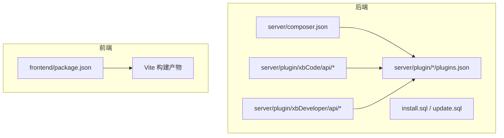
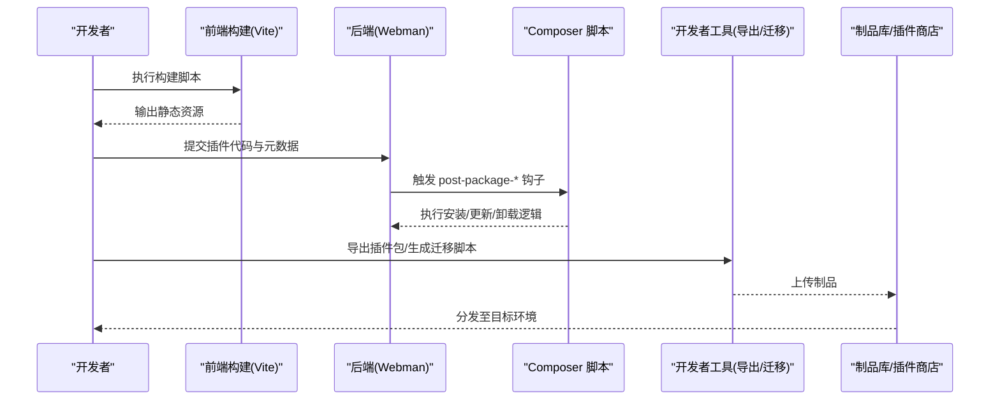
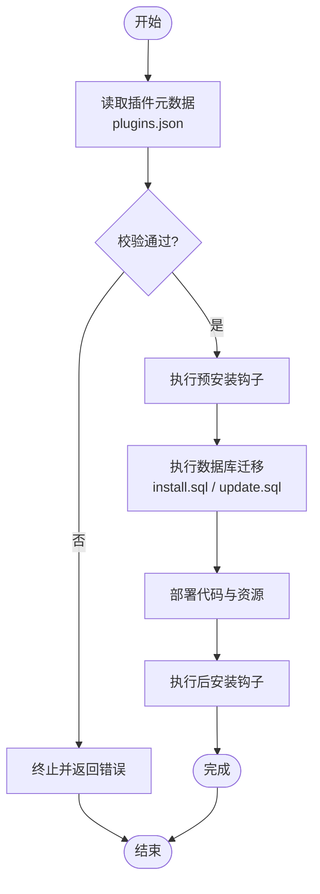
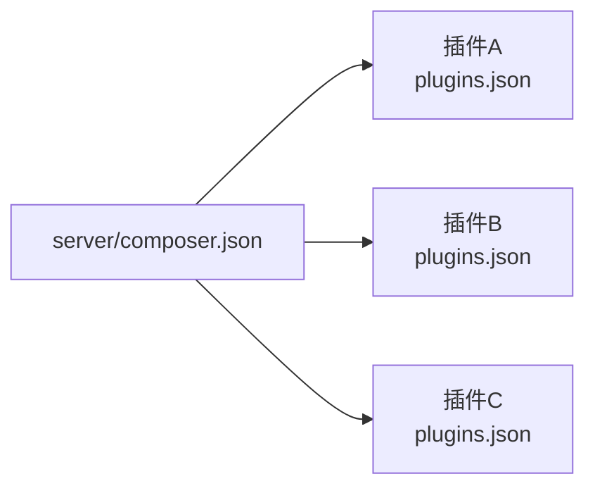

# 插件打包发布

<cite>
**本文引用的文件**
- [server/composer.json](file://server/composer.json)
- [server/plugin/xbCode/plugins.json](file://server/plugin/xbCode/plugins.json)
- [server/plugin/xbAiAsset/plugins.json](file://server/plugin/xbAiAsset/plugins.json)
- [server/plugin/xbAiModelAgent/plugins.json](file://server/plugin/xbAiModelAgent/plugins.json)
- [server/plugin/xbCode/api/Composer.php](file://server/plugin/xbCode/api/Composer.php)
- [server/plugin/xbCode/api/Packages.php](file://server/plugin/xbCode/api/Packages.php)
- [server/plugin/xbCode/api/PluginsApi.php](file://server/plugin/xbCode/api/PluginsApi.php)
- [server/plugin/xbCode/base/plugin/InstallTrait.php](file://server/plugin/xbCode/base/plugin/InstallTrait.php)
- [server/plugin/xbCode/base/plugin/UnInstallTrait.php](file://server/plugin/xbCode/base/plugin/UnInstallTrait.php)
- [server/plugin/xbDeveloper/api/DevelopmentApi.php](file://server/plugin/xbDeveloper/api/DevelopmentApi.php)
- [server/plugin/xbDeveloper/api/TableStructureApi.php](file://server/plugin/xbDeveloper/api/TableStructureApi.php)
- [server/plugin/xbDeveloper/api/PluginsCreate.php](file://server/plugin/xbDeveloper/api/PluginsCreate.php)
- [server/plugin/xbDeveloper/api/PluginsExport.php](file://server/plugin/xbDeveloper/api/PluginsExport.php)
- [frontend/package.json](file://frontend/package.json)
</cite>

## 目录
1. [简介](#简介)
2. [项目结构](#项目结构)
3. [核心组件](#核心组件)
4. [架构总览](#架构总览)
5. [详细组件分析](#详细组件分析)
6. [依赖分析](#依赖分析)
7. [性能考虑](#性能考虑)
8. [故障排查指南](#故障排查指南)
9. [结论](#结论)
10. [附录](#附录)

## 简介
本文件面向企业级场景，系统化说明该仓库中“插件”的打包与发布规范、版本管理策略、依赖声明、资源压缩、安全校验，以及安装、卸载、升级与回滚等运维流程。同时给出插件商店集成、自动化部署、灰度发布、监控告警的实现方案，并提供可落地的打包脚本与 CI/CD 流水线配置示例（以路径引用形式呈现）。

## 项目结构
本项目采用前后端分离：前端为 Vue + Vite 工程，后端基于 Webman 框架并以“插件化”组织业务模块。插件位于 server/plugin 下，每个插件包含自身元数据 plugins.json、API、模型、配置、数据库初始化脚本 install.sql 等。

图表来源
- [server/composer.json:1-99](file://server/composer.json#L1-L99)
- [server/plugin/xbCode/plugins.json:1-34](file://server/plugin/xbCode/plugins.json#L1-L34)
- [server/plugin/xbAiAsset/plugins.json:1-9](file://server/plugin/xbAiAsset/plugins.json#L1-L9)
- [server/plugin/xbAiModelAgent/plugins.json:1-9](file://server/plugin/xbAiModelAgent/plugins.json#L1-L9)
- [frontend/package.json:1-35](file://frontend/package.json#L1-L35)

章节来源
- [server/composer.json:1-99](file://server/composer.json#L1-L99)
- [frontend/package.json:1-35](file://frontend/package.json#L1-L35)

## 核心组件
- 插件元数据与发现
  - 每个插件根目录提供 plugins.json，描述标题、版本、作者、描述、主页及 composer 依赖映射。系统通过扫描 plugin 目录下的所有 plugins.json 完成插件清单发现与展示。
- 插件生命周期钩子
  - 在 composer 脚本中注册 post-package-install、post-package-update、pre-package-uninstall 钩子，分别调用 support\Plugin::install/uninstall 实现安装、更新、卸载时的统一处理。
- 开发工具链
  - 开发者插件提供导出、创建、表结构对比与迁移脚本生成能力，辅助打包与发布。

章节来源
- [server/plugin/xbCode/plugins.json:1-34](file://server/plugin/xbCode/plugins.json#L1-L34)
- [server/plugin/xbAiAsset/plugins.json:1-9](file://server/plugin/xbAiAsset/plugins.json#L1-L9)
- [server/plugin/xbAiModelAgent/plugins.json:1-9](file://server/plugin/xbAiModelAgent/plugins.json#L1-L9)
- [server/composer.json:80-90](file://server/composer.json#L80-L90)
- [server/plugin/xbCode/api/Composer.php:93-107](file://server/plugin/xbCode/api/Composer.php#L93-L107)
- [server/plugin/xbCode/api/Packages.php:30-131](file://server/plugin/xbCode/api/Packages.php#L30-L131)
- [server/plugin/xbCode/api/PluginsApi.php:77-485](file://server/plugin/xbCode/api/PluginsApi.php#L77-L485)
- [server/plugin/xbDeveloper/api/PluginsCreate.php:77-78](file://server/plugin/xbDeveloper/api/PluginsCreate.php#L77-L78)
- [server/plugin/xbDeveloper/api/PluginsExport.php:53](file://server/plugin/xbDeveloper/api/PluginsExport.php#L53)

## 架构总览
下图展示了从源码到制品的端到端流程：前端构建静态资源；后端按插件目录扫描元数据；composer 脚本触发安装/更新/卸载；开发者工具协助导出与迁移；最终产出可发布的压缩包或镜像。

图表来源
- [frontend/package.json:6-11](file://frontend/package.json#L6-L11)
- [server/composer.json:80-90](file://server/composer.json#L80-L90)
- [server/plugin/xbDeveloper/api/PluginsExport.php:53](file://server/plugin/xbDeveloper/api/PluginsExport.php#L53)

## 详细组件分析

### 插件打包格式与元数据
- 插件目录约定
  - 每个插件位于 server/plugin/{plugin_name}，必须包含 plugins.json。
  - 可选包含 install.sql、update/update.sql、public、config、app、api、enum、data 等目录。
- plugins.json 字段建议
  - title、version、author、desc、home_url、composer、plugins。
  - version 遵循语义化版本，用于升级与回滚判断。
  - composer 字段用于声明类名到 Composer 包的映射，便于运行时解析依赖。
- 打包产物
  - 推荐将单个插件目录打包为 zip/tar.gz，保留原始目录结构与权限。
  - 若为多插件整体发布，可将 server/plugin 下多个插件目录合并归档，并在制品中附带清单。

章节来源
- [server/plugin/xbCode/plugins.json:1-34](file://server/plugin/xbCode/plugins.json#L1-L34)
- [server/plugin/xbAiAsset/plugins.json:1-9](file://server/plugin/xbAiAsset/plugins.json#L1-L9)
- [server/plugin/xbAiModelAgent/plugins.json:1-9](file://server/plugin/xbAiModelAgent/plugins.json#L1-L9)
- [server/plugin/xbDeveloper/api/PluginsCreate.php:77-78](file://server/plugin/xbDeveloper/api/PluginsCreate.php#L77-L78)

### 版本管理与变更脚本
- 版本策略
  - 使用语义化版本（主.次.修订），在 plugins.json 中维护。
  - 重大不兼容变更提升主版本；新增功能提升次版本；修复问题提升修订版本。
- 数据库变更
  - 初始结构：install.sql。
  - 增量升级：update/update.sql（如存在）。
  - 开发者工具支持对比当前数据库结构与 install.sql，生成所需变更语句。
- 升级流程
  - 先执行 update/update.sql（如有），再替换代码与资源，最后重启服务或热重载。

章节来源
- [server/plugin/xbDeveloper/api/TableStructureApi.php:34-42](file://server/plugin/xbDeveloper/api/TableStructureApi.php#L34-L42)
- [server/plugin/xbDeveloper/api/DevelopmentApi.php:200-206](file://server/plugin/xbDeveloper/api/DevelopmentApi.php#L200-L206)

### 依赖声明与解析
- 插件内依赖
  - 在 plugins.json 的 composer 字段声明类名到 Composer 包的映射，便于运行时按需加载。
- 全局依赖
  - server/composer.json 声明项目级 PHP 依赖，并通过 scripts 钩子驱动插件安装/卸载。
- 依赖检查
  - 建议在打包前运行依赖解析与安全检查，确保无冲突与已知漏洞。

章节来源
- [server/plugin/xbCode/plugins.json:7-32](file://server/plugin/xbCode/plugins.json#L7-L32)
- [server/composer.json:31-68](file://server/composer.json#L31-L68)
- [server/composer.json:80-90](file://server/composer.json#L80-L90)

### 资源压缩与前端产物
- 前端构建
  - 使用 Vite 进行类型检查与生产构建，输出静态资源。
- 资源优化
  - 启用图片压缩、Tree Shaking、代码分割、缓存指纹等策略。
- 产物交付
  - 将构建产物随插件 public 目录一并打包，或通过 CDN 分发并记录版本号。

章节来源
- [frontend/package.json:6-11](file://frontend/package.json#L6-L11)

### 安全校验与签名
- 完整性校验
  - 对打包产物计算哈希（如 SHA-256），随制品一同发布，部署时校验一致性。
- 签名机制
  - 建议使用私钥对制品签名，部署侧使用公钥验签，防止篡改。
- 依赖审计
  - 在 CI 中执行依赖漏洞扫描，阻断高危风险包进入制品。

章节来源
- [server/composer.json:93-97](file://server/composer.json#L93-L97)

### 安装、卸载与升级流程
- 安装
  - 将插件目录放入 server/plugin，触发 composer 安装钩子，执行 install.sql。
- 卸载
  - 触发 pre-package-uninstall 钩子，清理数据与资源。
- 升级
  - 优先执行 update/update.sql，再替换代码与资源，必要时重启进程。

图表来源
- [server/composer.json:80-90](file://server/composer.json#L80-L90)
- [server/plugin/xbCode/base/plugin/InstallTrait.php:41](file://server/plugin/xbCode/base/plugin/InstallTrait.php#L41)
- [server/plugin/xbCode/base/plugin/UnInstallTrait.php:35](file://server/plugin/xbCode/base/plugin/UnInstallTrait.php#L35)
- [server/plugin/xbDeveloper/api/DevelopmentApi.php:200-206](file://server/plugin/xbDeveloper/api/DevelopmentApi.php#L200-L206)

章节来源
- [server/composer.json:80-90](file://server/composer.json#L80-L90)
- [server/plugin/xbCode/base/plugin/InstallTrait.php:41](file://server/plugin/xbCode/base/plugin/InstallTrait.php#L41)
- [server/plugin/xbCode/base/plugin/UnInstallTrait.php:35](file://server/plugin/xbCode/base/plugin/UnInstallTrait.php#L35)

### 插件商店集成
- 元数据同步
  - 通过扫描各插件 plugins.json 汇总清单，提供搜索、筛选、详情接口。
- 下载与安装
  - 客户端从商店拉取插件包，解压到 server/plugin，触发安装钩子。
- 版本与兼容性
  - 商店侧维护版本矩阵与依赖关系，避免不兼容组合。

章节来源
- [server/plugin/xbCode/api/Composer.php:93-107](file://server/plugin/xbCode/api/Composer.php#L93-L107)
- [server/plugin/xbCode/api/Packages.php:30-131](file://server/plugin/xbCode/api/Packages.php#L30-L131)
- [server/plugin/xbCode/api/PluginsApi.php:77-485](file://server/plugin/xbCode/api/PluginsApi.php#L77-L485)

### 自动化部署与灰度发布
- 蓝绿/金丝雀
  - 双实例并行部署，流量逐步切分，验证健康后再全量切换。
- 滚动更新
  - 逐个实例替换新版本，配合优雅停机与连接 draining。
- 快速回滚
  - 保留上一版本快照，失败时一键恢复。

章节来源
- [server/composer.json:80-90](file://server/composer.json#L80-L90)

### 监控告警
- 指标采集
  - 收集插件安装/卸载成功率、耗时、错误码分布。
- 日志聚合
  - 集中存储安装与迁移日志，便于定位问题。
- 告警规则
  - 设置失败率阈值、慢查询告警、磁盘空间告警等。

章节来源
- [server/composer.json:80-90](file://server/composer.json#L80-L90)

## 依赖分析
- 项目级依赖
  - server/composer.json 声明了 Webman 生态、ORM、队列、缓存、工作流、HTTP 客户端、部署工具等。
- 插件级依赖
  - 插件通过 plugins.json 的 composer 字段声明类到包的映射，运行时按需解析。
- 耦合与内聚
  - 插件间尽量通过 API 与事件解耦，减少直接依赖。

图表来源
- [server/composer.json:31-68](file://server/composer.json#L31-L68)
- [server/plugin/xbCode/plugins.json:7-32](file://server/plugin/xbCode/plugins.json#L7-L32)

章节来源
- [server/composer.json:31-68](file://server/composer.json#L31-L68)
- [server/plugin/xbCode/plugins.json:7-32](file://server/plugin/xbCode/plugins.json#L7-L32)

## 性能考虑
- 构建期优化
  - 前端启用 Tree Shaking、代码分割、图片压缩；后端禁用调试模式，开启 OPcache。
- 运行时优化
  - 合理划分队列任务，避免长事务；数据库索引与查询优化；静态资源走 CDN。
- 资源瘦身
  - 仅打包必要文件，剔除测试与文档；公共库复用，减少重复体积。

[本节为通用指导，无需具体文件来源]

## 故障排查指南
- 常见问题
  - 插件未生效：检查 plugins.json 是否存在且字段完整；确认扫描路径正确。
  - 安装失败：查看 composer 钩子日志与 SQL 执行结果；核对数据库权限与字符集。
  - 升级异常：确认 update/update.sql 顺序与幂等性；必要时回滚到上一版本。
- 诊断步骤
  - 查看安装/卸载钩子执行日志；比对 install.sql 与当前库结构差异；复现最小用例。

章节来源
- [server/composer.json:80-90](file://server/composer.json#L80-L90)
- [server/plugin/xbDeveloper/api/TableStructureApi.php:34-42](file://server/plugin/xbDeveloper/api/TableStructureApi.php#L34-L42)

## 结论
通过统一的插件元数据、标准化的生命周期钩子、完善的开发者工具链与 CI/CD 流水线，可实现企业级插件的高可靠打包与发布。结合灰度发布、快速回滚与完善监控告警，可在保障稳定性的前提下持续迭代。

[本节为总结，无需具体文件来源]

## 附录

### 打包脚本参考（路径）
- 前端构建
  - [frontend/package.json:6-11](file://frontend/package.json#L6-L11)
- 后端打包
  - 打包单个插件目录为 zip，保留 plugins.json 与 install.sql
  - 打包多插件合集，附带清单与校验文件
- 依赖与安全检查
  - 在 CI 中执行依赖解析与安全审计，阻断高风险制品

章节来源
- [frontend/package.json:6-11](file://frontend/package.json#L6-L11)
- [server/plugin/xbDeveloper/api/PluginsExport.php:53](file://server/plugin/xbDeveloper/api/PluginsExport.php#L53)

### CI/CD 流水线示例（路径）
- 触发条件
  - 推送 tag 或合并到主干分支
- 阶段
  - 构建前端产物
  - 扫描插件元数据与依赖
  - 执行单元测试与集成测试
  - 生成制品与校验文件
  - 上传制品库并标记版本
  - 触发灰度部署与验收

章节来源
- [frontend/package.json:6-11](file://frontend/package.json#L6-L11)
- [server/composer.json:80-90](file://server/composer.json#L80-L90)

### 灰度与回滚策略（路径）
- 灰度
  - 小流量先行，观察关键指标与错误率
- 回滚
  - 保留上一版本快照，失败即回滚
  - 数据库变更需具备幂等与回退脚本

章节来源
- [server/composer.json:80-90](file://server/composer.json#L80-L90)

### 监控与告警（路径）
- 指标
  - 安装/卸载成功率、耗时、SQL 执行时长
- 日志
  - 集中收集安装与迁移日志
- 告警
  - 失败率、慢查询、磁盘空间、内存占用

章节来源
- [server/composer.json:80-90](file://server/composer.json#L80-L90)