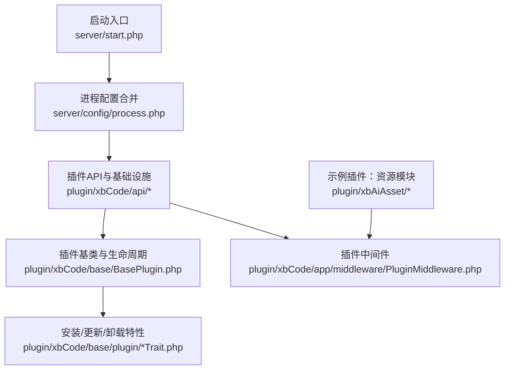
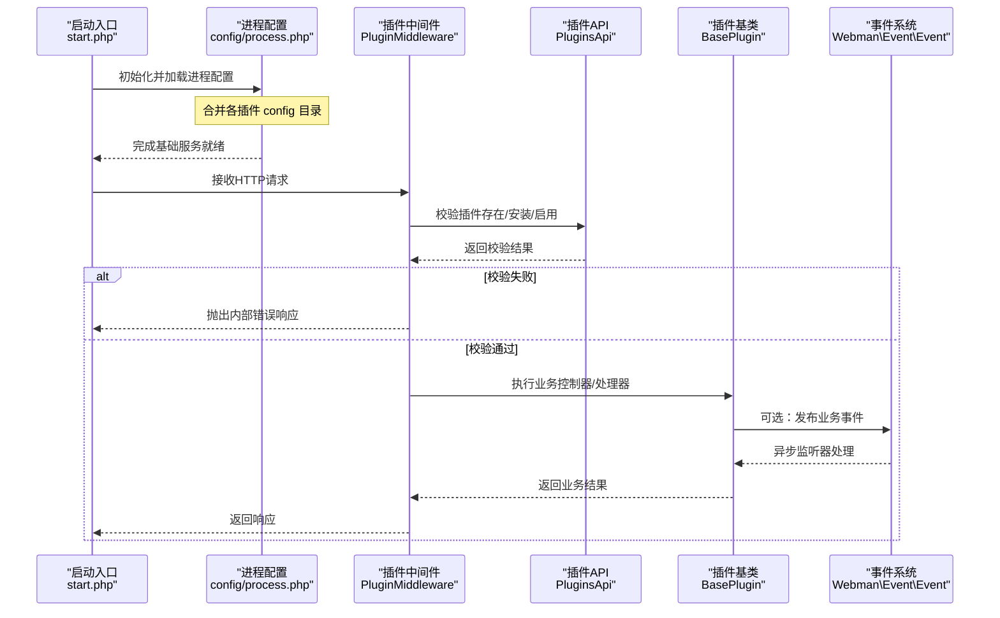
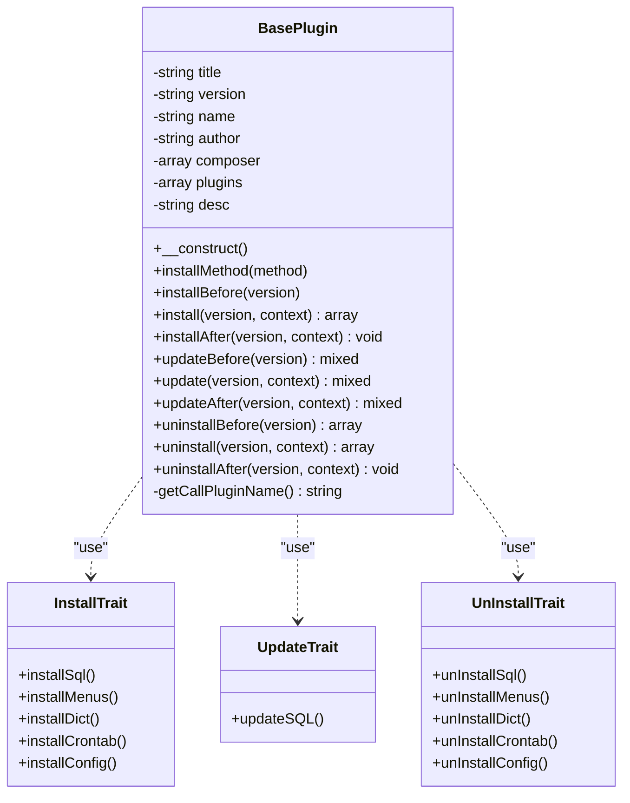
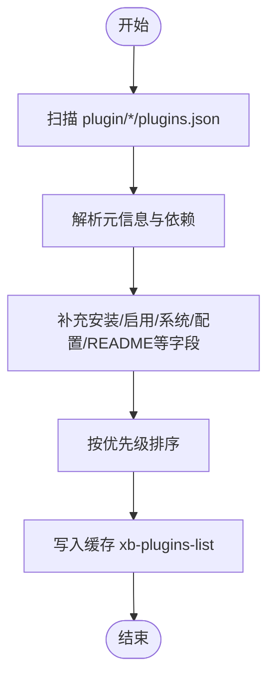
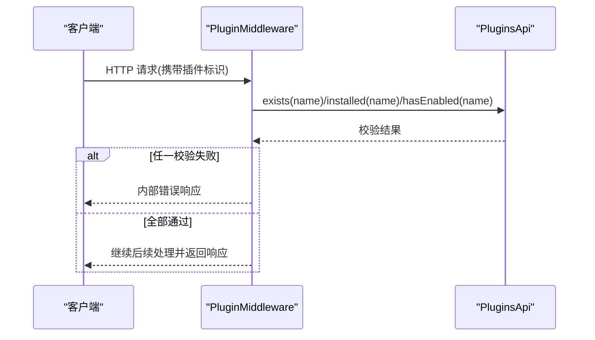
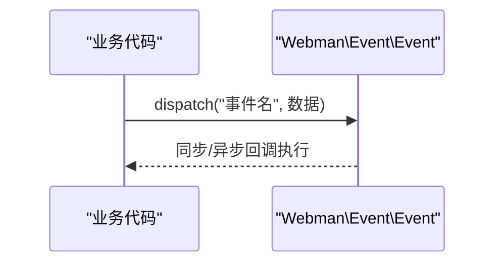
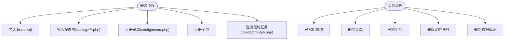
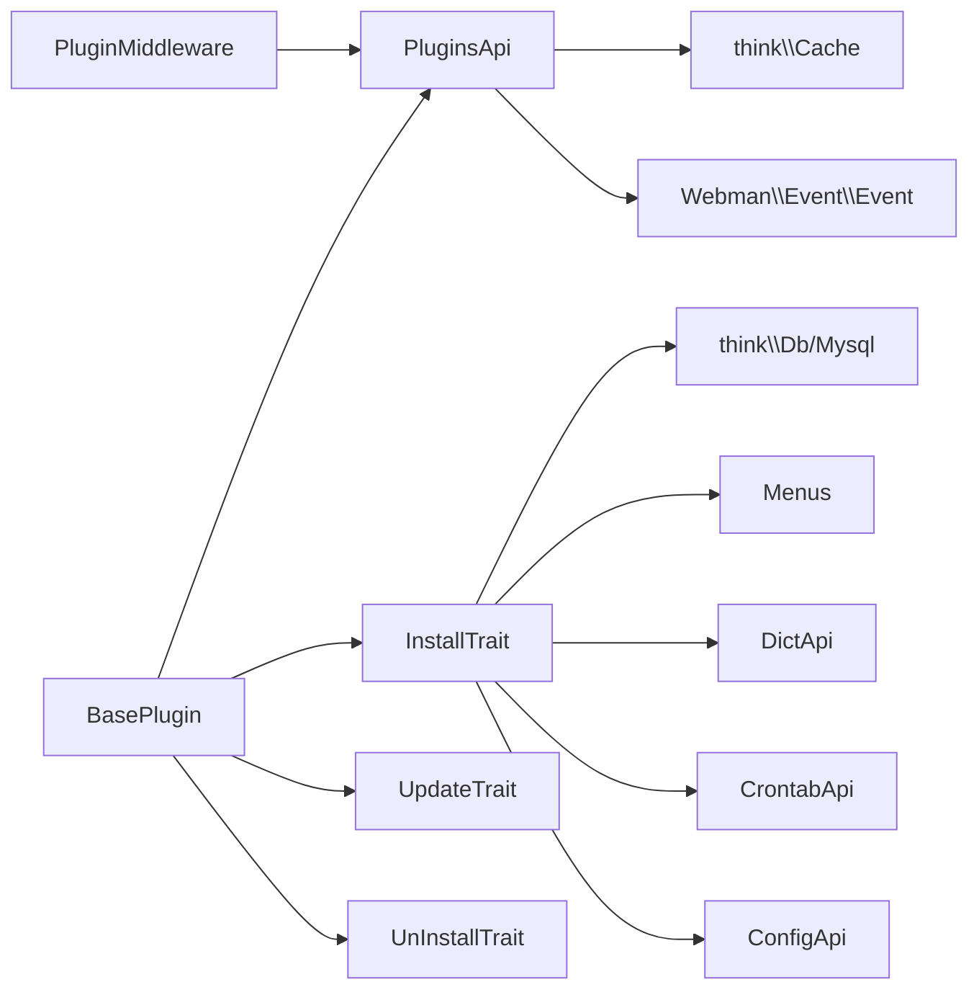

# 插件架构设计

<cite>
**本文引用的文件**   
- [start.php](file://server/start.php)
- [BasePlugin.php](file://server/plugin\xbCode\base\BasePlugin.php)
- [PluginsApi.php](file://server/plugin\xbCode\api\PluginsApi.php)
- [InstallTrait.php](file://server/plugin\xbCode\base\plugin\InstallTrait.php)
- [UpdateTrait.php](file://server/plugin\xbCode\base\plugin\UpdateTrait.php)
- [UnInstallTrait.php](file://server/plugin\xbCode\base\plugin\UnInstallTrait.php)
- [PluginMiddleware.php](file://server/plugin\xbCode\app\middleware\PluginMiddleware.php)
- [process.php](file://server/config/process.php)
- [AssetApi.php](file://server/plugin\xbAiAsset\api\AssetApi.php)
</cite>

## 目录
1. [简介](#简介)
2. [项目结构](#项目结构)
3. [核心组件](#核心组件)
4. [架构总览](#架构总览)
5. [详细组件分析](#详细组件分析)
6. [依赖关系分析](#依赖关系分析)
7. [性能与扩展性](#性能与扩展性)
8. [故障排查指南](#故障排查指南)
9. [结论](#结论)
10. [附录：规范与约定](#附录：规范与约定)

## 简介
本文件系统化梳理 Webman 环境下的插件架构，围绕以下关键点展开：
- 插件基类 BasePlugin 的设计模式与生命周期钩子
- 插件注册与发现机制（基于 plugins.json 的扫描、缓存与状态管理）
- 中间件集成（请求级插件存在/安装/启用校验）
- 事件系统对接（Webman Event 在业务中的使用）
- 配置项、菜单、字典、定时任务、数据库脚本等资源的加载与清理
- 命名空间与目录结构约定，便于开发者快速上手

## 项目结构
服务器端采用“应用 + 插件”的分层组织方式。核心框架位于 server 根目录，插件统一放置在 plugin 目录下，每个插件以独立目录表示，并通过 plugins.json 描述元信息。

图表来源
- [start.php:1-6](file://server/start.php#L1-L6)
- [process.php:25](file://server/config/process.php#L25-L25)
- [PluginsApi.php:77-136](file://server/plugin\xbCode\api\PluginsApi.php#L77-L136)
- [BasePlugin.php:26-109](file://server/plugin\xbCode\base\BasePlugin.php#L26-L109)
- [PluginMiddleware.php:24-79](file://server/plugin\xbCode\app\middleware\PluginMiddleware.php#L24-L79)

章节来源
- [start.php:1-6](file://server/start.php#L1-L6)
- [process.php:25](file://server/config/process.php#L25-L25)

## 核心组件
- 插件基类 BasePlugin：定义插件元数据、生命周期方法（install/update/uninstall 及其前后置），并组合安装/更新/卸载特性。
- 插件 API PluginsApi：负责插件发现、列表构建、缓存、状态变更、依赖检查、README 读取、包信息解析等。
- 安装/更新/卸载特性：分别封装数据库脚本导入、菜单/字典/定时任务/配置的写入与清理逻辑。
- 插件中间件：在请求进入时校验插件是否存在、已安装且已启用，拦截非法访问。
- 事件系统：通过 Webman\Event\Event 在业务关键路径上发布事件，供其他插件或监听器消费。

章节来源
- [BasePlugin.php:26-109](file://server/plugin\xbCode\base\BasePlugin.php#L26-L109)
- [PluginsApi.php:77-136](file://server/plugin\xbCode\api\PluginsApi.php#L77-L136)
- [InstallTrait.php:25-173](file://server/plugin\xbCode\base\plugin\InstallTrait.php#L25-L173)
- [UpdateTrait.php:20-48](file://server/plugin\xbCode\base\plugin\UpdateTrait.php#L20-L48)
- [UnInstallTrait.php:25-173](file://server/plugin\xbCode\base\plugin\UnInstallTrait.php#L25-L173)
- [PluginMiddleware.php:24-79](file://server/plugin\xbCode\app\middleware\PluginMiddleware.php#L24-L79)
- [AssetApi.php:92-101](file://server/plugin\xbAiAsset\api\AssetApi.php#L92-L101)

## 架构总览
下图展示从启动到请求处理的插件体系交互，包括插件发现、中间件校验、事件分发等关键环节。

图表来源
- [start.php:1-6](file://server/start.php#L1-L6)
- [process.php:25](file://server/config/process.php#L25-L25)
- [PluginMiddleware.php:34-79](file://server/plugin\xbCode\app\middleware\PluginMiddleware.php#L34-L79)
- [PluginsApi.php:578-598](file://server/plugin\xbCode\api\PluginsApi.php#L578-L598)
- [BasePlugin.php:164-202](file://server/plugin\xbCode\base\BasePlugin.php#L164-L202)
- [AssetApi.php:92-101](file://server/plugin\xbAiAsset\api\AssetApi.php#L92-L101)

## 详细组件分析

### 插件基类 BasePlugin 与生命周期
- 设计要点
  - 通过构造函数自动推断当前调用类的插件标识，并从插件信息中注入元数据（名称、版本、作者、描述、Composer 依赖、插件依赖）。
  - 提供 installBefore/install/installAfter、updateBefore/update/updateAfter、uninstallBefore/uninstall/uninstallAfter 完整生命周期钩子。
  - 组合 InstallTrait/UpdateTrait/UnInstallTrait，实现数据库、菜单、字典、定时任务、配置的统一安装与卸载流程。
- 关键行为
  - installBefore：优先执行 Composer 依赖安装与插件依赖检测；若缺失则触发安装流程。
  - install：顺序执行数据库脚本、配置、菜单、字典、定时任务的安装；异常时回滚卸载。
  - update：按版本号定位 SQL 并执行导入。
  - uninstall：反向清理配置、菜单、字典、定时任务、数据库表。

图表来源
- [BasePlugin.php:26-109](file://server/plugin\xbCode\base\BasePlugin.php#L26-L109)
- [InstallTrait.php:25-173](file://server/plugin\xbCode\base\plugin\InstallTrait.php#L25-L173)
- [UpdateTrait.php:20-48](file://server/plugin\xbCode\base\plugin\UpdateTrait.php#L20-L48)
- [UnInstallTrait.php:25-173](file://server/plugin\xbCode\base\plugin\UnInstallTrait.php#L25-L173)

章节来源
- [BasePlugin.php:26-109](file://server/plugin\xbCode\base\BasePlugin.php#L26-L109)
- [BasePlugin.php:117-202](file://server/plugin\xbCode\base\BasePlugin.php#L117-L202)
- [BasePlugin.php:211-249](file://server/plugin\xbCode\base\BasePlugin.php#L211-L249)
- [BasePlugin.php:258-305](file://server/plugin\xbCode\base\BasePlugin.php#L258-L305)
- [InstallTrait.php:25-173](file://server/plugin\xbCode\base\plugin\InstallTrait.php#L25-L173)
- [UpdateTrait.php:20-48](file://server/plugin\xbCode\base\plugin\UpdateTrait.php#L20-L48)
- [UnInstallTrait.php:25-173](file://server/plugin\xbCode\base\plugin\UnInstallTrait.php#L25-L173)

### 插件注册与发现机制
- 发现规则
  - 扫描 server/plugin/*/plugins.json，解析插件元信息，补充安装/启用/系统插件/是否含配置/是否有 README 等字段，并按优先级排序。
  - 支持从压缩包内提取 plugins.json 进行预览与校验。
- 缓存策略
  - 使用 think-cache 缓存插件列表键名 xb-plugins-list，避免频繁 IO。
- 状态管理
  - 通过 Plugins::state 修改启用状态后刷新缓存，并派发事件 xbCode.Plugins.state。
- 依赖检查
  - 提供 hasPluginDepend/hasPluginDependThrow 防止卸载被依赖插件。

图表来源
- [PluginsApi.php:77-136](file://server/plugin\xbCode\api\PluginsApi.php#L77-L136)
- [PluginsApi.php:144-153](file://server/plugin\xbCode\api\PluginsApi.php#L144-L153)
- [PluginsApi.php:578-598](file://server/plugin\xbCode\api\PluginsApi.php#L578-L598)
- [PluginsApi.php:655-683](file://server/plugin\xbCode\api\PluginsApi.php#L655-L683)

章节来源
- [PluginsApi.php:77-136](file://server/plugin\xbCode\api\PluginsApi.php#L77-L136)
- [PluginsApi.php:144-153](file://server/plugin\xbCode\api\PluginsApi.php#L144-L153)
- [PluginsApi.php:578-598](file://server/plugin\xbCode\api\PluginsApi.php#L578-L598)
- [PluginsApi.php:655-683](file://server/plugin\xbCode\api\PluginsApi.php#L655-L683)

### 中间件集成与请求校验
- 作用
  - 在请求进入阶段校验目标插件是否存在、已安装且已启用，防止未授权访问。
- 流程
  - 若为开发调试环境或静态资源（如 preview.svg）可跳过校验。
  - 校验失败直接抛出内部错误响应。

图表来源
- [PluginMiddleware.php:34-79](file://server/plugin\xbCode\app\middleware\PluginMiddleware.php#L34-L79)
- [PluginsApi.php:266-311](file://server/plugin\xbCode\api\PluginsApi.php#L266-L311)

章节来源
- [PluginMiddleware.php:34-79](file://server/plugin\xbCode\app\middleware\PluginMiddleware.php#L34-L79)

### 事件系统对接
- 插件可在业务关键路径发布事件，例如资源创建/更新/删除的前后置事件，供其他插件或监听器订阅。
- 插件状态变更也会触发系统事件，便于外部监听与联动。

图表来源
- [AssetApi.php:92-101](file://server/plugin\xbAiAsset\api\AssetApi.php#L92-L101)
- [PluginsApi.php:594-598](file://server/plugin\xbCode\api\PluginsApi.php#L594-L598)

章节来源
- [AssetApi.php:92-101](file://server/plugin\xbAiAsset\api\AssetApi.php#L92-L101)
- [PluginsApi.php:594-598](file://server/plugin\xbCode\api\PluginsApi.php#L594-L598)

### 资源加载机制（配置/菜单/字典/定时任务/数据库）
- 配置文件
  - 安装时遍历 setting 分组与选项卡配置，将表单化配置持久化至配置中心。
  - 卸载时根据同名配置项逐一删除。
- 菜单
  - 安装时读取 config/menu.php 并注册；卸载时按插件标识清理。
- 字典
  - 安装/卸载时调用字典插件 API 进行增删。
- 定时任务
  - 安装/卸载时读取 config/crontab.php 并调用定时任务插件 API 注册/移除。
- 数据库
  - 安装时导入 install.sql（替换前缀）；卸载时解析 SQL 获取表名并批量删除；更新时按版本导入 update/{version}.sql。

图表来源
- [InstallTrait.php:33-173](file://server/plugin\xbCode\base\plugin\InstallTrait.php#L33-L173)
- [UnInstallTrait.php:33-173](file://server/plugin\xbCode\base\plugin\UnInstallTrait.php#L33-L173)
- [UpdateTrait.php:28-47](file://server/plugin\xbCode\base\plugin\UpdateTrait.php#L28-L47)

章节来源
- [InstallTrait.php:33-173](file://server/plugin\xbCode\base\plugin\InstallTrait.php#L33-L173)
- [UnInstallTrait.php:33-173](file://server/plugin\xbCode\base\plugin\UnInstallTrait.php#L33-L173)
- [UpdateTrait.php:28-47](file://server/plugin\xbCode\base\plugin\UpdateTrait.php#L28-L47)

## 依赖关系分析
- 组件耦合
  - BasePlugin 强依赖 PluginsApi 获取自身元数据；通过 Trait 组合对外部子系统（数据库、菜单、字典、定时任务、配置）进行解耦。
  - PluginMiddleware 仅依赖 PluginsApi 做轻量校验，不侵入业务逻辑。
  - 事件系统作为横向能力，由业务侧按需发布，降低耦合度。
- 外部依赖
  - Webman\Event\Event：事件总线
  - support\think\Cache：缓存
  - support\think\Db / Mysql：数据库操作
  - 第三方插件 API（如 DictApi、CrontabApi、ConfigApi）：功能扩展点

图表来源
- [BasePlugin.php:26-109](file://server/plugin\xbCode\base\BasePlugin.php#L26-L109)
- [PluginsApi.php:144-153](file://server/plugin\xbCode\api\PluginsApi.php#L144-L153)
- [PluginsApi.php:594-598](file://server/plugin\xbCode\api\PluginsApi.php#L594-L598)
- [InstallTrait.php:25-173](file://server/plugin\xbCode\base\plugin\InstallTrait.php#L25-L173)
- [PluginMiddleware.php:34-79](file://server/plugin\xbCode\app\middleware\PluginMiddleware.php#L34-L79)

章节来源
- [BasePlugin.php:26-109](file://server/plugin\xbCode\base\BasePlugin.php#L26-L109)
- [PluginsApi.php:144-153](file://server/plugin\xbCode\api\PluginsApi.php#L144-L153)
- [PluginsApi.php:594-598](file://server/plugin\xbCode\api\PluginsApi.php#L594-L598)
- [InstallTrait.php:25-173](file://server/plugin\xbCode\base\plugin\InstallTrait.php#L25-L173)
- [PluginMiddleware.php:34-79](file://server/plugin\xbCode\app\middleware\PluginMiddleware.php#L34-L79)

## 性能与扩展性
- 缓存优化
  - 插件列表通过缓存键 xb-plugins-list 减少 IO 与 JSON 解析开销，状态变更后主动刷新缓存。
- 懒加载与按需启用
  - 中间件仅在需要时校验插件状态，避免全局重逻辑。
- 可扩展点
  - 通过事件系统在业务关键路径插入横切逻辑，无需修改主流程。
  - 通过 Trait 组合复用安装/更新/卸载通用能力，新增插件只需声明元信息与资源文件。

[本节为通用指导，不涉及具体文件分析]

## 故障排查指南
- 常见问题
  - 插件未安装或未启用导致接口拒绝访问：检查中间件校验与 PluginsApi 的状态判断。
  - 安装失败自动回滚：install 捕获异常后尝试执行 uninstall，查看日志定位失败步骤。
  - 依赖缺失：installBefore 会尝试安装 Composer 依赖与插件依赖，确认网络与仓库可达。
- 建议
  - 关注日志输出（安装/更新/卸载异常均记录错误日志）。
  - 使用 getReadme 与 previewUrl 辅助诊断插件完整性。

章节来源
- [PluginMiddleware.php:51-79](file://server/plugin\xbCode\app\middleware\PluginMiddleware.php#L51-L79)
- [BasePlugin.php:164-189](file://server/plugin\xbCode\base\BasePlugin.php#L164-L189)
- [BasePlugin.php:211-236](file://server/plugin\xbCode\base\BasePlugin.php#L211-L236)
- [PluginsApi.php:557-567](file://server/plugin\xbCode\api\PluginsApi.php#L557-L567)

## 结论
该插件体系以 BasePlugin 为核心抽象，结合 Traits 实现统一的资源管理与生命周期控制；通过 PluginsApi 完成插件的发现、缓存与状态管理；借助中间件保障运行时安全；利用事件系统实现松耦合的业务扩展。整体设计清晰、职责分明，具备良好的可维护性与扩展性。

[本节为总结性内容，不涉及具体文件分析]

## 附录：规范与约定
- 目录结构约定
  - 插件根目录：server/plugin/<插件标识>/
  - 插件元信息：plugins.json（必填）
  - 安装脚本：install.sql（可选）
  - 版本升级脚本：update/<版本>.sql（可选）
  - 配置项：setting/<分组>/<选项卡或普通>.php（可选）
  - 菜单：config/menu.php（可选）
  - 定时任务：config/crontab.php（可选）
  - 文档：README.md 或 readme.md（可选）
- 命名空间约定
  - 插件类命名空间遵循 plugin/<插件标识>\...
  - 安装入口类通常为 plugin/<插件标识>\api\Install，继承 BasePlugin
- 配置文件格式
  - 普通配置：数组项包含 name/type/value 等字段
  - 选项卡配置：body 为普通配置数组，外层包含 name 等元信息
- 资源加载机制
  - 安装时按固定路径与约定格式加载上述资源；卸载时按相同约定反向清理
- 事件约定
  - 业务事件命名建议采用领域前缀+动作（如 ASSET_CREATE_BEFORE）
  - 插件状态变更事件：xbCode.Plugins.state

[本节为通用规范说明，不涉及具体文件分析]