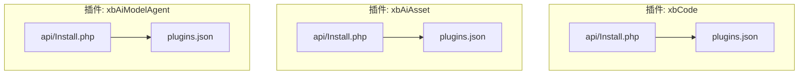
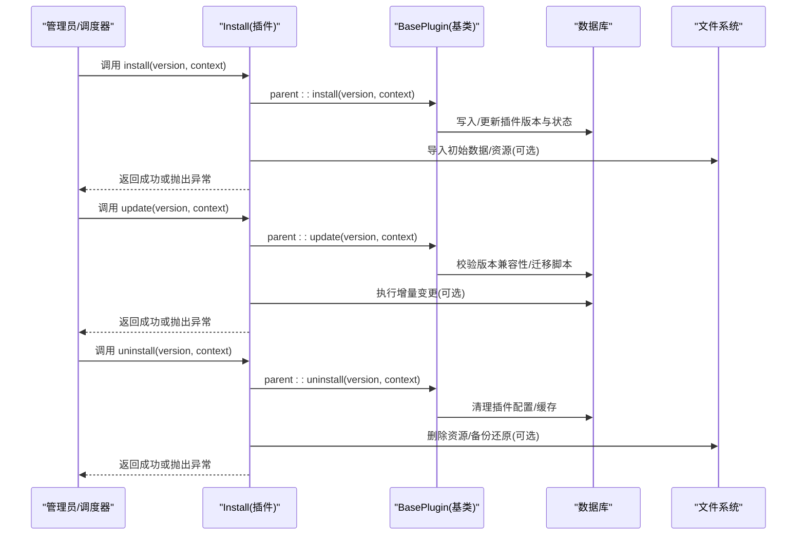
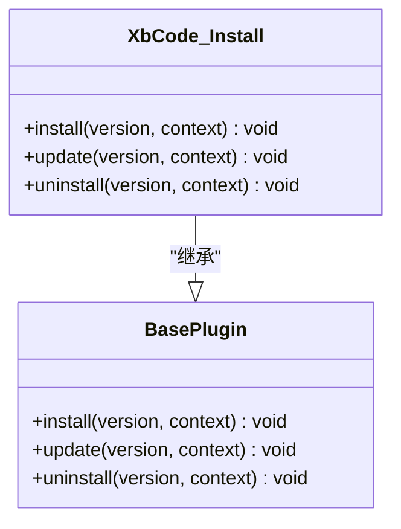
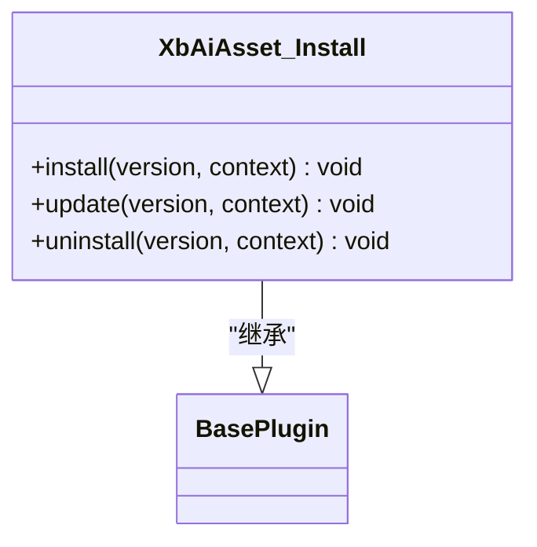
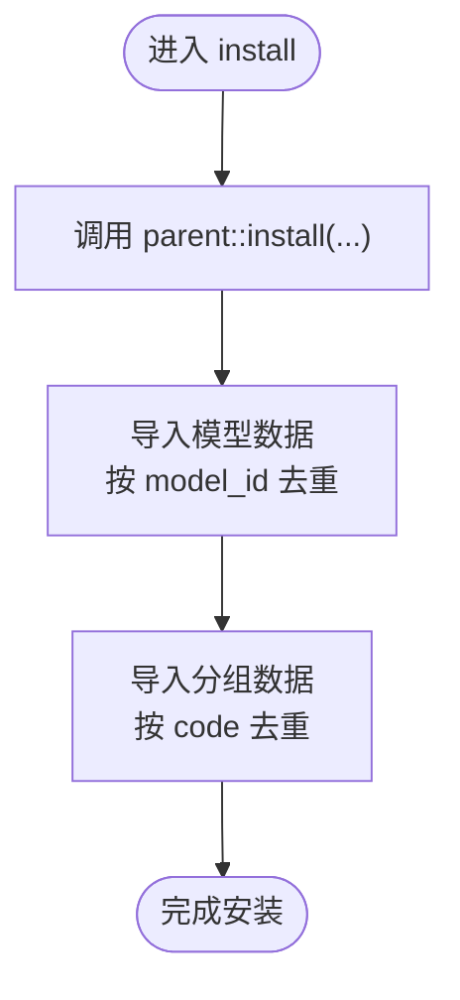
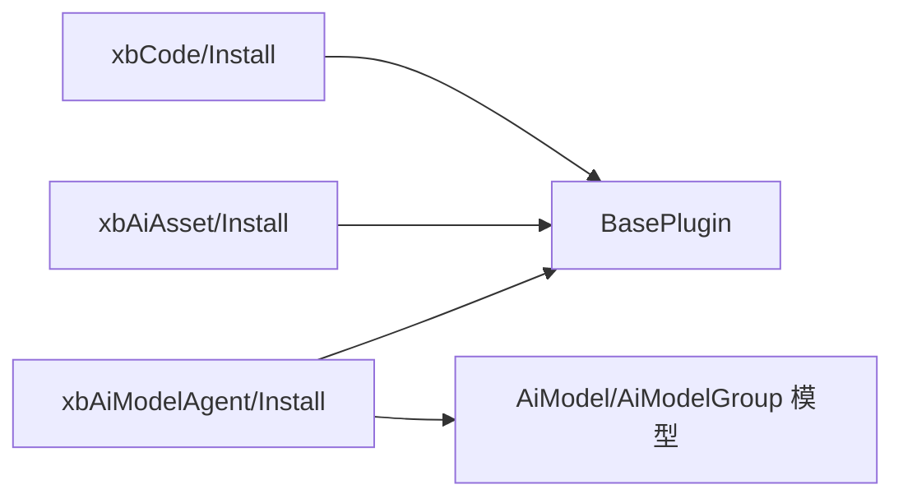

# 插件生命周期管理

<cite>
**本文引用的文件**   
- [server/plugin/xbCode/api/Install.php](file://server/plugin/xbCode/api/Install.php)
- [server/plugin/xbAiAsset/api/Install.php](file://server/plugin/xbAiAsset/api/Install.php)
- [server/plugin/xbAiModelAgent/api/Install.php](file://server/plugin/xbAiModelAgent/api/Install.php)
- [server/plugin/xbCode/plugins.json](file://server/plugin/xbCode/plugins.json)
- [server/plugin/xbAiAsset/plugins.json](file://server/plugin/xbAiAsset/plugins.json)
- [server/plugin/xbAiModelAgent/plugins.json](file://server/plugin/xbAiModelAgent/plugins.json)
</cite>

## 目录
1. [简介](#简介)
2. [项目结构](#项目结构)
3. [核心组件](#核心组件)
4. [架构总览](#架构总览)
5. [详细组件分析](#详细组件分析)
6. [依赖分析](#依赖分析)
7. [性能考虑](#性能考虑)
8. [故障排查指南](#故障排查指南)
9. [结论](#结论)
10. [附录](#附录)

## 简介
本文件围绕“插件生命周期管理”展开，聚焦安装、更新、卸载等关键阶段的生命周期钩子与实现要点。结合仓库中多个插件的 Install 类与 plugins.json 元数据，梳理出统一的插件生命周期模型：安装前检查、安装执行、安装后置处理、更新前置验证、版本升级、卸载前清理、卸载执行、卸载后处理。文档同时给出状态管理、事务处理、错误恢复与回滚机制的设计建议，帮助在现有代码基础上构建健壮、可观测、可回滚的插件生命周期体系。

## 项目结构
仓库采用多插件并列的组织方式，每个插件包含独立的 api、app、config、data、enum、public、setting、skills 等目录，并在根目录提供 plugins.json 描述插件元信息（标题、版本、作者等）。生命周期入口集中在各插件的 api/Install.php，通过继承统一基类 BasePlugin 来复用通用能力。

图表来源
- [server/plugin/xbCode/api/Install.php](file://server/plugin/xbCode/api/Install.php)
- [server/plugin/xbCode/plugins.json](file://server/plugin/xbCode/plugins.json)
- [server/plugin/xbAiAsset/api/Install.php](file://server/plugin/xbAiAsset/api/Install.php)
- [server/plugin/xbAiAsset/plugins.json](file://server/plugin/xbAiAsset/plugins.json)
- [server/plugin/xbAiModelAgent/api/Install.php](file://server/plugin/xbAiModelAgent/api/Install.php)
- [server/plugin/xbAiModelAgent/plugins.json](file://server/plugin/xbAiModelAgent/plugins.json)

章节来源
- [server/plugin/xbCode/api/Install.php](file://server/plugin/xbCode/api/Install.php)
- [server/plugin/xbCode/plugins.json](file://server/plugin/xbCode/plugins.json)
- [server/plugin/xbAiAsset/api/Install.php](file://server/plugin/xbAiAsset/api/Install.php)
- [server/plugin/xbAiAsset/plugins.json](file://server/plugin/xbAiAsset/plugins.json)
- [server/plugin/xbAiModelAgent/api/Install.php](file://server/plugin/xbAiModelAgent/api/Install.php)
- [server/plugin/xbAiModelAgent/plugins.json](file://server/plugin/xbAiModelAgent/plugins.json)

## 核心组件
- 插件安装/更新/卸载入口：各插件的 api/Install.php 暴露 install/update/uninstall 三个方法，作为生命周期钩子的承载点。
- 插件元数据：plugins.json 提供 title、version、author、desc 等元信息，用于版本比对、展示与校验。
- 基类能力：Install 类均继承自 BasePlugin，调用 parent::install/update/uninstall 以复用框架提供的通用流程（如记录版本、持久化状态等）。

章节来源
- [server/plugin/xbCode/api/Install.php](file://server/plugin/xbCode/api/Install.php)
- [server/plugin/xbAiAsset/api/Install.php](file://server/plugin/xbAiAsset/api/Install.php)
- [server/plugin/xbAiModelAgent/api/Install.php](file://server/plugin/xbAiModelAgent/api/Install.php)
- [server/plugin/xbCode/plugins.json](file://server/plugin/xbCode/plugins.json)
- [server/plugin/xbAiAsset/plugins.json](file://server/plugin/xbAiAsset/plugins.json)
- [server/plugin/xbAiModelAgent/plugins.json](file://server/plugin/xbAiModelAgent/plugins.json)

## 架构总览
下图展示了插件生命周期的端到端流程，从触发到各个阶段的顺序关系，以及异常与回滚路径。

图表来源
- [server/plugin/xbCode/api/Install.php](file://server/plugin/xbCode/api/Install.php)
- [server/plugin/xbAiAsset/api/Install.php](file://server/plugin/xbAiAsset/api/Install.php)
- [server/plugin/xbAiModelAgent/api/Install.php](file://server/plugin/xbAiModelAgent/api/Install.php)

## 详细组件分析

### 组件一：xbCode 插件生命周期
- 职责：作为核心框架插件，提供基础能力；其 Install 类仅透传至基类，体现“最小侵入”的原则。
- 关键点：
  - install/update/uninstall 均直接委托给 BasePlugin，便于集中维护通用逻辑。
  - 若需扩展，可在子类中追加自定义步骤，但应遵循“先父类、后自身”的顺序，确保状态一致性。

图表来源
- [server/plugin/xbCode/api/Install.php](file://server/plugin/xbCode/api/Install.php)

章节来源
- [server/plugin/xbCode/api/Install.php](file://server/plugin/xbCode/api/Install.php)

### 组件二：xbAiAsset 插件生命周期
- 职责：AI资产相关功能；Install 类同样委托基类，并预留扩展点。
- 关键点：
  - 安装/更新/卸载方法签名一致，便于统一编排。
  - 建议在 install 中完成必要的初始化（如默认配置、索引重建），在 uninstall 中完成资源回收。

图表来源
- [server/plugin/xbAiAsset/api/Install.php](file://server/plugin/xbAiAsset/api/Install.php)

章节来源
- [server/plugin/xbAiAsset/api/Install.php](file://server/plugin/xbAiAsset/api/Install.php)

### 组件三：xbAiModelAgent 插件生命周期
- 职责：AI模型网关代理；Install 类在安装时导入模型与分组数据，体现了“安装后置处理”的典型用法。
- 关键点：
  - install 中调用 importModels/importGroups，将 data 下的静态数据写入数据库。
  - 导入逻辑具备幂等性：按唯一键判重，避免重复插入。
  - 建议在 update 中增加版本迁移脚本，在 uninstall 中清理关联数据。

图表来源
- [server/plugin/xbAiModelAgent/api/Install.php](file://server/plugin/xbAiModelAgent/api/Install.php)

章节来源
- [server/plugin/xbAiModelAgent/api/Install.php](file://server/plugin/xbAiModelAgent/api/Install.php)

### 生命周期阶段详解与最佳实践
- 安装前检查
  - 目标：校验环境、依赖、权限、磁盘空间、数据库连接等。
  - 建议：在 install 方法开头进行快速失败检查，尽早返回明确错误信息。
- 安装执行
  - 目标：创建表结构、写入初始数据、注册路由/中间件/事件监听器等。
  - 建议：使用事务包裹所有写操作，保证原子性；对幂等性要求高的数据写入采用“存在即跳过”。
- 安装后置处理
  - 目标：重建索引、预热缓存、生成静态资源、发送通知等。
  - 建议：将耗时任务放入队列异步执行，避免阻塞主流程。
- 更新前置验证
  - 目标：对比当前版本与目标版本，判断是否需要迁移；校验目标版本兼容性。
  - 建议：在 update 方法中先做兼容性与依赖检查，再执行迁移。
- 版本升级
  - 目标：执行增量变更（DDL/DML）、配置项迁移、数据清洗。
  - 建议：为每个小版本编写独立迁移脚本，支持回滚；记录迁移日志。
- 卸载前清理
  - 目标：停止定时任务、释放锁、关闭长连接、导出必要数据。
  - 建议：提供“软卸载”选项，保留审计数据。
- 卸载执行
  - 目标：删除表结构、清理缓存、移除路由/中间件/监听器。
  - 建议：使用事务，确保一致性；对大表删除采用分批策略。
- 卸载后处理
  - 目标：清理临时文件、归档日志、通知外部系统。
  - 建议：异步执行，避免阻塞卸载主流程。

### 参数传递与上下文
- 标准签名：install/update/uninstall(string $version, mixed $context = null)
- version：目标版本号，用于迁移决策与日志记录。
- context：扩展上下文，可传入用户ID、租户ID、操作来源、是否强制覆盖等。

### 异常处理与回滚机制
- 异常处理
  - 在关键步骤捕获异常并记录结构化日志（包含插件名、版本、上下文、堆栈）。
  - 对外返回明确的错误码与消息，便于前端提示与重试。
- 回滚机制
  - 数据库层：使用事务，失败自动回滚；复杂迁移可引入“正向+反向”脚本。
  - 文件层：变更前备份，失败后恢复；对大文件采用增量替换与原子切换。
  - 状态层：维护“待安装/安装中/已安装/安装失败/待更新/更新中/更新失败/待卸载/卸载中/卸载失败/已卸载”等状态机，配合重试与人工干预。

### 状态管理与事务处理
- 状态机设计
  - 节点：待安装、安装中、已安装、安装失败、待更新、更新中、更新失败、待卸载、卸载中、卸载失败、已卸载。
  - 转换：由生命周期控制器驱动，任何一步失败都转入对应失败态，并提供重试入口。
- 事务边界
  - 安装/更新/卸载的核心写操作应在同一事务内；跨服务调用建议使用补偿事务或最终一致性方案。
- 幂等与重试
  - 所有写入应具备幂等性；失败后可安全重试；对网络/IO 操作设置超时与退避策略。

## 依赖分析
- 插件间耦合
  - 当前 Install 类主要依赖 BasePlugin 与各自业务模型，插件之间无直接依赖，符合低耦合原则。
- 外部依赖
  - 部分插件可能依赖第三方库（如队列、缓存、ORM），应在安装前检查可用性与版本兼容性。
- 潜在循环依赖
  - 避免在 install/update/uninstall 中引入其他插件的强依赖；如需协作，优先通过事件/消息总线解耦。

图表来源
- [server/plugin/xbCode/api/Install.php](file://server/plugin/xbCode/api/Install.php)
- [server/plugin/xbAiAsset/api/Install.php](file://server/plugin/xbAiAsset/api/Install.php)
- [server/plugin/xbAiModelAgent/api/Install.php](file://server/plugin/xbAiModelAgent/api/Install.php)

章节来源
- [server/plugin/xbCode/api/Install.php](file://server/plugin/xbCode/api/Install.php)
- [server/plugin/xbAiAsset/api/Install.php](file://server/plugin/xbAiAsset/api/Install.php)
- [server/plugin/xbAiModelAgent/api/Install.php](file://server/plugin/xbAiModelAgent/api/Install.php)

## 性能考虑
- 批量写入：导入数据时使用批量插入，减少往返次数。
- 索引优化：在大批量写入前暂时禁用非关键索引，完成后重建。
- 异步化：将非关键路径（如统计、通知）放入队列，缩短主流程耗时。
- 资源限制：对内存/磁盘/并发进行限流，防止影响线上服务。

## 故障排查指南
- 常见问题定位
  - 版本不一致：核对 plugins.json 的版本号与数据库中记录的版本。
  - 权限不足：确认数据库/文件系统权限。
  - 依赖缺失：检查 composer 依赖与扩展加载情况。
  - 数据冲突：查看导入逻辑的去重键是否与业务一致。
- 日志与追踪
  - 在关键步骤输出结构化日志，包含插件名、版本、上下文、耗时、错误码。
  - 为每次生命周期操作生成唯一 traceId，贯穿前后端与后台任务。
- 回滚与恢复
  - 数据库：启用事务，失败自动回滚；必要时执行反向迁移脚本。
  - 文件：变更前备份，失败后恢复；对大文件采用原子替换。
  - 状态：将失败态标记为“可重试”，提供一键重试与人工介入入口。

## 结论
通过对现有插件 Install 类的分析与抽象，可以形成一套统一的插件生命周期管理体系：以 install/update/uninstall 为核心钩子，结合状态机、事务与幂等设计，辅以完善的日志与回滚机制，确保插件在复杂生产环境中的稳定演进。建议在后续迭代中逐步完善前置校验、迁移脚本模板、异步任务编排与可视化运维面板，进一步提升可观测性与可维护性。

## 附录
- 插件元数据字段参考
  - title：插件名称
  - desc：插件描述
  - version：插件版本
  - author：作者
  - home_url：官网地址
  - composer：Composer 依赖声明
  - plugins：嵌套插件定义（如有）

章节来源
- [server/plugin/xbCode/plugins.json](file://server/plugin/xbCode/plugins.json)
- [server/plugin/xbAiAsset/plugins.json](file://server/plugin/xbAiAsset/plugins.json)
- [server/plugin/xbAiModelAgent/plugins.json](file://server/plugin/xbAiModelAgent/plugins.json)