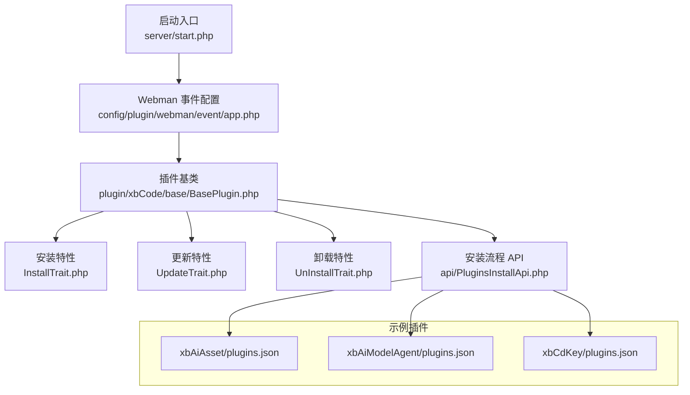
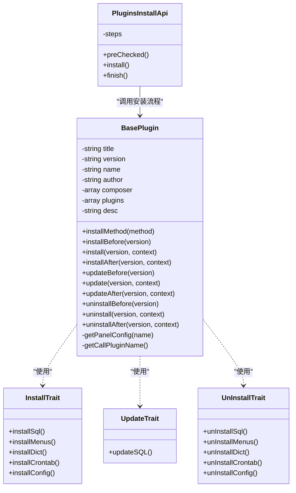
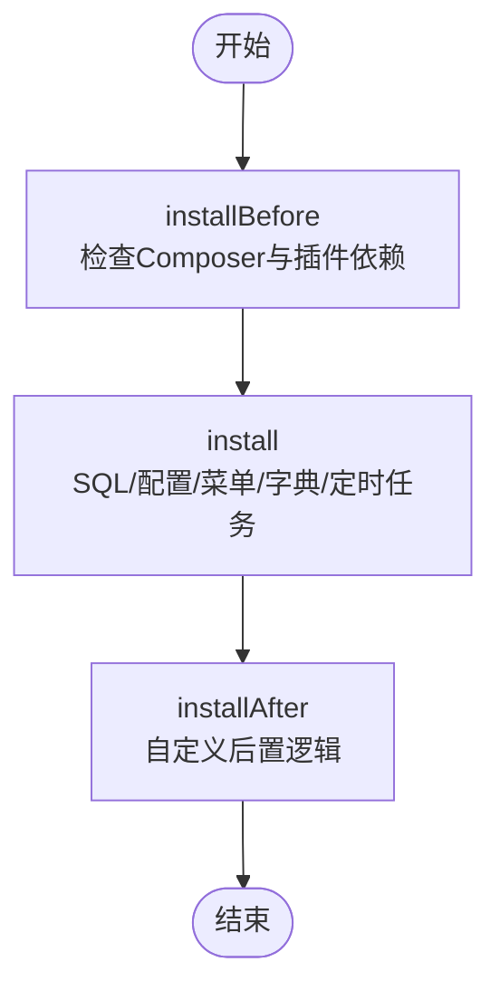
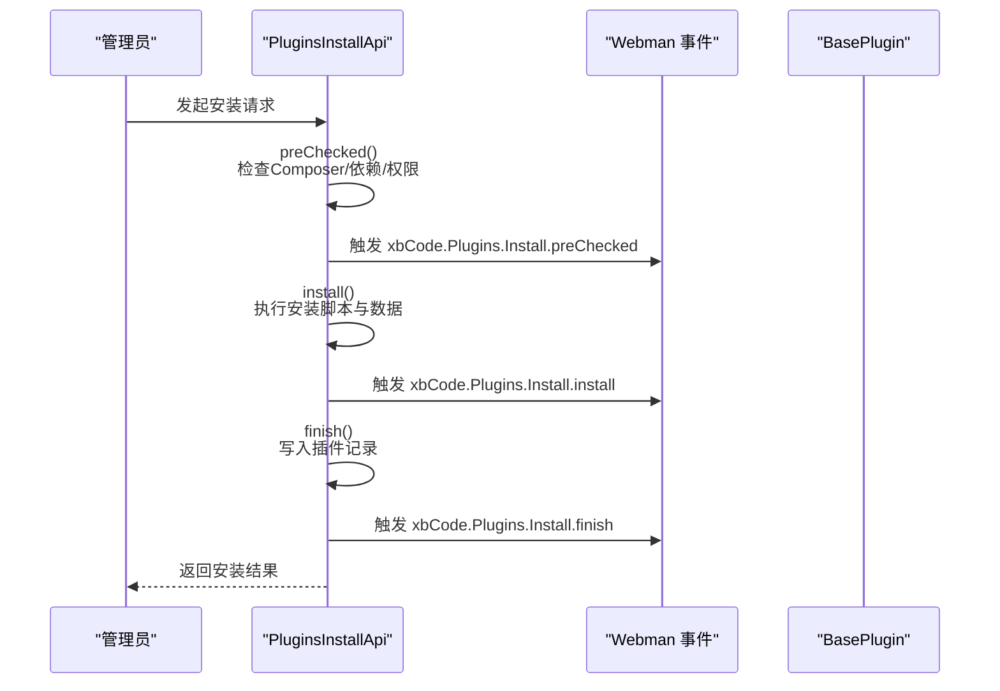
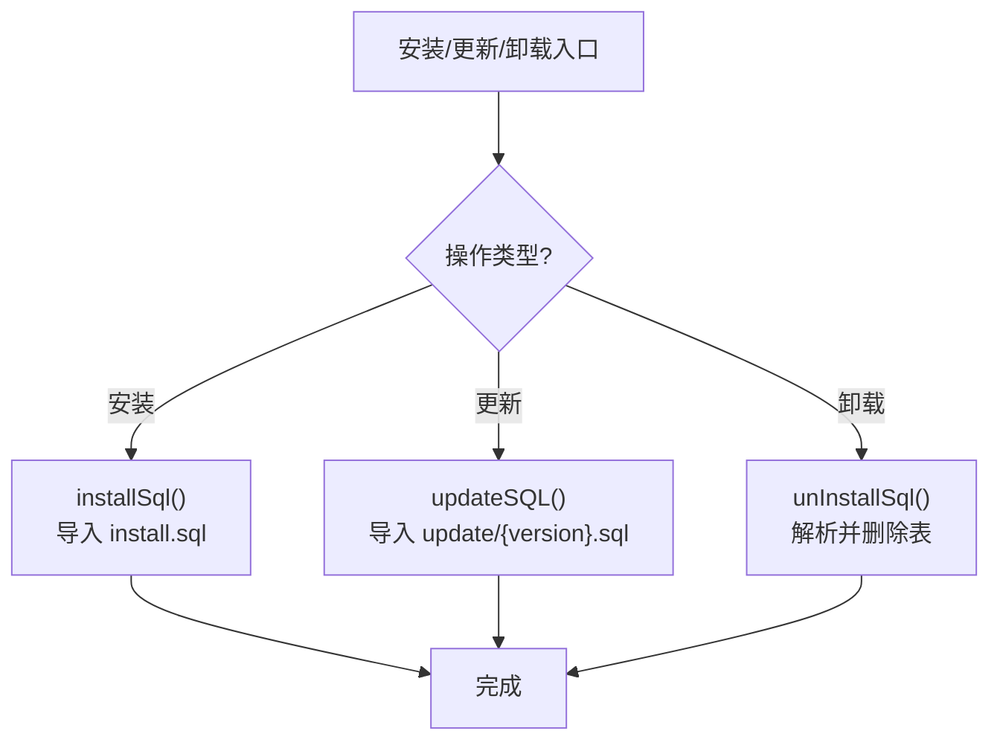
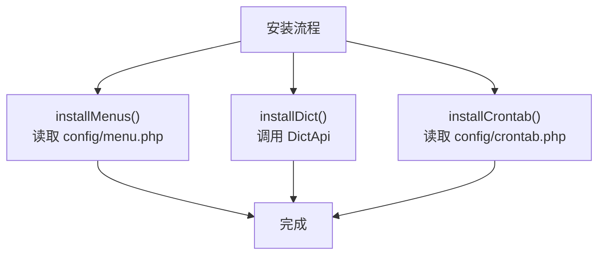
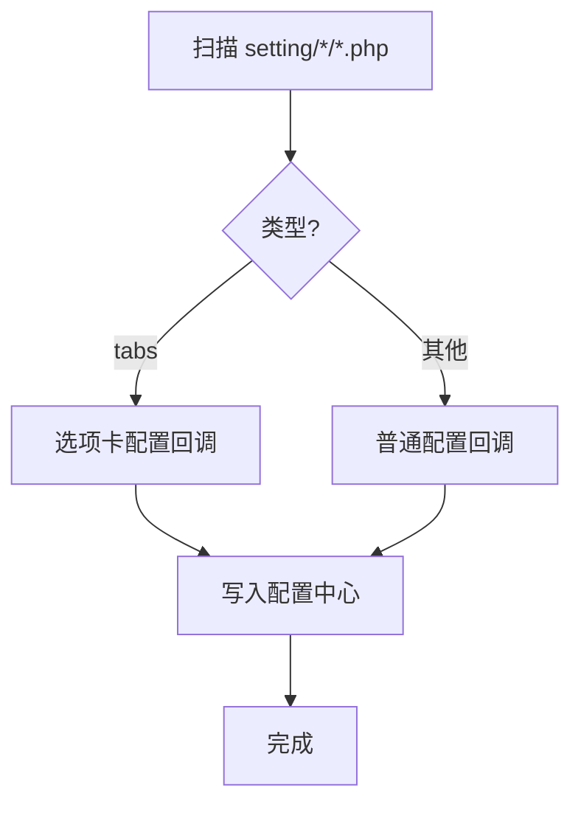
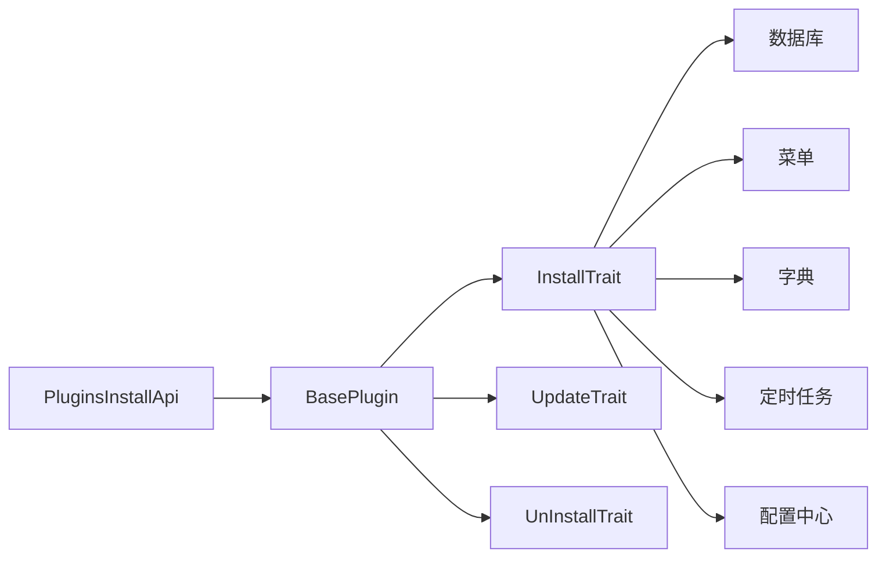

# 插件系统

<cite>
**本文引用的文件**   
- [server/start.php](file://server/start.php)
- [server/config/plugin/webman/event/app.php](file://server/config/plugin/webman/event/app.php)
- [server/plugin/xbCode/base/BasePlugin.php](file://server/plugin/xbCode/base/BasePlugin.php)
- [server/plugin/xbCode/api/PluginsInstallApi.php](file://server/plugin/xbCode/api/PluginsInstallApi.php)
- [server/plugin/xbCode/base/plugin/InstallTrait.php](file://server/plugin/xbCode/base/plugin/InstallTrait.php)
- [server/plugin/xbCode/base/plugin/UpdateTrait.php](file://server/plugin/xbCode/base/plugin/UpdateTrait.php)
- [server/plugin/xbCode/base/plugin/UnInstallTrait.php](file://server/plugin/xbCode/base/plugin/UnInstallTrait.php)
- [server/plugin/xbAiAsset/plugins.json](file://server/plugin/xbAiAsset/plugins.json)
- [server/plugin/xbAiModelAgent/plugins.json](file://server/plugin/xbAiModelAgent/plugins.json)
- [server/plugin/xbCdKey/plugins.json](file://server/plugin/xbCdKey/plugins.json)
- [server/plugin/xbAiAsset/api/Install.php](file://server/plugin/xbAiAsset/api/Install.php)
- [server/plugin/xbAiModelAgent/api/Install.php](file://server/plugin/xbAiModelAgent/api/Install.php)
</cite>

## 目录
1. [简介](#简介)
2. [项目结构](#项目结构)
3. [核心组件](#核心组件)
4. [架构总览](#架构总览)
5. [详细组件分析](#详细组件分析)
6. [依赖分析](#依赖分析)
7. [性能考虑](#性能考虑)
8. [故障排查指南](#故障排查指南)
9. [结论](#结论)
10. [附录](#附录)

## 简介
本文件系统化梳理 Webman 环境下的插件体系，围绕插件架构设计、生命周期管理、注册机制、依赖注入与中间件集成等核心能力展开。同时给出插件目录结构规范、配置文件约定、API 接口定义、数据库迁移、前端资源集成等开发规范，并提供完整的插件开发示例、调试方法与打包发布流程说明。

## 项目结构
插件位于 server/plugin 目录下，每个插件以独立目录组织，包含元数据、安装脚本、配置、路由、控制器、模型、定时任务、设置面板等。基础框架通过统一入口加载并运行应用，插件在安装/更新/卸载时由基类协调执行数据库、菜单、字典、定时任务与配置的初始化或清理。

图示来源
- [server/start.php:1-6](file://server/start.php#L1-L6)
- [server/config/plugin/webman/event/app.php:1-4](file://server/config/plugin/webman/event/app.php#L1-L4)
- [server/plugin/xbCode/base/BasePlugin.php:1-350](file://server/plugin/xbCode/base/BasePlugin.php#L1-L350)
- [server/plugin/xbCode/base/plugin/InstallTrait.php:1-173](file://server/plugin/xbCode/base/plugin/InstallTrait.php#L1-L173)
- [server/plugin/xbCode/base/plugin/UpdateTrait.php:1-48](file://server/plugin/xbCode/base/plugin/UpdateTrait.php#L1-L48)
- [server/plugin/xbCode/base/plugin/UnInstallTrait.php:1-173](file://server/plugin/xbCode/base/plugin/UnInstallTrait.php#L1-L173)
- [server/plugin/xbCode/api/PluginsInstallApi.php:1-122](file://server/plugin/xbCode/api/PluginsInstallApi.php#L1-L122)
- [server/plugin/xbAiAsset/plugins.json:1-9](file://server/plugin/xbAiAsset/plugins.json#L1-L9)
- [server/plugin/xbAiModelAgent/plugins.json:1-9](file://server/plugin/xbAiModelAgent/plugins.json#L1-L9)
- [server/plugin/xbCdKey/plugins.json:1-9](file://server/plugin/xbCdKey/plugins.json#L1-L9)

章节来源
- [server/start.php:1-6](file://server/start.php#L1-L6)
- [server/config/plugin/webman/event/app.php:1-4](file://server/config/plugin/webman/event/app.php#L1-L4)

## 核心组件
- 插件基类：提供统一的安装/更新/卸载生命周期钩子，自动处理依赖检查、Composer 包安装、插件依赖校验、SQL 导入、菜单/字典/定时任务/配置项的初始化与清理。
- 安装流程 API：定义安装步骤（预检、安装数据、完成），在关键节点触发事件，驱动安装过程。
- 安装/更新/卸载特性：将具体操作按职责拆分到 trait，便于复用与维护。
- 插件元数据：plugins.json 描述插件标题、版本、作者、Composer 依赖与其他插件依赖。

章节来源
- [server/plugin/xbCode/base/BasePlugin.php:1-350](file://server/plugin/xbCode/base/BasePlugin.php#L1-L350)
- [server/plugin/xbCode/api/PluginsInstallApi.php:1-122](file://server/plugin/xbCode/api/PluginsInstallApi.php#L1-L122)
- [server/plugin/xbCode/base/plugin/InstallTrait.php:1-173](file://server/plugin/xbCode/base/plugin/InstallTrait.php#L1-L173)
- [server/plugin/xbCode/base/plugin/UpdateTrait.php:1-48](file://server/plugin/xbCode/base/plugin/UpdateTrait.php#L1-L48)
- [server/plugin/xbCode/base/plugin/UnInstallTrait.php:1-173](file://server/plugin/xbCode/base/plugin/UnInstallTrait.php#L1-L173)
- [server/plugin/xbAiAsset/plugins.json:1-9](file://server/plugin/xbAiAsset/plugins.json#L1-L9)
- [server/plugin/xbAiModelAgent/plugins.json:1-9](file://server/plugin/xbAiModelAgent/plugins.json#L1-L9)
- [server/plugin/xbCdKey/plugins.json:1-9](file://server/plugin/xbCdKey/plugins.json#L1-L9)

## 架构总览
插件系统采用“基类 + 特性 + 安装流程 API”的分层设计。启动后，Webman 事件配置启用事件机制；安装流程 API 负责编排安装步骤并在关键阶段触发事件；BasePlugin 通过 InstallTrait/UpdateTrait/UnInstallTrait 实现具体的资源初始化与清理逻辑；各插件通过 plugins.json 声明元数据与依赖，并通过 api/Install.php 扩展自身业务安装逻辑。

图示来源
- [server/plugin/xbCode/base/BasePlugin.php:1-350](file://server/plugin/xbCode/base/BasePlugin.php#L1-L350)
- [server/plugin/xbCode/base/plugin/InstallTrait.php:1-173](file://server/plugin/xbCode/base/plugin/InstallTrait.php#L1-L173)
- [server/plugin/xbCode/base/plugin/UpdateTrait.php:1-48](file://server/plugin/xbCode/base/plugin/UpdateTrait.php#L1-L48)
- [server/plugin/xbCode/base/plugin/UnInstallTrait.php:1-173](file://server/plugin/xbCode/base/plugin/UnInstallTrait.php#L1-L173)
- [server/plugin/xbCode/api/PluginsInstallApi.php:1-122](file://server/plugin/xbCode/api/PluginsInstallApi.php#L1-L122)

## 详细组件分析

### 插件基类与生命周期
- 构造函数：根据调用类的命名空间推断插件名，并从插件信息源读取元数据。
- 安装流程：installBefore 检查 Composer 与插件依赖；install 依次执行 SQL、配置、菜单、字典、定时任务的安装；installAfter 用于后置业务。
- 更新流程：updateBefore/update/updateAfter 支持版本化 SQL 升级。
- 卸载流程：uninstallBefore 检查是否被其他插件依赖；uninstall 依次清理配置、菜单、字典、定时任务与数据库；uninstallAfter 用于收尾。
- 辅助方法：getPanelConfig 读取设置面板配置；getCallPluginName 反射获取插件标识。

图示来源
- [server/plugin/xbCode/base/BasePlugin.php:136-202](file://server/plugin/xbCode/base/BasePlugin.php#L136-L202)
- [server/plugin/xbCode/base/plugin/InstallTrait.php:33-173](file://server/plugin/xbCode/base/plugin/InstallTrait.php#L33-L173)

章节来源
- [server/plugin/xbCode/base/BasePlugin.php:96-109](file://server/plugin/xbCode/base/BasePlugin.php#L96-L109)
- [server/plugin/xbCode/base/BasePlugin.php:136-202](file://server/plugin/xbCode/base/BasePlugin.php#L136-L202)
- [server/plugin/xbCode/base/BasePlugin.php:211-249](file://server/plugin/xbCode/base/BasePlugin.php#L211-L249)
- [server/plugin/xbCode/base/BasePlugin.php:258-305](file://server/plugin/xbCode/base/BasePlugin.php#L258-L305)
- [server/plugin/xbCode/base/BasePlugin.php:315-349](file://server/plugin/xbCode/base/BasePlugin.php#L315-L349)

### 安装流程 API 与事件
- 安装步骤：预检插件、安装数据、安装完成。
- 预检：检查 Composer 路径、插件元数据、插件依赖、目录权限，触发 preChecked 事件。
- 安装数据：执行脚本与安装动作，触发 install 事件。
- 安装完成：写入插件记录，触发 finish 事件。

图示来源
- [server/plugin/xbCode/api/PluginsInstallApi.php:29-121](file://server/plugin/xbCode/api/PluginsInstallApi.php#L29-L121)
- [server/config/plugin/webman/event/app.php:1-4](file://server/config/plugin/webman/event/app.php#L1-L4)

章节来源
- [server/plugin/xbCode/api/PluginsInstallApi.php:53-83](file://server/plugin/xbCode/api/PluginsInstallApi.php#L53-L83)
- [server/plugin/xbCode/api/PluginsInstallApi.php:91-100](file://server/plugin/xbCode/api/PluginsInstallApi.php#L91-L100)
- [server/plugin/xbCode/api/PluginsInstallApi.php:109-121](file://server/plugin/xbCode/api/PluginsInstallApi.php#L109-L121)

### 数据库迁移与版本升级
- 安装：从 install.sql 导入表结构，自动替换前缀。
- 更新：从 update/{version}.sql 执行版本化升级脚本。
- 卸载：解析 install.sql 中的表名并批量删除。

图示来源
- [server/plugin/xbCode/base/plugin/InstallTrait.php:33-45](file://server/plugin/xbCode/base/plugin/InstallTrait.php#L33-L45)
- [server/plugin/xbCode/base/plugin/UpdateTrait.php:28-47](file://server/plugin/xbCode/base/plugin/UpdateTrait.php#L28-L47)
- [server/plugin/xbCode/base/plugin/UnInstallTrait.php:33-46](file://server/plugin/xbCode/base/plugin/UnInstallTrait.php#L33-L46)

章节来源
- [server/plugin/xbCode/base/plugin/InstallTrait.php:33-45](file://server/plugin/xbCode/base/plugin/InstallTrait.php#L33-L45)
- [server/plugin/xbCode/base/plugin/UpdateTrait.php:28-47](file://server/plugin/xbCode/base/plugin/UpdateTrait.php#L28-L47)
- [server/plugin/xbCode/base/plugin/UnInstallTrait.php:33-46](file://server/plugin/xbCode/base/plugin/UnInstallTrait.php#L33-L46)

### 菜单、字典与定时任务集成
- 菜单：从 config/menu.php 读取并安装至系统菜单。
- 字典：若已安装字典插件，则自动导入字典数据。
- 定时任务：若已安装定时任务插件且存在配置，则自动注册任务。

图示来源
- [server/plugin/xbCode/base/plugin/InstallTrait.php:53-109](file://server/plugin/xbCode/base/plugin/InstallTrait.php#L53-L109)

章节来源
- [server/plugin/xbCode/base/plugin/InstallTrait.php:53-68](file://server/plugin/xbCode/base/plugin/InstallTrait.php#L53-L68)
- [server/plugin/xbCode/base/plugin/InstallTrait.php:76-84](file://server/plugin/xbCode/base/plugin/InstallTrait.php#L76-L84)
- [server/plugin/xbCode/base/plugin/InstallTrait.php:92-109](file://server/plugin/xbCode/base/plugin/InstallTrait.php#L92-L109)

### 配置项与设置面板
- 普通配置与选项卡配置：扫描 setting/*/*.php，解析字段并写入配置中心。
- 设置面板：读取 setting/tabs/panel.php 渲染后台面板。

图示来源
- [server/plugin/xbCode/base/plugin/InstallTrait.php:117-172](file://server/plugin/xbCode/base/plugin/InstallTrait.php#L117-L172)
- [server/plugin/xbCode/base/BasePlugin.php:315-329](file://server/plugin/xbCode/base/BasePlugin.php#L315-L329)

章节来源
- [server/plugin/xbCode/base/plugin/InstallTrait.php:117-172](file://server/plugin/xbCode/base/plugin/InstallTrait.php#L117-L172)
- [server/plugin/xbCode/base/BasePlugin.php:315-329](file://server/plugin/xbCode/base/BasePlugin.php#L315-L329)

### 插件元数据与依赖声明
- plugins.json 字段：title、desc、version、author、home_url、composer、plugins。
- 依赖检查：安装前置会校验 composer 包与插件依赖，必要时自动安装。

章节来源
- [server/plugin/xbAiAsset/plugins.json:1-9](file://server/plugin/xbAiAsset/plugins.json#L1-L9)
- [server/plugin/xbAiModelAgent/plugins.json:1-9](file://server/plugin/xbAiModelAgent/plugins.json#L1-L9)
- [server/plugin/xbCdKey/plugins.json:1-9](file://server/plugin/xbCdKey/plugins.json#L1-L9)
- [server/plugin/xbCode/base/BasePlugin.php:136-154](file://server/plugin/xbCode/base/BasePlugin.php#L136-L154)

### 插件安装类示例
- 简单示例：xbAiAsset 的 Install 仅调用父类默认流程。
- 扩展示例：xbAiModelAgent 的 Install 在默认流程后导入模型与分组数据。

章节来源
- [server/plugin/xbAiAsset/api/Install.php:19-62](file://server/plugin/xbAiAsset/api/Install.php#L19-L62)
- [server/plugin/xbAiModelAgent/api/Install.php:21-144](file://server/plugin/xbAiModelAgent/api/Install.php#L21-L144)

## 依赖分析
- 内部依赖：BasePlugin 依赖 InstallTrait/UpdateTrait/UnInstallTrait；安装流程 API 依赖事件系统与插件信息源。
- 外部依赖：数据库（ThinkORM）、菜单、字典、定时任务、配置中心等插件服务。
- 耦合关系：安装/卸载流程对菜单、字典、定时任务为可选依赖，未安装时跳过相应步骤。

图示来源
- [server/plugin/xbCode/base/BasePlugin.php:1-350](file://server/plugin/xbCode/base/BasePlugin.php#L1-L350)
- [server/plugin/xbCode/base/plugin/InstallTrait.php:1-173](file://server/plugin/xbCode/base/plugin/InstallTrait.php#L1-L173)
- [server/plugin/xbCode/base/plugin/UpdateTrait.php:1-48](file://server/plugin/xbCode/base/plugin/UpdateTrait.php#L1-L48)
- [server/plugin/xbCode/base/plugin/UnInstallTrait.php:1-173](file://server/plugin/xbCode/base/plugin/UnInstallTrait.php#L1-L173)
- [server/plugin/xbCode/api/PluginsInstallApi.php:1-122](file://server/plugin/xbCode/api/PluginsInstallApi.php#L1-L122)

章节来源
- [server/plugin/xbCode/base/BasePlugin.php:1-350](file://server/plugin/xbCode/base/BasePlugin.php#L1-L350)
- [server/plugin/xbCode/base/plugin/InstallTrait.php:1-173](file://server/plugin/xbCode/base/plugin/InstallTrait.php#L1-L173)
- [server/plugin/xbCode/base/plugin/UpdateTrait.php:1-48](file://server/plugin/xbCode/base/plugin/UpdateTrait.php#L1-L48)
- [server/plugin/xbCode/base/plugin/UnInstallTrait.php:1-173](file://server/plugin/xbCode/base/plugin/UnInstallTrait.php#L1-L173)
- [server/plugin/xbCode/api/PluginsInstallApi.php:1-122](file://server/plugin/xbCode/api/PluginsInstallApi.php#L1-L122)

## 性能考虑
- 安装前置缓存：依赖检查与 Composer 安装可能耗时，建议在预检阶段尽早失败并提示。
- 批量操作优化：数据库导入与表删除应批量执行，避免逐条操作。
- 事件解耦：通过事件分发降低安装流程与业务逻辑的耦合，提升可维护性。
- 资源隔离：插件间尽量通过接口与事件交互，减少直接依赖。

## 故障排查指南
- 安装失败回滚：安装过程中异常会尝试执行卸载以恢复状态，需关注错误日志定位问题。
- 权限问题：确保插件目录可读可写。
- 依赖缺失：检查 Composer 与插件依赖是否满足。
- 事件未触发：确认事件配置已启用。

章节来源
- [server/plugin/xbCode/base/BasePlugin.php:177-186](file://server/plugin/xbCode/base/BasePlugin.php#L177-L186)
- [server/plugin/xbCode/api/PluginsInstallApi.php:64-72](file://server/plugin/xbCode/api/PluginsInstallApi.php#L64-L72)
- [server/config/plugin/webman/event/app.php:1-4](file://server/config/plugin/webman/event/app.php#L1-L4)

## 结论
该插件系统通过清晰的层次划分与标准化的生命周期管理，实现了插件的可插拔、可扩展与易维护。借助事件机制与特性化实现，插件可以专注于自身业务逻辑，而将通用流程交由框架处理。遵循本文档的目录结构与配置规范，可快速构建高质量插件。

## 附录

### 插件目录结构规范
- 根目录：插件标识目录，如 plugin/xbXxx。
- 元数据：plugins.json（标题、版本、作者、依赖）。
- 安装脚本：api/Install.php（继承 BasePlugin，扩展安装/更新/卸载逻辑）。
- 配置：config/ 下包含 menu.php、crontab.php、middleware.php、route.php、static.php、view.php、translation.php、dict.php、exception.php、log.php、redis.php、app.php、autoload.php、container.php、process.php、setting.php、xbcode.php 等。
- 设置面板：setting/tabs/panel.php 与 setting/config/*/*.php。
- 数据库：install.sql、update/{version}.sql。
- 静态资源：public/ 下放置前端资源。
- 业务代码：app/ 下按 admin、api、home 等模块组织。

章节来源
- [server/plugin/xbCode/base/plugin/InstallTrait.php:53-109](file://server/plugin/xbCode/base/plugin/InstallTrait.php#L53-L109)
- [server/plugin/xbCode/base/plugin/InstallTrait.php:117-172](file://server/plugin/xbCode/base/plugin/InstallTrait.php#L117-L172)
- [server/plugin/xbCode/base/BasePlugin.php:315-329](file://server/plugin/xbCode/base/BasePlugin.php#L315-L329)

### 配置文件格式要点
- plugins.json：必须包含 title、version、author；可选 home_url、composer、plugins。
- config/menu.php：菜单数组，安装时由 Menus::install 处理。
- config/crontab.php：定时任务配置，安装时由 CrontabApi::make()->install 处理。
- setting/*/*.php：配置项数组，包含 name、type、value 等字段，支持 tabs 分组。

章节来源
- [server/plugin/xbAiAsset/plugins.json:1-9](file://server/plugin/xbAiAsset/plugins.json#L1-L9)
- [server/plugin/xbCode/base/plugin/InstallTrait.php:53-68](file://server/plugin/xbCode/base/plugin/InstallTrait.php#L53-L68)
- [server/plugin/xbCode/base/plugin/InstallTrait.php:92-109](file://server/plugin/xbCode/base/plugin/InstallTrait.php#L92-L109)
- [server/plugin/xbCode/base/plugin/InstallTrait.php:117-172](file://server/plugin/xbCode/base/plugin/InstallTrait.php#L117-L172)

### API 接口定义建议
- 安装流程：通过 PluginsInstallApi 提供的步骤进行安装，可在 preChecked/install/finish 中扩展校验与通知。
- 插件管理：结合 PluginsController 与相关 API 类进行导入、安装、卸载等操作。
- 事件扩展：在关键节点触发事件，供监听器执行额外逻辑。

章节来源
- [server/plugin/xbCode/api/PluginsInstallApi.php:29-121](file://server/plugin/xbCode/api/PluginsInstallApi.php#L29-L121)

### 数据库迁移规范
- 安装脚本：install.sql 使用标准 SQL，支持表前缀替换。
- 版本升级：update/{version}.sql 存放增量变更。
- 卸载清理：基于 install.sql 解析表名并批量删除。

章节来源
- [server/plugin/xbCode/base/plugin/InstallTrait.php:33-45](file://server/plugin/xbCode/base/plugin/InstallTrait.php#L33-L45)
- [server/plugin/xbCode/base/plugin/UpdateTrait.php:28-47](file://server/plugin/xbCode/base/plugin/UpdateTrait.php#L28-L47)
- [server/plugin/xbCode/base/plugin/UnInstallTrait.php:33-46](file://server/plugin/xbCode/base/plugin/UnInstallTrait.php#L33-L46)

### 前端资源集成
- 静态资源：放入插件 public/ 目录，通过静态资源配置访问。
- 视图模板：通过 view.php 配置视图路径。
- 翻译文件：通过 translation.php 配置多语言资源。

章节来源
- [server/plugin/xbCode/base/BasePlugin.php:315-329](file://server/plugin/xbCode/base/BasePlugin.php#L315-L329)

### 插件开发示例
- 最小可用插件：创建 plugins.json 与 api/Install.php，继承 BasePlugin 并调用父类默认流程。
- 扩展数据导入：参考 xbAiModelAgent 的 Install，在默认流程后导入初始数据。

章节来源
- [server/plugin/xbAiAsset/api/Install.php:19-62](file://server/plugin/xbAiAsset/api/Install.php#L19-L62)
- [server/plugin/xbAiModelAgent/api/Install.php:21-144](file://server/plugin/xbAiModelAgent/api/Install.php#L21-L144)

### 调试方法
- 查看错误日志：安装/更新/卸载过程中的异常会被记录，便于定位问题。
- 事件监听：在 preChecked/install/finish 事件中输出上下文信息。
- 权限检查：确认插件目录可读可写。

章节来源
- [server/plugin/xbCode/base/BasePlugin.php:177-186](file://server/plugin/xbCode/base/BasePlugin.php#L177-L186)
- [server/plugin/xbCode/api/PluginsInstallApi.php:77-82](file://server/plugin/xbCode/api/PluginsInstallApi.php#L77-L82)
- [server/plugin/xbCode/api/PluginsInstallApi.php:94-99](file://server/plugin/xbCode/api/PluginsInstallApi.php#L94-L99)
- [server/plugin/xbCode/api/PluginsInstallApi.php:118-120](file://server/plugin/xbCode/api/PluginsInstallApi.php#L118-L120)

### 打包发布流程
- 准备元数据：完善 plugins.json 中的信息与依赖。
- 编写安装脚本：在 api/Install.php 中实现必要的初始化逻辑。
- 准备资源：整理 public/、config/、data/ 等资源。
- 测试验证：在本地环境执行安装/更新/卸载全流程，检查日志与数据一致性。
- 发布：将插件目录提交至仓库或打包分发。

[本节为通用流程说明，不直接分析具体文件]